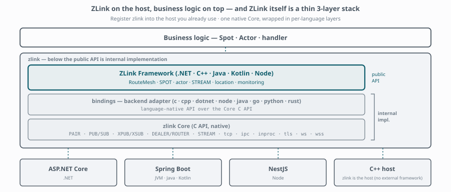

**English** | [한국어](./README.ko.md)

# zlink

> A messaging engine, bindings for seven languages, and a real-time messaging
> framework — for services that manage connections, state, and routing together.

[](https://github.com/zlink-systems/zlink/actions/workflows/build.yml)
[](./doc/license/README.md)

| | |
|---|---|
| **Website** | [zlink.systems](https://zlink.systems/) |
| **Guides and API reference** | [zlink.systems](https://zlink.systems/) |
| **Installation** | [zlink.systems/install](https://zlink.systems/install/) |

The website owns the product documentation — guides, tutorials, and the API
reference. This page describes the repository: what it contains, how it is
layered, and how to build it from source.

## What is zlink

zlink is a messaging platform built in three layers. Each layer is usable on its
own, and each one adds a level of abstraction over the one below it.

| Layer | Responsibility | Languages |
|---|---|---|
| [`core/`](./core/) | Native Boost.Asio messaging engine and the public C API | C |
| [`bindings/`](./bindings/) | Language-native APIs and resource lifetime models over Core | C++, .NET, Java, Node.js, Python, Go, Rust |
| [`framework/`](./framework/) | Typed handlers, routing, stateful runtime units, and the location runtime | C++, .NET, JVM (Java/Kotlin), Node.js |

<picture>
  <source media="(prefers-color-scheme: dark)" srcset="./doc/assets/layer-stack-dark.svg">
  
</picture>

**Core** is a native messaging engine derived from
[libzmq](https://github.com/zeromq/libzmq) v4.3.5 and rebuilt around Boost.Asio
and a focused set of messaging patterns — PAIR, PUB/SUB, XPUB/XSUB,
DEALER/ROUTER, and STREAM sockets over `tcp`, `ipc`, `inproc`, `tls`, `ws`, and
`wss`, with routing IDs, socket monitoring, and backpressure. Start here when you
want to compose sockets and transports directly.

**Framework** builds on top of a Binding and connects the messaging layer to an
application host's lifecycle and dependency injection. In the same way that
Spring MVC adds a web layer to Spring, ZLink Framework adds a real-time
messaging layer to ASP.NET Core, Spring Boot, and NestJS; for C++, the zlink
framework host supplies the DI, configuration, HTTP hosting, and process
lifecycle itself. Start here when you want to build distributed real-time
services rather than wire sockets yourself.

## Why zlink

A real-time service has to solve connection management, state ownership, and
routing at the same time — and the three keep colliding. A room lives on one
process, a player's session lives on another, a request has to reach whichever
node currently owns the state, and all of it has to survive reconnects and
rolling restarts. Most stacks leave that to application code.

Framework provides those pieces as first-class runtime concepts. Applications
define typed handlers and clients; Framework manages transport connections, peer
discovery, location resolution, routing, reconnects, packet codecs, and reply
correlation.

| Capability | Purpose |
|---|---|
| **Channel / RouteMesh** | Find services by logical ChannelName and carry inter-server requests, replies, commands, and events |
| **Spot** | Process stateful units such as rooms, stages, and zones in a serialized execution context |
| **Actor** | Manage lifecycle, session binding, and relocation for state objects representing connections or users |
| **STREAM** | Manage external TCP/TLS/WS/WSS client lifecycles, framing, and packet dispatch |
| **Location runtime** | Discover current service, Spot, and Actor locations and maintain connections |
| **Graceful drain** | Restrict new work and shut down while accounting for in-flight work and state movement |

This fits real-time game servers, long-lived stateful services, and distributed
services implemented in several languages at once. Room, zone, match, and
actor-based topologies are composed from the same RouteMesh, Spot, Actor, and
STREAM primitives.

## A quick look

A server that owns the `greeting` channel — registration, then the handler:

```csharp
// Server — registers a handler and announces that it serves "greeting".
builder.Services.AddZLinkFramework(options =>
{
    options.AddHandlersFromAssemblyOf<Program>();

    var mesh = options.AddRouteMesh("services").Listen("tcp://0.0.0.0:7101");
    mesh.Channel("greeting").Server();
});

public sealed class HelloHandler : IZLinkRequestHandler<Hello, Greeting>
{
    public ValueTask<Greeting> HandleAsync(
        Hello request, IZLinkMessageContext context, CancellationToken cancellationToken)
        => ValueTask.FromResult(new Greeting($"hello, {request.Name}"));
}
```

A client calls `greeting` without naming a node — which process handles it is
resolved at runtime. The same registration and handler shape exists in C++,
Java, Kotlin, and TypeScript; see
[Installation and first run](https://zlink.systems/dotnet/guide/server/02-getting-started/)
and switch language at the top of the chapter.

## Performance

Messaging throughput and latency are measured against gRPC across the Framework
languages, with the benchmark specification and the per-language results
published together: [gRPC comparison report](https://zlink.systems/bench/comparison/).

## Language support

**ZLink Framework — four runtimes.** Each is implemented independently in its
host language. They share no native service runtime and no service C ABI — only
public contracts, a versioned wire protocol, and shared verification fixtures,
so a .NET service and a Java service talk to each other over the same mesh.

| Runtime | Application host | Install |
|---|---|---|
| .NET / C# | ASP.NET Core | `dotnet add package Zlink.Framework.AspNetCore` |
| JVM — Java, Kotlin | Spring Boot | `systems.zlink:zlink-framework-spring-boot-starter` |
| Node.js — TypeScript, JavaScript | NestJS | `npm install @zlink-systems/framework @zlink-systems/nestjs` |
| C++ | zlink framework host | vcpkg port `zlink-framework` |

**Bindings — seven languages.** For composing Core sockets and transports
directly, without Framework. Each package bundles a platform-native Core, so
nothing is built from this repository.

| Language | Install |
|---|---|
| C++ | vcpkg / Conan package `zlink` |
| .NET / C# | `dotnet add package Zlink` |
| Java, Kotlin | `systems.zlink:zlink` |
| Node.js, JavaScript | `npm install @zlink-systems/zlink` |
| Python | `pip install zlink` |
| Go | `go get zlink.systems/zlink` |
| Rust | `cargo add zlink` |

C is the public Core API rather than a separate Binding. Each Binding carries
samples for PAIR, PUB/SUB, DEALER/ROUTER, request/reply, STREAM, and monitoring.

Installation procedures and each language's five-minute example are on the
[Installation](https://zlink.systems/install/) page and in the
[Bindings guide](https://zlink.systems/bindings/guide/). The formal contracts are
the [Core specification](https://zlink.systems/spec/) and the
[common Framework specification](https://zlink.systems/common/spec/server/).

## Building from source

Building from the repository is for working on zlink itself, or for linking
against an unreleased revision.

**Requirements** — CMake 3.10+, a C++17 compiler (GCC 7+, Clang 5+, MSVC 2017+),
and OpenSSL when TLS/WSS is enabled. Framework runtimes additionally need the
toolchain of their host language.

Core provides x64 and ARM64 build paths for Linux, macOS, and Windows. Consult
each language document for the runtime support, package formats, and
platform-specific constraints of its Binding or Framework implementation.

Start with the five-minute build in the
[contributor handbook](./CONTRIBUTING.md#1-five-minute-start) — it clones,
builds Core with tests, and runs a Binding smoke test. Detailed procedures live
per layer:

| Layer | Build documentation |
|---|---|
| Core | [Build guide](./doc/building/build-guide.md) · [CMake options](./doc/building/cmake-options.md) |
| Bindings | [Local Core and Bindings](./doc/building/local-core-bindings.ko.md) (Korean) · [local package runner](./scripts/local-package/README.ko.md) (Korean) |
| Framework | [Framework workspace layout](./doc/building/framework-workspace.md), then the source root for [C++](./framework/languages/cpp/), [.NET](./framework/languages/dotnet/), [JVM](./framework/languages/java/), or [Node.js](./framework/languages/node/) |
| Packaging and release | [Packaging guide](./doc/building/packaging.md) · [Build and release pipeline](./doc/building/release-pipeline.md) |

A successful Core build, a language package build, clean-consumer validation,
and a real client/server sample run are separate validation stages. Before
deployment, run the build, test, and sample procedures for the layers and
languages you use.

## Repository layout

| Path | Contents |
|---|---|
| [`core/`](./core/) | Core engine, the public C API (`core/include`), and Core tests |
| [`bindings/`](./bindings/) | Seven language Bindings, each with samples under `bindings/<lang>/samples` |
| [`framework/`](./framework/) | Four Framework runtimes under `framework/languages/`, with samples per language |
| [`doc/`](./doc/) | Repository documentation — [index](./doc/README.md), design principles, build and release |
| [`scripts/`](./scripts/) | Local packaging, gates, and performance measurement tooling |

Framework samples run clients and multiple server roles to validate complete
application scenarios rather than individual API calls; read the
[common sample contract](./framework/doc/framework/common/sample/README.en.md)
before picking a language implementation.

## Contributing

Read the [contributor handbook](./CONTRIBUTING.md) first — it covers the build,
code and documentation rules, the pre-commit gates, and the branch, commit, PR,
and release procedure. Issues and pull requests are welcome.

## License

Licensing differs by repository layer.

| Scope | License |
|---|---|
| `core/`, `bindings/` | [Mozilla Public License 2.0](./LICENSE) |
| `framework/` | [Functional Source License 1.1, ALv2 Future License](./framework/LICENSE) |
| Language-specific Framework `http-client` packages | Apache License 2.0 |

See the [license guide](./doc/license/README.md) and
[THIRD_PARTY_NOTICES.md](./THIRD_PARTY_NOTICES.md) for detailed terms, the
two-year Apache License 2.0 conversion policy, and redistribution notices.

Based on [libzmq](https://github.com/zeromq/libzmq) — Copyright (c) 2007-2024
Contributors as noted in [`core/AUTHORS`](./core/AUTHORS).
