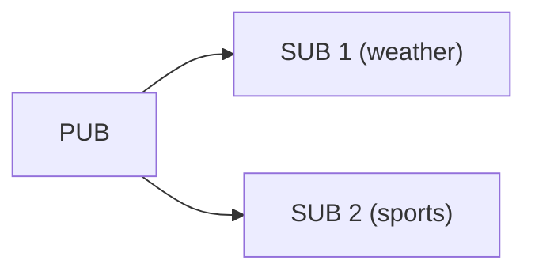
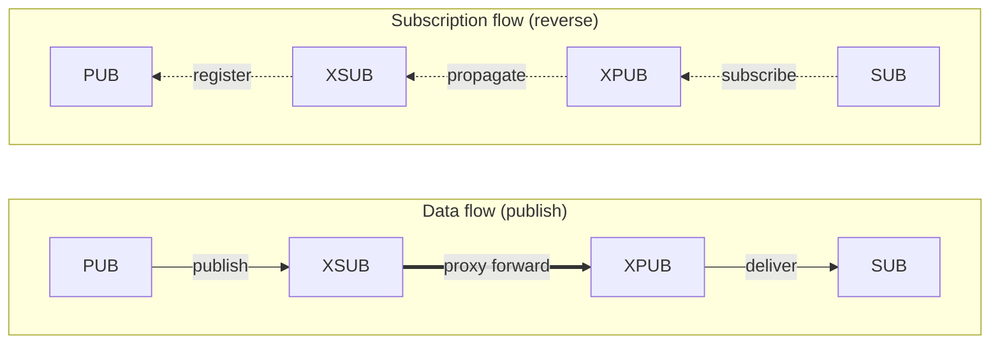

[English](03-2-pubsub.en.md) | [한국어](03-2-pubsub.ko.md)

<!-- zlink-nav:start -->
[← PAIR](03-1-pair.en.md) | [DEALER →](03-3-dealer.en.md)
<!-- zlink-nav:end -->

# PUB/SUB/XPUB/XSUB Publish-Subscribe

## 1. Overview

The Publish-Subscribe pattern distributes messages based on topics. zlink provides two levels: basic PUB/SUB and advanced XPUB/XSUB.

| Socket | Role | Characteristics |
|------|------|------|
| **PUB** | Publisher | Broadcasts to all subscribers. Cannot receive. |
| **SUB** | Subscriber | Topic prefix match filtering. Cannot send. |
| **XPUB** | Advanced Publisher | PUB + can receive subscription events |
| **XSUB** | Advanced Subscriber | Receives all messages without local filtering |

**Valid socket combinations:**
- PUB → SUB, PUB → XSUB
- XPUB → SUB, XPUB → XSUB

### SUB vs XSUB — Key Difference

Both SUB and XSUB send subscription info to the upstream PUB via
`zlink_set_subscription()`. The public API usage is identical.
The difference is **whether the local filter engine is on or off**.

| | SUB (`filter=true`) | XSUB (`filter=false`) |
|---|---|---|
| With subscriptions | Receives only matching messages | **Receives all messages** (no filter check) |
| No subscriptions | **Receives nothing** | **Receives all messages** |
| `""` empty subscription | Receives all (matches every topic) | Already receives all without subscribing |
| Use case | Normal subscriber | Proxy/relay (pass-through) |

Internally, `xsub_t::xrecv()` checks `!options.filter || match(msg)`.
SUB (`filter=true`) evaluates `match()` on every message;
XSUB (`filter=false`) evaluates `!false = true` and skips `match()` entirely.

> **Common confusion:** "If I subscribe SUB with `""`, isn't it the same as XSUB?"
> → Both receive all messages in practice, but
> SUB incurs trie match cost on every message while XSUB skips the check.
> Also, SUB with **no subscriptions** receives nothing,
> while XSUB with no subscriptions still receives everything.

**Why XSUB/XPUB in the proxy pattern:**


- XSUB passes all messages from PUB without subscription state.
- XPUB exposes SUB subscription events via `zlink_xpub_recv_part()`,
  allowing the proxy to inject subscription management logic
  (filtering, logging, authorization, etc.).
- Plain SUB/PUB cannot build this relay structure.



---

# Part I: PUB/SUB

## 2. PUB/SUB Basic Usage

### Publisher (PUB)

```c
void *pub = zlink_socket(ctx, ZLINK_SOCKET_PUB);
zlink_bind(pub, "tcp://*:5556");

/* Publish message -- dropped if there are no subscribers */
zlink_msg_t part;
zlink_msg_init_size(&part, 14);
memcpy(zlink_msg_data(&part), "weather: sunny", 14);
zlink_publish(pub, NULL, &part, 1, 0);
```

### Subscriber (SUB)

```c
void on_topic(const zlink_routing_id_t *source_rid,
              const char *topic, size_t topic_len,
              zlink_msg_t *parts, size_t part_count,
              void *userdata)
{
    printf("Topic: %.*s, Data: %.*s\n",
           (int)topic_len, topic,
           (int)zlink_msg_size(&parts[0]),
           (char *)zlink_msg_data(&parts[0]));
    for (size_t i = 0; i < part_count; i++)
        zlink_msg_close(&parts[i]);
}

void *sub = zlink_socket(ctx, ZLINK_SOCKET_SUB);
zlink_connect(sub, "tcp://127.0.0.1:5556");

/* Subscribe to topic -- set after connect */
zlink_set_subscription(sub, "weather");

/* Use zlink_subscribe() (typically inside a poller loop) to receive */
```

> Reference: `core/tests/integration/test_pubsub.cpp` -- empty subscription ("") → receives all messages

### Sending and Receiving Summary

| Socket | Direction | Receive API | Notes |
|--------|-----------|-------------|-------|
| PUB | Send only | N/A | Cannot receive (`ZLINK_RECV_NOT_SUPPORTED`) |
| SUB | Receive only | `zlink_subscribe()` | Topic + data separated |
| XPUB | Bidirectional | `zlink_xpub_recv_part()` | Receives subscription events |
| XSUB | Receive only | `zlink_subscribe()` | No local filter; receives all |

> **Note:** `zlink_send()` / `zlink_recv()` return
> `ZLINK_SUBMIT_NOT_SUPPORTED` / `ZLINK_RECV_NOT_SUPPORTED` on all 4
> PUB/SUB sockets. Use `zlink_publish()` for publishing and
> `zlink_subscribe()` for receiving.

SUB / XSUB are recv-only types. The intended pattern is to observe
`ZLINK_POLLIN` from a poller and then pull topic messages with
`zlink_subscribe()`. No direct topic callback surface is provided.

> **PUB / XPUB default:** `ZLINK_PUB_OPT_NODROP` defaults to `0`.
> When the HWM is reached, the message for that subscriber is silently
> dropped and `zlink_publish()` reports success. Callers that need
> backpressure instead of dropping must set `ZLINK_PUB_OPT_NODROP` to `1`
> explicitly.

> When PUB's send queue is full (HWM), the default
> (`ZLINK_PUB_OPT_NODROP=0`) silently drops the message for that
> subscriber. For details, see [Performance Guide](10-performance.en.md).

## 3. Topic Filtering

Topic filtering in SUB sockets uses **prefix matching**.

| Subscription Topic | Received Message | Match |
|-----------|-------------|:----:|
| `"weather"` | `"weather: sunny"` | O |
| `"weather"` | `"weathering storm"` | O |
| `"weather"` | `"sports: baseball"` | X |
| `""` (empty string) | All messages | O |

### Multiple Topic Subscriptions

```c
/* Subscribe to multiple topics */
zlink_set_subscription(sub, "weather");
zlink_set_subscription(sub, "sports");

/* Unsubscribe */
zlink_unset_subscription(sub, "sports");
```

### Empty Subscription (All Messages)

```c
/* Subscribe with empty string -- receives all messages */
zlink_set_subscription(sub, "");
```

> Reference: `core/tests/integration/test_pubsub.cpp` -- `zlink_set_subscription(subscriber, "")`

## 4. Message Format

`zlink_publish()` takes a **topic** and a **multipart message** as
separate parameters. Like `zlink_send()` on other sockets, multipart
is the default.

```c
int zlink_publish (void *subject,
                   const char *topic_id,      /* topic string */
                   zlink_msg_t *parts,         /* data frame array */
                   size_t part_count,           /* number of frames */
                   zlink_send_flags_t flags);
```

```c
/* Publish: topic = "sensor:cpu", payload = 2 frames */
zlink_msg_t parts[2];
zlink_msg_init_size(&parts[0], 4);
memcpy(zlink_msg_data(&parts[0]), "host", 4);
zlink_msg_init_size(&parts[1], 2);
memcpy(zlink_msg_data(&parts[1]), "73", 2);
zlink_publish(pub, "sensor:cpu", parts, 2, 0);

/* SUB receives (zlink_subscribe or subscribe_handler callback):
   topic     = "sensor:cpu"
   parts[0]  = "host"
   parts[1]  = "73" */
```

The topic is sent on the wire as the first frame. `zlink_subscribe()`
separates the topic from data on the receive side. Callers never need to
assemble topic frames manually.

> **Note:** Passing `NULL` as topic (`zlink_publish(pub, NULL, parts, ...)`)
> activates a compatibility path where parts[0] is used as the topic
> frame. This is not recommended. Always pass the `topic_id` parameter
> explicitly.

## 5. PUB/SUB Socket Options

### SUB-Specific Functions

| Function | Description |
|------|------|
| `zlink_set_subscription()` | Add topic subscription (prefix match) |
| `zlink_unset_subscription()` | Remove topic subscription |

### Common Options

| Option | Type | Default | Description |
|------|------|--------|------|
| `ZLINK_OPT_SNDHWM` | `uint64_t` bytes | automatic (fanout floor by default) | Default for PUB-family sockets. Recomputed within the same role budget as connections grow; `0` is unlimited |
| `ZLINK_OPT_RCVHWM` | `uint64_t` bytes | automatic (recv_ingress floor by default) | Default for SUB-family sockets. Recomputed within the same role budget as connections grow; `0` is unlimited |
| `ZLINK_OPT_LINGER` | int | -1 | Wait time on close (ms) |

## 6. PUB/SUB Usage Patterns

### Pattern 1: Basic PUB/SUB

```c
/* PUB */
void *pub = zlink_socket(ctx, ZLINK_SOCKET_PUB);
zlink_bind(pub, "tcp://*:5556");

/* SUB -- receive all messages */
void *sub = zlink_socket(ctx, ZLINK_SOCKET_SUB);
zlink_connect(sub, "tcp://127.0.0.1:5556");
zlink_set_subscription(sub, "");

msleep(100);  /* time for subscription to reach PUB */

zlink_msg_t msg;
zlink_msg_init_size(&msg, 4);
memcpy(zlink_msg_data(&msg), "test", 4);
zlink_publish(pub, NULL, &msg, 1, 0);

/* on_topic callback receives "test" asynchronously */
```

> Reference: `core/tests/integration/test_pubsub.cpp` -- `test_tcp()`

### Pattern 2: Multiple SUBs

Multiple SUBs connect to a single PUB. Each SUB receives only its own topics.

```c
void *pub = zlink_socket(ctx, ZLINK_SOCKET_PUB);
zlink_bind(pub, "tcp://*:5556");

void *sub_weather = zlink_socket(ctx, ZLINK_SOCKET_SUB);
zlink_connect(sub_weather, "tcp://127.0.0.1:5556");
zlink_set_subscription(sub_weather, "weather");

void *sub_sports = zlink_socket(ctx, ZLINK_SOCKET_SUB);
zlink_connect(sub_sports, "tcp://127.0.0.1:5556");
zlink_set_subscription(sub_sports, "sports");

/* Only sub_weather receives weather, only sub_sports receives sports */
```

### Pattern 3: Multiple PUBs → SUB

A SUB can connect to multiple PUBs. It receives messages from all PUBs via fair-queue.

```c
void *sub = zlink_socket(ctx, ZLINK_SOCKET_SUB);
zlink_set_subscription(sub, "");
zlink_connect(sub, "tcp://pub1:5556");
zlink_connect(sub, "tcp://pub2:5557");
```

## 7. PUB/SUB Caveats

### Slow Subscriber (HWM Handling)

By default PUB/XPUB run in **lossy mode** — `ZLINK_PUB_OPT_NODROP`
defaults to `0`. When a slow subscriber's send queue reaches the HWM, the
message for that subscriber is **silently dropped** (no error returned) and
`zlink_publish()` reports success. Delivery to the other subscribers is
unaffected.

```c
/* Default — the slow subscriber's copy is dropped on HWM, publish succeeds */
struct quote_tick tick = {.price_micros = 91450000000LL, .volume = 1420};
zlink_msg_t quote;
zlink_msg_init_size(&quote, sizeof(tick));
memcpy(zlink_msg_data(&quote), &tick, sizeof(tick));
zlink_publish(pub, "quotes.KRW-BTC", &quote, 1, ZLINK_DONTWAIT);

/* Raise the HWM to absorb bursts and reduce loss */
uint64_t hwm_bytes = 64 * 1024 * 1024;  /* HWM is bytes */
zlink_set_option(pub, ZLINK_OPT_SNDHWM, &hwm_bytes, sizeof(hwm_bytes));
```

#### NODROP Mode — Backpressure Instead of Drop

Setting `ZLINK_PUB_OPT_NODROP` to `1` makes `zlink_publish()` return
`ZLINK_SUBMIT_BACKPRESSURED` on HWM instead of dropping, so the caller can
react.

```c
/* Enable NODROP mode (backpressure on HWM) */
int nodrop = 1;
zlink_set_pub_option(pub, ZLINK_PUB_OPT_NODROP, &nodrop, sizeof(nodrop));

struct quote_tick tick = {.price_micros = 91450000000LL, .volume = 1420};
zlink_msg_t quote;
zlink_msg_init_size(&quote, sizeof(tick));
memcpy(zlink_msg_data(&quote), &tick, sizeof(tick));
zlink_submit_result_t rc = zlink_publish(
    pub, "quotes.KRW-BTC", &quote, 1, ZLINK_DONTWAIT);
if (rc == ZLINK_SUBMIT_BACKPRESSURED) {
    /* HWM reached — retry the whole record after send-ready */
    zlink_msg_close(&quote);
}
```

This mode couples the publisher to its **slowest subscriber**: one full pipe
stops delivery to every subscriber on the socket. Reliable delivery that must
not depend on subscriber speed belongs on a request-reply socket, not on
PUB/SUB.

| Mode | Behavior on HWM | When to Use |
|------|-----------------|-------------|
| Default (`NODROP=0`, lossy) | Silent drop — no error, message lost | Ordinary fanout (observation, notification, sensor, tick) |
| `NODROP=1` | Returns `ZLINK_SUBMIT_BACKPRESSURED` — caller controls | Loss is unacceptable and coupling to the slowest subscriber is acceptable |

> `ZLINK_PUB_OPT_NODROP` applies to both PUB and XPUB sockets (PUB is
> implemented on top of XPUB).

### Late Joiner (Messages Lost Before Subscription)

Messages published before the subscription message from SUB reaches PUB are lost.

```c
/* Time needed for subscription to propagate to PUB */
zlink_connect(sub, "tcp://127.0.0.1:5556");
zlink_set_subscription(sub, "topic");
msleep(100);  /* wait for subscription propagation */
/* Only messages published after this point can be received */
```

### Direction Constraints

PUB/SUB each have their own dedicated API:

```c
/* PUB: send via zlink_publish(). Cannot attach recv handler */
zlink_msg_t part;
zlink_msg_init_size(&part, 5);
memcpy(zlink_msg_data(&part), "sunny", 5);
zlink_publish(pub, "weather", &part, 1, 0);  /* OK */

/* Using zlink_send() on PUB → returns ZLINK_SUBMIT_NOT_SUPPORTED */
zlink_send(pub, &part, 1, 0);  /* returns ZLINK_SUBMIT_NOT_SUPPORTED */

/* SUB: receive via zlink_subscribe(). Cannot send/publish */
zlink_publish(sub, "weather", &part, 1, 0);  /* ZLINK_SUBMIT_NOT_SUPPORTED */
zlink_send(sub, &part, 1, 0);                /* ZLINK_SUBMIT_NOT_SUPPORTED */
```

---

# Part II: XPUB/XSUB

## 8. XPUB/XSUB Overview

XPUB/XSUB are advanced publish-subscribe sockets that allow applications to handle subscription frames directly. They are used for building proxies/brokers, subscription monitoring, and Last-Value Caching.

### SUB vs XSUB — Key Difference

| | SUB | XSUB |
|---|-----|------|
| **Topic registration** | `zlink_set_subscription()` | `zlink_set_subscription()` (same) |
| **Message receive** | `zlink_subscribe()` — filtered | `zlink_subscribe()` — no filter, receives all |
| **Local filter** | **On** — drops non-matching | **Off** — passes all messages |
| **No subscriptions** | Receives nothing | Receives all messages |
| **Implementation** | `xsub_t` subclass (`filter=true`) | Base class (`filter=false`) |

XSUB is needed in proxies because it passes all messages through
without subscription state. Topic registration is sent to upstream
identically via `zlink_set_subscription()` on both.

### PUB vs XPUB — Key Difference

| | PUB | XPUB |
|---|-----|------|
| **Message publish** | `zlink_publish()` | `zlink_publish()` (same) |
| **Subscription events** | Not exposed | `zlink_xpub_recv_part()` |

XPUB can observe which clients subscribe to or unsubscribe from which topics.

### XSUB/XPUB Roles in a Proxy

A proxy has **two separate flows**:



#### Data Flow

| Step | Actor | Action | Note |
|------|-------|--------|------|
| 1 | PUB | `zlink_publish(pub, topic, ...)` | Publish data |
| 2 | proxy internal | XSUB internal recv → XPUB internal send | Handled by `zlink_proxy()` |
| 3 | SUB | `zlink_subscribe()` or callback | Final consumption |

> **Key point:** The proxy data relay uses `socket_base_t` internal methods
> inside `zlink_proxy(xsub, xpub, NULL)`, not the public
> `zlink_send()`/`zlink_recv()` API.
> Users never need to call XSUB recv → XPUB send directly.

#### Subscription Propagation Flow

| Step | Actor | Action | API |
|------|-------|--------|-----|
| 1 | SUB | Subscribe → arrives at XPUB via wire | `zlink_set_subscription(sub, "weather")` |
| 2 | proxy app | Receive subscription event from XPUB | `zlink_xpub_recv_part(xpub, ...)` |
| 3 | proxy app | Register on XSUB → propagates to PUB via wire | `zlink_set_subscription(xsub, "weather")` |
| 4 | PUB | Publish matching data | `zlink_publish(pub, "weather", ...)` |
| 5 | data flow | XSUB → XPUB → SUB | Handled by `zlink_proxy()` |

> `zlink_set_subscription()` sends subscription info upstream on the wire
> identically for both SUB and XSUB. Calling it on XSUB in a proxy is
> **not because "XSUB can send"** — the proxy app registers subscription
> events received from XPUB onto XSUB to propagate them upstream.

#### Why XSUB/XPUB?

| Question | With SUB/PUB | With XSUB/XPUB |
|----------|-------------|-----------------|
| Data pass-through | SUB local filter on — must register subscriptions | XSUB local filter off — **passes all** |
| Subscription events | PUB does not expose them | XPUB exposes them via `zlink_xpub_recv()` |
| Proxy suitability | Proxy must manage topics itself | **Relay-only — ideal for proxy** |

### PUB/SUB Socket Public API Summary

| Public API | PUB | SUB | XPUB | XSUB |
|------------|-----|-----|------|------|
| `zlink_publish()` | OK | — | OK | — |
| `zlink_subscribe()` | — | OK | — | OK |
| `zlink_set_subscription()` | — | OK | — | OK |
| `zlink_xpub_recv_part()` | — | — | OK | — |
| Local filter | N/A | **On** | N/A | **Off** |

> `zlink_send()` / `zlink_recv()` return `ZLINK_SUBMIT_NOT_SUPPORTED` / `ZLINK_RECV_NOT_SUPPORTED` on all 4 PUB/SUB sockets.
> Use `zlink_publish()` for publishing and `zlink_subscribe()` for receiving.

> Proxy patterns (built-in `zlink_proxy()`, manual proxy construction,
> ROUTER/DEALER broker) are covered in the
> [Proxy Guide](03-6-proxy.en.md).

## 9. Subscription Frame Format

Subscription/unsubscription frames between XPUB/XSUB follow this format:

| Byte | Meaning |
|--------|------|
| `0x01` + topic | Subscription request |
| `0x00` + topic | Unsubscription request |

```c
/* Subscribe from XSUB */
zlink_set_subscription(xsub, "A");

/* Unsubscribe from XSUB */
zlink_unset_subscription(xsub, "A");
```

XPUB receives subscription frames with `zlink_xpub_recv_part()`:

```c
void *xpub = zlink_socket(ctx, ZLINK_SOCKET_XPUB);
zlink_bind(xpub, "tcp://*:5557");

const zlink_routing_id_t *source_rid = NULL;
int subscribed = 0;
char topic[256];
size_t topic_len = 0;

zlink_recv_result_t rc = zlink_xpub_recv_part(
  xpub, &source_rid, &subscribed, topic, sizeof(topic), &topic_len, 0);
```

> Reference: `core/tests/integration/test_xpub_manual.cpp` -- `subscription1[] = {1, 'A'}`, `unsubscription1[] = {0, 'A'}`

## 10. XPUB Socket Options

| Option | Type | Default | Description |
|------|------|--------|------|
| `ZLINK_PUB_OPT_MANUAL` | int | 0 | Enable manual subscription management mode |
| `ZLINK_PUB_OPT_VERBOSE` | int | 0 | Forward duplicate subscription messages as well |
| `zlink_set_subscription()` | -- | -- | (MANUAL mode) Add subscription to the current pipe |
| `zlink_unset_subscription()` | -- | -- | (MANUAL mode) Remove subscription from the current pipe |

### XPUB_MANUAL Mode

By default, XPUB processes SUB subscriptions automatically. In MANUAL mode, after receiving a subscription frame, the application explicitly decides the actual subscription using `zlink_set_subscription()` / `zlink_unset_subscription()`.

```c
/* Enable MANUAL mode */
int manual = 1;
zlink_set_pub_option(xpub, ZLINK_PUB_OPT_MANUAL, &manual, sizeof(manual));

/* zlink_xpub_recv_part() returns subscribed=1, topic="A"
   Then apply transformed subscription: */
zlink_set_subscription(xpub, "XA");

/* Publish */
zlink_msg_t msg_a;
zlink_msg_init_size(&msg_a, 1);
memcpy(zlink_msg_data(&msg_a), "A", 1);
zlink_publish(xpub, NULL, &msg_a, 1, 0);   /* does not reach the subscriber */

zlink_msg_t msg_xa;
zlink_msg_init_size(&msg_xa, 2);
memcpy(zlink_msg_data(&msg_xa), "XA", 2);
zlink_publish(xpub, NULL, &msg_xa, 1, 0);  /* subscriber receives this */
```

> Reference: `core/tests/integration/test_xpub_manual.cpp` -- `test_basic()`: subscription request for A → transformed to B

## 11. XPUB/XSUB Usage Patterns

### Pattern 1: Building a Proxy/Broker

Build a PUB/SUB proxy using XSUB (frontend) + XPUB (backend).

```c
/* Proxy frontend: PUBs connect here */
void *xsub = zlink_socket(ctx, ZLINK_SOCKET_XSUB);
zlink_bind(xsub, "tcp://*:5556");

/* Proxy backend: SUBs connect here */
void *xpub = zlink_socket(ctx, ZLINK_SOCKET_XPUB);
zlink_bind(xpub, "tcp://*:5557");

/* Run proxy (forwards messages and subscriptions bidirectionally) */
zlink_proxy(xsub, xpub, NULL);
```

### Pattern 2: MANUAL Mode Proxy (Subscription Transformation)

An advanced proxy that transforms or filters subscription requests.

```c
int manual = 1;
zlink_set_pub_option(xpub, ZLINK_PUB_OPT_MANUAL, &manual, sizeof(manual));

for (;;) {
    const zlink_routing_id_t *source_rid = NULL;
    int subscribed = 0;
    char topic[256];
    size_t topic_len = 0;

    zlink_recv_result_t rc = zlink_xpub_recv_part(
      xpub, &source_rid, &subscribed, topic, sizeof(topic), &topic_len, 0);
    if (rc != ZLINK_RECV_OK)
        break;

    if (subscribed) {
        /* Register subscription */
        zlink_set_subscription(xpub, topic);

        /* Propagate subscription upstream (XSUB) */
        zlink_set_subscription(xsub, topic);
    } else {
        /* Unsubscription */
        zlink_unset_subscription(xpub, topic);

        zlink_unset_subscription(xsub, topic);
    }
}
```

> Reference: `core/tests/integration/test_xpub_manual.cpp` -- `test_xpub_proxy_unsubscribe_on_disconnect()`

### Pattern 3: Subscription Monitoring

Use XPUB to observe which clients subscribe to which topics.

```c
void *xpub = zlink_socket(ctx, ZLINK_SOCKET_XPUB);
zlink_bind(xpub, "tcp://*:5557");

for (;;) {
    const zlink_routing_id_t *source_rid = NULL;
    int subscribed = 0;
    char topic[256];
    size_t topic_len = 0;

    zlink_recv_result_t rc = zlink_xpub_recv_part(
      xpub, &source_rid, &subscribed, topic, sizeof(topic), &topic_len, 0);
    if (rc != ZLINK_RECV_OK)
        break;
    printf("%s: %.*s\n", subscribed ? "New subscription" : "Unsubscription",
           (int) topic_len, topic);
}
```

### Pattern 4: Automatic Unsubscribe on Subscriber Disconnect

When a SUB disconnects, an unsubscribe frame is automatically delivered to XPUB.

```c
/* After SUB disconnects */
zlink_close(sub);

/* The next zlink_xpub_recv_part() returns
   subscribed=0 and the previously subscribed topic */
```

> Reference: `core/tests/integration/test_xpub_manual.cpp` -- `test_xpub_proxy_unsubscribe_on_disconnect()`

## 12. Caveats

### Subscription Propagation Timing

Subscription messages are propagated asynchronously. Messages published immediately after subscribing may not be received.

```c
zlink_connect(sub, endpoint);
zlink_set_subscription(sub, "topic");
/* Publishing a "topic" message at this point may result in loss */
msleep(100);  /* wait for subscription propagation */
/* Messages published after this point can be received */
```

### Subscription Management in XPUB MANUAL Mode

In MANUAL mode, if `zlink_set_subscription()` is not called after receiving a subscription frame, that subscription is not registered. Subscriptions must be explicitly processed.

### Multiple Subscribers → Single XPUB

When multiple SUBs subscribe to the same topic, the XPUB subscription is maintained until all SUBs have unsubscribed.

> Reference: `core/tests/integration/test_xpub_manual.cpp` -- `test_missing_subscriptions()`: processing two subscribers sequentially to prevent omissions

---
[← PAIR](03-1-pair.en.md) | [DEALER →](03-3-dealer.en.md)


## Full language examples

=== "C++"

    ```cpp
    --8<-- "bindings/cpp/samples/pubsub_recv_sample.cpp:doc"
    ```

=== "C#/.NET"

    ```csharp
    --8<-- "bindings/dotnet/samples/PubSubRecv/Program.cs:doc"
    ```

=== "Java"

    ```java
    --8<-- "bindings/java/samples/Zlink.Samples/src/main/java/systems/zlink/samples/PubSubRecvSample.java:doc"
    ```

=== "Kotlin"

    ```kotlin
    --8<-- "bindings/kotlin/samples/src/main/kotlin/systems/zlink/samples/PubSubRecvSample.kt:doc"
    ```

=== "Python"

    ```python
    --8<-- "bindings/python/samples/pubsub_recv_sample.py:doc"
    ```

=== "Node/TypeScript"

    ```typescript
    --8<-- "bindings/node/samples/pubsub_recv_sample.ts:doc"
    ```

=== "JavaScript"

    ```javascript
    --8<-- "bindings/javascript/samples/pubsub_recv_sample.js:doc"
    ```

=== "Go"

    ```go
    --8<-- "bindings/go/samples/pubsub_recv_sample/main.go:doc"
    ```

=== "Rust"

    ```rust
    --8<-- "bindings/rust/samples/pubsub_recv_sample.rs:doc"
    ```

---
<!-- zlink-nav:bottom:start -->
[← PAIR](03-1-pair.en.md) | [DEALER →](03-3-dealer.en.md)
<!-- zlink-nav:bottom:end -->
