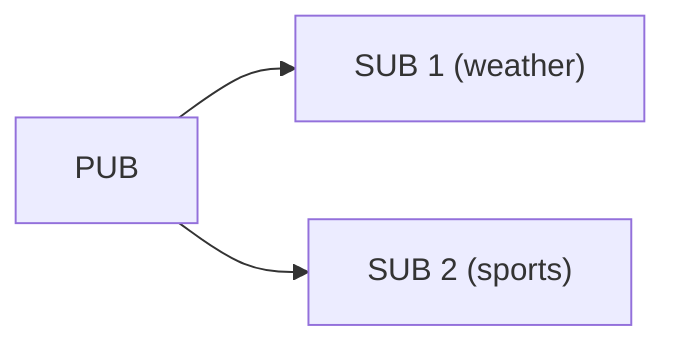

[English](03-2-pubsub.en.md)

<!-- zlink-nav:start -->
[가이드 목록](README.ko.md) | [이전: PAIR](03-1-pair.ko.md) | [다음: DEALER](03-3-dealer.ko.md)
<!-- zlink-nav:end -->

# PUB/SUB/XPUB/XSUB 발행-구독

> **이 장의 계약 소유 문서** — [PUB](../spec/core/socket/02-pub.ko.md) ·
> [SUB](../spec/core/socket/03-sub.ko.md) ·
> [XPUB](../spec/core/socket/04-xpub.ko.md) ·
> [XSUB](../spec/core/socket/05-xsub.ko.md) socket 스펙이 다룬다. 이 챕터는 그
> 계약을 언어별 예제로 보여준다.

## 1. 개요

발행-구독(Publish-Subscribe) 패턴은 메시지를 토픽 기반으로 분배한다.
zlink는 기본 PUB/SUB과 고급 XPUB/XSUB 두 가지 레벨을 제공한다.

| 소켓 | 역할 | 특성 |
|------|------|------|
| **PUB** | 발행자 | 모든 구독자에게 브로드캐스트. 수신 불가. |
| **SUB** | 구독자 | 토픽 prefix match 필터링. 송신 불가. |
| **XPUB** | 고급 발행자 | PUB + 구독 이벤트 수신 가능 |
| **XSUB** | 고급 구독자 | 로컬 필터링 없이 모든 메시지 수신. 프록시/중계용 |

**유효한 소켓 조합:**
- PUB → SUB, PUB → XSUB
- XPUB → SUB, XPUB → XSUB

### SUB vs XSUB — 핵심 차이

SUB와 XSUB은 모두 `zlink_set_subscription()`으로 구독 정보를
upstream PUB에 전송한다. 공개 API 사용법은 같다.
차이는 **로컬 필터 엔진의 on/off**다.

| | SUB (`filter=true`) | XSUB (`filter=false`) |
|---|---|---|
| 구독 있을 때 | 매칭되는 메시지만 수신 | **모든 메시지 수신** (필터 체크 안 함) |
| 구독 없을 때 | **아무것도 수신하지 않음** | **모든 메시지 수신** |
| `""` 빈 구독 | 모든 메시지 수신 (모든 토픽 매칭) | 구독 없이도 이미 전부 수신 |
| 용도 | 일반 구독자 | 프록시/중계 (전체 스트림 통과) |

내부적으로 `xsub_t::xrecv()`의 필터 조건은 `!options.filter || match(msg)`다.
SUB(`filter=true`)은 매 메시지마다 `match()`를 평가하고,
XSUB(`filter=false`)은 `!false = true`이므로 `match()`를 건너뛴다.

> **흔한 혼동:** "SUB에 `""` 빈 구독을 넣으면 XSUB과 같지 않나?"
> → 모든 메시지를 받는다는 결과는 같지만,
> SUB은 매 메시지마다 trie match 비용이 발생하고,
> XSUB은 필터 체크 자체를 건너뛴다.
> 또 SUB은 구독이 **없으면** 아무것도 받지 못하지만,
> XSUB은 구독 없이도 전부 받는다.

**프록시 패턴에서 XSUB/XPUB을 쓰는 이유:**


- XSUB은 구독 상태 없이 PUB의 모든 메시지를 통과시킨다.
- XPUB은 SUB의 구독 이벤트를 `zlink_xpub_recv_part()`로 노출해
  프록시가 구독 관리 로직(필터링, 로깅, 인가 등)을 끼워 넣을 수 있다.
- 일반 SUB/PUB으로는 이 중계 구조를 만들 수 없다.



---

# Part I: PUB/SUB

## 2. PUB/SUB 기본 사용법

### 발행자 (PUB)

```c
void *pub = zlink_socket(ctx, ZLINK_SOCKET_PUB);
zlink_bind(pub, "tcp://*:5556");

/* Publish message -- dropped if there are no subscribers */
zlink_msg_t part;
zlink_msg_init_size(&part, 14);
memcpy(zlink_msg_data(&part), "weather: sunny", 14);
zlink_publish(pub, NULL, &part, 1, 0);
```

### 구독자 (SUB)

```c
void on_topic(const zlink_routing_id_t *source_rid,
              const char *topic, size_t topic_len,
              zlink_msg_t *parts, size_t part_count,
              void *userdata)
{
    printf("Topic: %.*s, Data: %.*s\n",
           (int)topic_len, topic,
           (int)zlink_msg_size(&parts[0]),
           (char *)zlink_msg_data(&parts[0]));
    for (size_t i = 0; i < part_count; i++)
        zlink_msg_close(&parts[i]);
}

void *sub = zlink_socket(ctx, ZLINK_SOCKET_SUB);
zlink_connect(sub, "tcp://127.0.0.1:5556");

/* Subscribe to topic -- set after connect */
zlink_set_subscription(sub, "weather");

/* Use zlink_subscribe() (typically inside a poller loop) to receive */
```

> 참고: `core/tests/integration/test_pubsub.cpp` — 빈 구독("") → 모든 메시지 수신

### 송수신 요약

| 소켓 | 방향 | 수신 API | 비고 |
|------|------|----------|------|
| PUB | 송신 전용 | N/A | 수신 불가 (`ZLINK_RECV_NOT_SUPPORTED`) |
| SUB | 수신 전용 | `zlink_subscribe()` | 토픽 + 데이터 분리 반환 |
| XPUB | 양방향 | `zlink_xpub_recv_part()` | 구독 이벤트 수신 |
| XSUB | 수신 전용 | `zlink_subscribe()` | 필터 없이 전체 수신 |

> **참고:** PUB/SUB 계열 4소켓에서 `zlink_send()`/`zlink_recv()`는
> 모두 `ZLINK_SUBMIT_NOT_SUPPORTED` / `ZLINK_RECV_NOT_SUPPORTED` 이다. 발행은
> `zlink_publish()`, 수신은 `zlink_subscribe()`를 쓴다.

SUB / XSUB는 recv-only 타입이다. poller의 `ZLINK_POLLIN`과 함께 써서
서버 루프에서 readable을 관찰한 뒤 `zlink_subscribe()`로 토픽 메시지를
가져온다. 직접 토픽 콜백 표면은 제공하지 않는다.

> **PUB/XPUB 기본값:** `ZLINK_PUB_OPT_NODROP` 의 기본값은 `0` 이다.
> HWM 이 찼을 때 그 구독자에게 보내는 메시지를 조용히 drop 하고
> `zlink_publish()` 는 성공을 반환한다. drop 대신 배압을 받아야 하면
> `ZLINK_PUB_OPT_NODROP` 을 명시적으로 `1` 로 설정한다.

> PUB의 송신 큐가 가득 차면(HWM) 기본값(`ZLINK_PUB_OPT_NODROP=0`)에서는
> 그 구독자에게 보내는 메시지를 조용히 drop한다. 상세는
> [성능 가이드](10-performance.ko.md)를 참고.

## 3. 토픽 필터링

SUB 소켓의 토픽 필터링은 **prefix match** 방식이다.

| 구독 토픽 | 수신 메시지 | 매칭 |
|-----------|-------------|:----:|
| `"weather"` | `"weather: sunny"` | O |
| `"weather"` | `"weathering storm"` | O |
| `"weather"` | `"sports: baseball"` | X |
| `""` (빈 문자열) | 모든 메시지 | O |

### 다중 토픽 구독

```c
/* Subscribe to multiple topics */
zlink_set_subscription(sub, "weather");
zlink_set_subscription(sub, "sports");

/* Unsubscribe */
zlink_unset_subscription(sub, "sports");
```

### 빈 구독 (모든 메시지)

```c
/* Subscribe with empty string -- receives all messages */
zlink_set_subscription(sub, "");
```

> 참고: `core/tests/integration/test_pubsub.cpp` — `zlink_set_subscription(subscriber, "")`

## 4. 메시지 형식

`zlink_publish()`는 **토픽**과 **멀티파트 메시지**를 별도 파라미터로 받는다.
다른 소켓의 `zlink_send()`와 마찬가지로 기본이 멀티파트이다.

```c
int zlink_publish (void *subject,
                   const char *topic_id,      /* topic string */
                   zlink_msg_t *parts,         /* data frame array */
                   size_t part_count,           /* number of frames */
                   zlink_send_flags_t flags);
```

```c
/* Publish: topic = "sensor:cpu", payload = 2 frames */
zlink_msg_t parts[2];
zlink_msg_init_size(&parts[0], 4);
memcpy(zlink_msg_data(&parts[0]), "host", 4);
zlink_msg_init_size(&parts[1], 2);
memcpy(zlink_msg_data(&parts[1]), "73", 2);
zlink_publish(pub, "sensor:cpu", parts, 2, 0);

/* SUB receives (zlink_subscribe or subscribe_handler callback):
   topic     = "sensor:cpu"
   parts[0]  = "host"
   parts[1]  = "73" */
```

토픽은 와이어(프로토콜 전송 레벨)에서 첫 프레임으로 전송되고,
`zlink_subscribe()`가 토픽과 데이터를 분리해 반환한다.
호출자가 토픽 프레임을 직접 조립할 필요는 없다.

> **참고:** `zlink_publish(pub, NULL, parts, ...)`처럼 topic을 NULL로 전달하면
> parts[0]이 토픽 프레임으로 쓰이는 호환 경로가 동작하지만,
> 이 방식은 권장하지 않는다. 항상 `topic_id` 파라미터를 명시적으로 전달한다.

## 5. PUB/SUB 소켓 옵션

### SUB 전용 함수

| 함수 | 설명 |
|------|------|
| `zlink_set_subscription()` | 토픽 구독 추가 (prefix match) |
| `zlink_unset_subscription()` | 토픽 구독 해제 |

### 공통 옵션

| 옵션 | 타입 | 기본값 | 설명 |
|------|------|--------|------|
| `ZLINK_OPT_SNDHWM` | `uint64_t` bytes | 자동 (auto-HWM이 profile/role 예산으로 계산) | PUB 계열. 연결 수가 늘면 같은 role budget 안에서 자동 조정되며 `0`은 무제한 |
| `ZLINK_OPT_RCVHWM` | `uint64_t` bytes | 자동 (auto-HWM이 profile/role 예산으로 계산) | SUB 계열. 연결 수가 늘면 같은 role budget 안에서 자동 조정되며 `0`은 무제한 |
| `ZLINK_OPT_LINGER` | int | -1 | close 시 대기 시간 (ms) |

## 6. PUB/SUB 사용 패턴

### 패턴 1: 기본 PUB/SUB

```c
/* PUB */
void *pub = zlink_socket(ctx, ZLINK_SOCKET_PUB);
zlink_bind(pub, "tcp://*:5556");

/* SUB -- receive all messages */
void *sub = zlink_socket(ctx, ZLINK_SOCKET_SUB);
zlink_connect(sub, "tcp://127.0.0.1:5556");
zlink_set_subscription(sub, "");

msleep(100);  /* time for subscription to reach PUB */

zlink_msg_t msg;
zlink_msg_init_size(&msg, 4);
memcpy(zlink_msg_data(&msg), "test", 4);
zlink_publish(pub, NULL, &msg, 1, 0);

/* on_topic callback receives "test" asynchronously */
```

> 참고: `core/tests/integration/test_pubsub.cpp` — `test_tcp()`

### 패턴 2: 다중 SUB

하나의 PUB에 여러 SUB가 연결된다. 각 SUB는 자신의 토픽만 받는다.

```c
void *pub = zlink_socket(ctx, ZLINK_SOCKET_PUB);
zlink_bind(pub, "tcp://*:5556");

void *sub_weather = zlink_socket(ctx, ZLINK_SOCKET_SUB);
zlink_connect(sub_weather, "tcp://127.0.0.1:5556");
zlink_set_subscription(sub_weather, "weather");

void *sub_sports = zlink_socket(ctx, ZLINK_SOCKET_SUB);
zlink_connect(sub_sports, "tcp://127.0.0.1:5556");
zlink_set_subscription(sub_sports, "sports");

/* Only sub_weather receives weather, only sub_sports receives sports */
```

### 패턴 3: 다중 PUB → SUB

SUB는 여러 PUB에 connect할 수 있다. Fair-queue로 모든 PUB의 메시지를 받는다.

```c
void *sub = zlink_socket(ctx, ZLINK_SOCKET_SUB);
zlink_set_subscription(sub, "");
zlink_connect(sub, "tcp://pub1:5556");
zlink_connect(sub, "tcp://pub2:5557");
```

## 7. PUB/SUB 주의사항

### Slow Subscriber (HWM 처리)

PUB/XPUB는 기본적으로 **손실 허용 모드**로 동작한다 — `ZLINK_PUB_OPT_NODROP`의
기본값이 `0`이다. 느린 구독자의 송신 queue가 HWM(High-Water Mark, 보관할 수 있는
accounted byte 상한)에 도달하면 그 구독자에게 보내는 메시지를 오류 반환 없이
**조용히 버리고** `zlink_publish()`는 성공을 반환한다. 나머지 구독자에 대한
전달은 영향을 받지 않는다.

```c
/* 기본 동작 — HWM 도달 시 느린 구독자 몫만 drop, publish는 성공 */
struct quote_tick tick = {.price_micros = 91450000000LL, .volume = 1420};
zlink_msg_t quote;
zlink_msg_init_size(&quote, sizeof(tick));
memcpy(zlink_msg_data(&quote), &tick, sizeof(tick));
zlink_publish(pub, "quotes.KRW-BTC", &quote, 1, ZLINK_DONTWAIT);

/* 버스트 손실을 줄이려면 HWM을 올린다 */
uint64_t hwm_bytes = 64 * 1024 * 1024;  /* HWM은 byte다 */
zlink_set_option(pub, ZLINK_OPT_SNDHWM, &hwm_bytes, sizeof(hwm_bytes));
```

#### NODROP 모드 — 버리는 대신 배압

`ZLINK_PUB_OPT_NODROP`을 `1`로 설정하면 HWM 도달 시 메시지를 버리지 않고
`zlink_publish()`가 `ZLINK_SUBMIT_BACKPRESSURED`를 반환해 호출자가 대응할 수 있다.

```c
/* NODROP 모드 활성화 (HWM 도달 시 배압) */
int nodrop = 1;
zlink_set_pub_option(pub, ZLINK_PUB_OPT_NODROP, &nodrop, sizeof(nodrop));

struct quote_tick tick = {.price_micros = 91450000000LL, .volume = 1420};
zlink_msg_t quote;
zlink_msg_init_size(&quote, sizeof(tick));
memcpy(zlink_msg_data(&quote), &tick, sizeof(tick));
zlink_submit_result_t rc = zlink_publish(
    pub, "quotes.KRW-BTC", &quote, 1, ZLINK_DONTWAIT);
if (rc == ZLINK_SUBMIT_BACKPRESSURED) {
    /* HWM 도달 — send-ready 후 record 전체를 재전송 */
    zlink_msg_close(&quote);
}
```

이 모드는 publisher를 **가장 느린 구독자에 묶는다**. 한 pipe가 차면 같은 socket의
모든 구독자에 대한 전달이 멈춘다. 구독자 속도에 의존하면 안 되는 신뢰 전달은
PUB/SUB가 아니라 request-reply socket이 담당한다.

| 모드 | HWM 도달 시 동작 | 사용 시점 |
|------|------------------|-----------|
| 기본 (`NODROP=0`, 손실 허용) | 조용히 버림 — 오류 반환 없이 메시지 유실 | fanout 일반 (관찰, 알림, 센서, 시세 데이터) |
| `NODROP=1` | `ZLINK_SUBMIT_BACKPRESSURED` 반환 — 호출자가 배압 제어 | 유실을 허용할 수 없고 느린 구독자에 묶여도 되는 경우 |

> `ZLINK_PUB_OPT_NODROP`은 PUB·XPUB 양쪽에 적용된다(PUB은 XPUB 위에 구현됨).

### Late Joiner (구독 전 메시지 유실)

SUB가 connect한 뒤 구독 정보가 PUB에 전파되기 전에 발행된 메시지는 받을 수 없다.

```c
/* Time needed for subscription to propagate to PUB */
zlink_connect(sub, "tcp://127.0.0.1:5556");
zlink_set_subscription(sub, "topic");
msleep(100);  /* wait for subscription propagation */
/* Only messages published after this point can be received */
```

### 방향 제약

PUB/SUB는 각각 전용 API만 쓸 수 있다:

```c
/* PUB: send via zlink_publish(). Cannot attach recv handler */
zlink_msg_t part;
zlink_msg_init_size(&part, 5);
memcpy(zlink_msg_data(&part), "sunny", 5);
zlink_publish(pub, "weather", &part, 1, 0);  /* OK */

/* PUB 에서 zlink_send() → ZLINK_SUBMIT_NOT_SUPPORTED 반환 */
zlink_send(pub, &part, 1, 0);  /* returns ZLINK_SUBMIT_NOT_SUPPORTED */

/* SUB: zlink_subscribe() 로만 수신. send/publish 불가 */
zlink_publish(sub, "weather", &part, 1, 0);  /* ZLINK_SUBMIT_NOT_SUPPORTED */
zlink_send(sub, &part, 1, 0);                /* ZLINK_SUBMIT_NOT_SUPPORTED */
```

---

# Part II: XPUB/XSUB

## 8. XPUB/XSUB 개요

XPUB/XSUB는 구독 프레임을 애플리케이션에서 직접 다룰 수 있는
고급 publish-subscribe 소켓이다. 프록시/브로커 구축, 구독 모니터링,
Last-Value Caching에 쓴다.

### SUB vs XSUB — 핵심 차이

| 항목 | SUB | XSUB |
|------|-----|------|
| **토픽 등록** | `zlink_set_subscription()` | `zlink_set_subscription()` (동일) |
| **메시지 수신** | `zlink_subscribe()` — 토픽 필터링 후 수신 | `zlink_subscribe()` — 필터 없이 전체 수신 |
| **로컬 필터** | **켜짐** — 매칭 안 되면 드롭 | **꺼짐** — 모든 메시지 통과 |
| **구독 없는 상태** | 아무것도 수신 안 함 | 모든 메시지 수신 |
| **구현** | `xsub_t` subclass (`filter=true`) | base class (`filter=false`) |

XSUB이 프록시에서 필요한 이유는 구독 상태 없이도 모든 메시지를
통과시키기 때문이다. 토픽 등록은 `zlink_set_subscription()`으로
양쪽 모두 동일하게 upstream에 전송된다.

### PUB vs XPUB — 핵심 차이

| 항목 | PUB | XPUB |
|------|-----|------|
| **메시지 발행** | `zlink_publish()` | `zlink_publish()` (동일) |
| **구독 이벤트** | 노출 안 함 | `zlink_xpub_recv_part()`로 수신 |

XPUB는 어떤 클라이언트가 어떤 토픽을 구독하거나 해지했는지 파악한다.

### PUB/SUB 소켓 공개 API 요약

| 공개 API | PUB | SUB | XPUB | XSUB |
|----------|-----|-----|------|------|
| `zlink_publish()` | 가능 | — | 가능 | — |
| `zlink_subscribe()` | — | 가능 | — | 가능 |
| `zlink_set_subscription()` | — | 가능 | — | 가능 |
| `zlink_xpub_recv_part()` | — | — | 가능 | — |
| 로컬 필터 | N/A | **켜짐** | N/A | **꺼짐** |

> `zlink_send()` / `zlink_recv()`는 PUB/SUB 계열 4소켓 모두 `ZLINK_SUBMIT_NOT_SUPPORTED` / `ZLINK_RECV_NOT_SUPPORTED` 이다.
> 발행은 `zlink_publish()`, 수신은 `zlink_subscribe()` 전용 API를 쓴다.

> Proxy 패턴에서 XSUB/XPUB을 쓰는 방법은
> [Proxy 가이드](03-6-proxy.ko.md)를 참고.

## 9. 구독 프레임 형식

XPUB/XSUB 간의 구독/해제 프레임은 다음 형식을 따른다:

| 바이트 | 의미 |
|--------|------|
| `0x01` + topic | 구독 요청 |
| `0x00` + topic | 구독 해제 |

```c
/* Subscribe from XSUB */
zlink_set_subscription(xsub, "A");

/* Unsubscribe from XSUB */
zlink_unset_subscription(xsub, "A");
```

XPUB는 `zlink_xpub_recv_part()`로 구독 프레임을 받는다:

```c
void *xpub = zlink_socket(ctx, ZLINK_SOCKET_XPUB);
zlink_bind(xpub, "tcp://*:5557");

const zlink_routing_id_t *source_rid = NULL;
int subscribed = 0;
char topic[256];
size_t topic_len = 0;

zlink_recv_result_t rc = zlink_xpub_recv_part(
  xpub, &source_rid, &subscribed, topic, sizeof(topic), &topic_len, 0);
```

> 참고: `core/tests/integration/test_xpub_manual.cpp` — `subscription1[] = {1, 'A'}`, `unsubscription1[] = {0, 'A'}`

## 10. XPUB 소켓 옵션

| 옵션 | 타입 | 기본값 | 설명 |
|------|------|--------|------|
| `ZLINK_PUB_OPT_MANUAL` | int | 0 | 수동 구독 관리 모드 활성화 |
| `ZLINK_PUB_OPT_VERBOSE` | int | 0 | 중복 구독 메시지도 전달 |
| `zlink_set_subscription()` | -- | -- | (MANUAL 모드) 현재 파이프에 구독 추가 |
| `zlink_unset_subscription()` | -- | -- | (MANUAL 모드) 현재 파이프에서 구독 해제 |

### XPUB_MANUAL 모드

기본적으로 XPUB는 SUB의 구독을 자동 처리한다.
MANUAL 모드에서는 구독 프레임을 받은 뒤 애플리케이션이 직접
`zlink_set_subscription()` / `zlink_unset_subscription()`로 실제 구독을 결정한다.

```c
/* Enable MANUAL mode */
int manual = 1;
zlink_set_pub_option(xpub, ZLINK_PUB_OPT_MANUAL, &manual, sizeof(manual));

/* zlink_xpub_recv_part() returns subscribed=1, topic="A"
   Then apply transformed subscription: */
zlink_set_subscription(xpub, "XA");

/* Publish */
zlink_msg_t msg_a;
zlink_msg_init_size(&msg_a, 1);
memcpy(zlink_msg_data(&msg_a), "A", 1);
zlink_publish(xpub, NULL, &msg_a, 1, 0);   /* does not reach the subscriber */

zlink_msg_t msg_xa;
zlink_msg_init_size(&msg_xa, 2);
memcpy(zlink_msg_data(&msg_xa), "XA", 2);
zlink_publish(xpub, NULL, &msg_xa, 1, 0);  /* subscriber receives this */
```

> 참고: `core/tests/integration/test_xpub_manual.cpp` — `test_basic()`: A 구독 요청 → B로 변환

## 11. XPUB/XSUB 사용 패턴

### 패턴 1: 프록시/브로커 구축

XSUB(프론트엔드) + XPUB(백엔드)로 PUB/SUB 프록시를 구축한다.

```c
/* Proxy frontend: PUBs connect here */
void *xsub = zlink_socket(ctx, ZLINK_SOCKET_XSUB);
zlink_bind(xsub, "tcp://*:5556");

/* Proxy backend: SUBs connect here */
void *xpub = zlink_socket(ctx, ZLINK_SOCKET_XPUB);
zlink_bind(xpub, "tcp://*:5557");

/* Run proxy (forwards messages and subscriptions bidirectionally) */
zlink_proxy(xsub, xpub, NULL);
```

### 패턴 2: MANUAL 모드 프록시 (구독 변환)

구독 요청을 변환하거나 필터링하는 고급 프록시.

```c
int manual = 1;
zlink_set_pub_option(xpub, ZLINK_PUB_OPT_MANUAL, &manual, sizeof(manual));

for (;;) {
    const zlink_routing_id_t *source_rid = NULL;
    int subscribed = 0;
    char topic[256];
    size_t topic_len = 0;

    zlink_recv_result_t rc = zlink_xpub_recv_part(
      xpub, &source_rid, &subscribed, topic, sizeof(topic), &topic_len, 0);
    if (rc != ZLINK_RECV_OK)
        break;

    if (subscribed) {
        /* Register subscription */
        zlink_set_subscription(xpub, topic);

        /* Propagate subscription upstream (XSUB) */
        zlink_set_subscription(xsub, topic);
    } else {
        /* Unsubscription */
        zlink_unset_subscription(xpub, topic);

        zlink_unset_subscription(xsub, topic);
    }
}
```

> 참고: `core/tests/integration/test_xpub_manual.cpp` — `test_xpub_proxy_unsubscribe_on_disconnect()`

### 패턴 3: 구독 모니터링

XPUB로 어떤 클라이언트가 어떤 토픽을 구독하는지 관찰한다.

```c
void *xpub = zlink_socket(ctx, ZLINK_SOCKET_XPUB);
zlink_bind(xpub, "tcp://*:5557");

for (;;) {
    const zlink_routing_id_t *source_rid = NULL;
    int subscribed = 0;
    char topic[256];
    size_t topic_len = 0;

    zlink_recv_result_t rc = zlink_xpub_recv_part(
      xpub, &source_rid, &subscribed, topic, sizeof(topic), &topic_len, 0);
    if (rc != ZLINK_RECV_OK)
        break;
    printf("%s: %.*s\n", subscribed ? "New subscription" : "Unsubscription",
           (int) topic_len, topic);
}
```

### 패턴 4: 구독자 해제 시 자동 unsubscribe

SUB가 연결을 끊으면 XPUB에 자동으로 unsubscribe 프레임이 전달된다.

```c
/* After SUB disconnects */
zlink_close(sub);

/* The next zlink_xpub_recv_part() returns
   subscribed=0 and the previously subscribed topic */
```

> 참고: `core/tests/integration/test_xpub_manual.cpp` — `test_xpub_proxy_unsubscribe_on_disconnect()`

## 12. 주의사항

### 구독 전파 타이밍

구독 메시지는 비동기로 전파된다. 구독 직후 발행된 메시지는 받지 못할 수 있다.

```c
void *sub = zlink_socket(ctx, ZLINK_SOCKET_SUB);
zlink_set_subscription(sub, "");
zlink_connect(sub, "tcp://pub1:5556");
zlink_connect(sub, "tcp://pub2:5557");
```

### XPUB MANUAL 모드에서 구독 관리

MANUAL 모드에서 구독 프레임을 받은 뒤 `zlink_set_subscription()`를 호출하지 않으면 그 구독은 등록되지 않는다. 반드시 명시적으로 구독을 처리해야 한다.

### 다중 구독자 → 단일 XPUB

여러 SUB가 같은 토픽을 구독하면 모든 SUB가 해제될 때까지 XPUB의 구독이 유지된다.

> 참고: `core/tests/integration/test_xpub_manual.cpp` — `test_missing_subscriptions()`: 두 구독자를 순차 처리하여 누락 방지

---
[← PAIR](03-1-pair.ko.md) | [DEALER →](03-3-dealer.ko.md)

## 언어별 완전한 예제

PUB로 토픽을 발행하고 SUB로 구독·수신하는 자립형 예제다(모든 바인딩, 빌드·실행 검증됨).

=== "C++"

    ```cpp
    --8<-- "bindings/cpp/samples/pubsub_recv_sample.cpp:doc"
    ```

=== "C#/.NET"

    ```csharp
    --8<-- "bindings/dotnet/samples/PubSubRecv/Program.cs:doc"
    ```

=== "Java"

    ```java
    --8<-- "bindings/java/samples/Zlink.Samples/src/main/java/systems/zlink/samples/PubSubRecvSample.java:doc"
    ```

=== "Kotlin"

    ```kotlin
    --8<-- "bindings/kotlin/samples/src/main/kotlin/systems/zlink/samples/PubSubRecvSample.kt:doc"
    ```

=== "Python"

    ```python
    --8<-- "bindings/python/samples/pubsub_recv_sample.py:doc"
    ```

=== "Node/TypeScript"

    ```typescript
    --8<-- "bindings/node/samples/pubsub_recv_sample.ts:doc"
    ```

=== "JavaScript"

    ```javascript
    --8<-- "bindings/javascript/samples/pubsub_recv_sample.js:doc"
    ```

=== "Go"

    ```go
    --8<-- "bindings/go/samples/pubsub_recv_sample/main.go:doc"
    ```

=== "Rust"

    ```rust
    --8<-- "bindings/rust/samples/pubsub_recv_sample.rs:doc"
    ```

---
<!-- zlink-nav:bottom:start -->
[← PAIR](03-1-pair.ko.md) | [DEALER →](03-3-dealer.ko.md)
<!-- zlink-nav:bottom:end -->
