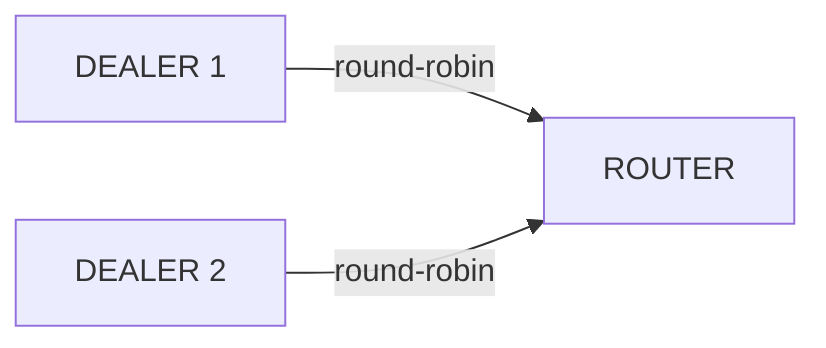

<!-- zlink-nav:start -->
[← PUB/SUB](03-2-pubsub.en.md) | [ROUTER →](03-4-router.en.md)
<!-- zlink-nav:end -->

# DEALER Socket

> **This chapter's contract-owning document** — the [DEALER socket spec](../spec/core/socket/06-dealer.en.md)
> owns the contract. This chapter shows that contract through language examples.

## 1. Overview

The DEALER socket is an asynchronous request socket. It sends to multiple peers using **round-robin** distribution and receives using **fair-queue**. There is no enforced send/recv ordering, enabling free asynchronous messaging.

**Key characteristics:**
- Send: Round-robin -- cyclic distribution across connected peers
- Receive: Fair-queue -- fair reception from all peers
- No enforced send/recv ordering (asynchronous)

**Valid socket combinations:** DEALER ↔ ROUTER, DEALER ↔ DEALER



### Concrete Scenario: 3 DEALERs Sending to 1 ROUTER

Three DEALER clients connect to a single ROUTER server. Each DEALER sends
requests independently; the ROUTER receives them via fair-queue and
distinguishes each sender by `source_rid`.

| Sender | routing_id | Message | ROUTER sees |
|--------|-----------|---------|-------------|
| DEALER 1 | `D1` | `"buy AAPL 100"` | source_rid=`D1`, data=`"buy AAPL 100"` |
| DEALER 2 | `D2` | `"sell TSLA 50"` | source_rid=`D2`, data=`"sell TSLA 50"` |
| DEALER 3 | `D3` | `"buy MSFT 200"` | source_rid=`D3`, data=`"buy MSFT 200"` |

The ROUTER replies to each DEALER using `zlink_send_part_rid()` with the
corresponding `source_rid`. Because DEALER uses round-robin for
*outgoing* connections, if a single DEALER connects to multiple ROUTERs,
its messages cycle across them (msg1 -> ROUTER-A, msg2 -> ROUTER-B, ...).

## 2. Basic Usage

### Creation and Connection

```c
void *dealer = zlink_socket(ctx, ZLINK_SOCKET_DEALER);

/* Set routing_id (optional, used for identification by ROUTER) */
zlink_set_routing_id(dealer, "client-1", 8);

/* Connect to server */
zlink_connect(dealer, "tcp://127.0.0.1:5558");
```

### Sending and Receiving Messages

```c
/* Send requests -- can send consecutively without ordering constraints.
   Each message here is a single-part record, so every call uses
   ZLINK_PART_FINAL. */
zlink_msg_t msg1, msg2, msg3;
zlink_msg_init_size(&msg1, 9);
memcpy(zlink_msg_data(&msg1), "request-1", 9);
zlink_send_part(dealer, &msg1, ZLINK_SEND_FLAGS_NONE, ZLINK_PART_FINAL);

zlink_msg_init_size(&msg2, 9);
memcpy(zlink_msg_data(&msg2), "request-2", 9);
zlink_send_part(dealer, &msg2, ZLINK_SEND_FLAGS_NONE, ZLINK_PART_FINAL);

zlink_msg_init_size(&msg3, 9);
memcpy(zlink_msg_data(&msg3), "request-3", 9);
zlink_send_part(dealer, &msg3, ZLINK_SEND_FLAGS_NONE, ZLINK_PART_FINAL);

/* Replies are drained with zlink_recv_part() in a poller loop, or
   (for zlink_dealer_request_part()) delivered through its reply callback */
```

### Receive Modes

Use `zlink_recv_part()` to receive one part at a time, synchronously.
`source_rid_out_` is optional for DEALER; pass `NULL` when the caller does
not need it (DEALER returns `NULL` there in any case).

```c
zlink_msg_t part;
zlink_part_flag_t more;

zlink_msg_init(&part);
zlink_recv_result_t rc = zlink_recv_part(
    dealer, NULL, &part, &more, ZLINK_RECV_FLAGS_NONE);
if (rc == ZLINK_RECV_OK) {
    /* process part; more == ZLINK_PART_MORE means another part of
       the same record follows */
    zlink_msg_close(&part);
}
/* other rc values: ZLINK_RECV_NO_DATA (EAGAIN), TERMINATED, INVALID_HANDLE */
```

> When HWM is reached, `zlink_send_part()` blocks (default) or returns
> `ZLINK_SUBMIT_BACKPRESSURED` with `ZLINK_SEND_FLAGS_DONTWAIT`. For advanced
> backpressure patterns, see [Performance Guide](10-performance.en.md).

## 3. Usage Example

```c
/* DEALER → ROUTER send: one two-part record. Every part except the
   last uses ZLINK_PART_MORE; the last uses ZLINK_PART_FINAL. */
zlink_msg_t header, body;
zlink_msg_init_size(&header, 6);
memcpy(zlink_msg_data(&header), "header", 6);
zlink_msg_init_size(&body, 4);
memcpy(zlink_msg_data(&body), "body", 4);

zlink_submit_result_t rc = zlink_send_part(
    dealer, &header, ZLINK_SEND_FLAGS_NONE, ZLINK_PART_MORE);
if (rc == ZLINK_SUBMIT_OK)
    rc = zlink_send_part(
        dealer, &body, ZLINK_SEND_FLAGS_NONE, ZLINK_PART_FINAL);
```

## 4. Socket Options

| Option | Type | Default | Description |
|------|------|--------|------|
| `zlink_set_routing_id()` | binary | Auto (UUID) | ID for identification by ROUTER (dedicated function) |
| `ZLINK_DEALER_OPT_PROBE` | int | 0 | Send empty message on connect (connection notification) |
| `ZLINK_DEALER_OPT_REQUEST_TIMEOUT_MS` | int (ms) | `5000` | Default timeout used when a request's `timeout_ms_ == 0` |
| `ZLINK_DEALER_OPT_WEIGHT` | int | 100 | Per-peer load-balancing weight for outgoing round-robin |
| `ZLINK_OPT_SNDHWM` | `uint64_t` bytes | automatic | Auto-HWM sized for DEALER's peer-queue role. Manual settings take precedence; `0` is unlimited |
| `ZLINK_OPT_RCVHWM` | `uint64_t` bytes | automatic | Auto-HWM sized for DEALER's peer-queue role. Manual settings take precedence; `0` is unlimited |
| `ZLINK_OPT_LINGER` | int | -1 | Wait time on close (ms) |
| `ZLINK_OPT_SNDTIMEO` | int | 1000 | Send timeout (ms); set `-1` explicitly for infinite wait |
| `ZLINK_OPT_RCVTIMEO` | int | 1000 | Receive timeout (ms); set `-1` explicitly for infinite wait |

### Setting routing_id

To allow ROUTER to identify a DEALER, explicitly set the routing_id.

```c
/* Set before bind/connect */
zlink_set_routing_id(dealer, "D1", 2);
zlink_connect(dealer, "tcp://127.0.0.1:5558");
```

> Reference: `core/tests/integration/test_router_multiple_dealers.cpp` -- `zlink_set_routing_id(dealer1, "D1", 2)`

### 4.1 Request-Reply

When DEALER needs to send a request and wait for a reply, use
`zlink_dealer_request_part()` instead of ordinary `send/recv`. This function
attaches a ZMP request-reply envelope and delivers the reply via callback.

> For the ZMP request-reply envelope wire format, see
> [ZMP Protocol](../spec/core/protocol/01-zmp.en.md).

```c
static void on_reply(zlink_request_result_t result,
                     zlink_msg_t *parts,
                     size_t part_count,
                     void *userdata)
{
    if (result != ZLINK_REQUEST_OK) {
        /* result values: ZLINK_REQUEST_TIMED_OUT, ZLINK_REQUEST_NOT_FOUND,
           ZLINK_REQUEST_TERMINATED, ZLINK_REQUEST_PROTOCOL_ERROR */
        fprintf(stderr, "request failed: %d\n", (int)result);
        return;
    }

    /* Ownership of parts_ and every message moves to this callback;
       release exactly once. */
    zlink_multipart_close(parts, part_count);
}

int timeout_ms = 1000;
zlink_set_dealer_option(
  dealer,
  ZLINK_DEALER_OPT_REQUEST_TIMEOUT_MS,
  &timeout_ms,
  sizeof(timeout_ms));

zlink_msg_t req;
zlink_msg_init_size(&req, 4);
memcpy(zlink_msg_data(&req), "ping", 4);
/* signature: zlink_dealer_request_part(dealer, part, flags, part_flag,
   timeout_ms, handler, userdata) */
zlink_submit_result_t rc = zlink_dealer_request_part(
    dealer, &req, ZLINK_SEND_FLAGS_NONE, ZLINK_PART_FINAL,
    0 /* timeout_ms: 0 uses ZLINK_DEALER_OPT_REQUEST_TIMEOUT_MS */,
    on_reply, NULL);
if (rc != ZLINK_SUBMIT_OK) { /* handler is not called; handle submit failure */ }
```

When `timeout_ms_ == 0` is passed to `zlink_dealer_request_part()`, it uses
the `ZLINK_DEALER_OPT_REQUEST_TIMEOUT_MS` socket default (`5000ms` unless set
otherwise).

## 5. Usage Patterns

### Pattern 1: DEALER → ROUTER Request-Reply

The most basic pattern. DEALER sends an ordinary raw message, ROUTER
distinguishes the sender by `source_rid` and replies to that same id.

```c
void *router = zlink_socket(ctx, ZLINK_SOCKET_ROUTER);
zlink_bind(router, "tcp://*:5558");

void *dealer = zlink_socket(ctx, ZLINK_SOCKET_DEALER);
zlink_set_routing_id(dealer, "D1", 2);
zlink_connect(dealer, "tcp://127.0.0.1:5558");

/* Client request */
zlink_msg_t req;
zlink_msg_init_size(&req, 5);
memcpy(zlink_msg_data(&req), "Hello", 5);
zlink_send_part(dealer, &req, ZLINK_SEND_FLAGS_NONE, ZLINK_PART_FINAL);

/* Server: receive with zlink_router_recv_part() (source_rid + request_seq) */
const zlink_routing_id_t *source_rid = NULL;
uint64_t request_seq = 0;
zlink_msg_t part;
zlink_part_flag_t more;

zlink_msg_init(&part);
zlink_router_recv_part(router, &source_rid, &request_seq, &part, &more,
                       ZLINK_RECV_FLAGS_NONE);
printf("Received from [%.*s]: %.*s\n", (int)source_rid->size, source_rid->data,
       (int)zlink_msg_size(&part), (char *)zlink_msg_data(&part));

/* Ordinary directed traffic has request_seq == 0, so reply with
   zlink_send_part_rid() rather than zlink_router_reply_part(). */
zlink_msg_t reply;
zlink_msg_init_size(&reply, 5);
memcpy(zlink_msg_data(&reply), "World", 5);
zlink_send_part_rid(router, source_rid, &reply, ZLINK_SEND_FLAGS_NONE,
                    ZLINK_PART_FINAL);
zlink_msg_close(&part);

/* Client: receive the reply with zlink_recv_part() */
zlink_msg_t reply_part;
zlink_part_flag_t reply_more;
zlink_msg_init(&reply_part);
zlink_recv_part(dealer, NULL, &reply_part, &reply_more, ZLINK_RECV_FLAGS_NONE);
zlink_msg_close(&reply_part);
```

> Reference: `core/tests/integration/test_router_multiple_dealers.cpp` -- TCP/IPC/inproc examples

### Pattern 2: Multiple DEALER Load Balancing

Multiple DEALERs connect to a single ROUTER. ROUTER distinguishes each DEALER by routing_id.

```c
void *router = zlink_socket(ctx, ZLINK_SOCKET_ROUTER);
zlink_bind(router, "tcp://127.0.0.1:*");

char endpoint[256];
size_t len = sizeof(endpoint);
zlink_get_option(router, ZLINK_OPT_LAST_ENDPOINT, endpoint, &len);

void *dealer1 = zlink_socket(ctx, ZLINK_SOCKET_DEALER);
zlink_set_routing_id(dealer1, "D1", 2);
zlink_connect(dealer1, endpoint);

void *dealer2 = zlink_socket(ctx, ZLINK_SOCKET_DEALER);
zlink_set_routing_id(dealer2, "D2", 2);
zlink_connect(dealer2, endpoint);

/* Each DEALER sends a message */
zlink_msg_t m1;
zlink_msg_init_size(&m1, 12);
memcpy(zlink_msg_data(&m1), "from_dealer1", 12);
zlink_send_part(dealer1, &m1, ZLINK_SEND_FLAGS_NONE, ZLINK_PART_FINAL);

zlink_msg_t m2;
zlink_msg_init_size(&m2, 12);
memcpy(zlink_msg_data(&m2), "from_dealer2", 12);
zlink_send_part(dealer2, &m2, ZLINK_SEND_FLAGS_NONE, ZLINK_PART_FINAL);

/* zlink_router_recv_part() distinguishes each DEALER's message by
   its source_rid */
```

> Reference: `core/tests/integration/test_router_multiple_dealers.cpp` -- `test_router_multiple_dealers_tcp()`

### Pattern 3: Proxy Pattern (ROUTER-DEALER)

Build a multi-threaded server using ROUTER (frontend) + DEALER (backend).
`zlink_proxy()` forwards multipart frames bidirectionally between the two
raw sockets, including the client's routing-id envelope, so worker code
never calls a routing-id-addressed send -- it just relays the frames it
receives.

```c
/* Frontend: clients connect here */
void *frontend = zlink_socket(ctx, ZLINK_SOCKET_ROUTER);
zlink_bind(frontend, "tcp://*:5558");

/* Backend: worker threads connect here */
void *backend = zlink_socket(ctx, ZLINK_SOCKET_DEALER);
zlink_bind(backend, "inproc://backend");

/* Start worker threads then run the proxy loop (blocks the caller) */
zlink_proxy(frontend, backend, NULL);
```

```c
/* Worker thread: a plain DEALER connected to the backend. The proxy
   presents the client's envelope as a leading part, so the worker
   reads it, then the payload, and echoes the same envelope back
   ahead of its reply -- no target routing id is passed explicitly. */
void worker_thread(void *arg) {
    void *worker = zlink_socket(ctx, ZLINK_SOCKET_DEALER);
    zlink_connect(worker, "inproc://backend");

    zlink_msg_t envelope, request;
    zlink_part_flag_t more;

    zlink_msg_init(&envelope);
    zlink_recv_part(worker, NULL, &envelope, &more, ZLINK_RECV_FLAGS_NONE);
    /* more == ZLINK_PART_MORE: the payload follows */

    zlink_msg_init(&request);
    zlink_recv_part(worker, NULL, &request, &more, ZLINK_RECV_FLAGS_NONE);
    /* more == ZLINK_PART_FINAL: request is complete */

    /* Process request, then reply: re-send the envelope, then the
       reply payload */
    zlink_msg_t reply;
    zlink_msg_init_size(&reply, 5);
    memcpy(zlink_msg_data(&reply), "World", 5);

    zlink_send_part(worker, &envelope, ZLINK_SEND_FLAGS_NONE, ZLINK_PART_MORE);
    zlink_send_part(worker, &reply, ZLINK_SEND_FLAGS_NONE, ZLINK_PART_FINAL);
    zlink_msg_close(&request);

    /* Worker stays alive until socket is closed */
}
```

> Reference: `core/tests/integration/test_proxy.cpp` -- ROUTER(frontend) + DEALER(backend) + worker pool

### Pattern 4: DEALER ↔ DEALER Asynchronous Communication

Both sides use DEALER for fully asynchronous P2P communication.

```c
void *a = zlink_socket(ctx, ZLINK_SOCKET_DEALER);
zlink_bind(a, "tcp://*:5558");

void *b = zlink_socket(ctx, ZLINK_SOCKET_DEALER);
zlink_connect(b, "tcp://127.0.0.1:5558");

/* Bidirectional free send */
zlink_msg_t ping;
zlink_msg_init_size(&ping, 4);
memcpy(zlink_msg_data(&ping), "ping", 4);
zlink_send_part(a, &ping, ZLINK_SEND_FLAGS_NONE, ZLINK_PART_FINAL);

zlink_msg_t pong;
zlink_msg_init_size(&pong, 4);
memcpy(zlink_msg_data(&pong), "pong", 4);
zlink_send_part(b, &pong, ZLINK_SEND_FLAGS_NONE, ZLINK_PART_FINAL);

/* b receives "ping" and a receives "pong" via zlink_recv_part() */
```

## 6. Caveats

### No Peer Connected vs. HWM Backpressure

These are two distinct results. When **no peer** is connected (no
positive-weight pipe), a send returns `ZLINK_SUBMIT_NOT_ADMITTED` — the
message is not queued. When a peer **is** connected but its send queue has
reached the HWM, the call blocks (default) or returns
`ZLINK_SUBMIT_BACKPRESSURED` with `ZLINK_SEND_FLAGS_DONTWAIT`.

```c
/* Send with no peer connected */
zlink_msg_t msg;
zlink_msg_init_size(&msg, 4);
memcpy(zlink_msg_data(&msg), "data", 4);
zlink_submit_result_t rc = zlink_send_part(
    dealer, &msg, ZLINK_SEND_FLAGS_DONTWAIT, ZLINK_PART_FINAL);
if (rc == ZLINK_SUBMIT_NOT_ADMITTED) {
    /* No connected peer to admit the message */
} else if (rc == ZLINK_SUBMIT_BACKPRESSURED) {
    /* A peer is connected but its queue is at the HWM */
}
```

### Round-Robin Distribution

When multiple peers are connected, messages are distributed in a round-robin fashion. To send to a specific peer, use ROUTER instead.

### Weight-Aware Outbound Selection

Remote peers advertise a weight (`0..10000`). DEALER automatically drops
weight-`0` peers from its candidate set. Positive peers remain eligible,
and unequal positive weights change the send ratio. The underlying
connections stay alive, so a peer that flips back to a positive weight
rejoins the rotation without reconnect.

If every known peer is `0`, `zlink_send_part()` and
`zlink_dealer_request_part()` return `ZLINK_SUBMIT_NOT_ADMITTED`. The caller
should wait for at least one peer to return to a positive weight before
retrying; treating `NOT_ADMITTED` as a hard failure would discard
messages that are expected to succeed once maintenance ends.

> For the full contract, see
> [Weight-aware outbound selection](../spec/core/socket/06-dealer.en.md#8-dealer-options)
> in the DEALER spec.

### Set routing_id Before connect

`zlink_set_routing_id()` must be called before `zlink_connect()`. Changes after connection are not applied.

```c
/* Correct order */
zlink_set_routing_id(dealer, "D1", 2);
zlink_connect(dealer, endpoint);  /* identified as D1 */
```

---
[← PUB/SUB](03-2-pubsub.en.md) | [ROUTER →](03-4-router.en.md)

## Full language examples

=== "C++"

    ```cpp
    --8<-- "bindings/cpp/samples/dealer_router_recv_sample.cpp:doc"
    ```

=== "C#/.NET"

    ```csharp
    --8<-- "bindings/dotnet/samples/DealerRouterRecv/Program.cs:doc"
    ```

=== "Java"

    ```java
    --8<-- "bindings/java/samples/Zlink.Samples/src/main/java/systems/zlink/samples/DealerRouterRecvSample.java:doc"
    ```

=== "Kotlin"

    ```kotlin
    --8<-- "bindings/kotlin/samples/src/main/kotlin/systems/zlink/samples/DealerRouterRecvSample.kt:doc"
    ```

=== "Python"

    ```python
    --8<-- "bindings/python/samples/dealer_router_recv_sample.py:doc"
    ```

=== "Node/TypeScript"

    ```typescript
    --8<-- "bindings/node/samples/dealer_router_recv_sample.ts:doc"
    ```

=== "JavaScript"

    ```javascript
    --8<-- "bindings/javascript/samples/dealer_router_recv_sample.js:doc"
    ```

=== "Go"

    ```go
    --8<-- "bindings/go/samples/dealer_router_recv_sample/main.go:doc"
    ```

=== "Rust"

    ```rust
    --8<-- "bindings/rust/samples/dealer_router_recv_sample.rs:doc"
    ```

---
<!-- zlink-nav:bottom:start -->
[← PUB/SUB](03-2-pubsub.en.md) | [ROUTER →](03-4-router.en.md)
<!-- zlink-nav:bottom:end -->
