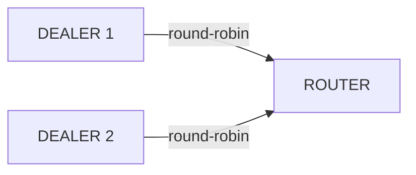

[English](03-3-dealer.en.md)

<!-- zlink-nav:start -->
[가이드 목록](README.ko.md) | [이전: PUB/SUB](03-2-pubsub.ko.md) | [다음: ROUTER](03-4-router.ko.md)
<!-- zlink-nav:end -->

# DEALER 소켓

> **이 장의 계약 소유 문서** — [DEALER socket 스펙](../spec/core/socket/06-dealer.ko.md)이
> 다룬다. 이 챕터는 그 계약을 언어별 예제로 보여준다.

## 1. 개요

DEALER 소켓은 비동기 요청 소켓이다.
여러 peer에 **round-robin**으로 송신하고, **fair-queuing**으로 수신한다.
send/recv 순서 강제가 없어 자유로운 비동기 메시징이 가능하다.

**핵심 특성:**
- 송신: round-robin — 연결된 peer에 차례로 분배
- 수신: fair-queuing — 모든 peer에서 공정하게 수신
- send/recv 순서 강제 없음 (비동기)

**유효한 소켓 조합:** DEALER ↔ ROUTER, DEALER ↔ DEALER



```c
/* DEALER → ROUTER send */
zlink_msg_t parts[2];
zlink_msg_init_size(&parts[0], 6);
memcpy(zlink_msg_data(&parts[0]), "header", 6);
zlink_msg_init_size(&parts[1], 4);
memcpy(zlink_msg_data(&parts[1]), "body", 4);
zlink_send(dealer, parts, 2, 0);
```

### 구체적 시나리오: 3개 DEALER가 1개 ROUTER로 전송

3개의 DEALER 클라이언트가 하나의 ROUTER 서버에 연결한다. 각 DEALER는
독립적으로 요청을 전송하며 ROUTER는 fair-queuing으로 수신하고
`source_rid`로 각 송신자를 구분한다.

| 송신자 | routing_id | 메시지 | ROUTER 수신 |
|--------|-----------|--------|-------------|
| DEALER 1 | `D1` | `"buy AAPL 100"` | source_rid=`D1`, data=`"buy AAPL 100"` |
| DEALER 2 | `D2` | `"sell TSLA 50"` | source_rid=`D2`, data=`"sell TSLA 50"` |
| DEALER 3 | `D3` | `"buy MSFT 200"` | source_rid=`D3`, data=`"buy MSFT 200"` |

ROUTER는 `zlink_send_rid()`에 해당 `source_rid`를 전달하여 각 DEALER에
응답한다. DEALER는 *송신* 연결에 round-robin을 사용하므로 하나의
DEALER가 여러 ROUTER에 연결하면 메시지가 round-robin으로 순환 분배된다
(msg1 -> ROUTER-A, msg2 -> ROUTER-B, ...).

## 2. 기본 사용법

### 생성 및 연결

```c
void *dealer = zlink_socket(ctx, ZLINK_SOCKET_DEALER);

/* Set routing_id (optional, used for identification by ROUTER) */
zlink_set_routing_id(dealer, "client-1", 8);

/* Connect to server */
zlink_connect(dealer, "tcp://127.0.0.1:5558");
```

### 메시지 송수신

```c
/* Send requests -- can send consecutively without ordering constraints */
zlink_msg_t msg1, msg2, msg3;
zlink_msg_init_size(&msg1, 9);
memcpy(zlink_msg_data(&msg1), "request-1", 9);
zlink_send(dealer, &msg1, 1, 0);

zlink_msg_init_size(&msg2, 9);
memcpy(zlink_msg_data(&msg2), "request-2", 9);
zlink_send(dealer, &msg2, 1, 0);

zlink_msg_init_size(&msg3, 9);
memcpy(zlink_msg_data(&msg3), "request-3", 9);
zlink_send(dealer, &msg3, 1, 0);

/* Responses are drained with zlink_recv() in a poller loop,
   or (for zlink_dealer_request()) delivered via its reply callback */
```

### 수신 모드

DEALER는 `zlink_recv()`로 동기 수신한다.

```c
zlink_routing_id_t source_rid;
zlink_msg_t *parts = NULL;
size_t part_count = 0;
zlink_recv_result_t rc = zlink_recv(
    dealer, &source_rid, &parts, &part_count, 0 /* flags */);
if (rc == ZLINK_RECV_OK) {
    /* process parts[0..part_count-1] */
    zlink_multipart_close(parts, part_count);
}
/* 그 밖의 rc 값: ZLINK_RECV_NO_DATA (EAGAIN),
   TERMINATED, INVALID_HANDLE, NOT_SUPPORTED */
```

> HWM(High-Water Mark, queue가 보관할 수 있는 accounted byte 상한) 도달 시 `zlink_send()`는 대기(기본) 또는 `ZLINK_DONTWAIT`로
> `ZLINK_SUBMIT_BACKPRESSURED`를 반환한다. 고급 배압(backpressure) 패턴은
> [socket option 가이드](12-socket-options.ko.md)를 참고.

## 3. 사용 예제

```c
/* Send with no peer connected */
zlink_msg_t msg;
zlink_msg_init_size(&msg, 4);
memcpy(zlink_msg_data(&msg), "data", 4);
zlink_submit_result_t rc = zlink_send(dealer, &msg, 1, ZLINK_DONTWAIT);
if (rc == ZLINK_SUBMIT_NOT_ADMITTED) {
    /* no peer connected (보낼 pipe 없음) */
} else if (rc == ZLINK_SUBMIT_BACKPRESSURED) {
    /* HWM exceeded (연결된 peer가 느림) */
}
```

## 4. 소켓 옵션

| 옵션 | 타입 | 기본값 | 설명 |
|------|------|--------|------|
| `zlink_set_routing_id()` | binary | 자동(UUID) | ROUTER에서 식별할 ID (전용 함수) |
| `ZLINK_DEALER_OPT_PROBE` | int | 0 | 연결 시 빈 메시지 전송 (연결 알림) |
| `ZLINK_DEALER_OPT_REQUEST_TIMEOUT_MS` | int | 0 | `zlink_dealer_request()` 기본 timeout. `0`이면 구현 기본값 `5000ms` 사용 |
| `ZLINK_DEALER_OPT_WEIGHT` | int | 100 | 송신 round-robin의 peer별 load balancing 가중치 |
| `ZLINK_OPT_SNDHWM` | `uint64_t` bytes | 자동 | DEALER의 peer-queue 역할에 맞춰 산정된 자동 HWM. 수동 설정이 우선하며 `0`은 무제한 |
| `ZLINK_OPT_RCVHWM` | `uint64_t` bytes | 자동 | DEALER의 peer-queue 역할에 맞춰 산정된 자동 HWM. 수동 설정이 우선하며 `0`은 무제한 |
| `ZLINK_OPT_LINGER` | int | -1 | close 시 대기 시간 (ms) |
| `ZLINK_OPT_SNDTIMEO` | int | 1000 | 송신 타임아웃(ms). 무한 대기는 `-1`을 명시적으로 설정 |
| `ZLINK_OPT_RCVTIMEO` | int | 1000 | 수신 타임아웃(ms). 무한 대기는 `-1`을 명시적으로 설정 |

### routing_id 설정

ROUTER가 DEALER를 식별하려면 명시적으로 routing_id를 설정한다.

```c
/* Set before bind/connect */
zlink_set_routing_id(dealer, "D1", 2);
zlink_connect(dealer, "tcp://127.0.0.1:5558");
```

> 참고: `core/tests/integration/test_router_multiple_dealers.cpp` — `zlink_set_routing_id(dealer1, "D1", 2)`

### 4.1 request-reply 시작

DEALER가 응답을 기다리는 흐름은 일반 `send/recv`와 별도로
`zlink_dealer_request()`를 사용한다. 이 함수는 ZMP(zlink 전용 메시지 프로토콜) request-reply envelope(요청-응답 식별용 헤더 wrapper)를
붙여 보내고, 응답은 콜백으로 전달된다.

> ZMP request-reply envelope의 와이어 프레임 형식은
> [ZMP 프로토콜](../internals/protocol-zmp.ko.md)을 참고.

```c
static void on_reply(zlink_request_result_t result,
                     zlink_msg_t *parts,
                     size_t part_count,
                     void *userdata)
{
    if (result != ZLINK_REQUEST_OK) {
        /* result 값: ZLINK_REQUEST_TIMED_OUT, ZLINK_REQUEST_NOT_FOUND,
           ZLINK_REQUEST_TERMINATED, ZLINK_REQUEST_PROTOCOL_ERROR */
        fprintf(stderr, "request failed: %d\n", (int)result);
        return;
    }

    /* parts는 runtime이 소유한 borrowed view다. 콜백에서 닫지 않으며,
       콜백 이후 보관하려면 복사한다. */
}

int timeout_ms = 1000;
zlink_set_dealer_option(
  dealer,
  ZLINK_DEALER_OPT_REQUEST_TIMEOUT_MS,
  &timeout_ms,
  sizeof(timeout_ms));

zlink_msg_t req;
zlink_msg_init_size(&req, 4);
memcpy(zlink_msg_data(&req), "ping", 4);
/* 시그니처: zlink_dealer_request(dealer, parts, count, handler,
   userdata, flags, timeout_ms) */
zlink_submit_result_t rc = zlink_dealer_request(
    dealer, &req, 1, on_reply, NULL, 0 /* flags */, 0 /* timeout_ms */);
if (rc != ZLINK_SUBMIT_OK) { /* submit 실패 처리 */ }
```

`timeout_ms = 0`은 소켓 기본값을 사용한다는 뜻이며, 소켓 기본값도 `0`이면
구현 기본값 `5000ms`가 적용된다.

## 5. 사용 패턴

### 패턴 1: 1:1 양방향 비동기

PAIR와 유사하지만 HWM과 자동 재연결을 지원한다. 응답이 필요한 경우 반드시 1:1로 구성해야 한다.
routing_id가 없으므로 1:N 구성에서는 어떤 peer가 응답했는지 구분할 수 없다.

```c
void *a = zlink_socket(ctx, ZLINK_SOCKET_DEALER);
/* Receive with zlink_recv() */
zlink_bind(a, "tcp://*:5558");

void *b = zlink_socket(ctx, ZLINK_SOCKET_DEALER);
/* Receive with zlink_recv() */
zlink_connect(b, "tcp://127.0.0.1:5558");

/* Bidirectional free send */
zlink_msg_t ping;
zlink_msg_init_size(&ping, 4);
memcpy(zlink_msg_data(&ping), "ping", 4);
zlink_send(a, &ping, 1, 0);

zlink_msg_t pong;
zlink_msg_init_size(&pong, 4);
memcpy(zlink_msg_data(&pong), "pong", 4);
zlink_send(b, &pong, 1, 0);

/* on_message_b receives "ping", on_message_a receives "pong" */
```

### 패턴 2: 1:N round-robin 작업 분배

PUSH/PULL 없이 작업을 N개 워커에 round-robin으로 순환 분배하는 패턴.
응답이 필요 없는 작업 분배 또는 파이프라인 단계 간 전달에 사용한다.

```c
void *router = zlink_socket(ctx, ZLINK_SOCKET_ROUTER);
/* ROUTER receives with zlink_recv() and distinguishes each DEALER by source_rid */
zlink_bind(router, "tcp://127.0.0.1:*");

char endpoint[256];
size_t len = sizeof(endpoint);
zlink_get_option(router, ZLINK_OPT_LAST_ENDPOINT, endpoint, &len);

void *dealer1 = zlink_socket(ctx, ZLINK_SOCKET_DEALER);
zlink_set_routing_id(dealer1, "D1", 2);
zlink_connect(dealer1, endpoint);

void *dealer2 = zlink_socket(ctx, ZLINK_SOCKET_DEALER);
zlink_set_routing_id(dealer2, "D2", 2);
zlink_connect(dealer2, endpoint);

/* Each DEALER sends a message */
zlink_msg_t m1;
zlink_msg_init_size(&m1, 12);
memcpy(zlink_msg_data(&m1), "from_dealer1", 12);
zlink_send(dealer1, &m1, 1, 0);

zlink_msg_t m2;
zlink_msg_init_size(&m2, 12);
memcpy(zlink_msg_data(&m2), "from_dealer2", 12);
zlink_send(dealer2, &m2, 1, 0);

/* on_message receives each DEALER's message with its routing_id */
```

> DEALER ↔ ROUTER 조합(load balancing + 응답 라우팅, 프록시 등)은
> [ROUTER 소켓](03-4-router.ko.md)을 참고.

## 6. 주의사항

### peer 없음 vs HWM 배압

둘은 별개의 결과다. **연결된 peer가 없으면**(양수 가중치 pipe 없음) 송신은
`ZLINK_SUBMIT_NOT_ADMITTED`를 반환하며 메시지는 큐에 쌓이지 않는다. peer가
**연결되어 있지만** 그 송신 큐가 HWM에 도달하면 대기(기본) 또는
`ZLINK_DONTWAIT` 시 `ZLINK_SUBMIT_BACKPRESSURED`를 반환한다.

```c
/* 연결된 peer 없이 송신 */
zlink_msg_t msg;
zlink_msg_init_size(&msg, 4);
memcpy(zlink_msg_data(&msg), "data", 4);
zlink_submit_result_t rc = zlink_send(dealer, &msg, 1, ZLINK_DONTWAIT);
if (rc == ZLINK_SUBMIT_NOT_ADMITTED) {
    /* 메시지를 받아줄 연결된 peer가 없음 */
} else if (rc == ZLINK_SUBMIT_BACKPRESSURED) {
    /* peer는 연결됐지만 큐가 HWM에 도달 */
}
```

### round-robin 분배

여러 peer가 연결된 경우 메시지는 round-robin으로 순환 분배된다. 특정 peer에게만 전송하려면 ROUTER를 사용한다.

### 가중치 기반 송신 대상 선택

원격 ROUTER는 자신의 peer 가중치(`0..10000`)를 함께 광고한다. DEALER는
가중치가 `0`인 ROUTER를 round-robin 후보 집합에서 자동으로 제외하고,
양수 가중치를 가진 ROUTER들 사이에서만 outbound 대상을 고른다.

- 모든 ROUTER의 양수 가중치가 같으면 기존과 같은 round-robin 분배를 유지한다.
- 양수 가중치가 서로 다르면 더 큰 가중치를 가진 ROUTER가 그 비율만큼 더 자주 선택된다.
- 연결 자체는 유지되므로, 가중치가 `0`이던 ROUTER가 다시 양수 값으로 돌아오면
  재연결 없이 후보 집합에 복귀한다.

연결된 ROUTER가 모두 가중치 `0`이면 `zlink_send()`와
`zlink_dealer_request()`는 `ZLINK_SUBMIT_NOT_ADMITTED`를 반환한다.
연결이 끊긴 것이 아니라 보낼 대상이 일시적으로 없는 상태이므로 호출자는
최소 한 대의 ROUTER가 양수 가중치로 복귀할 때까지 기다렸다가
재시도해야 한다.

> 상세 규약은 DEALER spec
> [§2 DEALER option](../spec/core/socket/06-dealer.ko.md#2-dealer-option)의
> `ZLINK_DEALER_OPT_WEIGHT` 항목을 참고.

### routing_id는 connect 전에 설정

`zlink_set_routing_id()`는 `zlink_connect()` 호출 전에 호출해야 한다. 연결 후 변경은 적용되지 않는다.

```c
/* Correct order */
zlink_set_routing_id(dealer, "D1", 2);
zlink_connect(dealer, endpoint);  /* identified as D1 */
```

---
[← PUB/SUB](03-2-pubsub.ko.md) | [ROUTER →](03-4-router.ko.md)

## 언어별 완전한 예제

DEALER가 ROUTER로 보내고 응답을 받는 자립형 예제다(모든 바인딩, 빌드·실행 검증됨).

=== "C++"

    ```cpp
    --8<-- "bindings/cpp/samples/dealer_router_recv_sample.cpp:doc"
    ```

=== "C#/.NET"

    ```csharp
    --8<-- "bindings/dotnet/samples/DealerRouterRecv/Program.cs:doc"
    ```

=== "Java"

    ```java
    --8<-- "bindings/java/samples/Zlink.Samples/src/main/java/systems/zlink/samples/DealerRouterRecvSample.java:doc"
    ```

=== "Kotlin"

    ```kotlin
    --8<-- "bindings/kotlin/samples/src/main/kotlin/systems/zlink/samples/DealerRouterRecvSample.kt:doc"
    ```

=== "Python"

    ```python
    --8<-- "bindings/python/samples/dealer_router_recv_sample.py:doc"
    ```

=== "Node/TypeScript"

    ```typescript
    --8<-- "bindings/node/samples/dealer_router_recv_sample.ts:doc"
    ```

=== "JavaScript"

    ```javascript
    --8<-- "bindings/javascript/samples/dealer_router_recv_sample.js:doc"
    ```

=== "Go"

    ```go
    --8<-- "bindings/go/samples/dealer_router_recv_sample/main.go:doc"
    ```

=== "Rust"

    ```rust
    --8<-- "bindings/rust/samples/dealer_router_recv_sample.rs:doc"
    ```

---
<!-- zlink-nav:bottom:start -->
[← PUB/SUB](03-2-pubsub.ko.md) | [ROUTER →](03-4-router.ko.md)
<!-- zlink-nav:bottom:end -->
