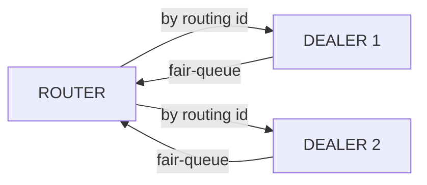

<!-- zlink-nav:start -->
[← DEALER](03-3-dealer.en.md) | [STREAM →](03-5-stream.en.md)
<!-- zlink-nav:end -->

# ROUTER Socket

> **This chapter's contract-owning document** — the [ROUTER socket spec](../spec/core/socket/07-router.en.md)
> owns the contract. This chapter shows that contract through language examples.

## 1. Overview

ROUTER is an asynchronous raw socket that manages connections (pipes) to multiple peers on one
socket. Every inbound message carries the sender's routing id, and every outbound message must
name a target routing id. Use it when one socket must address multiple DEALER or ROUTER peers
individually, rather than round-robin like DEALER.

**Key characteristics:**
- Receive: every record carries the sender's routing id and an opaque reply token
- Send: directed only — the caller selects the peer by routing id
- Two traffic shapes on one socket: ordinary DATA (reply token `0`) and REQUEST
  records that expect a reply (nonzero token)

**Valid socket combinations:** ROUTER ↔ DEALER, ROUTER ↔ ROUTER



## 2. Basic Usage

### Creation and Binding

```c
void *router = zlink_socket(ctx, ZLINK_SOCKET_ROUTER);
zlink_bind(router, "tcp://*:5558");
```

### Receiving a Message

`zlink_router_recv_part()` returns one payload part at a time. The routing-id view remains valid
until the next data-receive entry on the same socket. Copy it when it must outlive that call.

```c
const zlink_routing_id_t *source_rid = NULL;
zlink_reply_token_t reply_token = 0;
zlink_msg_t part;
zlink_part_flag_t more;

zlink_msg_init(&part);
zlink_recv_result_t rc = zlink_router_recv_part(
    router, &source_rid, &reply_token, &part, &more, ZLINK_RECV_FLAGS_NONE);
if (rc == ZLINK_RECV_OK) {
    /* source_rid selects the peer; more == ZLINK_PART_MORE means another
       part of the same record follows. */
    zlink_msg_close(&part);
}
/* other rc values: ZLINK_RECV_NO_DATA (EAGAIN), TERMINATED, INVALID_HANDLE */
```

For ordinary routed DATA, `reply_token` is zero. A nonzero token identifies a REQUEST that must
be answered with `zlink_reply_part()` (see [§4](#4-request-and-reply)) rather than
`zlink_send_part_rid()`; the application does not interpret the token.

### Sending Routed Data

`zlink_send_part_rid()` sends one part to the peer identified by `target_rid_`. Every part except
the last uses `ZLINK_PART_MORE`; the last uses `ZLINK_PART_FINAL`. All parts of one record must
use the same target.

```c
zlink_msg_t header, body;
zlink_msg_init_size(&header, 6);
memcpy(zlink_msg_data(&header), "header", 6);
zlink_msg_init_size(&body, 4);
memcpy(zlink_msg_data(&body), "body", 4);

zlink_submit_result_t rc = zlink_send_part_rid(
    router, source_rid, &header, ZLINK_SEND_FLAGS_NONE, ZLINK_PART_MORE);
if (rc == ZLINK_SUBMIT_OK)
    rc = zlink_send_part_rid(
        router, source_rid, &body, ZLINK_SEND_FLAGS_NONE, ZLINK_PART_FINAL);
```

## 3. Options

| Option | Type | Default | Description |
|------|------|--------|------|
| `ZLINK_ROUTER_OPT_MANDATORY` | int | `1` | `0`=off, positive=on. When on, a directed submit to an unconnected routing id fails with `ZLINK_SUBMIT_NOT_CONNECTED` instead of being silently dropped |
| `ZLINK_ROUTER_OPT_PROBE` | int | `0` | `0`=off, positive=on. Sends an empty raw message on connect so the peer observes the connection and this ROUTER's routing id |
| `ZLINK_ROUTER_OPT_CONNECT_ROUTING_ID` | binary, set-only | — | Local alias for the pipe created by the next `zlink_connect()`. Set before each connect |
| `ZLINK_ROUTER_OPT_REQUEST_TIMEOUT_MS` | int (ms) | `5000` | Default timeout used when a request's `timeout_ms_ == 0` |
| `ZLINK_ROUTER_OPT_WEIGHT` | int | `100`, range `0..10000` | Weight this ROUTER advertises to connected peers |
| `ZLINK_OPT_SNDHWM` | `uint64_t` bytes | automatic | Manual settings take precedence; `0` is unlimited |
| `ZLINK_OPT_RCVHWM` | `uint64_t` bytes | automatic | Manual settings take precedence; `0` is unlimited |
| `ZLINK_OPT_LINGER` | int | `-1` | Wait time on close (ms) |
| `ZLINK_OPT_SNDTIMEO` | int | `1000` | Send timeout (ms); set `-1` explicitly for infinite wait |
| `ZLINK_OPT_RCVTIMEO` | int | `1000` | Receive timeout (ms); set `-1` explicitly for infinite wait |

Set and get ROUTER-specific options with the typed accessors:

```c
ZLINK_EXPORT zlink_config_result_t zlink_set_router_option(
  void *handle_, zlink_router_option_t option_, const void *optval_, size_t optvallen_);

ZLINK_EXPORT zlink_config_result_t zlink_get_router_option(
  void *handle_, zlink_router_option_t option_, void *optval_, size_t *optvallen_);
```

`zlink_get_router_option()` treats `*optvallen_` as the input capacity of `optval_`; on success it
is updated to the number of bytes actually written.

### `ZLINK_ROUTER_OPT_MANDATORY`

```c
void *router = zlink_socket(ctx, ZLINK_SOCKET_ROUTER);
int mandatory = 1;
zlink_set_router_option(router, ZLINK_ROUTER_OPT_MANDATORY, &mandatory, sizeof(mandatory));

/* target_rid names a routing id with no connected pipe */
zlink_msg_t part;
zlink_msg_init_size(&part, 4);
memcpy(zlink_msg_data(&part), "data", 4);
zlink_submit_result_t rc = zlink_send_part_rid(
    router, target_rid, &part, ZLINK_SEND_FLAGS_NONE, ZLINK_PART_FINAL);
/* rc == ZLINK_SUBMIT_NOT_CONNECTED because MANDATORY is on */
```

> Reference: `core/tests/integration/test_router_mandatory.cpp`

### `ZLINK_ROUTER_OPT_CONNECT_ROUTING_ID`

Set this before each `zlink_connect()` call to choose the local alias for the pipe that call
creates — useful when a ROUTER connects out to peers instead of only accepting inbound
connections.

```c
zlink_set_router_option(
    router, ZLINK_ROUTER_OPT_CONNECT_ROUTING_ID, "peer-a", 6);
zlink_connect(router, "tcp://127.0.0.1:5559");
```

## 4. Request and Reply

`zlink_request_part()` submits a routed request and returns a nonzero completion ID. Its reply or
terminal result is pulled with `zlink_completion_recv()`, never ordinary DATA receive. A received
REQUEST (nonzero reply token) is answered with `zlink_reply_part()` using the source RID and token
returned by the receive call.

```c
zlink_msg_t req;
zlink_msg_init_size(&req, 4);
memcpy(zlink_msg_data(&req), "ping", 4);

zlink_completion_id_t id = 0;
zlink_submit_result_t rc = zlink_request_part(
    router, peer_rid, &req, ZLINK_SEND_FLAGS_NONE, ZLINK_PART_FINAL,
    0 /* uses ZLINK_ROUTER_OPT_REQUEST_TIMEOUT_MS */, NULL, &id);
if (rc == ZLINK_SUBMIT_OK) {
    zlink_completion_t completion = {0};
    completion.struct_size = sizeof(completion);
    if (zlink_completion_recv(router, &completion, ZLINK_RECV_FLAGS_NONE)
        == ZLINK_RECV_OK)
        zlink_completion_close(&completion);
}
```

On the receiving side, answer with the routing id and opaque token the receive call returned:

```c
const zlink_routing_id_t *source_rid = NULL;
zlink_reply_token_t reply_token = 0;
zlink_msg_t part;
zlink_part_flag_t more;

zlink_msg_init(&part);
zlink_router_recv_part(router, &source_rid, &reply_token, &part, &more, ZLINK_RECV_FLAGS_NONE);

if (reply_token != 0) {
    /* This record expects a reply, not a directed send. */
    zlink_msg_t reply;
    zlink_msg_init_size(&reply, 5);
    memcpy(zlink_msg_data(&reply), "World", 5);
    zlink_reply_part(router, source_rid, reply_token, &reply, ZLINK_PART_FINAL);
}
zlink_msg_close(&part);
```

A reply to a DEALER peer shares that DEALER-ROUTER Application connection's FIFO, HWM, and PAUSED
state, so it can report `ZLINK_SUBMIT_BACKPRESSURED`. A reply to a ROUTER peer uses the
ROUTER-ROUTER Completion lane. Only successful FINAL consumes the reply token; a failed complete
attempt can be retried while the request lifecycle remains valid.

> Reference: `core/tests/integration/test_zmp_request_reply.cpp` and
> `core/tests/integration/test_zmp_request_reply_router_recv_surface.cpp`

## 5. Usage Patterns

### Pattern 1: ROUTER ← Multiple DEALERs

The most common shape. Each DEALER connects with a routing id; ROUTER distinguishes senders by
`source_rid` and replies to the same id.

```c
void *router = zlink_socket(ctx, ZLINK_SOCKET_ROUTER);
zlink_bind(router, "tcp://127.0.0.1:*");

char endpoint[256];
size_t len = sizeof(endpoint);
zlink_get_option(router, ZLINK_OPT_LAST_ENDPOINT, endpoint, &len);

void *dealer1 = zlink_socket(ctx, ZLINK_SOCKET_DEALER);
zlink_set_routing_id(dealer1, "D1", 2);
zlink_connect(dealer1, endpoint);

void *dealer2 = zlink_socket(ctx, ZLINK_SOCKET_DEALER);
zlink_set_routing_id(dealer2, "D2", 2);
zlink_connect(dealer2, endpoint);

/* router.recv distinguishes "D1" and "D2" by source_rid, and
   zlink_send_part_rid(router, source_rid, ...) replies to the right one. */
```

> Reference: `core/tests/integration/test_router_multiple_dealers.cpp`

### Pattern 2: Request-Reply with Correlation

Use `zlink_request_part()` / `zlink_reply_part()` (see [§4](#4-request-and-reply))
when the caller needs delivery confirmation and a correlated answer instead of free-form
send/recv. The completion ID correlates the origin result; the opaque nonzero reply token lets the
responder answer one REQUEST and is `0` for ordinary DATA.

### Pattern 3: Enforcing Reachability with MANDATORY

By default, a directed send to a routing id with no connected pipe is dropped without error. Set
`ZLINK_ROUTER_OPT_MANDATORY` to surface that as `ZLINK_SUBMIT_NOT_CONNECTED` so the caller can
detect stale routing ids instead of silently losing messages.

```c
int mandatory = 1;
zlink_set_router_option(router, ZLINK_ROUTER_OPT_MANDATORY, &mandatory, sizeof(mandatory));
```

> Reference: `core/tests/integration/test_router_mandatory.cpp`,
> `core/tests/integration/test_router_mandatory_hwm.cpp`

### Pattern 4: Proxy (ROUTER-DEALER)

ROUTER as a frontend and DEALER as a backend build a multi-threaded server. See
[DEALER §5 Pattern 3](03-3-dealer.en.md#pattern-3-proxy-pattern-router-dealer) for the full
proxy example; the ROUTER side there is a plain `zlink_socket(ctx, ZLINK_SOCKET_ROUTER)` bound
as the frontend.

## 6. Caveats

### Routing ID Lifetime

`source_rid` returned by `zlink_router_recv_part()` is a socket-owned view. It stays valid only
until the next data-receive entry on that same socket, successful or not; copy the bytes if the id
must outlive that call. All parts of one multipart record return the same routing id and reply
token. See [Routing IDs](08-routing-id.en.md) for the full lifetime and copy contract.

### No Peer Connected vs. HWM Backpressure

These are two distinct results, same as on DEALER. With `ZLINK_ROUTER_OPT_MANDATORY` on, a send to
an unconnected routing id returns `ZLINK_SUBMIT_NOT_CONNECTED` — nothing is queued. A send to a
connected peer whose queue is at HWM blocks (default) or returns `ZLINK_SUBMIT_BACKPRESSURED` with
`ZLINK_SEND_FLAGS_DONTWAIT`.

### Logical-RID Targeting

`zlink_send_part_rid()` and `zlink_request_part()` accept only the logical routing id. Physical
pair IDs and generations are not public send selectors. If Core retains a DONTWAIT record before
admission, it keeps the same logical RID across transient reconnect and reports the terminal via
the completion ID. After local admission, Core does not replay the payload on a new connection.

### Concurrency

ROUTER's public handle follows the tiered concurrency contract described in
[Thread Safety](../spec/core/systems/04-thread-safety.en.md): send/publish paths allow same-handle
concurrent use, while option changes and close serialize for correctness. Only one open multipart
send sequence (`ZLINK_PART_MORE` ... `ZLINK_PART_FINAL`) may be in flight per handle at a time, and
it must complete with the same routing id family before another sequence starts.

---
[← DEALER](03-3-dealer.en.md) | [STREAM →](03-5-stream.en.md)

## Full language examples

=== "C++"

    ```cpp
    --8<-- "bindings/cpp/samples/dealer_router_recv_sample.cpp:doc"
    ```

=== "C#/.NET"

    ```csharp
    --8<-- "bindings/dotnet/samples/DealerRouterRecv/Program.cs:doc"
    ```

=== "Java"

    ```java
    --8<-- "bindings/java/samples/Zlink.Samples/src/main/java/systems/zlink/samples/DealerRouterRecvSample.java:doc"
    ```

=== "Kotlin"

    ```kotlin
    --8<-- "bindings/kotlin/samples/src/main/kotlin/systems/zlink/samples/DealerRouterRecvSample.kt:doc"
    ```

=== "Python"

    ```python
    --8<-- "bindings/python/samples/dealer_router_recv_sample.py:doc"
    ```

=== "Node/TypeScript"

    ```typescript
    --8<-- "bindings/node/samples/dealer_router_recv_sample.ts:doc"
    ```

=== "JavaScript"

    ```javascript
    --8<-- "bindings/javascript/samples/dealer_router_recv_sample.js:doc"
    ```

=== "Go"

    ```go
    --8<-- "bindings/go/samples/dealer_router_recv_sample/main.go:doc"
    ```

=== "Rust"

    ```rust
    --8<-- "bindings/rust/samples/dealer_router_recv_sample.rs:doc"
    ```

See [Routing IDs](08-routing-id.en.md) for lifetime and copy rules and
[Thread Safety](../spec/core/systems/04-thread-safety.en.md) for same-handle concurrency.

---
<!-- zlink-nav:bottom:start -->
[← DEALER](03-3-dealer.en.md) | [STREAM →](03-5-stream.en.md)
<!-- zlink-nav:bottom:end -->
