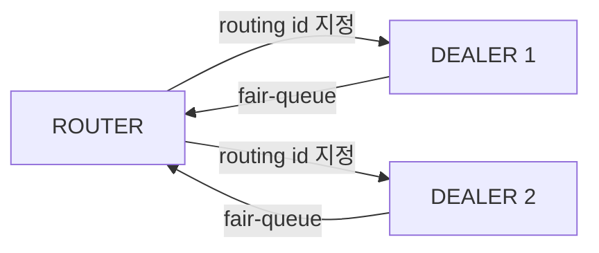

<!-- zlink-nav:start -->
[가이드 목록](README.ko.md) | [이전: DEALER](03-3-dealer.ko.md) | [다음: STREAM](03-5-stream.ko.md)
<!-- zlink-nav:end -->

# ROUTER 소켓

> **이 장의 계약 소유 문서** — [ROUTER socket 스펙](../spec/core/socket/07-router.ko.md)이
> 다룬다. 이 챕터는 그 계약을 언어별 예제로 보여준다.

## 1. 개요

ROUTER는 하나의 socket에서 여러 peer와의 연결(pipe)을 관리하는 비동기 raw socket이다.
모든 수신 메시지에는 송신자의 routing id가 함께 오고, 모든 송신 메시지는 target routing
id를 지정해야 한다. 하나의 socket이 여러 DEALER 또는 ROUTER peer를 (DEALER처럼
round-robin이 아니라) 개별적으로 지정해 통신해야 할 때 사용한다.

**핵심 특성:**
- 수신: 모든 record가 송신자의 routing id와 불투명 reply token을 함께 반환
- 송신: directed 전용 — 호출자가 routing id로 peer를 지정
- 하나의 socket에 두 가지 트래픽 형태 공존: 일반 DATA(reply token `0`)와
  reply를 기대하는 REQUEST record(0이 아닌 token)

**유효한 소켓 조합:** ROUTER ↔ DEALER, ROUTER ↔ ROUTER



## 2. 기본 사용법

### 생성 및 바인딩

```c
void *router = zlink_socket(ctx, ZLINK_SOCKET_ROUTER);
zlink_bind(router, "tcp://*:5558");
```

### 메시지 수신

`zlink_router_recv_part()`는 payload를 part 단위로 반환한다. Routing id view는 같은
socket에서 다음 data receive 함수에 진입하기 전까지만 유효하다. 그 이후에도 사용해야
하면 복사한다.

```c
const zlink_routing_id_t *source_rid = NULL;
zlink_reply_token_t reply_token = 0;
zlink_msg_t part;
zlink_part_flag_t more;

zlink_msg_init(&part);
zlink_recv_result_t rc = zlink_router_recv_part(
    router, &source_rid, &reply_token, &part, &more, ZLINK_RECV_FLAGS_NONE);
if (rc == ZLINK_RECV_OK) {
    /* source_rid는 peer를 식별하고, more == ZLINK_PART_MORE이면 같은
       record의 다음 part가 이어진다. */
    zlink_msg_close(&part);
}
/* 그 밖의 rc 값: ZLINK_RECV_NO_DATA (EAGAIN), TERMINATED, INVALID_HANDLE */
```

일반 routed DATA에서는 `reply_token`이 0이다. 0이 아닌 token은 `zlink_send_part_rid()`가
아니라 `zlink_reply_part()`([§4](#4-request와-reply) 참고)로 응답해야 하는 REQUEST다.
Application은 token을 해석하지 않는다.

### Routed message 송신

`zlink_send_part_rid()`는 `target_rid_`가 지정하는 peer에게 part 하나를 보낸다. 마지막
전 part에는 `ZLINK_PART_MORE`, 마지막 part에는 `ZLINK_PART_FINAL`을 사용한다. 한 record의
모든 part는 같은 target을 써야 한다.

```c
zlink_msg_t header, body;
zlink_msg_init_size(&header, 6);
memcpy(zlink_msg_data(&header), "header", 6);
zlink_msg_init_size(&body, 4);
memcpy(zlink_msg_data(&body), "body", 4);

zlink_submit_result_t rc = zlink_send_part_rid(
    router, source_rid, &header, ZLINK_SEND_FLAGS_NONE, ZLINK_PART_MORE);
if (rc == ZLINK_SUBMIT_OK)
    rc = zlink_send_part_rid(
        router, source_rid, &body, ZLINK_SEND_FLAGS_NONE, ZLINK_PART_FINAL);
```

## 3. 옵션

| 옵션 | 타입 | 기본값 | 설명 |
|------|------|--------|------|
| `ZLINK_ROUTER_OPT_MANDATORY` | int | `1` | `0`=off, 양수=on. on이면 연결되지 않은 routing id로의 directed submit이 조용히 버려지지 않고 `ZLINK_SUBMIT_NOT_CONNECTED`로 실패 |
| `ZLINK_ROUTER_OPT_PROBE` | int | `0` | `0`=off, 양수=on. 연결 설정 시 빈 raw message를 보내 peer가 연결과 이 ROUTER의 routing id를 관찰하게 함 |
| `ZLINK_ROUTER_OPT_CONNECT_ROUTING_ID` | binary, set 전용 | — | 다음 `zlink_connect()`로 만들 pipe의 local alias. 각 connect 전에 설정 |
| `ZLINK_ROUTER_OPT_REQUEST_TIMEOUT_MS` | int (ms) | `5000` | request의 `timeout_ms_ == 0`일 때 사용하는 기본 timeout |
| `ZLINK_ROUTER_OPT_WEIGHT` | int | `100`, 범위 `0..10000` | 연결된 peer에 알리는 이 ROUTER의 가중치 |
| `ZLINK_OPT_SNDHWM` | `uint64_t` bytes | 자동 | 수동 설정이 우선하며 `0`은 무제한 |
| `ZLINK_OPT_RCVHWM` | `uint64_t` bytes | 자동 | 수동 설정이 우선하며 `0`은 무제한 |
| `ZLINK_OPT_LINGER` | int | `-1` | close 시 대기 시간 (ms) |
| `ZLINK_OPT_SNDTIMEO` | int | `1000` | 송신 타임아웃(ms). 무한 대기는 `-1`을 명시적으로 설정 |
| `ZLINK_OPT_RCVTIMEO` | int | `1000` | 수신 타임아웃(ms). 무한 대기는 `-1`을 명시적으로 설정 |

ROUTER 전용 옵션은 typed accessor로 설정·조회한다.

```c
ZLINK_EXPORT zlink_config_result_t zlink_set_router_option(
  void *handle_, zlink_router_option_t option_, const void *optval_, size_t optvallen_);

ZLINK_EXPORT zlink_config_result_t zlink_get_router_option(
  void *handle_, zlink_router_option_t option_, void *optval_, size_t *optvallen_);
```

`zlink_get_router_option()`을 호출할 때 `*optvallen_`은 `optval_`의 입력 용량이다. 성공하면
실제로 쓴 byte 수로 갱신된다.

### `ZLINK_ROUTER_OPT_MANDATORY`

```c
void *router = zlink_socket(ctx, ZLINK_SOCKET_ROUTER);
int mandatory = 1;
zlink_set_router_option(router, ZLINK_ROUTER_OPT_MANDATORY, &mandatory, sizeof(mandatory));

/* target_rid가 연결된 pipe가 없는 routing id를 가리킴 */
zlink_msg_t part;
zlink_msg_init_size(&part, 4);
memcpy(zlink_msg_data(&part), "data", 4);
zlink_submit_result_t rc = zlink_send_part_rid(
    router, target_rid, &part, ZLINK_SEND_FLAGS_NONE, ZLINK_PART_FINAL);
/* MANDATORY가 켜져 있으므로 rc == ZLINK_SUBMIT_NOT_CONNECTED */
```

> 참고: `core/tests/integration/test_router_mandatory.cpp`

### `ZLINK_ROUTER_OPT_CONNECT_ROUTING_ID`

ROUTER가 inbound 연결만 받지 않고 peer로 직접 connect할 때, 각 `zlink_connect()` 호출
전에 설정하면 그 호출이 만드는 pipe의 local alias를 고를 수 있다.

```c
zlink_set_router_option(
    router, ZLINK_ROUTER_OPT_CONNECT_ROUTING_ID, "peer-a", 6);
zlink_connect(router, "tcp://127.0.0.1:5559");
```

## 4. Request와 reply

`zlink_request_part()`는 routed request를 제출하고 0이 아닌 completion ID를 반환한다. Reply
또는 terminal 결과는 일반 DATA receive가 아니라 `zlink_completion_recv()`로 pull한다.
수신한 REQUEST(0이 아닌 reply token)는 receive 결과가 반환한 source RID와 token을 사용해
`zlink_reply_part()`로 응답한다.

```c
zlink_msg_t req;
zlink_msg_init_size(&req, 4);
memcpy(zlink_msg_data(&req), "ping", 4);

zlink_completion_id_t id = 0;
zlink_submit_result_t rc = zlink_request_part(
    router, peer_rid, &req, ZLINK_SEND_FLAGS_NONE, ZLINK_PART_FINAL,
    0 /* ZLINK_ROUTER_OPT_REQUEST_TIMEOUT_MS 사용 */, NULL, &id);
if (rc == ZLINK_SUBMIT_OK) {
    zlink_completion_t completion = {0};
    completion.struct_size = sizeof(completion);
    if (zlink_completion_recv(router, &completion, ZLINK_RECV_FLAGS_NONE)
        == ZLINK_RECV_OK)
        zlink_completion_close(&completion);
}
```

수신 측은 receive 결과가 반환한 routing id와 불투명 token으로 응답한다.

```c
const zlink_routing_id_t *source_rid = NULL;
zlink_reply_token_t reply_token = 0;
zlink_msg_t part;
zlink_part_flag_t more;

zlink_msg_init(&part);
zlink_router_recv_part(router, &source_rid, &reply_token, &part, &more, ZLINK_RECV_FLAGS_NONE);

if (reply_token != 0) {
    /* 이 record는 directed send가 아니라 reply를 기대한다. */
    zlink_msg_t reply;
    zlink_msg_init_size(&reply, 5);
    memcpy(zlink_msg_data(&reply), "World", 5);
    zlink_reply_part(router, source_rid, reply_token, &reply, ZLINK_PART_FINAL);
}
zlink_msg_close(&part);
```

DEALER peer로 보내는 reply는 DEALER-ROUTER Application connection의 FIFO, HWM과 PAUSED
state를 공유하므로 `ZLINK_SUBMIT_BACKPRESSURED`가 될 수 있다. ROUTER peer로 보내는 reply는
ROUTER-ROUTER Completion lane을 사용한다. 성공한 FINAL만 reply token을 소비하며 request
lifecycle이 유효하면 실패한 완전한 시도를 재시도할 수 있다.

> 참고: `core/tests/integration/test_zmp_request_reply.cpp`,
> `core/tests/integration/test_zmp_request_reply_router_recv_surface.cpp`

## 5. 사용 패턴

### 패턴 1: ROUTER ← 여러 DEALER

가장 흔한 형태다. 각 DEALER가 routing id를 갖고 연결하면 ROUTER는 `source_rid`로 송신자를
구분하고 같은 id로 응답한다.

```c
void *router = zlink_socket(ctx, ZLINK_SOCKET_ROUTER);
zlink_bind(router, "tcp://127.0.0.1:*");

char endpoint[256];
size_t len = sizeof(endpoint);
zlink_get_option(router, ZLINK_OPT_LAST_ENDPOINT, endpoint, &len);

void *dealer1 = zlink_socket(ctx, ZLINK_SOCKET_DEALER);
zlink_set_routing_id(dealer1, "D1", 2);
zlink_connect(dealer1, endpoint);

void *dealer2 = zlink_socket(ctx, ZLINK_SOCKET_DEALER);
zlink_set_routing_id(dealer2, "D2", 2);
zlink_connect(dealer2, endpoint);

/* router의 recv는 source_rid로 "D1"과 "D2"를 구분하고,
   zlink_send_part_rid(router, source_rid, ...)로 해당 peer에만 응답한다. */
```

> 참고: `core/tests/integration/test_router_multiple_dealers.cpp`

### 패턴 2: 상관관계가 있는 request-reply

호출자가 자유 형식 send/recv 대신 전달 확인과 상관된 응답이 필요할 때
`zlink_request_part()` / `zlink_reply_part()`([§4](#4-request와-reply) 참고)를 사용한다.
Completion ID가 origin 결과를 상관시키고, 불투명한 0이 아닌 reply token이 responder에게
REQUEST 하나를 응답할 권한을 준다. 일반 DATA의 token은 `0`이다.

### 패턴 3: MANDATORY로 도달 가능성 강제

기본값에서는 연결된 pipe가 없는 routing id로의 directed send가 오류 없이 버려진다.
`ZLINK_ROUTER_OPT_MANDATORY`를 설정하면 이를 `ZLINK_SUBMIT_NOT_CONNECTED`로 드러내
호출자가 메시지를 조용히 잃는 대신 오래된 routing id를 감지할 수 있다.

```c
int mandatory = 1;
zlink_set_router_option(router, ZLINK_ROUTER_OPT_MANDATORY, &mandatory, sizeof(mandatory));
```

> 참고: `core/tests/integration/test_router_mandatory.cpp`,
> `core/tests/integration/test_router_mandatory_hwm.cpp`

### 패턴 4: 프록시(ROUTER-DEALER)

ROUTER를 frontend로, DEALER를 backend로 써서 멀티스레드 서버를 구성한다. 전체 프록시
예제는 [DEALER §5 패턴 3](03-3-dealer.ko.md#5-사용-패턴)을 참고한다.
그 예제의 ROUTER 쪽은 frontend로 바인딩한 평범한 `zlink_socket(ctx, ZLINK_SOCKET_ROUTER)`다.

## 6. 주의사항

### Routing ID 수명

`zlink_router_recv_part()`가 반환하는 `source_rid`는 socket-owned view다. 같은 socket의
다음 data receive 진입 전까지만 유효하며 성공 여부와 관계없이 무효화되므로, 그 이후에도
id가 필요하면 byte를 복사한다. 한 multipart record의 모든 part는 같은 routing id와 reply
token을 반환한다. 전체 수명·복사 규칙은 [Routing ID](08-routing-id.ko.md)를 참고한다.

### peer 없음 vs HWM 배압

DEALER와 마찬가지로 둘은 별개의 결과다. `ZLINK_ROUTER_OPT_MANDATORY`가 켜져 있으면
연결되지 않은 routing id로의 송신은 `ZLINK_SUBMIT_NOT_CONNECTED`를 반환하며 아무것도
큐에 쌓이지 않는다. 연결된 peer의 큐가 HWM에 도달하면 대기(기본) 또는
`ZLINK_SEND_FLAGS_DONTWAIT` 시 `ZLINK_SUBMIT_BACKPRESSURED`를 반환한다.

### Logical RID 지정

`zlink_send_part_rid()`와 `zlink_request_part()`는 logical routing id만 받는다. Physical pair
ID와 generation은 public send selector가 아니다. Core가 DONTWAIT record를 admission 전에
보관하면 transient reconnect 동안 같은 logical RID를 유지하고 completion ID로 terminal을
보고한다. Local admission 뒤에는 새 connection에 payload를 replay하지 않는다.

### 동시성

ROUTER의 public handle은 [Thread Safety](../spec/core/systems/04-thread-safety.ko.md)가
설명하는 계층적 동시성 계약을 따른다. send/publish 경로는 같은 handle의 동시 사용을
허용하지만, 옵션 변경과 close는 정확성을 위해 직렬화된다. 하나의 handle에는 열린
multipart send sequence(`ZLINK_PART_MORE` ... `ZLINK_PART_FINAL`)가 한 번에 하나만
진행될 수 있으며, 다음 sequence를 시작하기 전에 같은 routing id 계열로 완료돼야 한다.

---
[← DEALER](03-3-dealer.ko.md) | [STREAM →](03-5-stream.ko.md)

## 언어별 완전한 예제

DEALER가 ROUTER로 보내고 응답을 받는 자립형 예제다(모든 바인딩, 빌드·실행 검증됨).
ROUTER 쪽 처리는 위 예제의 `router.recv` / `router.send`에 해당한다.

=== "C++"

    ```cpp
    --8<-- "bindings/cpp/samples/dealer_router_recv_sample.cpp:doc"
    ```

=== "C#/.NET"

    ```csharp
    --8<-- "bindings/dotnet/samples/DealerRouterRecv/Program.cs:doc"
    ```

=== "Java"

    ```java
    --8<-- "bindings/java/samples/Zlink.Samples/src/main/java/systems/zlink/samples/DealerRouterRecvSample.java:doc"
    ```

=== "Kotlin"

    ```kotlin
    --8<-- "bindings/kotlin/samples/src/main/kotlin/systems/zlink/samples/DealerRouterRecvSample.kt:doc"
    ```

=== "Python"

    ```python
    --8<-- "bindings/python/samples/dealer_router_recv_sample.py:doc"
    ```

=== "Node/TypeScript"

    ```typescript
    --8<-- "bindings/node/samples/dealer_router_recv_sample.ts:doc"
    ```

=== "JavaScript"

    ```javascript
    --8<-- "bindings/javascript/samples/dealer_router_recv_sample.js:doc"
    ```

=== "Go"

    ```go
    --8<-- "bindings/go/samples/dealer_router_recv_sample/main.go:doc"
    ```

=== "Rust"

    ```rust
    --8<-- "bindings/rust/samples/dealer_router_recv_sample.rs:doc"
    ```

Routing id 수명과 복사 규칙은 [Routing ID](08-routing-id.ko.md), 같은 handle의 동시 사용
조건은 [Thread Safety](../spec/core/systems/04-thread-safety.ko.md)를 참고한다.

---
<!-- zlink-nav:bottom:start -->
[가이드 목록](README.ko.md) | [이전: DEALER](03-3-dealer.ko.md) | [다음: STREAM](03-5-stream.ko.md)
<!-- zlink-nav:bottom:end -->
