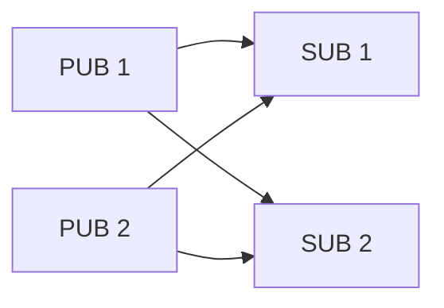
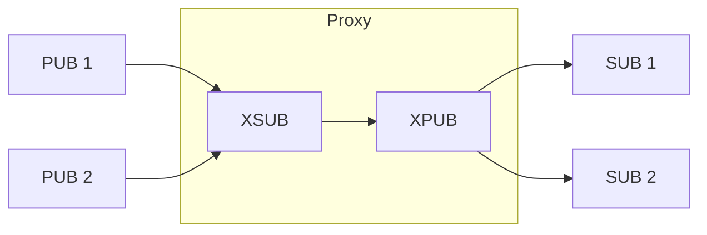

[English](03-6-proxy.en.md) | [한국어](03-6-proxy.ko.md)

<!-- zlink-nav:start -->
[← STREAM](03-5-stream.en.md) | [Transport →](04-transports.en.md)
<!-- zlink-nav:end -->

# Proxy Pattern

## 1. Overview

A proxy relays messages between two sockets.
`zlink_proxy()` is a general-purpose utility that works with any socket
combination. Users can also build custom proxies using public APIs.

## 2. zlink_proxy() — Built-in Proxy

```c
zlink_config_result_t zlink_proxy (void *frontend, void *backend, void *capture);
```

- Forwards messages from `frontend` to `backend` and vice versa
- If `capture` is non-NULL, copies all passing messages to the capture socket
- **Blocking function** — run in a dedicated thread
- **No socket type restriction** — internally calls `socket_base_t` internal
  recv/send methods, independent of public API `ZLINK_SUBMIT_NOT_SUPPORTED` / `ZLINK_RECV_NOT_SUPPORTED` restrictions

### Steerable Proxy

```c
zlink_config_result_t zlink_proxy_steerable (void *frontend, void *backend,
                                             void *capture, void *control);
```

`zlink_proxy_steerable()` adds a `control` socket through which the proxy can
be steered at runtime by sending one of these command frames:

| Command | Intended effect |
|---------|-----------------|
| `PAUSE` | Suspend forwarding |
| `RESUME` | Resume forwarding |
| `TERMINATE` | Stop the proxy and return |
| `STATISTICS` | Reply on the control socket with traffic counters |

> Note: in the current runtime the `PAUSE`/`RESUME` handlers are swapped
> (`PAUSE` resumes forwarding and `RESUME` suspends it). The table above
> describes the intended semantics; this is a known implementation bug.

### Supported Socket Combinations

| frontend | backend | Use case |
|----------|---------|----------|
| XSUB | XPUB | PUB/SUB relay (most common) |
| ROUTER | DEALER | Request/reply broker |
| DEALER | DEALER | Load balancing relay |
| PAIR | PAIR | Inter-thread bridge |

## 3. PUB/SUB Proxy — XSUB/XPUB

The most common proxy pattern.


### 3.1 Built-in Proxy

```c
void *xsub = zlink_socket(ctx, ZLINK_SOCKET_XSUB);
zlink_bind(xsub, "tcp://*:5556");      /* PUBs connect here */

void *xpub = zlink_socket(ctx, ZLINK_SOCKET_XPUB);
zlink_bind(xpub, "tcp://*:5557");      /* SUBs connect here */

void *capture = zlink_socket(ctx, ZLINK_SOCKET_PUB);
zlink_bind(capture, "tcp://*:5558");   /* optional: message recording */

zlink_proxy(xsub, xpub, capture);      /* blocking */
```

`zlink_proxy()` handles two things internally:
- **Data relay**: Pulls messages from XSUB and pushes to XPUB
- **Subscription propagation**: Pulls subscription events from XPUB and pushes to XSUB

### 3.2 Manual Proxy

When custom logic (logging, filtering, topic transformation) is needed,
build a manual proxy using public APIs only.

#### Data Flow

| Step | Socket | API | Description |
|------|--------|-----|-------------|
| 1 | XSUB | `zlink_subscribe(xsub, ...)` | Receive data (topic + parts separated) |
| 2 | App | Custom logic | Filtering, transformation, logging |
| 3 | XPUB | `zlink_publish(xpub, topic, parts, ...)` | Publish data |

#### Subscription Propagation

| Step | Socket | API | Description |
|------|--------|-----|-------------|
| 1 | XPUB | `zlink_xpub_recv_part(xpub, ...)` | Receive SUB subscribe/unsubscribe events |
| 2 | App | Custom logic | Authorization, topic remapping |
| 3 | XSUB | `zlink_set_subscription(xsub, topic)` | Propagate to upstream PUB |

#### Full Code

```c
void *xsub = zlink_socket(ctx, ZLINK_SOCKET_XSUB);
void *xpub = zlink_socket(ctx, ZLINK_SOCKET_XPUB);
zlink_bind(xsub, "tcp://*:5556");
zlink_bind(xpub, "tcp://*:5557");

while (running) {
    /* Data relay: XSUB → app → XPUB */
    zlink_routing_id_t rid;
    zlink_msg_t *parts = NULL;
    size_t count = 0;
    char topic[256];
    size_t topic_len = sizeof(topic);
    zlink_recv_result_t rc = zlink_subscribe(xsub, &rid, &parts, &count,
                             topic, &topic_len, ZLINK_DONTWAIT);
    if (rc == ZLINK_RECV_OK) {
        /* Insert custom logic here (filtering, logging, etc.) */
        zlink_publish(xpub, topic, parts, count, 0);
    }

    /* Subscription propagation: XPUB → app → XSUB */
    const zlink_routing_id_t *sub_rid = NULL;
    int subscribed;
    char sub_topic[256];
    size_t sub_len = 0;
    rc = zlink_xpub_recv_part(xpub, &sub_rid, &subscribed,
                              sub_topic, sizeof(sub_topic), &sub_len,
                              ZLINK_DONTWAIT);
    if (rc == ZLINK_RECV_OK) {
        /* Insert custom logic here (authorization, remapping, etc.) */
        if (subscribed)
            zlink_set_subscription(xsub, sub_topic);
        else
            zlink_unset_subscription(xsub, sub_topic);
    }
}
```

### 3.3 Why XSUB/XPUB?

| Question | With SUB/PUB | With XSUB/XPUB |
|----------|-------------|-----------------|
| Data pass-through | SUB local filter on — must subscribe | XSUB local filter off — **passes all** |
| Subscription events | PUB doesn't expose | XPUB exposes them via `zlink_xpub_recv()` |
| Proxy suitability | Proxy must manage topics itself | **Relay only — ideal for proxy** |

> **Key point:** `zlink_proxy()` internally calls `socket_base_t` internal
> methods, not public APIs. Through the public API, `zlink_send()` on XSUB
> returns `ZLINK_SUBMIT_NOT_SUPPORTED` and `zlink_recv()` on XPUB returns
> `ZLINK_RECV_NOT_SUPPORTED`. Proxy operation is only possible via
> `zlink_proxy()` or the manual approach above (using dedicated APIs like
> `subscribe()`, `publish()`, etc.).

## 4. Request/Reply Proxy — ROUTER/DEALER

```
Client (DEALER) --> ROUTER == proxy ==> DEALER --> Server (ROUTER)
```

```c
void *frontend = zlink_socket(ctx, ZLINK_SOCKET_ROUTER);
zlink_bind(frontend, "tcp://*:5559");

void *backend = zlink_socket(ctx, ZLINK_SOCKET_DEALER);
zlink_bind(backend, "tcp://*:5560");

zlink_proxy(frontend, backend, NULL);  /* blocking */
```

ROUTER/DEALER proxy has no subscription propagation, so `zlink_proxy()`
alone is sufficient. For manual construction, use `zlink_router_recv()` →
`zlink_send_rid()` combination.

## 5. Why Use a Proxy?

**Direct (no proxy) -- N x M connections:**



> PUB/SUB must know each other's addresses. Connection count = N x M.

**With proxy -- N + M connections:**



> Only the proxy address is needed. Connection count = N + M.

| Use Case | Description |
|----------|-------------|
| **Reduce connections** | N×M → N+M |
| **Address decoupling** | PUB/SUB don't need each other's endpoints |
| **Dynamic scaling** | PUB/SUB add/remove independently |
| **Subscription transformation** | XPUB MANUAL mode for topic remapping/filtering |
| **Network bridging** | Connect different network segments (e.g., inproc ↔ tcp) |
| **Monitoring** | Capture socket records all passing messages |

---
<!-- zlink-nav:bottom:start -->
[← STREAM](03-5-stream.en.md) | [Transport →](04-transports.en.md)
<!-- zlink-nav:bottom:end -->
