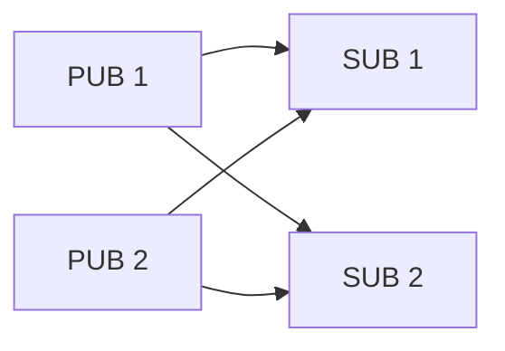
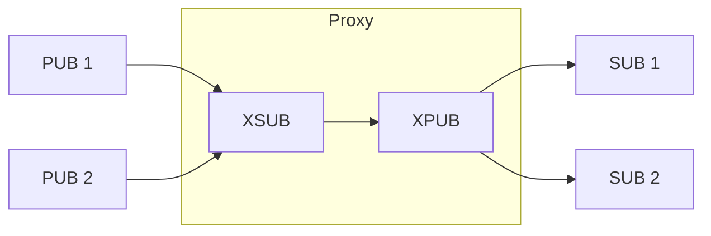

[English](03-6-proxy.en.md)

<!-- zlink-nav:start -->
[가이드 목록](README.ko.md) | [이전: STREAM](03-5-stream.ko.md) | [다음: Transport 가이드](04-transports.ko.md)
<!-- zlink-nav:end -->

# 프록시 패턴

> **이 장이 답하는 것** — ROUTER·DEALER·PAIR를 조합해 메시지를 중계하는 proxy를
> 구성하는 방법을 설명한다. 개별 socket의 계약은 각 socket 스펙이 소유한다.

## 1. 개요

프록시는 두 소켓 사이에서 메시지를 중계하는 패턴이다.
`zlink_proxy()`는 어떤 소켓 조합이든 동작하는 범용 유틸리티 함수이고,
공개 API를 조합하면 사용자가 직접 커스텀 프록시를 구성할 수도 있다.

## 2. zlink_proxy() — 내장 프록시

```c
zlink_config_result_t zlink_proxy (void *frontend, void *backend, void *capture);
```

- `frontend` → `backend` 방향으로 메시지를 전달하고 동시에 반대 방향도 처리한다
- `capture`가 NULL이 아니면 통과하는 모든 메시지를 capture 소켓에 복사한다
- **블로킹 함수** — 별도 스레드에서 실행한다
- **소켓 타입 제한 없음** — 내부적으로 `socket_base_t`의 internal recv/send를
  직접 호출하므로 공개 API의 `ZLINK_SUBMIT_NOT_SUPPORTED` / `ZLINK_RECV_NOT_SUPPORTED` 제한과 무관하게 동작한다

### Steerable 프록시

```c
zlink_config_result_t zlink_proxy_steerable (void *frontend, void *backend,
                                             void *capture, void *control);
```

`zlink_proxy_steerable()`은 `control` 소켓을 추가해 런타임에 다음 명령 프레임으로
프록시를 제어한다:

| 명령 | 의도한 동작 |
|------|-------------|
| `PAUSE` | 전달 일시 중지 |
| `RESUME` | 전달 재개 |
| `TERMINATE` | 프록시 중지 후 반환 |
| `STATISTICS` | control 소켓으로 트래픽 카운터 응답 |

> 참고: 현재 런타임은 `PAUSE`/`RESUME` 핸들러가 서로 뒤바뀌어 있다
> (`PAUSE`가 전달을 재개하고 `RESUME`이 중지함). 위 표는 의도한 의미이며,
> 이는 알려진 구현 버그다.

### 지원 소켓 조합 예시

| frontend | backend | 용도 |
|----------|---------|------|
| XSUB | XPUB | PUB/SUB 중계 (가장 일반적) |
| ROUTER | DEALER | 요청/응답 브로커 |
| DEALER | DEALER | 로드밸런싱 중계 |
| PAIR | PAIR | 스레드 간 브릿지 |

## 3. PUB/SUB 프록시 — XSUB/XPUB

가장 일반적인 프록시 패턴이다.


### 3.1 내장 프록시 사용

```c
void *xsub = zlink_socket(ctx, ZLINK_SOCKET_XSUB);
zlink_bind(xsub, "tcp://*:5556");      /* PUBs connect here */

void *xpub = zlink_socket(ctx, ZLINK_SOCKET_XPUB);
zlink_bind(xpub, "tcp://*:5557");      /* SUBs connect here */

void *capture = zlink_socket(ctx, ZLINK_SOCKET_PUB);
zlink_bind(capture, "tcp://*:5558");   /* optional: message recording */

zlink_proxy(xsub, xpub, capture);      /* blocking */
```

`zlink_proxy()`는 다음 두 가지를 내부에서 자동 처리한다:
- **데이터 전달**: XSUB에서 메시지를 꺼내 XPUB으로 전달
- **구독 전파**: XPUB에서 구독 이벤트를 꺼내 XSUB으로 전파

### 3.2 수동 프록시 구성

중간에 로깅, 필터링, 토픽 변환 같은 맞춤 로직이 필요하면
공개 API만으로 수동 프록시를 구성할 수 있다.

#### 데이터 흐름

| 단계 | 소켓 | API | 설명 |
|------|------|-----|------|
| 1 | XSUB | `zlink_subscribe(xsub, ...)` | 데이터 수신 (토픽 + parts 분리) |
| 2 | 앱 | 커스텀 로직 | 필터링, 변환, 로깅 등 |
| 3 | XPUB | `zlink_publish(xpub, topic, parts, ...)` | 데이터 발행 |

#### 구독 전파 흐름

| 단계 | 소켓 | API | 설명 |
|------|------|-----|------|
| 1 | XPUB | `zlink_xpub_recv_part(xpub, ...)` | SUB의 구독/해제 이벤트 수신 |
| 2 | 앱 | 커스텀 로직 | 구독 인가, 토픽 재매핑 등 |
| 3 | XSUB | `zlink_set_subscription(xsub, topic)` | upstream PUB에 구독 전파 |

#### 전체 코드

```c
void *xsub = zlink_socket(ctx, ZLINK_SOCKET_XSUB);
void *xpub = zlink_socket(ctx, ZLINK_SOCKET_XPUB);
zlink_bind(xsub, "tcp://*:5556");
zlink_bind(xpub, "tcp://*:5557");

while (running) {
    /* Data relay: XSUB → app → XPUB */
    zlink_routing_id_t rid;
    zlink_msg_t *parts = NULL;
    size_t count = 0;
    char topic[256];
    size_t topic_len = sizeof(topic);
    zlink_recv_result_t rc = zlink_subscribe(xsub, &rid, &parts, &count,
                             topic, &topic_len, ZLINK_DONTWAIT);
    if (rc == ZLINK_RECV_OK) {
        /* Insert custom logic here (filtering, logging, etc.) */
        zlink_publish(xpub, topic, parts, count, 0);
    }

    /* Subscription propagation: XPUB → app → XSUB */
    const zlink_routing_id_t *sub_rid = NULL;
    int subscribed;
    char sub_topic[256];
    size_t sub_len = 0;
    rc = zlink_xpub_recv_part(xpub, &sub_rid, &subscribed,
                              sub_topic, sizeof(sub_topic), &sub_len,
                              ZLINK_DONTWAIT);
    if (rc == ZLINK_RECV_OK) {
        /* Insert custom logic here (authorization, remapping, etc.) */
        if (subscribed)
            zlink_set_subscription(xsub, sub_topic);
        else
            zlink_unset_subscription(xsub, sub_topic);
    }
}
```

### 3.3 왜 XSUB/XPUB인가?

| 질문 | SUB/PUB 사용 시 | XSUB/XPUB 사용 시 |
|------|----------------|-------------------|
| 데이터 통과 | SUB 로컬 필터 켜짐 — 구독해야 통과 | XSUB 로컬 필터 꺼짐 — **무조건 통과** |
| 구독 이벤트 관찰 | PUB이 노출 안 함 | XPUB이 `zlink_xpub_recv()`로 노출 |
| 프록시 적합성 | 프록시가 토픽을 직접 관리해야 함 | **중계만 하면 되므로 적합** |

> **핵심:** `zlink_proxy()` 내부는 공개 API가 아닌 `socket_base_t`의
> internal method를 직접 호출해 데이터를 전달한다.
> 공개 API에서 XSUB에 `zlink_send()`를 호출하면 `ZLINK_SUBMIT_NOT_SUPPORTED`를,
> XPUB에 `zlink_recv()`를 호출하면 `ZLINK_RECV_NOT_SUPPORTED`를 반환한다.
> 프록시 동작은 `zlink_proxy()` 함수나
> 위의 수동 구성(전용 API 조합)으로만 가능하다.

## 4. 요청/응답 프록시 — ROUTER/DEALER

```
Client (DEALER) --> ROUTER == proxy ==> DEALER --> Server (ROUTER)
```

```c
void *frontend = zlink_socket(ctx, ZLINK_SOCKET_ROUTER);
zlink_bind(frontend, "tcp://*:5559");

void *backend = zlink_socket(ctx, ZLINK_SOCKET_DEALER);
zlink_bind(backend, "tcp://*:5560");

zlink_proxy(frontend, backend, NULL);  /* blocking */
```

ROUTER/DEALER 프록시는 구독 전파가 없으므로 `zlink_proxy()`만으로 충분하다.
수동으로 구성하려면 `zlink_router_recv()` → `zlink_send_rid()` 조합을 사용한다.

## 5. 프록시가 필요한 이유

**직접 연결 (프록시 없음) -- N x M 연결:**



> PUB/SUB가 서로의 주소를 알아야 한다. 연결 수 = N x M.

**프록시 사용 -- N + M 연결:**



> 프록시 주소만 알면 된다. 연결 수 = N + M.

| 용도 | 설명 |
|------|------|
| **연결 수 감소** | N×M → N+M |
| **주소 분리** | PUB/SUB가 서로의 endpoint를 몰라도 됨 |
| **동적 확장** | PUB/SUB 독립 추가·제거 |
| **구독 변환** | XPUB MANUAL 모드로 토픽 재매핑/필터링 |
| **네트워크 브리징** | inproc ↔ tcp 같은 세그먼트 연결 |
| **모니터링** | capture 소켓으로 통과 메시지 기록 |

---
<!-- zlink-nav:bottom:start -->
[← STREAM](03-5-stream.ko.md) | [Transport →](04-transports.ko.md)
<!-- zlink-nav:bottom:end -->
