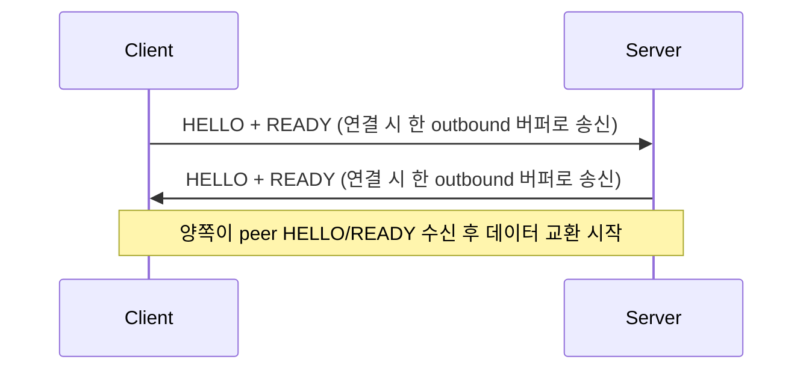
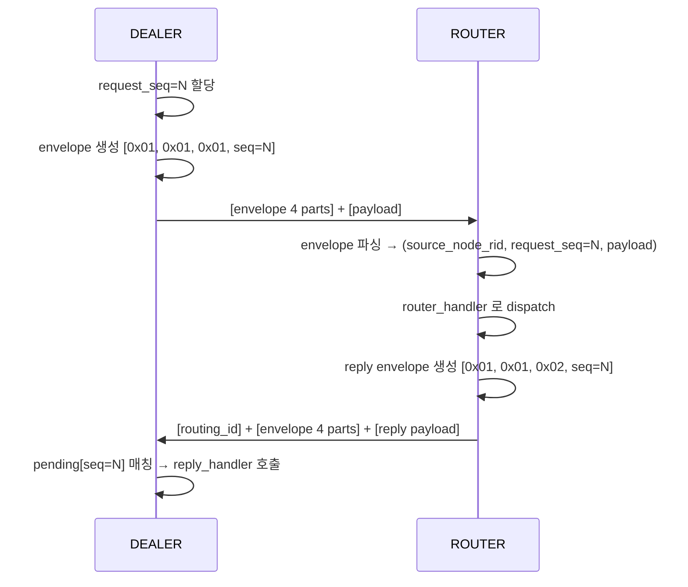

[English](protocol-zmp.en.md)

<!-- zlink-nav:start -->
[가이드 목차](../guide/README.ko.md) | [이전: Core raw runtime 내부 경계](runtime-boundary.ko.md) | [다음: RAW 프로토콜 상세](protocol-raw.ko.md)
<!-- zlink-nav:end -->

# ZMP v1.0 프로토콜 상세

> **이 장이 답하는 것** — ZMP 와이어 프로토콜과 request-reply envelope의 바이트 단위
> 내부 구조. 소개는 [ZMP protocol 가이드](../guide/zmp-protocol.ko.md)가 다룬다.

### 용어

| 용어 | 설명 |
|------|------|
| ZMP | zlink Message Protocol — zlink 전용 와이어 프로토콜 |
| frame | 와이어 위에서 전송되는 하나의 데이터 단위 |
| control part | application payload 앞에 오는 내부 제어 파트 |
| request-reply envelope | request type, `request_seq`(요청 고유 번호)를 담는 control part 묶음 |
| routing_id | transport peer를 식별하는 바이트 열 |

## 1. 기본 방향

request-reply 는 `zlink_msg_t` 내부 필드가 아니라 ZMP
multipart control part 로 표현한다. 즉 다음 방식은 이 프로토콜의 모델이 아니다.

- message-level request marking
- per-message metadata envelope
- recv 후 내부 필드를 복원하는 방식

ordinary `zlink_send()` / `zlink_recv()` 는 payload part 만 다룬다.
request-reply 는 전용 공개 API 가 control part 를 앞에
붙여 보내고 전용 decode 경로가 이를 해석한다.

## 2. 공통 프레임 헤더

### 2.1 헤더 레이아웃

```text
 Byte:   0         1         2         3         4    5    6    7
      +---------+---------+---------+---------+---------------------+
      |  MAGIC  | VERSION |  FLAGS  |RESERVED |   PAYLOAD SIZE      |
      |  (0x5A) |  (0x01) |         | (0x00)  |   (32-bit BE)       |
      +---------+---------+---------+---------+---------------------+
```

| 필드 | 오프셋 | 크기 | 설명 |
|------|--------|------|------|
| MAGIC | 0 | 1 | `0x5A` |
| VERSION | 1 | 1 | `0x01` |
| FLAGS | 2 | 1 | 프레임 플래그 |
| RESERVED | 3 | 1 | `0x00` |
| PAYLOAD SIZE | 4-7 | 4 | Big Endian |

### 2.2 FLAGS 비트

| 비트 | 이름 | 값 | 설명 |
|------|------|-----|------|
| 0 | MORE | `0x01` | 멀티파트 계속 |
| 1 | CONTROL | `0x02` | control part |
| 2 | IDENTITY | `0x04` | routing id 관련 프레임 |
| 3 | SUBSCRIBE | `0x08` | 구독 요청 |
| 4 | CANCEL | `0x10` | 구독 취소 |

request-reply envelope 의 part 들은 ZMP `CONTROL` 프레임이 아니라
application payload 앞에 붙는 일반 multipart 데이터 frame(`MORE` 플래그)으로
전송된다. ZMP `CONTROL` 비트는 HELLO/READY 같은 protocol control
frame에만 쓰이며, decoder는 `CONTROL` 과 `MORE` 를 함께 켠 frame을 거부한다.

## 3. Handshake



**HELLO frame**: control type(1바이트), socket type(1바이트),
routing ID 길이(1바이트), routing ID(0~255바이트) 순서로 구성한다.

**READY frame**: READY control byte는 항상 전송한다. `Socket-Type`과
`Routing-Id` metadata property는 `ZLINK_OPT_ZMP_METADATA`를 활성화했을 때
추가한다. 이 option의 기본값은 비활성화다. 다만 paired DEALER와 ROUTER transport는
이 option과 관계없이 이 metadata와 §3.1의 pair property를 항상 추가한다.

### 3.1 Request-reply transport pair

Request-reply를 사용하는 하나의 logical DEALER/ROUTER peer는 두 physical transport
connection을 사용한다.

| Lane | 전달하는 traffic |
|---|---|
| Application | 일반 application message와 request |
| Completion | 이미 보낸 request를 완료하는 reply |

두 connection의 READY frame에는 `Zlink-Pair-Id`, `Zlink-Pair-Generation`,
`Zlink-Lane`이 들어간다. Pair ID와 generation은 unsigned 64-bit big-endian 값이다.
Lane은 한 byte이며 Application은 `0`, Completion은 `1`이다. 세 property는 항상
함께 있어야 한다. 두 connection의 pair ID, generation과 peer routing identity가
모두 일치해야 한다.

Application write는 두 lane의 검증이 끝날 때까지 대기한다. 이전 generation에서
수신한 data를 새 pair에 연결하지 않는다. 한 lane에서 protocol error, identity
mismatch, fence timeout 또는 terminal failure가 발생하면 pair 전체를 종료한다.
Reconnect는 새 generation을 만들고 두 lane을 다시 검증한 뒤 Application write를
재개한다.

FIFO 순서는 각 lane 안에서만 보장한다. 두 lane 사이의 순서는 보장하지 않는다.
Application ingress가 backpressure로 중단되어도 Completion reply를 처리할 수 있다.
Relocation, session binding과 그 밖의 상위 protocol은 두 connection 사이의 순서에
의존하지 않고 자체 generation fence를 사용해야 한다.

## 4. request-reply envelope

request-reply 는 payload 앞에 4개 control part 를 붙인다.

```text
[request-reply protocol id]
[request-reply version]
[message type]
[request seq]
[payload part 0]
[payload part 1]
...
```

필드 값:

- protocol id: `0x01`
- version: `0x01`
- message type:
  - `0x01` = request
  - `0x02` = reply
  - `0x03` = error reply
- request seq: 8바이트 Big Endian `uint64`

핵심 규칙:

- `request_seq = 0` 은 유효하지 않다.
- reply 는 request 에서 받은 `request_seq` 를 그대로 다시 보낸다.
- `error reply` 는 첫 payload part 에 4바이트 Big Endian errno 를 넣는다.
- ordinary payload 는 control part 뒤의 나머지 part 전체다.

### Request-Reply 시퀀스 (DEALER → ROUTER)



## 5. ZMP의 범위

ZMP는 raw socket handshake, request-reply와 connection control frame만 정의한다. Application service
topology나 stateful object protocol을 포함하지 않는다.

## 6. encode / decode 흐름

### 6.1 socket request-reply

송신:

1. request/reply 종류를 결정한다.
2. `request_seq` 를 local counter 에서 잡는다.
3. 4개 control part 를 만든다.
4. 사용자 payload part 를 뒤에 붙여 보낸다.

수신:

1. 첫 4개 part 가 request-reply envelope 인지 검사한다.
2. `message_type`, `request_seq` 를 읽는다.
3. request 면 request handler 로 넘긴다.
4. Completion lane에서 받은 reply는 pending map에서 `request_seq` 또는
   `source_node_rid + request_seq`로 찾는다.

Reply payload는 Completion pipe에서 등록 callback으로 바로 이동한다. 숨은 PAIR
receive queue나 두 번째 completion payload deque에 보관하지 않는다. Timeout,
shutdown과 같은 terminal callback에는 payload가 없는 작은 control queue만 유지한다.

## 7. pending 과 완료 규칙

pending(응답 대기 항목) 소유권은 상위 API 계층에 있다. 현재 구현은 다음처럼 동작한다.

- `DEALER` pending key: `request_seq`
- `ROUTER` pending key: `source_node_rid + request_seq`

완료 규칙:

- 첫 reply 1건으로 high-level request 를 완료한다.
- timeout 이 먼저 오면 pending entry 를 지우고 `ETIMEDOUT` 로 콜백한다.
- 완료 후 같은 key 로 추가 reply 가 와도 다시 callback 하지 않는다.
- `error reply` 는 payload 대신 `errno != 0` completion 으로 바꿔 전달한다.

## 8. transport routing_id 와의 관계

transport `routing_id` 와 request-reply 주소는 같은 값이 아니다.

- transport `routing_id`: 현재 연결된 peer 주소
- `request_seq`: request 와 reply 를 묶는 식별자

둘을 섞으면 reply 주소를 잘못 계산하게 된다.
문서와 구현 모두 이를 다른 계층으로 설명해야 한다.

## 9. 유효성 검사

decode 쪽은 최소한 아래를 검사한다.

- control part 개수가 충분한지
- protocol id 와 version 이 맞는지
- `request_seq != 0` 인지
- message type 이 알려진 값인지

이 검사에 실패한 메시지는 request-reply 메시지로 취급하지
않는다. pending completion 도 일으키지 않는다.

## 10. WebSocket framing

- RFC 6455 binary frame(opcode `0x02`)을 사용한다.
- payload에는 ZMP frame이 들어간다.
- 구현은 Beast library를 사용한다.
