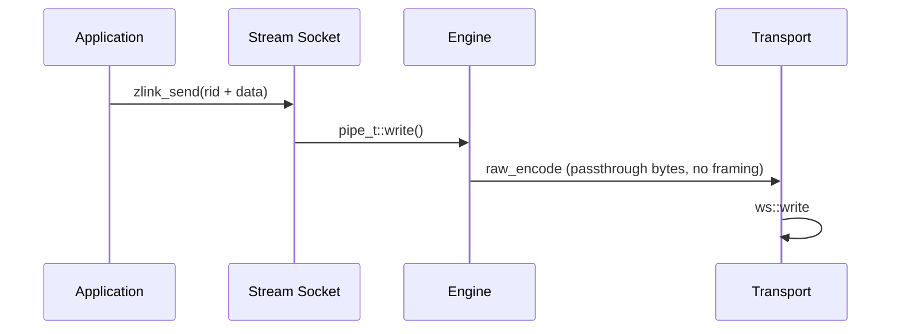

[English](stream-socket.en.md) | [한국어](stream-socket.ko.md)

# STREAM Socket WS/WSS Optimization

## 1. Overview

The STREAM socket supports RAW communication with external clients (web browsers, game clients, etc.) that do not use ZMP. It supports tcp, tls, ws, and wss transports, with a particular focus on performance optimization of the WS/WSS path.

## 2. Architecture

### 2.1 Component Layout

| Component | File | Role |
|----------|------|------|
| stream_t | src/runtime/sockets/stream/stream.cpp | STREAM socket logic |
| raw_encoder_t | src/runtime/protocol/raw_encoder.cpp | passthrough encoding (no framing) |
| raw_decoder_t | src/runtime/protocol/raw_decoder.cpp | passthrough decoding (byte span -> msg_t) |
| asio_raw_engine_t | src/runtime/engine/asio/asio_raw_engine.cpp | RAW I/O engine |
| ws_transport_t | src/runtime/transports/ws/ | WebSocket transport |
| wss_transport_t | src/runtime/transports/tls/ | WebSocket + TLS |

### 2.2 Data Flow



## 3. WS/WSS Performance Characteristics

### 3.1 Read Path
- Data is copied from the Beast read buffer (`message_buffer`) into the
  outgoing `msg_t` (single copy at delivery).

### 3.2 Write Path
- `msg_t` payload is passed directly to the Beast write buffer (no
  intermediate copy).

### 3.3 Beast Write Buffer
- The Beast write buffer default is 64KB. A WS write sends the given buffer as a
  single binary frame (one `async_write`).

### 3.4 Frame Fragmentation
- `auto_fragment(false)` — one logical message maps to one WebSocket
  frame.

## 4. Measured Throughput

Representative single-socket throughput on the standard benchmark
machine:

| Transport | Throughput |
|-----------|------------|
| TCP       | 1493 MB/s  |
| WS        |  696 MB/s  |
| WSS 1KB   |  382 MB/s  |

Large messages benefit most from the WS framing choices; 64KB and
larger payloads approach the TCP line rate for WS, and WSS cost is
dominated by TLS encryption overhead.

## 5. Design Trade-offs

- Speculative write not supported (WebSocket is frame-based)
- Gather write not supported for WS/WSS (`supports_gather_write()` returns false)
- TLS/WSS has encryption overhead

## 6. Packet Handler Receive Mode

STREAM sockets expose three mutually exclusive receive modes. Exactly
one can be active per socket; the second activation attempt on the same
socket fails with `EBUSY`.

| Mode | Activation | Delivery |
|------|------------|----------|
| Raw recv | default | `zlink_recv()` returns raw bytes per read |
| Raw callback | `zlink_recv_handler()` | `zlink_socket_msg_handler_fn` with raw bytes |
| Packet callback | `zlink_stream_packet_handler()` | `zlink_stream_packet_handler_fn` with decoded header/body messages |

The packet handler mode is tailored to application protocols that carry
`header + body` framing on top of the raw STREAM byte pipe -- for
example an orders-exec gateway whose clients send a small control
header followed by a larger payload. Instead of each caller writing the
same length-prefix decoder and buffering state machine, STREAM parses
the frames internally and delivers already-allocated `zlink_msg_t`
objects to the callback.

### 6.1 Wire framing

Each logical packet is carried on the wire as:

```
+------------------+--------------------+----------------+-------------------+
| u16 header_size  | u32 body_size      | header bytes   | body bytes        |
| (big-endian)     | (big-endian)       | (header_size)  | (body_size)       |
+------------------+--------------------+----------------+-------------------+
```

- `header_size` is a 2-byte big-endian unsigned integer.
- `body_size` is a 4-byte big-endian unsigned integer.
- Both sizes may be `0`. A packet with `header_size=0 && body_size=0`
  still yields a callback, with two empty but non-`NULL` `zlink_msg_t`
  instances.
- Size checks apply only when `maxmsgsize` is set to a positive value (the
  default `-1` is unbounded). Advertising a size that exceeds the configured
  limit is treated as malformed framing (see 6.4).

### 6.2 Per-connection accumulator

Incoming bytes are fed through each connection's packet state
(`pipe_t::_stream_packet_state`); the handler accesses it via
`pipe_->stream_packet_state()`.

```
  wire bytes (arbitrary fragmentation)
         |
         v
  +-------------------------+
  | pipe packet state       |
  |   stage: prefix_stage   |
  |          header_stage   |
  |          body_stage     |
  +-------------------------+
         |
         v
  callback(stream, source_rid, header_msg, body_msg, userdata)
```

Length fields are parsed first. Once both `header_size` and `body_size`
are known, incoming bytes are accumulated into the per-connection packet
state's header and body buffers as reads arrive. When a packet completes,
those accumulation buffers are moved (zero-copy) into freshly initialized
`zlink_msg_t` header and body objects, which are then handed to the
callback. There is no extra copy at delivery time -- the move transfers
the assembled buffers into the messages the callback receives.

### 6.3 Callback contract

The signature is:

```
zlink_stream_packet_handler_fn(stream,
                               source_rid,    // borrowed view
                               header_msg,    // ownership transfers
                               body_msg,      // ownership transfers
                               userdata)
```

- `source_rid` is a borrowed view for the duration of the callback. It
  must not be retained past the call; copy it if needed.
- `header_msg` and `body_msg` are always non-`NULL`, even when the
  corresponding wire size is `0`. Ownership of both transfers to the
  callback, which is responsible for closing them with
  `zlink_msg_close()`.
- Packets from the same `source_rid` are serialized: a later packet on
  the same peer cannot overtake an earlier one. Packets from different
  `source_rid` may be dispatched in parallel on different worker
  threads.
- Self-close from within the raw callback is the same rule as the raw
  `zlink_recv_handler` case: attempting to flip the socket's receive
  mode or close the socket from inside the callback fails with `EBUSY`.

### 6.4 Malformed framing

STREAM treats the following as malformed and closes the offending
connection:

- A declared `header_size` or `body_size` that exceeds internal limits.
- The peer closes (or resets) after the length fields have started but
  before the full packet has arrived -- i.e. mid-length or mid-payload
  close.

Closure is observable through the STREAM socket monitor as a disconnect
event for that `source_rid`. No partial packet is ever delivered to the
callback; the decoder state for that connection is discarded with the
connection.

### 6.5 Why decode inside STREAM

Decoding inside STREAM (rather than in each application) has two
reasons worth calling out:

- **One fewer copy.** The application never sees a contiguous
  "assembled" buffer that it later has to split -- the accumulation
  buffers are moved (zero-copy) into the header and body messages.
- **Ordering guarantees.** Per-`source_rid` serialization is enforced
  by the decoder, so callers do not have to build their own reordering
  logic on top of raw byte delivery.

## 7. Current STREAM Runtime Defaults

STREAM uses a consolidated default performance profile across transports.
For non-STREAM-wide socket defaults, see
[socket-option-defaults.md](socket-option-defaults.en.md).

### 7.1 Fixed internal constants

These values are fixed as internal constants and not controlled by STREAM env knobs:
- handler allocator: enabled
- read drain: enabled
- speculative write: fixed on for STREAM/TCP path
- RX slab buffering: enabled
- speculative write byte budget: `2097152`
- read drain max loops: `64`
- read drain max bytes: `1048576`

### 7.2 Effective socket/listener defaults

- backlog: `65536`
- `sndhwm` / `rcvhwm`: start from the routed-role auto-HWM floor
- `sndbuf` / `rcvbuf`: default `-1`, leaving OS buffer defaults and TCP
  autotuning in control
- accept concurrency (STREAM only): default `4`, max `128`
- session scheduler (STREAM): default `rr`

### 7.3 Remaining STREAM runtime env controls

- `ZLINK_ASIO_STREAM_ACCEPT_CONCURRENCY`: default `4`, clamped to `128`
- `ZLINK_ASIO_STREAM_SESSION_SCHED` (`rr|minload`): default `rr`
- `ZLINK_ASIO_STREAM_ENABLE_NON_TCP_SPEC_READ`: disabled by default
- `ZLINK_ASIO_STREAM_DISABLE_GATHER`: disabled by default, so STREAM gather-write stays enabled
- `ZLINK_ASIO_STREAM_GATHER_THRESHOLD`: default `1024`
- `ZLINK_ASIO_STREAM_TINY_GATHER_THRESHOLD`: default `0`
- `ZLINK_ASIO_STREAM_INITIAL_TARGET_CAP`: default `4096`
- `ZLINK_ASIO_STREAM_BATCH_SIZE`: default `4096`
- `ZLINK_ASIO_STREAM_BATCH_HEADROOM`: default `64`

## 8. Peer RID Disconnect

STREAM's public routing id is the 4-byte connection id assigned by the server
for each connection. `zlink_disconnect_rid()` interprets that id as a
`uint32_t`, looks up the pipe in the STREAM route map, and requests
termination. Any rid that is not 4 bytes fails as an invalid argument.
