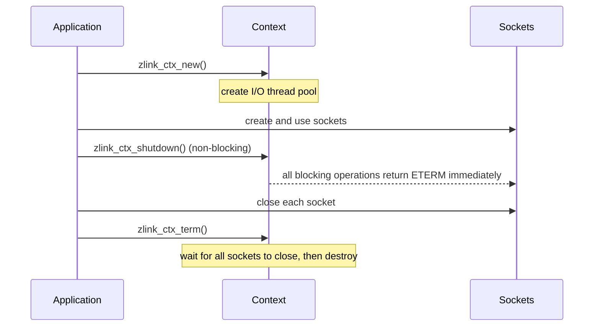

[한국어](https://zlink-systems.github.io/zlink/ko/spec/core/01-context/) | English

<!-- zlink-nav:start -->
[Core spec index](README.en.md) | [Previous: Public-contract governance](00-public-contract-governance.en.md) | [Next: Message](02-message.en.md)
<!-- zlink-nav:end -->

# Context

> **What this chapter defines** — the public C ABI contract for what a
> Context owns and how it is created, configured, and safely terminated.

## 1. Context overview

zlink's [Context](glossary.en.md#context) is the top-level container that
holds I/O-processing threads and sockets. Every application must create at
least one Context before using any other zlink API, and every
[socket](glossary.en.md#socket) must belong to some Context.

This document defines the contract for creating a Context, configuring it
with options, and terminating it safely. It is aimed at developers who carry
this contract into the C API and into each language binding.

The related contracts are owned by the following documents.

| Related contract | Owning document |
|---|---|
| Auto HWM budget calculation and admission, and their functions | [Auto HWM](systems/06-auto-hwm.en.md) |
| socket creation, options, and send/receive | [Sockets](socket/README.en.md) |
| message lifecycle and ownership | [Message](02-message.en.md) |

## 2. What a context owns

A Context owns the following.

- **I/O thread pool** — the set of [I/O threads](glossary.en.md#io-thread)
  that actually handle network send and receive. The number of threads,
  their scheduling priority, and their CPU affinity are all set through
  Context options.
- **socket container** — the parent of every [socket](glossary.en.md#socket)
  created from this Context. The upper bound on the number of sockets that
  may be open at once is also a Context option.
- **shared configuration** — values that apply to the whole context, such as
  thread names, the maximum message size, and the
  [Auto HWM](glossary.en.md#auto-hwm-budget) policy that automatically sizes
  socket queues.

A Context is thread-safe. Multiple threads may share the same Context handle
at once and query or set options concurrently.

## 3. Lifecycle and shutdown

A Context's lifecycle proceeds in the order **create → use → shutdown signal
→ resource release**.

- **Create** — `zlink_ctx_new` creates a Context with default option values.
- **Shutdown signal** — `zlink_ctx_shutdown` only signals that every
  blocking operation on sockets belonging to this Context should
  immediately unwind with `ETERM`. It is a non-blocking call that does not
  release resources.
- **Resource release** — `zlink_ctx_term` destroys the Context. This call
  may block until every socket created within the Context has closed. Each
  Context must be terminated exactly once.

If multiple threads are using sockets concurrently, call shutdown before
term to avoid deadlock — calling term alone, without shutdown, can stall
waiting for sockets to close. Blocking behavior during termination is
controlled by the `ZLINK_CTX_OPT_BLOCKY` option.



## 4. Options

Set and query `int` options with `zlink_ctx_set` and `zlink_ctx_get`. Use
`zlink_ctx_set_data` and `zlink_ctx_get_data` for the Auto HWM byte options.

```c
typedef enum zlink_ctx_option_t
{
    ZLINK_IO_THREADS              = 1,  // Number of I/O threads in the context
    ZLINK_MAX_SOCKETS             = 2,  // Maximum number of sockets allowed
    ZLINK_SOCKET_LIMIT            = 3,  // Hard upper limit on socket count (read-only)
    ZLINK_THREAD_PRIORITY         = 3,  // I/O thread scheduling priority
    ZLINK_THREAD_SCHED_POLICY     = 4,  // I/O thread scheduling policy
    ZLINK_MAX_MSGSZ               = 5,  // Maximum message size (bytes, >= 0, default INT_MAX)
    ZLINK_MSG_T_SIZE              = 6,  // Size of zlink_msg_t (bytes, read-only)
    ZLINK_THREAD_AFFINITY_CPU_ADD      = 7,  // Add a CPU to the I/O thread affinity set
    ZLINK_THREAD_AFFINITY_CPU_REMOVE   = 8,  // Remove a CPU from the I/O thread affinity set
    ZLINK_THREAD_NAME_PREFIX      = 9,  // Prefix for I/O thread names
    ZLINK_CTX_OPT_BLOCKY          = 10,  // Controls blocking behavior on termination (int, default 1)
    ZLINK_CTX_OPT_AUTO_HWM_ENABLE = 12,  // Whether automatic HWM is enabled (0=disabled, 1=enabled)
    ZLINK_CTX_OPT_AUTO_HWM_RECALC_DEBOUNCE_MS = 14,  // Automatic HWM recalculation debounce (ms, >= 0)
    ZLINK_CTX_OPT_AUTO_HWM_PROFILE = 17,  // Automatic HWM profile. Unknown values fail with EINVAL
    /* Value 18 is intentionally unassigned. */
    ZLINK_CTX_OPT_AUTO_HWM_MEMORY_LIMIT_BYTES = 19,  // Explicit memory limit (uint64_t bytes, set/get_data). 0=unset
    ZLINK_CTX_OPT_AUTO_HWM_RUNTIME_MEMORY_LIMIT_BYTES = 20,  // Runtime memory hint (uint64_t bytes, set/get_data). 0=no detection
    ZLINK_CTX_OPT_AUTO_HWM_CORE_BUDGET_BYTES = 21  // Core budget used as-is without a profile (uint64_t bytes, set/get_data). 0=unset
} zlink_ctx_option_t;
```

```c
typedef enum zlink_auto_hwm_profile_t
{
    ZLINK_AUTO_HWM_PROFILE_COMPACT = 0,
    ZLINK_AUTO_HWM_PROFILE_LOW_LATENCY = 1,
    ZLINK_AUTO_HWM_PROFILE_BALANCED = 2,
    ZLINK_AUTO_HWM_PROFILE_THROUGHPUT = 3
} zlink_auto_hwm_profile_t;
```

> **Note:** `ZLINK_SOCKET_LIMIT` and `ZLINK_THREAD_PRIORITY` share the enum
> value `3`. In the current public C ABI the option lookup resolves value `3`
> to the read-only `ZLINK_SOCKET_LIMIT`, so `ZLINK_THREAD_PRIORITY` cannot be
> set or queried through `zlink_ctx_set` / `zlink_ctx_get`.

What budget the three Auto HWM byte options (`MEMORY_LIMIT_BYTES`,
`RUNTIME_MEMORY_LIMIT_BYTES`, and `CORE_BUDGET_BYTES`) compute and how it is
used in admission is owned by [Auto HWM](systems/06-auto-hwm.en.md).

### 4.1 Default values

```c
#define ZLINK_IO_THREADS_DFLT           4  // Default number of I/O threads
#define ZLINK_MAX_SOCKETS_DFLT          4095  // Default maximum socket count
#define ZLINK_THREAD_PRIORITY_DFLT      -1  // Default priority (OS default)
#define ZLINK_THREAD_SCHED_POLICY_DFLT  -1  // Default scheduling policy (OS default)
#define ZLINK_CTX_AUTO_HWM_ENABLE_DFLT  1  // Automatic HWM enabled by default (falls back to balanced when disabled or manual HWM is unset)
#define ZLINK_CTX_AUTO_HWM_RECALC_DEBOUNCE_MS_DFLT 3000  // Default recalculation debounce (ms)
#define ZLINK_CTX_AUTO_HWM_PROFILE_DFLT ZLINK_AUTO_HWM_PROFILE_BALANCED  // Default profile
#define ZLINK_CTX_AUTO_HWM_MEMORY_LIMIT_BYTES_DFLT ((uint64_t) 0)  // No explicit limit set
#define ZLINK_CTX_AUTO_HWM_RUNTIME_MEMORY_LIMIT_BYTES_DFLT ((uint64_t) 0)  // No runtime hint
#define ZLINK_CTX_AUTO_HWM_CORE_BUDGET_BYTES_DFLT ((uint64_t) 0)  // No manual Core budget set
```

`SNDBUF` / `RCVBUF` default to `-1`. This value means zlink does not set the
OS socket buffer size directly and instead leaves it to the OS default and
TCP autotuning. Auto-HWM profiles do not change this value automatically.

## 5. Functions

### zlink_ctx_new

Create a new zlink context.

```c
ZLINK_EXPORT void *zlink_ctx_new(void);
```

Allocates and initializes a new context with default option values. The context
manages a pool of I/O threads and serves as the foundation for creating
sockets. Every socket must be associated with a context. When the context is no
longer needed, release it with `zlink_ctx_term`.

**Returns:** A context handle on success, or `NULL` on failure (errno is set).

**Thread safety:** Safe to call from any thread. The returned context handle
may be shared across threads.

**See also:** `zlink_ctx_term`, `zlink_ctx_set`

---

### zlink_ctx_term

Terminate the context and release all associated resources.

```c
ZLINK_EXPORT zlink_close_result_t zlink_ctx_term(void *context_);
```

Destroys the context. This call may block until all sockets created within the
context have been closed. Any blocking operations on sockets belonging to the
context will return with `ETERM` after `zlink_ctx_shutdown` is called or when
all sockets are closed. Each context must be terminated exactly once.

**Returns:** `ZLINK_CLOSE_OK` on success; otherwise a `zlink_close_result_t` value. `zlink_errno()` retains the detailed internal errno for diagnostics.

**Errors:**
- `EFAULT` -- invalid context handle.
- `EINTR` -- termination was interrupted by a signal; may be retried.

**Thread safety:** Safe to call from any thread, but must be called exactly
once per context. Do not use the context handle after this call returns.

**See also:** `zlink_ctx_new`, `zlink_ctx_shutdown`

---

### zlink_ctx_shutdown

Shut down the context immediately.

```c
ZLINK_EXPORT zlink_close_result_t zlink_ctx_shutdown(void *context_);
```

Signals all blocking operations on sockets belonging to this context to return
immediately with `ETERM`. This is a non-blocking call that initiates shutdown
but does not release resources. `zlink_ctx_term` must still be called
afterwards for final cleanup. Calling shutdown before term avoids deadlocks
when sockets are used across multiple threads.

**Returns:** `ZLINK_CLOSE_OK` on success; otherwise a `zlink_close_result_t` value. `zlink_errno()` retains the detailed internal errno for diagnostics.

**Errors:**
- `EFAULT` -- invalid context handle.

**Thread safety:** Safe to call from any thread.

**See also:** `zlink_ctx_term`

---

### zlink_ctx_set

Set a context option.

```c
ZLINK_EXPORT zlink_config_result_t zlink_ctx_set(void *context_, zlink_ctx_option_t option_, int optval_);
```

Configures the context before or after sockets have been created. Refer to the
option list in §4 for valid option names and their semantics.
`ZLINK_CTX_OPT_AUTO_HWM_ENABLE` takes effect on existing sockets
immediately, but only for sockets that still use automatic `SNDHWM` /
`RCVHWM` values rather than manual overrides. Setting it to `0` preserves the
last HWM applied to each current pipe, excludes those pipes from subsequent
automatic recalculation, and clears the snapshot planning-active flag.
`ZLINK_CTX_OPT_AUTO_HWM_PROFILE` updates the profile used by the next
automatic HWM calculation and is safe to change while the context is live.
The profile selects the memory percentage and role byte bounds. `SNDBUF` /
`RCVBUF` default to `-1`, and auto-HWM profiles do not change these values
automatically. The three Auto HWM byte options are not accepted by
`zlink_ctx_set`; using them there fails with `EINVAL`. (Contract owned by
[Auto HWM](systems/06-auto-hwm.en.md).)

**Returns:** `ZLINK_CONFIG_OK` on success; otherwise a `zlink_config_result_t` value. `zlink_errno()` retains the detailed internal errno for diagnostics.

**Errors:**
- `EINVAL` -- unknown option or invalid value.
- `EFAULT` -- invalid context handle (`ZLINK_CONFIG_INVALID_HANDLE`).

**Thread safety:** Safe to call from any thread.

**See also:** `zlink_ctx_set_data`, `zlink_ctx_get`

---

### zlink_ctx_set_data

Set a context option from a byte buffer.

```c
ZLINK_EXPORT zlink_config_result_t zlink_ctx_set_data(void *context_,
                                         zlink_ctx_option_t option_,
                                         const void *optval_,
                                         size_t optvallen_);
```

Each of the three Auto HWM byte options requires exactly `sizeof(uint64_t)`
bytes. `0` means the input is unset, not unlimited. Every other size and the
removed context option value `18` fail with `ZLINK_CONFIG_INVALID_ARGUMENT`.
(Contract owned by [Auto HWM](systems/06-auto-hwm.en.md).)

`ZLINK_THREAD_NAME_PREFIX` takes a null-terminated string. Pass the string
pointer as `optval_` and `strlen(prefix) + 1` as `optvallen_`. The prefix is
bounded to at most 16 bytes (`optvallen_ <= 16`) to fit the platform
thread-name limit.

**Returns:** `ZLINK_CONFIG_OK` on success; otherwise a `zlink_config_result_t` value. `zlink_errno()` retains the detailed internal errno for diagnostics.

**Errors:**
- `EINVAL` -- unknown option or invalid value.
- `ENOBUFS` -- a new explicit memory limit or manual Core budget cannot accommodate the current manual reservations and automatic minima together.
- `EFAULT` -- invalid context handle (`ZLINK_CONFIG_INVALID_HANDLE`).

**Thread safety:** Safe to call from any thread.

**See also:** `zlink_ctx_set`, `zlink_ctx_get_data`, `zlink_ctx_get`

---

### zlink_ctx_get_data

Get a context option into caller-provided storage.

```c
ZLINK_EXPORT zlink_config_result_t zlink_ctx_get_data(void *context_,
                                         zlink_ctx_option_t option_,
                                         void *optval_,
                                         size_t *optvallen_);
```

Each of the three Auto HWM byte options requires a `uint64_t` output buffer and
an exact `*optvallen_` of `sizeof(uint64_t)` on input. Any other size, including
a larger scratch buffer or a 4-byte one, fails with
`ZLINK_CONFIG_INVALID_ARGUMENT` and `errno == EINVAL` instead of truncating or
partially filling the value. The call writes the required `sizeof(uint64_t)` to
`*optvallen_`; a successful call leaves the same size there.

**Returns:** `ZLINK_CONFIG_OK` on success; otherwise a
`zlink_config_result_t` value. `zlink_errno()` retains the detailed internal
errno for diagnostics.

**Errors:**
- `EINVAL` -- unknown option or invalid output size.
- `EFAULT` -- invalid context handle or output pointer.

**Thread safety:** Safe to call from any thread.

**See also:** `zlink_ctx_set_data`, `zlink_ctx_get`

---

### zlink_ctx_get

Get a context option.

```c
ZLINK_EXPORT int zlink_ctx_get(void *context_, zlink_ctx_option_t option_, zlink_config_result_t *error_out_);
```

Retrieves the current value of a context option. Can be used at any time to
inspect the context configuration, including read-only options such as
`ZLINK_SOCKET_LIMIT` and `ZLINK_MSG_T_SIZE`. Writes the configuration result
into `*error_out_` on failure; returns the option value as the primary return
on success.

**Returns:** The option value on success, or `-1` on failure with the
`zlink_config_result_t` written through `*error_out_`. `zlink_errno()` retains
the detailed internal errno for diagnostics.

**Errors:**
- `EINVAL` -- unknown option.
- `EFAULT` -- invalid context handle; `*error_out_` is set to `ZLINK_CONFIG_INVALID_HANDLE`.

**Thread safety:** Safe to call from any thread.

**See also:** `zlink_ctx_set`, `zlink_ctx_get_data`

## 6. Implementation and contract-test verification

Verification uses only the public surface (`zlink_ctx_*` functions, option
set/get, return values, and errno). Each item below maps to a single unit
test.

**Lifecycle**
- `zlink_ctx_new` returns a non-NULL handle on success, or `NULL` with errno set on failure.
- Calling `zlink_ctx_shutdown` causes blocking operations on sockets belonging to that context to return immediately with `ETERM`.
- `zlink_ctx_term` succeeds exactly once per context and may block until every socket inside it has closed.
- Calling `zlink_ctx_term` or `zlink_ctx_shutdown` with an invalid context handle produces `EFAULT`.
- If a signal interrupts `zlink_ctx_term`, it fails with `EINTR` and may be retried.

**Options**
- `zlink_ctx_set` with an unknown option or an invalid value produces `EINVAL`; with an invalid handle it produces `EFAULT` (`ZLINK_CONFIG_INVALID_HANDLE`).
- Querying value `3` with `zlink_ctx_get` resolves to the read-only `ZLINK_SOCKET_LIMIT`; `ZLINK_THREAD_PRIORITY` cannot be queried through this path.
- Attempting to set any of the three Auto HWM byte options through `zlink_ctx_set` produces `EINVAL` (only `zlink_ctx_set_data` may set them).
- Querying an Auto HWM byte option through `zlink_ctx_get_data` with a size other than exactly `sizeof(uint64_t)` produces `EINVAL` and writes the required size into `*optvallen_`.
- Writing the removed context option value `18` through `zlink_ctx_set_data` produces `ZLINK_CONFIG_INVALID_ARGUMENT`.

**Thread safety**
- Every `zlink_ctx_*` function is safe to call concurrently from multiple threads. Only `zlink_ctx_term` is restricted to exactly once per context.

Verification of Auto HWM budget and admission is owned by [Auto HWM](systems/06-auto-hwm.en.md#5-implementation-and-contract-test-verification).
