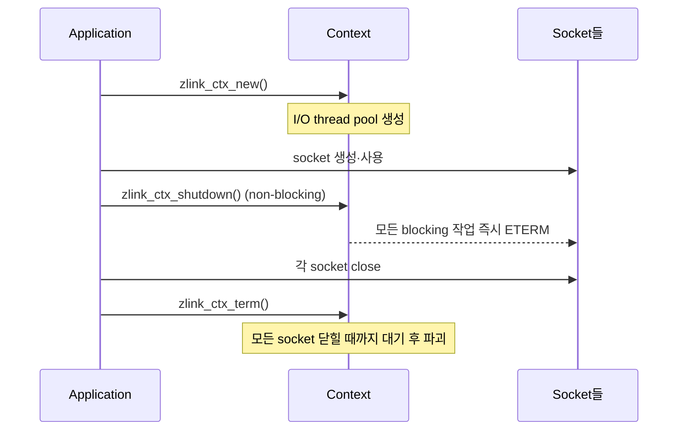

[English](https://zlink-systems.github.io/zlink/spec/core/01-context/) | 한국어

<!-- zlink-nav:start -->
[Core 스펙 목차](README.ko.md) | [이전: 공개 계약 관리](00-public-contract-governance.ko.md) | [다음: Message](02-message.ko.md)
<!-- zlink-nav:end -->

# Context

> **이 장이 정의하는 것** — Context가 무엇을 소유하고, 어떻게 만들고 설정하며 안전하게
> 종료하는지의 공개 C ABI 계약.

## 1. Context 개요

zlink의 [Context](glossary.ko.md#context)는 I/O 처리 thread와 socket을 담는 최상위
container다. 모든 application은 다른 zlink API를 쓰기 전에 Context를 하나 이상 만들어야 하고,
모든 socket은 반드시 어떤 Context에 속한다.

이 문서는 Context를 만들고, 옵션으로 설정하고, 안전하게 종료하는 계약을 정의한다. 대상 독자는
이 계약을 C API와 각 언어 binding으로 옮기는 개발자다.

관련 계약의 소유 문서는 다음과 같다.

| 관련 계약 | 정의하는 문서 |
|---|---|
| Auto HWM budget 계산·admission과 관련 함수 | [Auto HWM](systems/06-auto-hwm.ko.md) |
| socket 생성·옵션·송수신 | [Socket 공통](socket/README.ko.md) |
| message lifecycle와 ownership | [Message](02-message.ko.md) |

## 2. Context가 소유하는 것

Context는 다음을 소유한다.

- **I/O thread pool** — 네트워크 송수신을 실제로 처리하는 [I/O thread](glossary.ko.md#io-thread)
  집합이다. thread 개수, 스케줄링 우선순위와 CPU affinity를 Context 옵션으로 정한다.
- **socket container** — 이 Context로 만든 모든 [socket](glossary.ko.md#socket)의 상위다.
  동시에 열 수 있는 socket 수의 상한도 Context 옵션이다.
- **공유 설정** — thread 이름, 최대 message 크기, 그리고 socket queue의 크기를 자동으로 정하는
  [Auto HWM](glossary.ko.md#auto-hwm-budget) 정책처럼 context 전체에 적용하는 값이다.

Context는 thread-safe하다. 여러 thread가 같은 Context 핸들을 동시에 공유하고 옵션을 조회·설정할
수 있다.

## 3. 수명과 종료

Context의 수명은 **만들기 → 사용 → 종료 신호 → 자원 해제** 순으로 진행한다.

- **만들기** — `zlink_ctx_new`가 기본 옵션 값으로 Context를 만든다.
- **종료 신호** — `zlink_ctx_shutdown`은 이 Context에 속한 socket의 모든 blocking 작업이 즉시
  `ETERM`으로 풀리도록 신호만 보낸다. 자원은 해제하지 않는 non-blocking 호출이다.
- **자원 해제** — `zlink_ctx_term`이 Context를 파괴한다. 이 호출은 Context 안에서 만든 모든
  socket이 닫힐 때까지 blocking될 수 있다. 각 Context는 정확히 한 번만 term한다.

여러 thread가 socket을 사용하는 중이라면 term 전에 shutdown을 먼저 호출해 deadlock을 피한다.
shutdown 없이 term만 호출하면 socket이 닫히기를 기다리며 멈출 수 있기 때문이다.
`ZLINK_CTX_OPT_BLOCKY`를 `0`으로 설정하면 이후 생성하는 socket의 기본 `LINGER`가 `0`이 되어,
socket이 전달하지 못한 message를 기다리지 않고 닫히므로 term이 빨리 반환된다. term 자체는 이
옵션과 무관하게 내부 정리가 끝날 때까지 기다린다.



## 4. 옵션

`int` 옵션은 `zlink_ctx_set`과 `zlink_ctx_get`으로 설정하고 조회한다. Auto HWM byte 옵션은
`zlink_ctx_set_data`와 `zlink_ctx_get_data`를 사용한다.

```c
typedef enum zlink_ctx_option_t
{
    ZLINK_IO_THREADS              = 1,  // Context의 I/O thread 수
    ZLINK_MAX_SOCKETS             = 2,  // 허용되는 최대 socket 수
    ZLINK_SOCKET_LIMIT            = 3,  // socket 수 하드 상한 (읽기 전용)
    ZLINK_THREAD_PRIORITY         = 3,  // I/O thread 스케줄링 우선순위
    ZLINK_THREAD_SCHED_POLICY     = 4,  // I/O thread 스케줄링 정책
    ZLINK_MAX_MSGSZ               = 5,  // 최대 message 크기 (byte, >= 0, 기본 INT_MAX)
    ZLINK_MSG_T_SIZE              = 6,  // zlink_msg_t 크기 (byte, 읽기 전용)
    ZLINK_THREAD_AFFINITY_CPU_ADD      = 7,  // I/O thread 어피니티에 CPU 추가
    ZLINK_THREAD_AFFINITY_CPU_REMOVE   = 8,  // I/O thread 어피니티에서 CPU 제거
    ZLINK_THREAD_NAME_PREFIX      = 9,  // I/O thread 이름 접두사
    ZLINK_CTX_OPT_BLOCKY          = 10,  // 0이면 이후 생성 socket의 기본 LINGER=0 (int, 기본 1, §3 참조)
    ZLINK_CTX_OPT_AUTO_HWM_ENABLE = 12,  // 자동 HWM 사용 여부 (0=비활성, 1=활성)
    ZLINK_CTX_OPT_AUTO_HWM_RECALC_DEBOUNCE_MS = 14,  // 자동 HWM 재계산 debounce (ms, >= 0)
    ZLINK_CTX_OPT_AUTO_HWM_PROFILE = 17,  // 자동 HWM profile. 알 수 없는 값은 EINVAL
    /* 값 18은 할당하지 않는다. */
    ZLINK_CTX_OPT_AUTO_HWM_MEMORY_LIMIT_BYTES = 19,  // 명시적 memory limit (uint64_t byte, set/get_data). 0=미설정
    ZLINK_CTX_OPT_AUTO_HWM_RUNTIME_MEMORY_LIMIT_BYTES = 20,  // runtime memory hint (uint64_t byte, set/get_data). 0=감지 없음
    ZLINK_CTX_OPT_AUTO_HWM_CORE_BUDGET_BYTES = 21  // profile 없이 그대로 쓰는 Core budget (uint64_t byte, set/get_data). 0=미설정
} zlink_ctx_option_t;
```

```c
typedef enum zlink_auto_hwm_profile_t
{
    ZLINK_AUTO_HWM_PROFILE_COMPACT = 0,
    ZLINK_AUTO_HWM_PROFILE_LOW_LATENCY = 1,
    ZLINK_AUTO_HWM_PROFILE_BALANCED = 2,
    ZLINK_AUTO_HWM_PROFILE_THROUGHPUT = 3
} zlink_auto_hwm_profile_t;
```

> **참고:** `ZLINK_SOCKET_LIMIT`과 `ZLINK_THREAD_PRIORITY`는 enum 값 `3`을
> 공유한다. 현재 공개 C ABI의 옵션 조회는 값 `3`을 읽기 전용
> `ZLINK_SOCKET_LIMIT`으로 먼저 해석하므로, `ZLINK_THREAD_PRIORITY`는
> `zlink_ctx_set` / `zlink_ctx_get`으로 설정하거나 조회할 수 없다.

Auto HWM byte 옵션 세 개(`MEMORY_LIMIT_BYTES`, `RUNTIME_MEMORY_LIMIT_BYTES`,
`CORE_BUDGET_BYTES`)가 어떤 budget을 계산하고 어떻게 admission에 쓰이는지는
[Auto HWM](systems/06-auto-hwm.ko.md)이 소유한다.

### 4.1 기본값

```c
#define ZLINK_IO_THREADS_DFLT           4  // 기본 I/O thread 수
#define ZLINK_MAX_SOCKETS_DFLT          4095  // 기본 최대 socket 수
#define ZLINK_THREAD_PRIORITY_DFLT      -1  // 기본 우선순위 (OS 기본값)
#define ZLINK_THREAD_SCHED_POLICY_DFLT  -1  // 기본 스케줄링 정책 (OS 기본값)
#define ZLINK_CTX_AUTO_HWM_ENABLE_DFLT  1  // 자동 HWM 기본 활성 (끄거나 수동 HWM 미설정 시 balanced)
#define ZLINK_CTX_AUTO_HWM_RECALC_DEBOUNCE_MS_DFLT 3000  // 재계산 기본 debounce (ms)
#define ZLINK_CTX_AUTO_HWM_PROFILE_DFLT ZLINK_AUTO_HWM_PROFILE_BALANCED  // 기본 profile
#define ZLINK_CTX_AUTO_HWM_MEMORY_LIMIT_BYTES_DFLT ((uint64_t) 0)  // 명시적 limit 미설정
#define ZLINK_CTX_AUTO_HWM_RUNTIME_MEMORY_LIMIT_BYTES_DFLT ((uint64_t) 0)  // runtime hint 없음
#define ZLINK_CTX_AUTO_HWM_CORE_BUDGET_BYTES_DFLT ((uint64_t) 0)  // 수동 Core budget 미설정
```

`SNDBUF` / `RCVBUF` 기본값은 `-1`이다. 이 값은 zlink가 OS socket buffer
크기를 직접 정하지 않고 OS 기본값과 TCP 자동 조정에 맡긴다는 뜻이다.
auto-HWM profile은 이 값을 자동으로 바꾸지 않는다.

## 5. 함수

### zlink_ctx_new

새 zlink context를 생성한다.

```c
ZLINK_EXPORT void *zlink_ctx_new(void);
```

기본 옵션 값으로 새 context를 할당하고 초기화한다. Context는 I/O thread pool을
관리하며 socket 생성의 기반이 된다. 모든 socket은 context와 연결되어야 한다.
Context가 더 이상 필요하지 않으면 `zlink_ctx_term`으로 해제한다.

**반환값:** 성공 시 context 핸들, 실패 시 `NULL` (errno가 설정됨).

**스레드 안전성:** 모든 스레드에서 안전하게 호출할 수 있다. 반환된 context
핸들은 thread 간에 공유할 수 있다.

**참고:** `zlink_ctx_term`, `zlink_ctx_set`

---

### zlink_ctx_term

Context를 종료하고 관련된 모든 자원을 해제한다.

```c
ZLINK_EXPORT zlink_close_result_t zlink_ctx_term(void *context_);
```

Context를 파괴한다. 이 호출은 context 내에서 생성된 모든 socket이 닫힐 때까지
blocking될 수 있다. Context에 속한 socket의 blocking 작업은 `zlink_ctx_shutdown`이
호출되거나 모든 socket이 닫힌 후 `ETERM`을 반환한다. 각 context는 정확히
한 번만 종료해야 한다.

**반환값:** 성공 시 `ZLINK_CLOSE_OK`, 실패 시 `zlink_close_result_t` 값. `zlink_errno()`는 진단용 내부 errno를 그대로 유지한다.

**에러:**
- `EFAULT` -- 유효하지 않은 context 핸들.
- `EINTR` -- signal에 의해 종료가 중단됨; 재시도할 수 있다.

**스레드 안전성:** 모든 스레드에서 안전하게 호출할 수 있지만, context당 정확히
한 번만 호출해야 한다. 이 호출이 반환된 후에는 context 핸들을 사용하지
않는다.

**참고:** `zlink_ctx_new`, `zlink_ctx_shutdown`

---

### zlink_ctx_shutdown

Context를 즉시 종료한다.

```c
ZLINK_EXPORT zlink_close_result_t zlink_ctx_shutdown(void *context_);
```

이 context에 속한 socket의 모든 blocking 작업이 `ETERM`과 함께 즉시 반환되도록
신호를 보낸다. 이것은 종료를 시작하지만 자원을 해제하지 않는 non-blocking
호출이다. 최종 정리를 위해 이후에 `zlink_ctx_term`을 호출해야 한다.
term 전에 shutdown을 호출하면 여러 thread에서 socket을 사용할 때 deadlock을
방지할 수 있다.

**반환값:** 성공 시 `ZLINK_CLOSE_OK`, 실패 시 `zlink_close_result_t` 값. `zlink_errno()`는 진단용 내부 errno를 그대로 유지한다.

**에러:**
- `EFAULT` -- 유효하지 않은 context 핸들.

**스레드 안전성:** 모든 스레드에서 안전하게 호출할 수 있다.

**참고:** `zlink_ctx_term`

---

### zlink_ctx_set

Context 옵션을 설정한다.

```c
ZLINK_EXPORT zlink_config_result_t zlink_ctx_set(void *context_, zlink_ctx_option_t option_, int optval_);
```

socket이 생성되기 전 또는 후에 context를 구성한다. 유효한 옵션 이름과 의미는 §4 옵션
목록을 참조한다. 단, `ZLINK_IO_THREADS`와 `ZLINK_MAX_SOCKETS`는 설정 자체는 언제든
성공하고 조회에도 반영되지만, 실제 I/O thread pool과 socket 슬롯 용량은 첫 socket 생성
시점의 값으로 한 번 고정되며 그 후에 값을 바꿔도 런타임 용량은 바뀌지 않는다.
`ZLINK_CTX_OPT_AUTO_HWM_ENABLE`은 이미 만들어진 socket에도 적용된다 — 변경은 자동
재계산을 예약하며(기본 debounce 3000 ms), 그 전에 새 계획이 필요하면
`zlink_ctx_auto_hwm_recalculate`를 호출한다. 아직 수동 `SNDHWM` / `RCVHWM` 값을 주지
않은 socket만 자동 정책으로 다시 계산한다. 값을 `0`으로 바꾸면 현재 pipe에 마지막으로 적용한 HWM을
유지하고 이후 자동 재계산에서 제외하며 snapshot의 planning-active flag를 지운다.
`ZLINK_CTX_OPT_AUTO_HWM_PROFILE`은 다음 자동 HWM 계산에서 쓰는 profile을
바꾸며, runtime 중에도 안전하게 조정할 수 있다. Profile은 memory 비율과
역할별 byte 하한·상한을 선택한다. `SNDBUF` / `RCVBUF` 기본값은 `-1`이며,
auto-HWM profile은 이 값을 자동으로 바꾸지 않는다. 세 Auto HWM byte 옵션은
`zlink_ctx_set`으로 설정할 수 없고 `EINVAL`로 실패한다. (계약은 [Auto HWM](systems/06-auto-hwm.ko.md) 참조)

**반환값:** 성공 시 `ZLINK_CONFIG_OK`, 실패 시 `zlink_config_result_t` 값. `zlink_errno()`는 진단용 내부 errno를 그대로 유지한다.

**에러:**
- `EINVAL` -- 알 수 없는 옵션 또는 유효하지 않은 값.
- `EFAULT` -- 유효하지 않은 context 핸들 (`ZLINK_CONFIG_INVALID_HANDLE`).

**스레드 안전성:** 모든 스레드에서 안전하게 호출할 수 있다.

**참고:** `zlink_ctx_set_data`, `zlink_ctx_get`

---

### zlink_ctx_set_data

byte 버퍼로 context 옵션을 설정한다.

```c
ZLINK_EXPORT zlink_config_result_t zlink_ctx_set_data(void *context_,
                                         zlink_ctx_option_t option_,
                                         const void *optval_,
                                         size_t optvallen_);
```

세 Auto HWM byte 옵션은 정확히 `sizeof(uint64_t)` byte를 받는다. 값 `0`은
unlimited가 아니라 해당 입력을 설정하지 않았다는 뜻이다. 다른 크기와 제거된
context 옵션 값 `18`은 `ZLINK_CONFIG_INVALID_ARGUMENT`로 실패한다. 유효한 값을 설정하면
값을 저장한 뒤 Auto HWM 재계산을 예약한다. 새 budget이 현재 수동 HWM과 자동 하한을 함께
수용하지 못해도 setter는 성공하며, planner는 자동 하한을 낮추지 않고 budget snapshot에
`ZLINK_AUTO_HWM_BUDGET_FLAG_INSUFFICIENT`를 설정한다. (계약은
[Auto HWM](systems/06-auto-hwm.ko.md) 참조)

`ZLINK_THREAD_NAME_PREFIX`에는 null 종료 문자열을 `optval_`로 전달하고
`strlen(prefix) + 1`을 `optvallen_`으로 전달한다. 접두사는 platform thread
이름 제한에 맞춰 최대 16바이트(`optvallen_ <= 16`)로 제한된다.

**반환값:** 성공 시 `ZLINK_CONFIG_OK`, 실패 시 `zlink_config_result_t` 값. `zlink_errno()`는 진단용 내부 errno를 그대로 유지한다.

**에러:**
- `EINVAL` -- 알 수 없는 옵션 또는 유효하지 않은 값.
- `EFAULT` -- 유효하지 않은 context 핸들 (`ZLINK_CONFIG_INVALID_HANDLE`).

**스레드 안전성:** 모든 스레드에서 안전하게 호출할 수 있다.

**참고:** `zlink_ctx_set`, `zlink_ctx_get_data`, `zlink_ctx_get`

---

### zlink_ctx_get_data

호출자가 제공한 저장 공간으로 context 옵션을 조회한다.

```c
ZLINK_EXPORT zlink_config_result_t zlink_ctx_get_data(void *context_,
                                         zlink_ctx_option_t option_,
                                         void *optval_,
                                         size_t *optvallen_);
```

세 Auto HWM byte 옵션에는 `uint64_t` output buffer가 필요하고, 호출할 때
`*optvallen_`이 정확히 `sizeof(uint64_t)`여야 한다. 더 큰 임시 buffer나 4-byte
크기를 포함해 그 밖의 크기는 값을 잘라 쓰거나 일부만 채우지 않고
`ZLINK_CONFIG_INVALID_ARGUMENT`와 `errno == EINVAL`로 실패한다. 이때 필요한
크기인 `sizeof(uint64_t)`를 `*optvallen_`에 기록한다. 성공해도 같은 크기를
유지한다.

**반환값:** 성공 시 `ZLINK_CONFIG_OK`, 실패 시 `zlink_config_result_t` 값.
`zlink_errno()`는 진단용 내부 errno를 그대로 유지한다.

**에러:**
- `EINVAL` -- 알 수 없는 option, 잘못된 output 크기 또는 NULL output pointer (`ZLINK_CONFIG_INVALID_ARGUMENT`).
- `EFAULT` -- 유효하지 않은 context handle (`ZLINK_CONFIG_INVALID_HANDLE`).

**스레드 안전성:** 모든 스레드에서 안전하게 호출할 수 있다.

**참고:** `zlink_ctx_set_data`, `zlink_ctx_get`

---

### zlink_ctx_get

Context 옵션을 조회한다.

```c
ZLINK_EXPORT int zlink_ctx_get(void *context_, zlink_ctx_option_t option_, zlink_config_result_t *error_out_);
```

Context 옵션의 현재 값을 가져온다. `ZLINK_SOCKET_LIMIT` 및 `ZLINK_MSG_T_SIZE`
같은 읽기 전용 옵션을 포함하여 언제든지 context 구성을 검사하는 데 사용할 수
있다. 실패 시 `*error_out_`에 설정 결과(`zlink_config_result_t`)가
기록되고, 성공 시 옵션 값이 기본 반환값으로 반환된다. `error_out_`은 선택
사항이다 — `NULL`을 전달하면 실패 시 결과 코드는 기록되지 않고 `-1` 반환과
errno 설정만 관찰된다.

**반환값:** 성공 시 옵션 값, 실패 시 `-1`이며 `*error_out_`에
`zlink_config_result_t`가 기록된다. `zlink_errno()`는 진단용 내부 errno를
그대로 유지한다.

**에러:**
- `EINVAL` -- 알 수 없는 옵션.
- `EFAULT` -- 유효하지 않은 context 핸들; `*error_out_`에 `ZLINK_CONFIG_INVALID_HANDLE`이 기록된다.

**스레드 안전성:** 모든 스레드에서 안전하게 호출할 수 있다.

**참고:** `zlink_ctx_set`, `zlink_ctx_get_data`

## 6. 구현 및 contract test 검증 요구

공개 표면(`zlink_ctx_*` 함수, 옵션 set·get, 반환값·errno)만으로 다음을 확인한다. 각 항목은
unit test 하나로 이어진다.

**수명**
- `zlink_ctx_new`는 성공 시 non-NULL 핸들을, 실패 시 `NULL`과 설정된 errno를 반환한다.
- `zlink_ctx_shutdown`을 호출하면 그 context에 속한 socket의 blocking 작업이 즉시 `ETERM`으로 반환된다.
- `zlink_ctx_term`은 context당 한 번 성공하고, 그 안의 모든 socket이 닫힐 때까지 blocking될 수 있다.
- 유효하지 않은 context 핸들로 `zlink_ctx_term`·`zlink_ctx_shutdown`을 호출하면 `EFAULT`다.
- signal로 `zlink_ctx_term`이 중단되면 `EINTR`이며 재시도할 수 있다.

**옵션**
- `zlink_ctx_set`에 알 수 없는 옵션이나 유효하지 않은 값을 주면 `EINVAL`, 유효하지 않은 핸들이면 `EFAULT`(`ZLINK_CONFIG_INVALID_HANDLE`)다.
- 값 `3`을 `zlink_ctx_get`으로 조회하면 읽기 전용 `ZLINK_SOCKET_LIMIT`으로 해석되며, `ZLINK_THREAD_PRIORITY`는 이 경로로 조회할 수 없다.
- 세 Auto HWM byte 옵션을 `zlink_ctx_set`으로 설정하려 하면 `EINVAL`이다(설정은 `zlink_ctx_set_data`만 허용).
- Auto HWM byte 옵션을 `zlink_ctx_get_data`로 정확히 `sizeof(uint64_t)`가 아닌 크기로 조회하면 `EINVAL`이고 필요한 크기를 `*optvallen_`에 기록한다.
- 제거된 context 옵션 값 `18`을 `zlink_ctx_set_data`로 쓰면 `ZLINK_CONFIG_INVALID_ARGUMENT`다.

**스레드 안전성**
- 모든 `zlink_ctx_*` 함수는 여러 thread에서 동시에 호출해도 안전하다. `zlink_ctx_term`만 context당 한 번으로 제한한다.

Auto HWM budget과 admission의 검증은 [Auto HWM](systems/06-auto-hwm.ko.md#5-구현-및-contract-test-검증-요구)가 소유한다.
