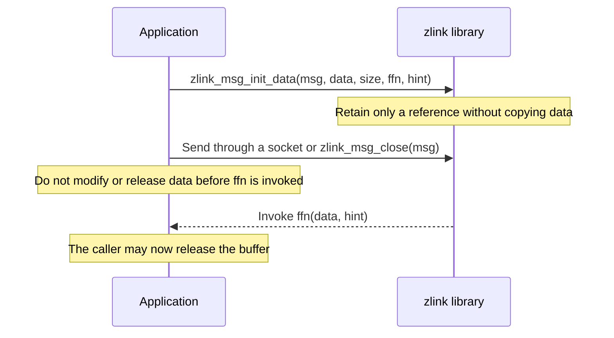

[한국어](https://zlink-systems.github.io/zlink/ko/spec/core/02-message/) | English

<!-- zlink-nav:start -->
[Core Spec Index](README.en.md) | [Previous: Context](01-context.en.md) | [Next: Errors](03-errors.en.md)
<!-- zlink-nav:end -->

# Message

> **What this chapter defines** — The public contracts for the message lifecycle, routing IDs, and ownership.

## 1. Message overview

A zlink message is the basic unit for transferring an arbitrary binary payload between
[sockets](glossary.en.md#socket). The user data bytes carried by a message are called its
payload. Messages support zero-copy transfer, which sends only a pointer or reference without
copying the data, and multipart sequences, which send multiple frames (parts) as one logical
message.

This document defines the public contracts for message creation, payload access, ownership, and
multipart messages. Its intended readers are developers who map the message lifecycle and
zero-copy buffer ownership to the C API and each language binding. It answers the question,
"How do I create and share a message sent or received by a socket, and release it exactly once?"

The public message API is a container for payload parts. It does not provide message-level
request-reply functions, it currently exposes no per-message metadata values, and it does not
expose request-reply or socket routing state. Request-reply and peer details are provided by the
public socket contract, not by the message API.

The following documents own the related contracts.

| Related contract | Defining document |
|---|---|
| Request-reply, routing, and peer details | [Socket common contract](socket/README.en.md) and each formal socket document |
| Context lifetime and options | [Context](01-context.en.md) |

## 2. Message lifecycle

A message proceeds through the **initialize → use → close** lifecycle. Every message must be
initialized before it is passed to another message function, and every initialized message must
be closed exactly once with [`zlink_msg_close`](#zlink_msg_close). After it is closed, the
`zlink_msg_t` structure is invalid and must be initialized again before reuse.

There are three initialization methods.

- **Empty message** — [`zlink_msg_init`](#zlink_msg_init) initializes an empty message of length 0.
- **Specified size** — [`zlink_msg_init_size`](#zlink_msg_init_size) allocates an internal buffer
  of the specified size. The buffer contents are uninitialized, so obtain a pointer with
  [`zlink_msg_data`](#zlink_msg_data) and populate the data before sending.
- **Zero-copy** — [`zlink_msg_init_data`](#zlink_msg_init_data) references a caller-provided
  buffer without copying it. When the library no longer needs the buffer, after the message is
  sent or closed, it invokes a callback so the caller can release the buffer.

For a zero-copy message, the callback is the ownership boundary. The caller must not modify or
release the buffer until the callback is invoked.



Access the payload with [`zlink_msg_data`](#zlink_msg_data) and
[`zlink_msg_size`](#zlink_msg_size). The pointer returned by `zlink_msg_data` remains valid until
the message is closed, moved, or sent.

## 3. Ownership transfer and sharing

Three functions transfer or share ownership of message content.

| Function | Purpose | State after success |
|---|---|---|
| [`zlink_msg_move`](#zlink_msg_move) | Move content | `src_` becomes an empty message, and `dest_` contains the original content. |
| [`zlink_msg_copy`](#zlink_msg_copy) | Lightweight copy | The two messages share the buffer for large/zero-copy storage, while a small inline message is copied by value. |
| [`zlink_msg_adopt`](#zlink_msg_adopt) | Allow a binding to take ownership into uninitialized storage | `dest_` is initialized and owns the original content, while `src_` becomes an empty initialized message. |

When large/zero-copy storage is copied, both messages share the same data buffer. The number of
message handles that share the same data buffer is called the reference count (refcount), and the
buffer is released when the refcount reaches 0. `zlink_msg_copy()` atomically increments the
count, and `zlink_msg_close()` atomically decrements it. It is therefore safe to copy or close
different `zlink_msg_t` handles that share the same storage from different threads. Query the
current count with [`zlink_msg_refcnt`](#zlink_msg_refcnt).

The thread rule applies per handle. A single `zlink_msg_t` instance must not be accessed
concurrently from multiple threads. If concurrent access is required, create a separate handle
with `zlink_msg_copy()`.

## 4. Multipart

Multipart is the transfer of multiple frames (parts) as one logical message. Core treats the
parts from `ZLINK_PART_MORE` through `ZLINK_PART_FINAL` as one logical multipart sequence. The
internal structure that prevents another sender's parts from being inserted into this sequence
is described in [§7 Internals](#7-internals).

Use [`zlink_multipart_close`](#zlink_multipart_close) to close all parts of a multipart message
stored as a contiguous array of `zlink_msg_t` structures at once.

Multipart messages have the following relationship with threads. Multiple threads may each send
independent messages, but a single multipart message must not be split across threads. Receive
follows a single-consumer contract.

## 5. Types and constants

### zlink_msg_t

```c
typedef struct zlink_msg_t
{
    unsigned char _[64];  // Opaque storage (64 bytes). Do not access directly
} zlink_msg_t;
```

`zlink_msg_t` is a 64-byte opaque message structure. Its internal layout is platform-dependent
and must not be accessed directly. The public header also declares platform-specific alignment,
such as 8-byte alignment on 64-bit platforms. Every message must be initialized before use and
closed after use ([§2](#2-message-lifecycle)).

### zlink_routing_id_t

```c
typedef struct zlink_routing_id_t
{
    uint8_t size;       // Number of valid bytes in data
    uint8_t data[255];  // Routing ID byte sequence (up to 255 bytes)
} zlink_routing_id_t;
```

A routing ID is a unique byte sequence used by a `ROUTER` socket to identify and address a
specific peer. `zlink_routing_id_t` carries this routing ID, and `size` indicates the number of
valid bytes in `data`.

### zlink_free_fn

```c
typedef void (zlink_free_fn) (void *data_, void *hint_);
```

`zlink_free_fn` is the callback type used by `zlink_msg_init_data()` to create a zero-copy
message. The library invokes this function when the message data buffer is no longer needed.

## 6. Functions

The following input rule applies to every `zlink_msg_*` function: if a handle is `NULL` or a
message is invalid (uninitialized or already closed), the function sets `errno == EFAULT`. Each
function then returns the following value.

| Function | Return value |
|---|---|
| A function returning `zlink_config_result_t` | `ZLINK_CONFIG_INVALID_HANDLE` |
| `zlink_msg_data` | `NULL` |
| `zlink_msg_size` | `0` |
| `zlink_msg_refcnt` | `-1` |

### zlink_msg_init

Initialize an empty message.

```c
ZLINK_EXPORT zlink_config_result_t zlink_msg_init (zlink_msg_t *msg_);
```

Initializes `msg_` to an empty message of length 0. The message must eventually be released with
`zlink_msg_close()`. Always initialize a `zlink_msg_t` before passing it to another message
function.

**Returns:** `ZLINK_CONFIG_OK` on success; otherwise a `zlink_config_result_t` value.
`zlink_errno()` retains the detailed internal errno for diagnostics.

**Thread safety:** Not thread-safe. Each `zlink_msg_t` must be used by only one thread at a time.

**See also:** `zlink_msg_init_size`, `zlink_msg_init_data`, `zlink_msg_close`

---

### zlink_msg_init_size

Initialize a message of a specified size.

```c
ZLINK_EXPORT zlink_config_result_t zlink_msg_init_size (zlink_msg_t *msg_, size_t size_);
```

Allocates an internal buffer of `size_` bytes and initializes `msg_`. The buffer contents are
uninitialized. Obtain a pointer to the buffer with `zlink_msg_data()` and populate the data before
sending.

**Returns:** `ZLINK_CONFIG_OK` on success; otherwise a `zlink_config_result_t` value.
`zlink_errno()` retains the detailed internal errno for diagnostics.

**Errors:**
- `ENOMEM` -- Allocation failed.

**Thread safety:** Not thread-safe.

**See also:** `zlink_msg_data`, `zlink_msg_size`

---

### zlink_msg_init_data

Initialize a message with an external data buffer (zero-copy).

```c
ZLINK_EXPORT zlink_config_result_t zlink_msg_init_data (
  zlink_msg_t *msg_, void *data_, size_t size_, zlink_free_fn *ffn_, void *hint_);
```

Creates a message that references the caller-provided buffer `data_` of `size_` bytes without
copying it. When the library no longer needs the buffer, after the message is sent or closed, it
invokes callback `ffn_` with `data_` and `hint_` as arguments so that the caller can release the
buffer. If `ffn_` is `NULL`, no callback is invoked, and the caller must ensure that the buffer
outlives the message.

This function enables true zero-copy message transfer. The caller must not modify or release
`data_` until `ffn_` is invoked.

**Returns:** `ZLINK_CONFIG_OK` on success; otherwise a `zlink_config_result_t` value.
`zlink_errno()` retains the detailed internal errno for diagnostics.

**Thread safety:** Not thread-safe.

**See also:** `zlink_free_fn`, `zlink_msg_data`

---

### zlink_msg_close

Release message resources.

```c
ZLINK_EXPORT zlink_config_result_t zlink_msg_close (zlink_msg_t *msg_);
```

Releases all resources associated with the message. Every initialized message must be closed
exactly once. After it is closed, the `zlink_msg_t` structure is invalid and must be initialized
again before reuse.

**Returns:** `ZLINK_CONFIG_OK` on success; otherwise a `zlink_config_result_t` value.
`zlink_errno()` retains the detailed internal errno for diagnostics.

**Thread safety:** Not thread-safe.

**See also:** `zlink_msg_init`, `zlink_multipart_close`

---

### zlink_msg_move

Move message content from a source to a destination.

```c
ZLINK_EXPORT zlink_config_result_t zlink_msg_move (zlink_msg_t *dest_, zlink_msg_t *src_);
```

Moves the content of `src_` into `dest_`. After a successful move, `src_` becomes an empty
message equivalent to a freshly initialized message, and `dest_` contains the original content.
Any previous content of `dest_` is released.

**Returns:** `ZLINK_CONFIG_OK` on success; otherwise a `zlink_config_result_t` value.
`zlink_errno()` retains the detailed internal errno for diagnostics.

**Thread safety:** Not thread-safe.

**See also:** `zlink_msg_copy`

---

### zlink_msg_copy

Copy a message.

```c
ZLINK_EXPORT zlink_config_result_t zlink_msg_copy (zlink_msg_t *dest_, zlink_msg_t *src_);
```

Copies the content of `src_` into `dest_`. For large/zero-copy storage, both messages share the
underlying data buffer through reference counting; a small inline message is copied by value. Any
previous content of `dest_` is released. The copy is lightweight and does not duplicate a large
data payload.

**Returns:** `ZLINK_CONFIG_OK` on success; otherwise a `zlink_config_result_t` value.
`zlink_errno()` retains the detailed internal errno for diagnostics.

**Thread safety:** Not thread-safe.

**See also:** `zlink_msg_move`, `zlink_msg_adopt`

---

### zlink_msg_adopt

Adopt ownership from a source message without a separate init+move step.

```c
ZLINK_EXPORT zlink_config_result_t zlink_msg_adopt (zlink_msg_t *dest_, zlink_msg_t *src_);
```

This function is for bindings that already hold storage for `dest_` and need to take ownership
of a newly received native message efficiently. Unlike `zlink_msg_move`, `dest_` must not
currently own an initialized message. Calling `zlink_msg_adopt` on an already initialized
`dest_` results in undefined behavior.

On success, `dest_` becomes an initialized message that owns the original content of `src_`, and
`src_` becomes an empty initialized message that owns no payload. Each message object must be
closed exactly once before the end of its lifetime. Closing the empty `src_` does not affect the
adopted payload, and its storage must not be discarded or initialized again without first being
closed. To reuse the `src_` storage after a successful adopt, close it and then initialize it
again. On failure, `src_` continues to own the original payload, and `dest_` remains
uninitialized.

**Returns:** `ZLINK_CONFIG_OK` on success; otherwise a `zlink_config_result_t` value.
`zlink_errno()` retains the detailed internal errno for diagnostics.

**Thread safety:** Not thread-safe.

**See also:** `zlink_msg_move`, `zlink_msg_copy`

---

### zlink_msg_data

Return a pointer to the message data buffer.

```c
ZLINK_EXPORT void *zlink_msg_data (zlink_msg_t *msg_);
```

Returns a pointer to the raw data payload of the message. The pointer remains valid until the
message is closed, moved, or sent. Returns `NULL` if the message is uninitialized.

**Returns:** A pointer to the message data buffer.

**Thread safety:** Not thread-safe.

**See also:** `zlink_msg_size`

---

### zlink_msg_size

Return the message data size in bytes.

```c
ZLINK_EXPORT size_t zlink_msg_size (const zlink_msg_t *msg_);
```

Returns the size of the message payload in bytes. Returns 0 for an empty message.

**Returns:** The size in bytes.

**Thread safety:** Not thread-safe.

**See also:** `zlink_msg_data`

---

### zlink_msg_refcnt

Return the reference count of the message storage.

```c
ZLINK_EXPORT int zlink_msg_refcnt (const zlink_msg_t *msg_, zlink_config_result_t *error_out_);
```

Returns the current internal reference count for reference-counted large/zero-copy storage.
Message kinds that are not internally reference-counted, such as inline storage or borrowed
constant storage, return 1. On failure, the configuration result (`zlink_config_result_t`) is
written to `*error_out_`; on success, the reference count is the primary return value.
`error_out_` is optional. Passing `NULL` observes only the count or `-1` return and the errno
setting, without recording a result code.

The internal reference count is managed with atomic operations. `zlink_msg_copy()` atomically
increments the count, and `zlink_msg_close()` atomically decrements it. It is therefore safe to
copy or close different `zlink_msg_t` handles that share the same underlying storage from
different threads.

`zlink_msg_refcnt()` performs an atomic read of the counter. The returned value is a point-in-time
snapshot; another thread may have already changed the count through copy or close by the time the
caller examines it. This function is therefore suitable for diagnostics or assertions, but not
for control decisions.

A single `zlink_msg_t` instance must not be accessed concurrently from multiple threads. If
concurrent access is required, create a separate handle with `zlink_msg_copy()`.

**Returns:** The current storage reference count, or 1 if the message kind is not internally
reference-counted. On failure, returns `-1` and writes a `zlink_config_result_t` value to
`*error_out_`. `zlink_errno()` retains the detailed internal errno for diagnostics.

**Thread safety:** The underlying reference count is atomic. Calling this function while other
threads copy or close *different* `zlink_msg_t` handles that share the same storage is safe.
However, concurrently calling this function and another `zlink_msg_*` function on the *same*
`zlink_msg_t` instance from multiple threads is not safe.

**See also:** `zlink_msg_copy`, `zlink_msg_close`

---

### zlink_multipart_close

Close all parts in a multipart message array.

```c
ZLINK_EXPORT void zlink_multipart_close (zlink_msg_t *parts, size_t part_count);
```

This convenience function calls `zlink_msg_close()` for each element of the `parts` array. Use
it to clean up after receiving or constructing a multipart message stored as a contiguous array
of `zlink_msg_t` structures.

**Returns:** None (void).

**Thread safety:** Not thread-safe.

**See also:** `zlink_msg_close`

## 7. Internals

> **Contract ownership for this section** — The [Multipart](#4-multipart) section and
> [Verification requirements](#8-implementation-and-contract-test-verification-requirements)
> section of this document own the public contract for multipart framing. This section explains
> how the internals prevent another sender's message parts from being inserted into a sequence.

As defined by [§4](#4-multipart), Core treats the parts from `ZLINK_PART_MORE` through
`ZLINK_PART_FINAL` as one logical multipart sequence. Per-socket transaction state protects the
send path so that another sender's message parts cannot be inserted into this sequence.

### Send

The first part starts the transaction, and the final part commits it. When a part call fails, it
consumes the part passed to that call and clears the already-submitted staging per that API's abort
contract ([Socket Common](socket/README.en.md#part-send-and-pending-admission)); caller-owned parts
not yet submitted are left unchanged. The internal transaction state is cleared so that the next
message does not continue the previous sequence. Consumed storage is left as an initialized empty
message, so it may be closed or reused as is. To send the message again, the caller resubmits it
from the first part using a retained copy.

### Receive

The typed receive API returns one part plus either `ZLINK_PART_MORE` or `ZLINK_PART_FINAL`. The
receive helper verifies that the socket family and owner thread do not change during the
sequence, and it returns the source saved from the first part unchanged for subsequent parts. If
the sequence is interrupted, it closes the buffered part and resets the helper state.

### Request/reply

The request or reply kind and sequence travel with the first application part as internal
metadata in the same transaction. Pipes and queues preserve that metadata. The typed receive path
moves the sequence or local token and routing context needed for a reply into separate state and
outputs, then removes the metadata
from the public message. No request-reply protocol part is added before the application payload.

## 8. Implementation and contract test verification requirements

Verify the following only through the public surface: the `zlink_msg_*` and
`zlink_multipart_close` functions, their return values and errno, and invocation of the
`zlink_free_fn` callback. Each item maps to one unit test.

**Initialization and release**
- A message initialized with `zlink_msg_init` has length 0: `zlink_msg_size` returns `0`.
- If `zlink_msg_init_size` succeeds, `zlink_msg_size` returns the specified size; if allocation
  fails, errno is `ENOMEM`.
- Calling `zlink_msg_data` on an uninitialized message returns `NULL`.
- An initialized message is closed exactly once with `zlink_msg_close`, and closed storage may be
  reused only after it is initialized again.

**Zero-copy and free callback**
- After a message created with `zlink_msg_init_data` is sent or closed, the library invokes
  `ffn_` with `data_` and `hint_` as arguments.
- If `ffn_` is `NULL`, no callback is invoked.

**Move, copy, and adopt**
- After `zlink_msg_move` succeeds, `src_` is an empty message equivalent to a freshly initialized
  message, and `dest_` contains the original content.
- Copying large/zero-copy storage with `zlink_msg_copy` shares the buffer without duplicating the
  payload: the value returned by `zlink_msg_refcnt` increases after the copy and decreases again
  when one shared handle is closed.
- `zlink_msg_refcnt` returns `1` for an inline-storage or borrowed-constant-storage message.
- After `zlink_msg_adopt` succeeds, `dest_` owns the original content of `src_`, and `src_` is an
  empty initialized message without a payload. Closing the empty `src_` does not affect the
  adopted payload.
- If `zlink_msg_adopt` fails, `src_` continues to own the original payload, and `dest_` remains
  uninitialized.

**Refcount and threads**
- It is safe to copy and close different `zlink_msg_t` handles that share the same storage from
  different threads, and the buffer is released when the refcount reaches 0.
- If `zlink_msg_refcnt` fails, it returns `-1` and writes a `zlink_config_result_t` value to
  `*error_out_`.

**Multipart**
- `zlink_multipart_close` leaves the same result as calling `zlink_msg_close` on every array
  element.
- If a multipart send fails partway through, the part passed to that call is consumed and left in
  an empty initialized state, parts not yet submitted are unchanged, and the next message does not
  continue the previous sequence.
- The receiver obtains the parts from `ZLINK_PART_MORE` through `ZLINK_PART_FINAL` as one
  multipart sequence, with no part from another sender interleaved between them.

**Common return convention**
- Each `zlink_msg_*` function returning `zlink_config_result_t` returns `ZLINK_CONFIG_OK` on
  success and a `zlink_config_result_t` value on failure. `zlink_errno()` retains the detailed
  internal errno for diagnostics.

<!-- zlink-nav:start -->
[Core Spec Index](README.en.md) | [Previous: Context](01-context.en.md) | [Next: Errors](03-errors.en.md)
<!-- zlink-nav:end -->
