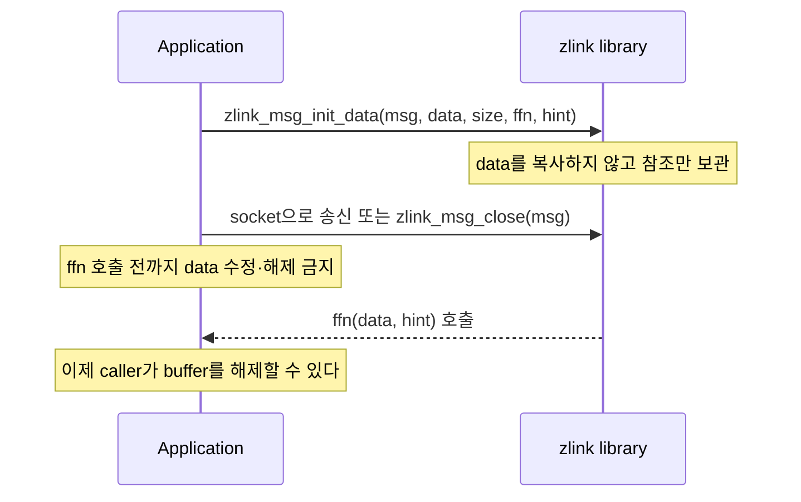

[English](https://zlink-systems.github.io/zlink/spec/core/02-message/) | 한국어

<!-- zlink-nav:start -->
[Core 스펙 목차](README.ko.md) | [이전: Context](01-context.ko.md) | [다음: Errors](03-errors.ko.md)
<!-- zlink-nav:end -->

# Message

> **이 장이 정의하는 것** — message lifecycle, routing ID와 ownership의 공개 계약.

## 1. Message 개요

zlink의 message는 [socket](glossary.ko.md#socket) 사이에서 임의의 binary payload를 전달하는
기본 단위다. message가 운반하는 사용자 data byte를 payload라 한다. message는 data를
복사하지 않고 pointer·참조만 전달해 전송하는 zero-copy 방식과, 여러 frame(part)을 하나의
논리적 message로 묶어 전송하는 multipart sequence를 지원한다.

이 문서는 message의 생성, payload 접근, ownership과 multipart의 공개 계약을 정의한다. 대상
독자는 message lifecycle과 zero-copy buffer ownership을 C API와 각 언어 binding으로 옮기는
개발자다. 이 문서는 "socket이 송수신하는 message를 어떻게 만들고 공유하며 정확히 한 번
해제하는가?"에 답한다.

공개 message API는 payload part의 container다. message-level request-reply 함수를 제공하지
않고, per-message metadata 값도 현재 노출하지 않으며, request-reply 또는 socket routing
상태를 노출하지 않는다. request-reply와 peer 상세 정보는 message API가 아니라 socket 공개
계약이 제공한다.

관련 계약의 소유 문서는 다음과 같다.

| 관련 계약 | 정의하는 문서 |
|---|---|
| request-reply·routing과 peer 상세 정보 | [Socket 공통](socket/README.ko.md)과 각 socket 정식 문서 |
| Context 수명과 옵션 | [Context](01-context.ko.md) |

## 2. Message lifecycle

message의 수명은 **초기화 → 사용 → close** 순으로 진행한다. 모든 message는 다른 message
함수에 전달하기 전에 초기화해야 하고, 초기화된 message는 정확히 한 번
[`zlink_msg_close`](#zlink_msg_close)로 닫아야 한다. 닫은 뒤 `zlink_msg_t` 구조체는
유효하지 않으며 재사용하기 전에 다시 초기화해야 한다.

초기화 방법은 세 가지다.

- **빈 message** — [`zlink_msg_init`](#zlink_msg_init)이 길이 0의 빈 message로 초기화한다.
- **크기 지정** — [`zlink_msg_init_size`](#zlink_msg_init_size)가 지정한 크기의 내부 buffer를
  할당한다. buffer 내용은 초기화되지 않으므로, [`zlink_msg_data`](#zlink_msg_data)로 pointer를
  얻어 송신 전에 data를 채운다.
- **zero-copy** — [`zlink_msg_init_data`](#zlink_msg_init_data)가 caller가 제공한 buffer를
  복사하지 않고 참조한다. library가 buffer를 더 이상 필요로 하지 않을 때(message가 송신되거나
  닫힌 후) caller가 buffer를 해제할 수 있도록 callback을 호출한다.

zero-copy message에서 buffer의 소유권은 callback이 경계다. caller는 callback이 호출될 때까지
buffer를 수정하거나 해제해서는 안 된다.



payload에는 [`zlink_msg_data`](#zlink_msg_data)와 [`zlink_msg_size`](#zlink_msg_size)로
접근한다. `zlink_msg_data`가 반환한 pointer는 message가 닫히거나, 이동되거나, 송신될 때까지
유효하다.

## 3. Ownership 이동과 공유

message 내용의 소유권은 세 함수로 옮기거나 공유한다.

| 함수 | 용도 | 성공 후 상태 |
|---|---|---|
| [`zlink_msg_move`](#zlink_msg_move) | 내용 이동 | `src_`는 빈 message가 되고 `dest_`가 원래 내용을 가진다. |
| [`zlink_msg_copy`](#zlink_msg_copy) | 경량 복사 | large/zero-copy storage는 두 message가 buffer를 공유하고, 작은 inline message는 값으로 복사된다. |
| [`zlink_msg_adopt`](#zlink_msg_adopt) | binding이 초기화되지 않은 storage로 소유권 인수 | `dest_`가 초기화되어 원래 내용을 소유하고 `src_`는 빈 초기화 상태가 된다. |

large/zero-copy storage를 복사하면 두 message가 같은 data buffer를 공유한다. 같은 data
buffer를 공유하는 message 핸들의 수를 reference count(refcount)라 하며, refcount가 0이 되면
buffer를 해제한다. `zlink_msg_copy()`는 count를 atomic으로 증가시키고 `zlink_msg_close()`는
atomic으로 감소시키므로, 같은 storage를 공유하는 서로 다른 `zlink_msg_t` 핸들을 서로 다른
thread에서 복사하거나 닫는 것은 안전하다. 현재 count는
[`zlink_msg_refcnt`](#zlink_msg_refcnt)로 조회한다.

thread 규칙은 핸들 단위다. 하나의 `zlink_msg_t` instance를 여러 thread에서 동시에 접근하면
안 된다. 동시 접근이 필요하면 `zlink_msg_copy()`로 별도 핸들을 만들어야 한다.

## 4. Multipart

이 절은 multipart를 지원하는 socket에 적용한다. STREAM은
[part 하나를 보내는 송신과 RAW/PACKET 수신](socket/08-stream.ko.md)을 사용한다.

여러 frame(part)을 하나의 논리적 message로 묶어 전송하는 방식을 multipart라 한다. Core는
`ZLINK_PART_MORE`부터 `ZLINK_PART_FINAL`까지의 part를 하나의 논리적 multipart sequence로
처리한다. 다른 sender의 part가 이 sequence 사이에 삽입되지 않도록 보호하는 내부 구조는
[§7 내부 구조](#7-내부-구조)가 설명한다.

`zlink_msg_t` 구조체의 연속 배열로 저장한 multipart message는
[`zlink_multipart_close`](#zlink_multipart_close)로 모든 part를 한 번에 닫는다.

multipart와 thread의 관계는 다음과 같다. 여러 thread가 각자 독립된 message를 보낼 수
있지만, 하나의 multipart message를 thread 사이에 나누면 안 된다. receive는 single-consumer
계약을 따른다.

## 5. 타입과 상수

### zlink_msg_t

```c
typedef struct zlink_msg_t
{
    unsigned char _[64];  // 불투명 storage (64 byte). 직접 접근하지 않는다
} zlink_msg_t;
```

`zlink_msg_t`는 64 byte 불투명 message 구조체다. 내부 layout은 플랫폼에 따라 다르며 직접
접근해서는 안 된다. 공개 header는 플랫폼별 alignment(예: 64-bit에서 8 byte)를 함께
선언한다. 모든 message는 사용 전에 초기화하고 사용 후에 닫아야 한다([§2](#2-message-lifecycle)).

### zlink_routing_id_t

```c
typedef struct zlink_routing_id_t
{
    uint8_t size;       // data에서 유효한 byte 수
    uint8_t data[255];  // routing ID byte 열 (최대 255 byte)
} zlink_routing_id_t;
```

`ROUTER` socket이 특정 peer를 식별해 주소를 지정하는 데 사용하는 고유 byte 열을 routing
ID라 한다. `zlink_routing_id_t`는 이 routing ID를 전달하며, `size`는 `data`에서 유효한
byte 수를 나타낸다.

### zlink_free_fn

```c
typedef void (zlink_free_fn) (void *data_, void *hint_);
```

`zlink_free_fn`은 zero-copy message 생성을 위해 `zlink_msg_init_data()`에서 사용되는
callback 타입이다. message data buffer가 더 이상 필요하지 않을 때 library가 이 함수를
호출한다.

## 6. 함수

모든 `zlink_msg_*` 함수에 공통인 입력 규칙: handle이 `NULL`이거나 message가 유효하지
않으면(미초기화·이미 close) `errno == EFAULT`를 설정한다. 이때 각 함수가 반환하는 값은
다음과 같다.

| 함수 | 반환값 |
|---|---|
| `zlink_config_result_t`를 반환하는 함수 | `ZLINK_CONFIG_INVALID_HANDLE` |
| `zlink_msg_data` | `NULL` |
| `zlink_msg_size` | `0` |
| `zlink_msg_refcnt` | `-1` |

### zlink_msg_init

빈 message를 초기화한다.

```c
ZLINK_EXPORT zlink_config_result_t zlink_msg_init (zlink_msg_t *msg_);
```

`msg_`를 길이 0의 빈 message로 초기화한다. message는 최종적으로 `zlink_msg_close()`로
해제해야 한다. `zlink_msg_t`를 다른 message 함수에 전달하기 전에 항상 초기화한다.

**반환값:** 성공 시 `ZLINK_CONFIG_OK`, 실패 시 `zlink_config_result_t` 값. `zlink_errno()`는 진단용 내부 errno를 그대로 유지한다.

**스레드 안전성:** thread-safe하지 않다. 각 `zlink_msg_t`는 한 번에 하나의 thread에서만
사용해야 한다.

**참고:** `zlink_msg_init_size`, `zlink_msg_init_data`, `zlink_msg_close`

---

### zlink_msg_init_size

지정한 크기의 message를 초기화한다.

```c
ZLINK_EXPORT zlink_config_result_t zlink_msg_init_size (zlink_msg_t *msg_, size_t size_);
```

`size_` byte의 내부 buffer를 할당하고 `msg_`를 초기화한다. buffer 내용은 초기화되지
않는다. `zlink_msg_data()`로 buffer pointer를 얻어 송신 전에 data를 채운다.

**반환값:** 성공 시 `ZLINK_CONFIG_OK`, 실패 시 `zlink_config_result_t` 값. `zlink_errno()`는 진단용 내부 errno를 그대로 유지한다.

**에러:**
- `ENOMEM` -- 할당 실패.

**스레드 안전성:** thread-safe하지 않다.

**참고:** `zlink_msg_data`, `zlink_msg_size`

---

### zlink_msg_init_data

외부 data buffer로 message를 초기화한다 (zero-copy).

```c
ZLINK_EXPORT zlink_config_result_t zlink_msg_init_data (
  zlink_msg_t *msg_, void *data_, size_t size_, zlink_free_fn *ffn_, void *hint_);
```

caller가 제공한 `size_` byte의 buffer `data_`를 복사하지 않고 참조하는 message를 생성한다.
library가 buffer를 더 이상 필요로 하지 않을 때(message가 송신되거나 닫힌 후) caller가
buffer를 해제할 수 있도록 `data_`와 `hint_`를 인수로 callback `ffn_`을 호출한다. `ffn_`이
`NULL`이면 callback이 호출되지 않으며, caller는 buffer가 message보다 오래 존재하도록
보장해야 한다.

이 함수는 진정한 zero-copy message 전달을 가능하게 한다. caller는 `ffn_`이 호출될 때까지
`data_`를 수정하거나 해제해서는 안 된다.

**반환값:** 성공 시 `ZLINK_CONFIG_OK`, 실패 시 `zlink_config_result_t` 값. `zlink_errno()`는 진단용 내부 errno를 그대로 유지한다.

**스레드 안전성:** thread-safe하지 않다.

**참고:** `zlink_free_fn`, `zlink_msg_data`

---

### zlink_msg_close

message 자원을 해제한다.

```c
ZLINK_EXPORT zlink_config_result_t zlink_msg_close (zlink_msg_t *msg_);
```

message와 관련된 모든 자원을 해제한다. 초기화된 모든 message는 정확히 한 번 닫아야
한다. 닫은 후 `zlink_msg_t` 구조체는 유효하지 않으며 재사용하기 전에 다시 초기화해야
한다.

**반환값:** 성공 시 `ZLINK_CONFIG_OK`, 실패 시 `zlink_config_result_t` 값. `zlink_errno()`는 진단용 내부 errno를 그대로 유지한다.

**스레드 안전성:** thread-safe하지 않다.

**참고:** `zlink_msg_init`, `zlink_multipart_close`

---

### zlink_msg_move

source에서 대상으로 message 내용을 이동한다.

```c
ZLINK_EXPORT zlink_config_result_t zlink_msg_move (zlink_msg_t *dest_, zlink_msg_t *src_);
```

`src_`의 내용을 `dest_`로 이동한다. 성공한 이동 후 `src_`는 빈 message가 되고(새로
초기화된 message와 동일) `dest_`는 원래 내용을 포함한다. `dest_`의 이전 내용은 해제된다.

**반환값:** 성공 시 `ZLINK_CONFIG_OK`, 실패 시 `zlink_config_result_t` 값. `zlink_errno()`는 진단용 내부 errno를 그대로 유지한다.

**스레드 안전성:** thread-safe하지 않다.

**참고:** `zlink_msg_copy`

---

### zlink_msg_copy

message를 복사한다.

```c
ZLINK_EXPORT zlink_config_result_t zlink_msg_copy (zlink_msg_t *dest_, zlink_msg_t *src_);
```

`src_`의 내용을 `dest_`로 복사한다. large/zero-copy storage는 두 message가 reference
counting으로 기본 data buffer를 공유하고, 작은 inline message는 값으로 복사된다. `dest_`의
이전 내용은 해제된다. 복사는 경량이며 큰 data payload를 복제하지 않는다.

**반환값:** 성공 시 `ZLINK_CONFIG_OK`, 실패 시 `zlink_config_result_t` 값. `zlink_errno()`는 진단용 내부 errno를 그대로 유지한다.

**스레드 안전성:** thread-safe하지 않다.

**참고:** `zlink_msg_move`, `zlink_msg_adopt`

---

### zlink_msg_adopt

별도의 init+move 단계 없이 source message의 소유권을 인수한다.

```c
ZLINK_EXPORT zlink_config_result_t zlink_msg_adopt (zlink_msg_t *dest_, zlink_msg_t *src_);
```

이미 `dest_`에 대한 storage를 보유하고 있고, 새로 수신한 native message의 소유권을
효율적으로 가져와야 하는 binding을 위한 함수다. `zlink_msg_move`와 달리 `dest_`는 현재
초기화된 message를 소유하지 않아야 한다 — 이미 초기화된 `dest_`에 `zlink_msg_adopt`를
호출하면 정의되지 않은 동작이 발생한다.

성공 시 `dest_`는 초기화된 message가 되어 `src_`의 원래 내용을 소유하고, `src_`는
payload를 소유하지 않는 빈 초기화 상태가 된다. 두 message 객체는 각각의 수명이 끝나기
전에 정확히 한 번 `zlink_msg_close()`해야 한다. 빈 `src_`를 close해도 인수한 payload에는
영향을 주지 않으며, close하지 않은 채 storage를 폐기하거나 다시 init하면 안 된다. 성공한
adopt 뒤 `src_` storage를 재사용하려면 먼저 close한 다음 다시 init한다. 실패하면 `src_`가
원래 payload를 계속 소유하고 `dest_`는 초기화되지 않은 상태로 유지된다.

**반환값:** 성공 시 `ZLINK_CONFIG_OK`, 실패 시 `zlink_config_result_t` 값. `zlink_errno()`는 진단용 내부 errno를 그대로 유지한다.

**스레드 안전성:** thread-safe하지 않다.

**참고:** `zlink_msg_move`, `zlink_msg_copy`

---

### zlink_msg_data

message data buffer에 대한 pointer를 반환한다.

```c
ZLINK_EXPORT void *zlink_msg_data (zlink_msg_t *msg_);
```

message의 원시 data payload에 대한 pointer를 반환한다. pointer는 message가 닫히거나,
이동되거나, 송신될 때까지 유효하다. message가 초기화되지 않은 경우 `NULL`을 반환한다.

**반환값:** message data buffer에 대한 pointer.

**스레드 안전성:** thread-safe하지 않다.

**참고:** `zlink_msg_size`

---

### zlink_msg_size

message data 크기를 byte 단위로 반환한다.

```c
ZLINK_EXPORT size_t zlink_msg_size (const zlink_msg_t *msg_);
```

message payload의 크기를 byte 단위로 반환한다. 빈 message의 경우 0을 반환한다.

**반환값:** byte 단위 크기.

**스레드 안전성:** thread-safe하지 않다.

**참고:** `zlink_msg_data`

---

### zlink_msg_refcnt

message storage의 reference count를 반환한다.

```c
ZLINK_EXPORT int zlink_msg_refcnt (const zlink_msg_t *msg_, zlink_config_result_t *error_out_);
```

reference-counted large/zero-copy storage면 현재 internal reference count를 반환한다.
inline storage나 borrowed constant storage처럼 internal reference counting 대상이 아닌
message 종류는 1을 반환한다. 실패 시 `*error_out_`에 설정 결과(`zlink_config_result_t`)가
기록되고, 성공 시 reference count가 기본 반환값으로 반환된다. `error_out_`은 선택
사항이다 — `NULL`을 전달하면 결과 코드 기록 없이 count 또는 `-1` 반환과 errno 설정만
관찰된다.

내부 reference count는 atomic 연산으로 관리된다. `zlink_msg_copy()`는 count를 atomic으로
증가시키고, `zlink_msg_close()`는 atomic으로 감소시킨다. 따라서 같은 underlying storage를
공유하는 서로 다른 `zlink_msg_t` 핸들을 서로 다른 thread에서 복사하거나 닫는 것은
안전하다.

`zlink_msg_refcnt()`는 counter의 atomic read를 수행한다. 반환값은 시점 snapshot이며,
호출자가 값을 확인하는 시점에 다른 thread가 copy/close로 이미 값을 변경했을 수 있다.
따라서 이 함수는 진단이나 assertion 용도에 적합하며, 제어 판단에는 적합하지 않다.

하나의 `zlink_msg_t` instance를 여러 thread에서 동시에 접근하면 안 된다. 동시 접근이
필요하면 `zlink_msg_copy()`로 별도 핸들을 만들어야 한다.

**반환값:** 현재 storage reference count. internal reference counting 대상이 아니면 1.
실패 시 `-1`을 반환하며 `*error_out_`에 `zlink_config_result_t`가 기록된다.
`zlink_errno()`는 진단용 내부 errno를 그대로 유지한다.

**스레드 안전성:** underlying reference count는 atomic이다. 같은 storage를 공유하는
*서로 다른* `zlink_msg_t` 핸들이 다른 thread에서 copy/close되는 동안 이 함수를 호출하는
것은 안전하다. 단, *같은* `zlink_msg_t` instance에 대해 이 함수와 다른 `zlink_msg_*`
함수를 여러 thread에서 동시에 호출하는 것은 안전하지 않다.

**참고:** `zlink_msg_copy`, `zlink_msg_close`

---

### zlink_multipart_close

multipart message 배열의 모든 part를 닫는다.

```c
ZLINK_EXPORT void zlink_multipart_close (zlink_msg_t *parts, size_t part_count);
```

`parts` 배열의 각 요소에 대해 `zlink_msg_close()`를 호출하는 편의 함수다. `zlink_msg_t`
구조체의 연속 배열로 저장된 multipart message를 수신하거나 구성한 후 정리하는 데
사용한다.

**반환값:** 없음 (void).

**스레드 안전성:** thread-safe하지 않다.

**참고:** `zlink_msg_close`

## 7. 내부 구조

> **이 절의 계약 소유** — multipart framing의 공개 계약은 이 문서의 [Multipart](#4-multipart)
> 절과 [검증 요구](#8-구현-및-contract-test-검증-요구) 절이 소유한다. 이 절은 다른 sender의
> message part가 sequence 사이에 삽입되지 않도록 내부에서 어떻게 보호하는지 설명한다.

Core는 [§4](#4-multipart)가 정의한 대로 `ZLINK_PART_MORE`부터 `ZLINK_PART_FINAL`까지의
part를 하나의 논리적 multipart sequence로 처리한다. 다른 sender의 message part가 이
sequence 사이에 삽입되지 않도록 socket별 transaction state가 send 경로를 보호한다.

### Send

첫 part가 transaction을 시작하고 final part가 commit한다. Part 호출이 실패하면 그 호출에 전달된
part를 소비하고 이미 제출된 staging은 해당 API의 abort 계약([Socket 공통](socket/README.ko.md#part-send와-pending-admission))에
따라 정리하며, 아직 제출하지 않은 caller 소유 part는 변경하지 않는다. 내부 transaction state를
정리해 다음 message가 이전 sequence를 이어받지 않게 한다. 소비된 storage는 초기화된 빈 message로
남으므로 그대로 close하거나 재사용할 수 있고, 다시 보내려면 caller가 보관해 둔 복사본으로 첫
part부터 재제출한다.

### Receive

typed receive API는 part 하나와 `ZLINK_PART_MORE` 또는 `ZLINK_PART_FINAL`을 반환한다.
receive helper는 socket family와 owner thread가 sequence 동안 바뀌지 않는지 확인하고,
source는 첫 part에서 저장한 값을 후속 part에 그대로 반환한다. sequence를 중단하면
buffered part를 close하고 helper state를 초기화한다.

### Request/reply

Request·reply kind와 sequence는 첫 application part의 내부 metadata로 transaction과 함께
이동한다. Pipe와 queue는 이를 보존하고, typed receive 경로는 reply에 필요한 sequence 또는
local token과 routing context를 message 밖의 별도 상태·output으로 옮긴 뒤 public message에서 metadata를 제거한다. Application payload 앞에
request-reply protocol part를 추가하지 않는다.

## 8. 구현 및 contract test 검증 요구

공개 표면(`zlink_msg_*`·`zlink_multipart_close` 함수, 반환값·errno, `zlink_free_fn` callback
호출)만으로 다음을 확인한다. 각 항목은 unit test 하나로 이어진다.

**초기화와 해제**
- `zlink_msg_init`으로 초기화한 message는 길이 0이다 — `zlink_msg_size`가 `0`을 반환한다.
- `zlink_msg_init_size`가 성공하면 `zlink_msg_size`가 지정한 크기를 반환하고, 할당에 실패하면 `ENOMEM`이다.
- 초기화되지 않은 message에 `zlink_msg_data`를 호출하면 `NULL`을 반환한다.
- 초기화된 message는 정확히 한 번 `zlink_msg_close`로 닫고, 닫은 storage는 다시 초기화한 뒤에만 재사용할 수 있다.

**zero-copy와 free callback**
- `zlink_msg_init_data`로 만든 message가 송신되거나 닫힌 후, library가 `data_`와 `hint_`를 인수로 `ffn_`을 호출한다.
- `ffn_`이 `NULL`이면 callback을 호출하지 않는다.

**이동·복사·adopt**
- `zlink_msg_move` 성공 후 `src_`는 새로 초기화된 message와 동일한 빈 message이고, `dest_`가 원래 내용을 가진다.
- large/zero-copy storage를 `zlink_msg_copy`하면 payload를 복제하지 않고 buffer를 공유한다 — copy 후 `zlink_msg_refcnt` 반환값이 증가하고, 공유 핸들 하나를 close하면 다시 감소한다.
- inline storage나 borrowed constant storage message의 `zlink_msg_refcnt`는 `1`을 반환한다.
- `zlink_msg_adopt` 성공 후 `dest_`가 `src_`의 원래 내용을 소유하고 `src_`는 payload가 없는 빈 초기화 상태다. 빈 `src_`를 close해도 인수한 payload에는 영향이 없다.
- `zlink_msg_adopt` 실패 시 `src_`가 원래 payload를 계속 소유하고 `dest_`는 초기화되지 않은 상태로 남는다.

**refcount와 thread**
- 같은 storage를 공유하는 서로 다른 `zlink_msg_t` 핸들을 서로 다른 thread에서 copy·close해도 안전하며, buffer는 refcount가 0이 될 때 해제된다.
- `zlink_msg_refcnt` 실패 시 `-1`을 반환하고 `*error_out_`에 `zlink_config_result_t`가 기록된다.

**multipart**
- `zlink_multipart_close`는 배열의 각 요소에 `zlink_msg_close`를 호출한 것과 같은 결과를 남긴다.
- multipart send가 중간에 실패하면 그 호출에 전달된 part는 소비되어 빈 초기화 상태로 남고 아직 제출하지 않은 part는 변하지 않으며, 다음 message가 이전 sequence를 이어받지 않는다.
- 수신자는 `ZLINK_PART_MORE`부터 `ZLINK_PART_FINAL`까지를 하나의 multipart sequence로 받으며, 다른 sender의 part가 그 사이에 섞이지 않는다.

**공통 반환 규약**
- `zlink_config_result_t`를 반환하는 각 `zlink_msg_*` 함수는 성공 시 `ZLINK_CONFIG_OK`, 실패 시 `zlink_config_result_t` 값을 반환하며 `zlink_errno()`는 진단용 내부 errno를 그대로 유지한다.

<!-- zlink-nav:start -->
[Core 스펙 목차](README.ko.md) | [이전: Context](01-context.ko.md) | [다음: Errors](03-errors.ko.md)
<!-- zlink-nav:end -->
