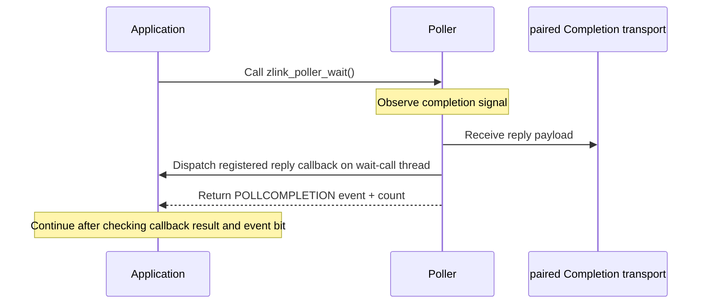

[한국어](https://zlink-systems.github.io/zlink/ko/spec/core/05-polling/) | English

<!-- zlink-nav:start -->
[Core Spec Index](README.en.md) | [Previous: Events](04-events.en.md) | [Next: Monitoring](06-monitoring.en.md)
<!-- zlink-nav:end -->

# Polling

> **What this chapter defines** — The public contract for waiting on the readiness
> of multiple [sockets](glossary.en.md#socket) and sources through the `zlink_poll`
> and `zlink_poller_*` APIs.

## 1. Polling overview

This document defines the ZLink Core public readiness contract. Readiness is the
state in which it is worthwhile for a source to proceed with receive or send. An
application can wait for three types of sources—raw sockets, OS file descriptors,
and generic timers—together in one event loop. The intended audience is developers
who carry this contract into the C API and each language binding. This document
answers: “What do `POLLIN` and `POLLOUT`, single-consumer receive mode, and lifetime
mean for each source?”

The following documents own the related contracts.

| Related contract | Defining document |
|---|---|
| Event-family classification and the boundary of readiness semantics | [Events](04-events.en.md) |
| Specific meanings of `ZLINK_POLLIN` and `ZLINK_POLLOUT` for each socket type | [Socket — DEALER](socket/06-dealer.en.md#5-results-and-readiness), [Socket — ROUTER](socket/07-router.en.md#10-results-and-readiness) |
| Result and errno mapping | [Errors](03-errors.en.md#result-and-errno-mapping) |
| Generic timer creation and receive (`zlink_timer_*`) | [Utilities](07-utilities.en.md) |

## 2. One-shot poll and reusable poller

There are two ways to wait for readiness.

- **One-shot poll** — [`zlink_poll`](#zlink_poll) receives its targets as an item
  array on each call and waits once.
- **Reusable poller** — The [`zlink_poller_*`](#poller-functions) functions keep
  sources registered with a poller object and repeatedly wait through
  `zlink_poller_wait`.

## 3. Source types and readiness

The readiness reported through `ZLINK_POLLIN` and `ZLINK_POLLOUT` for each source
type is as follows.

| Source | `POLLIN` | `POLLOUT` | Additional readiness and rules |
|---|---|---|---|
| raw socket | A complete record can be received | A submit retry is worthwhile | Per-socket receive mode applies. A closed registered socket reports `ZLINK_POLLERR` once |
| timer | A fire count can be received | Unsupported | Drain with `zlink_timer_recv()` |
| FD | Platform-readable | Platform-writable | Platform `POLLPRI` maps to `ZLINK_POLLPRI`; all other platform error bits map to `ZLINK_POLLERR` |

For a raw socket with multiple peers, `ZLINK_POLLOUT` is aggregate readiness
for the socket. The event does not identify which routing ID or transport pair
became writable and can be raised because another peer has capacity. Therefore,
after a nonblocking submit to one target reports backpressure, observing
`ZLINK_POLLOUT` does not guarantee that the next submit to that target succeeds.
Use `zlink_send_async` and its completion notification for operation-specific
admission waiting.

`ZLINK_POLLITEMS_DFLT` is the recommended initial item count for internal and
application stack buffers; it is not a readiness bit. `ZLINK_HAVE_POLLER == 1`
means that this public poller API is included in the build.

## 4. Completion polling

`ZLINK_POLLCOMPLETION` can be used when registering a raw `PAIR`, `DEALER`,
`ROUTER`, or `STREAM` that owns a completion channel through `zlink_poller_add()`.
`DEALER` and `ROUTER` use reply completion; sockets that support asynchronous
send, including `PAIR` and `STREAM`, use a send completion channel.
It can be registered alone or OR-ed with `ZLINK_POLLIN` and `ZLINK_POLLOUT`.
This combination lets one poller own receive, send, and completion progress for
the same socket.

A request completion signal is not a public receive record. When
`zlink_poller_wait()` observes the signal, it receives the reply payload from the
paired Completion transport and dispatches the registered reply callback on the
thread executing that wait call. Even if only a completion signal was processed,
the poller writes a public event with the `ZLINK_POLLCOMPLETION` bit to the event
array and includes that event in the returned count. Therefore, a wait that
processes a completion does not return `0` for that reason. The `recv_part`
families do not drain this completion.



Using `ZLINK_POLLCOMPLETION` with another source, in a `zlink_poll()` item, or in
`zlink_poller_modify()` returns `ZLINK_CONFIG_INVALID_ARGUMENT` with
`errno == EINVAL`.

## 5. Source lifetime and serialization

When a socket source is registered with a poller, Core acquires a lifetime pin on
that socket. It is therefore safe for the application to close a registered
socket before removing it from the poller. A closed socket source reports
`POLLERR` once, and its registration and lifetime pin remain in place until it is
removed.

The caller serializes add, modify, remove, and wait on one poller. Different
pollers can be used concurrently. An event array returned by wait is caller-owned
and contains no pointer to Core storage.

## 6. Public types

```c
#if defined _WIN32
typedef uintptr_t zlink_fd_t;
#else
typedef int zlink_fd_t;
#endif

typedef short zlink_poller_event_mask_t;

typedef enum zlink_poller_event_flag_e {
  ZLINK_POLLIN         = 1,   // receive can proceed (source-specific meaning in §3)
  ZLINK_POLLOUT        = 2,   // send/submit retry is worthwhile (source-specific meaning in §3)
  ZLINK_POLLERR        = 4,   // socket close or FD platform error (§3, §5)
  ZLINK_POLLPRI        = 8,   // platform POLLPRI for an FD (§3)
  ZLINK_POLLITEMS_DFLT = 16,  // recommended initial item count; not a readiness bit (§3)
  ZLINK_POLLCOMPLETION = 32   // polling a socket with a completion channel (§4)
} zlink_poller_event_flag_e;

#define ZLINK_HAVE_POLLER 1   // public poller API is included in the build

typedef enum zlink_poller_source_kind_t {
  ZLINK_POLLER_SOURCE_SOCKET    = 1,  // raw socket
  ZLINK_POLLER_SOURCE_FD        = 2,  // OS file descriptor
  ZLINK_POLLER_SOURCE_TIMER     = 3   // generic timer
} zlink_poller_source_kind_t;

typedef struct zlink_pollitem_t {
  void *socket;    // valid only for a SOCKET source
  zlink_fd_t fd;   // valid only for an FD source
  short events;    // event bits to wait for
  short revents;   // returned readiness; initialize to 0 before the call (§7 zlink_poll)
} zlink_pollitem_t;

typedef struct zlink_poller_event_t {
  zlink_poller_source_kind_t source_kind;  // source type for this event
  void *socket;     // valid only for a SOCKET source
  zlink_fd_t fd;    // valid only for an FD source
  void *timer;      // valid only for a TIMER source
  void *user_data;  // borrowed value returning the pointer supplied at registration
  short events;     // observed readiness bits
} zlink_poller_event_t;
```

## 7. Functions

### zlink_poll

Waits once for the readiness of an item array.

```c
ZLINK_EXPORT int zlink_poll(
  zlink_pollitem_t *items,
  int item_count,
  long timeout_ms,
  zlink_config_result_t *error_out);
```

The return value is the number of items with readiness, `0` on timeout, and `-1`
on failure. Failure sets both `error_out` and errno. `timeout_ms == -1` waits
indefinitely, and `0` returns immediately. Each item's `revents` is initialized
to `0` before the call, and only its snapshot after the function returns is
valid. `error_out` is an optional output that may be NULL.

### Poller functions

```c
ZLINK_EXPORT void *zlink_poller_new(void);
ZLINK_EXPORT zlink_close_result_t zlink_poller_destroy(void **poller_p);
ZLINK_EXPORT int zlink_poller_size(void *poller, zlink_config_result_t *error_out);
ZLINK_EXPORT zlink_config_result_t zlink_poller_add(
  void *poller,
  void *source,
  void *user_data,
  short events);
ZLINK_EXPORT zlink_config_result_t zlink_poller_modify(
  void *poller,
  void *source,
  short events);
ZLINK_EXPORT zlink_config_result_t zlink_poller_remove(void *poller, void *source);
ZLINK_EXPORT zlink_config_result_t zlink_poller_add_fd(
  void *poller,
  zlink_fd_t fd,
  void *user_data,
  short events);
ZLINK_EXPORT zlink_config_result_t zlink_poller_modify_fd(
  void *poller,
  zlink_fd_t fd,
  short events);
ZLINK_EXPORT zlink_config_result_t zlink_poller_remove_fd(void *poller, zlink_fd_t fd);
ZLINK_EXPORT zlink_config_result_t zlink_poller_add_timer(
  void *poller,
  void *timer,
  void *user_data);
ZLINK_EXPORT zlink_config_result_t zlink_poller_remove_timer(
  void *poller,
  void *timer);
ZLINK_EXPORT int zlink_poller_wait(
  void *poller,
  zlink_poller_event_t *events,
  int event_capacity,
  long timeout_ms,
  zlink_config_result_t *error_out);
```

On success, `zlink_poller_new()` returns a new poller. If allocation fails, it
returns `NULL` and sets `errno` to `ENOMEM`. On successful completion,
`zlink_poller_destroy()` sets the caller-provided pointer to NULL.

`zlink_poller_size()` returns the current registration count on success and `-1`
on failure. `zlink_poller_wait()` returns the number of events written on
success, `0` on timeout, and `-1` on failure. If `events == NULL` or
`event_capacity <= 0`, it fails with `EINVAL`. The `error_out` parameters of
`zlink_poller_size()` and `zlink_poller_wait()` are optional outputs that may be
NULL.

Adding the same source twice returns `ZLINK_CONFIG_CONFLICT`/`EEXIST`. Modifying
or removing a missing source returns `ZLINK_CONFIG_NOT_FOUND`/`ENOENT`. An
invalid event bit returns `ZLINK_CONFIG_INVALID_ARGUMENT`/`EINVAL`, while an
event unsupported by the source returns `ZLINK_CONFIG_NOT_SUPPORTED`/`ENOTSUP`.
Destroying a poller while a wait is active returns `ZLINK_CLOSE_BUSY`/`EBUSY`.
The [errno map](03-errors.en.md#result-and-errno-mapping) defines all result and
errno mappings.

## 8. Internal structure

> **Contract ownership for this section** — The public contract for completion
> polling is owned by [Completion polling](#4-completion-polling) and
> [Verification requirements](#9-implementation-and-contract-test-verification-requirements)
> in this document. This section describes how that contract is achieved
> internally.

The completion reply payload is not copied into a second internal payload queue.
Payloadless terminal results such as timeout and shutdown may use a small control
queue to preserve the callback execution thread.

## 9. Implementation and contract-test verification requirements

Verify the following using only the public surface: the `zlink_poll` and
`zlink_poller_*` functions, return values and errno, event-array contents, and
reply callback invocation. Each item maps to one unit test.

**zlink_poll**

- It returns the number of items with readiness, `0` on timeout, and `-1` on failure, setting both `error_out` and errno on failure.
- `timeout_ms == -1` waits indefinitely, and `0` returns immediately.
- A `revents` field initialized to `0` before the call is valid only as a snapshot after the function returns.

**Poller registration**

- Adding the same source twice returns `ZLINK_CONFIG_CONFLICT`/`EEXIST`.
- Modifying or removing a missing source returns `ZLINK_CONFIG_NOT_FOUND`/`ENOENT`.
- An invalid event bit returns `ZLINK_CONFIG_INVALID_ARGUMENT`/`EINVAL`, while an event unsupported by the source returns `ZLINK_CONFIG_NOT_SUPPORTED`/`ENOTSUP`.
- `ZLINK_POLLCOMPLETION` can be used with `zlink_poller_add()` for a raw PAIR, DEALER, ROUTER, or STREAM that owns a completion channel. Using it with any other source, in a `zlink_poll()` item, or in `zlink_poller_modify()` returns `ZLINK_CONFIG_INVALID_ARGUMENT`/`EINVAL`.

**Wait and events**

- Registering a socket source acquires a lifetime pin, so it is safe to close the socket before removal. After close, it reports `POLLERR` once and remains registered until removal.
- Platform `POLLPRI` for an FD maps to `ZLINK_POLLPRI`; all other platform error bits map to `ZLINK_POLLERR`.
- The event fields `socket`, `fd`, and `timer` are valid only for SOCKET, FD, and TIMER sources, respectively, and `user_data` returns the pointer supplied at registration unchanged.
- An event array returned by wait is caller-owned and contains no pointer to Core storage.

**Completion polling**

- A completion signal is not a public receive record. When wait observes it, wait receives the reply payload from the paired Completion transport and dispatches the registered reply callback on the thread executing that wait call.
- A wait that processes a completion signal writes a `ZLINK_POLLCOMPLETION` event and includes that event in the returned count.
- The `recv_part` families do not drain completion.

**Lifetime**

- Destroying a poller while a wait is active returns `ZLINK_CLOSE_BUSY`/`EBUSY`.

**Poller function returns and outputs**

- Allocation failure in `zlink_poller_new` returns `NULL`/`ENOMEM`, and successful `zlink_poller_destroy` sets the caller pointer to NULL.
- `zlink_poller_size` returns the registration count or `-1` on failure.
- `zlink_poller_wait` returns an event count, `0` on timeout, and `-1` on failure; `events == NULL` or `event_capacity <= 0` returns `EINVAL`.
- The `error_out` parameters of `zlink_poll`, `zlink_poller_size`, and `zlink_poller_wait` are optional outputs that may be NULL.

Caller serialization of add, modify, remove, and wait on one poller is a usage
precondition ([§5](#5-source-lifetime-and-serialization)); concurrent use of
different pollers is allowed.
