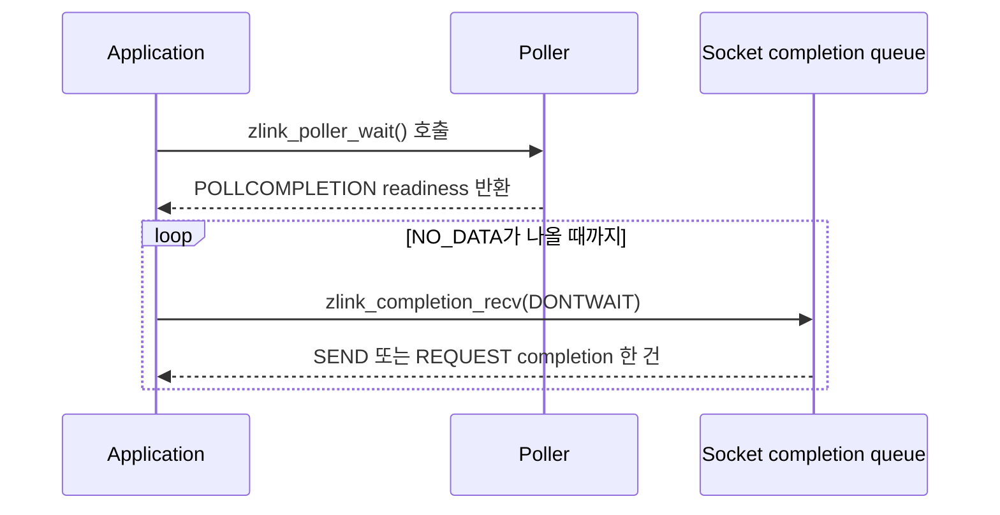

[English](https://zlink-systems.github.io/zlink/spec/core/05-polling/) | 한국어

<!-- zlink-nav:start -->
[Core 스펙 목차](README.ko.md) | [이전: Events](04-events.ko.md) | [다음: Monitoring](06-monitoring.ko.md)
<!-- zlink-nav:end -->

# Polling

> **이 장이 정의하는 것** — `zlink_poll`과 `zlink_poller_*` API로 여러
> [socket](glossary.ko.md#socket)과 source의 readiness를 기다리는 공개 계약.

## 1. Polling 개요

이 문서는 ZLink Core의 readiness 공개 계약을 정의한다. source가 receive 또는 send를
진행할 가치가 있는 상태를 readiness라 하며, application은 raw socket, OS file
descriptor와 generic timer 세 종류의 source를 하나의 event loop에서 함께 기다릴 수 있다.
대상 독자는 이 계약을 C API와 각 언어 binding으로 옮기는 개발자다. 이 문서는 “각
source의 `POLLIN`과 `POLLOUT`, single-consumer receive mode와 lifetime은 무엇인가?”에
답한다.

관련 계약의 소유 문서는 다음과 같다.

| 관련 계약 | 정의하는 문서 |
|---|---|
| event family 구분과 readiness 의미의 경계 | [Events](04-events.ko.md) |
| socket type별 `ZLINK_POLLIN`·`ZLINK_POLLOUT`의 구체 의미 | [Socket — DEALER](socket/06-dealer.ko.md#5-result와-readiness), [Socket — ROUTER](socket/07-router.ko.md#10-result와-readiness) |
| result와 errno 대응 | [Errors](03-errors.ko.md#result와-errno-대응) |
| generic timer의 생성·수신 (`zlink_timer_*`) | [유틸리티](07-utilities.ko.md) |

## 2. 일회성 poll과 재사용 poller

readiness를 기다리는 방법은 두 가지다.

- **일회성 poll** — [`zlink_poll`](#zlink_poll)은 매 호출마다 item 배열로 대상을
  전달받아 한 번 기다린다.
- **재사용 poller** — [`zlink_poller_*`](#poller-함수) 함수는 poller 객체에 source를
  등록해 두고 `zlink_poller_wait`로 반복해서 기다린다.

## 3. Source 종류와 readiness

각 source 종류가 `ZLINK_POLLIN`과 `ZLINK_POLLOUT`으로 알리는 readiness는 다음과 같다.

| Source | `POLLIN` | `POLLOUT` | 추가 readiness·규칙 |
|---|---|---|---|
| raw socket | complete record를 수신할 수 있음 | submit 재시도 가치가 있음 | socket별 receive mode 적용. close된 등록 socket은 `ZLINK_POLLERR` 1회 |
| timer | fire count를 받을 수 있음 | 미지원 | `zlink_timer_recv()`로 drain |
| FD | platform readable | platform writable | platform `POLLPRI`는 `ZLINK_POLLPRI`, 그 밖의 platform 오류 bit는 `ZLINK_POLLERR`로 변환 |

여러 peer를 가진 raw socket의 `ZLINK_POLLOUT`은 socket 전체의 집계 readiness다.
이 event는 writable해진 routing ID나 transport pair를 식별하지 않으며, 다른 peer의
여유 때문에 설 수 있다. 따라서 특정 target의 nonblocking submit이 backpressure를
반환한 뒤 `ZLINK_POLLOUT`을 관측해도 그 target의 다음 submit 성공은 보장되지 않는다.
operation별 admission 결과는 part send의 completion ID와 `zlink_completion_recv()`로 구분한다.

`ZLINK_POLLITEMS_DFLT`는 내부·application stack buffer의 권장 초기 item 수이며
readiness bit가 아니다. `ZLINK_HAVE_POLLER == 1`은 이 public poller API가 build에
포함되었음을 뜻한다.

## 4. Completion polling

`ZLINK_POLLCOMPLETION`은 PAIR·DEALER·ROUTER·STREAM의 socket-local completion queue에
record가 하나 이상 있어 다음 `zlink_completion_recv()`가 성공할 수 있음을 알리는
level-triggered readiness다. 단독으로 등록하거나 `ZLINK_POLLIN`, `ZLINK_POLLOUT`과 OR할 수
있다. Queue에 record가 남아 있는 동안 readiness도 유지된다.

DEALER-ROUTER single connection에서 앞선 DATA record의 마지막 part를 dequeue하기 전에는 뒤의
REPLY가 physical head가 아니다. 이때 `ZLINK_POLLIN`만 준비되고 `ZLINK_POLLCOMPLETION`은
준비되지 않을 수 있다. REPLY가 physical head에 도달해 socket-local completion queue로 이동한
뒤에는 위 level-trigger와 `ZLINK_RECV_NO_DATA`까지 drain하는 규칙을 적용한다.

`zlink_poller_wait()`는 completion을 제거하거나 callback을 호출하지 않는다. Event array에는
operation payload를 넣지 않으며 event array 용량과 completion 개수는 관계가 없다. Caller는
준비된 socket마다 `zlink_completion_recv(..., ZLINK_RECV_FLAGS_DONTWAIT)`를
`ZLINK_RECV_NO_DATA`까지 반복해 queue를 비운다. Add·modify·remove도 queue를 소비하지 않는다.



`zlink_poller_add()`와 `zlink_poller_modify()`는 지원 socket에 completion bit를 추가하거나
제거할 수 있다. 다른 source나 `zlink_poll()` item에서 이 bit를 사용하면
`ZLINK_CONFIG_INVALID_ARGUMENT`, `errno == EINVAL`이다.

한 socket의 completion bit를 소유하는 poller registration은 최대 하나다. 다른 poller가 이미
소유한 socket에 bit를 add하거나 modify로 추가하면 `ZLINK_CONFIG_INVALID_STATE`,
`errno == EBUSY`로 실패하고 기존 registration은 변하지 않는다. 기존 owner가 modify로 bit를
제거하거나 registration을 remove하면 다른 poller가 소유할 수 있으며, 전환 중 queue record와
readiness는 유실되지 않는다. Application은 socket마다 completion drain owner를 하나만 둔다.

## 5. Source 수명과 직렬화

poller에 socket source를 등록하면 Core가 그 socket의 lifetime pin을 획득한다.
따라서 application이 poller에서 remove하기 전에 등록된 socket을 close해도
안전하다. close된 socket source는 `POLLERR`를 한 번 반환하고, 해당 등록과
lifetime pin은 remove할 때까지 유지된다.

poller 하나의 add, modify, remove와 wait는 caller가 직렬화한다. 서로 다른 poller는
동시에 사용할 수 있다. wait가 반환한 event array는 caller-owned이며 Core 내부
pointer를 포함하지 않는다.

## 6. 공개 타입

```c
#if defined _WIN32
typedef uintptr_t zlink_fd_t;
#else
typedef int zlink_fd_t;
#endif

typedef short zlink_poller_event_mask_t;

typedef enum zlink_poller_event_flag_e {
  ZLINK_POLLIN         = 1,   // receive 진행 가능 (source별 의미는 §3)
  ZLINK_POLLOUT        = 2,   // send/submit 재시도 가치 (source별 의미는 §3)
  ZLINK_POLLERR        = 4,   // socket close 또는 FD platform 오류 (§3, §5)
  ZLINK_POLLPRI        = 8,   // FD의 platform POLLPRI (§3)
  ZLINK_POLLITEMS_DFLT = 16,  // 권장 초기 item 수. readiness bit가 아니다 (§3)
  ZLINK_POLLCOMPLETION = 32   // socket completion queue readiness (§4)
} zlink_poller_event_flag_e;

#define ZLINK_HAVE_POLLER 1   // public poller API가 build에 포함됨

typedef enum zlink_poller_source_kind_t {
  ZLINK_POLLER_SOURCE_SOCKET    = 1,  // raw socket
  ZLINK_POLLER_SOURCE_FD        = 2,  // OS file descriptor
  ZLINK_POLLER_SOURCE_TIMER     = 3   // generic timer
} zlink_poller_source_kind_t;

typedef struct zlink_pollitem_t {
  void *socket;    // SOCKET source일 때만 유효
  zlink_fd_t fd;   // FD source일 때만 유효
  short events;    // 기다릴 event bit
  short revents;   // 반환된 readiness. 호출 전 0으로 초기화한다 (§7 zlink_poll)
} zlink_pollitem_t;

typedef struct zlink_poller_event_t {
  zlink_poller_source_kind_t source_kind;  // 이 event의 source 종류
  void *socket;     // SOCKET source일 때만 유효
  zlink_fd_t fd;    // FD source일 때만 유효
  void *timer;      // TIMER source일 때만 유효
  void *user_data;  // 등록 시 받은 pointer를 그대로 돌려주는 borrowed value
  short events;     // 관측된 readiness bit
} zlink_poller_event_t;
```

## 7. 함수

### zlink_poll

item 배열의 readiness를 한 번 기다린다.

```c
ZLINK_EXPORT int zlink_poll(
  zlink_pollitem_t *items,
  int item_count,
  long timeout_ms,
  zlink_config_result_t *error_out);
```

return은 readiness가 있는 item 수, timeout은 0, 실패는 -1이다. 실패하면 `error_out`과
errno를 함께 설정한다. `timeout_ms == -1`은 무기한, 0은 즉시 반환한다. item의
`revents`는 호출 전에 0으로 초기화하고 함수 반환 뒤의 snapshot만 유효하다.
`error_out`은 NULL을 허용하는 선택 output이다.

### Poller 함수

```c
ZLINK_EXPORT void *zlink_poller_new(void);
ZLINK_EXPORT zlink_close_result_t zlink_poller_destroy(void **poller_p);
ZLINK_EXPORT int zlink_poller_size(void *poller, zlink_config_result_t *error_out);
ZLINK_EXPORT zlink_config_result_t zlink_poller_add(
  void *poller,
  void *source,
  void *user_data,
  short events);
ZLINK_EXPORT zlink_config_result_t zlink_poller_modify(
  void *poller,
  void *source,
  short events);
ZLINK_EXPORT zlink_config_result_t zlink_poller_remove(void *poller, void *source);
ZLINK_EXPORT zlink_config_result_t zlink_poller_add_fd(
  void *poller,
  zlink_fd_t fd,
  void *user_data,
  short events);
ZLINK_EXPORT zlink_config_result_t zlink_poller_modify_fd(
  void *poller,
  zlink_fd_t fd,
  short events);
ZLINK_EXPORT zlink_config_result_t zlink_poller_remove_fd(void *poller, zlink_fd_t fd);
ZLINK_EXPORT zlink_config_result_t zlink_poller_add_timer(
  void *poller,
  void *timer,
  void *user_data);
ZLINK_EXPORT zlink_config_result_t zlink_poller_remove_timer(
  void *poller,
  void *timer);
ZLINK_EXPORT int zlink_poller_wait(
  void *poller,
  zlink_poller_event_t *events,
  int event_capacity,
  long timeout_ms,
  zlink_config_result_t *error_out);
```

`zlink_poller_new()`는 성공 시 새 poller를 반환하고, allocation이 실패하면
`NULL`을 반환하고 `errno`를 `ENOMEM`으로 설정한다. `zlink_poller_destroy()`가
성공하면 caller가 제공한 pointer를 NULL로 설정한다.

`zlink_poller_size()`는 성공 시 현재 등록 count를, 실패 시 `-1`을 반환한다.
`zlink_poller_wait()`는 성공 시 기록한 event 수를, timeout이면 `0`, 실패하면
`-1`을 반환한다. `events == NULL`이거나 `event_capacity <= 0`이면 `EINVAL`로
실패한다. `zlink_poller_size()`와 `zlink_poller_wait()`의 `error_out`은 NULL을
허용하는 선택 output이다.

같은 source를 두 번 add하면 `ZLINK_CONFIG_CONFLICT`/`EEXIST`다. 없는 source의
modify·remove는 `ZLINK_CONFIG_NOT_FOUND`/`ENOENT`다. 잘못된 event bit는
`ZLINK_CONFIG_INVALID_ARGUMENT`/`EINVAL`, source가 지원하지 않는 event는
`ZLINK_CONFIG_NOT_SUPPORTED`/`ENOTSUP`이다. poller destroy 중 wait가 active이면
`ZLINK_CLOSE_BUSY`/`EBUSY`다. result와 errno의 전체 대응은
[errno map](03-errors.ko.md#result와-errno-대응)을 따른다.

## 8. 내부 구조

> **이 절의 계약 소유** — completion polling의 공개 계약은 이 문서의
> [Completion polling](#4-completion-polling) 절과 [검증 요구](#9-구현-및-contract-test-검증-요구)
> 절이 소유한다. 이 절은 그 계약을 내부에서 어떻게 달성하는지 설명한다.

SEND와 REQUEST resolver는 같은 socket-local ready queue에 결과를 append한다. 이 append의
linearization 순서가 public receive 순서이며 submit 순서나 target별 wire 순서를 뜻하지 않는다.

## 9. 구현 및 contract test 검증 요구

공개 표면(`zlink_poll`·`zlink_poller_*`·`zlink_completion_recv` 함수, 반환값·errno와 event
array)만으로 다음을 확인한다. 각 항목은 unit test 하나로 이어진다.

**zlink_poll**
- readiness가 있는 item 수를 반환하고, timeout이면 `0`, 실패하면 `-1`을 반환하며 `error_out`과 errno를 함께 설정한다.
- `timeout_ms == -1`은 무기한 대기하고, `0`은 즉시 반환한다.
- 호출 전 `0`으로 초기화한 `revents`는 함수 반환 뒤의 snapshot만 유효하다.

**poller 등록**
- 같은 source를 두 번 add하면 `ZLINK_CONFIG_CONFLICT`/`EEXIST`다.
- 없는 source를 modify·remove하면 `ZLINK_CONFIG_NOT_FOUND`/`ENOENT`다.
- 잘못된 event bit는 `ZLINK_CONFIG_INVALID_ARGUMENT`/`EINVAL`이고, source가 지원하지 않는 event는 `ZLINK_CONFIG_NOT_SUPPORTED`/`ENOTSUP`이다.
- `ZLINK_POLLCOMPLETION`은 PAIR·DEALER·ROUTER·STREAM의 add·modify에서 단독 또는 다른 socket
  readiness와 OR해 추가·제거할 수 있다. 다른 source와 `zlink_poll()` item은
  `ZLINK_CONFIG_INVALID_ARGUMENT`/`EINVAL`이다.
- 두 poller가 같은 socket의 completion bit를 소유하려 하면 두 번째 add·modify가
  `ZLINK_CONFIG_INVALID_STATE`/`EBUSY`로 실패하고 기존 registration은 변하지 않는다. 기존
  owner가 bit를 제거하거나 source를 remove한 뒤 다른 poller로 이전하면 queue record와
  readiness가 유실되지 않는다.

**wait와 event**
- socket source 등록은 lifetime pin을 획득하므로 socket을 remove 전에 close해도 안전하다. close 후 `POLLERR`를 한 번 반환하고 등록은 remove할 때까지 유지된다.
- FD의 platform `POLLPRI`는 `ZLINK_POLLPRI`로, 그 밖의 platform 오류 bit는 `ZLINK_POLLERR`로 변환된다.
- event의 `socket`·`fd`·`timer` field는 각각 SOCKET·FD·TIMER source에서만 유효하고, `user_data`는 등록 시 받은 pointer를 그대로 돌려준다.
- wait가 반환한 event array는 caller-owned이며 Core 내부 pointer를 포함하지 않는다.

**completion polling**
- Completion record가 하나 이상 있으면 wait가 `ZLINK_POLLCOMPLETION`을 반환하며, wait·add·modify·
  remove만 호출해서는 queue가 줄지 않는다.
- DONTWAIT completion receive로 마지막 record를 꺼내면 readiness가 해제되고, record가 남아 있으면
  readiness가 유지된다.
- Event array 용량보다 completion이 많아도 record가 유실·병합되지 않으며, caller는 준비된 socket을
  `ZLINK_RECV_NO_DATA`까지 drain한다.
- DEALER-ROUTER의 physical head가 multipart DATA이면 `ZLINK_POLLIN`이 준비될 수 있지만 그 뒤
  REPLY의 `ZLINK_POLLCOMPLETION`은 준비되지 않는다. DATA의 `FINAL` part를 dequeue한 뒤 REPLY가
  socket-local completion queue로 이동하면 completion readiness가 발생한다.

**수명**
- poller destroy 중 wait가 active이면 `ZLINK_CLOSE_BUSY`/`EBUSY`다.

**poller 함수 반환과 output**
- `zlink_poller_new`의 allocation 실패는 `NULL`/`ENOMEM`이고, `zlink_poller_destroy`가 성공하면 caller pointer가 NULL이 된다.
- `zlink_poller_size`는 등록 count 또는 실패 `-1`을 반환한다.
- `zlink_poller_wait`는 event count, timeout `0`, 실패 `-1`을 반환하며 `events == NULL` 또는 `event_capacity <= 0`은 `EINVAL`이다.
- `zlink_poll`·`zlink_poller_size`·`zlink_poller_wait`의 `error_out`은 NULL을 허용하는 선택 output이다.

poller 하나의 add·modify·remove와 wait를 caller가 직렬화하는 것은 caller의 사용 전제이며([§5](#5-source-수명과-직렬화)), 서로 다른 poller의 동시 사용은 허용된다.
