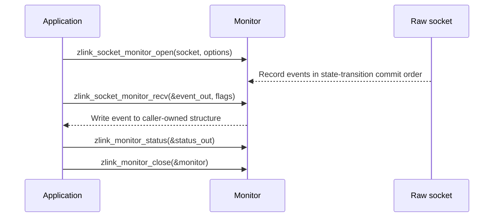

[한국어](https://zlink-systems.github.io/zlink/ko/spec/core/06-monitoring/) | English

<!-- zlink-nav:start -->
[Core Spec Index](README.en.md) | [Previous: Polling](05-polling.en.md) | [Next: Utilities](07-utilities.en.md)
<!-- zlink-nav:end -->

# Monitoring

> **What this chapter defines** — The public contract for subscribing to socket
> [events](04-events.en.md) through a separate channel with the `zlink_socket_monitor_*` APIs.

## 1. Monitoring Overview

The zlink raw socket monitor is an observability tool that subscribes to connection,
transport, protocol, and socket-lifecycle changes on a [socket](glossary.en.md#socket)
through a separate event channel. A socket monitor provides bind, accept, connect,
disconnect, handshake, protocol-error, and close events. A monitor only observes state;
it does not change routing or queue state.

This document defines the public contract for opening a monitor, consuming events,
querying a status snapshot, and closing the monitor. Its audience is developers who map
this contract to the C API and each language binding.

The following documents own the related contracts.

| Related contract | Defining document |
|---|---|
| Socket event-family catalog, emission conditions for the three receive-flow events, and the meanings of their `value` and `flags` | [Events](04-events.en.md) |
| Exclusion of monitor queues from Auto HWM planning and their aggregation in context budget snapshots | [Auto HWM](systems/06-auto-hwm.en.md) |
| Mapping between each result value and errno | [Errors](03-errors.en.md#result-and-errno-mapping) |

## 2. Monitor Lifecycle and Consumption Modes

A monitor proceeds through **open → event consumption → close**.

- **open** — [`zlink_socket_monitor_open`](#zlink_socket_monitor_open) opens a
  monitor on the target socket. The `events` mask in the open options selects the
  events to receive. `events == 0` selects no events, while `EVENT_ALL` selects
  every bit.
- **consumption** — The caller retrieves events directly with
  [`zlink_socket_monitor_recv`](#zlink_socket_monitor_recv).
- **status** — [`zlink_monitor_status`](#zlink_monitor_status) fills a current-state
  snapshot ([§6](#6-status-snapshot)).
- **close** — [`zlink_monitor_close`](#zlink_monitor_close) closes the monitor.

Recv and close must follow the single-consumer rule for the same event queue. The caller
is responsible for serializing these operations. Core neither detects nor serializes
concurrent consumption by recv and close.

The event addresses and the routing ID—the byte sequence that identifies a peer—are
values inside the caller-owned output structure.



## 3. Event Interpretation

### 3.1 Connection and Lane Identification

`connection_id` is a diagnostic and correlation value that identifies one physical
transport attempt in the current process. It cannot be used as a send target or reconnect
fence. `transport_lane` classifies the physical connection. Every physical event for
DEALER-DEALER and DEALER-ROUTER has the Application value, and only the separate
ROUTER-ROUTER Completion connection can have the Completion value. Other transports also
have the Application value.

`CONNECTION_READY` aggregates count `1` for DEALER-DEALER and DEALER-ROUTER and count `2`
for ROUTER-ROUTER as one logical peer. It therefore emits exactly one ready edge and counts
the peer only once in `value`. Learning the routing ID at different times on the two
ROUTER-ROUTER lanes does not split the peer into two ready transports, and readiness of only
one lane does not increase the count.

### 3.2 `value` and `flags`

Each event defines `value` as follows.

| Event | `value` |
|---|---|
| `DISCONNECTED` | A `zlink_disconnect_reason_t` value |
| `HANDSHAKE_FAILED_PROTOCOL` | A `zlink_protocol_error_t` value |
| `PEER_WEIGHT_CHANGED` | The new `0..10000` weight |
| `CONNECTION_READY` | The current count of public transports that are ready for this monitor source |
| Other failure events | The errno for that failure |
| Three receive-flow events | Owned by [Events](04-events.en.md) |

Because the `value` of `CONNECTION_READY` is the current count of public ready transports, use
`ZLINK_MONITOR_EVENT_FLAG_CONNECTION_READY_EDGE` in `flags` to identify the instant when
the count increases. A ready-count event without this flag is a count snapshot, not the
ready edge of a new connection.

`ZLINK_MONITOR_EVENT_FLAG_SEND_FLOW_WRITABLE` and
`ZLINK_MONITOR_EVENT_FLAG_FLOW_STATE_STALE_EPOCH` apply only to the three receive-flow
events (`ZLINK_EVENT_SEND_FLOW_PAUSED`, `ZLINK_EVENT_SEND_FLOW_RESUMED`, and
`ZLINK_EVENT_FLOW_STATE_STALE`). [Events](04-events.en.md) owns their emission conditions
and the meaning of `value` for each event.

## 4. Ordering, Overflow, and Thread Safety

Within one monitor, Core queues events in the order in which it commits state transitions.
No wall-clock order is guaranteed across different connection
[I/O threads](glossary.en.md#io-thread).

The monitor queue is bounded and lossy. When the queue is full, it discards the newly
arriving record regardless of event type and retains records already in the queue. It does
not aggregate events or preferentially retain specific event types, and it exposes no
public counter or status field for the number of discarded records. A delayed monitor
consumer does not block raw socket submission.

The thread rule follows the single-consumer rule in
[§2](#2-monitor-lifecycle-and-consumption-modes): the caller serializes recv and close so
that one consumer uses the event queue. Core does not contractually detect or
serialize concurrent calls on the caller's behalf.

## 5. Monitor Queue Byte Budget

`monitor_hwm_bytes` is the single byte budget applied to both the monitor source worker and
the internal monitor PAIR. An [HWM](glossary.en.md#hwm) limits the bytes retained in a
queue. A positive value is used unchanged as the exact SNDHWM, RCVHWM, and worker admission
limit. `0` is not unlimited; it selects the Core default byte value computed by
`checkedMultiply(4096, sizeof(socket_monitor_internal_event_t) + sizeof(zlink_msg_t))`.

The worker also makes admission decisions from the actual accounted bytes of a record, not
from an event count, and applies the same one-oversize-record-on-empty rule.

Monitor queues are excluded from application Auto HWM
[water-filling](glossary.en.md#water-filling). A context budget snapshot counts each unique
physical ypipe direction of the internal monitor PAIR once and does not add the reader and
writer endpoint options twice. [Auto HWM](systems/06-auto-hwm.en.md) owns this relationship.

## 6. Status Snapshot

### 6.1 ABI Version and Layout

In the status structure filled by [`zlink_monitor_status`](#zlink_monitor_status),
`abi_version` is `ZLINK_MONITOR_STATUS_ABI_VERSION`, and `struct_size` is the full byte size
of the returned ABI version. These values diagnose the current layout returned by Core;
they are neither caller inputs nor compatibility-negotiation values. A raw socket monitor
status has `source_kind` set to `ZLINK_MONITOR_SOURCE_SOCKET`.

The current ABI version is `4` and includes `snd_pending_bytes`, `rcv_pending_bytes`, and
five receive-flow fields. Older layouts are not accepted as compatibility layouts. Core
provides neither caller size/version negotiation nor a parallel versioned entry point.

### 6.2 Detail Bits and Valid Fields

`detail_flags` identifies which optional status fields are valid. Each detail bit makes
the following fields valid. A field belongs to only one bit, and all fields in a row are
zero when that bit is absent.

| detail bit | valid fields |
|---|---|
| `ZLINK_MONITOR_STATUS_DETAIL_SND_PENDING_MSGS` | `snd_pending_msgs`, `snd_pending_bytes` |
| `ZLINK_MONITOR_STATUS_DETAIL_RCV_PENDING_MSGS` | `rcv_pending_msgs`, `rcv_pending_bytes` |
| `ZLINK_MONITOR_STATUS_DETAIL_AUTO_HWM_BUDGET` | `auto_hwm_enabled`, `auto_hwm_profile`, `auto_hwm_role`, `auto_hwm_policy_class`, `auto_hwm_planned_sndhwm_bytes`, `auto_hwm_planned_rcvhwm_bytes`, `auto_hwm_last_recalc_ms`, `auto_hwm_last_recalc_reason`, `auto_hwm_send_blocked_ratio_ppm`, `auto_hwm_deferred_sndhwm_bytes`, `auto_hwm_deferred_rcvhwm_bytes`, `auto_hwm_deferred_sndhwm_valid`, `auto_hwm_deferred_rcvhwm_valid` |
| `ZLINK_MONITOR_STATUS_DETAIL_AUTO_HWM_BUFFERS` | `auto_hwm_applied_sndhwm_bytes`, `auto_hwm_applied_rcvhwm_bytes`, `auto_hwm_effective_sndbuf`, `auto_hwm_effective_rcvbuf`, `snd_bytes_in_flight`, `rcv_bytes_in_flight`, `minimum_core_message_charge_bytes`, `oversize_message_admission_count`, `oversize_message_admission_max_bytes` |
| `ZLINK_MONITOR_STATUS_DETAIL_FLOW_STATE` | `flow_paused_connections`, `flow_pause_applied_total`, `flow_resume_applied_total`, `flow_state_stale_total`, `flow_pause_duration_ms` |

### 6.3 Byte and Pending Diagnostic Fields

The planned fields report the result of the current automatic policy. The applied fields
report the byte HWM that the socket actually uses, including manual overrides. A deferred
value is valid only when the corresponding `_valid` field is nonzero.

`snd_bytes_in_flight` and `rcv_bytes_in_flight` are directional pipe totals at snapshot
time. `snd_pending_bytes` and `rcv_pending_bytes` report
the same send and receive in-flight totals, respectively. Some sources estimate the
receive total and count. Pending message fields remain counts, and pending byte fields use
the same byte unit as admission accounting, but the diagnostic values themselves are not
used as admission inputs. The minimum-charge and oversize fields make it possible to
diagnose byte-accounting results without querying the allocator for every message.

The pipe-total field group consists of `snd_pending_msgs`, `rcv_pending_msgs`,
`snd_pending_bytes`, `rcv_pending_bytes`, `snd_bytes_in_flight`, and
`rcv_bytes_in_flight`. Core reads this group under one lock, so the group is internally
consistent. Auto HWM fields and the flow counters in
[§6.4](#64-receive-flow-statistics) may be read at different times. Therefore,
cross-consistency among the pipe-total field group, Auto HWM fields, and flow counters is
not guaranteed.

`auto_hwm_send_blocked_ratio_ppm` is the fraction, in parts per million, of the socket's
first send-admission attempts in the measurement epoch that were blocked by an application
pipe HWM. Retries after the same submission wakes are not counted again. Transport I/O
waits, the ROUTER-ROUTER completion lane, and context-aggregate usage are excluded.

The context Auto HWM snapshot uses ABI v1. DEALER-ROUTER reply bytes are included in
`core_queue_accounted_bytes`, `current_accounted_bytes`, and, when applicable,
`provisional_accounted_bytes`, `peak_accounted_bytes`, and `total_messaging_accounted_bytes`.
They are not included in `completion_current_accounted_bytes`,
`completion_peak_accounted_bytes`, `completion_pending_message_count`, or
`active_completion_directional_queue_count`. [Auto HWM](systems/06-auto-hwm.en.md) owns the
declarations and exact accounting for these fields.

### 6.4 Receive-Flow Statistics

`ZLINK_MONITOR_STATUS_DETAIL_FLOW_STATE` is set for DEALER and ROUTER sockets that support
receive flow. This includes DEALER-DEALER and DEALER-ROUTER, which have no separate
[completion lane](glossary.en.md#completion-progress-lane). For other socket types, the bit
is absent and all five fields are zero. These fields report the receive-flow state that the
socket observes on its peers. The declaration comments in
[§7.5](#75-status-structure) define the exact increment and decrement rules for each field.

The three counters (`flow_pause_applied_total`, `flow_resume_applied_total`, and
`flow_state_stale_total`) increase monotonically over the lifetime of the socket. No public
call resets or rebases these values, and `zlink_ctx_reset_auto_hwm_budget_metrics` does not
change them. Snapshot consistency between these flow counters and other field groups
follows the boundary in [§6.3](#63-byte-and-pending-diagnostic-fields).

## 7. Types and Constants

### 7.1 Event Mask

`ZLINK_SOCKET_MONITOR_EVENT_*` names are the canonical event-mask names;
`ZLINK_EVENT_*` are shorter names with the same numeric values.

```c
typedef uint32_t zlink_socket_monitor_event_mask_t;  // Event-selection mask in open options

typedef enum zlink_socket_monitor_event_e {
  ZLINK_SOCKET_MONITOR_EVENT_CONNECTED                  = 1u << 0,
  ZLINK_SOCKET_MONITOR_EVENT_CONNECT_DELAYED            = 1u << 1,
  ZLINK_SOCKET_MONITOR_EVENT_CONNECT_RETRIED            = 1u << 2,
  ZLINK_SOCKET_MONITOR_EVENT_LISTENING                  = 1u << 3,
  ZLINK_SOCKET_MONITOR_EVENT_BIND_FAILED                = 1u << 4,
  ZLINK_SOCKET_MONITOR_EVENT_ACCEPTED                   = 1u << 5,
  ZLINK_SOCKET_MONITOR_EVENT_ACCEPT_FAILED              = 1u << 6,
  ZLINK_SOCKET_MONITOR_EVENT_CLOSED                     = 1u << 7,
  ZLINK_SOCKET_MONITOR_EVENT_CLOSE_FAILED               = 1u << 8,
  ZLINK_SOCKET_MONITOR_EVENT_DISCONNECTED               = 1u << 9,
  ZLINK_SOCKET_MONITOR_EVENT_MONITOR_STOPPED            = 1u << 10,
  ZLINK_SOCKET_MONITOR_EVENT_HANDSHAKE_FAILED_NO_DETAIL = 1u << 11,
  ZLINK_SOCKET_MONITOR_EVENT_CONNECTION_READY           = 1u << 12,
  ZLINK_SOCKET_MONITOR_EVENT_HANDSHAKE_FAILED_PROTOCOL  = 1u << 13,
  ZLINK_SOCKET_MONITOR_EVENT_HANDSHAKE_FAILED_AUTH      = 1u << 14,
  ZLINK_SOCKET_MONITOR_EVENT_PEER_WEIGHT_CHANGED        = 1u << 15,
  ZLINK_SOCKET_MONITOR_EVENT_SEND_FLOW_PAUSED           = 1u << 16,  // Events owns the emission condition
  ZLINK_SOCKET_MONITOR_EVENT_SEND_FLOW_RESUMED          = 1u << 17,  // Events owns the emission condition
  ZLINK_SOCKET_MONITOR_EVENT_FLOW_STATE_STALE           = 1u << 18,  // Events owns the emission condition
  ZLINK_SOCKET_MONITOR_EVENT_ALL                        = 0x7FFFFu,  // Select every bit (0..18)

  /* ZLINK_EVENT_* are shorter names with the same numeric values. */
  ZLINK_EVENT_CONNECTED                  = ZLINK_SOCKET_MONITOR_EVENT_CONNECTED,
  ZLINK_EVENT_CONNECT_DELAYED            = ZLINK_SOCKET_MONITOR_EVENT_CONNECT_DELAYED,
  ZLINK_EVENT_CONNECT_RETRIED            = ZLINK_SOCKET_MONITOR_EVENT_CONNECT_RETRIED,
  ZLINK_EVENT_LISTENING                  = ZLINK_SOCKET_MONITOR_EVENT_LISTENING,
  ZLINK_EVENT_BIND_FAILED                = ZLINK_SOCKET_MONITOR_EVENT_BIND_FAILED,
  ZLINK_EVENT_ACCEPTED                   = ZLINK_SOCKET_MONITOR_EVENT_ACCEPTED,
  ZLINK_EVENT_ACCEPT_FAILED              = ZLINK_SOCKET_MONITOR_EVENT_ACCEPT_FAILED,
  ZLINK_EVENT_CLOSED                     = ZLINK_SOCKET_MONITOR_EVENT_CLOSED,
  ZLINK_EVENT_CLOSE_FAILED               = ZLINK_SOCKET_MONITOR_EVENT_CLOSE_FAILED,
  ZLINK_EVENT_DISCONNECTED               = ZLINK_SOCKET_MONITOR_EVENT_DISCONNECTED,
  ZLINK_EVENT_MONITOR_STOPPED            = ZLINK_SOCKET_MONITOR_EVENT_MONITOR_STOPPED,
  ZLINK_EVENT_HANDSHAKE_FAILED_NO_DETAIL =
    ZLINK_SOCKET_MONITOR_EVENT_HANDSHAKE_FAILED_NO_DETAIL,
  ZLINK_EVENT_CONNECTION_READY           = ZLINK_SOCKET_MONITOR_EVENT_CONNECTION_READY,
  ZLINK_EVENT_HANDSHAKE_FAILED_PROTOCOL  =
    ZLINK_SOCKET_MONITOR_EVENT_HANDSHAKE_FAILED_PROTOCOL,
  ZLINK_EVENT_HANDSHAKE_FAILED_AUTH      =
    ZLINK_SOCKET_MONITOR_EVENT_HANDSHAKE_FAILED_AUTH,
  ZLINK_EVENT_PEER_WEIGHT_CHANGED        =
    ZLINK_SOCKET_MONITOR_EVENT_PEER_WEIGHT_CHANGED,
  ZLINK_EVENT_SEND_FLOW_PAUSED           =
    ZLINK_SOCKET_MONITOR_EVENT_SEND_FLOW_PAUSED,
  ZLINK_EVENT_SEND_FLOW_RESUMED          =
    ZLINK_SOCKET_MONITOR_EVENT_SEND_FLOW_RESUMED,
  ZLINK_EVENT_FLOW_STATE_STALE           =
    ZLINK_SOCKET_MONITOR_EVENT_FLOW_STATE_STALE,
  ZLINK_EVENT_ALL                        = ZLINK_SOCKET_MONITOR_EVENT_ALL
} zlink_socket_monitor_event_e;
```

### 7.2 Event Record

```c
typedef struct zlink_monitor_event_t {
  uint64_t event;                      // ZLINK_SOCKET_MONITOR_EVENT_* value
  uint64_t value;                      // Event-specific additional value (§3.2)
  zlink_routing_id_t routing_id;       // Routing ID for the event
  char local_addr[256];                // Local address for the event
  char remote_addr[256];               // Remote address for the event
  uint64_t connection_id;              // Physical transport-attempt ID in the current process (§3.1)
  uint32_t transport_lane;             // zlink_monitor_transport_lane_t value
  uint32_t flags;                      // ZLINK_MONITOR_EVENT_FLAG_* bits
} zlink_monitor_event_t;

typedef enum zlink_monitor_transport_lane_e {
  ZLINK_MONITOR_TRANSPORT_LANE_APPLICATION = 0,  // Application lane; default for unpaired transports
  ZLINK_MONITOR_TRANSPORT_LANE_COMPLETION  = 1   // Completion lane
} zlink_monitor_transport_lane_t;

#define ZLINK_MONITOR_EVENT_FLAG_CONNECTION_READY_EDGE (1u << 0)       // Ready edge that increased the count (§3.2)
#define ZLINK_MONITOR_EVENT_FLAG_SEND_FLOW_WRITABLE (1u << 1)          // Receive-flow event only; Events owns the meaning
#define ZLINK_MONITOR_EVENT_FLAG_FLOW_STATE_STALE_EPOCH (1u << 3)      // Receive-flow event only; Events owns the meaning

typedef zlink_monitor_event_t zlink_socket_monitor_event_t;
```

### 7.3 Enums Used by `value`

The `ZLINK_DISCONNECT_*` macros are ABI-preserving aliases for the corresponding
`ZLINK_DISCONNECT_REASON_*` enum values.

```c
typedef enum zlink_disconnect_reason_t {   // Value of a DISCONNECTED event (§3.2)
  ZLINK_DISCONNECT_REASON_UNKNOWN          = 0,
  ZLINK_DISCONNECT_REASON_HANDSHAKE_FAILED = 3,
  ZLINK_DISCONNECT_REASON_TRANSPORT_ERROR  = 4,
  ZLINK_DISCONNECT_REASON_CTX_TERM         = 5
} zlink_disconnect_reason_t;

#define ZLINK_DISCONNECT_UNKNOWN ZLINK_DISCONNECT_REASON_UNKNOWN
#define ZLINK_DISCONNECT_HANDSHAKE_FAILED ZLINK_DISCONNECT_REASON_HANDSHAKE_FAILED
#define ZLINK_DISCONNECT_TRANSPORT_ERROR ZLINK_DISCONNECT_REASON_TRANSPORT_ERROR
#define ZLINK_DISCONNECT_CTX_TERM ZLINK_DISCONNECT_REASON_CTX_TERM

typedef enum zlink_protocol_error_t {      // Value of a HANDSHAKE_FAILED_PROTOCOL event (§3.2)
  ZLINK_PROTOCOL_ERROR_ZMP_MALFORMED_COMMAND_HELLO = 0x10000013,
  ZLINK_PROTOCOL_ERROR_ZMP_MALFORMED_COMMAND_READY = 0x10000016
} zlink_protocol_error_t;
```

### 7.4 Open Options

```c
typedef struct zlink_socket_monitor_open_options_t {
  zlink_socket_monitor_event_mask_t events;  // Event bits to receive; 0=none, EVENT_ALL=every bit (§2)
  uint64_t monitor_hwm_bytes;                // Single monitor-queue byte budget; 0=Core default (§5)
} zlink_socket_monitor_open_options_t;
```

### 7.5 Status Structure

```c
#define ZLINK_MONITOR_STATUS_ABI_VERSION 4u  // ABI version of the current status layout (§6.1)

typedef enum zlink_monitor_source_kind_t {
  ZLINK_MONITOR_SOURCE_SOCKET = 1   // source_kind for a raw socket monitor
} zlink_monitor_source_kind_t;

typedef uint32_t zlink_monitor_state_mask_t;

typedef enum zlink_monitor_state_flag_e {
  ZLINK_MONITOR_STATE_READY       = 1u << 0,
  ZLINK_MONITOR_STATE_BOUND_READY = 1u << 1,
  ZLINK_MONITOR_STATE_CLOSED      = 1u << 3
} zlink_monitor_state_flag_e;

typedef uint32_t zlink_monitor_status_detail_mask_t;

typedef enum zlink_monitor_status_detail_flag_e {  // See the §6.2 table for fields valid under each bit
  ZLINK_MONITOR_STATUS_DETAIL_SND_PENDING_MSGS = 1u << 1,
  ZLINK_MONITOR_STATUS_DETAIL_RCV_PENDING_MSGS = 1u << 2,
  ZLINK_MONITOR_STATUS_DETAIL_AUTO_HWM_BUDGET  = 1u << 3,
  ZLINK_MONITOR_STATUS_DETAIL_AUTO_HWM_BUFFERS = 1u << 4,
  ZLINK_MONITOR_STATUS_DETAIL_FLOW_STATE       = 1u << 5   // Only for DEALER and ROUTER, which support receive flow (§6.4)
} zlink_monitor_status_detail_flag_e;

typedef enum zlink_auto_hwm_recalc_reason_t {  // Values for auto_hwm_last_recalc_reason
  ZLINK_AUTO_HWM_RECALC_REASON_NONE            = 0,
  ZLINK_AUTO_HWM_RECALC_REASON_INITIAL         = 1,
  ZLINK_AUTO_HWM_RECALC_REASON_ROLE_CHANGE     = 2,
  ZLINK_AUTO_HWM_RECALC_REASON_POLICY_TOGGLE   = 3,
  ZLINK_AUTO_HWM_RECALC_REASON_REFRESH         = 4,
  ZLINK_AUTO_HWM_RECALC_REASON_DEFERRED_SHRINK = 5
} zlink_auto_hwm_recalc_reason_t;

typedef struct zlink_monitor_status_t {
  uint32_t abi_version;                     // ABI version of the current layout returned by Core (diagnostic, §6.1)
  uint32_t struct_size;                     // Full byte size of the returned ABI version
  zlink_monitor_source_kind_t source_kind;  // ZLINK_MONITOR_SOURCE_SOCKET for raw socket monitors
  zlink_monitor_state_mask_t state_flags;   // ZLINK_MONITOR_STATE_* bits
  zlink_monitor_status_detail_mask_t detail_flags;  // Groups of valid optional fields (§6.2)
  uint64_t snd_pending_msgs;                // Pending messages in the send direction (count)
  uint64_t rcv_pending_msgs;                // Pending messages in the receive direction (count; estimated for some sources)
  uint64_t snd_pending_bytes;               // Send in-flight byte total (§6.3)
  uint64_t rcv_pending_bytes;               // Receive in-flight byte total (§6.3)
  uint32_t auto_hwm_enabled;
  uint32_t auto_hwm_profile;
  uint32_t auto_hwm_role;
  uint32_t auto_hwm_policy_class;
  uint64_t auto_hwm_planned_sndhwm_bytes;   // planned: result of the current automatic policy (§6.3)
  uint64_t auto_hwm_planned_rcvhwm_bytes;
  uint64_t auto_hwm_applied_sndhwm_bytes;   // applied: byte HWM actually used, including manual overrides (§6.3)
  uint64_t auto_hwm_applied_rcvhwm_bytes;
  int32_t auto_hwm_effective_sndbuf;
  int32_t auto_hwm_effective_rcvbuf;
  uint64_t auto_hwm_last_recalc_ms;
  uint32_t auto_hwm_last_recalc_reason;     // zlink_auto_hwm_recalc_reason_t value
  uint32_t auto_hwm_send_blocked_ratio_ppm; // First send attempts blocked by HWM (ppm, §6.3)
  uint64_t auto_hwm_deferred_sndhwm_bytes;  // deferred: valid only when the matching _valid field is nonzero (§6.3)
  uint64_t auto_hwm_deferred_rcvhwm_bytes;
  uint32_t auto_hwm_deferred_sndhwm_valid;
  uint32_t auto_hwm_deferred_rcvhwm_valid;
  uint64_t snd_bytes_in_flight;             // Directional send-pipe total at snapshot time
  uint64_t rcv_bytes_in_flight;             // Directional receive-pipe total at snapshot time
  uint64_t minimum_core_message_charge_bytes;  // Byte-accounting diagnostic (§6.3)
  uint64_t oversize_message_admission_count;   // Byte-accounting diagnostic (§6.3)
  uint64_t oversize_message_admission_max_bytes;
  /* Five receive-flow fields appended in version 4 (ZLINK_MONITOR_STATUS_DETAIL_FLOW_STATE, §6.4) */
  uint64_t flow_paused_connections;   // gauge: application pipes currently seen as remote-PAUSED.
                                      // Increment by 1 for each applied PAUSED transition; decrement by 1
                                      // for the matching RUNNING transition or when a PAUSED pipe terminates
  uint64_t flow_pause_applied_total;  // counter: PAUSED transitions actually applied since socket creation.
                                      // Do not count stale, duplicate, or same-state frames
  uint64_t flow_resume_applied_total; // counter: RUNNING transitions actually applied under the same rule.
                                      // Do not count a pipe that terminates while PAUSED as a resume
  uint64_t flow_state_stale_total;    // counter: flow-state frames ignored as stale or duplicate
  uint64_t flow_pause_duration_ms;    // Length of the most recently completed PAUSED interval (ms); 0 if none.
                                      // A pause ended by pipe termination also records its duration
} zlink_monitor_status_t;
```

## 8. Functions

The [errno map](03-errors.en.md#result-and-errno-mapping) owns the mapping between each
result value and errno.

### zlink_socket_monitor_open

Opens a raw socket monitor on the target socket.

```c
ZLINK_EXPORT void *zlink_socket_monitor_open(
  void *socket,
  const zlink_socket_monitor_open_options_t *options);
```

The `events` mask in `options` selects the events to receive
([§2](#2-monitor-lifecycle-and-consumption-modes)), and `monitor_hwm_bytes` sets the
monitor queue's byte budget ([§5](#5-monitor-queue-byte-budget)). This function, the open
options, and the status-structure layout follow [§6.1](#61-abi-version-and-layout): Core
does not add caller size/version negotiation or a parallel versioned entry point.

**Returns:** A monitor handle on success; `NULL` on failure, with errno set.

**Errors:** If an HWM range or calculation or an allocation prevents monitor creation,
the function fails with `NULL` and `errno`. Core does not add a separate `RESOURCE_LIMIT`
configuration result or binding error type.

**See also:** `zlink_monitor_close`, `zlink_monitor_status`

---

### zlink_socket_monitor_recv

Receives one event into a caller-owned structure (recv mode).

```c
ZLINK_EXPORT zlink_recv_result_t zlink_socket_monitor_recv(
  void *monitor,
  zlink_socket_monitor_event_t *event_out,
  zlink_recv_flags_t flags);
```

This function writes the complete current `zlink_socket_monitor_event_t` layout.
The caller must provide an output buffer sized for the current layout. Core does not
provide a separate receive entry point for the previous event prefix or a version-
negotiation path. The received event's addresses and routing ID are values inside the
caller-owned output structure.

**Returns:** A `zlink_recv_result_t` value.

**Thread safety:** Recv and close follow the single-consumer rule for the same
event queue ([§2](#2-monitor-lifecycle-and-consumption-modes)).

**See also:** `zlink_monitor_status`, `zlink_monitor_close`

---

### zlink_monitor_status

Queries the monitor's current status snapshot.

```c
ZLINK_EXPORT zlink_config_result_t zlink_monitor_status(
  void *monitor,
  zlink_monitor_status_t *status_out);
```

This function fills `status_out` according to [§6](#6-status-snapshot). `abi_version` and
`struct_size` diagnose the current layout returned by Core and are not caller inputs.
Optional fields absent from `detail_flags` are zero. Core reads the pipe-total field group
under one lock, which makes that group internally consistent. Auto HWM fields and flow
counters may be read at different times, so cross-consistency among field groups is not
guaranteed ([§6.3](#63-byte-and-pending-diagnostic-fields)).

**Returns:** A `zlink_config_result_t` value.

**See also:** `zlink_socket_monitor_open`, `zlink_ctx_get_auto_hwm_budget_snapshot`

---

### zlink_monitor_close

Closes the monitor.

```c
ZLINK_EXPORT zlink_close_result_t zlink_monitor_close(void **monitor_p);
```

**Returns:** A `zlink_close_result_t` value.

**Thread safety:** Recv and close follow the single-consumer rule for the same
event queue ([§2](#2-monitor-lifecycle-and-consumption-modes)).

**See also:** `zlink_socket_monitor_open`

## 9. Implementation and Contract-Test Verification Requirements

Verify the following through the public surface only: the `zlink_socket_monitor_*` and
`zlink_monitor_*` functions, open options, event structure, status snapshot, return values,
and errno. Each item maps to one test.

**Open and pull consumption**

- A monitor opened with `events == 0` receives no events, while one opened with
  `EVENT_ALL` receives events for every bit.
- If an HWM range or calculation or an allocation prevents monitor creation,
  `zlink_socket_monitor_open` returns `NULL` and sets errno. No separate `RESOURCE_LIMIT`
  configuration result or binding error type is observable.
- A DONTWAIT call to `zlink_socket_monitor_recv` with no available event returns
  `ZLINK_RECV_NO_DATA` and leaves the event output unchanged.
- The caller is responsible for single-consumer serialization of recv and close. Core
  neither detects nor serializes concurrent consumption by these two operations.

**Event delivery and ordering**

- Events from one monitor are ordered by the order in which Core commits state
  transitions. No wall-clock order is guaranteed across different connection I/O threads.
- When the monitor queue is full, it discards the newly arriving record regardless of event
  type and retains existing queue records. It does not aggregate events or preferentially
  retain event types, and it does not expose the discard count through a public counter or
  status field.
- A delayed monitor consumer does not block raw socket submission.

**Event contents**

- The `value` of `DISCONNECTED` is a `zlink_disconnect_reason_t` value, the `value` of
  `HANDSHAKE_FAILED_PROTOCOL` is a `zlink_protocol_error_t` value, the `value` of
  `PEER_WEIGHT_CHANGED` is the new `0..10000` weight, and the `value` of another
  failure event is the errno for that failure.
- A malformed HELLO reports `ZLINK_PROTOCOL_ERROR_ZMP_MALFORMED_COMMAND_HELLO`. A READY protocol
  error as defined by 01-zmp (missing, wrong-length, or wrong-value `Zlink-Lane-Count` or
  `Zlink-Lane`, a count mismatch, lane `1` on count `1`, a duplicate or missing lane on count
  `2`, or a socket type or `Routing-Id` mismatch) reports a `HANDSHAKE_FAILED_PROTOCOL` event
  whose `value` is `ZLINK_PROTOCOL_ERROR_ZMP_MALFORMED_COMMAND_READY` before that physical
  connection's `DISCONNECTED`. Neither case produces `CONNECTION_READY` or application payload.
- When count `1` for DEALER-DEALER or DEALER-ROUTER or count `2` for ROUTER-ROUTER becomes
  ready as one logical peer, the `CONNECTION_READY` ready edge
  (`ZLINK_MONITOR_EVENT_FLAG_CONNECTION_READY_EDGE`) occurs exactly once and contributes
  exactly once to the count in `value`. A ready-count event without the edge flag is a
  count snapshot.
- Every physical event for DEALER-DEALER and DEALER-ROUTER has the Application value in
  `transport_lane`; only a ROUTER-ROUTER Completion physical event reports Completion.
- `connection_id` is a diagnostic and correlation value; no public API uses it to select a
  send or reply target.

**Event-data ownership**

- `zlink_socket_monitor_recv` writes the complete current layout to a caller-owned
  output structure, and the event addresses and routing ID are values inside that structure.

**Status snapshot**

- A raw socket monitor status has `source_kind` set to `ZLINK_MONITOR_SOURCE_SOCKET`,
  `abi_version` set to `ZLINK_MONITOR_STATUS_ABI_VERSION`, and `struct_size` set to the full
  byte size of the returned ABI version.
- Every optional field whose bit is absent from `detail_flags` is zero.
- `ZLINK_MONITOR_STATUS_DETAIL_FLOW_STATE` is set on DEALER-DEALER and DEALER-ROUTER count
  `1` sockets and ROUTER-ROUTER count `2` sockets. For other socket types, the bit is absent
  and all five flow fields are zero.
- The Auto HWM snapshot uses ABI v1 with its defined field layout. Controlled DEALER-ROUTER
  reply bytes appear only in Application accounting fields and
  `total_messaging_accounted_bytes`, not in Completion current, peak, pending, or direction
  counts.
- The three flow counters increase monotonically over the socket lifetime and do not change
  when `zlink_ctx_reset_auto_hwm_budget_metrics` is called.
- Core reads the pipe-total field group under one lock, so that group is internally
  consistent. Auto HWM fields and flow counters may be read at different times, so
  cross-consistency among field groups is not guaranteed.

**Monitor queue budget**

- A positive `monitor_hwm_bytes` is used unchanged as the exact SNDHWM, RCVHWM, and worker
  admission limit. `0` is not unlimited; it selects the default byte value computed by
  Core ([§5](#5-monitor-queue-byte-budget)).
- The worker makes admission decisions from the actual accounted bytes of each record, not
  from an event count, and applies the same one-oversize-record-on-empty rule.
- [Auto HWM](systems/06-auto-hwm.en.md#5-implementation-and-contract-test-verification-requirements)
  owns verification of monitor-queue exclusion from Auto HWM planning and context budget
  snapshot aggregation.

<!-- zlink-nav:start -->
[Core Spec Index](README.en.md) | [Previous: Polling](05-polling.en.md) | [Next: Utilities](07-utilities.en.md)
<!-- zlink-nav:end -->
