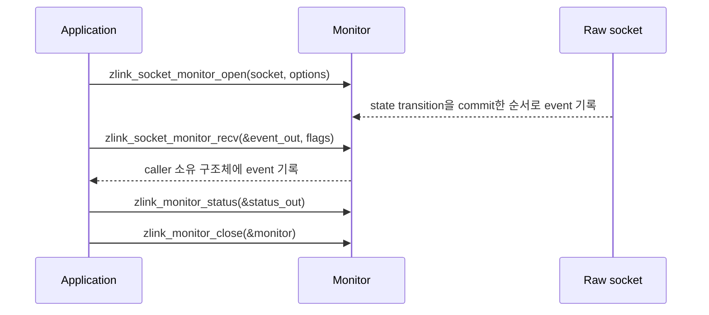

[English](https://zlink-systems.github.io/zlink/spec/core/06-monitoring/) | 한국어

<!-- zlink-nav:start -->
[Core 스펙 목차](README.ko.md) | [이전: Polling](05-polling.ko.md) | [다음: Utilities](07-utilities.ko.md)
<!-- zlink-nav:end -->

# Monitoring

> **이 장이 정의하는 것** — `zlink_socket_monitor_*` API로 socket [event](04-events.ko.md)를
> 별도 채널로 구독하는 공개 계약.

## 1. Monitoring 개요

zlink의 raw socket monitor는 하나의 [socket](glossary.ko.md#socket)에서 일어나는 connection,
transport, protocol과 socket lifecycle의 변화를 별도 event 채널로 구독하는 관측 도구다.
socket monitor는 bind, accept, connect, disconnect, handshake, protocol error와 close
event를 제공한다. Monitor는 상태를 관측할 뿐 routing과 queue 상태를 변경하지 않는다.

이 문서는 monitor를 열고, event를 소비하고, status snapshot을 조회하고, 닫는 공개 계약을
정의한다. 대상 독자는 이 계약을 C API와 각 언어 binding으로 옮기는 개발자다.

관련 계약의 소유 문서는 다음과 같다.

| 관련 계약 | 정의하는 문서 |
|---|---|
| socket event family 카탈로그, receive-flow event 3개의 발생 조건과 `value`·`flags` 의미 | [Events](04-events.ko.md) |
| monitor queue의 Auto HWM planning 제외와 context budget snapshot 집계 | [Auto HWM](systems/06-auto-hwm.ko.md) |
| 각 result 값과 errno의 대응 | [Errors](03-errors.ko.md#result와-errno-대응) |

## 2. Monitor 수명과 소비 mode

monitor의 수명은 **open → event 소비 → close** 순으로 진행한다.

- **open** — [`zlink_socket_monitor_open`](#zlink_socket_monitor_open)이 대상 socket에
  monitor를 연다. Open options의 `events` mask가 받을 event를 고른다. `events == 0`은
  event를 선택하지 않고 `EVENT_ALL`은 모든 bit를 선택한다.
- **소비** — [`zlink_socket_monitor_recv`](#zlink_socket_monitor_recv)로 event를 직접 꺼낸다.
- **status** — [`zlink_monitor_status`](#zlink_monitor_status)가 현재 상태
  snapshot([§6](#6-status-snapshot))을 채운다.
- **close** — [`zlink_monitor_close`](#zlink_monitor_close)가 monitor를 닫는다.

Recv와 close는 같은 event queue의 single consumer 규칙을 지켜야 한다.
이 규칙은 caller가 직접 직렬화해야 하는 사용 의무이며, Core는 recv·close의
동시 소비를 검출하거나 직렬화하지 않는다.

Event의 address와 peer를 식별하는 byte 열인 routing ID는 caller-owned output 구조체 안의 값이다.



## 3. Event 해석

### 3.1 Connection과 lane 식별

`connection_id`는 현재 프로세스에서 하나의 물리적 transport 시도를 식별하는 진단·correlation
값이다. Send target이나 reconnect fence로 사용할 수 없다. `transport_lane`은 physical connection을
분류한다. DEALER-DEALER와 DEALER-ROUTER의 모든 physical event는 Application이고, ROUTER-ROUTER의 별도
Completion connection만 Completion 값을 낼 수 있다. 그 밖의 transport도 Application 값이다.

`CONNECTION_READY`는 DEALER-DEALER·DEALER-ROUTER의 count `1`과 ROUTER-ROUTER의 count `2`를 모두 logical
peer 하나로 집계하여 ready edge를 정확히 한 번만 발생시키고 `value`에도 한 번만 센다.
ROUTER-ROUTER의 두 lane이 서로 다른 시점에 routing ID를 알게 되어도 두 ready transport로
나누지 않으며, 한 lane만 ready이면 count를 늘리지 않는다.

### 3.2 `value`와 `flags`

event별 `value`의 의미는 다음과 같다.

| Event | `value` |
|---|---|
| `DISCONNECTED` | `zlink_disconnect_reason_t` 값 |
| `HANDSHAKE_FAILED_PROTOCOL` | `zlink_protocol_error_t` 값 |
| `PEER_WEIGHT_CHANGED` | 새 `0..10000` weight |
| `CONNECTION_READY` | 해당 monitor source가 ready인 공개 transport 수의 현재 count |
| 그 밖의 실패 event | 해당 실패의 errno |
| receive-flow event 3개 | [Events](04-events.ko.md)가 소유 |

`CONNECTION_READY`의 `value`는 ready인 공개 transport 수의 현재 count이므로, count가 증가한
순간을 구분해야 하면 `flags`의 `ZLINK_MONITOR_EVENT_FLAG_CONNECTION_READY_EDGE`를 사용한다.
이 flag가 없는 ready count event는 count snapshot이며 새로운 연결의 ready edge를 뜻하지
않는다.

`ZLINK_MONITOR_EVENT_FLAG_SEND_FLOW_WRITABLE`,
`ZLINK_MONITOR_EVENT_FLAG_FLOW_STATE_STALE_EPOCH`는 receive-flow event
3개(`ZLINK_EVENT_SEND_FLOW_PAUSED`, `ZLINK_EVENT_SEND_FLOW_RESUMED`,
`ZLINK_EVENT_FLOW_STATE_STALE`)에만 적용한다. 발생 조건과 각 event의 `value` 의미는
[Events](04-events.ko.md)가 소유한다.

## 4. 순서, overflow와 thread 안전성

같은 monitor에서는 Core가 state transition을 commit한 순서로 event를 queue에 넣는다. 서로
다른 connection [I/O thread](glossary.ko.md#io-thread) 사이의 wall-clock order는 보장하지
않는다.

Monitor queue는 bounded이며 lossy다. Queue가 가득 차면 event 종류와 관계없이 새로 들어온
record를 폐기하고, 이미 queue에 있는 record는 유지한다. Event를 aggregate하거나
종류별로 우선 보존하지 않고, 폐기 수를 세는 공개 counter나 status field도 제공하지
않는다. Monitor consumer 지연은 raw socket submit을 block하지 않는다.

thread 규칙은 [§2](#2-monitor-수명과-소비-mode)의 single consumer 규칙을 따른다 — caller가
recv와 close를 직렬화해 같은 event queue를 하나의 consumer로 사용한다.
Core가 동시 호출을 검출하거나 대신 직렬화해 주는 계약은 없다.

## 5. Monitor queue의 byte 예산

`monitor_hwm_bytes`는 monitor source worker와 내부 monitor PAIR 양쪽에 적용하는 단일 byte
예산이다. 여기서 [HWM](glossary.ko.md#hwm)은 queue에 유지할 byte를 제한하는 값이다. 양수는
변환 없이 정확한 SNDHWM·RCVHWM과 worker admission 상한으로 사용한다. `0`은 unlimited가
아니라 Core가
`checkedMultiply(4096, sizeof(socket_monitor_internal_event_t) + sizeof(zlink_msg_t))`
로 계산한 기본 byte 값을 선택한다.

Worker도 event count가 아니라 실제 record의 accounted byte로 수용 여부를 판단하고, 빈
queue의 oversize record 한 건 규칙만 동일하게 적용한다.

Monitor queue는 application Auto HWM [water-filling](glossary.ko.md#water-filling) 분배에서
제외하며, context budget snapshot은 내부 monitor PAIR의 고유한 physical ypipe 방향을 한
번씩만 집계하고 reader와 writer endpoint의 option을 중복해서 더하지 않는다 — 이 관계의
계약은 [Auto HWM](systems/06-auto-hwm.ko.md)이 소유한다.

## 6. Status snapshot

### 6.1 ABI version과 layout

[`zlink_monitor_status`](#zlink_monitor_status)가 채우는 status 구조체의 `abi_version`은
`ZLINK_MONITOR_STATUS_ABI_VERSION`이고 `struct_size`는 반환된 ABI version의 전체 byte
크기다. 두 값은 Core가 반환한 현재 layout의 진단값이며 caller 입력이나 호환성 협상값이
아니다. raw socket monitor status의 `source_kind`는 `ZLINK_MONITOR_SOURCE_SOCKET`이다.

현재 ABI version은 `4`이며 `snd_pending_bytes`·`rcv_pending_bytes`와 receive-flow field 5개를
포함한다. 이전 layout을 호환 layout으로 받지 않으며 caller size/version 협상이나 병렬 versioned
entrypoint를 제공하지 않는다.

### 6.2 Detail bit와 유효 field

`detail_flags`는 status의 어떤 선택 field가 유효한지 알린다. 각 detail bit가 유효하게
만드는 field는 다음과 같다. 한 field는 한 bit에만 속하며 bit가 없으면 표의 field를 모두
0으로 채운다.

| detail bit | 유효한 field |
|---|---|
| `ZLINK_MONITOR_STATUS_DETAIL_SND_PENDING_MSGS` | `snd_pending_msgs`, `snd_pending_bytes` |
| `ZLINK_MONITOR_STATUS_DETAIL_RCV_PENDING_MSGS` | `rcv_pending_msgs`, `rcv_pending_bytes` |
| `ZLINK_MONITOR_STATUS_DETAIL_AUTO_HWM_BUDGET` | `auto_hwm_enabled`, `auto_hwm_profile`, `auto_hwm_role`, `auto_hwm_policy_class`, `auto_hwm_planned_sndhwm_bytes`, `auto_hwm_planned_rcvhwm_bytes`, `auto_hwm_last_recalc_ms`, `auto_hwm_last_recalc_reason`, `auto_hwm_send_blocked_ratio_ppm`, `auto_hwm_deferred_sndhwm_bytes`, `auto_hwm_deferred_rcvhwm_bytes`, `auto_hwm_deferred_sndhwm_valid`, `auto_hwm_deferred_rcvhwm_valid` |
| `ZLINK_MONITOR_STATUS_DETAIL_AUTO_HWM_BUFFERS` | `auto_hwm_applied_sndhwm_bytes`, `auto_hwm_applied_rcvhwm_bytes`, `auto_hwm_effective_sndbuf`, `auto_hwm_effective_rcvbuf`, `snd_bytes_in_flight`, `rcv_bytes_in_flight`, `minimum_core_message_charge_bytes`, `oversize_message_admission_count`, `oversize_message_admission_max_bytes` |
| `ZLINK_MONITOR_STATUS_DETAIL_FLOW_STATE` | `flow_paused_connections`, `flow_pause_applied_total`, `flow_resume_applied_total`, `flow_state_stale_total`, `flow_pause_duration_ms` |

### 6.3 Byte와 pending 진단 field

Planned field는 현재 자동 정책의 계산 결과를 제공한다. Applied field는 수동 override를
포함해 소켓이 실제로 사용하는 byte HWM을 제공한다. Deferred 값은 대응하는 `_valid`
field가 0이 아닐 때만 유효하다.

`snd_bytes_in_flight`와 `rcv_bytes_in_flight`는 snapshot 시점의 directional pipe 합계다.
`snd_pending_bytes`와 `rcv_pending_bytes`는 각각 같은 send·receive
in-flight 합계를 제공한다. Receive 합계와 count는 일부 source에서 근삿값이다. Pending
message field의 단위는 계속 count이며 pending byte field는 admission 회계와 같은 byte
단위를 사용하지만 진단값 자체를 admission 입력으로 사용하지 않는다. Minimum charge와
oversize field를 사용하면 message마다 allocator를 조회하지 않고도 byte 회계 결과를 진단할
수 있다.

`snd_pending_msgs`, `rcv_pending_msgs`, `snd_pending_bytes`, `rcv_pending_bytes`,
`snd_bytes_in_flight`, `rcv_bytes_in_flight`로 구성된 pipe 합계 field 군은 하나의 lock
안에서 읽으므로 그 field 군 안에서 일관된다. Auto HWM field와 [§6.4](#64-receive-flow-통계)의
flow counter는 별도 시점에 읽을 수 있다. 따라서 pipe 합계 field 군, Auto HWM field와
flow counter 사이의 교차 일관성은 보장하지 않는다.

`auto_hwm_send_blocked_ratio_ppm`은 측정 epoch에서 해당 socket의 최초 send admission 시도
중 application pipe HWM 때문에 block된 비율이다. 같은 submit의 wake 뒤 재시도는 다시 세지
않으며 transport I/O wait, ROUTER-ROUTER completion lane과 context aggregate 사용량은 제외한다.

Context의 Auto HWM snapshot ABI version은 v1이다. DEALER-ROUTER reply byte는
`core_queue_accounted_bytes`, `current_accounted_bytes`, 필요하면 `provisional_accounted_bytes`,
`peak_accounted_bytes`와 `total_messaging_accounted_bytes`에 포함된다. 이 reply는
`completion_current_accounted_bytes`, `completion_peak_accounted_bytes`,
`completion_pending_message_count`와 `active_completion_directional_queue_count`에 포함되지
않는다. 이 field의 선언과 정확한 회계는 [Auto HWM](systems/06-auto-hwm.ko.md)이 소유한다.

### 6.4 Receive-flow 통계

`ZLINK_MONITOR_STATUS_DETAIL_FLOW_STATE`는 receive-flow를 지원하는 DEALER·ROUTER socket에
설정한다. 별도 [completion lane](glossary.ko.md#completion-progress-lane)이 없는
DEALER-DEALER와 DEALER-ROUTER도 포함한다. 다른 socket 유형에서는 이
bit가 없고 field 5개가 모두 0이다. 이 field는 해당 socket이 peer에서 관측한 receive-flow
상태를 제공한다. 각 field의 정확한 증감 규칙은 [§7.5](#75-status-구조체)의 선언 주석이
담는다.

Counter 3개(`flow_pause_applied_total`, `flow_resume_applied_total`,
`flow_state_stale_total`)는 socket 수명 동안 단조 증가한다. 이 값을 reset하거나 rebase하는
공개 호출은 없으며 `zlink_ctx_reset_auto_hwm_budget_metrics`도 이 값을 바꾸지 않는다.
이 flow counter와 다른 field 군 사이의 snapshot 일관성은 [§6.3](#63-byte와-pending-진단-field)의
경계를 따른다.

## 7. 타입과 상수

### 7.1 Event mask

`ZLINK_SOCKET_MONITOR_EVENT_*`가 event mask의 정식 이름이며 `ZLINK_EVENT_*`는 같은 숫자의
짧은 이름이다.

```c
typedef uint32_t zlink_socket_monitor_event_mask_t;  // open options의 event 선택 mask

typedef enum zlink_socket_monitor_event_e {
  ZLINK_SOCKET_MONITOR_EVENT_CONNECTED                  = 1u << 0,
  ZLINK_SOCKET_MONITOR_EVENT_CONNECT_DELAYED            = 1u << 1,
  ZLINK_SOCKET_MONITOR_EVENT_CONNECT_RETRIED            = 1u << 2,
  ZLINK_SOCKET_MONITOR_EVENT_LISTENING                  = 1u << 3,
  ZLINK_SOCKET_MONITOR_EVENT_BIND_FAILED                = 1u << 4,
  ZLINK_SOCKET_MONITOR_EVENT_ACCEPTED                   = 1u << 5,
  ZLINK_SOCKET_MONITOR_EVENT_ACCEPT_FAILED              = 1u << 6,
  ZLINK_SOCKET_MONITOR_EVENT_CLOSED                     = 1u << 7,
  ZLINK_SOCKET_MONITOR_EVENT_CLOSE_FAILED               = 1u << 8,
  ZLINK_SOCKET_MONITOR_EVENT_DISCONNECTED               = 1u << 9,
  ZLINK_SOCKET_MONITOR_EVENT_MONITOR_STOPPED            = 1u << 10,
  ZLINK_SOCKET_MONITOR_EVENT_HANDSHAKE_FAILED_NO_DETAIL = 1u << 11,
  ZLINK_SOCKET_MONITOR_EVENT_CONNECTION_READY           = 1u << 12,
  ZLINK_SOCKET_MONITOR_EVENT_HANDSHAKE_FAILED_PROTOCOL  = 1u << 13,
  ZLINK_SOCKET_MONITOR_EVENT_HANDSHAKE_FAILED_AUTH      = 1u << 14,
  ZLINK_SOCKET_MONITOR_EVENT_PEER_WEIGHT_CHANGED        = 1u << 15,
  ZLINK_SOCKET_MONITOR_EVENT_SEND_FLOW_PAUSED           = 1u << 16,  // 발생 조건은 Events 소유
  ZLINK_SOCKET_MONITOR_EVENT_SEND_FLOW_RESUMED          = 1u << 17,  // 발생 조건은 Events 소유
  ZLINK_SOCKET_MONITOR_EVENT_FLOW_STATE_STALE           = 1u << 18,  // 발생 조건은 Events 소유
  ZLINK_SOCKET_MONITOR_EVENT_ALL                        = 0x7FFFFu,  // 모든 bit (0..18) 선택

  /* ZLINK_EVENT_*는 같은 숫자의 짧은 이름이다. */
  ZLINK_EVENT_CONNECTED                  = ZLINK_SOCKET_MONITOR_EVENT_CONNECTED,
  ZLINK_EVENT_CONNECT_DELAYED            = ZLINK_SOCKET_MONITOR_EVENT_CONNECT_DELAYED,
  ZLINK_EVENT_CONNECT_RETRIED            = ZLINK_SOCKET_MONITOR_EVENT_CONNECT_RETRIED,
  ZLINK_EVENT_LISTENING                  = ZLINK_SOCKET_MONITOR_EVENT_LISTENING,
  ZLINK_EVENT_BIND_FAILED                = ZLINK_SOCKET_MONITOR_EVENT_BIND_FAILED,
  ZLINK_EVENT_ACCEPTED                   = ZLINK_SOCKET_MONITOR_EVENT_ACCEPTED,
  ZLINK_EVENT_ACCEPT_FAILED              = ZLINK_SOCKET_MONITOR_EVENT_ACCEPT_FAILED,
  ZLINK_EVENT_CLOSED                     = ZLINK_SOCKET_MONITOR_EVENT_CLOSED,
  ZLINK_EVENT_CLOSE_FAILED               = ZLINK_SOCKET_MONITOR_EVENT_CLOSE_FAILED,
  ZLINK_EVENT_DISCONNECTED               = ZLINK_SOCKET_MONITOR_EVENT_DISCONNECTED,
  ZLINK_EVENT_MONITOR_STOPPED            = ZLINK_SOCKET_MONITOR_EVENT_MONITOR_STOPPED,
  ZLINK_EVENT_HANDSHAKE_FAILED_NO_DETAIL =
    ZLINK_SOCKET_MONITOR_EVENT_HANDSHAKE_FAILED_NO_DETAIL,
  ZLINK_EVENT_CONNECTION_READY           = ZLINK_SOCKET_MONITOR_EVENT_CONNECTION_READY,
  ZLINK_EVENT_HANDSHAKE_FAILED_PROTOCOL  =
    ZLINK_SOCKET_MONITOR_EVENT_HANDSHAKE_FAILED_PROTOCOL,
  ZLINK_EVENT_HANDSHAKE_FAILED_AUTH      =
    ZLINK_SOCKET_MONITOR_EVENT_HANDSHAKE_FAILED_AUTH,
  ZLINK_EVENT_PEER_WEIGHT_CHANGED        =
    ZLINK_SOCKET_MONITOR_EVENT_PEER_WEIGHT_CHANGED,
  ZLINK_EVENT_SEND_FLOW_PAUSED           =
    ZLINK_SOCKET_MONITOR_EVENT_SEND_FLOW_PAUSED,
  ZLINK_EVENT_SEND_FLOW_RESUMED          =
    ZLINK_SOCKET_MONITOR_EVENT_SEND_FLOW_RESUMED,
  ZLINK_EVENT_FLOW_STATE_STALE           =
    ZLINK_SOCKET_MONITOR_EVENT_FLOW_STATE_STALE,
  ZLINK_EVENT_ALL                        = ZLINK_SOCKET_MONITOR_EVENT_ALL
} zlink_socket_monitor_event_e;
```

### 7.2 Event record

```c
typedef struct zlink_monitor_event_t {
  uint64_t event;                      // ZLINK_SOCKET_MONITOR_EVENT_* 값
  uint64_t value;                      // event별 부가 값 (§3.2)
  zlink_routing_id_t routing_id;       // event의 routing ID
  char local_addr[256];                // event의 local 주소
  char remote_addr[256];               // event의 remote 주소
  uint64_t connection_id;              // 현재 프로세스의 물리적 transport 시도 식별자 (§3.1)
  uint32_t transport_lane;             // zlink_monitor_transport_lane_t 값
  uint32_t flags;                      // ZLINK_MONITOR_EVENT_FLAG_* bit
} zlink_monitor_event_t;

typedef enum zlink_monitor_transport_lane_e {
  ZLINK_MONITOR_TRANSPORT_LANE_APPLICATION = 0,  // Application lane. pair가 없는 transport의 기본값
  ZLINK_MONITOR_TRANSPORT_LANE_COMPLETION  = 1   // Completion lane
} zlink_monitor_transport_lane_t;

#define ZLINK_MONITOR_EVENT_FLAG_CONNECTION_READY_EDGE (1u << 0)       // count가 증가한 ready edge (§3.2)
#define ZLINK_MONITOR_EVENT_FLAG_SEND_FLOW_WRITABLE (1u << 1)          // receive-flow event 전용. 의미는 Events 소유
#define ZLINK_MONITOR_EVENT_FLAG_FLOW_STATE_STALE_EPOCH (1u << 3)      // receive-flow event 전용. 의미는 Events 소유

typedef zlink_monitor_event_t zlink_socket_monitor_event_t;
```

### 7.3 `value`가 사용하는 enum

`ZLINK_DISCONNECT_*` macro는 같은 이름의 `ZLINK_DISCONNECT_REASON_*` enum 값에 대한 ABI
유지 alias다.

```c
typedef enum zlink_disconnect_reason_t {   // DISCONNECTED event의 value (§3.2)
  ZLINK_DISCONNECT_REASON_UNKNOWN          = 0,
  ZLINK_DISCONNECT_REASON_HANDSHAKE_FAILED = 3,
  ZLINK_DISCONNECT_REASON_TRANSPORT_ERROR  = 4,
  ZLINK_DISCONNECT_REASON_CTX_TERM         = 5
} zlink_disconnect_reason_t;

#define ZLINK_DISCONNECT_UNKNOWN ZLINK_DISCONNECT_REASON_UNKNOWN
#define ZLINK_DISCONNECT_HANDSHAKE_FAILED ZLINK_DISCONNECT_REASON_HANDSHAKE_FAILED
#define ZLINK_DISCONNECT_TRANSPORT_ERROR ZLINK_DISCONNECT_REASON_TRANSPORT_ERROR
#define ZLINK_DISCONNECT_CTX_TERM ZLINK_DISCONNECT_REASON_CTX_TERM

typedef enum zlink_protocol_error_t {      // HANDSHAKE_FAILED_PROTOCOL event의 value (§3.2)
  ZLINK_PROTOCOL_ERROR_ZMP_MALFORMED_COMMAND_HELLO = 0x10000013,
  ZLINK_PROTOCOL_ERROR_ZMP_MALFORMED_COMMAND_READY = 0x10000016
} zlink_protocol_error_t;
```

### 7.4 Open options

```c
typedef struct zlink_socket_monitor_open_options_t {
  zlink_socket_monitor_event_mask_t events;  // 받을 event bit. 0=선택 없음, EVENT_ALL=모든 bit (§2)
  uint64_t monitor_hwm_bytes;                // monitor queue 단일 byte 예산. 0=Core 기본값 (§5)
} zlink_socket_monitor_open_options_t;
```

### 7.5 Status 구조체

```c
#define ZLINK_MONITOR_STATUS_ABI_VERSION 4u  // 현재 status layout의 ABI version (§6.1)

typedef enum zlink_monitor_source_kind_t {
  ZLINK_MONITOR_SOURCE_SOCKET = 1   // raw socket monitor의 source_kind
} zlink_monitor_source_kind_t;

typedef uint32_t zlink_monitor_state_mask_t;

typedef enum zlink_monitor_state_flag_e {
  ZLINK_MONITOR_STATE_READY       = 1u << 0,
  ZLINK_MONITOR_STATE_BOUND_READY = 1u << 1,
  ZLINK_MONITOR_STATE_CLOSED      = 1u << 3
} zlink_monitor_state_flag_e;

typedef uint32_t zlink_monitor_status_detail_mask_t;

typedef enum zlink_monitor_status_detail_flag_e {  // bit별 유효 field는 §6.2 표
  ZLINK_MONITOR_STATUS_DETAIL_SND_PENDING_MSGS = 1u << 1,
  ZLINK_MONITOR_STATUS_DETAIL_RCV_PENDING_MSGS = 1u << 2,
  ZLINK_MONITOR_STATUS_DETAIL_AUTO_HWM_BUDGET  = 1u << 3,
  ZLINK_MONITOR_STATUS_DETAIL_AUTO_HWM_BUFFERS = 1u << 4,
  ZLINK_MONITOR_STATUS_DETAIL_FLOW_STATE       = 1u << 5   // receive-flow를 지원하는 DEALER·ROUTER에서만 (§6.4)
} zlink_monitor_status_detail_flag_e;

typedef enum zlink_auto_hwm_recalc_reason_t {  // auto_hwm_last_recalc_reason field 값
  ZLINK_AUTO_HWM_RECALC_REASON_NONE            = 0,
  ZLINK_AUTO_HWM_RECALC_REASON_INITIAL         = 1,
  ZLINK_AUTO_HWM_RECALC_REASON_ROLE_CHANGE     = 2,
  ZLINK_AUTO_HWM_RECALC_REASON_POLICY_TOGGLE   = 3,
  ZLINK_AUTO_HWM_RECALC_REASON_REFRESH         = 4,
  ZLINK_AUTO_HWM_RECALC_REASON_DEFERRED_SHRINK = 5
} zlink_auto_hwm_recalc_reason_t;

typedef struct zlink_monitor_status_t {
  uint32_t abi_version;                     // Core가 반환한 현재 layout의 ABI version (진단값, §6.1)
  uint32_t struct_size;                     // 반환된 ABI version의 전체 byte 크기
  zlink_monitor_source_kind_t source_kind;  // raw socket monitor는 ZLINK_MONITOR_SOURCE_SOCKET
  zlink_monitor_state_mask_t state_flags;   // ZLINK_MONITOR_STATE_* bit
  zlink_monitor_status_detail_mask_t detail_flags;  // 유효한 선택 field 그룹 (§6.2)
  uint64_t snd_pending_msgs;                // send 방향 대기 message 수 (count)
  uint64_t rcv_pending_msgs;                // receive 방향 대기 message 수 (count, 일부 source에서 근삿값)
  uint64_t snd_pending_bytes;               // send in-flight byte 합계 (§6.3)
  uint64_t rcv_pending_bytes;               // receive in-flight byte 합계 (§6.3)
  uint32_t auto_hwm_enabled;
  uint32_t auto_hwm_profile;
  uint32_t auto_hwm_role;
  uint32_t auto_hwm_policy_class;
  uint64_t auto_hwm_planned_sndhwm_bytes;   // planned: 현재 자동 정책의 계산 결과 (§6.3)
  uint64_t auto_hwm_planned_rcvhwm_bytes;
  uint64_t auto_hwm_applied_sndhwm_bytes;   // applied: 수동 override 포함 실제 사용하는 byte HWM (§6.3)
  uint64_t auto_hwm_applied_rcvhwm_bytes;
  int32_t auto_hwm_effective_sndbuf;
  int32_t auto_hwm_effective_rcvbuf;
  uint64_t auto_hwm_last_recalc_ms;
  uint32_t auto_hwm_last_recalc_reason;     // zlink_auto_hwm_recalc_reason_t 값
  uint32_t auto_hwm_send_blocked_ratio_ppm; // HWM 때문에 처음 block된 send 시도 비율 (ppm, §6.3)
  uint64_t auto_hwm_deferred_sndhwm_bytes;  // deferred: 대응 _valid가 0이 아닐 때만 유효 (§6.3)
  uint64_t auto_hwm_deferred_rcvhwm_bytes;
  uint32_t auto_hwm_deferred_sndhwm_valid;
  uint32_t auto_hwm_deferred_rcvhwm_valid;
  uint64_t snd_bytes_in_flight;             // snapshot 시점 send 방향 directional pipe 합계
  uint64_t rcv_bytes_in_flight;             // snapshot 시점 receive 방향 directional pipe 합계
  uint64_t minimum_core_message_charge_bytes;  // byte 회계 진단용 (§6.3)
  uint64_t oversize_message_admission_count;   // byte 회계 진단용 (§6.3)
  uint64_t oversize_message_admission_max_bytes;
  /* Version 4에서 덧붙인 receive-flow field 5개 (ZLINK_MONITOR_STATUS_DETAIL_FLOW_STATE, §6.4) */
  uint64_t flow_paused_connections;   // gauge: 현재 remote-PAUSED로 보는 application pipe 수.
                                      // 적용된 PAUSED 전이마다 1 증가하고, 짝이 되는 RUNNING 전이
                                      // 또는 PAUSED 상태에서 종료된 pipe마다 1 감소한다
  uint64_t flow_pause_applied_total;  // counter: socket 생성 이후 실제로 적용된 PAUSED 전이 수.
                                      // stale·중복·같은 상태 frame은 세지 않는다
  uint64_t flow_resume_applied_total; // counter: 같은 규칙으로 실제 적용된 RUNNING 전이 수.
                                      // PAUSED 상태에서 종료된 pipe는 resume으로 세지 않는다
  uint64_t flow_state_stale_total;    // counter: stale이나 중복으로 판정해 무시한 flow-state frame 수
  uint64_t flow_pause_duration_ms;    // 가장 최근에 끝난 PAUSED 구간의 길이 (ms). 완료된 구간이
                                      // 없으면 0. pipe 종료로 끝난 pause도 길이를 기록한다
} zlink_monitor_status_t;
```

## 8. 함수

각 result 값과 errno의 대응은 [errno map](03-errors.ko.md#result와-errno-대응)이 소유한다.

### zlink_socket_monitor_open

대상 socket에 raw socket monitor를 연다.

```c
ZLINK_EXPORT void *zlink_socket_monitor_open(
  void *socket,
  const zlink_socket_monitor_open_options_t *options);
```

`options`의 `events` mask가 받을 event를 고르고([§2](#2-monitor-수명과-소비-mode)),
`monitor_hwm_bytes`가 monitor queue의 byte 예산을 정한다([§5](#5-monitor-queue의-byte-예산)).
이 함수, open options와 status 구조체의 layout 정책은 [§6.1](#61-abi-version과-layout)을
따른다 — caller size/version 협상이나 병렬 versioned entrypoint를 추가하지 않는다.

**반환값:** 성공 시 monitor 핸들, 실패 시 `NULL` (errno가 설정됨).

**에러:** HWM 범위·계산 또는 allocation 때문에 monitor를 열 수 없으면 `NULL`과 `errno`로
실패한다. 별도 `RESOURCE_LIMIT` config result나 binding error type을 추가하지 않는다.

**참고:** `zlink_monitor_close`, `zlink_monitor_status`

---

### zlink_socket_monitor_recv

event 하나를 caller 소유 구조체로 받는다 (recv mode).

```c
ZLINK_EXPORT zlink_recv_result_t zlink_socket_monitor_recv(
  void *monitor,
  zlink_socket_monitor_event_t *event_out,
  zlink_recv_flags_t flags);
```

현재 `zlink_socket_monitor_event_t` layout 전체를 기록한다. 호출자는 현재 layout
크기의 output buffer를 제공해야 하며, 이전 event prefix를 위한 별도 receive entry point나
version 협상 경로는 제공하지 않는다. 받은 event의 address와 routing ID는 caller-owned
output 구조체 안의 값이다.

**반환값:** `zlink_recv_result_t` 값.

**스레드 안전성:** recv와 close는 같은 event queue의 single consumer 규칙을
지킨다([§2](#2-monitor-수명과-소비-mode)).

**참고:** `zlink_monitor_status`, `zlink_monitor_close`

---

### zlink_monitor_status

monitor의 현재 status snapshot을 조회한다.

```c
ZLINK_EXPORT zlink_config_result_t zlink_monitor_status(
  void *monitor,
  zlink_monitor_status_t *status_out);
```

`status_out`을 [§6](#6-status-snapshot)의 규칙대로 채운다. `abi_version`과 `struct_size`는
Core가 반환한 현재 layout의 진단값이며 caller 입력이 아니다. `detail_flags`에 없는 선택
field는 0이다. Pipe 합계 field 군은 하나의 lock 안에서 읽어 군 내부의 일관성을
보장한다. Auto HWM field와 flow counter는 별도 시점에 읽을 수 있으므로 field 군 사이의
교차 일관성은 보장하지 않는다([§6.3](#63-byte와-pending-진단-field)).

**반환값:** `zlink_config_result_t` 값.

**참고:** `zlink_socket_monitor_open`, `zlink_ctx_get_auto_hwm_budget_snapshot`

---

### zlink_monitor_close

monitor를 닫는다.

```c
ZLINK_EXPORT zlink_close_result_t zlink_monitor_close(void **monitor_p);
```

**반환값:** `zlink_close_result_t` 값.

**스레드 안전성:** recv와 close는 같은 event queue의 single consumer 규칙을
지킨다([§2](#2-monitor-수명과-소비-mode)).

**참고:** `zlink_socket_monitor_open`

---

## 9. 구현 및 contract test 검증 요구

공개 표면(`zlink_socket_monitor_*`·`zlink_monitor_*` 함수, open options, event 구조체,
status snapshot, 반환값·errno)만으로 다음을 확인한다. 각 항목은 test 하나로 이어진다.

**Open과 pull 소비**
- `events == 0`으로 연 monitor는 event를 받지 않고, `EVENT_ALL`로 연 monitor는 모든 bit의 event를 받는다.
- HWM 범위·계산 또는 allocation 때문에 monitor를 열 수 없으면 `zlink_socket_monitor_open`이 `NULL`을 반환하고 errno가 설정된다. 별도 `RESOURCE_LIMIT` config result나 binding error type은 관찰되지 않는다.
- `zlink_socket_monitor_recv`의 DONTWAIT 호출은 event가 없으면 `ZLINK_RECV_NO_DATA`를 반환하고
  event output을 변경하지 않는다.
- recv·close의 single consumer 직렬화는 caller의 의무이며, Core는 두 작업의 동시 소비를
  검출하거나 직렬화하지 않는다.

**Event 전달과 순서**
- 같은 monitor에서 받는 event의 순서는 Core가 state transition을 commit한 순서다. 서로 다른 connection I/O thread 사이의 wall-clock order는 보장되지 않는다.
- monitor queue가 가득 차면 event 종류와 관계없이 새 record를 폐기하고 기존 queue record는 유지한다. Event aggregate·종류별 우선 보존은 없으며, 폐기 수는 공개 counter나 status field로 노출하지 않는다.
- monitor consumer가 지연되어도 raw socket submit은 block되지 않는다.

**Event 내용**
- `DISCONNECTED`의 `value`는 `zlink_disconnect_reason_t`, `HANDSHAKE_FAILED_PROTOCOL`의 `value`는 `zlink_protocol_error_t`, `PEER_WEIGHT_CHANGED`의 `value`는 새 `0..10000` weight, 다른 실패 event의 `value`는 해당 실패의 errno다.
- 잘못된 HELLO는 `ZLINK_PROTOCOL_ERROR_ZMP_MALFORMED_COMMAND_HELLO`, 01-zmp가 READY protocol error로
  규정한 경우(`Zlink-Lane-Count`·`Zlink-Lane` 누락·길이·값 오류, count 불일치, count `1`의 lane `1`,
  count `2`의 lane 중복·누락, socket type·`Routing-Id` 불일치)는
  `ZLINK_PROTOCOL_ERROR_ZMP_MALFORMED_COMMAND_READY` value의 `HANDSHAKE_FAILED_PROTOCOL` event를
  해당 physical connection의 `DISCONNECTED`보다 먼저 낸다. 두 경우 모두 `CONNECTION_READY`와
  application payload는 나오지 않는다.
- DEALER-DEALER·DEALER-ROUTER count `1`과 ROUTER-ROUTER count `2`가 각각 logical peer 하나로 준비될 때마다
  `CONNECTION_READY`의 ready edge
  (`ZLINK_MONITOR_EVENT_FLAG_CONNECTION_READY_EDGE`)가 정확히 한 번 발생하고 `value`의 count에도
  한 번만 반영된다. Edge flag가 없는 ready count event는 count snapshot이다.
- DEALER-DEALER·DEALER-ROUTER의 모든 physical event는 `transport_lane`이 Application이고, ROUTER-ROUTER의
  Completion physical event만 Completion을 보고한다.
- `connection_id`는 진단·correlation 값이며 이 값으로 send·reply target을 지정하는 public API는 없다.

**Event data 소유권**
- `zlink_socket_monitor_recv`는 현재 layout 전체를 caller-owned output 구조체에 기록하며, event의
  address와 routing ID는 그 구조체 안의 값이다.

**Status snapshot**
- raw socket monitor status의 `source_kind`는 `ZLINK_MONITOR_SOURCE_SOCKET`, `abi_version`은 `ZLINK_MONITOR_STATUS_ABI_VERSION`, `struct_size`는 반환된 ABI version의 전체 byte 크기다.
- `detail_flags`에 없는 bit의 선택 field는 모두 0이다.
- `ZLINK_MONITOR_STATUS_DETAIL_FLOW_STATE`는 DEALER-DEALER·DEALER-ROUTER count `1`과 ROUTER-ROUTER count `2`
  socket에 설정되며 다른 socket 유형에서는 bit가 없고 flow field 5개가 모두 0이다.
- Auto HWM snapshot은 ABI v1과 정의된 field layout을 사용한다. Controlled DEALER-ROUTER reply byte는
  Application accounting field와 `total_messaging_accounted_bytes`에만 반영되고 Completion
  current·peak·pending·direction count에는 반영되지 않는다.
- flow counter 3개는 socket 수명 동안 단조 증가하고, `zlink_ctx_reset_auto_hwm_budget_metrics`를 호출해도 바뀌지 않는다.
- pipe 합계 field 군은 하나의 lock 안에서 읽어 군 내부에서 일관되며, Auto HWM field·flow counter는 별도 시점에 읽을 수 있어 field 군 사이의 교차 일관성은 보장하지 않는다.

**Monitor queue 예산**
- 양수 `monitor_hwm_bytes`는 변환 없이 정확한 SNDHWM·RCVHWM과 worker admission 상한으로 사용되고, `0`은 unlimited가 아니라 Core가 계산한 기본 byte 값을 선택한다([§5](#5-monitor-queue의-byte-예산)).
- worker는 event count가 아니라 실제 record의 accounted byte로 수용을 판단하고, 빈 queue의 oversize record 한 건 규칙을 동일하게 적용한다.
- monitor queue의 Auto HWM planning 제외와 context budget snapshot 집계의 검증은 [Auto HWM](systems/06-auto-hwm.ko.md#5-구현-및-contract-test-검증-요구)가 소유한다.

<!-- zlink-nav:start -->
[Core 스펙 목차](README.ko.md) | [이전: Polling](05-polling.ko.md) | [다음: Utilities](07-utilities.ko.md)
<!-- zlink-nav:end -->
