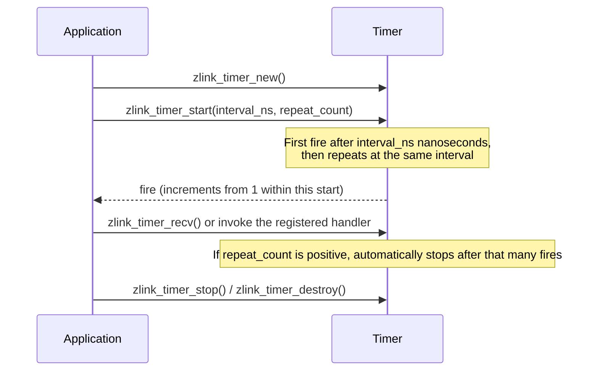

[한국어](https://zlink-systems.github.io/zlink/ko/spec/core/07-utilities/) | English

<!-- zlink-nav:start -->
[Core Spec Index](README.en.md) | [Previous: Monitoring](06-monitoring.en.md) | [Next: Runtime Boundary](08-runtime-boundary.en.md)
<!-- zlink-nav:end -->

# Utilities

> **What this chapter defines** — The public contracts of utility APIs that do
> not belong to an individual category, including atomic counters, timers,
> stopwatches, capability detection, proxies, and thread helpers.

## 1. Utilities Overview

zlink Core provides common runtime features that are not part of the messaging
contract as utility APIs. These include atomic counters for atomically handling
a shared integer, nanosecond-resolution timers, stopwatches as high-resolution
clocks, capability detection for checking which features a library build
includes, proxies for forwarding messages between two raw
[sockets](glossary.en.md#socket), and sleep and thread helpers.

This document defines the public contracts of these utilities. Its intended
readers are developers who map each utility's lifecycle, thread safety, and
callback ownership to the C API and each language binding. It answers the
question, "When using common runtime features, how should the lifetime of each
handle and callback, the scope of concurrent calls, and return values be
interpreted?"

The following documents own the related contracts.

| Related contract | Defining document |
|---|---|
| `zlink_poller_add_timer`, which registers a timer with a poller | [Poll and Poller](05-polling.en.md) |
| Raw socket creation and send/receive contracts (the targets forwarded by a proxy) | [Socket Common](socket/README.en.md) |
| Context lifetime and termination | [Context](01-context.en.md) |

## 2. Atomic Counter

An atomic counter provides atomic increment, decrement, and read operations on
a single integer shared by multiple threads. Create a counter with
`zlink_atomic_counter_new` and destroy it with `zlink_atomic_counter_destroy`.

### zlink_atomic_counter_new

Creates a new atomic counter initialized to zero.

```c
ZLINK_EXPORT void *zlink_atomic_counter_new (void);
```

Allocates and returns an opaque handle to an atomic counter whose initial value
is zero.

**Returns:** A counter handle on success. If memory allocation fails, the
process aborts instead of returning `NULL`.

**Thread safety:** May be called from any thread.

**See also:** `zlink_atomic_counter_set`, `zlink_atomic_counter_destroy`

---

### zlink_atomic_counter_set

Sets the counter to an explicit value.

```c
ZLINK_EXPORT void zlink_atomic_counter_set (void *counter_, int value_);
```

Replaces the current counter value with `value_`.

**Thread safety:** Not thread-safe. It must not be called concurrently with
another operation on the same counter. It is typically used only during
initial setup.

**See also:** `zlink_atomic_counter_value`

---

### zlink_atomic_counter_inc

Increments the counter by one.

```c
ZLINK_EXPORT int zlink_atomic_counter_inc (void *counter_);
```

Atomically increments the counter and returns its previous value (the value
immediately before the increment).

**Returns:** The counter value before the increment.

**Thread safety:** May be called from any thread.

**See also:** `zlink_atomic_counter_dec`

---

### zlink_atomic_counter_dec

Decrements the counter by one.

```c
ZLINK_EXPORT int zlink_atomic_counter_dec (void *counter_);
```

Atomically decrements the counter and returns `1` if it remains greater than
zero after the decrement, or `0` if it reaches zero.

**Returns:** `1` if the counter is still nonzero after the decrement, or `0`
if it has reached zero.

**Thread safety:** May be called from any thread.

**See also:** `zlink_atomic_counter_inc`

---

### zlink_atomic_counter_value

Returns the current counter value.

```c
ZLINK_EXPORT int zlink_atomic_counter_value (void *counter_);
```

Atomically reads the current value of the counter.

**Returns:** The current counter value.

**Thread safety:** May be called from any thread.

**See also:** `zlink_atomic_counter_set`

---

### zlink_atomic_counter_destroy

Destroys the counter and releases its memory.

```c
ZLINK_EXPORT void zlink_atomic_counter_destroy (void **counter_p_);
```

Releases the counter handle. After destruction, the pointer at `*counter_p_`
is set to `NULL`.

**Thread safety:** It must not be called while another thread is operating on
the same counter.

**See also:** `zlink_atomic_counter_new`

## 3. Timer

A timer provides a nanosecond-resolution periodic or one-shot generic timer.
Create a standalone timer with `zlink_timer_new`. A timer fire event can be
received synchronously with `zlink_timer_recv`, driven by a
`zlink_timer_handler` callback, or integrated into a poller with
`zlink_poller_add_timer`—[Poll and Poller](05-polling.en.md) owns the poller
integration contract.



### zlink_timer_handler_fn

```c
typedef void (*zlink_timer_handler_fn) (void *timer_,
                                        uint64_t fire_count_,
                                        void *userdata_);
```

This is the signature of a timer expiration callback. `timer_` is the handle
of the timer that fired, `fire_count_` is the fire count starting from 1
within the most recent successful `zlink_timer_start` execution, and
`userdata_` is the user pointer supplied when the handler was registered.

---

### zlink_timer_new

Creates a standalone timer.

```c
ZLINK_EXPORT void *zlink_timer_new (void);
```

Allocates and returns an opaque timer handle. Destroy it with
`zlink_timer_destroy` when it is no longer needed.

**Returns:** A timer handle on success, or `NULL` on failure. On failure, errno
is set.

**Thread safety:** May be called from any thread.

**See also:** `zlink_timer_destroy`

---

### zlink_timer_destroy

Destroys a timer and releases its resources.

```c
ZLINK_EXPORT zlink_close_result_t zlink_timer_destroy (void **timer_p_);
```

Stops a running timer and releases its handle. After destruction,
`*timer_p_` is set to `NULL`.

**Returns:** `ZLINK_CLOSE_OK` on success, or a `zlink_close_result_t` value
on failure. `zlink_errno()` preserves the internal errno for diagnostics.

**Thread safety:** It must not be called while another thread is using the
same timer.

**See also:** `zlink_timer_new`

---

### zlink_timer_start

Starts a timer.

```c
ZLINK_EXPORT zlink_config_result_t zlink_timer_start (void *timer_,
                                         uint64_t interval_ns_,
                                         uint64_t repeat_count_);
```

Starts the timer so that its first event occurs after `interval_ns_`
nanoseconds. `interval_ns_` is the interval between events in nanoseconds and
must not be `0`. If `repeat_count_` is `0`, the timer repeats until
explicitly stopped. If it is positive, the timer generates that many events
and then stops automatically. Each successful start resets the fire count, so
the first fire is `1`, followed by `2`, `3`, and so on.

**Returns:** `ZLINK_CONFIG_OK` on success, or a `zlink_config_result_t` value
on failure. `zlink_errno()` preserves the internal errno for diagnostics.

**Errors:** If `interval_ns_ == 0`, the result is
`ZLINK_CONFIG_INVALID_ARGUMENT` and the internal errno is `EINVAL`.

**Thread safety:** It must not be called concurrently with another operation
on the same timer.

**See also:** `zlink_timer_stop`

---

### zlink_timer_stop

Stops a running timer.

```c
ZLINK_EXPORT zlink_config_result_t zlink_timer_stop (void *timer_);
```

Stops the timer. It generates no new fire events until it is started again.

**Returns:** `ZLINK_CONFIG_OK` on success, or a `zlink_config_result_t` value
on failure. `zlink_errno()` preserves the internal errno for diagnostics.

**Thread safety:** It must not be called concurrently with another operation
on the same timer.

**See also:** `zlink_timer_start`

---

### zlink_timer_recv

Synchronously receives a timer fire.

```c
ZLINK_EXPORT zlink_recv_result_t zlink_timer_recv (void *timer_, uint64_t *fire_count_out_);
```

In receive mode, waits for the next timer fire. On success,
`*fire_count_out_` is set to the fire count that starts from 1 within the most
recent start execution.

**Returns:** `ZLINK_RECV_OK` on success, or a `zlink_recv_result_t` value on
failure. `zlink_errno()` preserves the internal errno for diagnostics.

**Errors:** If the timer has already stopped and there is no fire left to read,
the result is `ZLINK_RECV_NO_DATA` (internal `EAGAIN`).

**Thread safety:** It must not be called concurrently with another operation
on the same timer.

**See also:** `zlink_timer_handler`, `zlink_timer_start`

---

### zlink_timer_handler

Registers a timer expiration callback handler.

```c
ZLINK_EXPORT zlink_handler_result_t zlink_timer_handler (void *timer_,
                                            zlink_timer_handler_fn handler_,
                                            void *userdata_);
```

After `handler_` is registered, it is called each time the timer fires. A
`NULL` `handler_` is invalid and fails with
`ZLINK_HANDLER_INVALID_ARGUMENT` (`EINVAL`). After a handler is registered,
`zlink_timer_recv` on the same timer returns `ZLINK_RECV_BUSY`.

The callback receives the timer handle, the fire count starting from 1 within
the most recent start execution, and `userdata_`
([`zlink_timer_handler_fn`](#zlink_timer_handler_fn)). `userdata_` is an
opaque pointer passed through to the callback unchanged.

**Returns:** `ZLINK_HANDLER_OK` on success, or a `zlink_handler_result_t`
value on failure. `zlink_errno()` preserves the internal errno for
diagnostics.

**Thread safety:** It must not be called concurrently with another operation
on the same timer.

**See also:** `zlink_timer_recv`, `zlink_timer_start`

## 4. Stopwatch

A stopwatch provides high-resolution timing functions for benchmarking and
profiling. Start the stopwatch, read intermediate measurements, and stop it to
obtain the total elapsed time in microseconds.

### zlink_stopwatch_start

Starts a high-resolution stopwatch.

```c
ZLINK_EXPORT void *zlink_stopwatch_start (void);
```

Captures the current time and returns an opaque handle used to measure elapsed
time. The handle must eventually be released with `zlink_stopwatch_stop`.

**Returns:** An opaque stopwatch handle on success. If memory allocation fails,
the process aborts instead of returning `NULL`.

**Thread safety:** May be called from any thread. The returned handle must be
used by only one thread at a time.

**See also:** `zlink_stopwatch_intermediate`, `zlink_stopwatch_stop`

---

### zlink_stopwatch_intermediate

Returns elapsed microseconds without stopping the stopwatch.

```c
ZLINK_EXPORT unsigned long zlink_stopwatch_intermediate (void *watch_);
```

Reads the elapsed time since `zlink_stopwatch_start` was called without
releasing the handle. It may be called multiple times for successive
measurements.

**Returns:** Elapsed time in microseconds.

**Thread safety:** It must not be called concurrently with
`zlink_stopwatch_stop` on the same handle.

**See also:** `zlink_stopwatch_start`, `zlink_stopwatch_stop`

---

### zlink_stopwatch_stop

Stops the stopwatch and returns the total elapsed microseconds.

```c
ZLINK_EXPORT unsigned long zlink_stopwatch_stop (void *watch_);
```

Returns the total elapsed time since `zlink_stopwatch_start` was called and
releases the stopwatch handle. The handle must not be used after this call.

**Returns:** Elapsed time in microseconds.

**Thread safety:** It must not be called concurrently with another operation
on the same handle.

**See also:** `zlink_stopwatch_start`, `zlink_stopwatch_intermediate`

## 5. Capability Detection

Use `zlink_has` at runtime to determine which features were included when the
library was built.

### zlink_has

Checks whether the current library build provides a capability.

```c
ZLINK_EXPORT bool zlink_has (const char *capability_);
```

`capability_` is a non-NULL, NUL-terminated string, and the function does not
retain it. `"tcp"` is always `true`. `"ipc"`, `"tls"`, `"ws"`, and
`"wss"` are `true` only when the library was built with the corresponding
feature. Any other string is `false`.

**Thread safety:** Does not mutate global state and may be called from any
thread.

## 6. Proxy

A proxy is a blocking helper that forwards multipart messages bidirectionally
between two raw sockets. [Socket Common](socket/README.en.md) owns the creation
and send/receive contracts of raw sockets.

### zlink_proxy

Forwards multipart messages bidirectionally between two raw sockets.

```c
ZLINK_EXPORT zlink_config_result_t zlink_proxy (void *frontend_, void *backend_, void *capture_);
```

`frontend_` and `backend_` are required raw socket handles. `capture_` may
be `NULL`; when non-NULL, it is a raw socket handle that receives a copy of
every forwarded message. The function blocks the calling thread until the
running proxy loop ends.

All three handles are borrowed. The function neither closes nor owns them. The
proxy receives message frames and forwards them to the opposite socket without
returning frame pointers to the application.

**Returns:** `ZLINK_CONFIG_OK` when the proxy ends normally, or a
`zlink_config_result_t` error otherwise. If a required handle is `NULL` or
is not a raw socket, the result is `ZLINK_CONFIG_INVALID_HANDLE`.

## 7. Sleep and Thread

These are a portable sleep function that wraps platform-specific APIs and an
OS thread helper.

### zlink_thread_fn

```c
typedef void (zlink_thread_fn) (void *);
```

This is the entry-point signature of a thread started with
`zlink_thread_start`.

---

### zlink_sleep

Sleeps for the specified number of seconds.

```c
ZLINK_EXPORT void zlink_sleep (int seconds_);
```

Suspends the calling thread for at least `seconds_` seconds. It is a portable
convenience wrapper around platform-specific sleep functions.

**Thread safety:** May be called from any thread.

**See also:** `zlink_stopwatch_start`

---

### zlink_thread_start

Starts a new thread that runs the specified function.

```c
ZLINK_EXPORT void *zlink_thread_start (zlink_thread_fn *func_, void *arg_);
```

Creates and starts a new operating-system thread that executes `func_` with
`arg_` as its sole argument. The returned handle must be passed to
`zlink_thread_join` to wait for completion and release resources.

**Returns:** An opaque thread handle on success. If allocation of the handle or
creation of the operating-system thread fails, the process aborts instead of
returning `NULL`.

**Thread safety:** May be called from any thread.

**See also:** `zlink_thread_join`

---

### zlink_thread_join

Waits for a thread to finish and releases its handle.

```c
ZLINK_EXPORT void zlink_thread_join (void *thread_);
```

Blocks the calling thread until the thread identified by `thread_` terminates,
then releases the handle. The handle must not be used after this call.

**Thread safety:** Must be called exactly once per handle. It must not be
called from the thread being joined.

**See also:** `zlink_thread_start`

## 8. Implementation and Contract Test Verification Requirements

Verify the following using only the public surface (utility functions, return
values and errno, and callback invocations). Each item maps to one unit test.

**Atomic counter**

- A counter created with `zlink_atomic_counter_new` has an initial value of
  zero—`zlink_atomic_counter_value` returns `0` immediately after creation.
  If a memory allocation failure is injected, the function aborts the process
  instead of returning `NULL`.
- After `zlink_atomic_counter_set`, `zlink_atomic_counter_value` returns the
  set value.
- `zlink_atomic_counter_inc` returns the value immediately before the
  increment.
- `zlink_atomic_counter_dec` returns `1` if the counter remains greater than
  zero after the decrement, or `0` if it reaches zero.
- It is safe for multiple threads to call inc, dec, and value concurrently on
  the same counter—updates are not lost because increments and decrements are
  atomic.
- After `zlink_atomic_counter_destroy`, `*counter_p_` is `NULL`.

**Timer**

- `zlink_timer_new` returns a non-NULL handle on success, or `NULL` with errno
  set on failure.
- `zlink_timer_start(timer, 0, repeat_count)` fails with
  `ZLINK_CONFIG_INVALID_ARGUMENT` and internal `EINVAL`.
- When `zlink_timer_start` receives a positive `repeat_count_`, the timer
  fires that many times and then stops automatically. When it receives `0`,
  the timer repeats until explicitly stopped.
- `zlink_timer_recv` waits for the next fire and, on success, writes to
  `*fire_count_out_` the fire count that starts from 1 within the current start
  execution. After a stop followed by another start, the first value is `1`
  again. If the timer has already stopped and no fire remains to be read, the
  result is `ZLINK_RECV_NO_DATA` (internal `EAGAIN`).
- Passing a `NULL` handler to `zlink_timer_handler` returns
  `ZLINK_HANDLER_INVALID_ARGUMENT` (`EINVAL`).
- After a handler is registered, `zlink_timer_recv` on the same timer returns
  `ZLINK_RECV_BUSY`.
- The registered handler is called on every fire with the timer handle, the
  fire count that starts from 1 within the current start execution, and the
  `userdata_` supplied during registration. After a stop followed by another
  start, the first callback count is `1` again.
- After `zlink_timer_stop`, no new fire event occurs until the timer is started
  again.
- After `zlink_timer_destroy`, `*timer_p_` is `NULL`.

**Stopwatch**

- If a memory allocation failure is injected into `zlink_stopwatch_start`,
  the function aborts the process instead of returning `NULL`.
- `zlink_stopwatch_intermediate` returns the elapsed microseconds since start
  without releasing the handle and may be called multiple times with the same
  handle.
- `zlink_stopwatch_stop` returns the total elapsed microseconds since start
  and releases the handle.

**Capability detection**

- `zlink_has("tcp")` is always `true`.
- `"ipc"`, `"tls"`, `"ws"`, and `"wss"` are `true` only when the
  library was built with the corresponding feature, and any other string is
  `false`.

**Proxy**

- If a required handle passed to `zlink_proxy` is `NULL` or is not a raw
  socket, the result is `ZLINK_CONFIG_INVALID_HANDLE`.
- When a non-NULL `capture_` is supplied, a copy of every forwarded message
  arrives at the capture socket.
- The proxy blocks the calling thread until the loop ends and returns
  `ZLINK_CONFIG_OK` when it ends normally.
- The supplied handles are borrowed—the caller still owns them after the proxy
  ends, and the function does not close them.

**Sleep and thread**

- `zlink_sleep(n)` suspends the calling thread for at least `n` seconds.
- `zlink_thread_start` starts a thread that executes `func_` with `arg_` as
  its sole argument and returns a handle on success. If a handle allocation or
  operating-system thread creation failure is injected, the function aborts
  the process instead of returning `NULL`.
- `zlink_thread_join` waits until the target thread terminates and then
  releases the handle, and it is called exactly once per handle.

**Common return convention**

- Each function that returns a result type (`zlink_close_result_t`,
  `zlink_config_result_t`, `zlink_recv_result_t`, or
  `zlink_handler_result_t`) returns the corresponding OK value on success and
  a result value on failure, while `zlink_errno()` preserves the internal
  errno for diagnostics.
