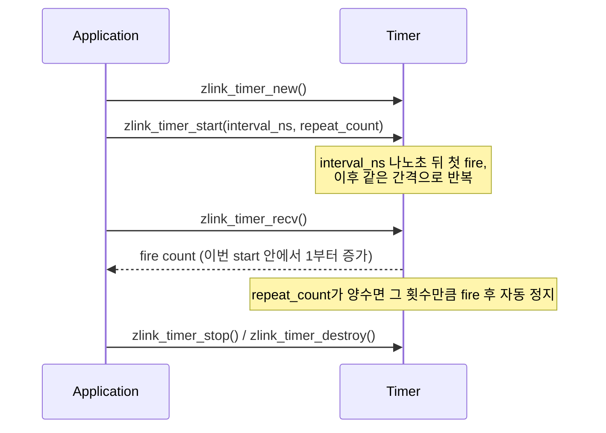

[English](https://zlink-systems.github.io/zlink/spec/core/07-utilities/) | 한국어

<!-- zlink-nav:start -->
[Core 스펙 목차](README.ko.md) | [이전: Monitoring](06-monitoring.ko.md) | [다음: Runtime Boundary](08-runtime-boundary.ko.md)
<!-- zlink-nav:end -->

# Utilities

> **이 장이 정의하는 것** — atomic counter, timer, stopwatch, capability 감지, proxy와
> thread helper 등 개별 카테고리에 속하지 않는 utility API의 공개 계약.

## 1. Utilities 개요

zlink Core는 messaging 계약에 속하지 않는 공통 runtime 기능을 utility API로 제공한다.
공유 정수를 원자적으로 다루는 atomic counter, 나노초 정밀도 timer, 고해상도 clock인
stopwatch, library build가 어떤 기능을 포함하는지 확인하는 capability 감지, 두 raw
[socket](glossary.ko.md#socket) 사이에서 message를 전달하는 proxy, 그리고 sleep과 thread
helper가 여기에 속한다.

이 문서는 이 utility들의 공개 계약을 정의한다. 대상 독자는 각 utility의 lifecycle,
thread 안전성과 callback ownership을 C API와 각 언어 binding으로 옮기는 개발자다. 이
문서는 "공통 runtime 기능을 사용할 때 각 핸들과 callback의 수명, 동시 호출 범위와
반환값을 어떻게 해석하는가?"에 답한다.

관련 계약의 소유 문서는 다음과 같다.

| 관련 계약 | 정의하는 문서 |
|---|---|
| timer를 poller에 등록하는 `zlink_poller_add_timer` | [Poll과 poller](05-polling.ko.md) |
| raw socket 생성·송수신 계약 (proxy가 중계하는 대상) | [Socket 공통](socket/README.ko.md) |
| context 수명과 종료 | [Context](01-context.ko.md) |

## 2. Atomic counter

Atomic counter는 여러 thread가 공유하는 정수 하나에 대한 원자적 증가, 감소, 읽기 작업을
제공한다. counter는 `zlink_atomic_counter_new`로 생성하고 `zlink_atomic_counter_destroy`로
파괴해야 한다.

### zlink_atomic_counter_new

0으로 초기화된 새 atomic counter를 생성한다.

```c
ZLINK_EXPORT void *zlink_atomic_counter_new (void);
```

초기값이 0인 atomic counter에 대한 불투명 핸들을 할당하고 반환한다.

**반환값:** 성공 시 counter 핸들. 메모리 할당에 실패하면 `NULL`을 반환하지 않고 process를
abort한다.

**스레드 안전성:** 모든 스레드에서 호출할 수 있다.

**참고:** `zlink_atomic_counter_set`, `zlink_atomic_counter_destroy`

---

### zlink_atomic_counter_set

counter를 명시적 값으로 설정한다.

```c
ZLINK_EXPORT void zlink_atomic_counter_set (void *counter_, int value_);
```

현재 counter 값을 `value_`로 교체한다.

**스레드 안전성:** thread-safe하지 않다. 같은 counter에 대한 다른 작업과 동시에 호출하면
안 된다. 보통 초기 설정 시에만 사용한다.

**참고:** `zlink_atomic_counter_value`

---

### zlink_atomic_counter_inc

counter를 1 증가시킨다.

```c
ZLINK_EXPORT int zlink_atomic_counter_inc (void *counter_);
```

counter를 원자적으로 증가시키고 이전 값(증가 직전의 값)을 반환한다.

**반환값:** 증가 전 counter 값.

**스레드 안전성:** 모든 스레드에서 호출할 수 있다.

**참고:** `zlink_atomic_counter_dec`

---

### zlink_atomic_counter_dec

counter를 1 감소시킨다.

```c
ZLINK_EXPORT int zlink_atomic_counter_dec (void *counter_);
```

counter를 원자적으로 감소시키고, 감소 후에도 0보다 크면 `1`을, 0에 도달하면 `0`을
반환한다.

**반환값:** 감소 후 counter가 아직 0이 아니면 `1`, 0에 도달했으면 `0`.

**스레드 안전성:** 모든 스레드에서 호출할 수 있다.

**참고:** `zlink_atomic_counter_inc`

---

### zlink_atomic_counter_value

현재 counter 값을 반환한다.

```c
ZLINK_EXPORT int zlink_atomic_counter_value (void *counter_);
```

counter의 현재 값을 원자적으로 읽는다.

**반환값:** 현재 counter 값.

**스레드 안전성:** 모든 스레드에서 호출할 수 있다.

**참고:** `zlink_atomic_counter_set`

---

### zlink_atomic_counter_destroy

counter를 파괴하고 메모리를 해제한다.

```c
ZLINK_EXPORT void zlink_atomic_counter_destroy (void **counter_p_);
```

counter 핸들을 해제한다. 파괴 후 `*counter_p_`의 pointer는 `NULL`로 설정된다.

**스레드 안전성:** 다른 thread가 같은 counter에서 작업 중일 때 호출하면 안 된다.

**참고:** `zlink_atomic_counter_new`

## 3. Timer

Timer는 나노초 정밀도의 주기적 또는 일회성 generic timer를 제공한다. `zlink_timer_new`로
독립 실행형 timer를 생성한다. timer가 fire하는 event는 `zlink_timer_recv`로 수신하고,
`zlink_poller_add_timer`로 poller에 통합할 수도 있다 — poller 통합 계약은
[Poll과 poller](05-polling.ko.md)가 소유한다.



---

### zlink_timer_new

독립 실행형 timer를 생성한다.

```c
ZLINK_EXPORT void *zlink_timer_new (void);
```

불투명 timer 핸들을 할당해 반환한다. 더 이상 필요하지 않으면 `zlink_timer_destroy`로
파괴해야 한다.

**반환값:** 성공 시 timer 핸들, 실패 시 `NULL`. 실패하면 errno를 설정한다.

**스레드 안전성:** 모든 스레드에서 호출할 수 있다.

**참고:** `zlink_timer_destroy`

---

### zlink_timer_destroy

timer를 파괴하고 자원을 해제한다.

```c
ZLINK_EXPORT zlink_close_result_t zlink_timer_destroy (void **timer_p_);
```

실행 중인 timer를 정지하고 핸들을 해제한다. 파괴한 뒤 `*timer_p_`는 `NULL`로 설정된다.

**반환값:** 성공 시 `ZLINK_CLOSE_OK`, 실패 시 `zlink_close_result_t` 값. `zlink_errno()`는
진단용 내부 errno를 그대로 유지한다.

**스레드 안전성:** 다른 thread가 같은 timer를 사용하는 동안 호출하면 안 된다.

**참고:** `zlink_timer_new`

---

### zlink_timer_start

timer를 시작한다.

```c
ZLINK_EXPORT zlink_config_result_t zlink_timer_start (void *timer_,
                                         uint64_t interval_ns_,
                                         uint64_t repeat_count_);
```

`interval_ns_` 나노초 뒤 첫 event를 발생시키도록 timer를 시작한다. `interval_ns_`는
event 사이의 간격(나노초)이며 `0`일 수 없다. `repeat_count_`가 `0`이면 명시적으로
정지할 때까지 반복하고, 양수이면 해당 횟수만큼 event를 발생시킨 뒤 자동으로 정지한다.
성공한 start 실행마다 fire 횟수를 초기화하므로 첫 fire는 `1`이고 이후 `2`, `3` 순서로
증가한다.

**반환값:** 성공 시 `ZLINK_CONFIG_OK`, 실패 시 `zlink_config_result_t` 값. `zlink_errno()`는
진단용 내부 errno를 그대로 유지한다.

**에러:** `interval_ns_ == 0`이면 `ZLINK_CONFIG_INVALID_ARGUMENT`이며 내부 errno는
`EINVAL`이다.

**스레드 안전성:** 같은 timer의 다른 작업과 동시에 호출하면 안 된다.

**참고:** `zlink_timer_stop`

---

### zlink_timer_stop

실행 중인 timer를 정지한다.

```c
ZLINK_EXPORT zlink_config_result_t zlink_timer_stop (void *timer_);
```

timer를 정지한다. 다시 시작할 때까지 새 fire event를 생성하지 않는다.

**반환값:** 성공 시 `ZLINK_CONFIG_OK`, 실패 시 `zlink_config_result_t` 값. `zlink_errno()`는
진단용 내부 errno를 그대로 유지한다.

**스레드 안전성:** 같은 timer의 다른 작업과 동시에 호출하면 안 된다.

**참고:** `zlink_timer_start`

---

### zlink_timer_recv

timer fire를 동기적으로 수신한다.

```c
ZLINK_EXPORT zlink_recv_result_t zlink_timer_recv (void *timer_, uint64_t *fire_count_out_);
```

recv 모드에서 다음 timer fire를 기다린다. 성공하면 `*fire_count_out_`에 가장 최근 start
실행 안에서 1부터 증가하는 fire 횟수가 설정된다.

**반환값:** 성공 시 `ZLINK_RECV_OK`, 실패 시 `zlink_recv_result_t` 값. `zlink_errno()`는
진단용 내부 errno를 그대로 유지한다.

**에러:** timer가 이미 멈췄고 더 읽을 fire가 없으면 `ZLINK_RECV_NO_DATA` (내부 `EAGAIN`).

**스레드 안전성:** 같은 timer의 다른 작업과 동시에 호출하면 안 된다.

**참고:** `zlink_timer_start`

## 4. Stopwatch

Stopwatch는 benchmarking과 profiling을 위한 고해상도 timing 함수다. stopwatch를
시작하고, 중간 측정값을 읽고, 중지하여 마이크로초 단위의 총 경과 시간을 얻는다.

### zlink_stopwatch_start

고해상도 stopwatch를 시작한다.

```c
ZLINK_EXPORT void *zlink_stopwatch_start (void);
```

현재 시간을 캡처하고 경과 시간을 측정하는 데 사용되는 불투명 핸들을 반환한다. 핸들은
최종적으로 `zlink_stopwatch_stop`으로 해제해야 한다.

**반환값:** 성공 시 불투명 stopwatch 핸들. 메모리 할당에 실패하면 `NULL`을 반환하지
않고 process를 abort한다.

**스레드 안전성:** 모든 스레드에서 호출할 수 있다. 반환된 핸들은 한 번에 하나의
thread에서만 사용해야 한다.

**참고:** `zlink_stopwatch_intermediate`, `zlink_stopwatch_stop`

---

### zlink_stopwatch_intermediate

stopwatch를 중지하지 않고 경과 마이크로초를 반환한다.

```c
ZLINK_EXPORT unsigned long zlink_stopwatch_intermediate (void *watch_);
```

핸들을 해제하지 않고 `zlink_stopwatch_start`가 호출된 이후의 경과 시간을 읽는다.
연속적인 측정을 위해 여러 번 호출할 수 있다.

**반환값:** 마이크로초 단위의 경과 시간.

**스레드 안전성:** 동일한 핸들에서 `zlink_stopwatch_stop`과 동시에 호출하면 안 된다.

**참고:** `zlink_stopwatch_start`, `zlink_stopwatch_stop`

---

### zlink_stopwatch_stop

stopwatch를 중지하고 총 경과 마이크로초를 반환한다.

```c
ZLINK_EXPORT unsigned long zlink_stopwatch_stop (void *watch_);
```

`zlink_stopwatch_start`가 호출된 이후의 총 경과 시간을 반환하고 stopwatch 핸들을
해제한다. 이 호출 이후 핸들을 사용하면 안 된다.

**반환값:** 마이크로초 단위의 경과 시간.

**스레드 안전성:** 동일한 핸들에서 다른 작업과 동시에 호출하면 안 된다.

**참고:** `zlink_stopwatch_start`, `zlink_stopwatch_intermediate`

## 5. Capability 감지

library를 build할 때 어떤 기능을 포함했는지는 실행 시점에 `zlink_has`로 확인한다.

### zlink_has

현재 library build가 capability를 제공하는지 확인한다.

```c
ZLINK_EXPORT bool zlink_has (const char *capability_);
```

`capability_`는 NUL로 끝나는 non-NULL 문자열이며 함수는 이 문자열을 보관하지 않는다.
`"tcp"`는 항상 `true`다. `"ipc"`, `"tls"`, `"ws"`, `"wss"`는 해당 기능을 포함해 build한
경우에만 `true`다. 다른 문자열은 `false`다.

**스레드 안전성:** 전역 상태를 바꾸지 않으며 모든 스레드에서 호출할 수 있다.

## 6. Proxy

Proxy는 두 raw socket 사이에서 multipart message를 양방향으로 전달하는 blocking
helper다. raw socket의 생성과 송수신 계약은 [Socket 공통](socket/README.ko.md)이
소유한다.

### zlink_proxy

두 raw socket 사이에서 multipart message를 양방향 전달한다.

```c
ZLINK_EXPORT zlink_config_result_t zlink_proxy (void *frontend_, void *backend_, void *capture_);
```

`frontend_`와 `backend_`는 필수 raw socket 핸들이다. `capture_`는 `NULL`일 수 있으며,
non-NULL이면 전달한 각 message의 사본을 받는 raw socket 핸들이다. 함수는 실행 중인
proxy loop가 끝날 때까지 호출 thread를 block한다.

세 핸들은 모두 borrowed다. 함수는 핸들을 닫거나 소유하지 않는다. message frame은
proxy가 수신해 상대 socket으로 전달하며 application에 frame pointer를 반환하지 않는다.

Proxy는 application lane의 raw multipart만 중계한다. 수신 message가 내부 ZMP request-reply
kind와 sequence를 갖고 있어도 상대 socket과 `capture_`로 보내기 전에 이를 제거한다. 따라서
양쪽은 같은 application part 수, 순서와 byte를 받지만, 다시 wire로 내보낸 frame의 kind는
ordinary data다.

Request correlation과 reply target state는 proxy가 연결하지 않는다. Request를 proxy 너머에서
투명하게 완료하는 기능은 이 API의 계약이 아니며, proxy가 request-reply
metadata를 새로 만들거나 completion callback을 중계하지 않는다.

**반환값:** proxy가 정상적으로 끝나면 `ZLINK_CONFIG_OK`, 그렇지 않으면
`zlink_config_result_t` 오류. 필수 핸들이 `NULL`이거나 raw socket이 아니면
`ZLINK_CONFIG_INVALID_HANDLE`이다.

## 7. Sleep과 thread

플랫폼별 API를 감싼 이식 가능한 sleep 함수와 OS thread helper다.

### zlink_thread_fn

```c
typedef void (zlink_thread_fn) (void *);
```

`zlink_thread_start`로 시작되는 thread의 진입점 signature다.

---

### zlink_sleep

지정된 초 동안 일시 중지(sleep)한다.

```c
ZLINK_EXPORT void zlink_sleep (int seconds_);
```

호출 thread를 최소 `seconds_`초 동안 일시 중지한다. 플랫폼별 sleep 함수에 대한 이식
가능한 편의 wrapper다.

**스레드 안전성:** 모든 스레드에서 호출할 수 있다.

**참고:** `zlink_stopwatch_start`

---

### zlink_thread_start

지정된 함수를 실행하는 새 thread를 시작한다.

```c
ZLINK_EXPORT void *zlink_thread_start (zlink_thread_fn *func_, void *arg_);
```

`arg_`를 유일한 인수로 사용하여 `func_`를 실행하는 새 운영 체제 thread를 생성하고
시작한다. 반환된 핸들은 완료를 대기하고 자원을 해제하기 위해 `zlink_thread_join`에
전달해야 한다.

**반환값:** 성공 시 불투명 thread 핸들. 핸들 메모리 할당이나 운영체제 thread 생성에
실패하면 `NULL`을 반환하지 않고 process를 abort한다.

**스레드 안전성:** 모든 스레드에서 호출할 수 있다.

**참고:** `zlink_thread_join`

---

### zlink_thread_join

thread가 완료될 때까지 대기하고 핸들을 해제한다.

```c
ZLINK_EXPORT void zlink_thread_join (void *thread_);
```

`thread_`로 식별되는 thread가 종료될 때까지 호출 thread를 기다리게 한 다음 핸들을
해제한다. 이 호출 이후 핸들을 사용하면 안 된다.

**스레드 안전성:** 핸들당 정확히 한 번만 호출해야 한다. join 대상 thread에서 호출하면
안 된다.

**참고:** `zlink_thread_start`

## 8. 구현 및 contract test 검증 요구

공개 표면(utility 함수, 반환값·errno, callback 호출)만으로 다음을 확인한다. 각 항목은
unit test 하나로 이어진다.

**Atomic counter**
- `zlink_atomic_counter_new`로 만든 counter는 초기값이 0이다 — 생성 직후 `zlink_atomic_counter_value`가 `0`을 반환한다. 메모리 할당 실패를 주입하면 함수가 `NULL`을 반환하지 않고 process를 abort한다.
- `zlink_atomic_counter_set` 후 `zlink_atomic_counter_value`가 설정한 값을 반환한다.
- `zlink_atomic_counter_inc`는 증가 직전의 값을 반환한다.
- `zlink_atomic_counter_dec`는 감소 후에도 0보다 크면 `1`, 0에 도달하면 `0`을 반환한다.
- 여러 thread가 같은 counter에 동시에 inc·dec·value를 호출해도 안전하다 — 증가·감소는 원자적이므로 갱신이 유실되지 않는다.
- `zlink_atomic_counter_destroy` 후 `*counter_p_`가 `NULL`이다.

**Timer**
- `zlink_timer_new`는 성공 시 non-NULL 핸들을, 실패 시 `NULL`과 설정된 errno를 반환한다.
- `zlink_timer_start(timer, 0, repeat_count)`는 `ZLINK_CONFIG_INVALID_ARGUMENT`과 내부 `EINVAL`로 실패한다.
- `zlink_timer_start`에 양수 `repeat_count_`를 주면 그 횟수만큼 fire한 뒤 자동으로 정지하고, `0`이면 명시적으로 정지할 때까지 반복한다.
- `zlink_timer_recv`는 다음 fire를 기다렸다가 성공 시 `*fire_count_out_`에 현재 start 실행에서 1부터 증가하는 fire 횟수를 기록한다. stop 뒤 다시 start하면 첫 값은 다시 `1`이다. timer가 이미 멈췄고 읽을 fire가 없으면 `ZLINK_RECV_NO_DATA`(내부 `EAGAIN`)다.
- `zlink_timer_stop` 후 다시 시작할 때까지 새 fire event가 발생하지 않는다.
- `zlink_timer_destroy` 후 `*timer_p_`가 `NULL`이다.

**Stopwatch**
- `zlink_stopwatch_start`의 메모리 할당 실패를 주입하면 함수가 `NULL`을 반환하지 않고 process를 abort한다.
- `zlink_stopwatch_intermediate`는 핸들을 해제하지 않고 start 이후의 경과 마이크로초를 반환하며, 같은 핸들로 여러 번 호출할 수 있다.
- `zlink_stopwatch_stop`은 start 이후의 총 경과 마이크로초를 반환하고 핸들을 해제한다.

**Capability 감지**
- `zlink_has("tcp")`는 항상 `true`다.
- `"ipc"`, `"tls"`, `"ws"`, `"wss"`는 해당 기능을 포함해 build한 경우에만 `true`고, 그 밖의 문자열은 `false`다.

**Proxy**
- `zlink_proxy`에 필수 핸들이 `NULL`이거나 raw socket이 아니면 `ZLINK_CONFIG_INVALID_HANDLE`이다.
- non-NULL `capture_`를 주면 전달한 각 message의 사본이 capture socket에 도착한다.
- proxy는 loop가 끝날 때까지 호출 thread를 block하고, 정상적으로 끝나면 `ZLINK_CONFIG_OK`를 반환한다.
- 전달한 핸들은 borrowed다 — proxy가 끝난 뒤에도 caller가 핸들을 소유하며 함수가 닫지 않는다.
- Request, reply 또는 error reply kind의 raw fixture를 proxy에 보내면 상대 socket과 non-NULL capture socket은 같은 application multipart를 ordinary message로 받고, 이를 raw wire로 다시 보내면 kind가 data다.
- DEALER-ROUTER가 single connection을 사용해도 proxy는 request correlation과 reply target state를
  연결하지 않으므로 proxy 반대편의 reply가 원래 request completion을 자동으로 완료하지 않는다.

**Sleep과 thread**
- `zlink_sleep(n)`은 호출 thread를 최소 `n`초 동안 일시 중지한다.
- `zlink_thread_start`는 `arg_`를 유일한 인수로 `func_`를 실행하는 thread를 시작하고 성공 시 핸들을 반환한다. 핸들 메모리 할당이나 운영체제 thread 생성 실패를 주입하면 `NULL`을 반환하지 않고 process를 abort한다.
- `zlink_thread_join`은 대상 thread가 종료될 때까지 기다린 뒤 핸들을 해제하며, 핸들당 정확히 한 번만 호출한다.

**공통 반환 규약**
- result type(`zlink_close_result_t`·`zlink_config_result_t`·`zlink_recv_result_t`)을 반환하는 각 함수는 성공 시 해당 OK 값을, 실패 시 result 값을 반환하며 `zlink_errno()`는 진단용 내부 errno를 그대로 유지한다.

<!-- zlink-nav:start -->
[Core 스펙 목차](README.ko.md) | [이전: Monitoring](06-monitoring.ko.md) | [다음: Runtime Boundary](08-runtime-boundary.ko.md)
<!-- zlink-nav:end -->
