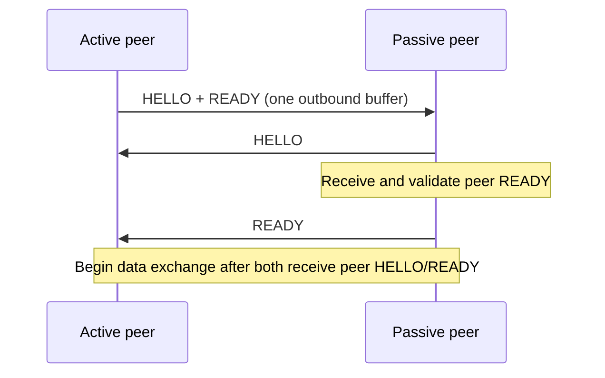
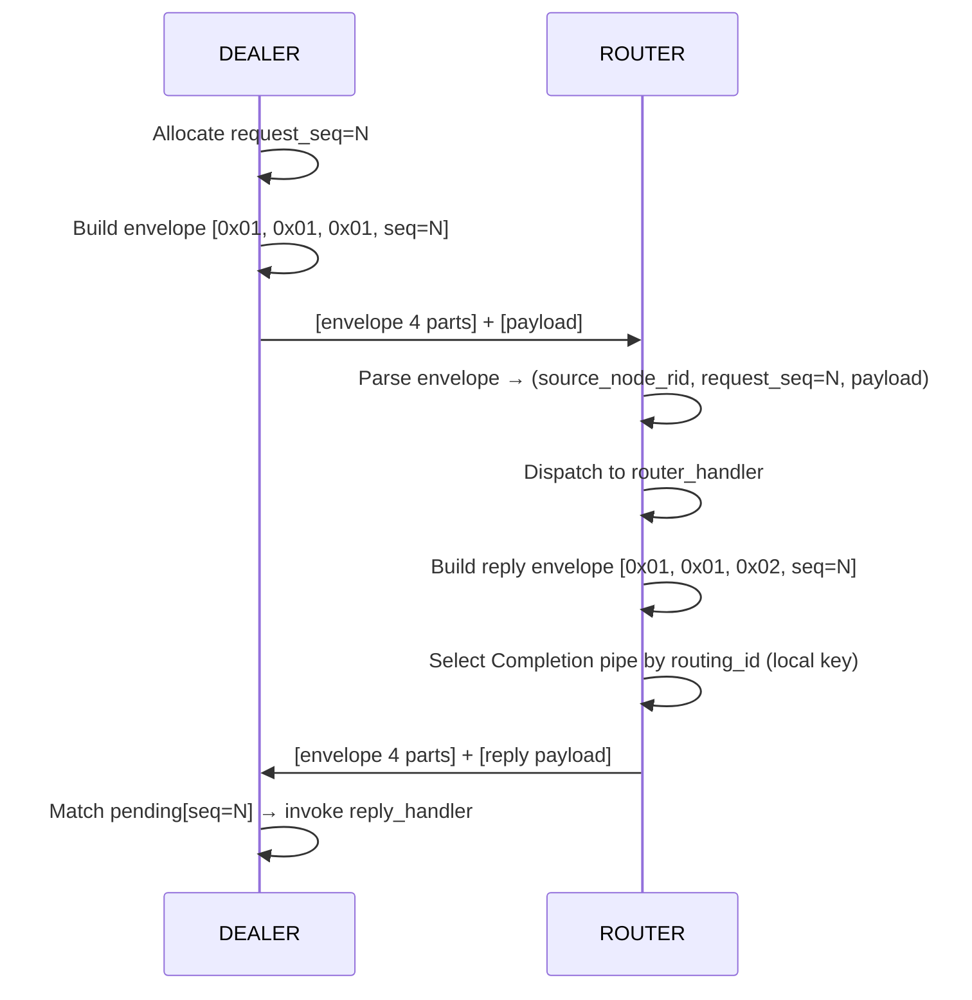

[한국어](https://zlink-systems.github.io/zlink/ko/spec/core/protocol/01-zmp/) | English

<!-- zlink-nav:start -->
[Protocol Index](README.en.md) | [Previous: Protocol Overview](README.en.md) | [Next: RAW (STREAM) Protocol Details](02-raw.en.md)
<!-- zlink-nav:end -->

# Protocol — ZMP v1.0

> **What this chapter defines** — the byte-level layout of the ZMP wire protocol and
> request-reply envelope, the handshake and decode-validation contracts, and the
> internal encode/decode implementation that produces those bytes. For an introduction,
> see the [ZMP protocol guide](../../../guide/zmp-protocol.en.md).

## 1. ZMP overview

ZMP (zlink Message Protocol) is zlink's wire protocol. It defines the layout of the bytes
that [sockets](../glossary.en.md#socket), which are endpoints that exchange messages, send
over a transport. One data unit transmitted on the wire is called a frame.

ZMP defines only the raw-socket handshake, request-reply, and connection control frames.
It does not include application service topology or stateful object protocols.

In this document, the byte layouts of frame headers, handshakes, and envelopes, along with
the decode-validation rules, are **contract descriptions** on which other implementations
rely for interoperability. The encode/decode paths that produce and interpret those bytes,
and pending management, are **implementation descriptions** collected in
[§9 Internal structure](#9-internal-structure).

Related documents are as follows.

| Related subject | Document |
|---|---|
| Introduction to the ZMP protocol and its use | [ZMP protocol guide](../../../guide/zmp-protocol.en.md) |
| RAW wire format for connections without ZMP framing | [RAW (STREAM) Protocol Details](02-raw.en.md) |
| Public contract for message lifecycle and multipart messages | [Message](../02-message.en.md) |

## 2. Basic direction

Request-reply is represented by ZMP multipart control parts, not by fields inside
`zlink_msg_t`. An internal control part prepended to the application payload is called a
control part. Therefore, the following approaches are not part of this protocol's model.

- message-level request marking
- per-message metadata envelope
- restoring internal fields after recv

Ordinary `zlink_send()` / `zlink_recv()` operations handle only payload parts. Dedicated
public request-reply APIs prepend control parts when sending, and a dedicated decode path
interprets them.

## 3. Common frame header

Every ZMP frame begins with the following 8-byte header.

### 3.1 Header layout

```text
 Byte:   0         1         2         3         4    5    6    7
      +---------+---------+---------+---------+---------------------+
      |  MAGIC  | VERSION |  FLAGS  |RESERVED |   PAYLOAD SIZE      |
      |  (0x5A) |  (0x01) |         | (0x00)  |   (32-bit BE)       |
      +---------+---------+---------+---------+---------------------+
```

| Field | Offset | Size | Description |
|------|--------|------|------|
| MAGIC | 0 | 1 | `0x5A` |
| VERSION | 1 | 1 | `0x01` |
| FLAGS | 2 | 1 | Frame flag |
| RESERVED | 3 | 1 | `0x00` |
| PAYLOAD SIZE | 4-7 | 4 | Big Endian |

### 3.2 FLAGS bits

| Bit | Name | Value | Description |
|------|------|-----|------|
| 0 | MORE | `0x01` | Multipart continuation |
| 1 | CONTROL | `0x02` | Control part |
| 2 | IDENTITY | `0x04` | Routing-ID-related frame |
| 3 | SUBSCRIBE | `0x08` | Subscription request |
| 4 | CANCEL | `0x10` | Subscription cancellation |

The group of control parts that carries the request type and unique request number is
called the request-reply envelope ([§5](#5-request-reply-envelope)). The parts in this
envelope are not ZMP `CONTROL` frames. They are transmitted as ordinary multipart data
frames (with the `MORE` flag) prepended to the application payload. The ZMP `CONTROL` bit
is used only for protocol control frames such as HELLO and READY.

The receiving decoder rejects a frame with `EPROTO` if `RESERVED` is not `0x00` or any of
FLAGS bits 5–7 are set. The following FLAGS combinations also produce `EPROTO`.

- `CONTROL | IDENTITY`
- `CONTROL | MORE`
- `SUBSCRIBE | CANCEL`
- `SUBSCRIBE` or `CANCEL` combined with any other flag

## 4. Handshake

When a connection is established, the active side sends HELLO and READY in one outbound
buffer. The passive side of a paired DEALER·ROUTER transport first sends only HELLO, then
sends its own READY after receiving the peer's READY. Both sides begin exchanging data
after receiving the peer's HELLO and READY.



**HELLO frame**: consists, in order, of the control type (1 byte), socket type (1 byte),
routing ID length (1 byte), and routing ID (0–255 bytes). The routing ID is a byte sequence
that identifies a transport peer.

**READY frame**: the READY control type byte `0x04` is always sent. When metadata is used,
properties follow it consecutively, with each property laid out as follows.

```text
[name length:u8][name bytes][value length:u32 BE][value bytes]
```

Enabling `ZLINK_OPT_ZMP_METADATA` adds `Socket-Type` and, only when the socket type is DEALER
or ROUTER, also adds `Routing-Id`. A READY that uses metadata always includes
`Zlink-Max-Message-Size`, whose value is an 8-byte unsigned 64-bit big-endian integer. This
option is disabled by default. However, a paired DEALER·ROUTER transport always adds metadata
and the pair properties from [§4.1](#41-request-reply-transport-pair), regardless of this
option.

**ERROR frame**: the ERROR control type is `0x05`. Its body has the following byte order.

```text
[type:0x05][error code:u8][reason length:u8][reason bytes]
```

### 4.1 Request-reply transport pair

One logical DEALER/ROUTER peer that uses request-reply has two physical transport
connections.

| Lane | Traffic carried |
|---|---|
| Application | Ordinary application messages and requests |
| Completion | Replies that complete requests already sent |

The READY frame on each connection contains `Zlink-Pair-Id`, `Zlink-Pair-Generation`, and
`Zlink-Lane`. Pair ID and generation are unsigned 64-bit big-endian values. Lane is one byte:
Application is `0`, and Completion is `1`. All three properties must be present together.
The pair ID, generation, and peer routing identity must all match across the two connections.

Application writes wait until both lanes have completed validation. Data received from an
earlier generation is not attached to the new pair. A protocol error, identity mismatch,
fence timeout, or terminal failure on one lane terminates the entire pair. Reconnect creates
a new generation, revalidates both lanes, and then resumes Application writes.

FIFO ordering is guaranteed only within each lane. No ordering is guaranteed between the
two lanes. Completion replies can be processed even when Application ingress is stopped by
[backpressure](../glossary.en.md#backpressure), which limits additional submissions when
receive processing falls behind. Relocation, session binding, and other higher-level
protocols must use their own generation fences instead of relying on ordering between the
two connections.

## 5. Request-reply envelope

Request-reply prepends four control parts to the payload.

```text
[request-reply protocol id]
[request-reply version]
[message type]
[request seq]
[payload part 0]
[payload part 1]
...
```

Field values:

- protocol id: `0x01`
- version: `0x01`
- message type:
  - `0x01` = request
  - `0x02` = reply
  - `0x03` = error reply
- request seq: 8-byte Big Endian `uint64`

Key rules:

- `request_seq = 0` is invalid.
- A reply sends back the `request_seq` received in the request without modification.
- An `error reply` places a 4-byte Big Endian errno in the first payload part.
- The ordinary payload consists of all remaining parts after the control parts.

### 5.1 Request-reply sequence (DEALER → ROUTER)



In this diagram, the part layout visible on the wire is the contract defined by the envelope
rules above. `routing_id` is not a reply wire part; it is a local selection key that the ROUTER
uses to choose the destination Completion pipe. Pending matching and handler dispatch are
implementation descriptions in [§9 Internal structure](#9-internal-structure).

## 6. Relationship to transport routing_id

The transport `routing_id` and the request-reply address are not the same value.

- transport `routing_id`: a ROUTER-local key that selects the currently connected peer and
  is not included in the reply wire
- `request_seq`: an identifier that correlates a request with its reply

Mixing the two results in incorrect reply-address computation. Both the documentation and
implementation must describe them as separate layers.

## 7. Decode validation

The decode path checks at least the following.

- The number of control parts is sufficient.
- The protocol id and version match.
- `request_seq != 0`.
- The message type is a known value.

A message that fails these checks is not treated as a request-reply message. It also does
not complete a pending response entry.

## 8. WebSocket framing

- RFC 6455 binary frames (opcode `0x02`) are used.
- The payload contains a ZMP frame.

## 9. Internal structure

> **Contract ownership for this section** — [§3](#3-common-frame-header) through
> [§8](#8-websocket-framing) own the byte layouts and decode validation on which
> interoperability relies. [§10 Verification requirements](#10-implementation-and-contract-test-verification-requirements)
> owns observable completion behavior. This section describes the current implementation
> that produces and interprets those bytes.

### Encode / decode flow (socket request-reply)

Send:

1. Determine whether the operation is a request or a reply.
2. Allocate `request_seq` from the local counter.
3. Build the four control parts.
4. Append and send the user payload parts.

Receive:

1. Verify that the first four parts form a request-reply envelope.
2. Read `message_type` and `request_seq`.
3. If it is a request, pass it to the request handler.
4. Look up a reply received on the Completion lane in the pending map by `request_seq` or
   `source_node_rid + request_seq`.

The reply payload moves directly from the Completion pipe to the registered callback. It is
not retained in a hidden PAIR receive queue or a second completion payload deque. Only a
small payloadless callback metadata queue is maintained for terminal callbacks such as
timeout and shutdown. This queue is not a transport lane or a wire record.

### Pending ownership and keys

Ownership of pending response entries resides in the upper API layer. The current
implementation uses the following pending keys.

- `DEALER` pending key: `request_seq`
- `ROUTER` pending key: `source_node_rid + request_seq`

[§10 Verification requirements](#10-implementation-and-contract-test-verification-requirements)
owns the completion rules: completion by the first reply, timeout, ignoring duplicate
replies, and delivery of error replies.

### WebSocket implementation

The WebSocket framing implementation uses the Beast library.

## 10. Implementation and contract-test verification requirements

Interoperability with another implementation is verified by observing bytes on the wire,
and request-reply completion is verified through callback results from the public API. Each
item maps to one test.

**Frame header and flags**

- Every transmitted ZMP frame follows the layout in [§3.1](#31-header-layout) on the wire:
  MAGIC `0x5A`, VERSION `0x01`, RESERVED `0x00`, and a 32-bit Big Endian payload size.
- When receiving `RESERVED != 0`, FLAGS bits 5–7, `CONTROL | IDENTITY`, `CONTROL | MORE`,
  `SUBSCRIBE | CANCEL`, or a combination of SUBSCRIBE/CANCEL with any other flag, the
  decoder rejects the frame with `EPROTO`.
- Request-reply envelope parts appear on the wire as ordinary multipart data frames (with
  the `MORE` flag), not as `CONTROL` frames.

**Handshake**

- The active side sends HELLO and READY in one outbound buffer. The passive side of a paired
  DEALER·ROUTER transport first sends HELLO, then sends its own READY after receiving the
  peer's READY.
- Each metadata property after READY control type `0x04` follows the layout
  `[name length:u8][name bytes][value length:u32 BE][value bytes]`.
- When `ZLINK_OPT_ZMP_METADATA` has its default value (disabled), there are no metadata
  properties. Enabling it adds `Socket-Type` and the 8-byte big-endian
  `Zlink-Max-Message-Size`. `Routing-Id` is added only to DEALER·ROUTER READY frames.
- A paired DEALER·ROUTER transport's READY always contains `Socket-Type` and `Routing-Id`
  metadata and the pair properties, regardless of this option.
- The ERROR control type is `0x05`, and its body follows the layout
  `[type][error code:u8][reason length:u8][reason bytes]`.

**Transport pair**

- The three properties `Zlink-Pair-Id` (unsigned 64-bit big-endian),
  `Zlink-Pair-Generation` (unsigned 64-bit big-endian), and `Zlink-Lane` (1 byte,
  Application `0` / Completion `1`) always appear together in both connections' READY
  frames.
- Application writes are delivered after both lanes complete validation.
- Data received from an earlier generation is not attached to the new pair.
- A protocol error, identity mismatch, fence timeout, or terminal failure on one lane
  terminates the entire pair.
- Reconnect creates a new generation, revalidates both lanes, and then resumes Application
  writes.
- FIFO ordering is observed only within each lane; no ordering is guaranteed between lanes.
- Completion replies are processed even while Application ingress is stopped by
  backpressure.

**Envelope and decode validation**

- Sending a request produces, before the payload, the four control parts laid out in
  [§5](#5-request-reply-envelope): protocol id `0x01`, version `0x01`, message type
  (`0x01` request / `0x02` reply / `0x03` error reply), and an 8-byte Big Endian
  `request_seq`.
- A reply's `request_seq` is the same value received in the request.
- The `routing_id` that the ROUTER uses to select the reply destination is a local selection
  key, not a reply wire part.
- The first payload part of an `error reply` is a 4-byte Big Endian errno.
- A message with too few control parts, a mismatched protocol id or version,
  `request_seq == 0`, or an unknown message type is not treated as a request-reply message
  and does not cause pending completion.

**Completion**

- The first reply completes the high-level request.
- Additional replies with the same key after completion do not invoke the callback again.
- If timeout occurs before a reply, the pending entry is removed and the callback receives
  `ETIMEDOUT`.
- An `error reply` is delivered as a completion with `errno != 0` instead of as a payload.

**WebSocket**

- A ZMP frame on a WebSocket connection appears as the payload of an RFC 6455 binary frame
  (opcode `0x02`).
