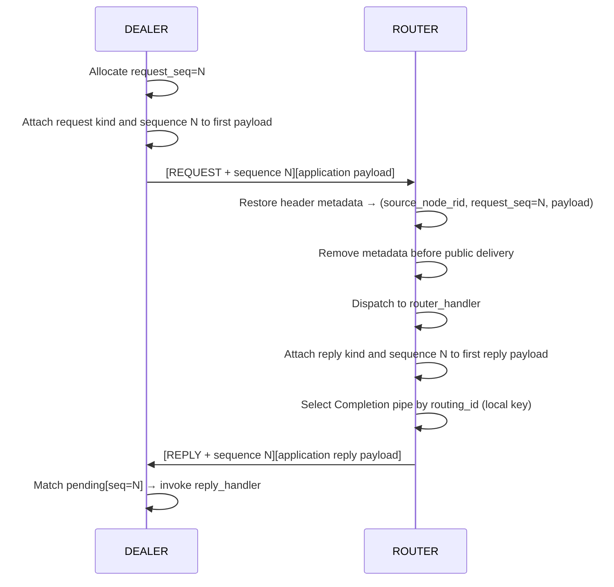

[한국어](https://zlink-systems.github.io/zlink/ko/spec/core/protocol/01-zmp/) | English

<!-- zlink-nav:start -->
[Protocol Index](README.en.md) | [Previous: Protocol Overview](README.en.md) | [Next: RAW (STREAM) Protocol Details](02-raw.en.md)
<!-- zlink-nav:end -->

# Protocol — ZMP v1.0

> **What this chapter defines** — the byte-level layout of the ZMP wire protocol and
> request-reply header metadata, the handshake and decode-validation contracts, and the
> internal encode/decode implementation that produces those bytes. For an introduction,
> see the [ZMP protocol guide](../../../guide/zmp-protocol.en.md).

## 1. ZMP overview

ZMP (zlink Message Protocol) is zlink's wire protocol. It defines the layout of the bytes
that [sockets](../glossary.en.md#socket), which are endpoints that exchange messages, send
over a transport. One data unit transmitted on the wire is called a frame.

ZMP defines only the raw-socket handshake, request-reply, and connection control frames.
It does not include application service topology or stateful object protocols.

In this document, the byte layouts of frame headers, handshakes, and request-reply metadata, along with
the decode-validation rules, are **contract descriptions** on which other implementations
rely for interoperability. The encode/decode paths that produce and interpret those bytes,
and pending management, are **implementation descriptions** collected in
[§9 Internal structure](#9-internal-structure).

Related documents are as follows.

| Related subject | Document |
|---|---|
| Introduction to the ZMP protocol and its use | [ZMP protocol guide](../../../guide/zmp-protocol.en.md) |
| RAW wire format for connections without ZMP framing | [RAW (STREAM) Protocol Details](02-raw.en.md) |
| Public contract for message lifecycle and multipart messages | [Message](../02-message.en.md) |

## 2. Basic direction

Request-reply information is recorded in the ZMP header of the first application data
frame. The kind that distinguishes requests, replies, and error replies, together with a
nonzero request sequence, belongs to the transport protocol rather than to the application
payload. Passing the same multipart to ordinary send and request therefore produces the
same application-visible part count, order, and bytes at the receiver.

A dedicated request or reply API attaches internal metadata to the first application
message that Core consumes. The encoder moves it into the wire header, and the decoder
restores it as an internal message value. After the socket runtime finds the request target
or pending completion, it removes the metadata before returning payload to a public receive
operation or callback.

- **No public message API creates or reads a request-reply kind or sequence.** Applications
  pass only payload to request and reply APIs, and raw send always produces ordinary data.
- **No protocol part is prepended to application payload.** Payload that resembles a
  protocol id, version, message type, or sequence remains application data.
- **A `VERSION == 0x01` peer recognizes only the header layout in this document as the
  request-reply contract.** Four payload parts shaped like a protocol id, version, message
  type, and sequence remain ordinary data rather than request-reply metadata.

## 3. Common frame header

Every ZMP frame begins with the following 8-byte header.

### 3.1 Header layout

```text
 Byte:   0         1         2         3         4    5    6    7
      +---------+---------+---------+---------+---------------------+
      |  MAGIC  | VERSION |  FLAGS  |  KIND   |   PAYLOAD SIZE      |
      |  (0x5A) |  (0x01) |         |         |   (32-bit BE)       |
      +---------+---------+---------+---------+---------------------+
```

| Field | Offset | Size | Description |
|------|--------|------|------|
| MAGIC | 0 | 1 | `0x5A` |
| VERSION | 1 | 1 | `0x01` |
| FLAGS | 2 | 1 | Frame flag |
| KIND | 3 | 1 | `0x00` data, `0x01` request, `0x02` reply, `0x03` error reply |
| PAYLOAD SIZE | 4-7 | 4 | Application payload size excluding the sequence extension, Big Endian |

An ordinary data frame places its payload immediately after this 8-byte header. The first
frame with a request-reply kind appends an 8-byte unsigned Big Endian request sequence to
form a 16-byte header.

```text
 Byte:   0         1         2         3         4    5    6    7
      +---------+---------+---------+---------+---------------------+
      |  MAGIC  | VERSION |  FLAGS  |  KIND   |   PAYLOAD SIZE      |
      +---------+---------+---------+---------+---------------------+
      |                 REQUEST SEQUENCE (64-bit BE)                |
      +-------------------------------------------------------------+
      |                    APPLICATION PAYLOAD ...                  |
      +-------------------------------------------------------------+
```

The sequence extension exists only when `KIND` is request, reply, or error reply. `PAYLOAD
SIZE` and message-size limits exclude the extension.

### 3.2 FLAGS bits

| Bit | Name | Value | Description |
|------|------|-----|------|
| 0 | MORE | `0x01` | Multipart continuation |
| 1 | CONTROL | `0x02` | Control part |
| 2 | IDENTITY | `0x04` | Routing-ID-related frame |
| 3 | SUBSCRIBE | `0x08` | Subscription request |
| 4 | CANCEL | `0x10` | Subscription cancellation |

The ZMP `CONTROL` bit is used only for protocol control frames such as HELLO and READY. A
request-reply kind cannot be combined with `CONTROL`, `IDENTITY`, `SUBSCRIBE`, or `CANCEL`.

The receiving decoder rejects a frame with `EPROTO` if any of FLAGS bits 5–7 are set. The
following FLAGS combinations also produce `EPROTO`.

- `CONTROL | IDENTITY`
- `CONTROL | MORE`
- `SUBSCRIBE | CANCEL`
- `SUBSCRIBE` or `CANCEL` combined with any other flag

## 4. Handshake

When a connection is established, the active side sends HELLO and READY in one outbound
buffer on a stream transport. On WS and WSS, which preserve message boundaries, each frame
occupies its own binary message. The passive side of a paired DEALER·ROUTER transport first
sends only HELLO, then sends its own READY after receiving the peer's READY. The passive side
publishes local connection readiness and pair admission only after the transport write of that
READY completes successfully. A failed READY write fails the handshake without publishing
readiness. The active side begins exchanging data only after receiving the passive READY.

```mermaid
sequenceDiagram
    participant A as Active peer
    participant P as Passive peer

    A->>P: HELLO + READY (one stream buffer; two WS/WSS messages)
    P->>A: HELLO
    Note over P: Receive and validate peer READY
    P->>A: READY
    Note over P: Publish local readiness after READY write completes
    Note over A: Begin data exchange after validating passive READY
```

**HELLO frame**: consists, in order, of the control type (1 byte), socket type (1 byte),
routing ID length (1 byte), and routing ID (0–255 bytes). The routing ID is a byte sequence
that identifies a transport peer.

**READY frame**: the READY control type byte `0x04` is always sent. When metadata is used,
properties follow it consecutively, with each property laid out as follows.

```text
[name length:u8][name bytes][value length:u32 BE][value bytes]
```

Enabling `ZLINK_OPT_ZMP_METADATA` adds `Socket-Type` and, only when the socket type is DEALER
or ROUTER, also adds `Routing-Id`. A READY that uses metadata always includes
`Zlink-Max-Message-Size`, whose value is an 8-byte unsigned 64-bit big-endian integer. A value of
`0` means that no positive Application maximum is configured. This
option is disabled by default. However, a paired DEALER·ROUTER transport always adds metadata
and the pair properties from [§4.1](#41-request-reply-transport-pair), regardless of this
option.

**ERROR frame**: the ERROR control type is `0x05`. Its body has the following byte order.

```text
[type:0x05][error code:u8][reason length:u8][reason bytes]
```

### 4.1 Request-reply transport pair

One logical DEALER/ROUTER peer that uses request-reply has two physical transport
connections.

| Lane | Traffic carried |
|---|---|
| Application | Ordinary application messages and requests |
| Completion | Replies that complete requests already sent and receive-flow control |

The READY frame on each connection contains `Zlink-Pair-Id`, `Zlink-Pair-Generation`, and
`Zlink-Lane`. Pair ID and generation are unsigned 64-bit big-endian values. Lane is one byte:
Application is `0`, and Completion is `1`. All three properties must be present together.
The pair ID, generation, and peer routing identity must all match across the two connections.

The `Routing-Id` in READY is metadata used to verify that both connections belong to the same
peer. The runtime exposes the synthetic routing-ID preamble used by a ROUTER to select that peer
only on the Application lane. The Completion lane carries neither this preamble nor ordinary
`data` records. If the Completion lane carries a record after READY, the first record must be a
reply, error reply, or receive-flow control record.

Peer-weight advertisements control only peer selection on the Application lane. A network
transport sends an absolute value in `0..10000` as a ZMP `WEIGHT` command on the Application
connection. Inproc delivers the same value as Core control to the owner thread of the peer's
Application pipe. Core consumes both paths, so neither appears as application data on a public
receive or creates a record on the Completion lane.

A network `WEIGHT` command uses the `CONTROL` flag and `KIND == 0x00` in the 8-byte base header,
with a payload size of 10. Its payload has the following byte order and carries neither multipart
`MORE` nor a request sequence.

```text
[ASCII "WEIGHT":6][weight:u32 BE]
```

Application size limits do not apply to this CONTROL body. The receiving runtime first applies the
independent CONTROL limit in [§7](#7-decode-validation), then validates the WEIGHT type.

A body identified as `WEIGHT` but not exactly 10 bytes, or carrying a value above `10000`, is
consumed and ignored. It does not terminate the connection, change scheduler state, emit
`PEER_WEIGHT_CHANGED`, or appear on public receive.

Forbidden flag combinations and a CONTROL body above the independent limit remain structural
protocol errors.

A weight configured before bind or connect is synchronized with the peer scheduler only after the
paired Application pipe is ready. A dynamic change also applies the new absolute value, including
`0`, in both directions. If the value equals the last value advertised for the pair, Core does not
create another command. After reconnect, the Application pipe of the new paired generation
re-advertises the current configured value when it becomes pair-ready.

A network `WEIGHT` command may bypass application HWM and remote PAUSE. It does not bypass the
pair-ready hold or the atomic boundary of an Application multipart. While an Application multipart
is open, the sender retains only the latest weight as fixed `uint32` state. After FINAL commits the
multipart, or after rollback removes it, the sender appends and publishes that latest command only
as the next record at the resulting message boundary.

Application writes wait until both lanes have completed validation. Data received from an
earlier generation is not attached to the new pair. A protocol error, identity mismatch,
fence timeout, or terminal failure on one lane terminates the entire pair. Reconnect creates
a new generation, revalidates both lanes, and then resumes Application writes.

FIFO ordering is guaranteed only within each lane. No ordering is guaranteed between the
two lanes. Completion replies can be processed even when Application ingress is stopped by
[backpressure](../glossary.en.md#backpressure), which limits additional submissions when
receive processing falls behind. Relocation, session binding, and other higher-level
protocols must use their own generation fences instead of relying on ordering between the
two connections.

## 5. Request-reply kind and sequence

The `KIND` and sequence extension on the first application data frame identify a
request-reply record.

| Kind | Value | Sequence | Application-visible result |
|---|---:|---|---|
| data | `0x00` | None | The payload is received as an ordinary message. |
| request | `0x01` | Nonzero 8-byte Big Endian value | Typed receive returns the payload and a sequence or local token used to reply. |
| reply | `0x02` | Same value as the original request | The Completion progress lane completes the corresponding pending request with the payload. |
| error reply | `0x03` | Same value as the original request | The Completion progress lane converts errno in the first payload part into an error completion. |

Only the first application frame of a multipart request-reply carries a request-reply kind
and sequence. If the first frame has `MORE`, the second and subsequent frames use
`KIND == 0x00`, and `MORE` is cleared on the final application frame.

```text
[REQUEST + SEQUENCE + MORE][payload part 0]
[DATA                    ][payload part 1]
...
```

`request_sequence == 0` is invalid. A reply reuses the wire sequence received in the
request. Error reply is receive-only and has no public sender. Its first application
payload part contains a nonzero errno as a 4-byte Big Endian value. The Core C completion
callback receives that errno mapped to `zlink_request_result_t` and the remaining parts,
excluding the errno part, as callback payload. The
[Binding specification](../../../../../bindings/doc/spec/README.en.md#request-reply-error-policy)
owns higher-level binding error conversion and payload handling. If the first part is absent,
is not 4 bytes, or contains `0`, the result is `ZLINK_REQUEST_PROTOCOL_ERROR` and the callback
payload part count is `0`.

### 5.1 Request-reply sequence (DEALER → ROUTER)



In this diagram, the header layout visible on the wire is the contract defined by the kind and sequence
rules above. `routing_id` is not a reply wire part; it is a local selection key that the ROUTER
uses to choose the destination Completion pipe. Pending matching and handler dispatch are
implementation descriptions in [§9 Internal structure](#9-internal-structure).

## 6. Relationship to transport routing_id

The transport `routing_id` and the request-reply address are not the same value.

- transport `routing_id`: a ROUTER-local key that selects the currently connected peer and
  is not included in the reply wire
- `request_seq`: an identifier that correlates a request with its reply

Mixing the two results in incorrect reply-address computation. Both the documentation and
implementation must describe them as separate layers.

## 7. Decode validation

A receiving peer applies all of the following conditions to the common header and sequence
extension.

- `KIND` is data, request, reply, or error reply.
- A request-reply kind has a nonzero sequence.
- A request-reply kind is not combined with `CONTROL`, `IDENTITY`, `SUBSCRIBE`, or `CANCEL`.
- A request-reply kind or special frame does not appear after the first frame of an
  application multipart.
- The base header, sequence extension, and declared payload all finish before stream EOF.

Splitting the base header or sequence extension across transport reads is not an error.

Body-size validation distinguishes Application and CONTROL frames.

1. A positive `ZLINK_OPT_MAXMSGSIZE` limits each inbound Application part body. For a non-special
   Application record, it also limits the sum of all part bodies in that record. The value `0` is
   unlimited: it adds no option-derived per-part or record-aggregate limit. The advertised
   `Zlink-Max-Message-Size` communicates that Application limit to the peer for outbound admission.
2. A CONTROL body bypasses those Application limits and is checked against an independent fixed
   upper bound of 4096 bytes before body storage or Application HWM admission.
3. A CONTROL body within that bound is then checked by its control type. Existing READY and
   FLOWSTATE controls and the fixed 10-byte WEIGHT therefore continue to work when the Application
   maximum is smaller than their body.

Even when each part is within the limit, a non-special Application multipart whose cumulative body
exceeds the limit fails with `BODY_TOO_LARGE` (`0x04`) and delivers no payload to a handler or public
receive. A declared 4097-byte CONTROL body also fails with `BODY_TOO_LARGE` (`0x04`). This is a
protocol rejection, not an unlimited control allocation path, and the body is not delivered to an
Application receive. Type-specific controls can define a narrower consume-and-ignore rule, as WEIGHT
does in §4, without weakening the structural header and 4096-byte checks.

A validation failure terminates the pair with `EPROTO` and does not deliver the frame to a
handler or reply completion. The frame itself does not complete a pending request; existing
pending requests retain the established disconnect result when the pair is torn down.

## 8. Transport framing

TCP, IPC, and TLS send the same ZMP header and payload bytes as a continuous stream. The
base header, sequence extension, and payload may be split across reads.

WS and WSS place exactly one ZMP frame in each RFC 6455 binary message. The 16-byte header
of a request-reply frame and its application payload must be in the same binary message. A
binary message that ends inside the base header, sequence extension, or payload, or contains
two ZMP frames, produces `EPROTO`. HELLO and READY also occupy separate binary messages on a
message transport. A text message is not a ZMP frame even when its payload contains valid
HELLO, READY, or data-frame bytes; the peer terminates the connection with `EPROTO` before
ZMP parsing.

Inproc bypasses the wire codec, but its pipes and queues preserve the same internal
metadata. Public receive and completion expose the same payload, sequence, and metadata
removal results as network transports.

## 9. Internal structure

> **Contract ownership for this section** — [§3](#3-common-frame-header) through
> [§8](#8-transport-framing) own the byte layouts and decode validation on which
> interoperability relies. [§10 Verification requirements](#10-implementation-and-contract-test-verification-requirements)
> owns observable completion behavior. This section describes the current implementation
> that produces and interprets those bytes.

### Encode / decode flow (socket request-reply)

The sending runtime stores the kind and host-order sequence in the 16-byte inline auxiliary
area of the first Core-owned application message. Group and request-reply metadata share
that area and cannot be set together. `sizeof(msg_t) == 64` and the 29-byte VSM limit remain
unchanged.

Every ZMP encoder uses the same header builder to write at most 16 bytes into caller-provided
fixed storage. Ordinary data performs one tag check and retains the existing 8-byte header
and payload pointer. Only the first request-reply frame adds the sequence extension to the
scatter/gather entry. Header creation adds neither a heap buffer nor a payload copy.

Before allocating application payload storage or reserving queue capacity, the decoder
accumulates and validates the complete base header and sequence extension. When a positive
`ZLINK_OPT_MAXMSGSIZE` is configured, it checks the current Application part size and, for a
non-special Application frame, also checks the accumulated multipart body. The value `0` adds no
limit to either check. When a header is split across transport reads, it retains the bytes and state
and continues on the next read. After validation it performs HWM admission using the current
application payload size, and an admission retry after backpressure does not reread the header.

The decoder then advances through validation, admission, payload, and submission states.
After it restores metadata on the first application message, the socket runtime performs
these steps.

1. Typed receive stores the source pipe and wire sequence of a request as a reply target.
2. A reply or error reply on the Completion progress lane locates the pending request by
   sequence.
3. After moving the required values into runtime state, Core removes metadata before public
   payload export.

The reply payload moves directly from the Completion pipe to the registered callback. It is
not retained in a hidden PAIR receive queue or a second completion payload deque. Only a
small payloadless callback metadata queue is maintained for terminal callbacks such as
timeout and shutdown. This queue is not a transport lane or a wire record.

### Peer-weight control

The exact receiving Application pipe owns the latest absolute remote weight. Scheduler mutation and
the `PEER_WEIGHT_CHANGED` monitor event occur only on its owner thread; no pair-table pending slot
owns the value.

Delivery proceeds in this order.

1. A network session decodes a ZMP `WEIGHT` command, or an inproc sender passes a typed `uint32`
   weight, and targets the peer's exact Application pipe owner.
2. The owner command retains that pipe and captures the physical connection ID for which the value
   was received.
3. Command processing verifies the exact pipe's active lifetime, Application lane, and current
   match with the captured connection ID before recording the value on that pipe.
4. When the same pipe becomes ready and is attached as a selectable route, the scheduler reads and
   applies its recorded value.
5. An actual applied change emits `PEER_WEIGHT_CHANGED`. The event `value` is the new weight, its
   lane is Application, and its pair ID and generation identify the pipe to which it was applied.

Termination or a connection-ID mismatch discards only that exact pipe's stale command. A pipe that
remains as a duplicate standby retains its own latest value, so it applies if that same pipe is
selected later. This guarantee does not make the broader claim that every standby or replacement
route discards previously recorded state.

### Pending and reply-target keys

Ownership of pending response entries resides in the upper API layer. The outbound-request
pending map locates an entry by the socket-issued `request_seq` and fences sequence reuse with a
separate local cookie. A Completion frame is applied only when its transport pair ID and generation
also match the values registered with the request.

An inbound request stores its reply target according to the public receive role.

- `DEALER`: socket-local reply token → source pipe and wire `request_seq`
- `ROUTER`: source routing ID and wire `request_seq` → the source pipe that delivered the request

[§10 Verification requirements](#10-implementation-and-contract-test-verification-requirements)
owns the completion rules: completion by the first reply, timeout, ignoring duplicate
replies, and delivery of error replies.

### WebSocket implementation

The WebSocket framing implementation passes both the message-completion state and the binary
opcode of the initial data frame reported by Beast through the transport adapter to the
decoder. A short read is not treated as a message boundary, and a text opcode is rejected
before HELLO parsing or data-frame decoding.

## 10. Implementation and contract-test verification requirements

Interoperability with another implementation is verified by observing bytes on the wire,
and request-reply completion is verified through callback results from the public API. Each
item maps to one test.

**Frame header and flags**

- Sending ordinary data produces an 8-byte header with MAGIC `0x5A`, VERSION `0x01`, KIND
  `0x00`, and the 32-bit Big Endian application payload size.
- The first frame of a public request or reply uses a 16-byte header containing KIND `0x01`
  or `0x02` and a nonzero 8-byte Big Endian sequence; payload size excludes the extension.
- From the second frame of a multipart request-reply onward, KIND is `0x00`, and `MORE`
  preserves application part boundaries.
- When receiving FLAGS bits 5–7, `CONTROL | IDENTITY`, `CONTROL | MORE`,
  `SUBSCRIBE | CANCEL`, or a combination of SUBSCRIBE/CANCEL with any other flag, the
  decoder rejects the frame with `EPROTO`.

**Handshake**

- The active side sends HELLO and READY in one outbound buffer on a stream transport and as
  two binary messages on WS or WSS. The passive side of a paired DEALER·ROUTER transport
  first sends HELLO, then sends its own READY after receiving the peer's READY.
- The paired passive side does not publish local readiness or pair admission before its READY
  transport write completes. A failed write fails the handshake without publishing readiness.
- Each metadata property after READY control type `0x04` follows the layout
  `[name length:u8][name bytes][value length:u32 BE][value bytes]`.
- When `ZLINK_OPT_ZMP_METADATA` has its default value (disabled), there are no metadata
  properties. Enabling it adds `Socket-Type` and the 8-byte big-endian
  `Zlink-Max-Message-Size`. `Routing-Id` is added only to DEALER·ROUTER READY frames.
- A paired DEALER·ROUTER transport's READY always contains `Socket-Type` and `Routing-Id`
  metadata and the pair properties, regardless of this option.
- The ERROR control type is `0x05`, and its body follows the layout
  `[type][error code:u8][reason length:u8][reason bytes]`.

**Transport pair**

- The three properties `Zlink-Pair-Id` (unsigned 64-bit big-endian),
  `Zlink-Pair-Generation` (unsigned 64-bit big-endian), and `Zlink-Lane` (1 byte,
  Application `0` / Completion `1`) always appear together in both connections' READY
  frames.
- Application writes are delivered after both lanes complete validation.
- Data received from an earlier generation is not attached to the new pair.
- A protocol error, identity mismatch, fence timeout, or terminal failure on one lane
  terminates the entire pair.
- Reconnect creates a new generation, revalidates both lanes, and then resumes Application
  writes.
- FIFO ordering is observed only within each lane; no ordering is guaranteed between lanes.
- Completion replies are processed even while Application ingress is stopped by
  backpressure.
- A network peer-weight advertisement is an Application-lane frame with `CONTROL`,
  `KIND == 0x00`, and payload size `10`; its payload follows
  `[ASCII "WEIGHT":6][weight:u32 BE]`.
- Setting a positive `ZLINK_OPT_MAXMSGSIZE` below 10 bytes does not block READY, FLOWSTATE, or the
  fixed 10-byte WEIGHT CONTROL, but an Application body above the configured maximum remains rejected.
- `ZLINK_OPT_MAXMSGSIZE=0` adds no option-derived limit to an Application part or a non-special
  multipart aggregate. The wire's 32-bit payload-size range and the 4096-byte CONTROL limit still
  apply.
- A non-special Application multipart is delivered only when every part and the sum of all part
  bodies are within `ZLINK_OPT_MAXMSGSIZE`. If its cumulative body exceeds that limit, the pair
  terminates with `BODY_TOO_LARGE` (`0x04`) and no payload reaches a handler or public receive.
- A 4096-byte CONTROL reaches type-specific validation, while a declared 4097-byte CONTROL is
  rejected as `BODY_TOO_LARGE` (`0x04`) and produces no Application record.
- A body identified as WEIGHT but having a size other than 10 or a value above `10000` is consumed
  without disconnecting the pair, changing scheduler state, emitting `PEER_WEIGHT_CHANGED`, or
  producing a public receive record.
- If weights change more than once while an Application multipart is open, the peer receives that
  multipart without an interleaved control record and receives only the latest `WEIGHT` command at
  the next message boundary after FINAL commit or rollback.
- Registering a completion poller before the first request on a network paired connection does not
  terminate the pair; the following request and reply are each delivered once.
- After an Application request is received on an inproc pair, the Completion pipe has no readable
  synthetic routing-ID record before a reply or receive-flow control record is written.
- On network and inproc pairs, weights configured on both sides before bind or connect are applied
  with their exact values to the peer scheduler after the paired Application pipe becomes ready;
  `0` is applied as a value.
- Dynamically changing peer weights in both directions after a network or inproc pair is ready
  produces `PEER_WEIGHT_CHANGED` with the new value and that Application lane's pair ID and
  generation, while no weight record appears on public receive or the Completion pipe.
- Setting the same value again does not duplicate a peer scheduling-state change or monitor event.
- After reconnect, public peer selection and monitoring reflect the current weight on the new
  generation. Promoting an active standby uses the value that standby most recently received.

**Request-reply and decode validation**

- Passing the same multipart to ordinary send and request produces the same application
  part count, order, and bytes at the receiver.
- Sending four ordinary payload parts that resemble a protocol id, version, message type,
  and sequence preserves all four as payload and creates no request completion.
- A reply's `request_seq` is the same value received in the request.
- The `routing_id` that the ROUTER uses to select the reply destination is a local selection
  key, not a reply wire part.
- The first payload part of an `error reply` is a 4-byte Big Endian errno.
- Receiving an unknown kind, `request_seq == 0`, a request-reply kind combined with a special
  flag, or a kind or special frame in the middle of a multipart terminates the pair with
  `EPROTO` and delivers no payload to a handler or completion.
- Closing a stream before the base header, sequence extension, or payload finishes produces
  `EPROTO`, delivers no partial payload to application receive or completion, and terminates
  the connection.

**Completion**

- The first reply completes the high-level request.
- Additional replies with the same key after completion do not invoke the callback again.
- If timeout occurs before a reply, the callback receives `ZLINK_REQUEST_TIMED_OUT`.
- A valid `error reply` is delivered to the Core C callback as a mapped non-OK
  `zlink_request_result_t` plus the remaining payload after the errno part.

**Transport and frame count**

- TCP, IPC, TLS, WS, and WSS place request-reply kind and sequence at the same byte offsets.
- One RFC 6455 binary message on WS or WSS contains exactly one ZMP frame; a message ending
  mid-frame or containing two frames produces `EPROTO`.
- Sending valid HELLO or data-frame bytes in a WS or WSS text message publishes no payload
  and makes the peer terminate the connection with `EPROTO`. A fragmented text message
  retains its initial opcode and produces the same result.
- Inproc request-reply exposes the same application payload, sequence, reply completion,
  and public metadata-removal result as a network transport.
- Given the same application multipart, ordinary send and request/reply each produce the
  application part count as the directional ZMP data-frame count.

<!-- zlink-nav:start -->
[Protocol Index](README.en.md) | [Previous: Protocol Overview](README.en.md) | [Next: RAW (STREAM) Protocol Details](02-raw.en.md)
<!-- zlink-nav:end -->
