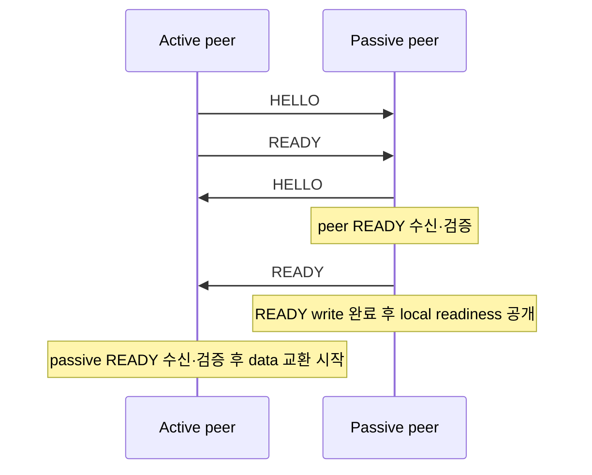
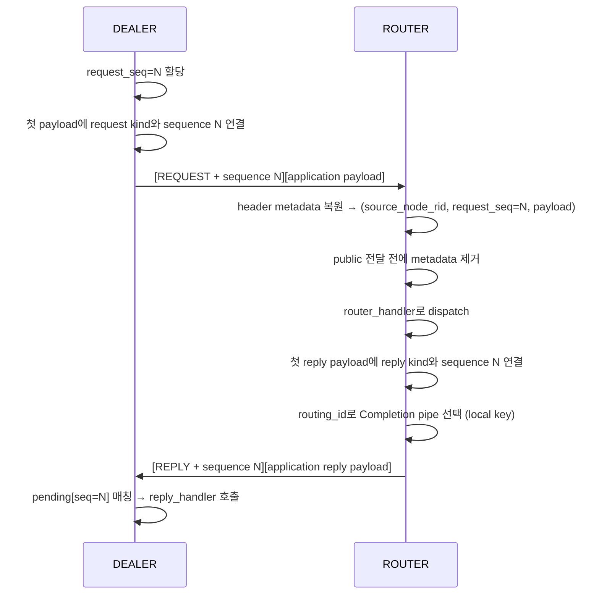

[English](https://zlink-systems.github.io/zlink/spec/core/protocol/01-zmp/) | 한국어

<!-- zlink-nav:start -->
[프로토콜 목차](README.ko.md) | [이전: 프로토콜 개요](README.ko.md) | [다음: RAW (STREAM) 프로토콜 상세](02-raw.ko.md)
<!-- zlink-nav:end -->

# Protocol — ZMP v1.0

> **이 장이 정의하는 것** — ZMP wire protocol과 request-reply header metadata의 byte 단위 배치,
> handshake와 decode 검증 계약, 그리고 그 byte를 만드는 encode/decode 내부 구현.
> 소개는 [ZMP protocol 가이드](../../../guide/zmp-protocol.ko.md)가 다룬다.

## 1. ZMP 개요

ZMP(zlink Message Protocol)는 zlink 전용 wire protocol이다 — message를 주고받는
endpoint인 [socket](../glossary.ko.md#socket)들이 transport 위에서 교환하는 byte의
배치를 정한다. wire 위에서 전송되는 하나의 데이터 단위를 frame이라 한다.

ZMP는 raw socket handshake, request-reply와 connection control frame만 정의한다.
Application service topology나 stateful object protocol을 포함하지 않는다.

이 문서에서 frame header, handshake, request-reply metadata의 byte 배치와 decode 검증 규칙은 다른
구현이 상호운용을 위해 의존하는 **계약 서술**이다. 그 byte를 만들고 해석하는
encode/decode 경로와 pending 관리는 **구현 서술**이며 [§9 내부 구조](#9-내부-구조)에
모은다.

관련 문서는 다음과 같다.

| 관련 내용 | 문서 |
|---|---|
| ZMP protocol 소개와 사용 관점 | [ZMP protocol 가이드](../../../guide/zmp-protocol.ko.md) |
| ZMP framing 없이 연결하는 RAW wire format | [RAW (STREAM) 프로토콜 상세](02-raw.ko.md) |
| message lifecycle와 multipart 공개 계약 | [Message](../02-message.ko.md) |

## 2. 기본 방향

Request-reply 정보는 첫 application data frame의 ZMP header에 기록한다. Request,
reply와 error reply를 구분하는 kind와 0이 아닌 request sequence는 transport protocol이
소유하며 application payload part가 아니다. 따라서 같은 multipart를 ordinary send와
request에 넘기면 수신 application은 같은 part 수, 순서와 byte를 관찰한다.

전용 request·reply API는 Core가 소비하는 첫 application message에 내부 metadata를 붙인다.
Encoder는 이를 wire header로 옮기고 decoder는 다시 message 내부 값으로 복원한다. Socket
runtime은 request 대상이나 pending completion을 찾은 뒤 public receive와 callback에 payload를
넘기기 전에 metadata를 제거한다.

- **Public message API는 request-reply kind나 sequence를 만들거나 읽지 않는다.** Application은
  request·reply API에 payload만 전달하며 raw send는 항상 ordinary data를 만든다.
- **Application payload 앞에 protocol part를 붙이지 않는다.** Protocol id, version, message
  type과 sequence처럼 보이는 payload도 그대로 application data로 처리한다.
- **`VERSION == 0x01` peer는 이 문서의 header 배치만 request-reply 계약으로 해석한다.**
  Protocol id, version, message type과 sequence 모양의 네 payload part는 ordinary data이며
  request-reply metadata로 해석하지 않는다.

## 3. 공통 frame header

모든 ZMP frame은 다음 8 byte header로 시작한다.

### 3.1 Header 배치

```text
 Byte:   0         1         2         3         4    5    6    7
      +---------+---------+---------+---------+---------------------+
      |  MAGIC  | VERSION |  FLAGS  |  KIND   |   PAYLOAD SIZE      |
      |  (0x5A) |  (0x01) |         |         |   (32-bit BE)       |
      +---------+---------+---------+---------+---------------------+
```

| 필드 | 오프셋 | 크기 | 설명 |
|------|--------|------|------|
| MAGIC | 0 | 1 | `0x5A` |
| VERSION | 1 | 1 | `0x01` |
| FLAGS | 2 | 1 | frame flag |
| KIND | 3 | 1 | `0x00` data, `0x01` request, `0x02` reply, `0x03` error reply |
| PAYLOAD SIZE | 4-7 | 4 | Sequence extension을 제외한 application payload 크기, Big Endian |

Ordinary data frame은 이 8 byte header 바로 뒤에 payload가 온다. Request-reply kind인 첫
frame은 공통 header 뒤에 8 byte unsigned Big Endian request sequence를 붙여 16 byte
header를 만든다.

```text
 Byte:   0         1         2         3         4    5    6    7
      +---------+---------+---------+---------+---------------------+
      |  MAGIC  | VERSION |  FLAGS  |  KIND   |   PAYLOAD SIZE      |
      +---------+---------+---------+---------+---------------------+
      |                 REQUEST SEQUENCE (64-bit BE)                |
      +-------------------------------------------------------------+
      |                    APPLICATION PAYLOAD ...                  |
      +-------------------------------------------------------------+
```

Sequence extension은 `KIND`가 request, reply 또는 error reply일 때만 존재한다. `PAYLOAD
SIZE`와 message 크기 제한은 extension을 포함하지 않는다.

### 3.2 FLAGS bit

| 비트 | 이름 | 값 | 설명 |
|------|------|-----|------|
| 0 | MORE | `0x01` | multipart 계속 |
| 1 | CONTROL | `0x02` | control part |
| 2 | IDENTITY | `0x04` | routing id 관련 frame |
| 3 | SUBSCRIBE | `0x08` | 구독 요청 |
| 4 | CANCEL | `0x10` | 구독 취소 |

ZMP `CONTROL` bit는 HELLO/READY 같은 protocol control frame에만 쓴다. Request-reply
kind는 `CONTROL`, `IDENTITY`, `SUBSCRIBE` 또는 `CANCEL`과 함께 사용할 수 없다.

수신 decoder는 FLAGS의 bit 5~7이 설정된 frame을 `EPROTO`로 거부한다. 다음 FLAGS
조합도 `EPROTO`다.

- `CONTROL | IDENTITY`
- `CONTROL | MORE`
- `SUBSCRIBE | CANCEL`
- `SUBSCRIBE` 또는 `CANCEL`과 그 밖의 flag를 함께 설정한 조합

## 4. Handshake

연결이 만들어지면 active 쪽은 HELLO frame 뒤에 READY frame을 연속해서 보낸다. Transport가
이 byte 열을 여러 write나 RFC 6455 binary message로 나누는 방법은 ZMP frame 순서에 영향을
주지 않는다. Paired DEALER·ROUTER transport의 passive 쪽은 HELLO만 먼저 보내고, peer READY를
수신한 뒤 자기 READY를 보낸다. Passive 쪽은 이 READY의 transport write가 성공적으로
완료된 뒤에만 local connection readiness와 pair admission을 공개한다. READY write가
실패하면 handshake를 실패로 끝내며 readiness를 공개하지 않는다. Active 쪽은 passive
READY를 수신한 뒤에만 data 교환을 시작한다.



**HELLO frame**: control type(1 byte), socket type(1 byte),
routing ID 길이(1 byte), routing ID(0~255 byte) 순서로 구성한다. routing ID는
transport peer를 식별하는 byte 열이다.

**READY frame**: READY control type byte `0x04`는 항상 전송한다. Metadata를 사용하면
그 뒤에 property를 연속해서 붙이며, 각 property의 byte 배치는 다음과 같다.

```text
[name length:u8][name bytes][value length:u32 BE][value bytes]
```

`ZLINK_OPT_ZMP_METADATA`를 활성화하면 `Socket-Type`을 추가하고, socket type이
DEALER 또는 ROUTER일 때만 `Routing-Id`도 추가한다. Metadata를 사용하는 READY에는
`Zlink-Max-Message-Size`를 항상 추가하며, 값은 unsigned 64-bit big-endian 8 byte다. 값 `0`은
양수 Application maximum이 없음을 뜻한다.
이 option의 기본값은 비활성화다. 다만 paired DEALER·ROUTER transport는 이 option과
관계없이 metadata와 [§4.1](#41-request-reply-transport-pair)의 pair property를 항상
추가한다.

**ERROR frame**: ERROR control type은 `0x05`다. Body는 다음 byte 순서로 구성한다.

```text
[type:0x05][error code:u8][reason length:u8][reason bytes]
```

### 4.1 Request-reply transport pair

Request-reply를 사용하는 하나의 logical DEALER/ROUTER peer는 두 physical transport
connection을 사용한다.

| Lane | 전달하는 traffic |
|---|---|
| Application | 일반 application message와 request |
| Completion | 이미 보낸 request를 완료하는 reply와 receive-flow control |

두 connection의 READY frame에는 `Zlink-Pair-Id`, `Zlink-Pair-Generation`,
`Zlink-Lane`이 들어간다. Pair ID와 generation은 unsigned 64-bit big-endian 값이다.
Lane은 한 byte이며 Application은 `0`, Completion은 `1`이다. 세 property는 항상
함께 있어야 한다. 두 connection의 pair ID, generation과 peer routing identity가
모두 일치해야 한다.

READY의 `Routing-Id`는 두 connection이 같은 peer에 속하는지 검증하는 metadata다. Runtime은
ROUTER가 peer를 선택하는 synthetic routing-id preamble을 Application lane에만 제공한다.
Completion lane은 이 preamble과 ordinary `data` record를 전달하지 않는다. READY 뒤
Completion lane에 record가 들어오면 첫 record는 reply, error reply 또는 receive-flow
control이어야 한다.

Peer-weight advertisement는 Application lane의 peer 선택만 제어한다. Network transport는
Application connection의 ZMP `WEIGHT` command로 절대값 `0..10000`을 보내고, inproc은 상대
Application pipe의 owner thread에 Core control로 같은 값을 전달한다. 두 경로 모두 Core가
소비하므로 public receive에 application data로 나타나지 않으며 Completion lane에는 record를
만들지 않는다.

Network `WEIGHT` command는 8 byte base header에서 `CONTROL` flag와 `KIND == 0x00`을 사용하며
payload size는 10이다. Payload는 다음 byte 순서이고 multipart `MORE`나 request sequence는 없다.

```text
[ASCII "WEIGHT":6][weight:u32 BE]
```

Application 크기 제한은 이 CONTROL body에 적용하지 않는다. 수신 runtime은 먼저
[§7](#7-decode-유효성-검사)의 독립 CONTROL 상한을 적용한 뒤 WEIGHT type을 검증한다.

`WEIGHT`로 식별했지만 body가 정확히 10 byte가 아니거나 값이 `10000`보다 크면 consume하고
무시한다. 이 경우 connection을 끊거나 scheduler 상태와 `PEER_WEIGHT_CHANGED`를 바꾸지 않으며
public receive에도 나타나지 않는다.

금지된 flag 조합과 독립 상한을 넘은 CONTROL body는 계속 구조적인 protocol 오류다.

Bind나 connect 전에 설정한 weight는 paired Application pipe가 준비된 뒤에만 상대 scheduler와
동기화한다. Dynamic 변경도 양방향에서 `0`을 포함한 새 절대값을 적용한다. 같은 pair에 마지막으로
알린 값과 같으면 command를 다시 만들지 않는다. Reconnect 뒤 새 paired generation의 Application
pipe가 pair-ready가 되면 현재 설정값을 그 pipe로 다시 알린다.

Network `WEIGHT` command는 application HWM과 remote PAUSE를 우회할 수 있다. 그러나 pair-ready
hold와 한 Application multipart의 part 사이에 다른 record를 넣지 않는 atomic 경계는 우회하지
않는다. Application multipart가 열린 동안 sender는 가장 최근 weight 하나만 고정된 `uint32`
상태로 보관한다. FINAL이 multipart를 commit하거나 rollback이 multipart를 제거한 뒤, 그 결과로
생긴 다음 message 경계에서만 가장 최근 command를 append하고 publish한다.

Application write는 두 lane의 검증이 끝날 때까지 대기한다. 이전 generation에서
수신한 data를 새 pair에 연결하지 않는다. 한 lane에서 protocol error, identity
mismatch, fence timeout 또는 terminal failure가 발생하면 pair 전체를 종료한다.
Reconnect는 새 generation을 만들고 두 lane을 다시 검증한 뒤 Application write를
재개한다.

FIFO 순서는 각 lane 안에서만 보장한다. 두 lane 사이의 순서는 보장하지 않는다.
Application ingress가 수신 처리가 밀려 추가 제출을 제한하는
[backpressure](../glossary.ko.md#backpressure)로 중단되어도 Completion reply를
처리할 수 있다. Relocation, session binding과 그 밖의 상위 protocol은 두
connection 사이의 순서에 의존하지 않고 자체 generation fence를 사용해야 한다.

## 5. Request-reply kind와 sequence

첫 application data frame의 `KIND`와 sequence extension이 request-reply record를
식별한다.

| Kind | 값 | Sequence | Application에서 관찰하는 결과 |
|---|---:|---|---|
| data | `0x00` | 없음 | Payload를 ordinary message로 받는다. |
| request | `0x01` | 0이 아닌 8 byte Big Endian 값 | Typed receive가 payload와 reply에 사용할 sequence 또는 local token을 반환한다. |
| reply | `0x02` | 원래 request와 같은 값 | Completion progress lane이 해당 pending request를 payload로 완료한다. |
| error reply | `0x03` | 원래 request와 같은 값 | Completion progress lane이 첫 payload part의 errno를 오류 completion으로 바꾼다. |

Multipart request-reply는 첫 application frame에만 request-reply kind와 sequence를
기록한다. 첫 frame의 `MORE`가 설정되면 둘째 frame부터 `KIND == 0x00`이고, 마지막
application frame에서 `MORE`가 해제된다.

```text
[REQUEST + SEQUENCE + MORE][payload part 0]
[DATA                    ][payload part 1]
...
```

`request_sequence == 0`은 유효하지 않다. Reply는 request에서 받은 wire sequence를
그대로 사용한다. Error reply는 receive-only kind이며 public sender는 없다. 첫
application payload part는 0이 아닌 errno를 4 byte Big Endian 값으로 담는다. Core C
completion callback은 errno를 `zlink_request_result_t`로 매핑하고 이 첫 part를 제외한 나머지
part를 callback payload로 받는다. 상위 language binding의 error 변환과 payload 처리는
[Binding 스펙](../../../../../bindings/doc/spec/README.ko.md#request-reply-오류-정책)이 소유한다.
첫 part가 없거나 크기가 4 byte가 아니거나 값이 `0`이면
result는 `ZLINK_REQUEST_PROTOCOL_ERROR`이고 callback payload part 수는 `0`이다.

### 5.1 Request-reply sequence (DEALER → ROUTER)



이 diagram에서 wire에 나타나는 header 배치는 위 kind와 sequence 규칙이 계약이다. `routing_id`는
reply wire part가 아니라 ROUTER가 대상 Completion pipe를 고르는 local 선택 key다.
Pending 매칭과 handler dispatch는 [§9 내부 구조](#9-내부-구조)의 구현 서술이다.

## 6. Transport routing_id와의 관계

transport `routing_id`와 request-reply 주소는 같은 값이 아니다.

- transport `routing_id`: 현재 연결된 peer를 선택하는 ROUTER local key이며 reply wire에는
  포함되지 않는 주소
- `request_seq`: request와 reply를 묶는 식별자

둘을 섞으면 reply 주소를 잘못 계산하게 된다.
문서와 구현 모두 이를 다른 계층으로 설명해야 한다.

## 7. Decode 유효성 검사

수신 peer는 공통 header와 sequence extension에 다음 조건을 적용한다.

- `KIND`가 data, request, reply 또는 error reply 중 하나다.
- Request-reply kind의 sequence가 `0`이 아니다.
- Request-reply kind에 `CONTROL`, `IDENTITY`, `SUBSCRIBE` 또는 `CANCEL`이 없다.
- Application multipart의 둘째 frame부터 request-reply kind나 special frame이 나타나지 않는다.
- Connection EOF 전에 base header, sequence extension과 선언한 payload가 모두 끝난다.

Base header나 sequence extension이 여러 transport read 또는 WS·WSS binary message로 나뉘는
것은 오류가 아니다.

Body 크기 검증은 Application frame과 CONTROL frame을 구분한다.

1. 양수 `ZLINK_OPT_MAXMSGSIZE`는 inbound Application의 각 part body를 제한한다. Non-special
   Application record에는 record 전체 part body 합도 같은 제한을 적용한다. 값 `0`은 option에서
   온 part별·record 합산 상한이 없는 무제한 값이다. READY에 알린 `Zlink-Max-Message-Size`는
   peer가 outbound admission에 사용할 이 Application 제한을 전달한다.
2. CONTROL body는 Application 제한을 우회하며, body storage나 Application HWM admission 전에
   독립된 고정 상한 4096 byte를 적용한다.
3. 이 상한 안의 CONTROL body에는 이어서 control type별 검증을 적용한다. 따라서 Application
   최대값이 body보다 작아도 기존 READY·FLOWSTATE와 고정 10 byte WEIGHT가 계속 동작한다.

각 part가 제한 안이어도 non-special Application multipart의 누적 body가 제한을 넘으면 그
record는 `BODY_TOO_LARGE`(`0x04`)로 실패하며 payload를 handler나 public receive에 전달하지
않는다. 4097 byte로 선언한 CONTROL body도 `BODY_TOO_LARGE`(`0x04`)로 실패한다. 이는 control용
무제한 allocation 경로가 아니라 protocol 거부이며, body를 Application receive에 전달하지 않는다.
WEIGHT가 §4에서 정의한 더 좁은 consume-and-ignore 규칙처럼 control type별 실패 경계를 둘 수
있지만 구조적 header 검증과 4096 byte 상한은 약화하지 않는다.

검증 실패는 `EPROTO`로 pair를 종료하고 해당 frame을 handler나 reply completion에 전달하지
않는다. 이 frame 자체가 pending request를 완료하지 않으며, pair 종료로 기존 pending request가
disconnect 결과를 받는 규칙은 유지한다.

## 8. Transport framing

TCP, IPC와 TLS는 같은 ZMP header와 payload byte를 연속된 stream으로 보낸다. Base header,
sequence extension과 payload는 여러 read로 나뉠 수 있다.

WS와 WSS도 RFC 6455 binary message의 payload를 순서가 유지되는 ZMP byte 열로 전달한다.
Binary message 경계는 ZMP frame 경계가 아니다. Binary message 하나는 ZMP frame의 일부,
완전한 frame 하나, 여러 완전한 frame, 또는 앞 frame의 나머지와 다음 frame의 시작을 포함할
수 있다. Decoder는 공통 header와 선언한 payload 크기로 frame 경계를 복원한다. Binary
message가 frame 중간에서 끝나도 다음 binary message의 byte로 계속 처리하며, connection EOF까지
완성되지 않은 frame만 `EPROTO`다. Payload가 비어 있는 binary message는 ZMP byte를 추가하거나
frame을 전달하지 않으며 connection EOF로 처리하지 않는다. Text message는 payload가 유효한
HELLO, READY 또는 data frame byte와 같아도 ZMP byte 열에 포함하지 않으며, peer는 ZMP parsing
전에 `EPROTO`로 연결을 종료한다.

Inproc은 wire codec을 거치지 않지만 pipe와 queue가 같은 internal metadata를 보존한다. Public
receive와 completion에서 관찰하는 payload, sequence와 metadata 제거 결과는 network transport와
같다.

## 9. 내부 구조

> **이 절의 계약 소유** — 상호운용이 의존하는 byte 배치와 decode 검증은
> [§3](#3-공통-frame-header)~[§8](#8-transport-framing)이, 관찰 가능한 완료 동작은
> [§10 검증 요구](#10-구현-및-contract-test-검증-요구)가 소유한다. 이 절은 그 byte를
> 만들고 해석하는 현재 구현을 서술한다.

### Encode / decode 흐름 (socket request-reply)

송신 runtime은 Core가 소유한 첫 application message의 16 byte inline auxiliary 영역에 kind와
host-order sequence를 둔다. Group과 request-reply metadata는 같은 영역을 공유하므로 동시에
설정하지 않는다. `sizeof(msg_t) == 64`와 29 byte VSM 한계는 유지한다.

모든 ZMP encoder는 caller가 제공한 고정 storage에 최대 16 byte를 쓰는 같은 header builder를
사용한다. Ordinary data는 tag 확인 뒤 기존 8 byte header와 payload pointer를 그대로 사용하고,
request-reply 첫 frame만 sequence extension을 scatter/gather entry에 추가한다. Header 생성 때문에
heap buffer나 payload copy를 만들지 않는다.

Decoder는 application payload storage와 queue 수용 공간을 확보하기 전에 base header와 sequence
extension을 끝까지 모으고 검증한다. 양수 `ZLINK_OPT_MAXMSGSIZE`가 설정됐으면 Decoder는 현재
Application part 크기를 먼저 확인하고, non-special Application frame이면 multipart에 누적한 body
크기도 확인한다. 값 `0`은 이 option 검사에 상한을 만들지 않는다. Header가 여러 transport read로
나뉘면 읽은 byte와 상태를 유지해 다음 read에서 계속한다. 검증 뒤 현재 application payload 크기로
HWM admission을 수행하며, backpressure 뒤 재시도할 때 header를 다시 읽지 않는다.

Decoder는 validation, admission, payload와 submission 상태를 차례로 진행한다. 첫 application
message에 metadata를 복원한 뒤 socket runtime이 다음처럼 처리한다.

1. Typed receive의 request는 source pipe와 wire sequence를 reply target으로 저장한다.
2. Completion progress lane의 reply와 error reply는 sequence로 pending request를 찾는다.
3. 필요한 값을 runtime state로 옮긴 뒤 public payload를 내보내기 전에 metadata를 제거한다.

Reply payload는 Completion pipe에서 등록 callback으로 바로 이동한다. 숨은 PAIR
receive queue나 두 번째 completion payload deque에 보관하지 않는다. Timeout,
shutdown과 같은 terminal callback에는 payload가 없는 작은 callback metadata queue만
유지한다. 이 queue는 transport lane이나 wire record가 아니다.

### Peer-weight control

수신한 exact Application pipe가 상대의 최신 절대 weight를 소유한다. Scheduler mutation과
`PEER_WEIGHT_CHANGED` monitor event는 그 pipe의 owner thread에서만 처리하며, pair table의
pending slot은 값을 소유하지 않는다.

전달은 다음 순서로 진행된다.

1. Network session은 ZMP `WEIGHT` command를 decode하고, inproc sender는 typed `uint32` weight를
   넘겨 상대 exact Application pipe owner를 대상으로 지정한다.
2. Owner command는 그 pipe를 retain하고 값을 받은 해당 물리 연결 ID를 캡처한다.
3. Command 처리 시 exact pipe의 active lifetime, Application lane과 캡처한 연결 ID가 현재 값과
   같은지 검증한 뒤 값을 그 pipe에 기록한다.
4. 같은 pipe가 ready 상태가 되고 선택 가능한 route로 attach되면 scheduler가 기록값을 읽어
   적용한다.
5. 실제 적용값이 바뀌면 `PEER_WEIGHT_CHANGED`를 만든다. Event의 `value`는 새 weight이고 lane은
   Application이며 pair ID와 generation은 값을 적용한 pipe를 식별한다.

Pipe 종료나 connection ID 불일치는 바로 그 exact pipe의 stale command만 폐기한다. Duplicate
standby로 남은 pipe는 자기 최신 값을 유지하므로 나중에 같은 pipe가 선택되면 그 값을 적용한다.
이 보장은 모든 standby나 교체 route가 이전에 기록한 상태를 버린다고 확대하지 않는다.

### Pending과 reply-target key

pending(응답 대기 항목) 소유권은 상위 API 계층에 있다. Outbound request의 pending map은
socket이 발급한 `request_seq`로 항목을 찾고, 별도 local cookie로 sequence 재사용을 fence한다.
Completion frame을 적용할 때는 frame을 받은 transport pair ID와 generation도 등록 당시 값과
같아야 한다.

Inbound request의 reply target은 public receive 역할에 따라 다르게 보관한다.

- `DEALER`: socket-local reply token → source pipe와 wire `request_seq`
- `ROUTER`: source routing ID와 wire `request_seq` → request를 전달한 source pipe

완료 규칙(첫 reply 완료, timeout, 중복 reply 무시, error reply 전달)은
[§10 검증 요구](#10-구현-및-contract-test-검증-요구)가 소유한다.

### WebSocket 구현

WebSocket transport adapter는 각 read가 속한 message의 opcode와 binary payload byte를 함께
확정해 decoder에 수신 순서대로 넘긴다. Message 완료 상태로 ZMP frame을 끝내거나 frame 공개를
보류하지 않는다. Decoder는 한 transport read에서 frame을 만들지 않거나 하나 이상 만들 수 있으며,
short read와 RFC 6455 message 경계에 관계없이 base header·extension·payload 상태를 유지한다.
Text opcode는 HELLO parsing이나 data frame decode 전에 거부한다.

송신 encoder는 현재 준비된 ZMP byte를 기존 `out_batch_size` 상한까지 output buffer에 모으고,
그 bounded batch를 Beast binary write 한 번으로 제출한다. Batch를 채우려고 아직 준비되지 않은
traffic을 기다리지 않으며, ZMP frame byte·순서와 application multipart 경계를 바꾸지 않는다.
이 구조는 ZMP frame마다 Beast async write와 WSS의 TLS 처리를 시작하는 비용을 없앤다.

## 10. 구현 및 contract test 검증 요구

다른 구현과의 상호운용은 wire에서 관찰하는 byte로, request-reply 완료는 공개 API의
callback 결과로 확인한다. 각 항목은 test 하나로 이어진다.

**Frame header와 flags**
- Ordinary data를 보내면 wire에서 MAGIC `0x5A`, VERSION `0x01`, KIND `0x00`, 32-bit Big Endian application payload size를 담은 8 byte header가 관찰된다.
- Public request와 reply의 첫 frame은 KIND `0x01` 또는 `0x02`와 0이 아닌 8 byte Big Endian sequence를 담은 16 byte header를 사용하며, payload size는 sequence extension을 제외한다.
- Multipart request-reply의 둘째 frame부터 KIND는 `0x00`이고 `MORE`가 application part 경계를 그대로 나타낸다.
- FLAGS bit 5~7, `CONTROL | IDENTITY`, `CONTROL | MORE`, `SUBSCRIBE | CANCEL`, SUBSCRIBE/CANCEL과 다른 flag의 조합을 수신하면 decoder가 `EPROTO`로 거부한다.

**Handshake**
- Active 쪽은 HELLO frame 뒤에 READY frame을 보내며 그 사이에 application frame을 넣지 않는다. 같은 byte 열을 WS·WSS binary message 하나에 넣거나 여러 binary message로 나눠도 peer가 같은 HELLO와 READY를 순서대로 처리한다. Paired DEALER·ROUTER transport의 passive 쪽은 HELLO를 먼저 보낸 뒤 peer READY 수신 후 자기 READY를 보낸다.
- Paired passive 쪽은 자기 READY의 transport write가 완료되기 전에 local readiness나 pair admission을 공개하지 않는다. Write가 실패하면 readiness 없이 handshake가 실패한다.
- READY control type `0x04` 뒤의 각 metadata property는 `[name length:u8][name bytes][value length:u32 BE][value bytes]` 배치를 따른다.
- `ZLINK_OPT_ZMP_METADATA`가 기본값(비활성)이면 metadata property가 없고, 활성화하면 `Socket-Type`과 8 byte big-endian `Zlink-Max-Message-Size`가 추가된다. `Routing-Id`는 DEALER·ROUTER READY에만 추가된다.
- paired DEALER·ROUTER transport의 READY에는 이 option과 관계없이 `Socket-Type`·`Routing-Id` metadata와 pair property가 항상 있다.
- ERROR control type은 `0x05`이며 body는 `[type][error code:u8][reason length:u8][reason bytes]` 배치를 따른다.

**Transport pair**
- 두 connection의 READY에 `Zlink-Pair-Id`(unsigned 64-bit big-endian), `Zlink-Pair-Generation`(unsigned 64-bit big-endian), `Zlink-Lane`(1 byte, Application `0` / Completion `1`) 세 property가 항상 함께 나타난다.
- Application write는 두 lane의 검증이 끝난 뒤에 전달된다.
- 이전 generation에서 수신한 data는 새 pair에 연결되지 않는다.
- 한 lane에서 protocol error, identity mismatch, fence timeout 또는 terminal failure가 발생하면 pair 전체가 종료된다.
- reconnect하면 새 generation이 만들어지고, 두 lane을 다시 검증한 뒤 Application write가 재개된다.
- FIFO 순서는 각 lane 안에서만 관찰되며, 두 lane 사이의 순서는 보장되지 않는다.
- Application ingress가 backpressure로 중단된 동안에도 Completion reply가 처리된다.
- Network peer-weight advertisement는 `CONTROL`, `KIND == 0x00`, payload size `10`인
  Application-lane frame이며 payload가 `[ASCII "WEIGHT":6][weight:u32 BE]` 배치를 따른다.
- 양수 `ZLINK_OPT_MAXMSGSIZE`를 10 byte보다 작게 설정해도 READY, FLOWSTATE와 고정 10 byte
  WEIGHT CONTROL은 막히지 않으며, 설정값을 넘은 Application body는 계속 거부된다.
- `ZLINK_OPT_MAXMSGSIZE=0`은 Application part와 non-special multipart 합에 option 상한을
  적용하지 않는다. Wire의 32-bit payload-size 범위와 CONTROL 4096 byte 상한은 그대로 적용한다.
- Non-special Application multipart는 각 part와 모든 part body 합이 `ZLINK_OPT_MAXMSGSIZE` 안일
  때만 전달된다. 누적 body가 제한을 넘으면 `BODY_TOO_LARGE`(`0x04`)로 pair가 종료되고 handler나
  public receive에 payload가 나타나지 않는다.
- 4096 byte CONTROL은 type별 검증 단계에 도달하고, 4097 byte로 선언한 CONTROL은
  `BODY_TOO_LARGE`(`0x04`)로 거부하며 Application record를 만들지 않는다.
- WEIGHT로 식별했지만 크기가 10이 아니거나 값이 `10000`보다 크면 pair를 끊거나 scheduler
  상태·`PEER_WEIGHT_CHANGED`를 바꾸거나 public receive record를 만들지 않고 consume한다.
- Application multipart가 열린 동안 weight를 여러 번 바꾸면 peer는 중간 control record 없이
  원래 multipart를 받고, FINAL commit 또는 rollback 뒤 다음 message 경계에서 가장 최근
  `WEIGHT` command 하나만 받는다.
- Network paired connection에 첫 request를 보내기 전에 completion poller를 등록해도 pair가 종료되지
  않으며, 이어지는 request와 reply가 각각 한 번 전달된다.
- Inproc pair에서 application request를 받은 뒤 reply나 receive-flow control을 쓰기 전까지
  Completion pipe에는 읽을 수 있는 synthetic routing-id record가 없다.
- Network와 inproc pair에서 bind·connect 전에 설정한 양쪽 weight는 paired Application pipe가
  ready 된 뒤 상대 scheduler에 정확한 값으로 적용되며, `0`도 값으로 적용된다.
- Network와 inproc pair가 ready 된 뒤 양쪽 peer weight를 동적으로 바꾸면
  `PEER_WEIGHT_CHANGED`가 새 값과 해당 Application lane의 pair ID·generation을 제공하고,
  public receive와 Completion pipe에는 weight record가 나타나지 않는다.
- 같은 값을 다시 설정하면 peer scheduling state와 monitor event가 중복 변경되지 않는다.
- Reconnect 뒤 public peer 선택과 monitor는 새 generation의 현재 weight를 반영한다. Active
  standby를 승격하면 그 standby가 마지막으로 받은 값을 사용한다.

**Request-reply와 decode 검증**
- Ordinary send와 request에 같은 multipart를 넘기면 수신 application은 같은 part 수, 순서와 byte를 관찰한다.
- Protocol id, version, message type과 sequence 모양의 네 payload part를 ordinary send로 보내도 전체 payload가 그대로 전달되고 request completion을 만들지 않는다.
- reply의 `request_seq`는 request에서 받은 값과 같다.
- ROUTER가 reply 대상을 고르는 `routing_id`는 local 선택 key이며 reply wire part가 아니다.
- `error reply`의 첫 payload part는 4 byte Big Endian errno다.
- 알 수 없는 kind, `request_seq == 0`, request-reply kind와 special flag의 조합, multipart 중간 kind 또는 special frame을 수신하면 `EPROTO`로 pair를 종료하고 payload를 handler나 completion에 전달하지 않는다.
- Base header, sequence extension 또는 payload를 끝내지 않고 stream을 닫으면 `EPROTO`이며 application receive나 completion에 부분 payload를 전달하지 않고 connection을 종료한다.

**완료**
- 첫 reply 1건으로 high-level request가 완료된다.
- 완료 후 같은 key로 추가 reply가 와도 다시 callback하지 않는다.
- reply보다 timeout이 먼저 오면 callback은 `ZLINK_REQUEST_TIMED_OUT`을 받는다.
- 유효한 `error reply`는 Core C callback에 매핑된 non-OK `zlink_request_result_t`와 errno part를
  제외한 나머지 payload로 전달된다.

**Transport와 frame 수**
- TCP, IPC, TLS, WS와 WSS에서 request-reply의 kind와 sequence가 같은 byte 위치에 나타난다.
- WS와 WSS에서 base header, sequence extension 또는 payload 중간에 binary message 경계를 두고 나머지를 다음 binary message로 보내면 ZMP frame 하나가 전달된다.
- WS와 WSS의 binary message 하나에 완전한 ZMP frame을 둘 이상 연속해서 보내면 decoder가 각 frame을 순서대로 한 번씩 전달한다.
- WS와 WSS에서 빈 binary message를 보내면 payload나 frame이 전달되지 않고 connection은 다음 ZMP byte를 계속 처리한다.
- 유효한 HELLO 또는 data frame byte를 WS·WSS text message로 보내면 payload가 공개되지 않고
  peer가 `EPROTO`로 연결을 종료한다. Fragmented text message도 최초 opcode를 유지해 같은
  결과를 낸다.
- Inproc request-reply는 network transport와 같은 application payload, sequence, reply 완료와 public metadata 제거 결과를 제공한다.
- Ordinary send와 request/reply에 같은 application multipart를 넘기면 방향별 ZMP data frame 수가 모두 application part 수와 같다.

<!-- zlink-nav:start -->
[프로토콜 목차](README.ko.md) | [이전: 프로토콜 개요](README.ko.md) | [다음: RAW (STREAM) 프로토콜 상세](02-raw.ko.md)
<!-- zlink-nav:end -->
