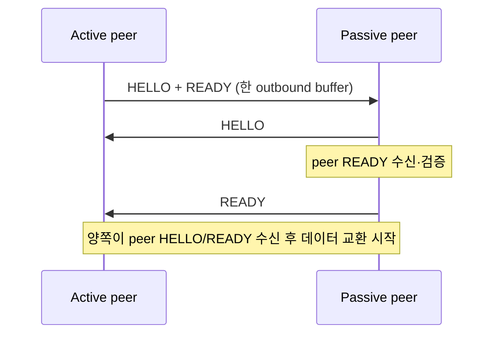
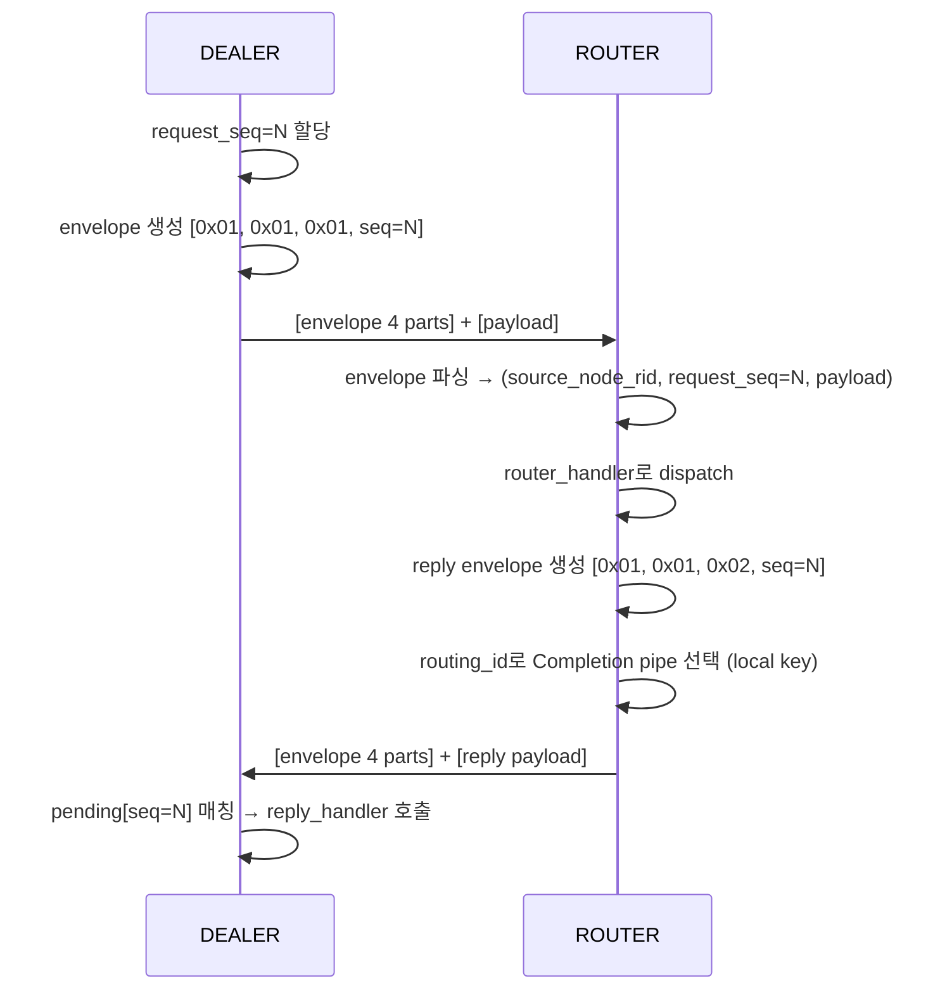

[English](https://zlink-systems.github.io/zlink/spec/core/protocol/01-zmp/) | 한국어

<!-- zlink-nav:start -->
[프로토콜 목차](README.ko.md) | [이전: 프로토콜 개요](README.ko.md) | [다음: RAW (STREAM) 프로토콜 상세](02-raw.ko.md)
<!-- zlink-nav:end -->

# Protocol — ZMP v1.0

> **이 장이 정의하는 것** — ZMP wire protocol과 request-reply envelope의 byte 단위 배치,
> handshake와 decode 검증 계약, 그리고 그 byte를 만드는 encode/decode 내부 구현.
> 소개는 [ZMP protocol 가이드](../../../guide/zmp-protocol.ko.md)가 다룬다.

## 1. ZMP 개요

ZMP(zlink Message Protocol)는 zlink 전용 wire protocol이다 — message를 주고받는
endpoint인 [socket](../glossary.ko.md#socket)들이 transport 위에서 교환하는 byte의
배치를 정한다. wire 위에서 전송되는 하나의 데이터 단위를 frame이라 한다.

ZMP는 raw socket handshake, request-reply와 connection control frame만 정의한다.
Application service topology나 stateful object protocol을 포함하지 않는다.

이 문서에서 frame header, handshake, envelope의 byte 배치와 decode 검증 규칙은 다른
구현이 상호운용을 위해 의존하는 **계약 서술**이다. 그 byte를 만들고 해석하는
encode/decode 경로와 pending 관리는 **구현 서술**이며 [§9 내부 구조](#9-내부-구조)에
모은다.

관련 문서는 다음과 같다.

| 관련 내용 | 문서 |
|---|---|
| ZMP protocol 소개와 사용 관점 | [ZMP protocol 가이드](../../../guide/zmp-protocol.ko.md) |
| ZMP framing 없이 연결하는 RAW wire format | [RAW (STREAM) 프로토콜 상세](02-raw.ko.md) |
| message lifecycle와 multipart 공개 계약 | [Message](../02-message.ko.md) |

## 2. 기본 방향

request-reply는 `zlink_msg_t` 내부 필드가 아니라 ZMP multipart control part로
표현한다. application payload 앞에 붙는 내부 제어 part를 control part라 한다.
즉 다음 방식은 이 protocol의 모델이 아니다.

- message-level request marking
- per-message metadata envelope
- recv 후 내부 필드를 복원하는 방식

ordinary `zlink_send()` / `zlink_recv()`는 payload part만 다룬다. request-reply는
전용 공개 API가 control part를 앞에 붙여 보내고 전용 decode 경로가 이를 해석한다.

## 3. 공통 frame header

모든 ZMP frame은 다음 8 byte header로 시작한다.

### 3.1 Header 배치

```text
 Byte:   0         1         2         3         4    5    6    7
      +---------+---------+---------+---------+---------------------+
      |  MAGIC  | VERSION |  FLAGS  |RESERVED |   PAYLOAD SIZE      |
      |  (0x5A) |  (0x01) |         | (0x00)  |   (32-bit BE)       |
      +---------+---------+---------+---------+---------------------+
```

| 필드 | 오프셋 | 크기 | 설명 |
|------|--------|------|------|
| MAGIC | 0 | 1 | `0x5A` |
| VERSION | 1 | 1 | `0x01` |
| FLAGS | 2 | 1 | frame flag |
| RESERVED | 3 | 1 | `0x00` |
| PAYLOAD SIZE | 4-7 | 4 | Big Endian |

### 3.2 FLAGS bit

| 비트 | 이름 | 값 | 설명 |
|------|------|-----|------|
| 0 | MORE | `0x01` | multipart 계속 |
| 1 | CONTROL | `0x02` | control part |
| 2 | IDENTITY | `0x04` | routing id 관련 frame |
| 3 | SUBSCRIBE | `0x08` | 구독 요청 |
| 4 | CANCEL | `0x10` | 구독 취소 |

request type과 요청 고유 번호를 담는 control part 묶음을 request-reply
envelope([§5](#5-request-reply-envelope))이라 한다. 이 envelope의 part들은 ZMP
`CONTROL` frame이 아니라 application payload 앞에 붙는 일반 multipart 데이터
frame(`MORE` flag)으로 전송된다. ZMP `CONTROL` bit는 HELLO/READY 같은 protocol
control frame에만 쓴다.

수신 decoder는 `RESERVED`가 `0x00`이 아니거나 FLAGS의 bit 5~7이 설정된 frame을
`EPROTO`로 거부한다. 다음 FLAGS 조합도 `EPROTO`다.

- `CONTROL | IDENTITY`
- `CONTROL | MORE`
- `SUBSCRIBE | CANCEL`
- `SUBSCRIBE` 또는 `CANCEL`과 그 밖의 flag를 함께 설정한 조합

## 4. Handshake

연결이 만들어지면 active 쪽은 HELLO와 READY frame을 한 outbound buffer로 보낸다.
Paired DEALER·ROUTER transport의 passive 쪽은 HELLO만 먼저 보내고, peer READY를
수신한 뒤 자기 READY를 보낸다. 양쪽 모두 peer의 HELLO와 READY를 수신한 뒤 데이터
교환을 시작한다.



**HELLO frame**: control type(1 byte), socket type(1 byte),
routing ID 길이(1 byte), routing ID(0~255 byte) 순서로 구성한다. routing ID는
transport peer를 식별하는 byte 열이다.

**READY frame**: READY control type byte `0x04`는 항상 전송한다. Metadata를 사용하면
그 뒤에 property를 연속해서 붙이며, 각 property의 byte 배치는 다음과 같다.

```text
[name length:u8][name bytes][value length:u32 BE][value bytes]
```

`ZLINK_OPT_ZMP_METADATA`를 활성화하면 `Socket-Type`을 추가하고, socket type이
DEALER 또는 ROUTER일 때만 `Routing-Id`도 추가한다. Metadata를 사용하는 READY에는
`Zlink-Max-Message-Size`를 항상 추가하며, 값은 unsigned 64-bit big-endian 8 byte다.
이 option의 기본값은 비활성화다. 다만 paired DEALER·ROUTER transport는 이 option과
관계없이 metadata와 [§4.1](#41-request-reply-transport-pair)의 pair property를 항상
추가한다.

**ERROR frame**: ERROR control type은 `0x05`다. Body는 다음 byte 순서로 구성한다.

```text
[type:0x05][error code:u8][reason length:u8][reason bytes]
```

### 4.1 Request-reply transport pair

Request-reply를 사용하는 하나의 logical DEALER/ROUTER peer는 두 physical transport
connection을 사용한다.

| Lane | 전달하는 traffic |
|---|---|
| Application | 일반 application message와 request |
| Completion | 이미 보낸 request를 완료하는 reply |

두 connection의 READY frame에는 `Zlink-Pair-Id`, `Zlink-Pair-Generation`,
`Zlink-Lane`이 들어간다. Pair ID와 generation은 unsigned 64-bit big-endian 값이다.
Lane은 한 byte이며 Application은 `0`, Completion은 `1`이다. 세 property는 항상
함께 있어야 한다. 두 connection의 pair ID, generation과 peer routing identity가
모두 일치해야 한다.

Application write는 두 lane의 검증이 끝날 때까지 대기한다. 이전 generation에서
수신한 data를 새 pair에 연결하지 않는다. 한 lane에서 protocol error, identity
mismatch, fence timeout 또는 terminal failure가 발생하면 pair 전체를 종료한다.
Reconnect는 새 generation을 만들고 두 lane을 다시 검증한 뒤 Application write를
재개한다.

FIFO 순서는 각 lane 안에서만 보장한다. 두 lane 사이의 순서는 보장하지 않는다.
Application ingress가 수신 처리가 밀려 추가 제출을 제한하는
[backpressure](../glossary.ko.md#backpressure)로 중단되어도 Completion reply를
처리할 수 있다. Relocation, session binding과 그 밖의 상위 protocol은 두
connection 사이의 순서에 의존하지 않고 자체 generation fence를 사용해야 한다.

## 5. Request-reply envelope

request-reply는 payload 앞에 4개 control part를 붙인다.

```text
[request-reply protocol id]
[request-reply version]
[message type]
[request seq]
[payload part 0]
[payload part 1]
...
```

필드 값:

- protocol id: `0x01`
- version: `0x01`
- message type:
  - `0x01` = request
  - `0x02` = reply
  - `0x03` = error reply
- request seq: 8 byte Big Endian `uint64`

핵심 규칙:

- `request_seq = 0`은 유효하지 않다.
- reply는 request에서 받은 `request_seq`를 그대로 다시 보낸다.
- `error reply`는 첫 payload part에 4 byte Big Endian errno를 넣는다.
- ordinary payload는 control part 뒤의 나머지 part 전체다.

### 5.1 Request-reply sequence (DEALER → ROUTER)



이 diagram에서 wire에 나타나는 part 배치는 위 envelope 규칙이 계약이다. `routing_id`는
reply wire part가 아니라 ROUTER가 대상 Completion pipe를 고르는 local 선택 key다.
Pending 매칭과 handler dispatch는 [§9 내부 구조](#9-내부-구조)의 구현 서술이다.

## 6. Transport routing_id와의 관계

transport `routing_id`와 request-reply 주소는 같은 값이 아니다.

- transport `routing_id`: 현재 연결된 peer를 선택하는 ROUTER local key이며 reply wire에는
  포함되지 않는 주소
- `request_seq`: request와 reply를 묶는 식별자

둘을 섞으면 reply 주소를 잘못 계산하게 된다.
문서와 구현 모두 이를 다른 계층으로 설명해야 한다.

## 7. Decode 유효성 검사

decode 쪽은 최소한 아래를 검사한다.

- control part 개수가 충분한지
- protocol id와 version이 맞는지
- `request_seq != 0`인지
- message type이 알려진 값인지

이 검사에 실패한 message는 request-reply message로 취급하지 않는다. 응답 대기
항목(pending)의 completion도 일으키지 않는다.

## 8. WebSocket framing

- RFC 6455 binary frame(opcode `0x02`)을 사용한다.
- payload에는 ZMP frame이 들어간다.

## 9. 내부 구조

> **이 절의 계약 소유** — 상호운용이 의존하는 byte 배치와 decode 검증은
> [§3](#3-공통-frame-header)~[§8](#8-websocket-framing)이, 관찰 가능한 완료 동작은
> [§10 검증 요구](#10-구현-및-contract-test-검증-요구)가 소유한다. 이 절은 그 byte를
> 만들고 해석하는 현재 구현을 서술한다.

### Encode / decode 흐름 (socket request-reply)

송신:

1. request/reply 종류를 결정한다.
2. `request_seq`를 local counter에서 잡는다.
3. 4개 control part를 만든다.
4. 사용자 payload part를 뒤에 붙여 보낸다.

수신:

1. 첫 4개 part가 request-reply envelope인지 검사한다.
2. `message_type`, `request_seq`를 읽는다.
3. request면 request handler로 넘긴다.
4. Completion lane에서 받은 reply는 pending map에서 `request_seq` 또는
   `source_node_rid + request_seq`로 찾는다.

Reply payload는 Completion pipe에서 등록 callback으로 바로 이동한다. 숨은 PAIR
receive queue나 두 번째 completion payload deque에 보관하지 않는다. Timeout,
shutdown과 같은 terminal callback에는 payload가 없는 작은 callback metadata queue만
유지한다. 이 queue는 transport lane이나 wire record가 아니다.

### Pending 소유권과 key

pending(응답 대기 항목) 소유권은 상위 API 계층에 있다. 현재 구현의 pending key는
다음과 같다.

- `DEALER` pending key: `request_seq`
- `ROUTER` pending key: `source_node_rid + request_seq`

완료 규칙(첫 reply 완료, timeout, 중복 reply 무시, error reply 전달)은
[§10 검증 요구](#10-구현-및-contract-test-검증-요구)가 소유한다.

### WebSocket 구현

WebSocket framing 구현은 Beast library를 사용한다.

## 10. 구현 및 contract test 검증 요구

다른 구현과의 상호운용은 wire에서 관찰하는 byte로, request-reply 완료는 공개 API의
callback 결과로 확인한다. 각 항목은 test 하나로 이어진다.

**Frame header와 flags**
- 송신된 모든 ZMP frame은 wire에서 [§3.1](#31-header-배치)의 배치를 따른다 — MAGIC `0x5A`, VERSION `0x01`, RESERVED `0x00`, 32-bit Big Endian payload size.
- `RESERVED != 0`, FLAGS bit 5~7, `CONTROL | IDENTITY`, `CONTROL | MORE`, `SUBSCRIBE | CANCEL`, SUBSCRIBE/CANCEL과 다른 flag의 조합을 수신하면 decoder가 `EPROTO`로 거부한다.
- request-reply envelope의 part는 `CONTROL` frame이 아니라 일반 multipart 데이터 frame(`MORE` flag)으로 wire에 나타난다.

**Handshake**
- active 쪽은 HELLO와 READY를 한 outbound buffer로 보내고, paired DEALER·ROUTER transport의 passive 쪽은 HELLO를 먼저 보낸 뒤 peer READY 수신 후 자기 READY를 보낸다.
- READY control type `0x04` 뒤의 각 metadata property는 `[name length:u8][name bytes][value length:u32 BE][value bytes]` 배치를 따른다.
- `ZLINK_OPT_ZMP_METADATA`가 기본값(비활성)이면 metadata property가 없고, 활성화하면 `Socket-Type`과 8 byte big-endian `Zlink-Max-Message-Size`가 추가된다. `Routing-Id`는 DEALER·ROUTER READY에만 추가된다.
- paired DEALER·ROUTER transport의 READY에는 이 option과 관계없이 `Socket-Type`·`Routing-Id` metadata와 pair property가 항상 있다.
- ERROR control type은 `0x05`이며 body는 `[type][error code:u8][reason length:u8][reason bytes]` 배치를 따른다.

**Transport pair**
- 두 connection의 READY에 `Zlink-Pair-Id`(unsigned 64-bit big-endian), `Zlink-Pair-Generation`(unsigned 64-bit big-endian), `Zlink-Lane`(1 byte, Application `0` / Completion `1`) 세 property가 항상 함께 나타난다.
- Application write는 두 lane의 검증이 끝난 뒤에 전달된다.
- 이전 generation에서 수신한 data는 새 pair에 연결되지 않는다.
- 한 lane에서 protocol error, identity mismatch, fence timeout 또는 terminal failure가 발생하면 pair 전체가 종료된다.
- reconnect하면 새 generation이 만들어지고, 두 lane을 다시 검증한 뒤 Application write가 재개된다.
- FIFO 순서는 각 lane 안에서만 관찰되며, 두 lane 사이의 순서는 보장되지 않는다.
- Application ingress가 backpressure로 중단된 동안에도 Completion reply가 처리된다.

**Envelope과 decode 검증**
- request를 보내면 payload 앞에 [§5](#5-request-reply-envelope) 배치의 4개 control part — protocol id `0x01`, version `0x01`, message type(`0x01` request / `0x02` reply / `0x03` error reply), 8 byte Big Endian `request_seq` — 가 wire에 나타난다.
- reply의 `request_seq`는 request에서 받은 값과 같다.
- ROUTER가 reply 대상을 고르는 `routing_id`는 local 선택 key이며 reply wire part가 아니다.
- `error reply`의 첫 payload part는 4 byte Big Endian errno다.
- control part 개수 부족, protocol id·version 불일치, `request_seq == 0`, 알 수 없는 message type 중 하나라도 해당하는 message는 request-reply message로 취급되지 않고 pending completion을 일으키지 않는다.

**완료**
- 첫 reply 1건으로 high-level request가 완료된다.
- 완료 후 같은 key로 추가 reply가 와도 다시 callback하지 않는다.
- reply보다 timeout이 먼저 오면 pending entry가 지워지고 `ETIMEDOUT`으로 callback된다.
- `error reply`는 payload 대신 `errno != 0` completion으로 바꿔 전달된다.

**WebSocket**
- WebSocket 연결의 ZMP frame은 RFC 6455 binary frame(opcode `0x02`)의 payload로 나타난다.
