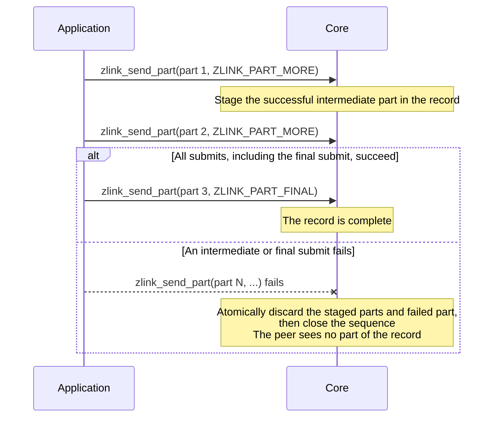

[한국어](https://zlink-systems.github.io/zlink/ko/spec/core/socket/01-pair/) | English

<!-- zlink-nav:start -->
[Socket Index](README.en.md) | [Previous: Socket Overview](README.en.md) | [Next: PUB](02-pub.en.md)
<!-- zlink-nav:end -->

# Socket — PAIR

> **What this chapter defines** — The exclusive 1:1 connection behavior and public contract of a PAIR socket.

## 1. PAIR overview

PAIR is a bidirectional socket type in which two [socket](../glossary.en.md#socket) instances form an exclusive
1:1 connection and both sides send and receive messages. Because there is exactly one peer—the socket
at the other end of the connection—there is no input for selecting a destination peer, and a received
part has no source routing ID. PAIR has no type-specific options.

This document defines only the PAIR-specific contract: how the part send and receive functions behave
with PAIR, the asynchronous send rules for admission—the decision to accept a send request into the
Core send queue—and the absence of receive-flow state. It does not redefine contracts shared by all
socket types.

The following documents own the related contracts.

| Related contract | Defining document |
|---|---|
| socket creation, common options, send/recv flags, and result enums | [Socket Common](README.en.md) |
| send ownership, pending and completion bounds, and pull completion | [Socket Common](README.en.md) |
| message lifecycle, ownership, and multipart | [Message](../02-message.en.md) |
| result-to-errno mapping | [Errors](../03-errors.en.md#result-and-errno-mapping) |

## 2. Multipart sends and record atomicity

A PAIR socket submits a message one part at a time. Send a single-part message with
`ZLINK_PART_FINAL`. A [multipart](../02-message.en.md#4-multipart) message groups multiple parts into
one logical message: start it with `ZLINK_PART_MORE`, then continue through `ZLINK_PART_FINAL` on the
same thread, using the same function and the same `flags_`.

Core stages successful intermediate parts as one group until `ZLINK_PART_FINAL` succeeds. This group
is called a record. If any intermediate or final submit in an open sequence fails, Core atomically
discards the previously staged parts and the failed part, then closes the sequence. The peer sees no
part of that record.



The failed call also consumes its `part_` according to the consumption rules of
[`zlink_send_part`](#zlink_send_part), and the next submit starts the first part of a new record. A retry
therefore must resubmit the entire record from its first part using copies retained before the calls.

## 3. Receive flow state

[Socket Common](README.en.md) defines the receive-flow state and constants that DEALER and ROUTER
sockets use to notify a peer to pause or resume receiving.

PAIR is not a socket type that supports receive flow.
`zlink_socket_set_receive_flow_state()` returns `ZLINK_CONFIG_NOT_SUPPORTED` with `errno == ENOTSUP`
for a PAIR socket and changes nothing. The byte [HWM](../glossary.en.md#hwm) (the byte limit retained
by a queue), low water mark, and transport [backpressure](../glossary.en.md#backpressure) (restriction
on additional submissions by the sender) owned by [Socket Common](README.en.md) remain in effect. A
PAIR socket's monitor does not set `ZLINK_MONITOR_STATUS_DETAIL_FLOW_STATE` and does not emit
`ZLINK_EVENT_SEND_FLOW_PAUSED`, `ZLINK_EVENT_SEND_FLOW_RESUMED`, or
`ZLINK_EVENT_FLOW_STATE_STALE`.

## 4. Functions

### zlink_send_part

Sends one message part.

```c
ZLINK_EXPORT zlink_submit_result_t zlink_send_part (
  void *s_,
  zlink_msg_t *part_,
  zlink_send_flags_t flags_,
  zlink_part_flag_t part_flag_,
  void *user_context_,
  zlink_completion_id_t *completion_id_out_);
```

[Section 2](#2-multipart-sends-and-record-atomicity) defines single-part sends with
`ZLINK_PART_FINAL`, the rules for starting and continuing a multipart message, and record-level
atomicity.

This function consumes the content of `part_` on both success and failure. If the same content may be
needed again, copy it before the call. Initialize a consumed `zlink_msg_t` before reusing it. Pass
`ZLINK_SEND_FLAGS_NONE` or `ZLINK_SEND_FLAGS_DONTWAIT` in `flags_`. A `NONE FINAL` call snapshots
`SNDTIMEO` on entry, waits through local queue admission, and finishes with ID `0` and no
completion. A `DONTWAIT FINAL` call has ID `0` if admission is immediate; if Core retains it as
pending, it has a nonzero ID and produces one SEND completion. [Socket Common](README.en.md#part-send-and-pending-admission)
owns the exact optional ID-output and context rules.

**Returns:** `ZLINK_SUBMIT_OK` on success; otherwise a `zlink_submit_result_t` value that identifies
the cause. The full mapping follows the [errno map](../03-errors.en.md#result-and-errno-mapping).

**See also:** `zlink_recv_part`, `zlink_completion_recv`

---

### zlink_recv_part

Receives one message part.

```c
ZLINK_EXPORT zlink_recv_result_t zlink_recv_part (
  void *s_,
  const zlink_routing_id_t **source_rid_out_,
  zlink_msg_t *part_out_,
  zlink_part_flag_t *has_more_out_,
  zlink_recv_flags_t flags_);
```

`part_out_` must be an initialized message and is required together with `has_more_out_`.
`source_rid_out_` is optional and, when provided, receives `NULL` on success for PAIR. On success,
ownership of the received part transfers to the caller, which must call `zlink_msg_close(part_out_)`
exactly once. A failure before a part is received does not transfer ownership.

`*has_more_out_` is `ZLINK_PART_MORE` when another part follows and `ZLINK_PART_FINAL` for the last
part. Receive all parts of one multipart message on the same thread with this function, from the first
part through the last part. The normal path is to call it after observing `ZLINK_POLLIN` with a poller.
A `ZLINK_RECV_FLAGS_DONTWAIT` call with no available data returns `ZLINK_RECV_NO_DATA`
with `EAGAIN`.

**Returns:** `ZLINK_RECV_OK` on success; otherwise a `zlink_recv_result_t` value.

**See also:** `zlink_send_part`, `zlink_msg_close`

---

### PAIR logical route and reconnect

A PAIR socket has one logical route. If its physical connection disconnects while Core holds a
`DONTWAIT FINAL` as pending or while a `NONE FINAL` call waits for admission, the operation does
not terminate solely because of the disconnect. When the same PAIR logical route reconnects,
Core retries local queue admission while preserving FIFO. `NONE` uses only the remaining budget
from the `SNDTIMEO` snapshot.

After admission, Core keeps no separate replay copy of the application payload. Therefore, if the
connection disconnects after ID `0` or `ZLINK_SEND_ADMITTED` is established, Core does not send
the same record again on a new connection. Completion means local queue admission, not confirmation
that the peer received the record.

## 5. Implementation and contract-test verification requirements

Verify the following using only the public surface (`zlink_send_part`, `zlink_recv_part`,
`zlink_completion_recv`, `zlink_socket_set_receive_flow_state`, monitor observations, return values,
and errno). Each item maps to one test.

**1:1 send and receive**
- Both connected PAIR sockets can send with `zlink_send_part` and receive with `zlink_recv_part`.
- When `zlink_recv_part` succeeds, a caller that provides `source_rid_out_` receives `NULL`.
- After a successful receive, the caller owns the part and calls `zlink_msg_close(part_out_)` exactly once. A failure before a part is received does not transfer ownership.

**Part flow**
- When a single-part message is sent with `ZLINK_PART_FINAL`, the receiver observes `ZLINK_PART_FINAL` in `*has_more_out_`.
- For a multipart message, the receiver observes `ZLINK_PART_MORE` on every part before the last and `ZLINK_PART_FINAL` on the last part.
- If `DONTWAIT FINAL` is admitted immediately, it returns ID `0` and no completion. If Core retains it as pending, exactly one SEND completion is returned for its nonzero ID. If the pending or completion bound prevents retention, it returns `ZLINK_SUBMIT_BACKPRESSURED` with `EAGAIN` and ID `0`.
- A `ZLINK_RECV_FLAGS_DONTWAIT` receive with no available data returns `ZLINK_RECV_NO_DATA` with `EAGAIN`.

**Record atomicity**
- If any submit in an open multipart sequence fails, the peer receives no part of that record.
- Both successful and failed calls consume `part_`, including the failed call's `part_`; a consumed `zlink_msg_t` can be reused only after it is initialized again.
- The next submit after a failure starts the first part of a new record—the entire record retained before the calls can be resubmitted from its first part for a retry.

**Logical reconnect and completion**
- If the pending target disconnects before admission and the same PAIR logical route reconnects, the record is admitted in FIFO order and the disconnect alone does not produce a TERMINAL completion.
- `NONE FINAL` waits for reconnect of the same logical route within the snapshotted `SNDTIMEO`; expiration returns `ZLINK_SUBMIT_BACKPRESSURED` with `EAGAIN`, ID `0`, and no completion.
- Disconnecting and reconnecting after ID `0` or `ZLINK_SEND_ADMITTED` does not replay the same application record.

**Absence of receive flow state**
- `zlink_socket_set_receive_flow_state()` returns `ZLINK_CONFIG_NOT_SUPPORTED` with `errno == ENOTSUP` for a PAIR socket, while byte HWM, low water mark, and transport backpressure behavior remain in effect.
- A PAIR socket's monitor status does not set `ZLINK_MONITOR_STATUS_DETAIL_FLOW_STATE`.
- A PAIR socket does not emit `ZLINK_EVENT_SEND_FLOW_PAUSED`, `ZLINK_EVENT_SEND_FLOW_RESUMED`, or `ZLINK_EVENT_FLOW_STATE_STALE` events.

[Socket Common](README.en.md) owns verification of ownership transfer, pending and completion
bounds, close, and pull completion.
