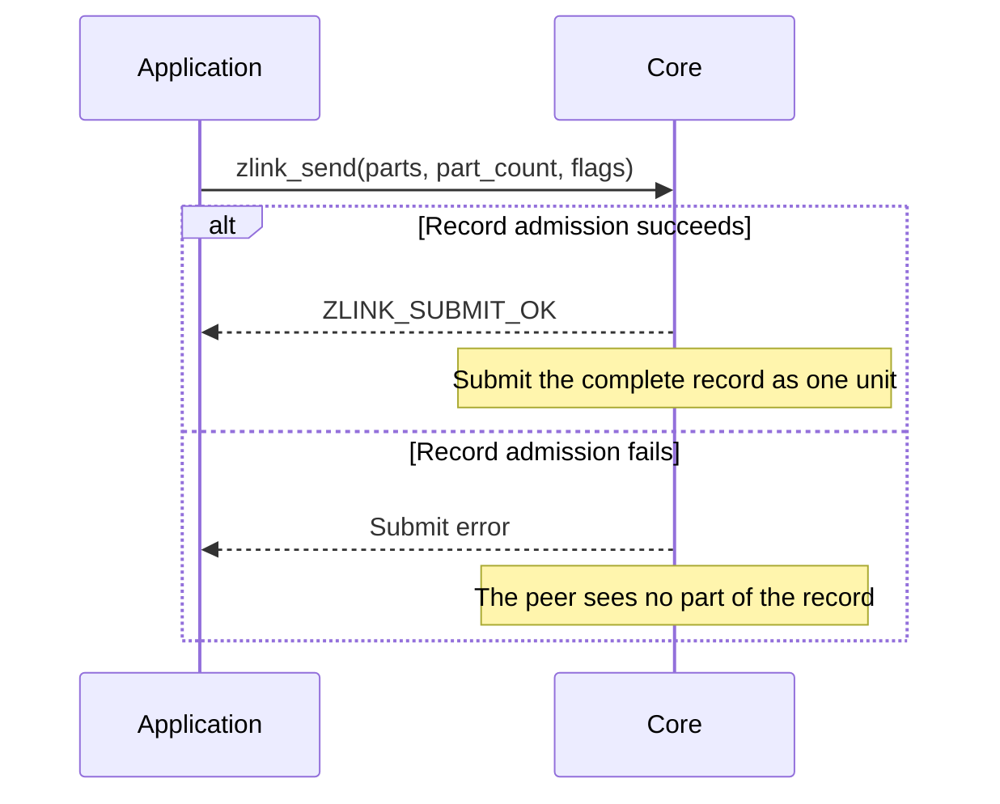

[한국어](https://zlink-systems.github.io/zlink/ko/spec/core/socket/01-pair/) | English

<!-- zlink-nav:start -->
[Socket Index](README.en.md) | [Previous: Socket Overview](README.en.md) | [Next: PUB](02-pub.en.md)
<!-- zlink-nav:end -->

# Socket — PAIR

> **What this chapter defines** — The exclusive 1:1 connection behavior and public contract of a PAIR socket.

## 1. PAIR overview

PAIR is a bidirectional socket type in which two [socket](../glossary.en.md#socket) instances form an exclusive
1:1 connection and both sides send and receive messages. Because there is exactly one peer—the socket
at the other end of the connection—there is no input for selecting a destination peer, and a received
record has no source routing ID. PAIR has no type-specific options.

This document defines only the PAIR-specific contract: how the whole-message send and receive functions behave
with PAIR, the asynchronous send rules for admission—the decision to accept a send request into the
Core send queue—and the absence of receive-flow state. It does not redefine contracts shared by all
socket types.

The following documents own the related contracts.

| Related contract | Defining document |
|---|---|
| socket creation, common options, send/recv flags, and result enums | [Socket Common](README.en.md) |
| send ownership, completion reservation bounds, and pull completion | [Socket Common](README.en.md) |
| message lifecycle, ownership, and multipart | [Message](../02-message.en.md) |
| result-to-errno mapping | [Errors](../03-errors.en.md#result-and-errno-mapping) |

## 2. Whole-message sends and record atomicity

A PAIR socket passes a `parts_` array and `part_count_` to one `zlink_send()` call to submit one
record. The part order of a [multipart](../02-message.en.md#4-multipart) message is the array order.
A single-part message uses an array of length one.

Core admits the complete record atomically. If the call fails, the peer sees none of its parts and
the caller must resubmit the complete record from a retained copy. Every input slot is consumed on
both success and failure and is left as an initialized empty message.



PAIR receive uses [`zlink_recv`](README.en.md#zlink_recv-and-zlink_router_recv) to receive a complete
record in one call. Because there is exactly one peer, the source routing ID is `NULL`. Ownership,
close, capacity, and record-atomicity rules are owned by [Socket Common](README.en.md).

## 3. Receive flow state

[Socket Common](README.en.md) defines the receive-flow state and constants that DEALER and ROUTER
sockets use to notify a peer to pause or resume receiving.

PAIR is not a socket type that supports receive flow.
`zlink_socket_set_receive_flow_state()` returns `ZLINK_CONFIG_NOT_SUPPORTED` with `errno == ENOTSUP`
for a PAIR socket and changes nothing. The byte [HWM](../glossary.en.md#hwm) (the byte limit retained
by a queue), low water mark, and transport [backpressure](../glossary.en.md#backpressure) (restriction
on additional submissions by the sender) owned by [Socket Common](README.en.md) remain in effect. A
PAIR socket's monitor does not report receive-flow state —
[§5 ("Absence of receive flow state")](#5-implementation-and-contract-test-verification-requirements)
lists the observable detail.

## 4. Functions

### zlink_send

Sends one message record.

```c
ZLINK_EXPORT zlink_submit_result_t zlink_send (
  void *s_, zlink_msg_t *parts_, size_t part_count_,
  zlink_send_flags_t flags_, void *user_context_,
  zlink_completion_id_t *completion_id_out_);
```

The `parts_` array and `part_count_` form the record. This function consumes every input slot on both
success and failure. Retain a copy of the complete record before the call if it may be needed again.
`part_count_ == 0` returns `ZLINK_SUBMIT_INVALID_ARGUMENT` with `EINVAL`. Pass
`ZLINK_SEND_FLAGS_NONE` or `ZLINK_SEND_FLAGS_DONTWAIT` in `flags_`. `NONE` snapshots `SNDTIMEO` on
entry and waits through local queue admission; `DONTWAIT` does not wait. [Socket Common](README.en.md#whole-message-send-and-pending-admission)
owns the exact optional ID-output and context rules.

**Returns:** `ZLINK_SUBMIT_OK` on success; otherwise a `zlink_submit_result_t` value that identifies
the cause. The full mapping follows the [errno map](../03-errors.en.md#result-and-errno-mapping).

**See also:** `zlink_recv`, `zlink_completion_recv`

---

### zlink_recv

Receives one message record.

```c
ZLINK_EXPORT zlink_recv_result_t zlink_recv (
  void *s_,
  const zlink_routing_id_t **source_rid_out_,
  zlink_msg_t *parts_out_,
  size_t parts_capacity_,
  size_t *part_count_out_,
  zlink_recv_flags_t flags_);
```

`parts_out_` and `part_count_out_` are required, and the array slots need not be initialized.
`source_rid_out_` is optional and receives `NULL` on success. On success, ownership of the leading
`*part_count_out_` slots transfers to the caller, which closes them exactly once with
`zlink_multipart_close(parts_out_, *part_count_out_)`.

If `parts_capacity_` is smaller than the record's part count, the record is not consumed, the needed
count is written to `*part_count_out_`, and the call returns `ZLINK_RECV_BUFFER_TOO_SMALL` with
`ENOBUFS`. Retrying with a large enough array receives the same record. A
`ZLINK_RECV_FLAGS_DONTWAIT` call with no available record returns `ZLINK_RECV_NO_DATA` with `EAGAIN`.

**Returns:** `ZLINK_RECV_OK` on success; otherwise a `zlink_recv_result_t` value.

**See also:** `zlink_send`, `zlink_msg_close`

---

### PAIR logical route and reconnect

A PAIR socket has one logical route. A `DONTWAIT` send makes exactly one admission attempt. If
it is admitted immediately, the result is `ZLINK_SUBMIT_OK` with ID `0`, and no completion is
produced. If HWM or byte credit prevents admission, or the physical connection is not ready yet,
the call returns `ZLINK_SUBMIT_BACKPRESSURED` with `errno == EAGAIN` and a nonzero wait token in
`completion_id_out_`. Core retains only the token, the target, and `user_context_`; it does not
retain the payload, so the caller resubmits its own retained copy of the record.

When the single pipe regains write credit (peer drain, or pipe attach on reconnect), Core publishes
exactly one `ZLINK_COMPLETION_WRITABLE` record for that token. The record carries the same
`completion_id`, the same `user_context`, `send_result == ZLINK_SEND_ADMITTED`,
`send_terminal_errno == 0`, and an empty `peer_rid`. While an unread WRITABLE record exists,
`ZLINK_POLLOUT` and `ZLINK_POLLCOMPLETION` are both level-held. The application drains the queue
with `zlink_completion_recv()` until `NO_DATA`, then resubmits the same record with `DONTWAIT`.

A wait token ends only in one of these ways: the WRITABLE record above; a WRITABLE record with
`send_result == ZLINK_SEND_TERMINAL` and `send_terminal_errno == ENOENT` when the endpoint is
explicitly removed with `zlink_disconnect()`; or socket close or context termination, where Core
ends the token internally and delivers no record. A physical disconnect alone does not
end the token; when the same logical route reconnects, the pipe attach publishes the WRITABLE
record. A `NONE` send that waits for admission does not terminate solely because of a
physical disconnect. When the same PAIR logical route reconnects, Core retries local queue
admission, and `NONE` uses only the remaining budget from the `SNDTIMEO` snapshot.

After admission, Core keeps no separate replay copy of the application payload. Therefore, if the
connection disconnects after ID `0` is returned, Core does not send the same record again on a new
connection. ID `0` means local queue admission, not confirmation that the peer received the record.
A WRITABLE record is a write-credit notification, not admission of a record.

## 5. Implementation and contract-test verification requirements

Verify the following using only the public surface (`zlink_send`, `zlink_recv`,
`zlink_completion_recv`, `zlink_socket_set_receive_flow_state`, monitor observations, return values,
and errno). Each item maps to one test.

**1:1 send and receive**
- Both connected PAIR sockets can send with `zlink_send` and receive with `zlink_recv`.
- When `zlink_recv` succeeds, a caller that provides `source_rid_out_` receives `NULL`.
- After a successful receive, the caller owns the leading `*part_count_out_` slots and closes them exactly once with `zlink_multipart_close`. A failure does not transfer slot ownership.
- If `parts_capacity_` is smaller than the record's part count, the call returns `ZLINK_RECV_BUFFER_TOO_SMALL` with `ENOBUFS` and the needed count without consuming the record; retrying with a large enough array receives the same record.

**Whole-message send**
- Sending an array of length one produces a one-part record; sending a multipart array returns all parts to the receiver in the same order and in one call.
- If `DONTWAIT` is admitted immediately, it returns ID `0` and no completion.
- If `DONTWAIT` is refused because of HWM, byte credit, or a pipe that is not ready, it returns `ZLINK_SUBMIT_BACKPRESSURED` with `EAGAIN` and a nonzero wait token; Core does not retain the payload, and the caller resubmits its retained complete record.
- When the single pipe gains write credit, exactly one `ZLINK_COMPLETION_WRITABLE` record (`ZLINK_SEND_ADMITTED`, the same `user_context`, empty `peer_rid`) is returned for that token, and `ZLINK_POLLOUT` and `ZLINK_POLLCOMPLETION` are level-held until it is read.
- If the completion reservations are exhausted so that no wait token can be created, the result is `ZLINK_SUBMIT_OUT_OF_MEMORY` with `ENOMEM` and ID `0`.
- A `ZLINK_RECV_FLAGS_DONTWAIT` receive with no available data returns `ZLINK_RECV_NO_DATA` with `EAGAIN`.

**Record atomicity and ownership**
- If a send fails, the peer receives no part of that record.
- Both successful and failed calls consume every `parts_` slot — after return each `zlink_msg_size` is `0`, and each slot can be closed or used for the next send without reinitialization.
- A failed record leaves no partial state; the complete record retained before the call can be resubmitted for retry.

**Logical reconnect and completion**
- If the connection disconnects while a wait token is live and the same PAIR logical route reconnects, the pipe attach publishes the WRITABLE record for that token, and the disconnect alone does not produce a TERMINAL record.
- A `NONE` send waits for reconnect of the same logical route within the snapshotted `SNDTIMEO`; expiration returns `ZLINK_SUBMIT_BACKPRESSURED` with `EAGAIN`, ID `0`, and no completion.
- Disconnecting and reconnecting after ID `0` does not replay the same application record; the retransmission after a WRITABLE record is a record the application submitted again.
- Removing the endpoint with `zlink_disconnect()` ends the token with a WRITABLE record carrying `ZLINK_SEND_TERMINAL` and `ENOENT`. After socket close no record for that token can be received — close ends the token internally and delivers no record.

**Absence of receive flow state**
- `zlink_socket_set_receive_flow_state()` returns `ZLINK_CONFIG_NOT_SUPPORTED` with `errno == ENOTSUP` for a PAIR socket, while byte HWM, low water mark, and transport backpressure behavior remain in effect.
- A PAIR socket's monitor status does not set `ZLINK_MONITOR_STATUS_DETAIL_FLOW_STATE`.
- A PAIR socket does not emit `ZLINK_EVENT_SEND_FLOW_PAUSED`, `ZLINK_EVENT_SEND_FLOW_RESUMED`, or `ZLINK_EVENT_FLOW_STATE_STALE` events.

[Socket Common](README.en.md) owns verification of ownership transfer, completion reservation
bounds, close, and pull completion.

<!-- zlink-nav:start -->
[Socket Index](README.en.md) | [Previous: Socket Overview](README.en.md) | [Next: PUB](02-pub.en.md)
<!-- zlink-nav:end -->
