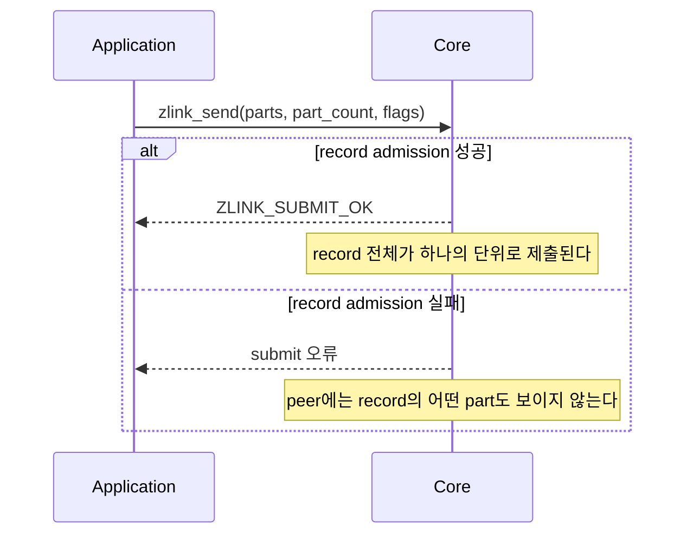

[English](https://zlink-systems.github.io/zlink/spec/core/socket/01-pair/) | 한국어

<!-- zlink-nav:start -->
[소켓 목차](README.ko.md) | [이전: 소켓 개요](README.ko.md) | [다음: PUB](02-pub.ko.md)
<!-- zlink-nav:end -->

# Socket — PAIR

> **이 장이 정의하는 것** — PAIR socket의 1:1 독점 연결 동작과 공개 계약.

## 1. PAIR 개요

PAIR는 두 [socket](../glossary.ko.md#socket)이 1:1로 독점 연결되어 양쪽 모두 message를
송수신하는 양방향 socket 타입이다. 연결의 반대쪽 socket인 peer가 정확히 하나이므로 어느
peer로 보낼지 고르는 입력이 없고, 수신 record의 source routing ID도 채워지지 않는다. PAIR에는
타입 전용 옵션이 없다.

이 문서는 PAIR 고유의 계약만 정의한다 — whole-message 송수신 함수가 PAIR에서 어떻게 동작하는지,
송신 요청을 Core 송신 queue에 받아들이는 판정인 admission의 비동기 송신 규칙, 그리고
receive-flow 상태가 없다는 사실이다. 모든 socket 타입이 공유하는 계약은 이 문서에서 다시
정의하지 않는다.

관련 계약의 소유 문서는 다음과 같다.

| 관련 계약 | 정의하는 문서 |
|---|---|
| socket 생성·공통 옵션·send/recv flag·result enum | [Socket 공통](README.ko.md) |
| 송신 ownership, completion reservation 상한과 pull completion | [Socket 공통](README.ko.md) |
| message lifecycle·ownership과 multipart | [Message](../02-message.ko.md) |
| result와 errno 대응 | [Errors](../03-errors.ko.md#result와-errno-대응) |

## 2. Whole-message 송신과 record 원자성

PAIR socket은 `parts_` 배열과 `part_count_`를 한 번의 `zlink_send()` 호출에 넘겨 record 하나를
제출한다. [Multipart](../02-message.ko.md#4-multipart) message의 part 순서는 배열 순서와 같다.
단일 part message도 길이 1인 배열로 제출한다.

Core는 record 전체를 원자적으로 admission한다. 호출이 실패하면 어느 part도 peer에 보이지 않으며,
caller가 보관한 record 전체를 다시 제출해야 한다. 성공·실패와 관계없이 모든 입력 슬롯은 소비되어
초기화된 빈 message가 된다.



PAIR 수신은 [`zlink_recv`](README.ko.md#zlink_recv-와-zlink_router_recv)로 record 전체를 한 번에
받는다. Peer가 하나뿐이므로 source routing ID는 `NULL`이다. 소유권·close·capacity·record 원자성
규칙은 [Socket 공통](README.ko.md)이 소유한다.

## 3. Receive flow state

DEALER와 ROUTER socket이 peer에게 수신 중단·재개를 알리는 receive-flow 상태와 그 상수는
[Socket 공통](README.ko.md)이 정의한다.

PAIR은 receive-flow 대상 socket type이 아니다.
`zlink_socket_set_receive_flow_state()`는 PAIR socket에 대해 `errno == ENOTSUP`과 함께
`ZLINK_CONFIG_NOT_SUPPORTED`를 반환하고 아무것도 바꾸지 않는다.
[Socket 공통](README.ko.md)이 소유하는 byte [HWM](../glossary.ko.md#hwm)(queue 보관 byte
상한), low water mark와 transport [backpressure](../glossary.ko.md#backpressure)(sender의 추가
제출 제한)는 그대로 유지된다. PAIR socket의 monitor는 receive-flow 상태를 보고하지 않는다 —
관찰 가능한 세부 항목은
[§5 「Receive flow state 부재」](#5-구현-및-contract-test-검증-요구)가 정리한다.

## 4. 함수

### zlink_send

message record 하나를 전송한다.

```c
ZLINK_EXPORT zlink_submit_result_t zlink_send (
  void *s_, zlink_msg_t *parts_, size_t part_count_,
  zlink_send_flags_t flags_, void *user_context_,
  zlink_completion_id_t *completion_id_out_);
```

`parts_` 배열과 `part_count_`가 record를 구성한다. 함수는 성공과 실패 모두에서 모든 입력 슬롯을
소비한다. 같은 내용을 다시 사용할 가능성이 있으면 호출 전에 record 전체를 복사해야 한다.
`part_count_ == 0`은 `ZLINK_SUBMIT_INVALID_ARGUMENT`+`EINVAL`이다. `flags_`에는
`ZLINK_SEND_FLAGS_NONE` 또는 `ZLINK_SEND_FLAGS_DONTWAIT`를 전달한다. `NONE`은 호출 진입 시
`SNDTIMEO`를 snapshot해 local queue admission까지 기다리고, `DONTWAIT`은 기다리지 않는다.
Optional ID output과 context의 정확한 규칙은
[Socket 공통](README.ko.md#whole-message-send와-pending-admission)을 따른다.

**반환값:** 성공 시 `ZLINK_SUBMIT_OK`, 실패 시 원인을 나타내는 `zlink_submit_result_t` 값.
전체 대응은 [errno map](../03-errors.ko.md#result와-errno-대응)을 따른다.

**참고:** `zlink_recv`, `zlink_completion_recv`

---

### zlink_recv

message record 하나를 수신한다.

```c
ZLINK_EXPORT zlink_recv_result_t zlink_recv (
  void *s_,
  const zlink_routing_id_t **source_rid_out_,
  zlink_msg_t *parts_out_,
  size_t parts_capacity_,
  size_t *part_count_out_,
  zlink_recv_flags_t flags_);
```

`parts_out_`과 `part_count_out_`은 필수이고, 배열 슬롯은 미리 초기화할 필요가 없다.
`source_rid_out_`은 선택 사항이며 성공 시 `NULL`을 받는다. 성공하면 앞의
`*part_count_out_`개 슬롯의 소유권이 caller에게 이전된다. Caller는
`zlink_multipart_close(parts_out_, *part_count_out_)`로 이를 정확히 한 번 닫는다.

`parts_capacity_`가 record의 part 수보다 작으면 record를 소비하지 않고 필요한 수를
`*part_count_out_`에 쓴 뒤 `ZLINK_RECV_BUFFER_TOO_SMALL`+`ENOBUFS`를 반환한다. 충분한 배열로
재시도하면 같은 record를 받는다. `ZLINK_RECV_FLAGS_DONTWAIT` 호출에 수신할 record가 없으면
`ZLINK_RECV_NO_DATA`+`EAGAIN`이다.

**반환값:** 성공 시 `ZLINK_RECV_OK`, 실패 시 `zlink_recv_result_t` 값.

**참고:** `zlink_send`, `zlink_msg_close`

---

### PAIR의 논리 route와 reconnect

PAIR socket에는 단일 logical route가 있다. `DONTWAIT` 송신은 admission을 한 번만 시도한다.
즉시 admission되면 `ZLINK_SUBMIT_OK`, ID `0`이며 completion을 만들지 않는다. HWM·byte credit
때문에 admission하지 못하거나 물리 connection이 아직 준비되지 않았으면
`ZLINK_SUBMIT_BACKPRESSURED`, `errno == EAGAIN`과 함께 nonzero wait token을
`completion_id_out_`에 반환한다. Core는 token, target, `user_context_`만 유지하고 payload는
유지하지 않으므로 호출자는 보관한 record 사본을 다시 제출해야 한다.

단일 pipe에 write credit이 다시 생기면(peer drain, reconnect로 인한 pipe attach) Core는 그
token으로 `ZLINK_COMPLETION_WRITABLE` record를 정확히 하나 발행한다. 이 record는 같은
`completion_id`, 같은 `user_context`, `send_result == ZLINK_SEND_ADMITTED`,
`send_terminal_errno == 0`, 빈 `peer_rid`를 가진다. 읽지 않은 WRITABLE record가 있는 동안
`ZLINK_POLLOUT`과 `ZLINK_POLLCOMPLETION`은 level로 유지된다. Application은
`zlink_completion_recv()`로 `NO_DATA`까지 queue를 비운 뒤 같은 record를 `DONTWAIT`로 다시
제출한다.

Wait token은 다음 중 하나로만 끝난다: 위 WRITABLE record, `zlink_disconnect()`로 endpoint를
명시적으로 제거할 때의 WRITABLE record(`send_result == ZLINK_SEND_TERMINAL`,
`send_terminal_errno == ENOENT`), 또는 socket close·context 종료 — 이때 Core는 token을 내부에서
끝내며 record를 전달하지 않는다. 물리 connection이 끊기는 것만으로는 token이 끝나지
않으며, 같은 logical route가 다시 연결되면 pipe attach가 WRITABLE record를 발행한다. `NONE`
송신이 admission을 기다리는 동안 물리 connection이 끊겨도 terminal로 끝내지 않는다. Core는
같은 PAIR logical route가 다시 연결되면 local queue admission을 다시 시도하며, `NONE`은
snapshot한 `SNDTIMEO`의 남은 budget만 사용한다.

Admission 뒤에는 application payload의 별도 replay copy를 유지하지 않는다. 따라서 ID `0`이
반환된 뒤 connection이 끊겨도 새 connection에 같은 record를 다시 보내지 않는다. ID `0`은 local
queue admission을 뜻하며 peer 수신 확인이 아니다. WRITABLE record는 write credit 알림이며
record의 admission이 아니다.

## 5. 구현 및 contract test 검증 요구

공개 표면(`zlink_send`·`zlink_recv`·`zlink_completion_recv`,
`zlink_socket_set_receive_flow_state`, monitor 관찰, 반환값·errno)만으로 다음을 확인한다.
각 항목은 test 하나로 이어진다.

**1:1 송수신**
- 연결된 PAIR socket 양쪽 모두 `zlink_send`로 송신하고 `zlink_recv`로 수신할 수 있다.
- `zlink_recv`가 성공하면 `source_rid_out_`을 전달한 호출자는 `NULL`을 받는다.
- 성공한 수신 뒤 앞의 `*part_count_out_`개 슬롯은 caller가 소유하며 `zlink_multipart_close`로 정확히 한 번 닫는다. 실패하면 슬롯 소유권은 이전되지 않는다.
- `parts_capacity_`가 record의 part 수보다 작으면 `ZLINK_RECV_BUFFER_TOO_SMALL`+`ENOBUFS`와 필요한 수를 반환하고 record를 소비하지 않으며, 충분한 배열로 재시도하면 같은 record를 받는다.

**Whole-message 송신**
- 길이 1인 배열을 보내면 수신 측은 part 하나인 record를 받고, multipart 배열을 보내면 같은 순서의 모든 part를 한 번에 받는다.
- `DONTWAIT`이 즉시 admission되면 ID `0`과 completion 없음이다.
- `DONTWAIT`이 HWM·byte credit 또는 준비되지 않은 pipe 때문에 거절되면 `ZLINK_SUBMIT_BACKPRESSURED`+`EAGAIN`과 nonzero wait token이며, Core는 payload를 유지하지 않고 호출자가 보관한 record 전체를 다시 제출한다.
- 단일 pipe에 write credit이 생기면 그 token의 `ZLINK_COMPLETION_WRITABLE` record(`ZLINK_SEND_ADMITTED`, 같은 `user_context`, 빈 `peer_rid`)를 정확히 한 번 반환하고, 읽기 전까지 `ZLINK_POLLOUT`과 `ZLINK_POLLCOMPLETION`이 level로 유지된다.
- Completion reservation이 소진되어 wait token을 만들지 못하면 `ZLINK_SUBMIT_OUT_OF_MEMORY`+`ENOMEM`, ID `0`이다.
- `ZLINK_RECV_FLAGS_DONTWAIT` 수신에 데이터가 없으면 `ZLINK_RECV_NO_DATA`와 `EAGAIN`을 반환한다.

**Record 원자성과 ownership**
- 송신이 실패하면 peer는 그 record의 어떤 part도 수신하지 않는다.
- 성공·실패 모두에서 모든 `parts_` 슬롯은 소비된다 — 반환 뒤 각 `zlink_msg_size`는 `0`이고, 각 슬롯은 다시 초기화하지 않고 close하거나 다음 send에 쓸 수 있다.
- 실패한 record는 부분 상태 없이 끝나며, 호출 전에 보관한 record 전체를 다시 제출해 재시도할 수 있다.

**Logical reconnect와 completion**
- Wait token이 있는 상태에서 connection을 끊었다가 같은 PAIR logical route를 reconnect하면
  pipe attach가 그 token의 WRITABLE record를 발행하고, disconnect만으로 TERMINAL record가
  생기지 않는다.
- `NONE` 송신은 snapshot한 `SNDTIMEO` 안에서 같은 logical route의 reconnect를 기다리며,
  만료하면 `ZLINK_SUBMIT_BACKPRESSURED`+`EAGAIN`, ID `0`, completion 없음이다.
- ID `0` 뒤 connection을 끊고 다시 연결해도 같은 application record가 replay되지 않으며,
  WRITABLE record 뒤의 재전송은 application이 다시 제출한 record다.
- `zlink_disconnect()`로 endpoint를 제거하면 그 token은 `ZLINK_SEND_TERMINAL`+`ENOENT`인
  WRITABLE record로 끝난다. socket close 뒤에는 그 token의 record를 받을 수 없다 — close가 token을 내부에서 끝내고 record를 전달하지 않는다.

**Receive flow state 부재**
- `zlink_socket_set_receive_flow_state()`는 PAIR socket에 대해 `errno == ENOTSUP`과 함께 `ZLINK_CONFIG_NOT_SUPPORTED`를 반환하고, byte HWM·low water mark·transport backpressure 동작은 그대로 유지된다.
- PAIR socket의 monitor status는 `ZLINK_MONITOR_STATUS_DETAIL_FLOW_STATE`를 설정하지 않는다.
- PAIR socket에서는 `ZLINK_EVENT_SEND_FLOW_PAUSED`, `ZLINK_EVENT_SEND_FLOW_RESUMED`, `ZLINK_EVENT_FLOW_STATE_STALE` event가 발생하지 않는다.

소유권 이전, completion reservation 상한, close와 pull completion의 검증은
[Socket 공통](README.ko.md)이 소유한다.

<!-- zlink-nav:start -->
[소켓 목차](README.ko.md) | [이전: 소켓 개요](README.ko.md) | [다음: PUB](02-pub.ko.md)
<!-- zlink-nav:end -->
