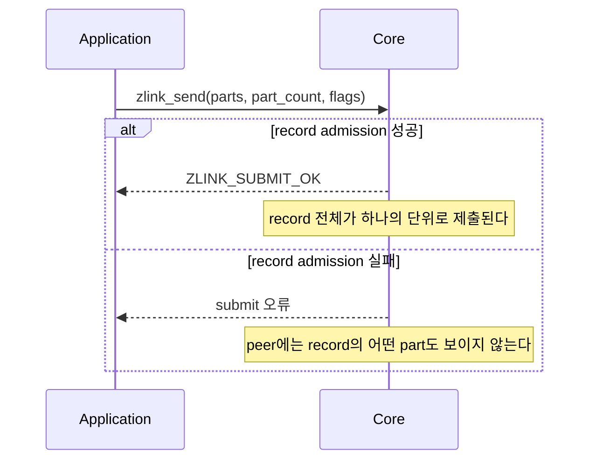

[English](01-pair.en.md) | 한국어

<!-- zlink-nav:start -->
[소켓 목차](README.ko.md) | [이전: 소켓 개요](README.ko.md) | [다음: PUB](02-pub.ko.md)
<!-- zlink-nav:end -->

# Socket — PAIR

> **이 장이 정의하는 것** — PAIR socket의 1:1 독점 연결 동작과 공개 계약.

## 1. PAIR 개요

PAIR는 두 [socket](../glossary.ko.md#socket)이 1:1로 독점 연결되어 양쪽 모두 message를
송수신하는 양방향 socket 타입이다. 연결의 반대쪽 socket인 peer가 정확히 하나이므로 어느
peer로 보낼지 고르는 입력이 없고, 수신 record의 source routing ID도 채워지지 않는다. PAIR에는
타입 전용 옵션이 없다.

이 문서는 PAIR 고유의 계약만 정의한다 — whole-message 송수신 함수가 PAIR에서 어떻게 동작하는지,
송신 요청을 Core 송신 queue에 받아들이는 판정인 admission의 비동기 송신 규칙, 그리고
receive-flow 상태가 없다는 사실이다. 모든 socket 타입이 공유하는 계약은 이 문서에서 다시
정의하지 않는다.

관련 계약의 소유 문서는 다음과 같다.

| 관련 계약 | 정의하는 문서 |
|---|---|
| socket 생성·공통 옵션·send/recv flag·result enum | [Socket 공통](README.ko.md) |
| 송신 ownership, completion reservation 상한과 pull completion | [Socket 공통](README.ko.md) |
| message lifecycle·ownership과 multipart | [Message](../02-message.ko.md) |
| result와 errno 대응 | [Errors](../03-errors.ko.md#result와-errno-대응) |

## 2. Whole-message 송신과 record 원자성

PAIR socket은 `parts_` 배열과 `part_count_`를 한 번의 `zlink_send()` 호출에 넘겨 record 하나를
제출한다. [Multipart](../02-message.ko.md#4-multipart) message의 part 순서는 배열 순서와 같다.
단일 part message도 길이 1인 배열로 제출한다.

Record 원자성, 입력 슬롯 소비와 실패 뒤 전체 record 재제출은 [Socket 공통 whole-message send](README.ko.md#whole-message-send와-pending-admission)를 따른다.



PAIR 수신은 [`zlink_recv`](README.ko.md#zlink_recv-와-zlink_router_recv)로 record 전체를 한 번에
받는다. Peer가 하나뿐이므로 source routing ID는 `NULL`이다. 소유권·close·capacity·record 원자성
규칙은 [Socket 공통](README.ko.md)이 소유한다.

## 3. Receive flow state

DEALER와 ROUTER socket이 peer에게 수신 중단·재개를 알리는 receive-flow 상태와 그 상수는
[Socket 공통](README.ko.md)이 정의한다.

PAIR은 receive-flow 대상 socket type이 아니다.
`zlink_socket_set_receive_flow_state()`는 PAIR socket에 대해 `errno == ENOTSUP`과 함께
`ZLINK_CONFIG_NOT_SUPPORTED`를 반환하고 아무것도 바꾸지 않는다.
[Socket 공통](README.ko.md)이 소유하는 byte [HWM](../glossary.ko.md#hwm)(queue 보관 byte
상한), low water mark와 transport [backpressure](../glossary.ko.md#backpressure)(sender의 추가
제출 제한)는 그대로 유지된다. PAIR socket의 monitor는 receive-flow 상태를 보고하지 않는다 —
관찰 가능한 세부 항목은
[§5 「Receive flow state 부재」](#5-구현-및-contract-test-검증-요구)가 정리한다.

## 4. 함수

### zlink_send

message record 하나를 전송한다.

```c
ZLINK_EXPORT zlink_submit_result_t zlink_send (
  void *s_, zlink_msg_t *parts_, size_t part_count_,
  zlink_send_flags_t flags_, void *user_context_,
  zlink_completion_id_t *completion_id_out_);
```

`parts_` 배열과 `part_count_`가 record를 구성한다. 함수는 성공과 실패 모두에서 모든 입력 슬롯을
소비한다. 같은 내용을 다시 사용할 가능성이 있으면 호출 전에 record 전체를 복사해야 한다.
`part_count_ == 0`은 `ZLINK_SUBMIT_INVALID_ARGUMENT`+`EINVAL`이다. `flags_`에는
`ZLINK_SEND_FLAGS_NONE` 또는 `ZLINK_SEND_FLAGS_DONTWAIT`를 전달한다. `NONE`은 호출 진입 시
`SNDTIMEO`를 snapshot해 local queue admission까지 기다리고, `DONTWAIT`은 기다리지 않는다.
Optional ID output과 context의 정확한 규칙은
[Socket 공통](README.ko.md#whole-message-send와-pending-admission)을 따른다.

**반환값:** 성공 시 `ZLINK_SUBMIT_OK`, 실패 시 원인을 나타내는 `zlink_submit_result_t` 값.
전체 대응은 [errno map](../03-errors.ko.md#result와-errno-대응)을 따른다.

**참고:** `zlink_recv`, `zlink_completion_recv`

---

### zlink_recv

message record 하나를 수신한다.

```c
ZLINK_EXPORT zlink_recv_result_t zlink_recv (
  void *s_,
  const zlink_routing_id_t **source_rid_out_,
  zlink_msg_t *parts_out_,
  size_t parts_capacity_,
  size_t *part_count_out_,
  zlink_recv_flags_t flags_);
```

`parts_out_`과 `part_count_out_`은 필수이고, 배열 슬롯은 미리 초기화할 필요가 없다.
`source_rid_out_`은 선택 사항이며 성공 시 `NULL`을 받는다. 성공하면 앞의
`*part_count_out_`개 슬롯의 소유권이 caller에게 이전된다. Caller는
`zlink_multipart_close(parts_out_, *part_count_out_)`로 이를 정확히 한 번 닫는다.

`parts_capacity_`가 record의 part 수보다 작으면 record를 소비하지 않고 필요한 수를
`*part_count_out_`에 쓴 뒤 `ZLINK_RECV_BUFFER_TOO_SMALL`+`ENOBUFS`를 반환한다. 충분한 배열로
재시도하면 같은 record를 받는다. `ZLINK_RECV_FLAGS_DONTWAIT` 호출에 수신할 record가 없으면
`ZLINK_RECV_NO_DATA`+`EAGAIN`이다.

**반환값:** 성공 시 `ZLINK_RECV_OK`, 실패 시 `zlink_recv_result_t` 값.

**참고:** `zlink_send`, `zlink_msg_close`

---

### PAIR의 논리 route와 reconnect

PAIR의 SEND target은 물리 pipe가 바뀌어도 단일 logical route다. Reconnect 후 pipe attach는 이 route의 대기 토큰에 대한 wake edge다. SEND 결과, WRITABLE 재제출, token 수명과 replay 금지는 [Socket 공통 whole-message send](README.ko.md#whole-message-send와-pending-admission)를 따른다.

## 5. 구현 및 contract test 검증 요구

공개 표면(`zlink_send`·`zlink_recv`·`zlink_completion_recv`,
`zlink_socket_set_receive_flow_state`, monitor 관찰, 반환값·errno)만으로 다음을 확인한다.
각 항목은 test 하나로 이어진다.

**1:1 송수신**
- 연결된 PAIR socket 양쪽 모두 `zlink_send`로 송신하고 `zlink_recv`로 수신할 수 있다.
- `zlink_recv`가 성공하면 `source_rid_out_`을 전달한 호출자는 `NULL`을 받는다.
- 성공한 수신 뒤 앞의 `*part_count_out_`개 슬롯은 caller가 소유하며 `zlink_multipart_close`로 정확히 한 번 닫는다. 실패하면 슬롯 소유권은 이전되지 않는다.
- `parts_capacity_`가 record의 part 수보다 작으면 `ZLINK_RECV_BUFFER_TOO_SMALL`+`ENOBUFS`와 필요한 수를 반환하고 record를 소비하지 않으며, 충분한 배열로 재시도하면 같은 record를 받는다.

**Whole-message 송신과 ownership**
- PAIR SEND의 결과·record 원자성·입력 소비·WRITABLE 재제출 검증은 [Socket 공통 whole-message send](README.ko.md#whole-message-send와-pending-admission)를 참조한다.

**Logical reconnect와 completion**
- Wait token이 있는 상태에서 connection을 끊었다가 같은 PAIR logical route를 reconnect하면
  pipe attach가 그 token의 WRITABLE record를 발행하고, disconnect만으로 TERMINAL record가
  생기지 않는다.
- `NONE` 송신은 snapshot한 `SNDTIMEO` 안에서 같은 logical route의 reconnect를 기다리며,
  만료하면 `ZLINK_SUBMIT_BACKPRESSURED`+`EAGAIN`, ID `0`, completion 없음이다.
- ID `0` 뒤 connection을 끊고 다시 연결해도 같은 application record가 replay되지 않으며,
  WRITABLE record 뒤의 재전송은 application이 다시 제출한 record다.
- `zlink_disconnect()`로 endpoint를 제거하면 그 token은 `ZLINK_SEND_TERMINAL`+`ENOENT`인
  WRITABLE record로 끝난다. socket close 뒤에는 그 token의 record를 받을 수 없다 — close가 token을 내부에서 끝내고 record를 전달하지 않는다.

**Receive flow state 부재**
- `zlink_socket_set_receive_flow_state()`는 PAIR socket에 대해 `errno == ENOTSUP`과 함께 `ZLINK_CONFIG_NOT_SUPPORTED`를 반환하고, byte HWM·low water mark·transport backpressure 동작은 그대로 유지된다.
- PAIR socket의 monitor status는 `ZLINK_MONITOR_STATUS_DETAIL_FLOW_STATE`를 설정하지 않는다.
- PAIR socket에서는 `ZLINK_EVENT_SEND_FLOW_PAUSED`, `ZLINK_EVENT_SEND_FLOW_RESUMED`, `ZLINK_EVENT_FLOW_STATE_STALE` event가 발생하지 않는다.

소유권 이전, completion reservation 상한, close와 pull completion의 검증은
[Socket 공통](README.ko.md)이 소유한다.

<!-- zlink-nav:start -->
[소켓 목차](README.ko.md) | [이전: 소켓 개요](README.ko.md) | [다음: PUB](02-pub.ko.md)
<!-- zlink-nav:end -->
