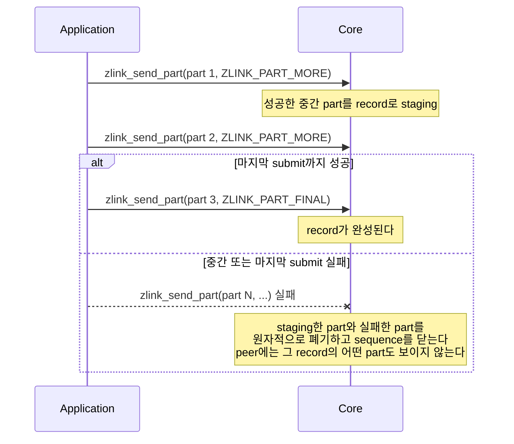

[English](https://zlink-systems.github.io/zlink/spec/core/socket/01-pair/) | 한국어

<!-- zlink-nav:start -->
[소켓 목차](README.ko.md) | [이전: 소켓 개요](README.ko.md) | [다음: PUB](02-pub.ko.md)
<!-- zlink-nav:end -->

# Socket — PAIR

> **이 장이 정의하는 것** — PAIR socket의 1:1 독점 연결 동작과 공개 계약.

## 1. PAIR 개요

PAIR는 두 [socket](../glossary.ko.md#socket)이 1:1로 독점 연결되어 양쪽 모두 message를
송수신하는 양방향 socket 타입이다. 연결의 반대쪽 socket인 peer가 정확히 하나이므로 어느
peer로 보낼지 고르는 입력이 없고, 수신 part의 source routing ID도 채워지지 않는다. PAIR에는
타입 전용 옵션이 없다.

이 문서는 PAIR 고유의 계약만 정의한다 — part 송수신 함수가 PAIR에서 어떻게 동작하는지,
송신 요청을 Core 송신 queue에 받아들이는 판정인 admission의 비동기 송신 규칙, 그리고
receive-flow 상태가 없다는 사실이다. 모든 socket 타입이 공유하는 계약은 이 문서에서 다시
정의하지 않는다.

관련 계약의 소유 문서는 다음과 같다.

| 관련 계약 | 정의하는 문서 |
|---|---|
| socket 생성·공통 옵션·send/recv flag·result enum | [Socket 공통](README.ko.md) |
| 비동기 송신의 소유권 이전·pending 상한·timeout·취소·close fail-fast·callback 규칙 | [Socket 공통](README.ko.md) |
| message lifecycle·ownership과 multipart | [Message](../02-message.ko.md) |
| result와 errno 대응 | [Errors](../03-errors.ko.md#result와-errno-대응) |

## 2. Multipart 송신과 record 원자성

PAIR socket은 message를 part 단위로 제출한다. 단일 part message는 `ZLINK_PART_FINAL`로
전송한다. 여러 part를 하나의 논리적 message로 묶는
[multipart](../02-message.ko.md#4-multipart) message는 `ZLINK_PART_MORE`로 시작해 같은
thread에서 같은 함수와 같은 `flags_`를 사용하여 `ZLINK_PART_FINAL`까지 이어서 전송한다.

Core는 성공한 중간 part를 `ZLINK_PART_FINAL`이 성공할 때까지 하나의 묶음으로 staging한다.
이 묶음을 record라 한다. 열린 sequence에서 중간 또는 마지막 submit 하나라도 실패하면 Core는
이전에 staging한 part와 실패한 part를 원자적으로 폐기하고 sequence를 닫는다. peer에는 그
record의 어떤 part도 보이지 않는다.



실패한 호출의 `part_`도 [`zlink_send_part`](#zlink_send_part)의 소비 규칙대로 소비되며, 다음
submit은 새 record의 첫 part로 시작한다. 따라서 재시도하려면 호출 전에 보관한 전체 record를
첫 part부터 다시 제출해야 한다.

## 3. Receive flow state

DEALER와 ROUTER socket이 [completion lane](../glossary.ko.md#completion-progress-lane)으로
peer에게 수신 중단·재개를 알리는 receive-flow 상태와 그 상수는
[Socket 공통](README.ko.md)이 정의한다.

PAIR에는 paired DEALER/ROUTER completion lane이 없으므로 receive-flow 상태도 없다.
`zlink_socket_set_receive_flow_state()`는 PAIR socket에 대해 `errno == ENOTSUP`과 함께
`ZLINK_CONFIG_NOT_SUPPORTED`를 반환하고 아무것도 바꾸지 않는다.
[Socket 공통](README.ko.md)이 소유하는 byte [HWM](../glossary.ko.md#hwm)(queue 보관 byte
상한), low water mark와 transport [backpressure](../glossary.ko.md#backpressure)(sender의 추가
제출 제한)는 그대로 유지된다. PAIR socket의 monitor는
`ZLINK_MONITOR_STATUS_DETAIL_FLOW_STATE`를 설정하지 않고
`ZLINK_EVENT_SEND_FLOW_PAUSED`, `ZLINK_EVENT_SEND_FLOW_RESUMED`,
`ZLINK_EVENT_FLOW_STATE_STALE`를 발생시키지 않는다.

## 4. 함수

### zlink_send_part

message part 하나를 전송한다.

```c
ZLINK_EXPORT zlink_submit_result_t zlink_send_part (
  void *s_,
  zlink_msg_t *part_,
  zlink_send_flags_t flags_,
  zlink_part_flag_t part_flag_);
```

단일 part의 `ZLINK_PART_FINAL` 전송, multipart의 시작·연결 규칙과 record 단위 원자성은
[§2](#2-multipart-송신과-record-원자성)가 정의한다.

이 함수는 성공과 실패 모두에서 `part_`의 내용을 소비한다. 같은 내용을 다시 사용할 가능성이
있으면 호출 전에 복사해야 하며, 소비된 `zlink_msg_t`를 다시 사용하려면 먼저 초기화해야
한다. `flags_`에는 `ZLINK_SEND_FLAGS_NONE` 또는 `ZLINK_DONTWAIT`를 전달한다. non-blocking
호출이 즉시 진행할 수 없으면 `ZLINK_SUBMIT_BACKPRESSURED`를 반환한다.

**반환값:** 성공 시 `ZLINK_SUBMIT_OK`, 실패 시 원인을 나타내는 `zlink_submit_result_t` 값.
전체 대응은 [errno map](../03-errors.ko.md#result와-errno-대응)을 따른다.

**참고:** `zlink_recv_part`, `zlink_send_async`

---

### zlink_recv_part

message part 하나를 수신한다.

```c
ZLINK_EXPORT zlink_recv_result_t zlink_recv_part (
  void *s_,
  const zlink_routing_id_t **source_rid_out_,
  zlink_msg_t *part_out_,
  zlink_part_flag_t *has_more_out_,
  zlink_recv_flags_t flags_);
```

`part_out_`은 초기화된 message여야 하며 `has_more_out_`과 함께 필수다. `source_rid_out_`은
선택 사항이고 PAIR에서는 성공 시 `NULL`을 받는다. 성공하면 수신 part의 소유권이 호출자에게
이전되므로 `zlink_msg_close(part_out_)`를 정확히 한 번 호출해야 한다. 수신 part를 얻기 전에
실패하면 소유권은 이전되지 않는다.

`*has_more_out_`은 다음 part가 있으면 `ZLINK_PART_MORE`, 마지막 part이면
`ZLINK_PART_FINAL`이다. 한 multipart message는 첫 part부터 마지막 part까지 같은 thread에서
이 함수로 계속 수신한다. 일반적인 경로는 poller에서 `ZLINK_POLLIN`을 관찰한 뒤 호출하는
방식이다. `ZLINK_DONTWAIT` 호출에 수신할 데이터가 없으면 `ZLINK_RECV_NO_DATA`를 반환한다.

**반환값:** 성공 시 `ZLINK_RECV_OK`, 실패 시 `zlink_recv_result_t` 값.

**참고:** `zlink_send_part`, `zlink_msg_close`

---

### 비동기 송신 admission

```c
ZLINK_EXPORT zlink_submit_result_t zlink_send_async (
  void *s_, zlink_msg_t *parts_, size_t part_count_,
  const zlink_send_async_options_t *options_,
  zlink_send_op_id_t *op_id_out_);

ZLINK_EXPORT zlink_handler_result_t zlink_send_complete_handler (
  void *s_, zlink_send_complete_handler_fn handler_, void *userdata_);

ZLINK_EXPORT zlink_submit_result_t zlink_send_async_cancel (
  void *s_, zlink_send_op_id_t op_id_);
```

PAIR는 비동기 송신 admission 표면 전체를 지원한다. `options_->target`은 무시된다. PAIR
socket은 peer가 정확히 하나이므로 모든 pending operation이 하나의 target queue를 공유하고
제출 순서대로 admit된다.

완료는 Core 송신 queue로의 admission을 뜻하며 peer 전달이 아니다. 소유권 이전, socket 단위
pending 상한, operation별 timeout, 취소, close fail-fast, callback 규칙 등 계약 전체는
[Socket 공통](README.ko.md)이 소유한다.

**반환값:** 성공 시 `ZLINK_SUBMIT_OK` / `ZLINK_HANDLER_OK`, 실패 시
`zlink_submit_result_t` 또는 `zlink_handler_result_t` 값.

**참고:** `zlink_send_part`

## 5. 구현 및 contract test 검증 요구

공개 표면(`zlink_send_part`·`zlink_recv_part`·`zlink_send_async` 계열,
`zlink_socket_set_receive_flow_state`, monitor 관찰, 반환값·errno)만으로 다음을 확인한다.
각 항목은 test 하나로 이어진다.

**1:1 송수신**
- 연결된 PAIR socket 양쪽 모두 `zlink_send_part`로 송신하고 `zlink_recv_part`로 수신할 수 있다.
- `zlink_recv_part`가 성공하면 `source_rid_out_`을 전달한 호출자는 `NULL`을 받는다.
- 성공한 수신 뒤 part 소유권은 호출자에게 있어 `zlink_msg_close(part_out_)`를 정확히 한 번 호출한다. 수신 part를 얻기 전에 실패하면 소유권은 이전되지 않는다.

**part 흐름**
- 단일 part message를 `ZLINK_PART_FINAL`로 보내면 수신 측 `*has_more_out_`은 `ZLINK_PART_FINAL`이다.
- multipart message를 보내면 수신 측은 마지막 전 part에서 `ZLINK_PART_MORE`, 마지막 part에서 `ZLINK_PART_FINAL`을 관찰한다.
- `ZLINK_DONTWAIT` 송신이 즉시 진행할 수 없으면 `ZLINK_SUBMIT_BACKPRESSURED`, `ZLINK_DONTWAIT` 수신에 데이터가 없으면 `ZLINK_RECV_NO_DATA`를 반환한다.

**record 원자성**
- 열린 multipart sequence에서 submit 하나가 실패하면 peer는 그 record의 어떤 part도 수신하지 않는다.
- 실패한 호출의 `part_`를 포함해 성공·실패 모두에서 `part_`는 소비되며, 소비된 `zlink_msg_t`는 다시 초기화한 뒤에만 재사용할 수 있다.
- 실패 후 다음 submit은 새 record의 첫 part로 시작한다 — 호출 전에 보관한 전체 record를 첫 part부터 다시 제출해 재시도할 수 있다.

**비동기 송신 admission**
- PAIR에서 `zlink_send_async`·`zlink_send_complete_handler`·`zlink_send_async_cancel` 표면 전체가 동작한다.
- `options_->target`을 채워 제출해도 무시된다.
- 여러 pending operation은 제출 순서대로 admit된다.
- 완료 통지는 Core 송신 queue로의 admission을 뜻하며 peer 전달 확인이 아니다.

**Receive flow state 부재**
- `zlink_socket_set_receive_flow_state()`는 PAIR socket에 대해 `errno == ENOTSUP`과 함께 `ZLINK_CONFIG_NOT_SUPPORTED`를 반환하고, byte HWM·low water mark·transport backpressure 동작은 그대로 유지된다.
- PAIR socket의 monitor status는 `ZLINK_MONITOR_STATUS_DETAIL_FLOW_STATE`를 설정하지 않는다.
- PAIR socket에서는 `ZLINK_EVENT_SEND_FLOW_PAUSED`, `ZLINK_EVENT_SEND_FLOW_RESUMED`, `ZLINK_EVENT_FLOW_STATE_STALE` event가 발생하지 않는다.

소유권 이전·pending 상한·operation별 timeout·취소·close fail-fast·callback 규칙의 검증은
[Socket 공통](README.ko.md)이 소유한다.
