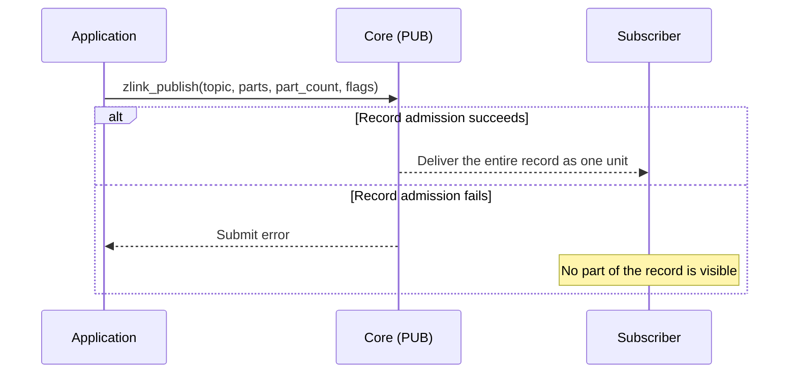

[한국어](https://zlink-systems.github.io/zlink/ko/spec/core/socket/02-pub/) | English

<!-- zlink-nav:start -->
[Socket Index](README.en.md) | [Previous: PAIR](01-pair.en.md) | [Next: SUB](03-sub.en.md)
<!-- zlink-nav:end -->

# Socket — PUB

> **What this chapter defines** — The publishing behavior and public contract of the PUB socket.

## 1. PUB Overview

PUB is a publish-only [socket](../glossary.en.md#socket). A topic is the byte
sequence prepended to a message that subscribers use to decide whether to
receive it. PUB performs fan-out delivery of messages to all connected
subscribers based on the topic. PUB is send-only, so receive functions do not
apply.

This document defines the PUB-specific contract: topic publishing
(`zlink_publish`), PUB/XPUB-specific options, and the delivery-loss policy.
The [Socket Common Specification](README.en.md) owns contracts shared by all
socket types, including socket creation, common options, and send flags.

The following documents own the related contracts.

| Related contract | Defining document |
|---|---|
| Socket creation, common options, send flags, and thread safety | [Socket Common Specification](README.en.md) |
| Subscriptions and topic reception | [SUB](03-sub.en.md) |
| Publisher that handles subscription events directly | [XPUB](04-xpub.en.md) |
| Auto HWM budget calculation and distribution | [Auto HWM](../systems/06-auto-hwm.en.md) |
| Submit results and errno mapping | [Errors](../03-errors.en.md#result-and-errno-mapping) |
| The `zlink_socket_set_receive_flow_state` function declaration and the flow-related fields in the monitor status snapshot | [Socket Common](README.en.md), [Monitoring](../06-monitoring.en.md) |

## 2. Delivery Loss and Backpressure

Fan-out delivery allows loss. When the [HWM](../glossary.en.md#hwm), the byte
limit retained by a send queue, is full, `zlink_publish()` drops the
message for the affected subscriber and reports success. The
`ZLINK_PUB_OPT_NODROP` option controls this behavior and defaults to `0`.

To apply [backpressure](../glossary.en.md#backpressure), which limits further
publisher submissions instead of dropping when the send queue is full,
explicitly set `ZLINK_PUB_OPT_NODROP` to `1`. In this state, calls with
`ZLINK_DONTWAIT` and calls whose send timeout is `0` immediately return
`ZLINK_SUBMIT_BACKPRESSURED`. A call that does not become writable before a
positive timeout expires returns the same result. A blocking call without
`ZLINK_DONTWAIT` waits for the pipe to become writable within the send timeout
and can publish successfully if it becomes writable while waiting.

Setting the option to `1` couples the publisher to the slowest subscriber of
that topic. Core checks the HWM only of the pipes (the delivery queue for one
subscriber) whose filter matches the current topic; if any of them is full, the
publish record is delivered to none of the matching subscribers and
backpressure is returned. A full pipe of a subscriber whose filter does not
match does not block this publish. Request-reply sockets, rather than
PUB/SUB, provide reliable delivery that must not depend on subscriber speed.

## 3. Whole-message publishing and the publish record

[Multipart](../02-message.en.md#4-multipart) groups multiple frames (parts) into one logical
message. `zlink_publish()` submits every part in the `parts_` array, in array order, as one publish
record. Subscribers receive that record as one unit.

Core admits the complete publish record atomically. If the call fails because of HWM, a size limit,
or another error, subscribers see none of its parts. Every input slot is consumed on both success
and failure, so a retry submits the complete record from a copy retained before the call.



## 4. Automatic HWM Defaults

PUB belongs to the `fanout` policy class under the context auto HWM policy. The
active auto-HWM profile selects the Core memory-budget ratio and per-role byte
boundaries, and Core distributes that [budget](../glossary.en.md#auto-hwm-budget)
across unique physical [directional queues](../glossary.en.md#directional-queue).
The default profile is `balanced`. When the user sets `SNDHWM` directly, that
application direction is excluded from automatic distribution. `SNDBUF` is an
OS socket-buffer option and is not changed by auto HWM. The
[Auto HWM](../systems/06-auto-hwm.en.md) specification owns the budget
calculation and distribution contract.

## 5. Receive Flow State

PUB is not a socket type that supports receive flow. Calling
[`zlink_socket_set_receive_flow_state()`](README.en.md#zlink_socket_set_receive_flow_state) on a
PUB socket returns `ZLINK_CONFIG_NOT_SUPPORTED` with `errno == ENOTSUP` and
changes nothing. The socket's byte HWM, low water mark, and transport
backpressure remain in effect. The PUB socket monitor status, owned by
[Monitoring](../06-monitoring.en.md), does not set
`ZLINK_MONITOR_STATUS_DETAIL_FLOW_STATE` and does not emit
`ZLINK_EVENT_SEND_FLOW_PAUSED`, `ZLINK_EVENT_SEND_FLOW_RESUMED`, or
`ZLINK_EVENT_FLOW_STATE_STALE`.

## 6. PUB Options (`zlink_pub_option_t`)

Use these options with `zlink_set_pub_option()` and `zlink_get_pub_option()`.

```c
typedef enum zlink_pub_option_t
{
    ZLINK_PUB_OPT_VERBOSE = 0x3301,            // Observable on XPUB only: also surface subscribes for already-subscribed topics as events (int; 0=off, positive=on (getter returns 0/1))
    ZLINK_PUB_OPT_VERBOSER = 0x3302,           // Observable on XPUB only: surface duplicate subscribes and every unsubscribe as events (int; 0=off, positive=on (getter returns 0/1))
    ZLINK_PUB_OPT_MANUAL = 0x3303,             // XPUB manual subscription management (int; 0=off, positive=on (getter returns 0/1))
    ZLINK_PUB_OPT_MANUAL_LAST_VALUE = 0x3304,  // Enable manual mode + deliver next publish only to the last subscription-event pipe (int; 0=off, positive=on (getter returns 0/1))
    ZLINK_PUB_OPT_NODROP = 0x3305,             // Return EAGAIN instead of dropping at HWM (int; 0=off, positive=on (getter returns 0/1), default 0)
    ZLINK_PUB_OPT_WELCOME_MSG = 0x3306,        // Message sent when a new subscriber connects (binary)
    ZLINK_PUB_OPT_TOPICS_COUNT = 0x3307,       // Number of subscribed topics (int, read-only)
    ZLINK_PUB_OPT_APPROVE_SUBSCRIBE = 0x3308,  // Approve subscription in manual mode (binary)
    ZLINK_PUB_OPT_REJECT_SUBSCRIBE = 0x3309    // Reject subscription in manual mode (binary)
} zlink_pub_option_t;
```

[§2 Delivery Loss and Backpressure](#2-delivery-loss-and-backpressure) describes
the drop and backpressure behavior controlled by `ZLINK_PUB_OPT_NODROP`.
Enabling `ZLINK_PUB_OPT_MANUAL_LAST_VALUE` also enables manual mode, and the
next publish is delivered only to the pipe of the subscription event the XPUB
most recently dequeued. `ZLINK_PUB_OPT_APPROVE_SUBSCRIBE` and
`ZLINK_PUB_OPT_REJECT_SUBSCRIBE` are write-only action options available only
in manual mode; they apply the filter to the pipe of the most recently dequeued
subscription event. If no event has been dequeued yet, or that pipe is already
gone, both actions succeed without changing anything, and the next publish under
`MANUAL_LAST_VALUE` is not restricted to a specific pipe. Querying either with
`zlink_get_pub_option()` yields `EINVAL`. The verbose and manual options can be
set and read on PUB as well, but PUB cannot receive subscription events, so
their effect is observable only on XPUB.

## 7. Functions

### zlink_set_pub_option

Set an option specific to PUB/XPUB sockets.

```c
ZLINK_EXPORT zlink_config_result_t zlink_set_pub_option (void *handle_,
                           zlink_pub_option_t option_,
                           const void *optval_,
                           size_t optvallen_);
```

Sets a PUB/XPUB socket option. See
[§6 PUB Options](#6-pub-options-zlink_pub_option_t) for valid option names and
their meanings. Use `zlink_set_option()` for common options shared by all
socket types.

**Returns:** `ZLINK_CONFIG_OK` on success; otherwise a
`zlink_config_result_t` value. `zlink_errno()` retains the detailed internal
errno for diagnostics.

**See also:** `zlink_get_pub_option`, `zlink_set_option`

---

### zlink_get_pub_option

Get a PUB-specific option.

```c
ZLINK_EXPORT zlink_config_result_t zlink_get_pub_option (void *handle_,
                           zlink_pub_option_t option_,
                           void *optval_,
                           size_t *optvallen_);
```

Gets the current value of a PUB/XPUB socket option.

**Returns:** `ZLINK_CONFIG_OK` on success; otherwise a
`zlink_config_result_t` value. `zlink_errno()` retains the detailed internal
errno for diagnostics.

**See also:** `zlink_set_pub_option`

---

### zlink_publish

Publish one message record from a raw `PUB` or `XPUB` socket.

```c
ZLINK_EXPORT zlink_submit_result_t zlink_publish (
  void *subject_, const char *topic_id_, zlink_msg_t *parts_,
  size_t part_count_, zlink_send_flags_t flags_);
```

The applicable types are raw `PUB` and raw `XPUB`. Other raw socket types
return `ZLINK_SUBMIT_NOT_SUPPORTED` and set `errno` to `ENOTSUP`.

When `topic_id_ == NULL`, the first message frame carries the topic according
to the wire-prefix rule. When it is non-NULL, `topic_id_` must be a
NUL-terminated byte string with no embedded NUL. Every byte before the
terminating NUL is the topic, and Core prepends those bytes to the message as a
topic frame. There is no separate topic-specific maximum; topic bytes count
toward the message and storage size limits. Exceeding a size limit returns
`ZLINK_SUBMIT_INVALID_ARGUMENT` with `EMSGSIZE`. Failure to allocate storage
for the topic frame returns `ZLINK_SUBMIT_OUT_OF_MEMORY` with `ENOMEM`.

The `parts_` array and `part_count_` form the publish record. `part_count_` must be positive; `0`
returns `ZLINK_SUBMIT_INVALID_ARGUMENT` with `EINVAL`. [§3 Whole-message publishing and the publish
record](#3-whole-message-publishing-and-the-publish-record) describes atomic admission of the
complete record.

This function consumes every input slot on both success and failure. To send the same record again,
the caller retains a complete copy before the call regardless of the return value. Each consumed
`zlink_msg_t` is left as an initialized empty message and can be closed or reused as is.

Pass `ZLINK_DONTWAIT` in `flags_` for non-blocking publishing. A call that
cannot proceed immediately returns `ZLINK_SUBMIT_BACKPRESSURED`. The ownership
rule that consumes every input slot is the same regardless of the result. See the
[errno map](../03-errors.en.md#result-and-errno-mapping) for the complete result
mapping.

## 8. Implementation and Contract-Test Verification Requirements

Verify the following solely through the public surface
(`zlink_publish`, `zlink_set_pub_option`/`zlink_get_pub_option`, return
values and errno, and the subscriber-side receive result). Each item maps to
one contract test.

**Applicable types**
- Calling `zlink_publish` on a raw socket type other than raw `PUB` or raw `XPUB` returns `ZLINK_SUBMIT_NOT_SUPPORTED` and sets `errno` to `ENOTSUP`.

**Topic publishing**
- When `topic_id_ != NULL`, every byte before the terminating NUL is prepended to the message as a topic frame and delivered to the subscriber.
- When `topic_id_ == NULL`, the first message frame carries the topic according to the wire-prefix rule.
- When the size including the topic bytes exceeds a message or storage size limit, the result is `ZLINK_SUBMIT_INVALID_ARGUMENT` with `EMSGSIZE`.
- Failure to allocate storage for the topic frame returns `ZLINK_SUBMIT_OUT_OF_MEMORY` with `ENOMEM`.

**Input-array ownership**
- Every `parts_` slot is consumed for every return result, including success, failure, and backpressure — after return each `zlink_msg_size` is `0`, and each slot can be closed or used for the next publish without reinitialization.

**Publish-record atomicity**
- The parts in `parts_` are delivered in array order as one publish record.
- If the call fails because of HWM, a size limit, or another condition, the subscriber receives no part of the record and the caller can resubmit the complete retained record.

**Drop and backpressure**
- When `ZLINK_PUB_OPT_NODROP` has its default value of `0`, the message for a subscriber whose HWM is full is dropped and `zlink_publish` reports success.
- When `ZLINK_PUB_OPT_NODROP` is set to `1`, delivery to every subscriber on the same socket stops while one pipe is full.
- Calls with `ZLINK_DONTWAIT` and calls whose send timeout is `0` return `ZLINK_SUBMIT_BACKPRESSURED` with `EAGAIN` if they cannot proceed immediately. The same result applies when a positive timeout expires.
- A blocking call without `ZLINK_DONTWAIT` waits for writability within the send timeout and can succeed if the pipe becomes writable while the call is waiting.

**Options**
- `zlink_set_pub_option` and `zlink_get_pub_option` return `ZLINK_CONFIG_OK` on success and a `zlink_config_result_t` value on failure. `zlink_errno()` retains the detailed internal errno for diagnostics.
- Querying the read-only `ZLINK_PUB_OPT_TOPICS_COUNT` returns the number of subscribed topics.
- Enabling `ZLINK_PUB_OPT_MANUAL_LAST_VALUE` enables manual mode, and the next publish is delivered only to the last subscription-event pipe.
- `ZLINK_PUB_OPT_APPROVE_SUBSCRIBE` and `ZLINK_PUB_OPT_REJECT_SUBSCRIBE` are write-only action options available only in manual mode. Querying either with `zlink_get_pub_option` yields `EINVAL`.

**Receive flow state**
- Calling `zlink_socket_set_receive_flow_state()` on a PUB socket returns `ZLINK_CONFIG_NOT_SUPPORTED` with `errno == ENOTSUP` and changes nothing.
- A PUB socket monitor does not set `ZLINK_MONITOR_STATUS_DETAIL_FLOW_STATE` and does not emit `ZLINK_EVENT_SEND_FLOW_PAUSED`, `ZLINK_EVENT_SEND_FLOW_RESUMED`, or `ZLINK_EVENT_FLOW_STATE_STALE`.

The [Auto HWM](../systems/06-auto-hwm.en.md#5-implementation-and-contract-test-verification-requirements)
specification owns verification of auto HWM budget calculation and distribution.

<!-- zlink-nav:start -->
[Socket Index](README.en.md) | [Previous: PAIR](01-pair.en.md) | [Next: SUB](03-sub.en.md)
<!-- zlink-nav:end -->
