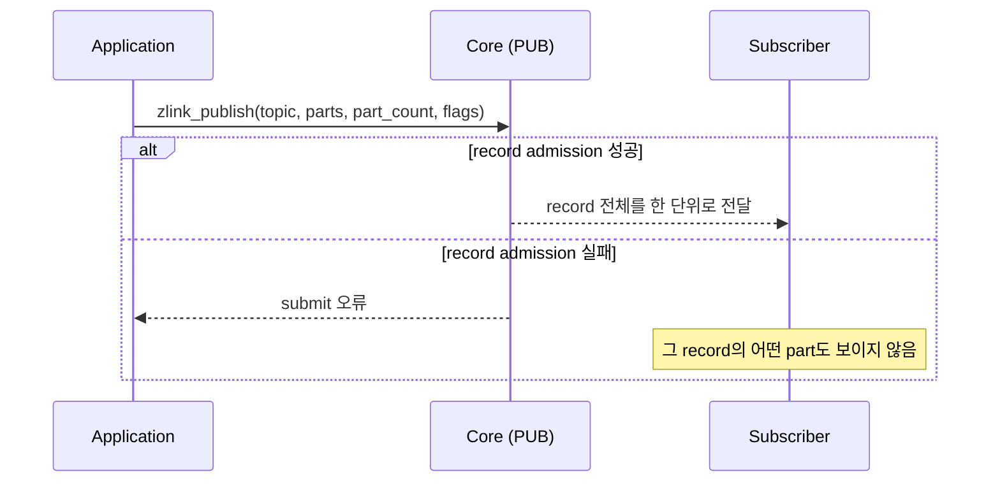

[English](https://zlink-systems.github.io/zlink/spec/core/socket/02-pub/) | 한국어

<!-- zlink-nav:start -->
[소켓 목차](README.ko.md) | [이전: PAIR](01-pair.ko.md) | [다음: SUB](03-sub.ko.md)
<!-- zlink-nav:end -->

# Socket — PUB

> **이 장이 정의하는 것** — PUB socket의 발행 동작과 공개 계약.

## 1. PUB 개요

PUB는 발행 전용 [socket](../glossary.ko.md#socket)이다. message 앞에 붙어 subscriber가
수신 여부를 결정하는 기준이 되는 byte 열을 topic이라 하며, PUB는 topic을 기준으로 연결된
모든 subscriber에게 message를 나눠 보내는 fan-out 전달을 수행한다. PUB는 송신 전용이며
수신 함수는 적용되지 않는다.

이 문서는 PUB 고유 계약 — topic 발행(`zlink_publish`), PUB/XPUB 전용 옵션과 전달
손실 정책 — 을 정의한다. socket 생성, 공통 옵션과 송신 flag처럼 모든 socket 타입에
공통인 계약은 [Socket 공통](README.ko.md)이 소유한다.

관련 계약의 소유 문서는 다음과 같다.

| 관련 계약 | 정의하는 문서 |
|---|---|
| socket 생성·공통 옵션·송신 flag·스레드 안전성 | [Socket 공통](README.ko.md) |
| 구독과 topic 수신 | [SUB](03-sub.ko.md) |
| 구독 이벤트를 직접 다루는 publisher | [XPUB](04-xpub.ko.md) |
| Auto HWM budget 계산과 분배 | [Auto HWM](../systems/06-auto-hwm.ko.md) |
| submit result와 errno 대응 | [Errors](../03-errors.ko.md#result와-errno-대응) |
| `zlink_socket_set_receive_flow_state` 함수 선언과 monitor status snapshot의 flow 관련 field | [Socket 공통](README.ko.md), [Monitoring](../06-monitoring.ko.md) |

## 2. 전달 손실과 backpressure

fanout 전달은 손실을 허용한다. 송신 queue가 유지할 byte 상한인
[HWM](../glossary.ko.md#hwm)이 찼을 때 `zlink_publish()`는 해당 subscriber에 대한
message를 버리고 성공을 보고한다. 이 동작을 제어하는 옵션이 `ZLINK_PUB_OPT_NODROP`이며,
기본값은 `0`이다.

송신 queue가 찼을 때 drop 대신 publisher의 추가 제출을 제한하는
[backpressure](../glossary.ko.md#backpressure)를 주려면 `ZLINK_PUB_OPT_NODROP`을
명시적으로 `1`로 설정해야 한다. 이 상태에서 `ZLINK_DONTWAIT`를 준 호출과
send timeout이 `0`인 호출은 즉시 `ZLINK_SUBMIT_BACKPRESSURED`를 반환한다. 양수
timeout이 만료할 때까지 writable이 되지 않은 호출도 같은 결과를 반환한다.
`ZLINK_DONTWAIT`를 주지 않은 blocking 호출은 send timeout 범위에서 pipe가
writable이 될 때까지 대기하며, 대기 중 writable이 되면 발행에 성공할 수 있다.

`1`로 설정하면 publisher가 그 topic을 구독한 subscriber 중 가장 느린 쪽에 묶인다. Core는 현재
topic의 filter에 맞는 pipe(subscriber 하나로 가는 전달 queue)만 HWM을 검사하며, 그중 하나라도
차 있으면 그 publish record를 filter가 맞는 어떤 subscriber에도 전달하지 않고 backpressure를
돌려준다. filter가 맞지 않는 subscriber의 pipe가 차 있어도 이 publish는 막지 않는다.
subscriber 속도에 의존하면 안 되는 신뢰 전달은 PUB/SUB가 아니라 request-reply socket이
담당한다.

## 3. Whole-message 발행과 publish record

여러 frame(part)을 하나의 논리적 message로 묶는 방식을
[multipart](../02-message.ko.md#4-multipart)라 한다. `zlink_publish()`는 `parts_` 배열의 모든
part를 배열 순서대로 publish record 하나로 제출한다. Subscriber는 이 record를 한 단위로 받는다.

Core는 publish record 전체를 원자적으로 admission한다. HWM, 크기 제한이나 다른 오류로 호출이
실패하면 subscriber에는 어느 part도 보이지 않는다. 성공·실패와 관계없이 모든 입력 슬롯을
소비하므로, 다시 시도하려면 caller가 호출 전에 보관한 record 전체를 제출해야 한다.



## 4. 자동 HWM 기본값

PUB는 context auto HWM 정책에서 `fanout` policy class로 분류된다. 활성 auto-HWM
profile은 Core memory budget 비율과 역할별 byte 경계를 선택하고, Core는 그
[budget](../glossary.ko.md#auto-hwm-budget)을 고유 physical
[directional queue](../glossary.ko.md#directional-queue)에 분배한다. 기본 profile은
`balanced`다. 사용자가 `SNDHWM`을 직접 설정하면 그 application 방향은 자동 분배에서
제외된다. `SNDBUF`는 OS socket buffer option이며 auto HWM이 변경하지 않는다. budget
계산과 분배 계약은 [Auto HWM](../systems/06-auto-hwm.ko.md)이 소유한다.

## 5. Receive flow state

PUB은 receive-flow 대상 socket type이 아니다.
[`zlink_socket_set_receive_flow_state()`](README.ko.md#zlink_socket_set_receive_flow_state)를
PUB socket에 호출하면 `errno == ENOTSUP`과 함께 `ZLINK_CONFIG_NOT_SUPPORTED`를 반환하고
아무것도 바꾸지 않는다. 이 socket의 byte HWM, low water mark와 transport backpressure는
그대로 유지된다. [Monitoring](../06-monitoring.ko.md)이 소유하는 PUB socket의 monitor
status는 `ZLINK_MONITOR_STATUS_DETAIL_FLOW_STATE`를 설정하지 않고
`ZLINK_EVENT_SEND_FLOW_PAUSED`, `ZLINK_EVENT_SEND_FLOW_RESUMED`,
`ZLINK_EVENT_FLOW_STATE_STALE`를 발생시키지 않는다.

## 6. Pub 옵션 (`zlink_pub_option_t`)

`zlink_set_pub_option()` / `zlink_get_pub_option()`과 함께 사용한다.

```c
typedef enum zlink_pub_option_t
{
    ZLINK_PUB_OPT_VERBOSE = 0x3301,            // XPUB에서만 관찰: 이미 구독 중인 topic의 subscribe도 event로 공개 (int; 0=off, 양수=on (getter는 0/1 반환))
    ZLINK_PUB_OPT_VERBOSER = 0x3302,           // XPUB에서만 관찰: 중복 subscribe와 모든 unsubscribe를 event로 공개 (int; 0=off, 양수=on (getter는 0/1 반환))
    ZLINK_PUB_OPT_MANUAL = 0x3303,             // XPUB 수동 구독 관리 (int; 0=off, 양수=on (getter는 0/1 반환))
    ZLINK_PUB_OPT_MANUAL_LAST_VALUE = 0x3304,  // manual 모드 활성 + 다음 발행을 마지막 구독 event pipe에만 전달 (int; 0=off, 양수=on (getter는 0/1 반환))
    ZLINK_PUB_OPT_NODROP = 0x3305,             // HWM 시 drop 대신 EAGAIN 반환 (int; 0=off, 양수=on (getter는 0/1 반환), 기본값 0)
    ZLINK_PUB_OPT_WELCOME_MSG = 0x3306,        // 새 subscriber 연결 시 전송 message (binary)
    ZLINK_PUB_OPT_TOPICS_COUNT = 0x3307,       // 구독된 topic 수 (int, 읽기 전용)
    ZLINK_PUB_OPT_APPROVE_SUBSCRIBE = 0x3308,  // manual 모드 구독 승인 (binary)
    ZLINK_PUB_OPT_REJECT_SUBSCRIBE = 0x3309    // manual 모드 구독 거부 (binary)
} zlink_pub_option_t;
```

`ZLINK_PUB_OPT_NODROP`이 정하는 drop과 backpressure 동작은
[§2 전달 손실과 backpressure](#2-전달-손실과-backpressure)가 설명한다.
`ZLINK_PUB_OPT_MANUAL_LAST_VALUE`를 활성화하면 manual 모드도 함께 활성화되고,
다음 발행은 XPUB가 가장 최근에 꺼낸 구독 event의 pipe에만 전달된다.
`ZLINK_PUB_OPT_APPROVE_SUBSCRIBE`와 `ZLINK_PUB_OPT_REJECT_SUBSCRIBE`는 manual 모드
전용 write-only action 옵션으로, 가장 최근에 꺼낸 구독 event의 pipe에 filter를 적용한다.
아직 꺼낸 event가 없거나 그 pipe가 이미 끊겼으면 두 action은 성공하지만 아무것도 바꾸지
않고, `MANUAL_LAST_VALUE`의 다음 발행도 특정 pipe로 제한되지 않는다.
`zlink_get_pub_option()`으로 조회하면 `EINVAL`이다. verbose·manual 계열 option은 PUB에서도
설정·조회할 수 있지만 PUB는 구독 event를 받을 수 없으므로 XPUB에서만 관찰 효과가 있다.

## 7. 함수

### zlink_set_pub_option

PUB/XPUB socket 전용 옵션을 설정한다.

```c
ZLINK_EXPORT zlink_config_result_t zlink_set_pub_option (void *handle_,
                           zlink_pub_option_t option_,
                           const void *optval_,
                           size_t optvallen_);
```

PUB/XPUB socket 옵션을 설정한다. 유효한 옵션 이름과 의미는
[§6 Pub 옵션](#6-pub-옵션-zlink_pub_option_t)을 참조한다. 모든 socket 타입에 공유되는
공통 옵션은 `zlink_set_option()`을 사용한다.

**반환값:** 성공 시 `ZLINK_CONFIG_OK`, 실패 시 `zlink_config_result_t` 값. `zlink_errno()`는 진단용 내부 errno를 그대로 유지한다.

**참고:** `zlink_get_pub_option`, `zlink_set_option`

---

### zlink_get_pub_option

pub 전용 옵션을 조회한다.

```c
ZLINK_EXPORT zlink_config_result_t zlink_get_pub_option (void *handle_,
                           zlink_pub_option_t option_,
                           void *optval_,
                           size_t *optvallen_);
```

PUB/XPUB socket 옵션의 현재 값을 가져온다.

**반환값:** 성공 시 `ZLINK_CONFIG_OK`, 실패 시 `zlink_config_result_t` 값. `zlink_errno()`는 진단용 내부 errno를 그대로 유지한다.

**참고:** `zlink_set_pub_option`

---

### zlink_publish

raw `PUB` 또는 `XPUB` socket에서 message record 하나를 발행한다.

```c
ZLINK_EXPORT zlink_submit_result_t zlink_publish (
  void *subject_, const char *topic_id_, zlink_msg_t *parts_,
  size_t part_count_, zlink_send_flags_t flags_);
```

적용 타입은 raw `PUB`, raw `XPUB`다. 다른 raw socket 타입은
`ZLINK_SUBMIT_NOT_SUPPORTED`를 반환하고 `errno`를 `ENOTSUP`로 설정한다.

`topic_id_ == NULL`이면 첫 message frame이 wire prefix 규칙에 따라 topic을 운반한다.
NULL이 아니면 `topic_id_`는 NUL로 끝나며 내부 NUL이 없는 byte 문자열이어야 한다. 종료
NUL 앞의 모든 byte가 topic이며 Core가 이 byte를 message 앞의 topic frame으로 추가한다.
별도의 topic 전용 최대 길이는 없으며 topic byte도 message와 storage 크기 제한에
포함된다. 크기 제한을 넘으면 `ZLINK_SUBMIT_INVALID_ARGUMENT`와 `EMSGSIZE`, topic
frame용 storage를 확보하지 못하면 `ZLINK_SUBMIT_OUT_OF_MEMORY`와 `ENOMEM`을 반환한다.

`parts_` 배열과 `part_count_`가 publish record를 구성한다. `part_count_`는 양수여야 하며 `0`은
`ZLINK_SUBMIT_INVALID_ARGUMENT`+`EINVAL`이다. Core가 record 전체를 원자적으로 admission하는
동작은 [§3 Whole-message 발행과 publish record](#3-whole-message-발행과-publish-record)가 설명한다.

이 함수는 성공과 실패 모두에서 모든 입력 슬롯을 소비한다. 호출자는 반환값과 관계없이 같은
record를 다시 보내려면 호출 전에 전체 복사본을 만들어야 한다. 소비된 각 `zlink_msg_t`는
초기화된 빈 message로 남으므로 그대로 close하거나 다시 쓸 수 있다.

non-blocking 발행은 `flags_`에 `ZLINK_DONTWAIT`를 전달한다. 즉시 진행할 수 없으면
`ZLINK_SUBMIT_BACKPRESSURED`를 반환한다. 반환 결과와 관계없이 모든 입력 슬롯을 소비한다는
소유권 규칙은 동일하다. 전체 결과 대응은
[errno map](../03-errors.ko.md#result와-errno-대응)을 따른다.

## 8. 구현 및 contract test 검증 요구

공개 표면(`zlink_publish`, `zlink_set_pub_option`·`zlink_get_pub_option`,
반환값·errno, subscriber 쪽 수신 결과)만으로 다음을 확인한다. 각 항목은 contract test
하나로 이어진다.

**적용 타입**
- raw `PUB`, raw `XPUB`가 아닌 raw socket 타입에 `zlink_publish`를 호출하면 `ZLINK_SUBMIT_NOT_SUPPORTED`이고 `errno`는 `ENOTSUP`다.

**topic 발행**
- `topic_id_ != NULL`이면 종료 NUL 앞의 모든 byte가 topic frame으로 message 앞에 추가되어 subscriber에 전달된다.
- `topic_id_ == NULL`이면 첫 message frame이 wire prefix 규칙에 따라 topic을 운반한다.
- topic byte를 포함한 크기가 message·storage 크기 제한을 넘으면 `ZLINK_SUBMIT_INVALID_ARGUMENT`와 `EMSGSIZE`다.
- topic frame용 storage를 확보하지 못하면 `ZLINK_SUBMIT_OUT_OF_MEMORY`와 `ENOMEM`이다.

**입력 배열 ownership**
- 성공·실패·backpressure 어느 반환 결과에서도 모든 `parts_` 슬롯은 소비된다 — 반환 뒤 각 `zlink_msg_size`는 `0`이고, 각 슬롯은 다시 초기화하지 않고 그대로 close하거나 다음 publish에 쓸 수 있다.

**publish record 원자성**
- `parts_` 배열의 part는 배열 순서대로 하나의 publish record로 전달된다.
- HWM·크기 제한 등으로 호출이 실패하면 subscriber는 그 record의 어떤 part도 수신하지 않으며, caller는 보관한 record 전체를 다시 제출할 수 있다.

**drop과 backpressure**
- `ZLINK_PUB_OPT_NODROP`이 기본값 `0`일 때 HWM이 찬 subscriber에 대한 message는 버려지고 `zlink_publish`는 성공을 보고한다.
- `ZLINK_PUB_OPT_NODROP`을 `1`로 설정하면 한 pipe가 찬 동안 같은 socket의 모든 subscriber에 대한 전달이 멈춘다.
- `ZLINK_DONTWAIT`를 준 호출과 send timeout이 `0`인 호출은 즉시 진행할 수 없으면 `ZLINK_SUBMIT_BACKPRESSURED`와 `EAGAIN`을 반환한다. 양수 timeout 대기가 만료한 경우도 같다.
- `ZLINK_DONTWAIT`를 주지 않은 blocking 호출은 send timeout 범위에서 writable이 될 때까지 대기하며, 대기 중 writable이 되면 성공할 수 있다.

**옵션**
- `zlink_set_pub_option`·`zlink_get_pub_option`은 성공 시 `ZLINK_CONFIG_OK`, 실패 시 `zlink_config_result_t` 값을 반환하며 `zlink_errno()`는 진단용 내부 errno를 그대로 유지한다.
- 읽기 전용 `ZLINK_PUB_OPT_TOPICS_COUNT`를 조회하면 구독된 topic 수를 반환한다.
- `ZLINK_PUB_OPT_MANUAL_LAST_VALUE`를 활성화하면 manual 모드가 활성화되고, 다음 발행은 마지막 구독 event pipe에만 전달된다.
- `ZLINK_PUB_OPT_APPROVE_SUBSCRIBE`와 `ZLINK_PUB_OPT_REJECT_SUBSCRIBE`는 manual 모드 전용 write-only action 옵션이며, `zlink_get_pub_option`으로 조회하면 `EINVAL`이다.

**receive flow state**
- PUB socket에 `zlink_socket_set_receive_flow_state()`를 호출하면 `ZLINK_CONFIG_NOT_SUPPORTED`와 `errno == ENOTSUP`이고 아무것도 바뀌지 않는다.
- PUB socket의 monitor는 `ZLINK_MONITOR_STATUS_DETAIL_FLOW_STATE`를 설정하지 않고 `ZLINK_EVENT_SEND_FLOW_PAUSED`, `ZLINK_EVENT_SEND_FLOW_RESUMED`, `ZLINK_EVENT_FLOW_STATE_STALE`를 발생시키지 않는다.

자동 HWM budget 계산·분배의 검증은 [Auto HWM](../systems/06-auto-hwm.ko.md#5-구현-및-contract-test-검증-요구)가 소유한다.

<!-- zlink-nav:start -->
[소켓 목차](README.ko.md) | [이전: PAIR](01-pair.ko.md) | [다음: SUB](03-sub.ko.md)
<!-- zlink-nav:end -->
