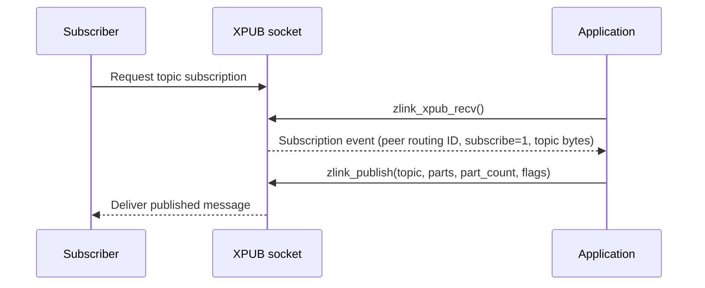

[한국어](https://zlink-systems.github.io/zlink/ko/spec/core/socket/04-xpub/) | English

<!-- zlink-nav:start -->
[Socket Index](README.en.md) | [Previous: SUB](03-sub.en.md) | [Next: XSUB](05-xsub.en.md)
<!-- zlink-nav:end -->

# Socket — XPUB

> **What this chapter defines** — The public contract for XPUB, a PUB socket that exposes subscription events as messages.

## 1. XPUB Overview

XPUB is an extended publisher that supports subscription forwarding and manual control. Like PUB, XPUB is a publishing
[socket](../glossary.en.md#socket), an endpoint that exchanges messages. In addition, XPUB receives subscribe and unsubscribe requests
from subscriber peers as subscription-event messages and supports manual subscription management. In the default mode only the
first subscribe for a topic and the last unsubscribe that leaves no subscriber for that topic are surfaced as events — a duplicate
subscribe for an already-subscribed topic, or an unsubscribe while other subscribers remain, becomes visible only with
`ZLINK_PUB_OPT_VERBOSE` / `ZLINK_PUB_OPT_VERBOSER` ([§4](#4-pub-options-zlink_pub_option_t)).

This document defines the public contracts specific to XPUB: PUB/XPUB-only options, whole-message publishing, and subscription-event
receiving.

The following documents own the related contracts.

| Related contract | Defining document |
|---|---|
| Options, API forms, and receive model common to all socket types | [Socket Common](README.en.md) |
| PUB socket contract | [PUB](02-pub.en.md) |
| SUB and XSUB socket contracts | [SUB](03-sub.en.md) · [XSUB](05-xsub.en.md) |
| Public results and errno mappings | [Errors](../03-errors.en.md#result-and-errno-mapping) |

## 2. Subscription Event Flow

Subscribe and unsubscribe requests sent by a subscriber arrive at XPUB as subscription-event messages. The application retrieves these
events one at a time with [`zlink_xpub_recv`](#zlink_xpub_recv) and observes which peer sent the event (routing ID), whether it
is a subscribe or unsubscribe event, and which topic it addresses. A subscription event is a single frame: the first byte is `0x01`
for subscribe or `0x00` for unsubscribe, and the remaining bytes are the topic (the byte sequence that identifies the subscription
target). An event with an empty topic still carries that one byte. `zlink_xpub_recv` splits the first byte into `*subscribed_out_`
and the rest into the topic output, so the application never parses the frame itself.

Enable manual subscription management with `ZLINK_PUB_OPT_MANUAL`. In manual mode, set `ZLINK_PUB_OPT_APPROVE_SUBSCRIBE` to approve a
subscription and `ZLINK_PUB_OPT_REJECT_SUBSCRIBE` to reject it. The complete option set, including the verbose options that also surface
duplicate subscribes and unsubscribes as events, appears in [§4](#4-pub-options-zlink_pub_option_t).



## 3. Drop and Backpressure at HWM

`ZLINK_PUB_OPT_NODROP` defaults to `0`. Fanout delivery permits loss. The [HWM](../glossary.en.md#hwm) (High-Water Mark) is the byte limit
retained by the send queue. When that limit is reached, `zlink_publish()` drops the message for that subscriber and reports success.
To apply [backpressure](../glossary.en.md#backpressure), which limits additional submissions by the publisher instead of dropping when
the send queue is full, explicitly set this option to `1`. `zlink_publish()` then returns `ZLINK_SUBMIT_BACKPRESSURED`. Only the
pipes whose filter matches the current topic are checked against the HWM — if any of them is full, the record is delivered to none of the
matching subscribers, and the state of a non-matching subscriber's pipe does not affect this publish.

Setting the option to `1` couples the publisher to its slowest subscriber because one full pipe stops delivery to every subscriber on
the same socket. Reliable delivery that must not depend on subscriber speed belongs on a request-reply socket, not on XPUB/XSUB.

## 4. Pub Options (`zlink_pub_option_t`)

Use these options with `zlink_set_pub_option()` / `zlink_get_pub_option()`.

```c
typedef enum zlink_pub_option_t
{
    ZLINK_PUB_OPT_VERBOSE = 0x3301,            // Also surface subscribes for already-subscribed topics as events (int; 0=off, positive=on (getter returns 0/1))
    ZLINK_PUB_OPT_VERBOSER = 0x3302,           // Surface duplicate subscribes and every unsubscribe as events (int; 0=off, positive=on (getter returns 0/1))
    ZLINK_PUB_OPT_MANUAL = 0x3303,             // XPUB manual subscription management (int; 0=off, positive=on (getter returns 0/1))
    ZLINK_PUB_OPT_MANUAL_LAST_VALUE = 0x3304,  // Enable manual mode + send the next publish only to the last subscription-event pipe (int; 0=off, positive=on (getter returns 0/1))
    ZLINK_PUB_OPT_NODROP = 0x3305,             // Return EAGAIN instead of dropping at HWM (int; 0=off, positive=on (getter returns 0/1), default 0)
    ZLINK_PUB_OPT_WELCOME_MSG = 0x3306,        // Message sent when a new subscriber connects (binary)
    ZLINK_PUB_OPT_TOPICS_COUNT = 0x3307,       // Number of subscribed topics (int, read-only)
    ZLINK_PUB_OPT_APPROVE_SUBSCRIBE = 0x3308,  // Approve a subscription in manual mode (binary)
    ZLINK_PUB_OPT_REJECT_SUBSCRIBE = 0x3309    // Reject a subscription in manual mode (binary)
} zlink_pub_option_t;
```

[§3](#3-drop-and-backpressure-at-hwm) describes how `ZLINK_PUB_OPT_NODROP` changes behavior when HWM is reached.

The default option state is as follows.

- `VERBOSE`, `VERBOSER`, `MANUAL`, and `MANUAL_LAST_VALUE` are all `0`.
- `WELCOME_MSG` is an empty byte sequence and sends no welcome message to a new subscriber pipe.
- `TOPICS_COUNT` is initially `0`.

Enabling `ZLINK_PUB_OPT_MANUAL_LAST_VALUE` also enables manual mode, and the next publish is delivered only to the pipe that produced the
last subscription event. This option does not enable a latest-value cache that stores published messages.

## 5. Functions

### zlink_set_pub_option

Sets a PUB/XPUB-only option.

```c
ZLINK_EXPORT zlink_config_result_t zlink_set_pub_option (void *handle_,
                           zlink_pub_option_t option_,
                           const void *optval_,
                           size_t optvallen_);
```

Configures a PUB/XPUB socket option. Use `zlink_set_option()` for common options shared across all socket types.

**Returns:** `ZLINK_CONFIG_OK` on success; otherwise a `zlink_config_result_t` value. `zlink_errno()` retains the detailed internal errno for diagnostics.

**See also:** `zlink_get_pub_option`, `zlink_set_option`

---

### zlink_get_pub_option

Gets a PUB/XPUB-only option.

```c
ZLINK_EXPORT zlink_config_result_t zlink_get_pub_option (void *handle_,
                           zlink_pub_option_t option_,
                           void *optval_,
                           size_t *optvallen_);
```

Retrieves the current value of a PUB/XPUB socket option.

**Returns:** `ZLINK_CONFIG_OK` on success; otherwise a `zlink_config_result_t` value. `zlink_errno()` retains the detailed internal errno for diagnostics.

**See also:** `zlink_set_pub_option`

---

### zlink_publish

Publishes one message record from a raw `XPUB` socket.

```c
ZLINK_EXPORT zlink_submit_result_t zlink_publish (
  void *subject_, const char *topic_id_, zlink_msg_t *parts_,
  size_t part_count_, zlink_send_flags_t flags_);
```

When `topic_id_ == NULL`, the first message frame carries the topic according to the wire-prefix convention. Otherwise, `topic_id_` must
be a NUL-terminated byte string with no embedded NUL. Every byte before the terminating NUL is the topic, and Core prepends these bytes as
the topic frame.

There is no separate topic-specific maximum length; topic bytes count toward the message and storage size limits.
Exceeding the size limit returns `ZLINK_SUBMIT_INVALID_ARGUMENT` with `EMSGSIZE`, while failure to allocate topic-frame storage returns
`ZLINK_SUBMIT_OUT_OF_MEMORY` with `ENOMEM`.

The `parts_` array and `part_count_` form the publish record. `part_count_` must be positive; `0`
returns `ZLINK_SUBMIT_INVALID_ARGUMENT` with `EINVAL`. Parts are delivered in array order.

This function consumes every input slot on both success and failure. If the same record may be needed again, copy it before the call.
Each consumed `zlink_msg_t` is left as an initialized empty message, so it can be closed or reused as is.

Pass `ZLINK_DONTWAIT` in `flags_` for non-blocking publish; a call that cannot
proceed immediately returns `ZLINK_SUBMIT_BACKPRESSURED`.

Core admits the complete record atomically. If the call fails, subscribers see none of its parts and
the caller resubmits the complete retained record. [PUB §3](02-pub.en.md#3-whole-message-publishing-and-the-publish-record)
owns this contract.

Applicable types are raw `PUB` and raw `XPUB`. Other types return `ZLINK_SUBMIT_NOT_SUPPORTED` with `errno == ENOTSUP`. The complete result
mapping follows the [errno map](../03-errors.en.md#result-and-errno-mapping).

**See also:** `zlink_xpub_recv`

---

### zlink_xpub_recv

Receives a subscription event from an XPUB socket.

```c
ZLINK_EXPORT zlink_recv_result_t zlink_xpub_recv (
  void *xpub_,
  const zlink_routing_id_t **source_rid_out_,
  int *subscribed_out_,
  char *topic_id_buf_, size_t topic_id_capacity_, size_t *topic_id_len_out_,
  zlink_recv_flags_t flags_);
```

Receives the next subscription event in recv mode. `subscribed_out_` and `topic_id_len_out_` are required outputs, and `topic_id_buf_`
is required when `topic_id_capacity_` is greater than 0 — if any of these pointers is NULL, the call fails with
`ZLINK_RECV_INVALID_HANDLE` and `EFAULT` before reading an event or touching any output. `source_rid_out_` is an optional output that may be NULL. When it is not
NULL and the event came from a peer that is still connected, `*source_rid_out_` is set to the Core-owned routing ID view of that peer,
whose lifetime follows the [Socket Common borrowed-RID rule](README.en.md#3-pull-receive-and-completion-model) (valid until the same
socket's next data receive API entry or close). For an unsubscribe event that Core synthesized because the peer disconnected, or an event
whose peer disconnected before it was dequeued, `*source_rid_out_` is `NULL`. `*subscribed_out_` is 1 for subscribe or 0 for unsubscribe, and
`topic_id_buf_` / `*topic_id_len_out_` receive the topic bytes (binary-safe).

A receive on another socket and poller, completion or monitor calls don't affect this view's lifetime. Copy the routing ID
immediately if its value must be retained across subsequent calls.

The caller supplies the buffer size via
`topic_id_capacity_`; a too-small topic buffer follows the
[Socket Common typed receive buffer contract](README.en.md#3-pull-receive-and-completion-model): when the capacity is smaller than the
topic length, the function writes the required length to `*topic_id_len_out_` and returns `ZLINK_RECV_BUFFER_TOO_SMALL` with `ENOBUFS`,
and the event is preserved so the next receive with a sufficient buffer returns the same event once.

Applicable type: raw XPUB only.

**Returns:** `ZLINK_RECV_OK` on success; otherwise a `zlink_recv_result_t` value. `zlink_errno()` retains the detailed internal errno for
diagnostics.

**Errors:** `ZLINK_RECV_INVALID_HANDLE` with `EFAULT` if `xpub_`, `subscribed_out_`, or `topic_id_len_out_` is NULL, or if `topic_id_capacity_ > 0` and `topic_id_buf_` is NULL. `ZLINK_RECV_NO_DATA` with `EAGAIN` if `flags_` has `ZLINK_RECV_FLAGS_DONTWAIT` set and no event is available. `ZLINK_RECV_BUFFER_TOO_SMALL` with
`ENOBUFS` if the topic is longer than `topic_id_capacity_`. `ZLINK_RECV_NOT_SUPPORTED` with `ENOTSUP` if the subject is not XPUB.

**See also:** `zlink_publish`

---

## 6. Receive Flow State

XPUB is not a socket type that supports receive flow. `zlink_socket_set_receive_flow_state()` returns
`ZLINK_CONFIG_NOT_SUPPORTED` with `errno == ENOTSUP` for an XPUB socket and changes nothing. The existing byte HWM, low water mark, and
transport backpressure remain in effect. A monitor for an XPUB socket does not set `ZLINK_MONITOR_STATUS_DETAIL_FLOW_STATE` and does not
emit `ZLINK_EVENT_SEND_FLOW_PAUSED`, `ZLINK_EVENT_SEND_FLOW_RESUMED`, or `ZLINK_EVENT_FLOW_STATE_STALE`.

## 7. Implementation and Contract-Test Verification Requirements

Verify the following only through the public surface (`zlink_set_pub_option`, `zlink_get_pub_option`, `zlink_publish`,
`zlink_xpub_recv`, `zlink_socket_set_receive_flow_state`, return values, and errno). Each item maps to one unit test.

**Options**

- On success, `zlink_set_pub_option` and `zlink_get_pub_option` return `ZLINK_CONFIG_OK`; on failure, they return a `zlink_config_result_t` value, while `zlink_errno()` retains the detailed internal errno for diagnostics.
- `ZLINK_PUB_OPT_TOPICS_COUNT` is a read-only `int`, and getting it returns the number of subscribed topics.
- Initially, `VERBOSE`, `VERBOSER`, `MANUAL`, `MANUAL_LAST_VALUE`, and `TOPICS_COUNT` are `0`, and an empty `WELCOME_MSG` sends no message to a new subscriber pipe.
- Enabling `ZLINK_PUB_OPT_MANUAL_LAST_VALUE` enables manual mode and delivers the next publish only to the last subscription-event pipe.

**Subscription-event receive (`zlink_xpub_recv`)**

- When a raw XPUB has a subscription event, the caller observes `ZLINK_RECV_OK` together with `*subscribed_out_` (subscribe=1, unsubscribe=0), the subscribing peer's routing ID pointer, and binary-safe topic bytes.
- `source_rid_out_` is an optional output that may be NULL.
- For an event from a peer that is still connected, the `*source_rid_out_` routing ID view stays valid until the same socket's next data receive API entry or close, and a receive on another socket doesn't change it. Copy the value immediately to retain it.
- An unsubscribe event that Core synthesized because the peer disconnected, or an event whose peer disconnected before it was dequeued, returns `ZLINK_RECV_OK` with `*source_rid_out_ == NULL`.
- When `flags_` has `ZLINK_RECV_FLAGS_DONTWAIT` set and no event is available, the result is `ZLINK_RECV_NO_DATA` with `EAGAIN`.
- If the topic is longer than `topic_id_capacity_`, the function writes the required length to `*topic_id_len_out_` and returns `ZLINK_RECV_BUFFER_TOO_SMALL` with `ENOBUFS`; the event is retained internally and the next receive with a sufficient buffer returns it once.
- A subject that is not a raw XPUB returns `ZLINK_RECV_NOT_SUPPORTED` with `ENOTSUP`.
- If `xpub_` is NULL, errno is `EFAULT`.

**Publish and topic (`zlink_publish`)**

- When `topic_id_` is not NULL, the bytes before the terminating NUL are prepended to the message as the topic frame. When it is NULL, the first message frame carries the topic according to the wire-prefix convention.
- Exceeding a size limit that includes the topic bytes returns `ZLINK_SUBMIT_INVALID_ARGUMENT` with `EMSGSIZE`; failure to allocate topic-frame storage returns `ZLINK_SUBMIT_OUT_OF_MEMORY` with `ENOMEM`.
- Calling the function on a type other than raw `PUB` or raw `XPUB` returns `ZLINK_SUBMIT_NOT_SUPPORTED` with `errno == ENOTSUP`.
- Every `parts_` slot is consumed on both success and failure and is left as an initialized empty message — it can be closed or reused as is.
- When `ZLINK_DONTWAIT` is used and the call cannot proceed immediately, the result is `ZLINK_SUBMIT_BACKPRESSURED`.

**Whole-message publish record**

- The parts in `parts_` are delivered in array order as one publish record.
- If the call fails, including because of backpressure, subscribers see none of the record's parts and every input slot is consumed; the caller resubmits the complete retained record ([PUB §3](02-pub.en.md#3-whole-message-publishing-and-the-publish-record)).

**Drop and NODROP at HWM**

- When `ZLINK_PUB_OPT_NODROP` has its default value of `0`, a message for a subscriber that has reached HWM is dropped, and `zlink_publish()` reports success.
- When the option is set to `1` and the send queue is full, `zlink_publish()` returns `ZLINK_SUBMIT_BACKPRESSURED`.

**Receive flow state**

- `zlink_socket_set_receive_flow_state()` returns `ZLINK_CONFIG_NOT_SUPPORTED` with `errno == ENOTSUP` for an XPUB socket and changes nothing.
- A monitor for an XPUB socket does not set `ZLINK_MONITOR_STATUS_DETAIL_FLOW_STATE` and does not emit `ZLINK_EVENT_SEND_FLOW_PAUSED`, `ZLINK_EVENT_SEND_FLOW_RESUMED`, or `ZLINK_EVENT_FLOW_STATE_STALE`.

<!-- zlink-nav:start -->
[Socket Index](README.en.md) | [Previous: SUB](03-sub.en.md) | [Next: XSUB](05-xsub.en.md)
<!-- zlink-nav:end -->
