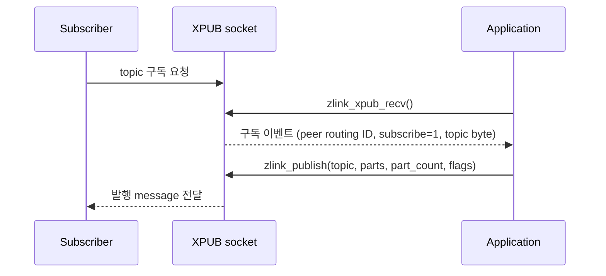

[English](https://zlink-systems.github.io/zlink/spec/core/socket/04-xpub/) | 한국어

<!-- zlink-nav:start -->
[소켓 목차](README.ko.md) | [이전: SUB](03-sub.ko.md) | [다음: XSUB](05-xsub.ko.md)
<!-- zlink-nav:end -->

# Socket — XPUB

> **이 장이 정의하는 것** — XPUB socket(구독 이벤트를 message로 노출하는 PUB)의 공개 계약.

## 1. XPUB 개요

XPUB는 구독 전달과 수동 제어를 지원하는 확장 publisher다. message를 주고받는 endpoint인
[socket](../glossary.ko.md#socket) 중 발행하는 쪽이라는 점은 PUB와 같지만, XPUB는 구독하는
쪽 peer(subscriber)가 보내는 구독·해제 요청을 구독 이벤트 message로 수신하고 수동 구독
관리를 지원한다. 기본 mode에서 event로 공개되는 것은 어떤 topic을 처음 요청한 subscribe와 그
topic을 요청하는 subscriber가 더는 남지 않게 한 마지막 unsubscribe뿐이다 — 이미 구독 중인
topic의 중복 subscribe나 다른 subscriber가 아직 남은 unsubscribe는 `ZLINK_PUB_OPT_VERBOSE` /
`ZLINK_PUB_OPT_VERBOSER`를 켜야 event로 보인다([§4](#4-pub-옵션-zlink_pub_option_t)).

이 문서는 XPUB 고유의 공개 계약 — PUB/XPUB 전용 옵션, whole-message 발행, 구독 이벤트
수신 — 을 정의한다.

관련 계약의 소유 문서는 다음과 같다.

| 관련 계약 | 정의하는 문서 |
|---|---|
| 모든 socket 타입 공통 옵션·API 형태·수신 모델 | [Socket 공통](README.ko.md) |
| PUB socket의 계약 | [PUB](02-pub.ko.md) |
| SUB·XSUB socket의 계약 | [SUB](03-sub.ko.md) · [XSUB](05-xsub.ko.md) |
| 공개 result와 errno 대응 | [Errors](../03-errors.ko.md#result와-errno-대응) |

## 2. 구독 이벤트 흐름

subscriber가 보낸 구독·해제 요청은 XPUB에 구독 이벤트 message로 도착한다. application은
[`zlink_xpub_recv`](#zlink_xpub_recv)로 이 이벤트를 하나씩 꺼내며, 각 이벤트에서
어느 peer가 보냈는지(routing ID), 구독인지 해제인지, 어느 topic인지를 관찰한다. 구독 이벤트는
단일 frame이다 — 첫 byte가 subscribe면 `0x01`, unsubscribe면 `0x00`이고 나머지 byte가 topic(구독
대상을 구분하는 byte 열)이다. 빈 topic의 이벤트도 첫 byte 하나를 가진다. `zlink_xpub_recv`가
첫 byte를 `*subscribed_out_`로, 나머지를 topic output으로 나눠 돌려주므로 application이 frame을
직접 해석할 일은 없다.

수동 구독 관리는 `ZLINK_PUB_OPT_MANUAL`로 켠다. manual 모드의 구독 승인은
`ZLINK_PUB_OPT_APPROVE_SUBSCRIBE`, 거부는 `ZLINK_PUB_OPT_REJECT_SUBSCRIBE` 옵션으로
설정한다. 중복 구독·해제까지 이벤트로 공개하는 verbose 계열을 포함한 전체 옵션은
[§4](#4-pub-옵션-zlink_pub_option_t)에 있다.



## 3. HWM 도달 시 drop과 backpressure

`ZLINK_PUB_OPT_NODROP`의 기본값은 `0`이다. fanout 전달은 손실을 허용한다. 송신 queue가
유지할 byte 상한인 [HWM](../glossary.ko.md#hwm)(High-Water Mark)에 도달했을 때
`zlink_publish()`는 해당 subscriber에 대한 message를 버리고 성공을 보고한다. 송신
queue가 찼을 때 drop 대신 publisher의 추가 제출을 제한하는
[backpressure](../glossary.ko.md#backpressure)를 주려면 명시적으로 `1`로 설정해야 하며,
이때 `zlink_publish()`는 `ZLINK_SUBMIT_BACKPRESSURED`를 반환한다. HWM 검사 대상은 현재
topic의 filter에 맞는 pipe뿐이다 — 그중 하나라도 차 있으면 그 record를 filter가 맞는 어떤
subscriber에도 전달하지 않고, filter가 맞지 않는 subscriber의 pipe 상태는 이 publish에 영향을
주지 않는다.

`1`로 설정하면 publisher가 가장 느린 subscriber에 묶인다. 한 pipe가 차면 같은
socket의 모든 subscriber에 대한 전달이 멈추기 때문이다. subscriber 속도에
의존하면 안 되는 신뢰 전달은 XPUB/XSUB가 아니라 request-reply socket이 담당한다.

## 4. Pub 옵션 (`zlink_pub_option_t`)

`zlink_set_pub_option()` / `zlink_get_pub_option()`과 함께 사용한다.

```c
typedef enum zlink_pub_option_t
{
    ZLINK_PUB_OPT_VERBOSE = 0x3301,            // 이미 구독 중인 topic의 subscribe도 event로 공개 (int; 0=off, 양수=on (getter는 0/1 반환))
    ZLINK_PUB_OPT_VERBOSER = 0x3302,           // 중복 subscribe와 모든 unsubscribe를 event로 공개 (int; 0=off, 양수=on (getter는 0/1 반환))
    ZLINK_PUB_OPT_MANUAL = 0x3303,             // XPUB 수동 구독 관리 (int; 0=off, 양수=on (getter는 0/1 반환))
    ZLINK_PUB_OPT_MANUAL_LAST_VALUE = 0x3304,  // manual 모드 활성 + 다음 발행을 마지막 구독 event pipe에만 전달 (int; 0=off, 양수=on (getter는 0/1 반환))
    ZLINK_PUB_OPT_NODROP = 0x3305,             // HWM 시 drop 대신 EAGAIN 반환 (int; 0=off, 양수=on (getter는 0/1 반환), 기본값 0)
    ZLINK_PUB_OPT_WELCOME_MSG = 0x3306,        // 새 subscriber 연결 시 전송 message (binary)
    ZLINK_PUB_OPT_TOPICS_COUNT = 0x3307,       // 구독된 topic 수 (int, 읽기 전용)
    ZLINK_PUB_OPT_APPROVE_SUBSCRIBE = 0x3308,  // manual 모드 구독 승인 (binary)
    ZLINK_PUB_OPT_REJECT_SUBSCRIBE = 0x3309    // manual 모드 구독 거부 (binary)
} zlink_pub_option_t;
```

`ZLINK_PUB_OPT_NODROP`이 바꾸는 HWM 도달 시 동작은
[§3](#3-hwm-도달-시-drop과-backpressure)이 설명한다.

기본 옵션 상태는 다음과 같다.

- `VERBOSE`, `VERBOSER`, `MANUAL`, `MANUAL_LAST_VALUE`는 모두 `0`이다.
- `WELCOME_MSG`는 빈 byte 열이며, 새 subscriber pipe에 welcome message를 전송하지
  않는다.
- `TOPICS_COUNT`는 초기에 `0`이다.

`ZLINK_PUB_OPT_MANUAL_LAST_VALUE`를 활성화하면 manual 모드도 함께 활성화되고,
다음 발행은 마지막 구독 event를 낸 pipe에만 전달된다. 발행 message를
저장하는 latest-value cache를 활성화하는 옵션이 아니다.

## 5. 함수

### zlink_set_pub_option

PUB/XPUB socket 전용 옵션을 설정한다.

```c
ZLINK_EXPORT zlink_config_result_t zlink_set_pub_option (void *handle_,
                           zlink_pub_option_t option_,
                           const void *optval_,
                           size_t optvallen_);
```

PUB/XPUB socket 옵션을 설정한다. 모든 socket 타입에 공유되는 공통 옵션은
`zlink_set_option()`을 사용한다.

**반환값:** 성공 시 `ZLINK_CONFIG_OK`, 실패 시 `zlink_config_result_t` 값. `zlink_errno()`는 진단용 내부 errno를 그대로 유지한다.

**참고:** `zlink_get_pub_option`, `zlink_set_option`

---

### zlink_get_pub_option

pub 전용 옵션을 조회한다.

```c
ZLINK_EXPORT zlink_config_result_t zlink_get_pub_option (void *handle_,
                           zlink_pub_option_t option_,
                           void *optval_,
                           size_t *optvallen_);
```

PUB/XPUB socket 옵션의 현재 값을 가져온다.

**반환값:** 성공 시 `ZLINK_CONFIG_OK`, 실패 시 `zlink_config_result_t` 값. `zlink_errno()`는 진단용 내부 errno를 그대로 유지한다.

**참고:** `zlink_set_pub_option`

---

### zlink_publish

raw `XPUB` socket에서 message record 하나를 발행한다.

```c
ZLINK_EXPORT zlink_submit_result_t zlink_publish (
  void *subject_, const char *topic_id_, zlink_msg_t *parts_,
  size_t part_count_, zlink_send_flags_t flags_);
```

`topic_id_ == NULL`이면 첫 message frame이 wire prefix 규칙에 따라 topic을
운반한다. NULL이 아니면 `topic_id_`는 NUL로 끝나며 내부 NUL이 없는 byte
문자열이어야 한다. 종료 NUL 앞의 모든 byte가 topic이며 Core가 이 byte를
message 앞의 topic frame으로 추가한다.

별도의 topic 전용 최대 길이는 없으며 topic byte도 message와 storage 크기 제한에
포함된다. 크기 제한을 넘으면 `ZLINK_SUBMIT_INVALID_ARGUMENT`와 `EMSGSIZE`,
topic frame용 storage를 확보하지 못하면 `ZLINK_SUBMIT_OUT_OF_MEMORY`와 `ENOMEM`을
반환한다.

`parts_` 배열과 `part_count_`가 publish record를 구성한다. `part_count_`는 양수여야 하며 `0`은
`ZLINK_SUBMIT_INVALID_ARGUMENT`+`EINVAL`이다. Part는 배열 순서대로 전달된다.

이 함수는 성공과 실패 모두에서 모든 입력 슬롯을 소비한다. 같은 record를
다시 사용할 가능성이 있으면 호출 전에 전체를 복사한다. 소비된 각 `zlink_msg_t`는 초기화된 빈
message로 남으므로 그대로 close하거나 다시 쓸 수 있다.

non-blocking 발행은 `flags_`에
`ZLINK_DONTWAIT`를 전달하며, 즉시 진행할 수 없으면
`ZLINK_SUBMIT_BACKPRESSURED`를 반환한다.

Core는 record 전체를 원자적으로 admission한다. 실패하면 subscriber에는 어느 part도 보이지 않으며,
caller는 보관한 record 전체를 다시 제출한다. 이 계약은
[PUB §3](02-pub.ko.md#3-whole-message-발행과-publish-record)이 소유한다.

적용 타입은 raw `PUB`, raw `XPUB`다. 다른 타입은
`ZLINK_SUBMIT_NOT_SUPPORTED`, `errno == ENOTSUP`이다. 전체 결과 대응은
[errno map](../03-errors.ko.md#result와-errno-대응)을 따른다.

**참고:** `zlink_xpub_recv`

---

### zlink_xpub_recv

XPUB socket에서 구독 이벤트를 수신한다.

```c
ZLINK_EXPORT zlink_recv_result_t zlink_xpub_recv (
  void *xpub_,
  const zlink_routing_id_t **source_rid_out_,
  int *subscribed_out_,
  char *topic_id_buf_, size_t topic_id_capacity_, size_t *topic_id_len_out_,
  zlink_recv_flags_t flags_);
```

recv 모드에서 다음 구독 이벤트를 수신한다. `subscribed_out_`과 `topic_id_len_out_`은 필수
output이고, `topic_id_capacity_`가 0보다 크면 `topic_id_buf_`도 필수다 — 이 pointer 중 하나라도
NULL이면 event를 읽거나 output을 바꾸기 전에 `ZLINK_RECV_INVALID_HANDLE`과 `EFAULT`로 실패한다.
`source_rid_out_`는 NULL을 허용하는 선택 output이다. NULL이 아니면, 아직 연결된 peer가 보낸
이벤트에서는 `*source_rid_out_`가 그 peer의 Core 소유 routing ID view로 설정되며 수명은
[Socket 공통의 borrowed RID 규칙](README.ko.md#3-pull-수신과-completion-모델)을 따른다(같은 socket의
다음 data receive API 진입 또는 close까지 유효). peer 연결이 끊겨 Core가 만든 unsubscribe
이벤트이거나, 이벤트를 꺼내기 전에 그 peer가 끊겼으면 `*source_rid_out_`는 `NULL`이다.
`*subscribed_out_`는
subscribe이면 1, unsubscribe이면 0이다. `topic_id_buf_` /
`*topic_id_len_out_`에 topic byte가 기록된다(binary-safe).

다른 socket의 receive와 poller·completion·monitor 호출은 이 view의 수명에 영향을 주지 않는다. 값을
후속 호출 이후에도 보관하려면 반환 즉시 복사한다.

호출자는 `topic_id_capacity_`로 buffer 크기를 전달하며, topic buffer 부족의 결과는
[Socket 공통의 typed receive buffer 계약](README.ko.md#3-pull-수신과-completion-모델)을 따른다:
용량이 topic 길이보다 작으면 `*topic_id_len_out_`에 필요한 길이를 기록하고
`ZLINK_RECV_BUFFER_TOO_SMALL`과 `ENOBUFS`를 반환하며, event는 보존되어 충분한 buffer의 다음 수신이
같은 event를 한 번 반환한다.

적용 대상: raw XPUB만.

**반환값:** 성공 시 `ZLINK_RECV_OK`, 실패 시 `zlink_recv_result_t` 값.
`zlink_errno()`는 진단용 내부 errno를 그대로 유지한다.

**에러:** `xpub_`, `subscribed_out_`, `topic_id_len_out_`가 NULL이거나 `topic_id_capacity_ > 0`인데
`topic_id_buf_`가 NULL이면 `ZLINK_RECV_INVALID_HANDLE`과 `EFAULT`. `flags_`에 `ZLINK_RECV_FLAGS_DONTWAIT`가 설정되고
이벤트가 없으면 `ZLINK_RECV_NO_DATA`와 `EAGAIN`. topic이 `topic_id_capacity_`보다 길면
`ZLINK_RECV_BUFFER_TOO_SMALL`과 `ENOBUFS`. subject가 XPUB가 아니면 `ZLINK_RECV_NOT_SUPPORTED`와 `ENOTSUP`.

**참고:** `zlink_publish`

---

## 6. Receive flow state

XPUB은 receive-flow 대상 socket type이 아니다.
`zlink_socket_set_receive_flow_state()`는 XPUB socket에 대해 `errno == ENOTSUP`과 함께
`ZLINK_CONFIG_NOT_SUPPORTED`를 반환하고 아무것도 바꾸지 않는다. 기존 byte HWM,
low water mark와 transport backpressure는 그대로 유지된다. XPUB socket의 monitor는
`ZLINK_MONITOR_STATUS_DETAIL_FLOW_STATE`를 설정하지 않고
`ZLINK_EVENT_SEND_FLOW_PAUSED`, `ZLINK_EVENT_SEND_FLOW_RESUMED`,
`ZLINK_EVENT_FLOW_STATE_STALE`를 발생시키지 않는다.

## 7. 구현 및 contract test 검증 요구

공개 표면(`zlink_set_pub_option`·`zlink_get_pub_option`, `zlink_publish`,
`zlink_xpub_recv`, `zlink_socket_set_receive_flow_state`, 반환값·errno)만으로 다음을
확인한다. 각 항목은 unit test 하나로 이어진다.

**옵션**
- `zlink_set_pub_option`·`zlink_get_pub_option`은 성공 시 `ZLINK_CONFIG_OK`, 실패 시 `zlink_config_result_t` 값을 반환하며 `zlink_errno()`는 진단용 내부 errno를 그대로 유지한다.
- `ZLINK_PUB_OPT_TOPICS_COUNT`는 읽기 전용 `int`이며 조회 시 구독된 topic 수를 돌려준다.
- 초기에 `VERBOSE`, `VERBOSER`, `MANUAL`, `MANUAL_LAST_VALUE`, `TOPICS_COUNT`는 `0`이고, 빈 `WELCOME_MSG`는 새 subscriber pipe에 message를 전송하지 않는다.
- `ZLINK_PUB_OPT_MANUAL_LAST_VALUE`를 활성화하면 manual 모드가 활성화되고, 다음 발행은 마지막 구독 event pipe에만 전달된다.

**구독 이벤트 수신 (`zlink_xpub_recv`)**
- raw XPUB에 구독 이벤트가 있으면 `ZLINK_RECV_OK`와 함께 `*subscribed_out_`(subscribe=1, unsubscribe=0), 구독 peer의 routing ID pointer, topic byte(binary-safe)가 관찰된다.
- `source_rid_out_`은 NULL을 허용하는 선택 output이다.
- 아직 연결된 peer의 이벤트에서 `*source_rid_out_`의 routing ID view는 같은 socket의 다음 data receive API 진입 또는 close까지 유효하며, 다른 socket의 receive는 이를 바꾸지 않는다. 값을 보관하려면 반환 즉시 복사한다.
- peer 연결이 끊겨 Core가 만든 unsubscribe 이벤트, 또는 꺼내기 전에 peer가 끊긴 이벤트는 `ZLINK_RECV_OK`이지만 `*source_rid_out_ == NULL`이다.
- `flags_`에 `ZLINK_RECV_FLAGS_DONTWAIT`가 설정되고 이벤트가 없으면 `ZLINK_RECV_NO_DATA`와 `EAGAIN`이다.
- topic이 `topic_id_capacity_`보다 길면 `*topic_id_len_out_`에 필요 길이를 기록하고 `ZLINK_RECV_BUFFER_TOO_SMALL`·`ENOBUFS`를 반환하며, event는 내부에 보관되어 충분한 buffer의 다음 수신이 같은 event를 한 번 반환한다.
- subject가 raw XPUB가 아니면 `ZLINK_RECV_NOT_SUPPORTED`와 `ENOTSUP`이다.
- `xpub_`가 NULL이면 `EFAULT`다.

**발행과 topic (`zlink_publish`)**
- `topic_id_`가 NULL이 아니면 종료 NUL 앞의 byte가 topic frame으로 message 앞에 추가되고, NULL이면 첫 message frame이 wire prefix 규칙에 따라 topic을 운반한다.
- topic byte를 포함한 크기 제한을 넘으면 `ZLINK_SUBMIT_INVALID_ARGUMENT`와 `EMSGSIZE`, topic frame용 storage를 확보하지 못하면 `ZLINK_SUBMIT_OUT_OF_MEMORY`와 `ENOMEM`이다.
- raw `PUB`·raw `XPUB`가 아닌 타입에 호출하면 `ZLINK_SUBMIT_NOT_SUPPORTED`, `errno == ENOTSUP`이다.
- 모든 `parts_` 슬롯은 성공·실패 모두 소비되며 초기화된 빈 message로 남는다 — 그대로 close하거나 다시 쓸 수 있다.
- `ZLINK_DONTWAIT`로 즉시 진행할 수 없으면 `ZLINK_SUBMIT_BACKPRESSURED`다.

**Whole-message publish record**
- `parts_` 배열의 part는 배열 순서대로 하나의 publish record로 전달된다.
- Backpressure를 포함해 호출이 실패하면 subscriber에는 그 record의 어떤 part도 보이지 않고 모든 입력 슬롯은 소비되며, caller는 보관한 record 전체를 다시 제출한다([PUB §3](02-pub.ko.md#3-whole-message-발행과-publish-record)).

**HWM 도달 시 drop과 NODROP**
- `ZLINK_PUB_OPT_NODROP`이 기본값 `0`이면 HWM에 도달한 subscriber에 대한 message를 버리고 `zlink_publish()`는 성공을 보고한다.
- `1`로 설정하면 송신 queue가 찼을 때 `zlink_publish()`가 `ZLINK_SUBMIT_BACKPRESSURED`를 반환한다.

**Receive flow state**
- `zlink_socket_set_receive_flow_state()`는 XPUB socket에 대해 `ZLINK_CONFIG_NOT_SUPPORTED`와 `errno == ENOTSUP`을 반환하고 아무것도 바꾸지 않는다.
- XPUB socket의 monitor는 `ZLINK_MONITOR_STATUS_DETAIL_FLOW_STATE`를 설정하지 않고 `ZLINK_EVENT_SEND_FLOW_PAUSED`, `ZLINK_EVENT_SEND_FLOW_RESUMED`, `ZLINK_EVENT_FLOW_STATE_STALE`를 발생시키지 않는다.

<!-- zlink-nav:start -->
[소켓 목차](README.ko.md) | [이전: SUB](03-sub.ko.md) | [다음: XSUB](05-xsub.ko.md)
<!-- zlink-nav:end -->
