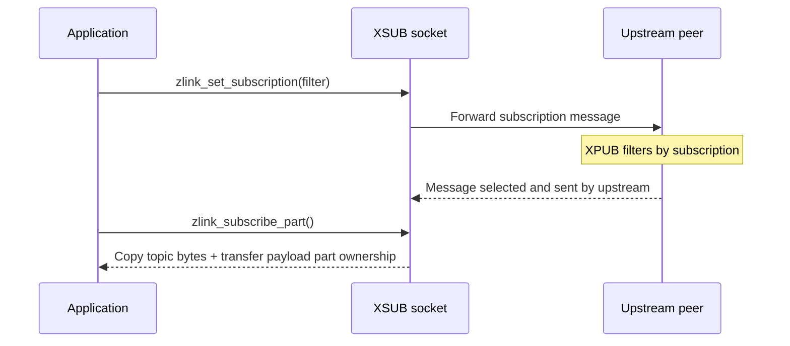

[한국어](https://zlink-systems.github.io/zlink/ko/spec/core/socket/05-xsub/) | English

<!-- zlink-nav:start -->
[Socket Index](README.en.md) | [Previous: XPUB](04-xpub.en.md) | [Next: DEALER](06-dealer.en.md)
<!-- zlink-nav:end -->

# Socket — XSUB

> **What this chapter defines** — The public contract of the XSUB socket (a SUB that sends subscriptions as messages).

## 1. XSUB Overview

XSUB is an extended subscriber [socket](../glossary.en.md#socket) that supports
subscription forwarding. XSUB supports the same subscribe/unsubscribe and topic
receive APIs as SUB, but does not filter received messages with its own filter
matching. A connected XPUB receives XSUB's subscription messages and performs
upstream filtering. XSUB delivers every message that actually arrives to the
application.

This document defines the public contract for registering, removing, and querying
subscriptions on XSUB and for receiving topic messages one part at a time. Its
intended audience is developers who map this contract to the C API and each
language binding.

The following documents own the related contracts.

| Related contract | Defining document |
|---|---|
| Common socket options, receive model, and common functions (`zlink_set_option`, etc.) | [Socket Common](README.en.md) |
| SUB socket subscription behavior (subscription APIs shared with XSUB) | [SUB](03-sub.en.md) |
| Publisher-side subscription event observation and manual subscription management | [XPUB](04-xpub.en.md) |

## 2. Subscription Behavior

XSUB subscriptions operate on topic filters.

1. The application registers a topic filter with
   [`zlink_set_subscription`](#zlink_set_subscription). XSUB increments a
   reference count when the same filter is registered more than once.
2. The subscription message is forwarded upstream. The publisher-side XPUB is
   responsible for filtering and selects only messages whose topics match the
   filter byte prefix. [XPUB](04-xpub.en.md) owns the contract for observing and
   manually managing subscription events.
3. XSUB does not apply its own filter matching. It delivers every message that
   actually arrives so that the application can receive it one part at a time
   with [`zlink_subscribe_part`](#zlink_subscribe_part).
4. [`zlink_unset_subscription`](#zlink_unset_subscription) decrements the
   reference count of a registered subscription. XSUB sends an upstream
   unsubscribe message only when the last registration is removed. Removing an
   unregistered filter sends no message upstream.



Query the number of currently subscribed topics with the
`ZLINK_SUB_OPT_TOPICS_COUNT` option and query individual subscription filters
with [`zlink_subscription_at`](#zlink_subscription_at).

## 3. Sub Options (`zlink_sub_option_t`)

Use these options with `zlink_set_sub_option()` / `zlink_get_sub_option()`.

```c
typedef enum zlink_sub_option_t
{
    ZLINK_SUB_OPT_TOPICS_COUNT = 0x3400  // Number of subscribed topics (read-only, int)
} zlink_sub_option_t;
```

## 4. Functions

### zlink_set_sub_option

Sets an option specific to SUB/XSUB sockets.

```c
ZLINK_EXPORT zlink_config_result_t zlink_set_sub_option (void *handle_,
                           zlink_sub_option_t option_,
                           const void *optval_,
                           size_t optvallen_);
```

Sets a SUB/XSUB socket option. Use `zlink_set_option()` for common options shared
by all socket types.

**Returns:** `ZLINK_CONFIG_OK` on success; otherwise a `zlink_config_result_t` value. `zlink_errno()` retains the detailed internal errno for diagnostics.

**See also:** `zlink_get_sub_option`, `zlink_set_option`

---

### zlink_get_sub_option

Gets an option specific to SUB/XSUB sockets.

```c
ZLINK_EXPORT zlink_config_result_t zlink_get_sub_option (void *handle_,
                           zlink_sub_option_t option_,
                           void *optval_,
                           size_t *optvallen_);
```

Gets the current value of a SUB/XSUB socket option.

**Returns:** `ZLINK_CONFIG_OK` on success; otherwise a `zlink_config_result_t` value. `zlink_errno()` retains the detailed internal errno for diagnostics.

**See also:** `zlink_set_sub_option`

---

### zlink_set_subscription

Subscribes to a topic filter.

```c
ZLINK_EXPORT zlink_config_result_t zlink_set_subscription (void *handle_, const char *filter_);
```

Registers `filter_` in XSUB's subscription list and forwards a subscription
message upstream. `filter_` is a NUL-terminated string and cannot contain an
embedded NUL. The bytes before the terminating NUL are the basis for the
upstream XPUB's byte-prefix filtering. An empty string requests every message.
There is no wildcard syntax, and a trailing `*` is a literal byte. XSUB itself
does not use this filter to filter received messages. Registering the same
filter more than once increments its reference count.

Applicable types: raw SUB, raw XSUB.

**Returns:** `ZLINK_CONFIG_OK` on success; otherwise a `zlink_config_result_t` value. `zlink_errno()` retains the detailed internal errno for diagnostics.

**Errors:** `EFAULT` if `handle_` is NULL. `EINVAL` if `filter_` is NULL or the
handle type does not support subscriptions.

**See also:** `zlink_unset_subscription`, `zlink_subscribe_part`

---

### zlink_unset_subscription

Unsubscribes from a topic filter.

```c
ZLINK_EXPORT zlink_config_result_t zlink_unset_subscription (void *handle_, const char *filter_);
```

Removes a previously registered subscription. `filter_` must be a
NUL-terminated string without an embedded NUL. It uses the same byte-prefix
interpretation as `zlink_set_subscription()`: the bytes before the terminating
NUL must match the previously registered prefix. If the same filter was
registered more than once, this function only decrements the reference count.
It sends an upstream unsubscribe message only when removing the last
registration. Removing an unregistered filter sends no upstream unsubscribe
message.

Applicable types: raw SUB, raw XSUB.

**Returns:** `ZLINK_CONFIG_OK` on success; otherwise a `zlink_config_result_t` value. `zlink_errno()` retains the detailed internal errno for diagnostics.

**Errors:** `EFAULT` if `handle_` is NULL. `EINVAL` if `filter_` is NULL or the
handle type does not support unsubscription.

**See also:** `zlink_set_subscription`

---

### zlink_subscribe_part

Receives one payload part of a topic message from a raw `XSUB` socket.

```c
ZLINK_EXPORT zlink_recv_result_t zlink_subscribe_part (
  void *sub_,
  const zlink_routing_id_t **source_rid_out_,
  char *topic_id_buf_,
  size_t topic_id_capacity_,
  size_t *topic_id_len_out_,
  zlink_msg_t *part_out_,
  zlink_part_flag_t *has_more_out_,
  zlink_recv_flags_t flags_);
```

`topic_id_len_out_`, an initialized `part_out_`, and `has_more_out_` are
required. `source_rid_out_` is optional and receives `NULL` on success for raw
XSUB. On success, the function copies the binary topic bytes into the caller's
buffer without a NUL and transfers ownership of the payload part to the caller.
The caller must close the received part exactly once with
`zlink_msg_close(part_out_)`.

If `topic_id_capacity_ == 0` or is too small for the topic, the function writes
the required topic length to `*topic_id_len_out_` and returns
`ZLINK_RECV_BUFFER_TOO_SMALL` with `ENOBUFS`. It does not consume the queued
topic or payload, and leaves `part_out_` and every output other than
`topic_id_len_out_` unchanged. It also does not transfer part ownership, so the
caller can receive the same message again with a sufficient buffer. If capacity
is greater than zero but `topic_id_buf_` is NULL, the function returns
`ZLINK_RECV_INVALID_HANDLE` with `EFAULT` before inspecting or consuming the
queue and leaves every output and `part_out_` unchanged.

Receive every part of one multipart message, from the first payload part
through the last, on the same thread with this function. `*has_more_out_` is
`ZLINK_PART_MORE` when another part follows and `ZLINK_PART_FINAL` for the last
part. This function applies to raw SUB and raw XSUB.

---

### zlink_subscription_at

Gets the subscription filter at the specified index.

```c
ZLINK_EXPORT zlink_config_result_t zlink_subscription_at (void *handle_,
                           size_t index_,
                           char *filter_out_,
                           size_t *filter_len_inout_,
                           int *is_pattern_out_);
```

`index_` is a zero-based index into a snapshot of the subscriptions at query
time, sorted in lexicographically ascending order by the filter byte sequence;
it is not the registration order. On success, `filter_out_` contains only the
filter bytes and no terminating NUL. This output is therefore not a C string.
On entry, `*filter_len_inout_` is the buffer size; on return, it is the filter
length in bytes. `is_pattern_out_` is an optional output that may be NULL. When
it is not NULL, the function reports whether the filter is a pattern
subscription. All raw subscriptions are byte-prefix filters, so it writes `0`.

If the buffer is too small, the function writes the required length to
`*filter_len_inout_` and returns `ZLINK_CONFIG_BUFFER_TOO_SMALL` with
`errno == ENOBUFS`. It writes no partial data to `filter_out_` and leaves
`*is_pattern_out_` unchanged. It does not consume or modify the subscription
inventory, so the caller can query the same `index_` again with a sufficient
buffer.

Applicable types: raw SUB, raw XSUB.

**Returns:** `ZLINK_CONFIG_OK` on success; otherwise a `zlink_config_result_t` value. `zlink_errno()` retains the detailed internal errno for diagnostics.

**Errors:** `ENOENT` if `index_` is out of range. `ENOBUFS` if the buffer is too
small. `ENOTSUP` if the handle type does not support subscription queries.

**See also:** `zlink_set_subscription`, `zlink_get_sub_option`

## 5. Receive Flow State

XSUB has no paired [completion progress lane](../glossary.en.md#completion-progress-lane)
used by DEALER and ROUTER to advance terminal replies, so it has no receive-flow
state. `zlink_socket_set_receive_flow_state()` returns
`ZLINK_CONFIG_NOT_SUPPORTED` with `errno == ENOTSUP` for an XSUB socket and
changes nothing. The byte [HWM](../glossary.en.md#hwm) defined by [Socket
Common](README.en.md) (the value that applies [backpressure](../glossary.en.md#backpressure)
by limiting the bytes retained in a queue), low water mark, and transport
backpressure remain in effect. An XSUB socket monitor does not set
`ZLINK_MONITOR_STATUS_DETAIL_FLOW_STATE` and does not emit
`ZLINK_EVENT_SEND_FLOW_PAUSED`, `ZLINK_EVENT_SEND_FLOW_RESUMED`, or
`ZLINK_EVENT_FLOW_STATE_STALE`.

## 6. Implementation and Contract Test Verification Requirements

Verify the following through only the public surface
(`zlink_set_sub_option`/`zlink_get_sub_option`, the subscription registration,
removal, and query functions, `zlink_subscribe_part`,
`zlink_socket_set_receive_flow_state`, return values, and errno). Each item maps
to one unit test.

**Options**

- Querying `ZLINK_SUB_OPT_TOPICS_COUNT` with `zlink_get_sub_option` returns the
  number of subscribed topics as an `int` (read-only).
- Each function that returns `zlink_config_result_t` returns `ZLINK_CONFIG_OK`
  on success and a `zlink_config_result_t` value on failure;
  `zlink_errno()` retains the detailed internal errno for diagnostics.

**Subscription Registration, Removal, and Delivery**

- `zlink_set_subscription` requests byte-prefix filtering by the upstream XPUB
  based on the bytes before the terminating NUL. An empty string requests every
  message, and a trailing `*` is a literal byte rather than a wildcard.
- XSUB does not apply its own filter matching on receive. It delivers every
  message that actually arrives from upstream to the application regardless of
  the registered filters.
- Registering a subscription on raw XSUB forwards a subscription message
  upstream. [XPUB](04-xpub.en.md) owns publisher-side filtering and observation.
- Registering the same filter more than once increments its reference count.
  `zlink_unset_subscription` decrements the count and sends an upstream
  unsubscribe message only when removing the last registration. Removing an
  unregistered filter sends nothing upstream.
- Both functions report `EFAULT` when `handle_` is NULL and `EINVAL` when
  `filter_` is NULL or the handle type does not support subscription or
  unsubscription, respectively.

**Subscription Query**

- The zero-based `index_` of `zlink_subscription_at` follows snapshot order
  sorted by the filter byte sequence, not registration order.
- On success, `filter_out_` contains only the filter bytes and no terminating
  NUL. `*filter_len_inout_` is the byte length, and `filter_out_` is not a C
  string.
- `is_pattern_out_` is an optional output that may be NULL. When provided, it
  receives `0` because all raw subscriptions are byte-prefix filters.
- If the buffer is too small, the function writes the required length to
  `*filter_len_inout_` and fails with `ZLINK_CONFIG_BUFFER_TOO_SMALL` and
  `ENOBUFS`. It writes no partial data to `filter_out_`, leaves
  `*is_pattern_out_` unchanged, and does not consume or modify the subscription
  inventory, so the caller can query the same `index_` again with a sufficient
  buffer.
- An out-of-range `index_` reports `ENOENT`; a handle type that does not support
  subscription queries reports `ENOTSUP`.

**Topic Part Receive**

- When `zlink_subscribe_part` succeeds, it copies the binary topic bytes into
  the caller's buffer without a NUL and transfers ownership of the payload part
  to the caller. The caller closes the received part exactly once with
  `zlink_msg_close(part_out_)`. On raw XSUB, `source_rid_out_` receives `NULL`
  on success.
- If `topic_id_capacity_ == 0` or is too small for the topic, the function
  writes the required topic length to `*topic_id_len_out_` and returns
  `ZLINK_RECV_BUFFER_TOO_SMALL` with `ENOBUFS`. It does not consume the queued
  topic or payload, leaves `part_out_` and every output other than
  `topic_id_len_out_` unchanged, and does not transfer part ownership, so the
  caller can receive the same message again with a sufficient buffer.
- If capacity is greater than zero but `topic_id_buf_` is NULL, the function
  returns `ZLINK_RECV_INVALID_HANDLE` with `EFAULT` before inspecting or
  consuming the queue and leaves every output and `part_out_` unchanged.
- Receive one multipart message continuously on the same thread with this
  function from the first payload part through the last. `*has_more_out_` is
  `ZLINK_PART_MORE` when another part follows and `ZLINK_PART_FINAL` for the
  last part.

**No Receive Flow State**

- `zlink_socket_set_receive_flow_state()` returns
  `ZLINK_CONFIG_NOT_SUPPORTED` with `errno == ENOTSUP` for an XSUB socket and
  changes nothing. The byte HWM, low water mark, and transport backpressure
  remain in effect.
- An XSUB socket monitor does not set
  `ZLINK_MONITOR_STATUS_DETAIL_FLOW_STATE` and does not emit
  `ZLINK_EVENT_SEND_FLOW_PAUSED`, `ZLINK_EVENT_SEND_FLOW_RESUMED`, or
  `ZLINK_EVENT_FLOW_STATE_STALE`.
