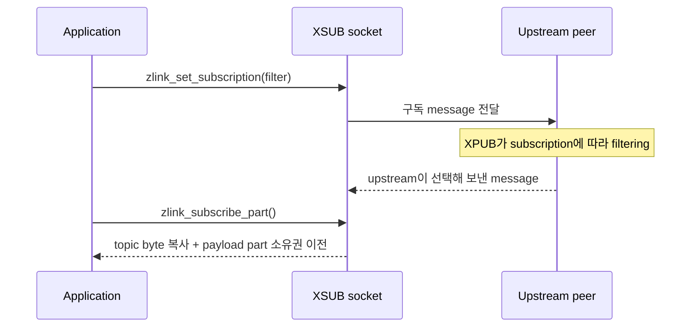

[English](https://zlink-systems.github.io/zlink/spec/core/socket/05-xsub/) | 한국어

<!-- zlink-nav:start -->
[소켓 목차](README.ko.md) | [이전: XPUB](04-xpub.ko.md) | [다음: DEALER](06-dealer.ko.md)
<!-- zlink-nav:end -->

# Socket — XSUB

> **이 장이 정의하는 것** — XSUB socket(구독을 message로 보내는 SUB)의 공개 계약.

## 1. XSUB 개요

XSUB는 구독 전달을 지원하는 확장 구독자 [socket](../glossary.ko.md#socket)이다. XSUB는
SUB와 동일한 subscribe/unsubscribe 및 topic 수신 API를 지원하지만, 자체
filter-match로 수신 message를 걸러내지 않는다. 연결된 XPUB가 XSUB의 구독 message를
받아 upstream에서 filtering하며, XSUB는 실제로 들어온 message를 모두 application에
전달한다.

이 문서는 XSUB에서 구독을 등록·해제·조회하고 topic message를 part 단위로 수신하는 공개
계약을 정의한다. 대상 독자는 이 계약을 C API와 각 언어 binding으로 옮기는 개발자다.

관련 계약의 소유 문서는 다음과 같다.

| 관련 계약 | 정의하는 문서 |
|---|---|
| socket 공통 옵션·수신 모델·공통 함수(`zlink_set_option` 등) | [Socket 공통](README.ko.md) |
| SUB socket의 구독 동작 (구독 API를 XSUB와 공유) | [SUB](03-sub.ko.md) |
| 발행자 쪽 구독 이벤트 관찰과 수동 구독 관리 | [XPUB](04-xpub.ko.md) |

## 2. 구독 동작

XSUB의 구독은 topic filter 단위로 진행한다.

1. Application이 [`zlink_set_subscription`](#zlink_set_subscription)으로 topic filter를
   등록한다. XSUB는 같은 filter를 중복 등록하면 reference count를 늘린다.
2. 구독 message가 upstream으로 전달된다. 발행자 쪽 XPUB가 filter byte-prefix에
   맞는 message만 선택하는 filtering을 담당한다. 구독 event를 관찰하고 수동으로
   관리하는 계약은 [XPUB](04-xpub.ko.md)가 소유한다.
3. XSUB는 자체 filter-match를 적용하지 않고 실제로 들어온 모든 message를
   [`zlink_subscribe_part`](#zlink_subscribe_part)로 part 하나씩 수신하도록 전달한다.
4. [`zlink_unset_subscription`](#zlink_unset_subscription)으로 등록한 구독의 reference
   count를 줄인다. 마지막 등록을 해제할 때만 upstream unsubscribe message를
   전송하며, 등록되지 않은 filter를 해제하면 upstream으로 아무 message도
   전송하지 않는다.



현재 구독된 topic 수는 `ZLINK_SUB_OPT_TOPICS_COUNT` 옵션으로, 개별 구독 filter는
[`zlink_subscription_at`](#zlink_subscription_at)으로 조회한다.

## 3. Sub 옵션 (`zlink_sub_option_t`)

`zlink_set_sub_option()` / `zlink_get_sub_option()`과 함께 사용한다.

```c
typedef enum zlink_sub_option_t
{
    ZLINK_SUB_OPT_TOPICS_COUNT = 0x3400  // 구독된 topic 수 (읽기 전용, int)
} zlink_sub_option_t;
```

## 4. 함수

### zlink_set_sub_option

SUB/XSUB socket 전용 옵션을 설정한다.

```c
ZLINK_EXPORT zlink_config_result_t zlink_set_sub_option (void *handle_,
                           zlink_sub_option_t option_,
                           const void *optval_,
                           size_t optvallen_);
```

SUB/XSUB socket 옵션을 설정한다. 모든 socket 타입에 공유되는 공통 옵션은
`zlink_set_option()`을 사용한다.

**반환값:** 성공 시 `ZLINK_CONFIG_OK`, 실패 시 `zlink_config_result_t` 값. `zlink_errno()`는 진단용 내부 errno를 그대로 유지한다.

**참고:** `zlink_get_sub_option`, `zlink_set_option`

---

### zlink_get_sub_option

SUB/XSUB socket 전용 옵션을 조회한다.

```c
ZLINK_EXPORT zlink_config_result_t zlink_get_sub_option (void *handle_,
                           zlink_sub_option_t option_,
                           void *optval_,
                           size_t *optvallen_);
```

SUB/XSUB socket 옵션의 현재 값을 가져온다.

**반환값:** 성공 시 `ZLINK_CONFIG_OK`, 실패 시 `zlink_config_result_t` 값. `zlink_errno()`는 진단용 내부 errno를 그대로 유지한다.

**참고:** `zlink_set_sub_option`

---

### zlink_set_subscription

topic filter를 구독한다.

```c
ZLINK_EXPORT zlink_config_result_t zlink_set_subscription (void *handle_, const char *filter_);
```

`filter_`을 XSUB의 구독 목록에 등록하고 구독 message를 upstream으로
전달한다. `filter_`는 NUL로 끝나는 문자열이며 내부 NUL을 포함할 수 없다.
종료 NUL 앞의 byte가 upstream XPUB의 byte-prefix filtering 기준이 된다. 빈 문자열은
모든 message를 요청하고, wildcard 구문은 없으며 후행 `*`도 literal byte다.
XSUB 자체는 이 filter로 수신 message를 걸러내지 않는다. 같은 filter를 중복
등록하면 reference count가 증가한다.

적용 대상: raw SUB, raw XSUB.

**반환값:** 성공 시 `ZLINK_CONFIG_OK`, 실패 시 `zlink_config_result_t` 값. `zlink_errno()`는 진단용 내부 errno를 그대로 유지한다.

**에러:** `handle_`이 NULL이면 `EFAULT`. `filter_`가 NULL이거나 handle 타입이
구독을 지원하지 않으면 `EINVAL`.

**참고:** `zlink_unset_subscription`, `zlink_subscribe_part`

---

### zlink_unset_subscription

topic filter 구독을 해제한다.

```c
ZLINK_EXPORT zlink_config_result_t zlink_unset_subscription (void *handle_, const char *filter_);
```

이전에 등록된 구독을 제거한다. `filter_`는 NUL로 끝나고 내부 NUL이 없는
문자열이어야 한다. `zlink_set_subscription()`과 같은 byte-prefix 해석을
사용하며 종료 NUL 앞의 byte가 이전에 등록한 prefix와 일치해야 한다.
같은 filter가 여러 번 등록되었다면 reference count만 줄이고, 마지막 등록을
해제할 때만 upstream unsubscribe message를 전송한다. 등록되지 않은 filter를
해제하면 upstream unsubscribe message를 전송하지 않는다.

적용 대상: raw SUB, raw XSUB.

**반환값:** 성공 시 `ZLINK_CONFIG_OK`, 실패 시 `zlink_config_result_t` 값. `zlink_errno()`는 진단용 내부 errno를 그대로 유지한다.

**에러:** `handle_`이 NULL이면 `EFAULT`. `filter_`가 NULL이거나 handle 타입이
구독 해제를 지원하지 않으면 `EINVAL`.

**참고:** `zlink_set_subscription`

---

### zlink_subscribe_part

raw `XSUB` socket에서 topic message의 payload part 하나를 수신한다.

```c
ZLINK_EXPORT zlink_recv_result_t zlink_subscribe_part (
  void *sub_,
  const zlink_routing_id_t **source_rid_out_,
  char *topic_id_buf_,
  size_t topic_id_capacity_,
  size_t *topic_id_len_out_,
  zlink_msg_t *part_out_,
  zlink_part_flag_t *has_more_out_,
  zlink_recv_flags_t flags_);
```

`topic_id_len_out_`, 초기화된 `part_out_`, `has_more_out_`은 필수다.
`source_rid_out_`은 선택 사항이며 raw XSUB에서는 성공 시 `NULL`을 받는다.
성공하면 topic의 binary byte를 호출자 buffer에 NUL 없이 복사하고 payload part의
소유권을 호출자에게 이전한다. 호출자는 받은 part를
`zlink_msg_close(part_out_)`로 정확히 한 번 닫아야 한다.

`topic_id_capacity_`가 topic 길이보다 작으면(길이 0 topic은 capacity 0으로 성공한다) 함수는
`*topic_id_len_out_`에 필요한 topic 길이를 기록하고
`ZLINK_RECV_BUFFER_TOO_SMALL`과 `ENOBUFS`를 반환한다. 이 경우 queue의 topic과
payload를 소비하지 않으며 `topic_id_len_out_`을 제외한 output과 `part_out_`은
변경하지 않는다. part 소유권도 이전하지 않으므로 호출자는 충분한 buffer로
같은 message를 다시 수신할 수 있다. 용량이 0보다 큰데 `topic_id_buf_`가
NULL이면 queue를 검사하거나 소비하기 전에 `ZLINK_RECV_INVALID_HANDLE`과
`EFAULT`를 반환하고 모든 output과 `part_out_`을 변경하지 않는다.

한 multipart message는 첫 payload part부터 마지막 part까지 같은 thread에서 이
함수로 계속 수신한다. `*has_more_out_`은 다음 part가 있으면
`ZLINK_PART_MORE`, 마지막이면 `ZLINK_PART_FINAL`이다. 이 함수는 raw SUB와
raw XSUB에 적용된다.

---

### zlink_subscription_at

지정된 index의 구독 filter를 조회한다.

```c
ZLINK_EXPORT zlink_config_result_t zlink_subscription_at (void *handle_,
                           size_t index_,
                           char *filter_out_,
                           size_t *filter_len_inout_,
                           int *is_pattern_out_);
```

`index_`는 조회 시점의 구독 snapshot을 filter byte 열의 사전식 오름차순으로
정렬한 결과에 대한 0-기반 index이며 등록 순서가 아니다. 호출이 성공하면
`filter_out_`에는 해당 filter byte만 기록하고 종료 NUL은 추가하지 않는다.
따라서 이 output은 C 문자열이 아니며, 진입 시 `*filter_len_inout_`는 buffer
크기이고 반환 시 filter byte 길이다. `is_pattern_out_`은 NULL을 허용하는
선택 output이다. NULL이 아니면 filter가 pattern 구독인지 기록하며,
모든 raw 구독은 byte-prefix filter이므로 `0`을 기록한다.

buffer가 작으면 필요한 길이를 `*filter_len_inout_`에 기록하고
`ZLINK_CONFIG_BUFFER_TOO_SMALL`, `errno == ENOBUFS`를 반환한다. 이 결과에서는
`filter_out_`에 부분 data를 기록하지 않고 `*is_pattern_out_`도 변경하지 않는다.
subscription inventory를 소비하거나 변경하지 않으므로 호출자는 같은 `index_`를
충분한 buffer로 다시 조회할 수 있다.

적용 타입: raw SUB, raw XSUB.

**반환값:** 성공 시 `ZLINK_CONFIG_OK`, 실패 시 `zlink_config_result_t` 값. `zlink_errno()`는 진단용 내부 errno를 그대로 유지한다.

**에러:** `index_`가 범위를 벗어나면 `ENOENT`. buffer가 작으면 `ENOBUFS`.
handle 타입이 구독 조회를 지원하지 않으면 `ENOTSUP`.

**참고:** `zlink_set_subscription`, `zlink_get_sub_option`

## 5. Receive flow state

XSUB은 receive-flow 대상 socket type이 아니다. `zlink_socket_set_receive_flow_state()`는 XSUB socket에 대해
`errno == ENOTSUP`과 함께 `ZLINK_CONFIG_NOT_SUPPORTED`를 반환하고 아무것도 바꾸지 않는다.
[Socket 공통](README.ko.md)이 정의하는 byte [HWM](../glossary.ko.md#hwm)(queue에 유지할
byte를 제한해 [backpressure](../glossary.ko.md#backpressure)를 적용하는 값)과
low water mark, transport backpressure는 그대로 유지된다. XSUB socket의 monitor는
`ZLINK_MONITOR_STATUS_DETAIL_FLOW_STATE`를 설정하지 않고
`ZLINK_EVENT_SEND_FLOW_PAUSED`, `ZLINK_EVENT_SEND_FLOW_RESUMED`,
`ZLINK_EVENT_FLOW_STATE_STALE`를 발생시키지 않는다.

## 6. 구현 및 contract test 검증 요구

공개 표면(`zlink_set_sub_option`·`zlink_get_sub_option`, 구독 등록·해제·조회 함수,
`zlink_subscribe_part`, `zlink_socket_set_receive_flow_state`, 반환값·errno)만으로 다음을
확인한다. 각 항목은 unit test 하나로 이어진다.

**옵션**
- `ZLINK_SUB_OPT_TOPICS_COUNT`를 `zlink_get_sub_option`으로 조회하면 구독된 topic 수를 `int`로 돌려준다 (읽기 전용).
- `zlink_config_result_t`를 반환하는 각 함수는 성공 시 `ZLINK_CONFIG_OK`, 실패 시 `zlink_config_result_t` 값을 반환하며 `zlink_errno()`는 진단용 내부 errno를 그대로 유지한다.

**구독 등록·해제·전달**
- `zlink_set_subscription`은 종료 NUL 앞의 byte를 upstream XPUB의 byte-prefix filtering 기준으로 요청한다. 빈 문자열은 모든 message를 요청하고, 후행 `*`는 wildcard가 아니라 literal byte다.
- XSUB는 자체 filter-match를 수신에 적용하지 않는다. upstream에서 실제로 들어온 message는 등록 filter와 관계없이 모두 application으로 전달된다.
- raw XSUB에 구독을 등록하면 구독 message가 upstream으로 전달된다. 발행자 쪽 filtering과 관찰은 [XPUB](04-xpub.ko.md)가 소유한다.
- 같은 filter를 중복 등록하면 reference count가 증가한다. `zlink_unset_subscription`은 count를 줄이고 마지막 등록을 해제할 때만 upstream unsubscribe message를 전송한다. 등록되지 않은 filter를 해제하면 upstream으로 전송하지 않는다.
- 두 함수 모두 `handle_`이 NULL이면 `EFAULT`, `filter_`가 NULL이거나 handle 타입이 구독(해제)을 지원하지 않으면 `EINVAL`이다.

**구독 조회**
- `zlink_subscription_at`의 0-기반 `index_`는 등록 순서가 아니라 filter byte 열로 정렬한 snapshot 순서를 따른다.
- 성공 시 `filter_out_`에는 filter byte만 기록되고 종료 NUL은 기록되지 않는다. `*filter_len_inout_`은 그 byte 길이며 `filter_out_`은 C 문자열이 아니다.
- `is_pattern_out_`은 NULL을 허용하는 선택 output이다. 제공하면 모든 raw 구독이 byte-prefix filter이므로 `0`이 기록된다.
- buffer가 작으면 필요한 길이를 `*filter_len_inout_`에 기록하고 `ZLINK_CONFIG_BUFFER_TOO_SMALL`과 `ENOBUFS`로 실패한다. `filter_out_`에 부분 data를 기록하지 않고 `*is_pattern_out_`도 변경하지 않으며, subscription inventory를 소비하거나 변경하지 않으므로 같은 `index_`를 충분한 buffer로 다시 조회할 수 있다.
- `index_`가 범위를 벗어나면 `ENOENT`, handle 타입이 구독 조회를 지원하지 않으면 `ENOTSUP`이다.

**topic part 수신**
- `zlink_subscribe_part`가 성공하면 topic의 binary byte가 NUL 없이 호출자 buffer에 복사되고 payload part의 소유권이 호출자에게 이전된다 — 받은 part는 `zlink_msg_close(part_out_)`로 정확히 한 번 닫는다. raw XSUB에서 `source_rid_out_`은 성공 시 `NULL`이다.
- `topic_id_capacity_`가 topic 길이보다 작으면(길이 0 topic은 capacity 0으로 성공) `*topic_id_len_out_`에 필요한 topic 길이를 기록하고 `ZLINK_RECV_BUFFER_TOO_SMALL`과 `ENOBUFS`를 반환한다. queue의 topic과 payload는 소비되지 않고 `topic_id_len_out_`을 제외한 output과 `part_out_`은 변하지 않으며, part 소유권도 이전되지 않으므로 충분한 buffer로 같은 message를 다시 수신할 수 있다.
- 용량이 0보다 큰데 `topic_id_buf_`가 NULL이면 queue를 검사하거나 소비하기 전에 `ZLINK_RECV_INVALID_HANDLE`과 `EFAULT`를 반환하고 모든 output과 `part_out_`은 변하지 않는다.
- 한 multipart message는 첫 payload part부터 마지막 part까지 같은 thread에서 이 함수로 계속 수신하며, `*has_more_out_`은 다음 part가 있으면 `ZLINK_PART_MORE`, 마지막이면 `ZLINK_PART_FINAL`이다.

**Receive flow state 없음**
- `zlink_socket_set_receive_flow_state()`는 XSUB socket에 대해 `errno == ENOTSUP`과 함께 `ZLINK_CONFIG_NOT_SUPPORTED`를 반환하고 아무것도 바꾸지 않는다 — byte HWM, low water mark와 transport backpressure는 그대로 유지된다.
- XSUB socket의 monitor는 `ZLINK_MONITOR_STATUS_DETAIL_FLOW_STATE`를 설정하지 않고 `ZLINK_EVENT_SEND_FLOW_PAUSED`, `ZLINK_EVENT_SEND_FLOW_RESUMED`, `ZLINK_EVENT_FLOW_STATE_STALE`를 발생시키지 않는다.
