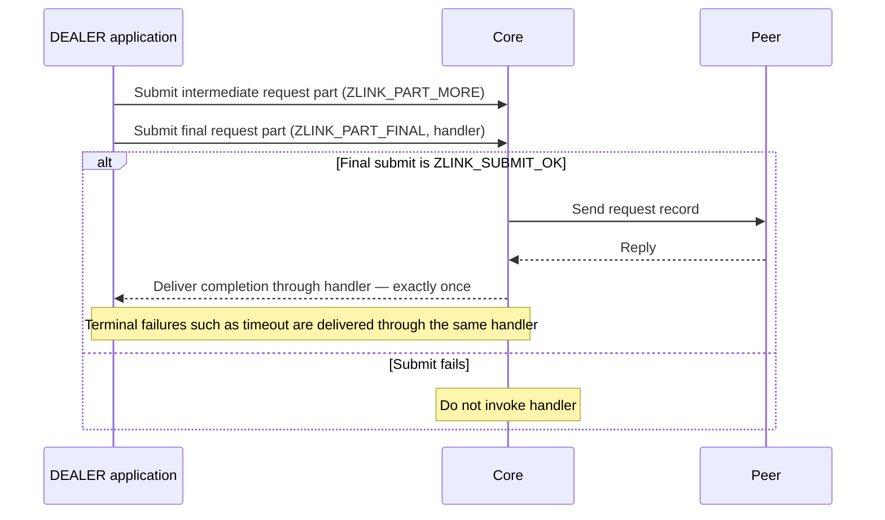

[한국어](https://zlink-systems.github.io/zlink/ko/spec/core/socket/06-dealer/) | English

<!-- zlink-nav:start -->
[Socket Index](README.en.md) | [Previous: XSUB](05-xsub.en.md) | [Next: ROUTER](07-router.en.md)
<!-- zlink-nav:end -->

# Socket — DEALER

> **What this chapter defines** — the public contract for DEALER socket request routing and
> [result/errno](../03-errors.en.md#result-and-errno-mapping).

## 1. DEALER overview

DEALER is an asynchronous raw [socket](../glossary.en.md#socket) that receives from multiple peers
in fair-queue order and sends to connected peers using round-robin or weight-based selection. It can
handle ordinary raw messages and received request records on the same socket.

This document defines the public contract for DEALER-specific options, outbound peer selection,
record classification, part sequences and ownership, request and reply submission and completion,
and receive flow state. Its audience is developers who map this contract to the C API and each
language binding, and application developers who use DEALER.

The following documents own the related contracts.

| Related contract | Defining document |
|---|---|
| Socket creation, common options (HWM, reconnect, timeout), and the declaration of `zlink_socket_set_receive_flow_state` | [Socket Common](README.en.md) |
| Request-reply kinds, sequences, and ZMP header byte layout and validation | [ZMP](../protocol/01-zmp.en.md) |
| Mapping between each result and `zlink_errno()` | [Errors](../03-errors.en.md#result-and-errno-mapping) |
| Auto HWM budget calculation and admission | [Auto HWM](../systems/06-auto-hwm.en.md) |
| Flow statistics in the status snapshot | [Monitoring](../06-monitoring.en.md) |
| Contract for the paired ROUTER socket | [ROUTER](07-router.en.md) |

## 2. Message record classification

DEALER sends and receives in parts. One group of parts from `ZLINK_PART_MORE` through
`ZLINK_PART_FINAL` is a complete record. There are two kinds of receive record: ordinary raw
messages and requests received by this DEALER. The exact numeric values are defined by
`zlink_dealer_message_type_t` in [§7 Public types](#7-public-types).

[`zlink_dealer_recv_part()`](#zlink_dealer_recv_part) returns the record kind and request sequence
with each payload part. Every part in one multipart record returns the same message type and request
sequence. Replies and terminal failures for work started through a request API are not returned as
receive records; they are delivered only through the `zlink_reply_handler_fn` completion. Ordinary
raw messages are sent with [`zlink_send_part()`](#zlink_send_part) and do not create a request
sequence.

Core preserves the request kind and wire sequence decoded from the ZMP header as internal values on
the first payload part. Only `zlink_dealer_recv_part()` interprets the request kind: it stores the
source pipe and wire sequence, then returns a nonzero reply token that is valid only on the same
socket. Equal wire sequences from different source pipes receive different tokens, and a reply is
sent back over the stored source pipe using the original wire sequence.

A reply or error reply received through the typed surface terminates the pair with `EPROTO` and
returns no payload. By contrast, the common raw receive function `zlink_recv_part()` returns
requests, replies, and error replies as ordinary payload without creating a reply target or token.
Both receive paths remove the internal kind and sequence before handing a part to the application,
so sending that part again through a raw send produces ordinary data.

One request proceeds to completion as follows.



## 3. Outbound peer selection

The following rules determine which peer receives a round-robin or weighted send. The weight is set
with `ZLINK_DEALER_OPT_WEIGHT` in [§8 DEALER options](#8-dealer-options).

A candidate is a connected outbound peer whose advertised weight is positive. A peer with weight
`0` is excluded from the candidate set. If every known peer has weight `0`, a submit may fail with
`ZLINK_SUBMIT_NOT_ADMITTED`.

Each candidate has an accumulator that starts at `0`. The following selection procedure runs once
for each message sent.

1. Add each candidate's weight to its accumulator.
2. Select the candidate with the largest accumulator. If several candidates have the same
   accumulator, select the one with the smallest identifier.
3. Subtract the sum of all candidate weights from the selected candidate's accumulator.

Equal weights are not a separate rule. Candidates with equal weights follow the same three steps and
are therefore selected in turn. The same procedure applies when there is only one candidate. Adding
and subtracting the same value leaves its accumulator unchanged.

This procedure spreads consecutive selections instead of grouping one candidate's share into a
single run. With weights `100` and `300`, the repeating order is `second, first, second, second`, not
three consecutive sends to the heavier peer followed by one send to the lighter peer. With enough
messages, the selection frequency matches the configured ratio.

The selection procedure applies only to a message that a peer actually accepts. If the selected
candidate cannot accept the write because it has no write capacity, it is excluded as a candidate
for that message, and the procedure applies to the peer that accepts the message instead. This
failure does not change the configured weight, and the peer returns to the candidate set when it
reports write capacity again. A message rejected for exceeding a size limit is not retried against
another candidate, because every candidate would reject it for the same reason.

The identifier in step 2 is the peer routing ID, compared as a byte string. An absent routing ID is
an empty byte string, so it sorts before every non-empty identifier. Peers with the same identifier,
including peers that all have no routing ID, are ordered by the endpoint through which the
connection was established; if the endpoint is also the same, they are ordered by local connection
attachment order. A reconnect creates a new connection whose accumulator starts at `0`. Its
identifier is unchanged, so its sorting position is the same as before.

Two processes configured with the same peers and weights produce the same selection order. An
application may depend on this order when candidate identifiers are distinct. When ordering falls
through to local connection attachment order, it is deterministic within one process but is not
reproducible across processes.

When the candidate set changes, the remaining candidates retain their accumulators, preserving the
configured ratio. A new connection starts at `0`, and a disconnected peer discards its accumulator
with the connection. A peer excluded only temporarily because of [backpressure](../glossary.en.md#backpressure)
or weight `0` retains its accumulator and continues from that value when it becomes a candidate
again.

## 4. Part sequences and ownership

`*_part` send calls form one multipart sequence from `ZLINK_PART_MORE` through `ZLINK_PART_FINAL`.
While a sequence is open, another send helper family cannot be interleaved on the same handle.

When a valid initialized `part_` is passed to a send API, the function consumes its message content
on both success and failure and leaves it as an initialized zero-length message. Regardless of the
call result, the caller therefore cannot read the pre-submit payload again or resend the same
content. Payload that may need to be resent must be retained in a separate message before the call.

Each send helper family stages successful intermediate parts as one record until
`ZLINK_PART_FINAL` succeeds. If an intermediate or final submit in an open sequence fails, Core
atomically discards the previously staged parts and the failed part, then closes the sequence. No
part of the record becomes visible to the peer. The failed call also consumes `part_`, and the next
submit starts the first part of a new record. A failed request submit creates no request sequence and
does not invoke the handler. If a reply sequence fails, its reply token remains valid until either a
successful `ZLINK_PART_FINAL` or the end of the request lifecycle, so the caller can resubmit a
retained complete reply from its first part.

If the first application part of a request or reply has a non-empty message group, Core cannot store
the internal request metadata in the same area. It rejects the entire submission with
`ZLINK_SUBMIT_INVALID_ARGUMENT` and `EINVAL`. The supplied C part follows the same consumption rule,
and no staged part, pending request, or reply target remains.

The `part_out_` passed to a receive API must be an initialized `zlink_msg_t` before the call. On
success, ownership of the received part moves to the caller, which releases it exactly once with
`zlink_msg_close()`. On failure, ownership of a received part does not move.

<a id="8-results-and-readiness"></a>

## 5. Results and readiness

Submit APIs return `zlink_submit_result_t`, receive APIs return `zlink_recv_result_t`, and option
APIs return `zlink_config_result_t`. The [errno map](../03-errors.en.md#result-and-errno-mapping)
defines the mapping between each result and `zlink_errno()`.

DEALER `ZLINK_POLLIN` means that a raw or request record can be received. For ordinary sends and
requests, `ZLINK_POLLOUT` indicates that retrying a submit after backpressure is worthwhile, but it
does not guarantee that the next submit will succeed. An application that needs a definitive answer
for each operation uses `zlink_send_async` and its completion notification. This readiness contract
does not apply to raw replies.

## 6. Receive flow state

A DEALER paired with a ROUTER over the
[completion progress lane](../glossary.en.md#completion-progress-lane), a separate path that handles
progress only for terminal replies and error replies, can ask peers that send to it to stop and
resume transmission. `zlink_socket_set_receive_flow_state()` stores one socket-wide state and sends
it through the completion lane of every ready pair of this socket. [Socket Common](README.en.md)
owns the function declaration, and [Errors](../03-errors.en.md) owns the result table.

This state is an absolute value, not a counter. Setting `ZLINK_RECEIVE_FLOW_PAUSED` twice represents
one pause; the second call succeeds without sending anything. There is no nesting count and no rule
requiring a matching number of resumes. The socket stores exactly one state, so it cannot pause one
peer while leaving another peer running.

Each state change carries a flow epoch that increases within one connection generation. The frame
also contains the pair ID and generation of the connection on which it was written. A receiving
socket applies a frame only when it identifies the current pair and generation and its epoch is
greater than the last epoch accepted for that generation. A frame with a different pair ID, a pair
ID or generation of `0`, a pair absent from the transport-pair table, or a pipe other than the
registered completion pipe is consumed without an event. Only a generation mismatch for the current
pair ID, or a duplicate or regressing epoch in the same generation, is not applied and reported as
`ZLINK_EVENT_FLOW_STATE_STALE`. A frame from a previous generation is therefore never applied to the
connection that replaced it.

When a pair becomes ready, Core sends the socket's current state through the new completion lane. A
peer that connects or reconnects while this socket is paused learns the pause without another call.
A socket that has never set a state sends nothing because a new pair already assumes RUNNING.

A remote PAUSE blocks transmission to that peer. It is an independent blocker that composes with
existing blockers. Byte [HWM](../glossary.en.md#hwm), which caps bytes retained in a queue,
transport wait, and termination each continue to block transmission; a send is accepted only when
none of them applies. Clearing remote pause therefore does not by itself make the next send succeed.
Send results and readiness are unchanged. A blocked non-blocking send still reports
`ZLINK_SUBMIT_BACKPRESSURED` with `errno == EAGAIN`, and `ZLINK_POLLOUT` retains the meaning defined
in [§5 Results and readiness](#5-results-and-readiness).

A remote PAUSE takes effect at the next message boundary and does not split a message. A message
whose first byte has already reached the pipe, and a message whose first part the socket has already
accepted, sends all remaining parts before the pause applies. The pause applies from the following
message.

The [Monitoring](../06-monitoring.en.md) status snapshot provides the number of peers this socket
currently sees as paused, the numbers of applied pause and resume transitions, the number of frames
rejected as stale, and the duration of the most recently completed pause.

## 7. Public types

The enum numbers in this section and [§8 DEALER options](#8-dealer-options) are public ABI values.

```c
typedef enum zlink_dealer_message_type_t {
  ZLINK_DEALER_MESSAGE_RAW         = 0,  // Ordinary raw multipart message. Request sequence is 0
  ZLINK_DEALER_MESSAGE_REQUEST     = 1   // Request received by this DEALER. Nonzero request sequence is a reply token for zlink_dealer_reply_part()
} zlink_dealer_message_type_t;

typedef enum zlink_part_flag_t {
  ZLINK_PART_FINAL = 0,  // Current part is the last part of the record
  ZLINK_PART_MORE  = 1   // Another part follows in the same multipart record
} zlink_part_flag_t;

typedef void (*zlink_reply_handler_fn)(
  zlink_request_result_t result_,
  zlink_msg_t *parts_,
  size_t part_count_,
  void *userdata_);
```

The receive API's `has_more_out_` uses the same two `zlink_part_flag_t` values.

<a id="2-dealer-options"></a>

## 8. DEALER options

```c
ZLINK_EXPORT zlink_config_result_t zlink_set_dealer_option(
  void *handle_,
  zlink_dealer_option_t option_,
  const void *optval_,
  size_t optvallen_);

ZLINK_EXPORT zlink_config_result_t zlink_get_dealer_option(
  void *handle_,
  zlink_dealer_option_t option_,
  void *optval_,
  size_t *optvallen_);

typedef enum zlink_dealer_option_t {
  ZLINK_DEALER_OPT_PROBE              = 0x3201,  // int, 0=off, positive=on, getter returns 0/1 (default 0). Sends an empty raw message when a connection is established so the peer can observe the connection and routing ID
  ZLINK_DEALER_OPT_REQUEST_TIMEOUT_MS = 0x3202,  // Nonnegative int, milliseconds (default 5000). Default timeout used by the request API when timeout_ms_ == 0
  ZLINK_DEALER_OPT_WEIGHT             = 0x3203   // int, 0..10000 (default 100). This DEALER's weight advertised to connected peers
} zlink_dealer_option_t;
```

When calling `zlink_get_dealer_option()`, `*optvallen_` is the input capacity of `optval_`. On
success, it is updated to the number of bytes actually written. HWM, reconnect, and timeout options
that are not DEALER-specific use `zlink_set_option()` and `zlink_get_option()`.

A weight outside `0..10000` is rejected and is not clamped. Values in `0..100` retain the meaning
they had before the range was widened.

## 9. Functions

### zlink_send_part

Use this API to send an ordinary raw message. It does not create a request sequence.

```c
ZLINK_EXPORT zlink_submit_result_t zlink_send_part(
  void *s_,
  zlink_msg_t *part_,
  zlink_send_flags_t flags_,
  zlink_part_flag_t part_flag_);
```

Part consumption and record discard on failure follow
[§4 Part sequences and ownership](#4-part-sequences-and-ownership).

---

### zlink_dealer_send_transport_pair_part

Submits a raw part only to the specified exact target.

```c
ZLINK_EXPORT zlink_submit_result_t zlink_dealer_send_transport_pair_part(
  void *dealer_,
  const zlink_routed_submit_target_t *target_,
  zlink_msg_t *part_,
  zlink_send_flags_t flags_,
  zlink_part_flag_t part_flag_);
```

`target_` is a value obtained from `zlink_select_routed_submit_target()` on the same DEALER. Core
validates once that the RID, transport pair ID, and generation identify the same currently connected
application pipe and submits only to that pipe. HWM returns `ZLINK_SUBMIT_BACKPRESSURED`; detach or a
stale generation returns `ZLINK_SUBMIT_NOT_CONNECTED`. Neither case reselects another pipe. Once the
first part succeeds, the exact pipe fence remains through FINAL. An intermediate or final part
failure rolls back the entire previously staged record and closes the sequence, so no partial record
is visible to the peer.

Each part call has its own public API scope. A binding therefore holds its socket-local attempt gate
only during one non-blocking multipart attempt to prevent another binding submit from interleaving.
It releases the gate before waiting for readiness after `BACKPRESSURED`. This creates neither a new
Core multipart API nor a public FIFO contract.

---

### zlink_dealer_request_part

Submits one asynchronous request payload one part at a time.

```c
ZLINK_EXPORT zlink_submit_result_t zlink_dealer_request_part(
  void *dealer_,
  zlink_msg_t *part_,
  zlink_send_flags_t flags_,
  zlink_part_flag_t part_flag_,
  uint32_t timeout_ms_,
  zlink_reply_handler_fn handler_,
  void *userdata_);
```

For an intermediate part, call with `part_flag_` set to `ZLINK_PART_MORE`, `timeout_ms_ == 0`,
`handler_ == NULL`, and `userdata_ == NULL`. The final part uses `ZLINK_PART_FINAL` and a non-null
`handler_`. On the final call, `timeout_ms_ == 0` uses the `ZLINK_DEALER_OPT_REQUEST_TIMEOUT_MS`
default. `flags_` is `ZLINK_SEND_FLAGS_NONE` or `ZLINK_SEND_FLAGS_DONTWAIT`.

If the final submit returns `ZLINK_SUBMIT_OK`, exactly one completion is delivered to `handler_`. A
failed submit does not invoke the handler. Ownership of callback `parts_` and every message moves to
the callback, which releases them exactly once. For a valid error reply, the callback receives the
parts after the first 4-byte Big Endian errno part and a non-OK `zlink_request_result_t` mapped from
that errno. If the first error-reply part is absent, is not 4 bytes, or contains `0`, the callback
receives `ZLINK_REQUEST_PROTOCOL_ERROR` and a part count of `0`. On timeout and other terminal
results, `zlink_request_result_t` identifies the result.

---

### zlink_dealer_request_transport_pair_part

Submits a request only to the specified exact target.

```c
ZLINK_EXPORT zlink_submit_result_t zlink_dealer_request_transport_pair_part(
  void *dealer_,
  const zlink_routed_submit_target_t *target_,
  zlink_msg_t *part_,
  zlink_send_flags_t flags_,
  zlink_part_flag_t part_flag_,
  uint32_t timeout_ms_,
  zlink_reply_handler_fn handler_,
  void *userdata_);
```

Target validation, the multipart fence, and failure rollback match the
[exact raw submit](#zlink_dealer_send_transport_pair_part). Core registers pending correlation and
the timeout lifecycle before the request kind and sequence in the first payload's ZMP header can
become visible on the wire. If the final submit fails, Core removes the pending entry and completion
reservation and does not invoke the handler. After a successful submit, a fast reply cannot arrive
before correlation registration. A binding makes one attempt from the first request part through
FINAL under the same short socket-local attempt gate as raw send and releases the gate before
waiting.

---

### zlink_dealer_recv_part

Returns one part from a complete record.

```c
ZLINK_EXPORT zlink_recv_result_t zlink_dealer_recv_part(
  void *dealer_,
  uint8_t *message_type_out_,
  uint64_t *request_seq_out_,
  zlink_msg_t *part_out_,
  zlink_part_flag_t *has_more_out_,
  zlink_recv_flags_t flags_);
```

Every output pointer is required. The C type of `message_type_out_` is `uint8_t`; its value is one
of the numbers defined by `zlink_dealer_message_type_t`. `flags_` is `ZLINK_RECV_FLAGS_NONE` or
`ZLINK_RECV_FLAGS_DONTWAIT`. A non-blocking call with no record available returns
`ZLINK_RECV_NO_DATA` with `EAGAIN`.

When `has_more_out_ == ZLINK_PART_MORE`, the next call receives the next part of the same record.
`ZLINK_PART_FINAL` completes the record's receive sequence.

---

### zlink_dealer_reply_part

Sends a reply part for a `ZLINK_DEALER_MESSAGE_REQUEST` record.

```c
ZLINK_EXPORT zlink_submit_result_t zlink_dealer_reply_part(
  void *dealer_,
  uint64_t request_seq_,
  zlink_msg_t *part_,
  zlink_part_flag_t part_flag_);
```

`request_seq_` must be the nonzero reply token returned for that request by
`zlink_dealer_recv_part()` on the same socket. A multipart reply uses the same token for every call.
A successful `ZLINK_PART_FINAL` completes the reply for that token, which cannot then be reused.

The reply token is not the wire sequence. Core resolves the token to the stored source pipe and wire
sequence, then writes the reply kind and original sequence into the first reply payload's ZMP
header. The application cannot choose an arbitrary wire sequence or peer route.

Raw replies and error replies are submitted exactly once through the completion progress lane. This
lane is not subject to application byte HWM, manual HWM, LWM, or Core budget reservation, so this
function does not return `ZLINK_SUBMIT_BACKPRESSURED` because of that capacity and enters no
readiness-wait or retry path. Connection, lifecycle, argument, state,
and allocation failures terminate immediately with the corresponding `zlink_submit_result_t` at
the call.

The completion progress lane processes valid receive-flow control before application kinds. A
reply or error reply completes the one pending request identified by its sequence. If data or a
request arrives on this lane, Core does not invoke a callback with that frame; it terminates the
pair with `EPROTO`, and each existing pending request completes once with the disconnect result.

## 10. Implementation and contract-test verification requirements

Verify the following using only the public surface: DEALER option set/get, `zlink_send_part`, the
`zlink_dealer_*` functions, return values and errno, `zlink_reply_handler_fn` callback invocation,
and the [Monitoring](../06-monitoring.en.md) status snapshot. Each item maps to one test.

**Options**

- A `ZLINK_DEALER_OPT_WEIGHT` value outside `0..10000` is rejected and is not clamped.
- When `zlink_get_dealer_option()` succeeds, `*optvallen_` is updated to the number of bytes actually written.
- When `ZLINK_DEALER_OPT_PROBE` is set to a positive value, the peer can observe the connection and routing ID through an empty raw message when the connection is established, and the getter returns `0` or `1`.
- When the final request part is submitted with `timeout_ms_ == 0`, the `ZLINK_DEALER_OPT_REQUEST_TIMEOUT_MS` value (default `5000`) is used as the timeout.

**Outbound peer selection**

- Repeated sends to two peers with weights `100` and `300` repeat the selection order `second, first, second, second`.
- Candidates with equal weights are selected in turn, and with enough messages their selection frequencies match the configured ratio.
- If every known peer has weight `0`, a submit may fail with `ZLINK_SUBMIT_NOT_ADMITTED`.
- Two processes configured with the same peers and weights produce the same selection order when their candidate identifiers are distinct.
- A reconnected peer starts again with accumulator `0` and retains its previous sorting position.
- A peer that cannot accept a message because it has no write capacity is excluded only for that message and continues from its retained accumulator when it reports capacity again.

**Part sequences and ownership**

- A send API consumes `part_` on both success and failure and leaves it as an initialized zero-length message—the caller cannot read the pre-submit payload again or resend it through the same `part_` after the call.
- If an intermediate or final submit in an open sequence fails, no part of that record is visible to the peer and the next submit starts the first part of a new record.
- A failed request submit creates no request sequence and does not invoke the handler.
- If a reply sequence fails, its reply token remains valid until either a successful `ZLINK_PART_FINAL` or the end of the request lifecycle, and the retained complete reply can be resubmitted from its first part.
- On receive success, ownership of the part moves to the caller, which releases it exactly once with `zlink_msg_close()`. On failure, ownership does not move.
- A non-empty group on the first request or reply part yields `ZLINK_SUBMIT_INVALID_ARGUMENT` and `EINVAL`; the input part is consumed and the peer receives no part of that record. A failed request does not invoke its handler, and the token from a failed reply can be submitted again with group-free payload.

**Exact-target submit**

- `zlink_dealer_send_transport_pair_part()` returns `ZLINK_SUBMIT_BACKPRESSURED` when the target pipe is at HWM, or `ZLINK_SUBMIT_NOT_CONNECTED` after detach or for a stale generation, and does not reselect another pipe.
- Once the first part succeeds, submission remains on the same exact pipe through FINAL.

**Requests and completion**

- If the final request submit returns `ZLINK_SUBMIT_OK`, exactly one completion is delivered to `handler_`; if the submit fails, the handler is not invoked.
- Ownership of callback `parts_` and every message moves to the callback, which releases them exactly once.
- Even when a peer replies immediately after a successful exact-target request submit, the reply is delivered exactly once as a handler completion.

**Receive**

- A non-blocking `zlink_dealer_recv_part()` call with no record available returns `ZLINK_RECV_NO_DATA` with `EAGAIN`.
- Every part in one multipart record returns the same message type and request sequence.
- If `has_more_out_ == ZLINK_PART_MORE`, the next call returns the next part of the same record; `ZLINK_PART_FINAL` completes the record's receive sequence.
- A request received through `zlink_dealer_recv_part()` returns a nonzero local reply token; equal wire sequences received from different peer connections return different tokens.
- A reply or error reply received through `zlink_dealer_recv_part()` returns no payload and terminates the pair with `EPROTO`.
- Receiving a request, reply, or error reply through `zlink_recv_part()` exposes ordinary payload without creating a token. Raw-sending that payload does not restore request-reply semantics, and a later typed request can still be received and replied to after this is repeated.

**Replies and completion lane**

- `zlink_dealer_reply_part()` does not return `ZLINK_SUBMIT_BACKPRESSURED` because of completion lane capacity.
- A token whose `ZLINK_PART_FINAL` succeeded cannot be reused.
- Connection, lifecycle, argument, state, and allocation failures terminate immediately with the corresponding `zlink_submit_result_t` at the call.
- Replying with a DEALER local token makes a reply with the original wire sequence observable on the peer connection that produced the token and completes only the corresponding request.
- A reply or error reply on the completion progress lane invokes the matching public request completion once; data or a request terminates the pair with `EPROTO` without being delivered as callback payload.
- A valid error reply delivers a non-OK `zlink_request_result_t` mapped from its errno and the payload after the errno part to the Core C callback. An absent errno part, a part whose size is not 4 bytes, or a zero value completes with `ZLINK_REQUEST_PROTOCOL_ERROR` and a part count of `0`.

**Results and readiness**

- `ZLINK_POLLIN` means that a raw or request record can be received.
- Observing `ZLINK_POLLOUT` after backpressure does not guarantee that the next submit will succeed, and this readiness contract does not apply to raw replies.

**Receive flow state**

- Setting `ZLINK_RECEIVE_FLOW_PAUSED` twice represents one pause; the second call succeeds without sending anything.
- A frame with a different pair ID, a pair ID or generation of `0`, an unregistered transport pair, or a pipe other than the registered completion pipe is consumed without an event. `ZLINK_EVENT_FLOW_STATE_STALE` occurs only for a generation mismatch on the current pair ID or a duplicate or regressing epoch in the same generation.
- A peer that connects or reconnects while this socket is paused learns the pause without another call, and a socket that has never set a state sends nothing.
- Clearing remote pause does not by itself make the next send succeed. A blocked non-blocking send continues to report `ZLINK_SUBMIT_BACKPRESSURED` with `errno == EAGAIN`.
- Remote PAUSE takes effect at the next message boundary—a message whose first byte has already reached the pipe or whose first part has already been accepted sends all remaining parts.
- The [Monitoring](../06-monitoring.en.md) status snapshot exposes the number of peers currently seen as paused, the numbers of applied pause and resume transitions, the number of frames rejected as stale, and the duration of the most recently completed pause.

<!-- zlink-nav:start -->
[Socket Index](README.en.md) | [Previous: XSUB](05-xsub.en.md) | [Next: ROUTER](07-router.en.md)
<!-- zlink-nav:end -->
