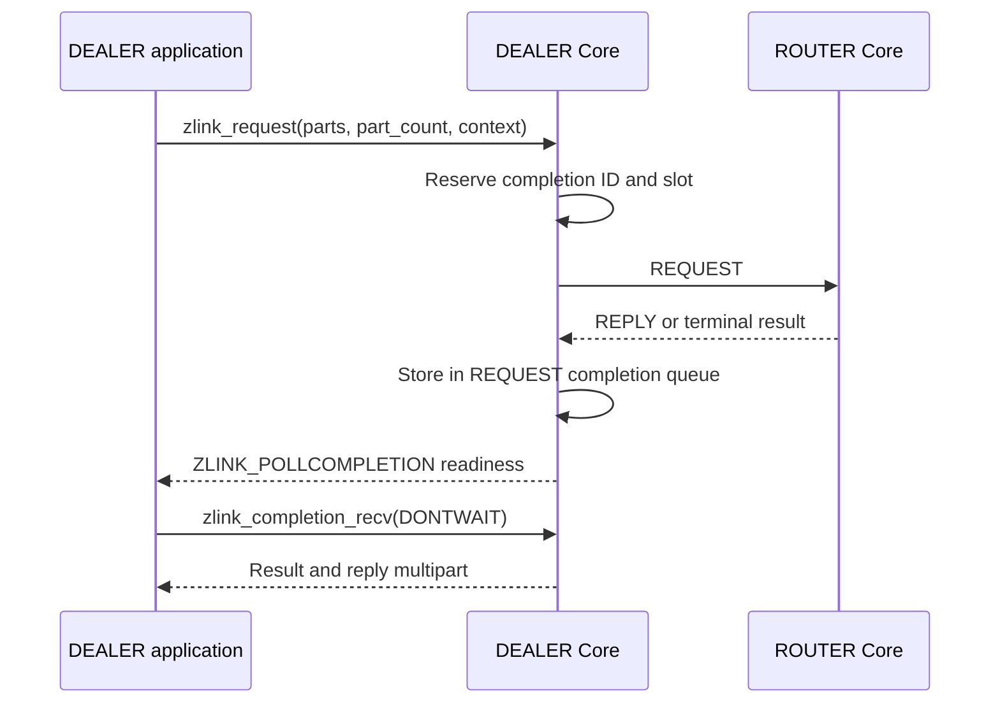

[한국어](06-dealer.ko.md) | English

<!-- zlink-nav:start -->
[Socket Index](README.en.md) | [Previous: XSUB](05-xsub.en.md) | [Next: ROUTER](07-router.en.md)
<!-- zlink-nav:end -->

# Socket — DEALER

> **What this chapter defines** — the public contract for DEALER socket request routing and
> [result/errno](../03-errors.en.md#result-and-errno-mapping).

## 1. DEALER overview

DEALER is an asynchronous raw [socket](../glossary.en.md#socket) that receives from multiple peers
in fair-queue order and sends to connected peers using round-robin or weight-based selection. The
application pull-receives ordinary DATA and can submit requests to a ROUTER logical route selected
by Core.

This document defines the public contract for DEALER-specific options, outbound peer selection,
whole-message ownership, request submission and pull completion, and receive flow state. Its
audience is developers who map this contract to the C API and each
language binding, and application developers who use DEALER.

The following documents own the related contracts.

| Related contract | Defining document |
|---|---|
| Socket creation, common options (HWM, reconnect, timeout), and the declaration of `zlink_socket_set_receive_flow_state` | [Socket Common](README.en.md) |
| Request-reply kinds, sequences, and ZMP header byte layout and validation | [ZMP](../protocol/01-zmp.en.md) |
| Mapping between each result and `zlink_errno()` | [Errors](../03-errors.en.md#result-and-errno-mapping) |
| Auto HWM budget calculation and admission | [Auto HWM](../systems/06-auto-hwm.en.md) |
| Flow statistics in the status snapshot | [Monitoring](../06-monitoring.en.md) |
| Contract for the paired ROUTER socket | [ROUTER](07-router.en.md) |

## 2. DATA receive and request completion

DEALER receives one complete ordinary DATA record through
[`zlink_recv`](README.en.md#zlink_recv-and-zlink_router_recv), which fills a caller-provided
`zlink_msg_t` array and returns `NULL` as the DEALER source RID;
ownership, close, and capacity rules are owned by
[Socket Common](README.en.md#zlink_recv-and-zlink_router_recv). DEALER is not
a responder socket that receives or replies to inbound typed REQUEST records. Replies, timeouts, and
terminal results for a REQUEST submitted by DEALER do not appear on ordinary receive (`zlink_recv`);
they are returned as REQUEST records from
`zlink_completion_recv()`.

On a DEALER-ROUTER single connection, DATA, REPLY, and error reply sent by the ROUTER use the same
inbound physical FIFO. When the physical head is DATA, public DATA receive consumes the record; when
it is REPLY or error reply, the socket-local completion queue consumes the record. REPLY does not
appear in `zlink_recv()`, and DATA does not appear in `zlink_completion_recv()`.

On a DEALER-ROUTER single connection, DATA sent first by the ROUTER and a later REPLY or error reply
use the same FIFO. If DEALER does not dequeue the preceding DATA or keeps local PAUSED in effect, the
REPLY cannot overtake it and the request timeout can create the terminal completion first.



## 3. Outbound peer selection

The following rules determine which peer receives a round-robin or weighted send. The weight is the
absolute value that each peer advertises through its own `ZLINK_DEALER_OPT_WEIGHT` or
`ZLINK_ROUTER_OPT_WEIGHT`. [§7](#7-dealer-options) defines the DEALER option.

A candidate is a connected outbound peer whose advertised weight is positive. A peer with weight
`0` is excluded from the candidate set. When every known peer has weight `0`, flag-specific submit
results follow [whole-message send](README.en.md#whole-message-send-and-pending-admission) and
[Request and reply](README.en.md#request-and-reply).

Each candidate has an accumulator that starts at `0`. The following selection procedure runs once
for each message sent.

1. Add each candidate's weight to its accumulator.
2. Select the candidate with the largest accumulator. If several candidates have the same
   accumulator, select the one with the smallest identifier.
3. Subtract the sum of all candidate weights from the selected candidate's accumulator.

Equal weights are not a separate rule. Candidates with equal weights follow the same three steps and
are therefore selected in turn. The same procedure applies when there is only one candidate. Adding
and subtracting the same value leaves its accumulator unchanged.

This procedure spreads consecutive selections instead of grouping one candidate's share into a
single run. With weights `100` and `300`, the repeating order is `second, first, second, second`, not
three consecutive sends to the heavier peer followed by one send to the lighter peer. With enough
messages, the selection frequency matches the configured ratio.

For an ordinary `zlink_send()`, the selection procedure applies only to the message that a peer accepts. If the selected
candidate has no write capacity, it is excluded for that attempt and the procedure applies to the
peer that accepts the message instead. This fallback does not change the configured weight, and the
peer returns to the candidate set when it reports write capacity again. A message rejected for
exceeding a size limit is not retried against another candidate, because every candidate would
reject it for the same reason.

When a `NONE` call waits for admission, it fixes one configured endpoint. Ordinary DATA selects
from compatible positive-weight logical routes; typed requests select from positive-weight logical
routes confirmed as ROUTER during handshake. The operation does not change to another endpoint
while waiting for HWM or a temporary disconnect.

A `DONTWAIT` ordinary send or request pins no endpoint. The wait token targets the whole candidate peer set. Restored write credit and a newly connected peer are wake edges that re-evaluate that set. Flag-specific submit results and resubmission follow [Socket Common whole-message send](README.en.md#whole-message-send-and-pending-admission) and [request](README.en.md#request-and-reply).

The identifier in step 2 is the peer routing ID, compared as a byte string. An absent routing ID is
an empty byte string, so it sorts before every non-empty identifier. Peers with the same identifier,
including peers that all have no routing ID, are ordered by the endpoint through which the
connection was established; if the endpoint is also the same, they are ordered by local connection
attachment order. A reconnect creates a new connection whose accumulator starts at `0`. Its
identifier is unchanged, so its sorting position is the same as before.

Two processes configured with the same peers and weights produce the same selection order. An
application may depend on this order when candidate identifiers are distinct. When ordering falls
through to local connection attachment order, it is deterministic within one process but is not
reproducible across processes.

When the candidate set changes, the remaining candidates retain their accumulators, preserving the
configured ratio. A new connection starts at `0`, and a disconnected peer discards its accumulator
with the connection. A peer excluded only temporarily because of [backpressure](../glossary.en.md#backpressure)
or weight `0` retains its accumulator and continues from that value when it becomes a candidate
again.

Peer selection is applied once per Application record. If the selected pipe's remote weight changes
to `0` after the record is admitted, that record is still delivered through the same pipe. Weight
`0` excludes the pipe only when the next record is selected.

## 4. Whole-message ownership and record atomicity

A send API submits its `parts_` array and `part_count_` atomically as one record. Multiple threads
may submit independent records to the same socket; there is no per-thread sequence state.

The function consumes every input slot on both success and failure and leaves it as an initialized
zero-length message. If the call fails, the peer sees none of the record's parts. Retain the complete
record before the call if it may need to be sent again. A failed request submit returns completion ID
`0` and creates neither a completion nor a context echo.

Receive output slots need not be initialized before the call. On success, ownership of the leading
`*part_count_out_` slots moves to the caller, which releases them exactly once with
`zlink_multipart_close()`. On failure, slot ownership does not move.

<a id="8-results-and-readiness"></a>

## 5. Results and readiness

Submit APIs return `zlink_submit_result_t`, receive APIs return `zlink_recv_result_t`, and option
APIs return `zlink_config_result_t`. The [errno map](../03-errors.en.md#result-and-errno-mapping)
defines the mapping between each result and `zlink_errno()`.

DEALER `ZLINK_POLLIN` means that a DATA record can be received. For ordinary sends and
requests, `ZLINK_POLLOUT` indicates that retrying a submit after backpressure is worthwhile, but it
does not guarantee that the next submit will succeed. While an unread `ZLINK_COMPLETION_WRITABLE`
record exists, `ZLINK_POLLOUT` and `ZLINK_POLLCOMPLETION` are level-held, and the precise per-target
signal is that record's token and context. Results for operations retained by Core are received
through `ZLINK_POLLCOMPLETION` and `zlink_completion_recv()`. Request replies do not appear under
`ZLINK_POLLIN`.

## 6. Receive flow state

A DEALER connected to a DEALER or ROUTER peer can ask peers that send to it to stop and resume
transmission. `zlink_socket_set_receive_flow_state()` stores one socket-wide state. Because a DEALER's
transport pair has count `1`, Core sends that state, for every ready peer, over the control path of
that peer's Application connection. [Socket Common](README.en.md)
owns the function declaration, and [Errors](../03-errors.en.md) owns the result table.

This state is an absolute value, not a counter. Setting `ZLINK_RECEIVE_FLOW_PAUSED` twice represents
one pause; the second call succeeds without sending anything. There is no nesting count and no rule
requiring a matching number of resumes. The socket stores exactly one state, so it cannot pause one
peer while leaving another peer running.

A flow-state frame carries a flow epoch scoped to the connection on which the frame was written.
There is no public pair-ID or generation field and no `Zlink-Pair-Id` or
`Zlink-Pair-Generation` wire property. Using internal connection identity, Core applies the frame
only to the connection on which it was written. A frame whose identity does not match, including a
frame from a replaced connection, is consumed internally without a public event and increments only
the `flow_state_stale_total` counter. A duplicate or regressing epoch on the same connection is not
applied and is reported as `ZLINK_EVENT_FLOW_STATE_STALE` with
`ZLINK_MONITOR_EVENT_FLAG_FLOW_STATE_STALE_EPOCH`. A frame from a previous connection is therefore
never applied to the connection that replaced it.

When a connection becomes ready, Core sends the socket's current state over the new Application connection. A
peer that connects or reconnects while this socket is paused learns the pause without another call.
A socket that has never set a state sends nothing because a new connection already assumes RUNNING.

A remote PAUSE blocks transmission to that peer. It is an independent blocker that composes with
existing blockers. Byte [HWM](../glossary.en.md#hwm), which caps bytes retained in a queue,
transport wait, and termination each continue to block transmission; a send is accepted only when
none of them applies. Clearing remote pause therefore does not by itself make the next send succeed.
Send results and readiness are unchanged. A blocked non-blocking send still reports
`ZLINK_SUBMIT_BACKPRESSURED` with `errno == EAGAIN`, and `ZLINK_POLLOUT` retains the meaning defined
in [§5 Results and readiness](#5-results-and-readiness). A remote RESUME is one of the wake edges
that publishes a `ZLINK_COMPLETION_WRITABLE` record for the wait token that send received.

A remote PAUSE takes effect at the next message boundary and does not split a message. A record that
has already been admitted is delivered completely, and the pause applies to the following record.

The [Monitoring](../06-monitoring.en.md) status snapshot provides the number of peers this socket
currently sees as paused, the numbers of applied pause and resume transitions, the number of frames
rejected as stale, and the duration of the most recently completed pause.

<a id="2-dealer-options"></a>

## 7. DEALER options

```c
ZLINK_EXPORT zlink_config_result_t zlink_set_dealer_option(
  void *handle_,
  zlink_dealer_option_t option_,
  const void *optval_,
  size_t optvallen_);

ZLINK_EXPORT zlink_config_result_t zlink_get_dealer_option(
  void *handle_,
  zlink_dealer_option_t option_,
  void *optval_,
  size_t *optvallen_);

typedef enum zlink_dealer_option_t {
  ZLINK_DEALER_OPT_PROBE              = 0x3201,  // int, 0=off, positive=on, getter returns 0/1 (default 0). Sends an empty raw message when a connection is established so the peer can observe the connection and routing ID
  ZLINK_DEALER_OPT_REQUEST_TIMEOUT_MS = 0x3202,  // Nonnegative int, milliseconds (default 5000). Default timeout used by the request API when timeout_ms_ == 0
  ZLINK_DEALER_OPT_WEIGHT             = 0x3203   // int, 0..10000 (default 100). This DEALER's weight advertised to connected peers
} zlink_dealer_option_t;
```

When calling `zlink_get_dealer_option()`, `*optvallen_` is the input capacity of `optval_`. On
success, it is updated to the number of bytes actually written. HWM, reconnect, and timeout options
that are not DEALER-specific use `zlink_set_option()` and `zlink_get_option()`.

The weight is an absolute value in `0..10000`. A value outside that range is rejected, not adjusted
into the range.

The common [`ZLINK_OPT_CONFLATE` contract](README.en.md#conflation) does not allow DEALER to enable
frame-level conflation. Setting `1` returns `ZLINK_CONFIG_NOT_SUPPORTED` with `ENOTSUP`; setting `0`
succeeds as a no-op, and the getter returns `0`.

`ZLINK_DEALER_OPT_WEIGHT` is the absolute value that a peer uses when selecting this DEALER as an
outbound candidate. DEALER and ROUTER advertise their own values independently, so each direction
uses the value advertised by the other socket.

The public weight result follows this order.

1. A value set before bind or connect applies after the single Application pipe becomes ready.
2. A dynamic change applies the new absolute value, including `0`, to the peer scheduler.
3. An actual change emits `PEER_WEIGHT_CHANGED` with the value and the Application pipe's lane and
   connection ID. Repeating the same value emits no additional event.
4. Reconnect applies the current configured value to the new connection.

The network wire, inproc delivery, CONTROL size boundary, multipart deferral, and the lifetime and
stale-delivery ownership of that selected pipe are defined by the
[ZMP request-reply lane](../protocol/01-zmp.en.md#41-request-reply-lane),
[decode](../protocol/01-zmp.en.md#7-decode-validation), and
[peer-weight owner](../protocol/01-zmp.en.md#peer-weight-control) contracts. Neither transport path
creates a weight record on public receive or the socket-local completion queue.

If the applied value becomes `0` after a record has selected a pipe, that record is delivered on the
same pipe. The next record selection excludes it.

An actual remote-weight change re-evaluates a DONTWAIT send or request that holds a wait token. A
wait token does not end when the weight becomes `0`. A change from `0` to a positive value publishes
a `ZLINK_COMPLETION_WRITABLE` record for the SEND or REQUEST wait token.

An active duplicate keeps its own latest value while standby and uses it if that same pipe is
selected later. Setting the Application maximum below 10 bytes does not prevent pair readiness,
FLOWSTATE, or WEIGHT delivery; malformed CONTROL behavior remains owned by ZMP.

## 8. Functions

### zlink_send

Sends ordinary DATA.

```c
ZLINK_EXPORT zlink_submit_result_t zlink_send (
  void *s_, zlink_msg_t *parts_, size_t part_count_,
  zlink_send_flags_t flags_, void *user_context_,
  zlink_completion_id_t *completion_id_out_);
```

Input-array consumption, flag-specific submit results, wait tokens, and resubmission follow [Socket Common whole-message send](README.en.md#whole-message-send-and-pending-admission). The DEALER token target and wake edges follow the [§3 selection rule](#3-outbound-peer-selection) above.

---

### zlink_request

Submits a complete request record to a ROUTER logical route selected by Core.

```c
ZLINK_EXPORT zlink_submit_result_t zlink_request (
  void *s_, const zlink_routing_id_t *target_router_rid_or_null_,
  zlink_msg_t *parts_, size_t part_count_, zlink_send_flags_t flags_,
  uint32_t timeout_ms_, void *user_context_,
  zlink_completion_id_t *completion_id_out_);
```

DEALER requires `target_router_rid_or_null_ == NULL`. REQUEST input, ID, context, completion, and timeout results follow [Socket Common Request and reply](README.en.md#request-and-reply).

Candidates are positive-weight logical routes confirmed as ROUTER during handshake. A DEALER peer
remains a DATA candidate but is excluded from request candidates. Flag-specific results when there is no candidate follow
[Socket Common request](README.en.md#request-and-reply). `NONE` waits within `SNDTIMEO` for an
unknown endpoint to complete handshake and an eligible ROUTER to appear, then applies the linked
flag-specific submit result. Only a `NONE` call that selects a detached known positive-weight ROUTER waits on that
configured endpoint, and the selected endpoint does not change before the operation
terminates.

`DONTWAIT` makes one admission attempt and pins no endpoint. The wait token targets the whole request candidate set. A newly connected ROUTER candidate, restored write credit, or a weight changing from `0` to positive re-evaluates that set. Flag-specific submit results and resubmission follow [Socket Common request](README.en.md#request-and-reply).

The reply timeout start and wait-token period follow
[Socket Common request](README.en.md#request-and-reply). When the submit-time transport
pair terminates after admission, the request ends at once with `ZLINK_REQUEST_NOT_CONNECTED`,
whatever the cause, per the [Socket Common §6 completion table](README.en.md#request-and-reply), and
the payload is not replayed. [Socket Common](README.en.md#completion-pull-and-ownership) owns completion ownership and
close.

---

### zlink_recv

Returns one complete DATA record.

```c
ZLINK_EXPORT zlink_recv_result_t zlink_recv (
  void *s_,
  const zlink_routing_id_t **source_rid_out_,
  zlink_msg_t *parts_out_,
  size_t parts_capacity_,
  size_t *part_count_out_,
  zlink_recv_flags_t flags_);
```

`parts_out_` and `part_count_out_` are required; `source_rid_out_` is optional. On a successful receive,
the source is `NULL`. If `parts_capacity_` is smaller than the record's part count, the record is not
consumed, the needed count is written to `*part_count_out_`, and the call returns
`ZLINK_RECV_BUFFER_TOO_SMALL` with `ENOBUFS`. Retrying with a large enough array receives the same
record. The `NONE` `RCVTIMEO`, `DONTWAIT`, output ownership and invariance, and flag-error rules follow
[Socket Common](README.en.md#zlink_recv-and-zlink_router_recv). Request
replies do not appear through this function.

## 9. Implementation and contract-test verification requirements

Verify the following using only the public surface: DEALER option set/get, `zlink_send`,
`zlink_request`, `zlink_recv`, `zlink_completion_recv`, return values and errno, and the
[Monitoring](../06-monitoring.en.md) status snapshot. Each item maps to one test.

**Options**

- A `ZLINK_DEALER_OPT_WEIGHT` value outside `0..10000` is rejected and is not clamped.
- When `zlink_get_dealer_option()` succeeds, `*optvallen_` is updated to the number of bytes actually written.
- When `ZLINK_DEALER_OPT_PROBE` is set to a positive value, the peer can observe the connection and routing ID through an empty raw message when the connection is established, and the getter returns `0` or `1`.
- When a request record is submitted with `timeout_ms_ == 0`, the `ZLINK_DEALER_OPT_REQUEST_TIMEOUT_MS` value (default `5000`) is used as the timeout.
- On DEALER, setting `ZLINK_OPT_CONFLATE` to `1` returns `ZLINK_CONFIG_NOT_SUPPORTED` with
  `ENOTSUP`; setting `0` succeeds, and the getter returns `0`.

**Peer-weight delivery**

- If different weights are configured on a DEALER and its peer ROUTER before bind or connect, each
  scheduler uses the peer's exact value after the pair becomes ready, and a peer with value `0` is
  excluded from outbound candidates.
- Dynamically changing both weights after a network or inproc pair is ready produces
  `PEER_WEIGHT_CHANGED` with the new weight in `value`; the event transport lane and
  `connection_id` match the Application pipe to which the value was applied.
- Setting or synchronizing weight adds no record to public receive or the socket-local completion
  queue, and setting the same value again produces no duplicate monitor event.
- Changing weight more than once while an Application record is being admitted preserves the
  peer-visible multipart as one atomic record, and only the latest value affects the next record selection.
- If a pipe's remote weight becomes `0` after an Application record is admitted, the same pipe
  carries the complete record and is excluded starting with the next record selection.
- A remote-weight change re-evaluates a DONTWAIT SEND or REQUEST that holds a wait token. The wait
  token does not end when the weight becomes `0`; a change from `0` to a positive value publishes a
  WRITABLE record for the SEND or REQUEST wait token.
- Setting an Application maximum below 10 bytes does not prevent pair readiness, FLOWSTATE, or
  weight changes observed through peer selection and monitoring.
- After reconnect, peer selection and monitoring reflect the current weight on the new connection.
  Promoting an active standby uses the value that standby most recently received.

**Outbound peer selection**

- Repeated sends to two peers with weights `100` and `300` repeat the selection order `second, first, second, second`.
- Candidates with equal weights are selected in turn, and with enough messages their selection frequencies match the configured ratio.
- If every known peer has weight `0`, flag-specific submit results follow
  [whole-message send](README.en.md#whole-message-send-and-pending-admission) and
  [Request and reply](README.en.md#request-and-reply).
- Two processes configured with the same peers and weights produce the same selection order when their candidate identifiers are distinct.
- A reconnected peer starts again with accumulator `0` and retains its previous sorting position.
- A peer that cannot accept a message because it has no write capacity is excluded only for that message and continues from its retained accumulator when it reports capacity again.
- A DONTWAIT SEND or REQUEST pins no endpoint. Candidate-set selection and wake edges follow the rule above; flag-specific submit results follow [Socket Common whole-message send](README.en.md#whole-message-send-and-pending-admission) and [request](README.en.md#request-and-reply).

**Whole-message ownership and request completion**
- SEND record, input consumption, and resubmission verification refer to [Socket Common whole-message send](README.en.md#whole-message-send-and-pending-admission); REQUEST admission, timeout, and completion verification refer to [Request and reply](README.en.md#request-and-reply).
- DEALER candidate selection and endpoint pinning verification refer to [§3 Outbound peer selection](#3-outbound-peer-selection).

**Receive**

- A non-blocking `zlink_recv()` call with no DATA available returns `ZLINK_RECV_NO_DATA` with `EAGAIN`.
- If `parts_capacity_` is smaller than the record's part count, the call returns the needed count and `ZLINK_RECV_BUFFER_TOO_SMALL` with `ENOBUFS` without consuming the record; retrying with a large enough array receives the same record.
- A successful call returns every part of a multipart record in array order in one call.
- On success, `source_rid_out_` is `NULL`; DEALER does not return inbound typed REQUEST records or
  requester replies through DATA receive.
- `NONE` snapshots `RCVTIMEO` on entry. Timeout, context termination, and socket shutdown follow the
  common recv result, errno, and output-invariance contract.

**Results and readiness**

- `ZLINK_POLLIN` means that a DATA record can be received; request completion is distinguished by
  `ZLINK_POLLCOMPLETION`.
- Observing `ZLINK_POLLOUT` after backpressure does not guarantee that the next submit will succeed.
- While an unread `ZLINK_COMPLETION_WRITABLE` record exists, `ZLINK_POLLOUT` and
  `ZLINK_POLLCOMPLETION` are level-held, and draining through `NO_DATA` clears them.

**Receive flow state**

- Setting `ZLINK_RECEIVE_FLOW_PAUSED` twice represents one pause; the second call succeeds without sending anything.
- A flow-state frame contains only the flow epoch scoped to the connection on which it was written. There is no public pair-ID or generation field and no `Zlink-Pair-Id` or `Zlink-Pair-Generation` wire property. Core applies the frame only to that connection by using internal connection identity.
- A frame whose identity does not match, including a frame from a replaced connection, is consumed internally without a public event and increments only `flow_state_stale_total`. A duplicate or regressing epoch on the same connection is not applied and is reported as `ZLINK_EVENT_FLOW_STATE_STALE` with `ZLINK_MONITOR_EVENT_FLAG_FLOW_STATE_STALE_EPOCH`.
- A peer that connects or reconnects while this socket is paused learns the pause without another call, and a socket that has never set a state sends nothing.
- DEALER-DEALER and DEALER-ROUTER both carry receive-flow control over the single Application
  connection. No control record appears in public receive or the socket-local completion queue.
- DEALER-ROUTER reconnect resends the current absolute state over one new Application connection;
  REPLY and FLOWSTATE from the previous connection ID or generation do not apply to the current
  connection.
- Clearing remote pause does not by itself make the next send succeed. A blocked non-blocking send continues to return `ZLINK_SUBMIT_BACKPRESSURED` with `errno == EAGAIN` and a wait token, and the remote RESUME publishes the WRITABLE record for that token.
- Remote PAUSE takes effect at the next message boundary; a record that has already been admitted is delivered completely.
- The [Monitoring](../06-monitoring.en.md) status snapshot exposes the number of peers currently seen as paused, the numbers of applied pause and resume transitions, the number of frames rejected as stale, and the duration of the most recently completed pause.

<!-- zlink-nav:start -->
[Socket Index](README.en.md) | [Previous: XSUB](05-xsub.en.md) | [Next: ROUTER](07-router.en.md)
<!-- zlink-nav:end -->
