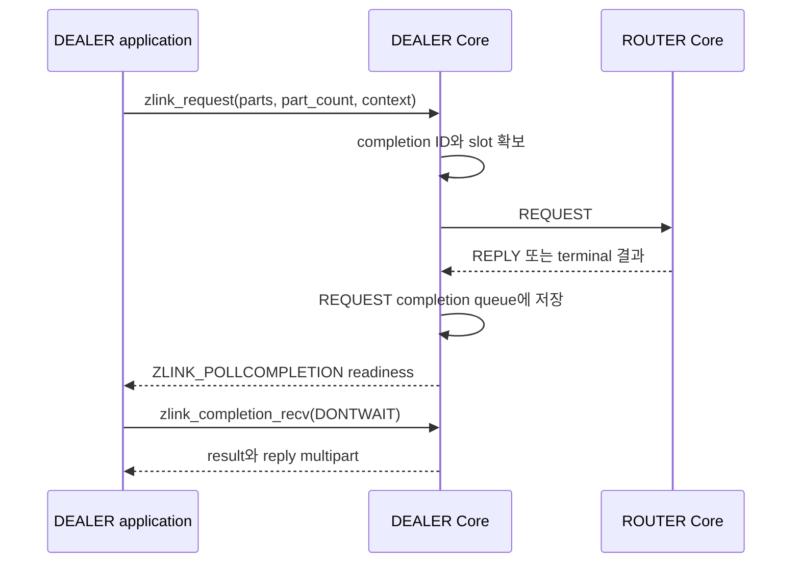

[English](https://zlink-systems.github.io/zlink/spec/core/socket/06-dealer/) | 한국어

<!-- zlink-nav:start -->
[소켓 목차](README.ko.md) | [이전: XSUB](05-xsub.ko.md) | [다음: ROUTER](07-router.ko.md)
<!-- zlink-nav:end -->

# Socket — DEALER

> **이 장이 정의하는 것** — DEALER socket의 request 라우팅과 [result/errno](../03-errors.ko.md#result와-errno-대응)
> 공개 계약.

## 1. DEALER 개요

DEALER는 여러 peer에서 공평하게 번갈아 수신(fair queuing)하고, 연결된 peer에 순환 또는
가중치 기반으로 송신하는 비동기 raw [socket](../glossary.ko.md#socket)이다. Application은
일반 DATA를 pull receive하고 Core가 선택한 ROUTER logical route로 request를 제출할 수 있다.

이 문서는 DEALER 전용 option, outbound peer 선택 규칙, whole-message ownership,
request 제출과 pull completion, receive flow state의 공개 계약을 정의한다. 대상
독자는 이 계약을 C API와 각 언어 binding으로 옮기는 개발자와, DEALER를 사용하는
application 개발자다.

관련 계약의 소유 문서는 다음과 같다.

| 관련 계약 | 정의하는 문서 |
|---|---|
| socket 생성·공통 option(HWM, reconnect, timeout)과 `zlink_socket_set_receive_flow_state` 함수 선언 | [Socket 공통](README.ko.md) |
| Request-reply kind, sequence와 ZMP header byte 배치·검증 | [ZMP](../protocol/01-zmp.ko.md) |
| 각 result와 `zlink_errno()`의 대응 | [Errors](../03-errors.ko.md#result와-errno-대응) |
| Auto HWM budget 계산과 admission | [Auto HWM](../systems/06-auto-hwm.ko.md) |
| status snapshot의 flow 통계 | [Monitoring](../06-monitoring.ko.md) |
| pair 상대인 ROUTER socket의 계약 | [ROUTER](07-router.ko.md) |

## 2. DATA 수신과 request completion

DEALER는 [`zlink_recv`](README.ko.md#zlink_recv-와-zlink_router_recv)로 일반 DATA record 전체를
한 번에 받는다. Part를 caller-제공 `zlink_msg_t` 배열에 채우고 source RID로 `NULL`을 돌려준다. 소유권·close·capacity
규칙은 [Socket 공통](README.ko.md#zlink_recv-와-zlink_router_recv)이 소유한다. DEALER는
inbound typed REQUEST를 받거나 reply하는 responder socket이 아니다. DEALER가 제출한 REQUEST의
reply·timeout·terminal 결과는 일반 receive(`zlink_recv`)에 나타나지 않고
`zlink_completion_recv()`의 REQUEST record로 반환된다.

DEALER-ROUTER single connection에서는 ROUTER가 보낸 DATA와 REPLY·error reply가 같은 inbound
physical FIFO를 사용한다. Physical head가 DATA이면 public DATA receive가, REPLY·error reply이면
socket-local completion queue가 그 record를 소비한다. REPLY는 `zlink_recv()`에 나타나지 않고
DATA는 `zlink_completion_recv()`에 나타나지 않는다.

DEALER-ROUTER single connection에서 ROUTER가 먼저 보낸 DATA와 이후 REPLY·error reply는 같은
FIFO를 사용한다. DEALER가 앞선 DATA를 dequeue하지 않거나 local PAUSED가 유지되면 REPLY는
앞지르지 못하며 request timeout이 먼저 terminal completion을 만들 수 있다.



## 3. Outbound peer 선택

순환·가중치 송신이 어느 peer로 가는지는 다음 규칙이 정한다. 가중치는 각 peer가 자기 socket의
`ZLINK_DEALER_OPT_WEIGHT` 또는 `ZLINK_ROUTER_OPT_WEIGHT`로 알린 절대값이다. DEALER option은
[§7](#7-dealer-option)이 정의한다.

후보는 양수 가중치를 알린 연결된 outbound peer다. 가중치가 `0`인 peer는 후보에서 제외한다.
알려진 peer의 가중치가 모두 `0`이면 submit은 `ZLINK_SUBMIT_NOT_ADMITTED`로 실패할 수 있다.

각 후보는 `0`에서 시작하는 누적값을 갖는다. message 하나를 보낼 때 다음 선택 절차를 한 번
수행한다.

1. 모든 후보의 누적값에 자기 가중치를 더한다.
2. 누적값이 가장 큰 후보를 고른다. 누적값이 같은 후보가 여럿이면 식별자가 가장 작은 후보를
   고른다.
3. 고른 후보의 누적값에서 후보 전체의 가중치 합을 뺀다.

가중치가 같은 경우도 별도 규칙이 아니다. 같은 가중치를 가진 후보도 같은 세 단계를 따르므로
번갈아 선택된다. 후보가 하나뿐인 경우도 같은 절차가 적용된다. 같은 값을 더하고 빼므로
누적값이 그대로이기 때문이다.

이 절차는 한 후보의 몫을 한 구간에 몰아주지 않고 연속 선택을 흩뿌린다. 가중치가 `100`과
`300`이면 반복되는 순서는 `두 번째, 첫 번째, 두 번째, 두 번째`이며, 무거운 peer에 세 번
연속 보낸 뒤 가벼운 peer에 한 번 보내는 순서가 아니다. message가 충분히 쌓이면 선택 빈도가
설정한 비율과 일치한다.

Ordinary `zlink_send()`에서는 peer가 받아들인 message에만 선택 절차를 적용한다. 고른
후보가 쓰기 여유가 없으면 그 시도에 한해 후보에서 빠지고, 절차는 대신 받아들인 peer에 적용된다.
이 fallback은 설정한 가중치를 바꾸지 않으며, 그 peer는 쓰기 여유를 다시 알리면 후보로 돌아온다.
크기 제한을 넘어 거부된 message는 어느 후보든 같은 이유로 거부하므로 다른 후보로 다시 시도하지
않는다.

`NONE`이 admission을 기다릴 때는 configured endpoint 하나를 고정한다. Ordinary
DATA send는 호환되는 양수-weight logical route, typed request는 handshake에서 ROUTER로 확인된
양수-weight logical route에서 고른다. HWM이나 일시적인 disconnect 때문에 기다리는 동안 다른
endpoint로 바꾸지 않는다.

`DONTWAIT` ordinary send와 request는 endpoint를 고정하지 않는다. 한 번의 admission 시도에서
쓰기 여유가 있는 후보가 없으면 `ZLINK_SUBMIT_BACKPRESSURED`+`EAGAIN`과 nonzero wait token을
반환하며, token의 target은 후보 peer 집합 전체다. 어느 후보든 쓰기 여유를 알리거나 새 peer가
연결되면 Core는 `ZLINK_COMPLETION_WRITABLE` record를 하나 발행하고, 다시 제출하면 그 시점의
선택 절차로 peer를 다시 고른다. 연결 직후 peer가 `0`개여도 wait token을 받는다.

2단계의 식별자는 peer routing ID이며 byte 열로 비교한다. routing ID가 없으면 빈 byte 열이므로
비어 있지 않은 모든 식별자보다 앞선다. 식별자가 같은 peer는, routing ID가 모두 없는 경우를
포함해, 연결이 성립한 endpoint 순으로 정렬하고, endpoint까지 같으면 로컬에서 연결이 붙은
순서로 정렬한다. 재연결은 누적값이 `0`에서 시작하는 새 연결을 만든다. 식별자는 그대로이므로
정렬 위치는 이전과 같다.

같은 peer와 같은 가중치로 설정한 두 process는 같은 선택 순서를 낸다. 후보 식별자가 서로 다른
한 application은 이 순서에 의존할 수 있다. 정렬이 로컬 연결 순서까지 내려가는 경우에는 한
process 안에서는 결정적이지만 process 사이에서는 재현되지 않는다.

후보 목록이 바뀌면 남은 후보는 누적값을 그대로 유지하므로 설정한 비율이 보존된다. 새 연결은
`0`에서 시작하고, 연결이 끊긴 peer는 연결과 함께 누적값을 버린다. 수신 측이 따라오지 못해
제출이 제한되는 [backpressure](../glossary.ko.md#backpressure)나 가중치 `0` 때문에
일시적으로만 빠진 peer는 누적값을 유지하며, 다시 후보가 되면 그 값에서 이어간다.

Peer 선택은 Application record 하나에 한 번만 적용된다. 선택한 record가 admission된 뒤 pipe의
remote weight가 `0`으로 바뀌어도 그 record는 같은 pipe로 전달된다. 가중치 `0`은 다음 record를
선택할 때부터 그 pipe를 제외한다.

## 4. Whole-message ownership과 record 원자성

Send API는 `parts_` 배열과 `part_count_`를 record 하나로 원자적으로 제출한다. 여러 thread가 같은
socket에 독립된 record를 동시에 제출할 수 있으며 thread별 sequence 상태는 없다.

함수는 성공과 실패 모두에서 모든 입력 슬롯을 소비하고 길이 0인 초기화 상태로 둔다. 실패하면
peer에는 record의 어떤 part도 보이지 않는다. 다시 보내야 하는 payload는 호출 전에 record 전체를
별도로 보관한다. 실패한 request submit은 completion ID `0`이고 completion과 context echo를 만들지 않는다.

Receive API의 output 슬롯은 호출 전에 초기화할 필요가 없다. 성공하면 앞의 `*part_count_out_`개
슬롯의 소유권이 caller에게 이동하며 caller는 `zlink_multipart_close()`로 정확히 한 번 해제한다.
실패하면 슬롯 소유권은 이동하지 않는다.

## 5. Result와 readiness

submit은 `zlink_submit_result_t`, receive는 `zlink_recv_result_t`, option은
`zlink_config_result_t`를 반환한다. 각 result와 `zlink_errno()`의 대응은
[errno map](../03-errors.ko.md#result와-errno-대응)을 따른다.

DEALER의 `ZLINK_POLLIN`은 DATA record를 수신할 수 있음을 뜻한다. Ordinary send와 request에서
`ZLINK_POLLOUT`은 backpressure 뒤 submit을 다시 시도할 가치가 있음을 나타내지만 다음 submit
성공을 보장하지 않는다. 읽지 않은 `ZLINK_COMPLETION_WRITABLE` record가 있는 동안
`ZLINK_POLLOUT`과 `ZLINK_POLLCOMPLETION`은 level로 유지되며, target별 정확한 신호는 그 record의
token과 context다. Core가 접수한 operation의 결과는 `ZLINK_POLLCOMPLETION`과
`zlink_completion_recv()`로 받는다. Request reply는 `ZLINK_POLLIN`에 나타나지 않는다.

## 6. Receive flow state

DEALER 또는 ROUTER peer와 연결된 DEALER는 자신에게 보내는 peer에게 전송을 멈추고
다시 시작하라고 요청할 수 있다. `zlink_socket_set_receive_flow_state()`는 socket 전체에
적용되는 상태 하나를 저장한다. DEALER의 transport pair는 count `1`이므로, Core는 ready 상태인
peer마다 그 Application connection의 control 경로로 이 상태를 보낸다. 함수
선언은 [Socket 공통](README.ko.md)이, 결과 표는 [Errors](../03-errors.ko.md)가 소유한다.

이 상태는 counter가 아니라 절대값이다. `ZLINK_RECEIVE_FLOW_PAUSED`를 두 번 설정해도 pause는
하나이며 두 번째 호출은 아무것도 보내지 않고 성공한다. 중첩 count도 없고 그만큼 resume을
해야 하는 규칙도 없다. Socket은 상태를 정확히 하나만 유지하므로 한 peer만 pause하고 다른
peer는 running으로 둘 수 없다.

Flow-state frame은 자신이 기록된 connection 범위의 flow epoch를 담는다. Public pair ID·generation
field와 `Zlink-Pair-Id`·`Zlink-Pair-Generation` wire property는 없다. Core는 내부 connection
identity로 frame이 기록된 connection에만 frame을 적용한다. 대체된 connection의 frame을 포함해
identity가 일치하지 않는 frame은 public event 없이 내부에서 소비하고
`flow_state_stale_total` counter에만 반영한다. 같은 connection에서 epoch가 중복·역행하면 frame을
적용하지 않고 `ZLINK_EVENT_FLOW_STATE_STALE`로 보고하며
`ZLINK_MONITOR_EVENT_FLAG_FLOW_STATE_STALE_EPOCH`을 설정한다. 따라서 이전 connection의 frame이
그것을 대체한 connection에 적용되는 일은 없다.

Connection이 ready가 되면 Core는 socket의 현재 상태를 새 Application connection으로 보낸다. 이 socket이
pause한 동안 연결하거나 재연결한 peer는 추가 호출 없이 pause를 알게 된다. 상태를 한 번도
설정하지 않은 socket은 아무것도 보내지 않는다. 새 pair는 이미 RUNNING을 가정하기 때문이다.

Remote PAUSE는 그 peer로 보내는 전송을 막는다. 이는 기존 차단 요인과 합성되는 독립적인
차단 요인이다. queue에 유지할 byte 상한인 Byte [HWM](../glossary.ko.md#hwm), transport wait와
termination도 각각 그대로 전송을 막으며, 어느
것도 해당하지 않을 때만 send가 수락된다. 따라서 remote pause를 해제해도 그것만으로 다음
send가 성공하지는 않는다. Send 결과와 readiness는 그대로다. 차단된 non-blocking send는
계속 `errno == EAGAIN`과 함께 `ZLINK_SUBMIT_BACKPRESSURED`를 보고하고,
`ZLINK_POLLOUT`은 [§5 Result와 readiness](#5-result와-readiness)가 정의한 의미를 유지한다.
Remote RESUME는 그 send가 받은 wait token에 `ZLINK_COMPLETION_WRITABLE` record를 발행하는
wake edge 중 하나다.

Remote PAUSE는 다음 message 경계에서 적용되며 message를 쪼개지 않는다. 이미 admission된 record는
끝까지 전달하고 pause는 그다음 record부터 적용한다.

[Monitoring](../06-monitoring.ko.md)의 status snapshot은 이 socket이 현재 pause 상태로 보는
peer 수, 적용한 pause와 resume 전이 수, stale로 거부한 frame 수, 가장 최근에 끝난 pause의
길이를 제공한다.

## 7. DEALER option

```c
ZLINK_EXPORT zlink_config_result_t zlink_set_dealer_option(
  void *handle_,
  zlink_dealer_option_t option_,
  const void *optval_,
  size_t optvallen_);

ZLINK_EXPORT zlink_config_result_t zlink_get_dealer_option(
  void *handle_,
  zlink_dealer_option_t option_,
  void *optval_,
  size_t *optvallen_);

typedef enum zlink_dealer_option_t {
  ZLINK_DEALER_OPT_PROBE              = 0x3201,  // int, 0=off, 양수=on, getter는 0/1 반환 (기본 0). 연결을 설정할 때 빈 raw message를 보내 peer가 연결과 routing ID를 관찰할 수 있게 한다
  ZLINK_DEALER_OPT_REQUEST_TIMEOUT_MS = 0x3202,  // 0 이상인 int, millisecond (기본 5000). request API에서 timeout_ms_ == 0일 때 사용할 기본 timeout
  ZLINK_DEALER_OPT_WEIGHT             = 0x3203   // int, 0..10000 (기본 100). 연결된 peer에 알리는 이 DEALER의 가중치
} zlink_dealer_option_t;
```

`zlink_get_dealer_option()`을 호출할 때 `*optvallen_`은 `optval_`의 입력 용량이다. 성공하면 실제로
쓴 byte 수로 갱신된다. DEALER 전용이 아닌 HWM, reconnect와 timeout option은
`zlink_set_option()`과 `zlink_get_option()`을 사용한다.

가중치는 `0..10000` 범위의 절대값이다. 범위를 벗어난 값은 거부하며 범위 안으로 보정하지 않는다.

공통 [`ZLINK_OPT_CONFLATE` 계약](README.ko.md#conflation)은 DEALER의 frame 단위 conflation
활성화를 허용하지 않는다. `1` 설정은 `ZLINK_CONFIG_NOT_SUPPORTED`와 `ENOTSUP`이고, `0`은
no-op으로 성공하며 getter는 `0`을 반환한다.

`ZLINK_DEALER_OPT_WEIGHT`는 이 DEALER를 peer가 outbound 후보로 선택할 때 사용할 절대값이다.
DEALER와 ROUTER는 자기 값을 독립적으로 알리므로 각 방향은 상대 socket이 알린 값을 사용한다.

공개 weight 결과는 다음 순서를 따른다.

1. Bind·connect 전에 설정한 값은 single Application pipe가 ready 된 뒤 적용된다.
2. Dynamic 변경은 `0`을 포함한 새 절대값을 peer scheduler에 적용한다.
3. 실제 값이 바뀌면 `PEER_WEIGHT_CHANGED`가 값과 Application lane·connection ID를 제공한다.
   같은 값을 반복 설정하면 event를 추가로 만들지 않는다.
4. Reconnect 뒤에는 현재 설정값을 새 connection에 적용한다.

Network wire, inproc 전달, CONTROL 크기 경계, multipart defer와 선택한 그 pipe의 lifetime·stale
전달 소유권은 [ZMP request-reply lane](../protocol/01-zmp.ko.md#41-request-reply-lane),
[decode](../protocol/01-zmp.ko.md#7-decode-유효성-검사),
[peer-weight owner](../protocol/01-zmp.ko.md#peer-weight-control) 계약이 정의한다. 어느 transport
경로도 public receive나 socket-local completion queue에 weight record를 만들지 않는다.

Record가 pipe를 선택한 뒤 적용값이 `0`이 되어도 그 record는 같은 pipe로 전달된다. 다음 record
선택부터 그 pipe를 제외한다.

Remote weight가 실제로 바뀌면 wait token이 있는 DONTWAIT send와 request를 다시 평가한다. Wait
token은 weight가 `0`이 되어도 끝나지 않는다. `0`에서 양수로 바뀌면 SEND·REQUEST wait token에
`ZLINK_COMPLETION_WRITABLE` record를 발행한다.

Active duplicate는 standby 동안 자기 최신 값을 보관하고 나중에 같은 pipe가 선택되면 사용한다.
Application 최대값을 10 byte보다 작게 설정해도 pair readiness·FLOWSTATE·WEIGHT 전달은 막히지
않으며, 잘못된 CONTROL의 동작은 ZMP가 소유한다.

## 8. 함수

### zlink_send

일반 DATA를 보낸다.

```c
ZLINK_EXPORT zlink_submit_result_t zlink_send (
  void *s_, zlink_msg_t *parts_, size_t part_count_,
  zlink_send_flags_t flags_, void *user_context_,
  zlink_completion_id_t *completion_id_out_);
```

입력 배열 소비와 실패 시 record 원자성은 [§4 Whole-message ownership과 record 원자성](#4-whole-message-ownership과-record-원자성)을
따른다. `part_count_`는 양수여야 한다. `DONTWAIT`은 admission을 한 번만 시도한다. 즉시 admission되면 ID `0`과
completion 없음이고, 쓰기 여유가 있는 후보 peer가 없으면(HWM·byte credit, remote PAUSE, weight
`0`, peer `0`개 포함) `ZLINK_SUBMIT_BACKPRESSURED`+`EAGAIN`과 nonzero wait token을 반환하며
payload는 유지하지 않는다. 어느 후보 peer든 쓰기 여유가 생기면 그 token의
`ZLINK_COMPLETION_WRITABLE` record(`ZLINK_SEND_ADMITTED`, 같은 `user_context`, 빈 `peer_rid`)를
정확히 한 번 만들고, 호출자는 보관한 record를 `DONTWAIT`로 다시 제출한다. Token은 WRITABLE
record로 끝나며, socket close·context 종료는 token을 내부에서 끝내고 record를 전달하지 않는다.
`NONE`은 호출 진입 시 `SNDTIMEO`를 snapshot해 admission까지 기다리고 ID `0`으로 끝난다.
상세 result·errno와
context 계약은 [Socket 공통](README.ko.md#whole-message-send와-pending-admission)을 따른다.

---

### zlink_request

Core가 선택한 ROUTER logical route에 request record 전체를 제출한다.

```c
ZLINK_EXPORT zlink_submit_result_t zlink_request (
  void *s_, const zlink_routing_id_t *target_router_rid_or_null_,
  zlink_msg_t *parts_, size_t part_count_, zlink_send_flags_t flags_,
  uint32_t timeout_ms_, void *user_context_,
  zlink_completion_id_t *completion_id_out_);
```

DEALER는 target 인자에 `NULL`을 요구한다. `part_count_`는 양수여야 한다. Admission된 request는 nonzero REQUEST ID를 반환하고
reply·timeout·terminal 중 한 REQUEST completion을 정확히 한 번 만든다. `timeout_ms_ == 0`은
`ZLINK_DEALER_OPT_REQUEST_TIMEOUT_MS`의 값인 기본 5,000 ms를 snapshot한다.
`user_context_`는 `NONE`과 `DONTWAIT` 모두에서 NULL 또는 opaque pointer를 받으며
successful completion에 그대로 반환한다.

후보는 handshake에서 ROUTER로 확인된 양수-weight logical route뿐이다. DEALER peer는 DATA
후보에는 남지만 request 후보에서는 제외한다. Known ROUTER가 없으면
`ZLINK_SUBMIT_NOT_CONNECTED`+`ENOTCONN`, known ROUTER가 있으나 모두 weight `0`이면
`ZLINK_SUBMIT_NOT_ADMITTED`+`ECONNREFUSED`다. `NONE`은 `SNDTIMEO` 안에서 unknown
endpoint의 handshake와 eligible ROUTER를 기다린 뒤 이 판정식을 적용한다. `NONE`이 detached
positive-weight known ROUTER를 선택한 경우에만 그 configured endpoint에서 기다리며 고른
endpoint를 operation 종료까지 바꾸지 않는다.

`DONTWAIT`은 admission을 한 번만 시도하고 endpoint를 고정하지 않는다. Eligible ROUTER가
없거나(known ROUTER 없음, 모두 weight `0`, connect 직후 peer `0`개) 선택한 ROUTER에 쓰기 여유가
없으면 `ZLINK_SUBMIT_BACKPRESSURED`+`EAGAIN`과 nonzero wait token을 반환하며, token의 target은
request 후보 집합 전체다. Core는 request payload를 보관하지 않는다. 어느 후보든 쓰기 여유를
알리거나, ROUTER로 확인된 peer가 연결되거나, weight가 `0`에서 양수로 바뀌면 Core는
`ZLINK_COMPLETION_WRITABLE` record를 하나 발행하고, caller가 같은 request를 다시 제출하면 그 시점의
선택 절차로 ROUTER를 다시 고른다.

Reply timeout은 local send queue admission, 즉 `ZLINK_SUBMIT_OK` 반환부터 시작한다. Wait token이
유지되는 동안은 timeout이 시작되지 않는다. Admission 뒤 submit 시점 transport pair가 종료되면
[Socket 공통 §6의 completion 표](README.ko.md#request와-reply)대로 원인과 관계없이 즉시
`ZLINK_REQUEST_NOT_CONNECTED`로 한 번 종결하며 payload를 replay하지 않는다. Completion ownership과 close는
[Socket 공통](README.ko.md#completion-pull과-ownership)을 따른다.

---

### zlink_recv

DATA record 전체를 반환한다.

```c
ZLINK_EXPORT zlink_recv_result_t zlink_recv (
  void *s_,
  const zlink_routing_id_t **source_rid_out_,
  zlink_msg_t *parts_out_,
  size_t parts_capacity_,
  size_t *part_count_out_,
  zlink_recv_flags_t flags_);
```

`parts_out_`과 `part_count_out_`은 필수이고 `source_rid_out_`은 선택 output이다. Successful receive의
source는 `NULL`이다. `parts_capacity_`가 record의 part 수보다 작으면 record를 소비하지 않고 필요한 수를
`*part_count_out_`에 쓴 뒤 `ZLINK_RECV_BUFFER_TOO_SMALL`+`ENOBUFS`를 반환한다. 충분한 배열로 재시도하면
같은 record를 받는다. `NONE`의 `RCVTIMEO`, `DONTWAIT`, output ownership·불변과 flag 오류는
[Socket 공통](README.ko.md#zlink_recv-와-zlink_router_recv)을 따른다. Request reply는 이 함수에
나타나지 않는다.

## 9. 구현 및 contract test 검증 요구

공개 표면(DEALER option set·get, `zlink_send`·`zlink_request`·`zlink_recv`·
`zlink_completion_recv`, 반환값·errno와 [Monitoring](../06-monitoring.ko.md) status
snapshot)만으로 다음을 확인한다. 각 항목은 test 하나로 이어진다.

**Option**
- `ZLINK_DEALER_OPT_WEIGHT`에 `0..10000` 밖의 값을 설정하면 거부되며 clamp되지 않는다.
- `zlink_get_dealer_option()`이 성공하면 `*optvallen_`이 실제로 쓴 byte 수로 갱신된다.
- `ZLINK_DEALER_OPT_PROBE`를 양수로 설정하면 연결을 설정할 때 peer가 빈 raw message로 연결과 routing ID를 관찰할 수 있고, getter는 `0` 또는 `1`을 반환한다.
- request record를 `timeout_ms_ == 0`으로 제출하면 `ZLINK_DEALER_OPT_REQUEST_TIMEOUT_MS`의 값(기본 `5000`)이 timeout으로 쓰인다.
- DEALER에서 `ZLINK_OPT_CONFLATE=1`은 `ZLINK_CONFIG_NOT_SUPPORTED`와 `ENOTSUP`이고, `0` 설정은
  성공하며 getter는 `0`을 반환한다.

**Peer weight 전달**
- Bind·connect 전에 DEALER와 상대 ROUTER의 weight를 서로 다른 값으로 설정하면 pair가 ready 된
  뒤 양쪽 scheduler가 상대의 정확한 값을 사용하며, `0`인 peer는 outbound 후보에서 제외된다.
- Network와 inproc pair가 ready 된 뒤 양쪽 weight를 동적으로 바꾸면 monitor의
  `PEER_WEIGHT_CHANGED`가 새 값을 `value`로 제공하고, event의 transport lane과 `connection_id`는
  값을 적용한 Application pipe와 같다.
- Weight를 설정하거나 동기화해도 public receive와 socket-local completion queue에는 record가
  추가되지 않으며, 같은 값을 다시 설정해도 monitor event가 중복 발생하지 않는다.
- Application record가 admission되는 동안 weight를 여러 번 바꿔도 peer에는 multipart가 atomic
  record 하나로 보이며, 다음 record 선택에는 가장 최근 값만 반영된다.
- Application record가 admission된 뒤 pipe의 remote weight가 `0`이 되어도 같은 pipe가 record
  전체를 전달하고, 다음 record 선택부터 제외된다.
- Remote weight 변경은 wait token이 있는 DONTWAIT SEND와 REQUEST를 다시 평가한다. Weight가 `0`이
  되어도 wait token은 끝나지 않는다. `0`에서 양수로 바뀌면 SEND·REQUEST wait token에 WRITABLE
  record가 발행된다.
- Application 최대값을 10 byte보다 작게 설정해도 pair readiness·FLOWSTATE와 peer 선택·monitor로
  관찰하는 weight 변경은 막히지 않는다.
- Reconnect 뒤 peer 선택과 monitor는 새 connection의 현재 weight를 반영한다. Active standby를
  승격하면 그 standby가 마지막으로 받은 값을 사용한다.

**Outbound peer 선택**
- 가중치가 `100`과 `300`인 두 peer에 반복 송신하면 선택 순서가 `두 번째, 첫 번째, 두 번째, 두 번째`의 반복이다.
- 같은 가중치를 가진 후보는 번갈아 선택되며, message가 충분히 쌓이면 선택 빈도가 설정한 비율과 일치한다.
- 알려진 peer의 가중치가 모두 `0`이면 submit이 `ZLINK_SUBMIT_NOT_ADMITTED`로 실패할 수 있다.
- 같은 peer와 같은 가중치로 설정하고 후보 식별자가 서로 다른 두 process는 같은 선택 순서를 낸다.
- 재연결한 peer는 누적값 `0`에서 다시 시작하고 정렬 위치는 이전과 같다.
- 쓰기 여유가 없어 message를 받지 못한 peer는 그 message에 한해서만 후보에서 빠지고, 여유를 다시 알리면 유지된 누적값에서 이어간다.
- DONTWAIT SEND와 REQUEST는 endpoint를 고정하지 않는다. 쓰기 여유가 있는 후보가 없으면
  `ZLINK_SUBMIT_BACKPRESSURED`+`EAGAIN`과 nonzero wait token을 반환하고, 어느 후보든 쓰기
  여유를 알리거나 새 peer가 연결되면 WRITABLE record 하나가 발행되며, 다시 제출하면 peer를
  다시 고른다. peer가 `0`개여도 wait token을 받는다.

**Whole-message ownership과 원자성**
- send API는 성공과 실패 모두에서 모든 `parts_` 슬롯을 소비하고 길이 0인 초기화 상태로 둔다 — 호출 후 같은 슬롯에서 전송 전 payload를 다시 읽거나 재전송할 수 없다.
- Submit이 실패하면 peer에는 그 record의 어떤 part도 보이지 않으며, caller는 호출 전에 보관한 record 전체를 다시 제출한다.
- 실패한 request submit은 ID `0`이고 completion과 context echo를 만들지 않는다.
- receive가 성공하면 앞의 `*part_count_out_`개 슬롯 소유권이 caller에게 이동하고 `zlink_multipart_close()`로 정확히 한 번 해제한다. 실패하면 소유권이 이동하지 않는다.

**Request와 completion**
- Request가 `ZLINK_SUBMIT_OK`이면 nonzero ID를 반환하고 reply·timeout·terminal 중 하나를
  REQUEST completion으로 정확히 한 번 반환한다. Submit 실패는 ID `0`이고 completion이 없다.
- `NONE`은 `SNDTIMEO` 안에서 eligible ROUTER가 생기기를 기다린 뒤 known positive-weight ROUTER가
  없으면 `ZLINK_SUBMIT_NOT_CONNECTED`+`ENOTCONN`, known ROUTER가 있지만 모두 weight `0`이면
  `ZLINK_SUBMIT_NOT_ADMITTED`+`ECONNREFUSED`다. DEALER peer는 typed request 후보가 아니다. 고른
  configured endpoint는 reconnect 동안 바뀌지 않는다.
- `DONTWAIT`은 admission을 한 번만 시도하고 endpoint를 고정하지 않는다. Eligible ROUTER가 없거나
  쓰기 여유가 없으면 `ZLINK_SUBMIT_BACKPRESSURED`+`EAGAIN`과 nonzero wait token을 반환하고 Core는
  payload를 보관하지 않는다. WRITABLE record 뒤 caller가 같은 request를 다시 제출하면 ROUTER를 다시
  선택한다.
- Request timeout은 local queue admission부터 시작하고 wait token이 유지되는 동안은 시작하지 않는다.
  Admission 뒤 submit 시점 pair가 종료되면 timeout을 기다리지 않고 즉시 `ZLINK_REQUEST_NOT_CONNECTED`
  completion 하나를 받으며 payload는 replay되지 않는다.
- SEND wait token과 REQUEST가 공유하는 completion reservation이 포화하면 REQUEST는 flags와
  관계없이 즉시 `ZLINK_SUBMIT_BACKPRESSURED`+`EAGAIN`, ID `0`, completion 없음이고, DONTWAIT
  SEND는 `ZLINK_SUBMIT_OUT_OF_MEMORY`+`ENOMEM`, ID `0`이다.
- ROUTER가 multipart DATA를 먼저 보내고 같은 request의 REPLY를 보내면 앞선 DATA record를
  dequeue하기 전에는 `ZLINK_POLLCOMPLETION`이 준비되지 않는다. DATA record 뒤 REPLY는
  정확히 한 REQUEST completion으로 나오며 reply payload는 DATA receive에 나타나지 않는다.
- 앞선 DATA와 local PAUSED로 REPLY가 늦어 request timeout이 먼저 끝나면 timeout completion
  하나만 반환하고, DATA를 drain한 뒤 도착한 late REPLY는 두 번째 completion을 만들지 않는다.

**Receive**
- Non-blocking `zlink_recv()` 호출에 받을 DATA가 없으면 `ZLINK_RECV_NO_DATA`와 `EAGAIN`을 반환한다.
- `parts_capacity_`가 record의 part 수보다 작으면 필요한 수와 `ZLINK_RECV_BUFFER_TOO_SMALL`+`ENOBUFS`를 반환하고 record를 소비하지 않으며, 충분한 배열로 재시도하면 같은 record를 받는다.
- 성공한 호출은 multipart record의 모든 part를 배열 순서대로 한 번에 반환한다.
- Successful receive의 `source_rid_out_`은 `NULL`이고 DEALER는 inbound typed REQUEST나 requester의
  reply를 DATA receive로 반환하지 않는다.
- `NONE`은 진입 시 `RCVTIMEO`를 snapshot하며 timeout·context termination·socket shutdown은
  공통 recv result·errno와 output 불변 계약을 따른다.

**Result와 readiness**
- `ZLINK_POLLIN`은 DATA record를 수신할 수 있음을 뜻하고 request completion은
  `ZLINK_POLLCOMPLETION`으로 구분한다.
- Backpressure 뒤 `ZLINK_POLLOUT`이 관찰되어도 다음 submit 성공은 보장되지 않는다.
- 읽지 않은 `ZLINK_COMPLETION_WRITABLE` record가 있는 동안 `ZLINK_POLLOUT`과
  `ZLINK_POLLCOMPLETION`이 level로 유지되고, `NO_DATA`까지 drain하면 내려간다.

**Receive flow state**
- `ZLINK_RECEIVE_FLOW_PAUSED`를 두 번 설정해도 pause는 하나이며 두 번째 호출은 아무것도 보내지 않고 성공한다.
- Flow-state frame에는 자신이 기록된 connection 범위의 flow epoch만 있고 public pair ID·generation field와 `Zlink-Pair-Id`·`Zlink-Pair-Generation` wire property가 없다. Core는 내부 connection identity가 일치하는 기록 connection에만 frame을 적용한다.
- 대체된 connection의 frame을 포함해 identity가 일치하지 않는 frame은 public event 없이 내부에서 소비되고 `flow_state_stale_total`에만 반영된다. 같은 connection의 중복·역행 epoch는 적용되지 않고 `ZLINK_EVENT_FLOW_STATE_STALE`과 `ZLINK_MONITOR_EVENT_FLAG_FLOW_STATE_STALE_EPOCH`으로 보고된다.
- 이 socket이 pause한 동안 연결하거나 재연결한 peer는 추가 호출 없이 pause를 알게 되고, 상태를 한 번도 설정하지 않은 socket은 아무것도 보내지 않는다.
- DEALER-DEALER와 DEALER-ROUTER 모두 receive-flow control을 single Application connection으로
  전달하며 public receive나 socket-local completion queue에는 control record가 나타나지 않는다.
- DEALER-ROUTER reconnect는 새 Application connection 하나로 현재 절대 상태를 다시 보내고,
  이전 connection ID·generation의 REPLY와 FLOWSTATE는 현재 connection에 적용하지 않는다.
- remote pause를 해제해도 그것만으로 다음 send가 성공하지 않는다. 차단된 non-blocking send는 계속 `errno == EAGAIN`과 함께 `ZLINK_SUBMIT_BACKPRESSURED`와 wait token을 반환하고, remote RESUME는 그 token의 WRITABLE record를 발행한다.
- remote PAUSE는 다음 message 경계에서 적용된다 — 이미 admission된 record는 끝까지 전달된다.
- [Monitoring](../06-monitoring.ko.md) status snapshot에서 현재 pause 상태로 보는 peer 수, 적용한 pause·resume 전이 수, stale로 거부한 frame 수, 가장 최근에 끝난 pause의 길이를 관찰할 수 있다.

<!-- zlink-nav:start -->
[소켓 목차](README.ko.md) | [이전: XSUB](05-xsub.ko.md) | [다음: ROUTER](07-router.ko.md)
<!-- zlink-nav:end -->
