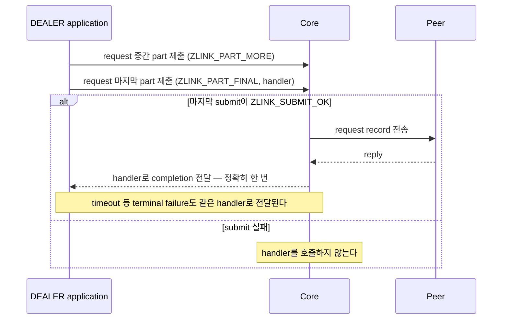

[English](https://zlink-systems.github.io/zlink/spec/core/socket/06-dealer/) | 한국어

<!-- zlink-nav:start -->
[소켓 목차](README.ko.md) | [이전: XSUB](05-xsub.ko.md) | [다음: ROUTER](07-router.ko.md)
<!-- zlink-nav:end -->

# Socket — DEALER

> **이 장이 정의하는 것** — DEALER socket의 request 라우팅과 [result/errno](../03-errors.ko.md#result와-errno-대응)
> 공개 계약.

## 1. DEALER 개요

DEALER는 여러 peer에서 공평하게 번갈아 수신(fair queuing)하고, 연결된 peer에 순환 또는
가중치 기반으로 송신하는 비동기 raw [socket](../glossary.ko.md#socket)이다. 일반 raw
message와 수신 request record를 같은 socket에서 처리할 수 있다.

이 문서는 DEALER 전용 option, outbound peer 선택 규칙, record 구분, part sequence와
소유권, request·reply 제출과 completion, receive flow state의 공개 계약을 정의한다. 대상
독자는 이 계약을 C API와 각 언어 binding으로 옮기는 개발자와, DEALER를 사용하는
application 개발자다.

관련 계약의 소유 문서는 다음과 같다.

| 관련 계약 | 정의하는 문서 |
|---|---|
| socket 생성·공통 option(HWM, reconnect, timeout)과 `zlink_socket_set_receive_flow_state` 함수 선언 | [Socket 공통](README.ko.md) |
| Request-reply kind, sequence와 ZMP header byte 배치·검증 | [ZMP](../protocol/01-zmp.ko.md) |
| 각 result와 `zlink_errno()`의 대응 | [Errors](../03-errors.ko.md#result와-errno-대응) |
| Auto HWM budget 계산과 admission | [Auto HWM](../systems/06-auto-hwm.ko.md) |
| status snapshot의 flow 통계 | [Monitoring](../06-monitoring.ko.md) |
| pair 상대인 ROUTER socket의 계약 | [ROUTER](07-router.ko.md) |

## 2. Message record 구분

DEALER는 part 단위로 송수신하며, `ZLINK_PART_MORE`부터 `ZLINK_PART_FINAL`까지 이어지는
part 묶음 하나가 완전한 record다. Receive record에는 일반 raw message와 이 DEALER가 수신한
request의 두 종류가 있다. 정확한 숫자 값은
[§7 공개 타입](#7-공개-타입)의 `zlink_dealer_message_type_t`가 정의한다.

[`zlink_dealer_recv_part()`](#zlink_dealer_recv_part)는 payload part와 함께 record 종류와
request sequence를 반환한다. 한 multipart record의 모든 part에는 같은 message type과
request sequence가 반환된다. request API로 시작한 작업의 reply와 terminal failure는 receive
record로 반환하지 않고 `zlink_reply_handler_fn` completion으로만 전달된다. 일반 raw message는
[`zlink_send_part()`](#zlink_send_part)로 보내며 request sequence를 만들지 않는다.

Core는 ZMP header에서 복원한 request kind와 wire sequence를 첫 payload part에 내부 값으로
보존한다. `zlink_dealer_recv_part()`만 request kind를 해석해 source pipe와 wire sequence를
저장하고, application에는 같은 socket에서만 유효한 0이 아닌 reply token을 반환한다. 서로 다른
source pipe가 같은 wire sequence를 보내도 token은 서로 다르며, reply는 저장한 source pipe에
원래 wire sequence로 돌아간다.

Typed receive에 reply나 error reply가 도착하면 `EPROTO`로 pair를 종료하고 payload를 반환하지
않는다. 반대로 공통 raw receive 함수인 `zlink_recv_part()`는 request, reply와 error reply도
ordinary payload로 반환하며 reply target이나 token을 만들지 않는다. 어느 receive 경로든
application에 part를 넘기기 전에 내부 kind와 sequence를 제거하므로, 받은 part를 raw send에
다시 사용하면 ordinary data가 된다.

request 한 건의 완료까지의 흐름은 다음과 같다.



## 3. Outbound peer 선택

순환·가중치 송신이 어느 peer로 가는지는 다음 규칙이 정한다. 가중치는 각 peer가 자기 socket의
`ZLINK_DEALER_OPT_WEIGHT` 또는 `ZLINK_ROUTER_OPT_WEIGHT`로 알린 절대값이다. DEALER option은
[§8](#8-dealer-option)이 정의한다.

후보는 양수 가중치를 알린 연결된 outbound peer다. 가중치가 `0`인 peer는 후보에서 제외한다.
알려진 peer의 가중치가 모두 `0`이면 submit은 `ZLINK_SUBMIT_NOT_ADMITTED`로 실패할 수 있다.

각 후보는 `0`에서 시작하는 누적값을 갖는다. message 하나를 보낼 때 다음 선택 절차를 한 번
수행한다.

1. 모든 후보의 누적값에 자기 가중치를 더한다.
2. 누적값이 가장 큰 후보를 고른다. 누적값이 같은 후보가 여럿이면 식별자가 가장 작은 후보를
   고른다.
3. 고른 후보의 누적값에서 후보 전체의 가중치 합을 뺀다.

가중치가 같은 경우도 별도 규칙이 아니다. 같은 가중치를 가진 후보도 같은 세 단계를 따르므로
번갈아 선택된다. 후보가 하나뿐인 경우도 같은 절차가 적용된다. 같은 값을 더하고 빼므로
누적값이 그대로이기 때문이다.

이 절차는 한 후보의 몫을 한 구간에 몰아주지 않고 연속 선택을 흩뿌린다. 가중치가 `100`과
`300`이면 반복되는 순서는 `두 번째, 첫 번째, 두 번째, 두 번째`이며, 무거운 peer에 세 번
연속 보낸 뒤 가벼운 peer에 한 번 보내는 순서가 아니다. message가 충분히 쌓이면 선택 빈도가
설정한 비율과 일치한다.

Exact target을 아직 확정하지 않은 ordinary `zlink_send_part()` 또는
`zlink_dealer_request_part()`에서는 peer가 받아들인 message에만 선택 절차를 적용한다. 고른
후보가 쓰기 여유가 없으면 그 시도에 한해 후보에서 빠지고, 절차는 대신 받아들인 peer에 적용된다.
이 fallback은 설정한 가중치를 바꾸지 않으며, 그 peer는 쓰기 여유를 다시 알리면 후보로 돌아온다.
크기 제한을 넘어 거부된 message는 어느 후보든 같은 이유로 거부하므로 다른 후보로 다시 시도하지
않는다.

Exact routed selection의 commit 경계는 다르다. `zlink_select_routed_submit_target()`과 DEALER의
`zlink_send_async()`는 HWM으로 막힌 pipe를 포함해 연결됐고 가중치가 양수인 모든 Application
pipe를 대상으로 weighted step 하나를 확정한다. 선택한 exact pipe는 pending key로 유지된다.
HWM이면 그 pipe를 기다리며 다른 후보로 reroute하지 않는다.

2단계의 식별자는 peer routing ID이며 byte 열로 비교한다. routing ID가 없으면 빈 byte 열이므로
비어 있지 않은 모든 식별자보다 앞선다. 식별자가 같은 peer는, routing ID가 모두 없는 경우를
포함해, 연결이 성립한 endpoint 순으로 정렬하고, endpoint까지 같으면 로컬에서 연결이 붙은
순서로 정렬한다. 재연결은 누적값이 `0`에서 시작하는 새 연결을 만든다. 식별자는 그대로이므로
정렬 위치는 이전과 같다.

같은 peer와 같은 가중치로 설정한 두 process는 같은 선택 순서를 낸다. 후보 식별자가 서로 다른
한 application은 이 순서에 의존할 수 있다. 정렬이 로컬 연결 순서까지 내려가는 경우에는 한
process 안에서는 결정적이지만 process 사이에서는 재현되지 않는다.

후보 목록이 바뀌면 남은 후보는 누적값을 그대로 유지하므로 설정한 비율이 보존된다. 새 연결은
`0`에서 시작하고, 연결이 끊긴 peer는 연결과 함께 누적값을 버린다. 수신 측이 따라오지 못해
제출이 제한되는 [backpressure](../glossary.ko.md#backpressure)나 가중치 `0` 때문에
일시적으로만 빠진 peer는 누적값을 유지하며, 다시 후보가 되면 그 값에서 이어간다.

Peer 선택은 Application message 하나 동안 고정된다. Multipart의 첫 part를 받은 뒤 선택한
pipe의 remote weight가 `0`으로 바뀌어도 `ZLINK_PART_FINAL`까지 남은 part를 같은 pipe로 보낸다.
가중치 `0`은 다음 message를 선택할 때부터 그 pipe를 제외한다.

## 4. Part sequence와 소유권

`*_part` send 호출은 `ZLINK_PART_MORE`부터 `ZLINK_PART_FINAL`까지 하나의 multipart sequence를
구성한다. 열린 sequence가 있는 동안 같은 handle에서 다른 send helper family를 섞을 수 없다.

초기화된 유효한 `part_`를 send API에 넘기면 함수는 성공과 실패 모두에서 그 message 내용을
소비하고 길이 0인 초기화 상태로 둔다. 따라서 호출 결과와 관계없이 호출자가 전송 전 payload를
다시 읽거나 같은 내용을 다시 보낼 수 없다. 다시 보내야 하는 payload는 호출 전에 별도 message로
보관해야 한다.

각 send helper family는 성공한 중간 part를 `ZLINK_PART_FINAL`이 성공할 때까지 하나의 record로
staging한다. 열린 sequence의 중간 또는 마지막 submit이 실패하면 Core는 이전에 staging한 part와
실패한 part를 원자적으로 폐기하고 sequence를 닫는다. peer에는 그 record의 어떤 part도 보이지
않는다. 실패한 호출의 `part_`도 소비되며 다음 submit은 새 record의 첫 part로 시작한다. 실패한
request submit은 request sequence를 만들지 않고 handler도 호출하지 않는다. reply sequence가 실패하면
reply token은 성공한 `ZLINK_PART_FINAL`이나 request lifecycle 종료 전까지 유효하므로 caller가 보관한 전체 reply를
첫 part부터 다시 제출할 수 있다.

Request와 reply의 첫 application part에 non-empty message group이 있으면 내부 request metadata를
동시에 저장할 수 없으므로 전체 submission을 `ZLINK_SUBMIT_INVALID_ARGUMENT`와 `EINVAL`로
거부한다. 전달한 C part는 같은 소비 규칙을 따르고, staged part·pending request·reply target은
남지 않는다.

receive API의 `part_out_`은 호출 전에 초기화된 `zlink_msg_t`여야 한다. 성공하면 수신 part의
소유권이 호출자에게 이동하며 호출자는 `zlink_msg_close()`로 정확히 한 번 해제한다. 실패하면
수신 part 소유권은 이동하지 않는다.

## 5. Result와 readiness

submit은 `zlink_submit_result_t`, receive는 `zlink_recv_result_t`, option은
`zlink_config_result_t`를 반환한다. 각 result와 `zlink_errno()`의 대응은
[errno map](../03-errors.ko.md#result와-errno-대응)을 따른다.

DEALER의 `ZLINK_POLLIN`은 raw 또는 request record를 수신할 수 있음을 뜻한다. Ordinary send와
request에서 `ZLINK_POLLOUT`은 backpressure 뒤 submit을 다시 시도할 가치가 있음을 나타내지만
다음 submit 성공을 보장하지 않는다. operation별 확정 답이 필요한 앱은 `zlink_send_async`와 그
완료 통지를 쓴다. 이 readiness 계약은 raw reply에 적용하지 않는다.

## 6. Receive flow state

terminal reply와 error reply의 진행만 담당하는 별도 경로인
[completion progress lane](../glossary.ko.md#completion-progress-lane)으로 ROUTER와 pair를 이룬
DEALER는 자신에게 보내는 peer에게 전송을 멈추고
다시 시작하라고 요청할 수 있다. `zlink_socket_set_receive_flow_state()`는 socket 전체에
적용되는 상태 하나를 저장하고 이 socket의 ready pair마다 completion lane으로 보낸다. 함수
선언은 [Socket 공통](README.ko.md)이, 결과 표는 [Errors](../03-errors.ko.md)가 소유한다.

이 상태는 counter가 아니라 절대값이다. `ZLINK_RECEIVE_FLOW_PAUSED`를 두 번 설정해도 pause는
하나이며 두 번째 호출은 아무것도 보내지 않고 성공한다. 중첩 count도 없고 그만큼 resume을
해야 하는 규칙도 없다. Socket은 상태를 정확히 하나만 유지하므로 한 peer만 pause하고 다른
peer는 running으로 둘 수 없다.

각 상태 변경은 한 connection generation 안에서 증가하는 flow epoch를 함께 보내고, frame은
자신이 기록된 connection의 pair id와 generation도 담는다. 수신 socket은 frame이 현재 pair와
generation을 지칭하고 epoch가 그 generation에서 마지막으로 수락한 epoch보다 클 때만
적용한다. 다른 pair ID, pair ID·generation이 `0`, transport-pair table에 없는 pair 또는
등록된 completion pipe가 아닌 pipe의 frame은 event 없이 소비한다. 현재 pair ID에서
generation이 일치하지 않거나 같은 generation의 epoch가 중복·역행한 경우에만 frame을
적용하지 않고 `ZLINK_EVENT_FLOW_STATE_STALE`로 보고한다. 따라서 이전 generation의 frame이
그것을 대체한 connection에 적용되는 일은 없다.

Pair가 ready가 되면 Core는 socket의 현재 상태를 새 completion lane으로 보낸다. 이 socket이
pause한 동안 연결하거나 재연결한 peer는 추가 호출 없이 pause를 알게 된다. 상태를 한 번도
설정하지 않은 socket은 아무것도 보내지 않는다. 새 pair는 이미 RUNNING을 가정하기 때문이다.

Remote PAUSE는 그 peer로 보내는 전송을 막는다. 이는 기존 차단 요인과 합성되는 독립적인
차단 요인이다. queue에 유지할 byte 상한인 Byte [HWM](../glossary.ko.md#hwm), transport wait와
termination도 각각 그대로 전송을 막으며, 어느
것도 해당하지 않을 때만 send가 수락된다. 따라서 remote pause를 해제해도 그것만으로 다음
send가 성공하지는 않는다. Send 결과와 readiness는 그대로다. 차단된 non-blocking send는
계속 `errno == EAGAIN`과 함께 `ZLINK_SUBMIT_BACKPRESSURED`를 보고하고,
`ZLINK_POLLOUT`은 [§5 Result와 readiness](#5-result와-readiness)가 정의한 의미를 유지한다.

Remote PAUSE는 다음 message 경계에서 적용되며 message를 쪼개지 않는다. 첫 byte가 이미
pipe에 도달한 message와 socket이 첫 part를 이미 수락한 message는 남은 part를 끝까지 보내고,
pause는 그다음 message부터 적용한다.

[Monitoring](../06-monitoring.ko.md)의 status snapshot은 이 socket이 현재 pause 상태로 보는
peer 수, 적용한 pause와 resume 전이 수, stale로 거부한 frame 수, 가장 최근에 끝난 pause의
길이를 제공한다.

## 7. 공개 타입

이 절과 [§8 DEALER option](#8-dealer-option)의 enum 숫자는 공개 ABI 값이다.

```c
typedef enum zlink_dealer_message_type_t {
  ZLINK_DEALER_MESSAGE_RAW         = 0,  // 일반 raw multipart message. request sequence는 0
  ZLINK_DEALER_MESSAGE_REQUEST     = 1   // 이 DEALER가 수신한 request. 0이 아닌 request sequence는 zlink_dealer_reply_part()에 넘길 reply token
} zlink_dealer_message_type_t;

typedef enum zlink_part_flag_t {
  ZLINK_PART_FINAL = 0,  // 현재 part가 그 record의 마지막임을 뜻한다
  ZLINK_PART_MORE  = 1   // 같은 multipart record에 뒤따르는 part가 있음을 뜻한다
} zlink_part_flag_t;

typedef void (*zlink_reply_handler_fn)(
  zlink_request_result_t result_,
  zlink_msg_t *parts_,
  size_t part_count_,
  void *userdata_);
```

receive API의 `has_more_out_`도 `zlink_part_flag_t`의 같은 두 값을 사용한다.

## 8. DEALER option

```c
ZLINK_EXPORT zlink_config_result_t zlink_set_dealer_option(
  void *handle_,
  zlink_dealer_option_t option_,
  const void *optval_,
  size_t optvallen_);

ZLINK_EXPORT zlink_config_result_t zlink_get_dealer_option(
  void *handle_,
  zlink_dealer_option_t option_,
  void *optval_,
  size_t *optvallen_);

typedef enum zlink_dealer_option_t {
  ZLINK_DEALER_OPT_PROBE              = 0x3201,  // int, 0=off, 양수=on, getter는 0/1 반환 (기본 0). 연결을 설정할 때 빈 raw message를 보내 peer가 연결과 routing ID를 관찰할 수 있게 한다
  ZLINK_DEALER_OPT_REQUEST_TIMEOUT_MS = 0x3202,  // 0 이상인 int, millisecond (기본 5000). request API에서 timeout_ms_ == 0일 때 사용할 기본 timeout
  ZLINK_DEALER_OPT_WEIGHT             = 0x3203   // int, 0..10000 (기본 100). 연결된 peer에 알리는 이 DEALER의 가중치
} zlink_dealer_option_t;
```

`zlink_get_dealer_option()`을 호출할 때 `*optvallen_`은 `optval_`의 입력 용량이다. 성공하면 실제로
쓴 byte 수로 갱신된다. DEALER 전용이 아닌 HWM, reconnect와 timeout option은
`zlink_set_option()`과 `zlink_get_option()`을 사용한다.

`0..10000` 밖의 가중치는 거부하며 clamp하지 않는다. `0..100` 값의 의미는 범위를 넓히기 전과
같다.

공통 [`ZLINK_OPT_CONFLATE` 계약](README.ko.md#conflation)은 DEALER의 frame 단위 conflation
활성화를 허용하지 않는다. `1` 설정은 `ZLINK_CONFIG_NOT_SUPPORTED`와 `ENOTSUP`이고, `0`은
no-op으로 성공하며 getter는 `0`을 반환한다.

`ZLINK_DEALER_OPT_WEIGHT`는 이 DEALER를 peer가 outbound 후보로 선택할 때 사용할 절대값이다.
DEALER와 ROUTER는 자기 값을 독립적으로 알리므로 각 방향은 상대 socket이 알린 값을 사용한다.

공개 weight 결과는 다음 순서를 따른다.

1. Bind·connect 전에 설정한 값은 paired Application pipe가 ready 된 뒤 적용된다.
2. Dynamic 변경은 `0`을 포함한 새 절대값을 peer scheduler에 적용한다.
3. 실제 값이 바뀌면 `PEER_WEIGHT_CHANGED`가 값과 paired Application pipe의 lane·pair ID·generation을
   제공한다. 같은 값을 반복 설정하면 event를 추가로 만들지 않는다.
4. Reconnect 뒤에는 현재 설정값을 새 generation에 적용한다.

Network wire, inproc 전달, CONTROL 크기 경계, multipart defer와 exact-pipe lifetime·stale 전달
소유권은 [ZMP transport pair](../protocol/01-zmp.ko.md#41-request-reply-transport-pair),
[decode](../protocol/01-zmp.ko.md#7-decode-유효성-검사),
[peer-weight owner](../protocol/01-zmp.ko.md#peer-weight-control) 계약이 정의한다. 어느 transport
경로도 public receive나 Completion lane에 weight record를 만들지 않는다.

Multipart가 pipe를 선택한 뒤 적용값이 `0`이 되어도 그 message는 같은 pipe에서 FINAL까지
완료한다. 다음 message 선택부터 그 pipe를 제외한다.

Remote weight가 실제로 바뀌면 exact pipe의 보류된 `zlink_send_async()` 작업을 다시 평가한다.
Message 시작 전에 weight가 `0`이 되면 completion은 `ZLINK_SEND_TERMINAL`이고
`terminal_errno == ECONNREFUSED`다. `0`에서 양수로 바뀌면 다른 write-activation event 없이
재시도할 수 있다.

Active duplicate는 standby 동안 자기 최신 값을 보관하고 나중에 같은 pipe가 선택되면 사용한다.
Application 최대값을 10 byte보다 작게 설정해도 pair readiness·FLOWSTATE·WEIGHT 전달은 막히지
않으며, 잘못된 CONTROL의 동작은 ZMP가 소유한다.

## 9. 함수

### zlink_send_part

일반 raw message를 보낼 때는 이 API를 사용하며 request sequence를 만들지 않는다.

```c
ZLINK_EXPORT zlink_submit_result_t zlink_send_part(
  void *s_,
  zlink_msg_t *part_,
  zlink_send_flags_t flags_,
  zlink_part_flag_t part_flag_);
```

part 소비와 실패 시 record 폐기 규칙은 [§4 Part sequence와 소유권](#4-part-sequence와-소유권)을
따른다.

---

### zlink_dealer_send_transport_pair_part

지정한 exact target에만 raw part를 제출한다.

```c
ZLINK_EXPORT zlink_submit_result_t zlink_dealer_send_transport_pair_part(
  void *dealer_,
  const zlink_routed_submit_target_t *target_,
  zlink_msg_t *part_,
  zlink_send_flags_t flags_,
  zlink_part_flag_t part_flag_);
```

`target_`은 같은 DEALER에서 `zlink_select_routed_submit_target()`으로 얻은 값이다. Core는
RID·transport pair ID·generation이 현재 연결된 같은 application pipe를 가리키는지 한 번
검증하고 그 pipe에만 제출한다. HWM이면 `ZLINK_SUBMIT_BACKPRESSURED`, detach나 stale generation이면
`ZLINK_SUBMIT_NOT_CONNECTED`이며 다른 pipe로 재선택하지 않는다. 첫 part가 성공하면 그 exact pipe
fence를 FINAL까지 유지한다. 중간 또는 마지막 part 실패는 앞서 staging한 전체 record를 rollback하고
sequence를 닫으므로 peer에는 부분 record가 보이지 않는다.

Part 호출마다 public API scope가 따로이므로 binding은 한 번의 nonblocking multipart
시도 동안만 자기 socket-local attempt gate를 유지해 다른 binding submit의 interleave를
막는다. `BACKPRESSURED` 뒤 readiness를 기다릴 때는 gate를 해제한다. 이는 새 Core
multipart API나 공개 FIFO 계약을 만들지 않는다.

---

### zlink_dealer_request_part

하나의 비동기 request payload를 part 단위로 제출한다.

```c
ZLINK_EXPORT zlink_submit_result_t zlink_dealer_request_part(
  void *dealer_,
  zlink_msg_t *part_,
  zlink_send_flags_t flags_,
  zlink_part_flag_t part_flag_,
  uint32_t timeout_ms_,
  zlink_reply_handler_fn handler_,
  void *userdata_);
```

중간 part는 `part_flag_`를
`ZLINK_PART_MORE`로 두고 `timeout_ms_ == 0`, `handler_ == NULL`, `userdata_ == NULL`로 호출한다.
마지막 part는 `ZLINK_PART_FINAL`과 0이 아닌 `handler_`를 사용한다. 마지막 호출의
`timeout_ms_ == 0`은 `ZLINK_DEALER_OPT_REQUEST_TIMEOUT_MS` 기본값을 사용한다. `flags_`는
`ZLINK_SEND_FLAGS_NONE` 또는 `ZLINK_SEND_FLAGS_DONTWAIT`다.

마지막 submit이 `ZLINK_SUBMIT_OK`이면 completion은 정확히 한 번 `handler_`로 전달된다. submit이
실패하면 handler를 호출하지 않는다. callback의 `parts_`와 각 message의 소유권은 callback으로
이동하며 callback은 이를 정확히 한 번 해제한다. 유효한 error reply에서는 첫 4 byte Big Endian
errno part를 제외한 나머지 part와 errno를 매핑한 non-OK `zlink_request_result_t`를 전달한다.
Error reply의 첫 part가 없거나 크기가 4 byte가 아니거나 값이 `0`이면
`ZLINK_REQUEST_PROTOCOL_ERROR`와 part 수 `0`을 전달한다. Timeout과 다른 terminal result에서도
`zlink_request_result_t`가 결과를 나타낸다.

마지막 request submit은 선택한 pair의 [pending request 수용 한도](../systems/06-auto-hwm.ko.md#pending-request-수용)에도
들어가야 한다. 공간이 없으면 send flags와 `SNDTIMEO`에 관계없이 즉시
`ZLINK_SUBMIT_BACKPRESSURED`와 `EAGAIN`을 반환하고, 그 request의 어떤 part도 wire에 공개하지
않으며 handler를 호출하지 않는다. 이 사유는 physical queue HWM과 구분되며 같은 pipe의
ordinary send admission을 바꾸지 않는다.

---

### zlink_dealer_request_transport_pair_part

지정한 exact target에만 request를 제출한다.

```c
ZLINK_EXPORT zlink_submit_result_t zlink_dealer_request_transport_pair_part(
  void *dealer_,
  const zlink_routed_submit_target_t *target_,
  zlink_msg_t *part_,
  zlink_send_flags_t flags_,
  zlink_part_flag_t part_flag_,
  uint32_t timeout_ms_,
  zlink_reply_handler_fn handler_,
  void *userdata_);
```

Target 검증·multipart fence·실패 rollback은
[exact raw submit](#zlink_dealer_send_transport_pair_part)과 같다. Core는 첫 payload의 ZMP header에
request kind와 sequence가 나타나기 전에 pending correlation과 timeout lifecycle을 등록한다. Final submit이 실패하면
그 pending entry와 completion reservation을 제거하고 handler를 호출하지 않는다. Submit이 성공한
뒤 빠른 reply가 도착해도 correlation 등록보다 앞설 수 없다. Binding은 raw send와 같은
짧은 socket-local attempt gate 아래에서 첫 request part부터 FINAL까지 한 번만 시도하고,
대기 전에는 gate를 해제한다.

---

### zlink_dealer_recv_part

완전한 record에서 part 하나를 반환한다.

```c
ZLINK_EXPORT zlink_recv_result_t zlink_dealer_recv_part(
  void *dealer_,
  uint8_t *message_type_out_,
  uint64_t *request_seq_out_,
  zlink_msg_t *part_out_,
  zlink_part_flag_t *has_more_out_,
  zlink_recv_flags_t flags_);
```

모든 output pointer는 필수다. `message_type_out_`의 C 타입은
`uint8_t`이며 값은 `zlink_dealer_message_type_t`에 정의된 숫자 중 하나다. `flags_`는
`ZLINK_RECV_FLAGS_NONE` 또는 `ZLINK_RECV_FLAGS_DONTWAIT`다. non-blocking 호출에 받을 record가 없으면
`ZLINK_RECV_NO_DATA`와 `EAGAIN`을 반환한다.

`has_more_out_ == ZLINK_PART_MORE`이면 다음 호출로 같은 record의 다음 part를 받아야 한다.
`ZLINK_PART_FINAL`이면 record 수신이 끝난다.

---

### zlink_dealer_reply_part

`ZLINK_DEALER_MESSAGE_REQUEST` record에 reply part를 보낸다.

```c
ZLINK_EXPORT zlink_submit_result_t zlink_dealer_reply_part(
  void *dealer_,
  uint64_t request_seq_,
  zlink_msg_t *part_,
  zlink_part_flag_t part_flag_);
```

`request_seq_`는 같은 socket의
`zlink_dealer_recv_part()`가 그 request에 대해 반환한 0이 아닌 reply token이어야 한다. 여러 part로
reply할 때 모든 호출에서 같은 token을 사용한다. `ZLINK_PART_FINAL`이 성공하면 그 token의 reply가
완료되며 다시 사용할 수 없다.

Reply token은 wire sequence가 아니다. Core는 token에 저장된 source pipe와 wire sequence를 찾아
첫 reply payload의 ZMP header에 reply kind와 원래 sequence를 기록한다. Application이 임의의
wire sequence나 peer route를 지정할 수 없다.

Raw reply와 error reply는 completion progress lane에 한 번만 submit한다. 이 lane은 application
byte HWM, manual HWM, LWM과 Core budget reservation의 대상이 아니므로 이 함수는 그 capacity를
이유로 `ZLINK_SUBMIT_BACKPRESSURED`를 반환하지 않으며 readiness 대기나 재시도 경로에
진입하지 않는다. 연결, lifecycle, argument, state와 allocation failure는 호출 시점의
해당 `zlink_submit_result_t`로 즉시 끝난다.

Completion progress lane은 유효한 receive-flow control을 application kind보다 먼저 처리한다.
Reply와 error reply는 sequence에 해당하는 pending request 하나를 완료한다. Data나 request가
이 lane에 도착하면 해당 frame으로 callback을 호출하지 않고 `EPROTO`로 pair를 종료하며, 기존
pending request는 pair 종료에 따른 disconnect 결과로 각각 한 번 완료된다.

## 10. 구현 및 contract test 검증 요구

공개 표면(DEALER option set·get, `zlink_send_part`·`zlink_dealer_*` 함수, 반환값·errno,
`zlink_reply_handler_fn` callback 호출, [Monitoring](../06-monitoring.ko.md) status
snapshot)만으로 다음을 확인한다. 각 항목은 test 하나로 이어진다.

**Option**
- `ZLINK_DEALER_OPT_WEIGHT`에 `0..10000` 밖의 값을 설정하면 거부되며 clamp되지 않는다.
- `zlink_get_dealer_option()`이 성공하면 `*optvallen_`이 실제로 쓴 byte 수로 갱신된다.
- `ZLINK_DEALER_OPT_PROBE`를 양수로 설정하면 연결을 설정할 때 peer가 빈 raw message로 연결과 routing ID를 관찰할 수 있고, getter는 `0` 또는 `1`을 반환한다.
- request 마지막 part를 `timeout_ms_ == 0`으로 제출하면 `ZLINK_DEALER_OPT_REQUEST_TIMEOUT_MS`의 값(기본 `5000`)이 timeout으로 쓰인다.
- DEALER에서 `ZLINK_OPT_CONFLATE=1`은 `ZLINK_CONFIG_NOT_SUPPORTED`와 `ENOTSUP`이고, `0` 설정은
  성공하며 getter는 `0`을 반환한다.

**Peer weight 전달**
- Bind·connect 전에 DEALER와 상대 ROUTER의 weight를 서로 다른 값으로 설정하면 pair가 ready 된
  뒤 양쪽 scheduler가 상대의 정확한 값을 사용하며, `0`인 peer는 outbound 후보에서 제외된다.
- Network와 inproc pair가 ready 된 뒤 양쪽 weight를 동적으로 바꾸면 monitor의
  `PEER_WEIGHT_CHANGED`가 새 값을 `value`로 제공하고, event의 transport lane·pair ID·generation은
  값을 적용한 paired Application pipe와 같다.
- Weight를 설정하거나 동기화해도 public receive와 Completion lane에는 application record가
  추가되지 않으며, 같은 값을 다시 설정해도 monitor event가 중복 발생하지 않는다.
- Application multipart가 열린 동안 weight를 여러 번 바꿔도 peer에는 multipart가 atomic record
  하나로 보이며, FINAL 또는 rollback 뒤에는 가장 최근 값만 반영된다.
- Application multipart의 첫 part를 받은 뒤 pipe의 remote weight가 `0`이 되어도 같은 pipe가
  FINAL까지 남은 part를 전달하고, 다음 message 선택부터 제외된다.
- Remote weight 변경은 exact pipe의 보류된 `zlink_send_async()` 작업을 다시 평가한다. Message
  시작 전에 weight가 `0`이 되면 completion은 `ZLINK_SEND_TERMINAL`이고
  `terminal_errno == ECONNREFUSED`다. `0`에서 양수로 바뀌면 다른 write-activation event 없이
  재시도할 수 있다.
- Application 최대값을 10 byte보다 작게 설정해도 pair readiness·FLOWSTATE와 peer 선택·monitor로
  관찰하는 weight 변경은 막히지 않는다.
- Reconnect 뒤 peer 선택과 monitor는 새 generation의 현재 weight를 반영한다. Active standby를
  승격하면 그 standby가 마지막으로 받은 값을 사용한다.

**Outbound peer 선택**
- 가중치가 `100`과 `300`인 두 peer에 반복 송신하면 선택 순서가 `두 번째, 첫 번째, 두 번째, 두 번째`의 반복이다.
- 같은 가중치를 가진 후보는 번갈아 선택되며, message가 충분히 쌓이면 선택 빈도가 설정한 비율과 일치한다.
- 알려진 peer의 가중치가 모두 `0`이면 submit이 `ZLINK_SUBMIT_NOT_ADMITTED`로 실패할 수 있다.
- 같은 peer와 같은 가중치로 설정하고 후보 식별자가 서로 다른 두 process는 같은 선택 순서를 낸다.
- 재연결한 peer는 누적값 `0`에서 다시 시작하고 정렬 위치는 이전과 같다.
- 쓰기 여유가 없어 message를 받지 못한 peer는 그 message에 한해서만 후보에서 빠지고, 여유를 다시 알리면 유지된 누적값에서 이어간다.
- `zlink_select_routed_submit_target()`과 DEALER의 `zlink_send_async()`는 HWM으로 막힌 양수 가중치
  pipe도 weighted step에 포함하고 선택한 exact pending key를 확정하며, exact pipe readiness를
  기다리는 동안 그 operation을 reroute하지 않는다.

**Part sequence와 소유권**
- send API는 성공과 실패 모두에서 `part_`를 소비하고 길이 0인 초기화 상태로 둔다 — 호출 후 같은 `part_`로 전송 전 payload를 다시 읽거나 재전송할 수 없다.
- 열린 sequence의 중간 또는 마지막 submit이 실패하면 peer에는 그 record의 어떤 part도 보이지 않고, 다음 submit은 새 record의 첫 part로 시작한다.
- 실패한 request submit은 request sequence를 만들지 않고 handler도 호출하지 않는다.
- reply sequence가 실패해도 reply token은 성공한 `ZLINK_PART_FINAL`이나 request lifecycle 종료 전까지 유효하며, 보관한 전체 reply를 첫 part부터 다시 제출할 수 있다.
- receive가 성공하면 part 소유권이 호출자에게 이동하고 `zlink_msg_close()`로 정확히 한 번 해제한다. 실패하면 소유권이 이동하지 않는다.
- Request나 reply의 첫 part에 non-empty group이 있으면 `ZLINK_SUBMIT_INVALID_ARGUMENT`와 `EINVAL`이며 입력 part는 소비되고 peer에는 그 record의 part가 전달되지 않는다. 실패한 request의 handler는 호출되지 않으며, 실패한 reply의 token은 group이 없는 payload로 다시 제출할 수 있다.

**Exact target submit**
- `zlink_dealer_send_transport_pair_part()`는 대상 pipe가 HWM이면 `ZLINK_SUBMIT_BACKPRESSURED`, detach나 stale generation이면 `ZLINK_SUBMIT_NOT_CONNECTED`를 반환하며 다른 pipe로 재선택하지 않는다.
- 첫 part가 성공하면 FINAL까지 같은 exact pipe로만 제출된다.

**Request와 completion**
- request 마지막 submit이 `ZLINK_SUBMIT_OK`이면 completion이 정확히 한 번 `handler_`로 전달되고, submit이 실패하면 handler가 호출되지 않는다.
- callback의 `parts_`와 각 message의 소유권은 callback으로 이동하며 callback이 정확히 한 번 해제한다.
- exact target request의 submit 직후 peer가 reply해도 reply는 handler completion으로 정확히 한 번 전달된다.
- Pair의 pending request 수용 한도에 도달한 마지막 submit은 send flags와 `SNDTIMEO`에 관계없이 즉시, wire 공개와 handler 호출 없이 `ZLINK_SUBMIT_BACKPRESSURED`·`EAGAIN`이고, reply나 timeout 뒤 retry를 깨운다. 다른 pair와 ordinary send는 계속 선택할 수 있다.

**Receive**
- non-blocking `zlink_dealer_recv_part()` 호출에 받을 record가 없으면 `ZLINK_RECV_NO_DATA`와 `EAGAIN`을 반환한다.
- 한 multipart record의 모든 part에서 같은 message type과 request sequence가 반환된다.
- `has_more_out_ == ZLINK_PART_MORE`이면 다음 호출이 같은 record의 다음 part를 반환하고, `ZLINK_PART_FINAL`이면 record 수신이 끝난다.
- `zlink_dealer_recv_part()`가 request를 받으면 0이 아닌 local reply token을 반환하며, 서로 다른 peer connection에서 같은 wire sequence를 받아도 서로 다른 token을 반환한다.
- `zlink_dealer_recv_part()`에 reply나 error reply가 도착하면 payload를 반환하지 않고 `EPROTO`로 pair를 종료한다.
- `zlink_recv_part()`로 request, reply 또는 error reply를 받으면 token을 만들지 않고 ordinary payload를 관찰하며, 그 payload를 raw send에 다시 사용해도 request-reply 의미가 나타나지 않는다. 이를 반복한 뒤에도 후속 typed request를 receive하고 reply할 수 있다.

**Reply와 completion lane**
- `zlink_dealer_reply_part()`는 completion lane capacity를 이유로 `ZLINK_SUBMIT_BACKPRESSURED`를 반환하지 않는다.
- `ZLINK_PART_FINAL`이 성공한 token은 다시 사용할 수 없다.
- 연결, lifecycle, argument, state와 allocation failure는 호출 시점의 해당 `zlink_submit_result_t`로 즉시 끝난다.
- DEALER가 local reply token으로 reply하면 그 token을 반환한 peer connection에서 원래 wire sequence의 reply가 관찰되고 해당 request 하나만 완료된다.
- Completion progress lane의 reply나 error reply는 일치하는 public request completion을 한 번 호출하고, data나 request는 callback payload로 전달하지 않은 채 `EPROTO`로 pair를 종료한다.
- 유효한 error reply는 errno를 매핑한 non-OK `zlink_request_result_t`와 errno part 뒤의 payload를 Core C callback에 전달하며, 없거나 크기가 4 byte가 아니거나 값이 `0`인 errno part는 `ZLINK_REQUEST_PROTOCOL_ERROR`와 part 수 `0`으로 완료한다.

**Result와 readiness**
- `ZLINK_POLLIN`은 raw 또는 request record를 수신할 수 있음을 뜻한다.
- backpressure 뒤 `ZLINK_POLLOUT`이 관찰되어도 다음 submit 성공이 보장되지 않으며, 이 readiness 계약은 raw reply에 적용되지 않는다.

**Receive flow state**
- `ZLINK_RECEIVE_FLOW_PAUSED`를 두 번 설정해도 pause는 하나이며 두 번째 호출은 아무것도 보내지 않고 성공한다.
- 다른 pair ID, pair ID·generation이 `0`, 미등록 transport pair 또는 등록된 completion pipe가 아닌 pipe의 frame은 event 없이 소비된다. `ZLINK_EVENT_FLOW_STATE_STALE`은 현재 pair ID의 generation 불일치와 같은 generation의 중복·역행 epoch에만 발생한다.
- 이 socket이 pause한 동안 연결하거나 재연결한 peer는 추가 호출 없이 pause를 알게 되고, 상태를 한 번도 설정하지 않은 socket은 아무것도 보내지 않는다.
- remote pause를 해제해도 그것만으로 다음 send가 성공하지 않는다. 차단된 non-blocking send는 계속 `errno == EAGAIN`과 함께 `ZLINK_SUBMIT_BACKPRESSURED`를 보고한다.
- remote PAUSE는 다음 message 경계에서 적용된다 — 첫 byte가 이미 pipe에 도달했거나 첫 part가 이미 수락된 message는 남은 part를 끝까지 보낸다.
- [Monitoring](../06-monitoring.ko.md) status snapshot에서 현재 pause 상태로 보는 peer 수, 적용한 pause·resume 전이 수, stale로 거부한 frame 수, 가장 최근에 끝난 pause의 길이를 관찰할 수 있다.

<!-- zlink-nav:start -->
[소켓 목차](README.ko.md) | [이전: XSUB](05-xsub.ko.md) | [다음: ROUTER](07-router.ko.md)
<!-- zlink-nav:end -->
