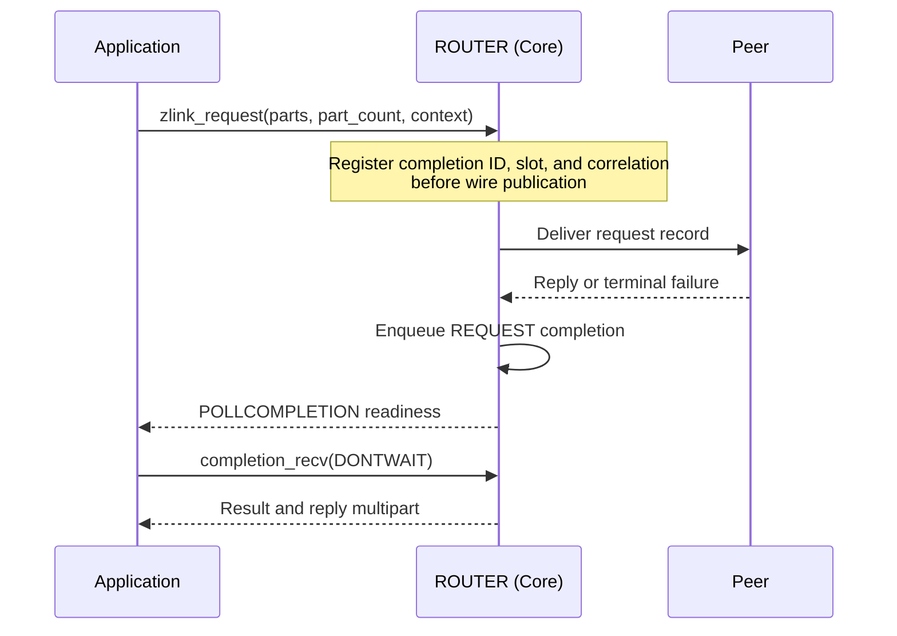

[한국어](07-router.ko.md) | English

<!-- zlink-nav:start -->
[Socket Index](README.en.md) | [Previous: DEALER](06-dealer.en.md) | [Next: STREAM](08-stream.en.md)
<!-- zlink-nav:end -->

# Socket — ROUTER

> **What this chapter defines** — The public contract for routing replies by routing ID on a
> ROUTER socket and for [result/errno](../03-errors.en.md#result-and-errno-mapping).

## 1. ROUTER overview

ROUTER is an asynchronous raw socket that manages connections (pipes) to multiple peers on one
[socket](../glossary.en.md#socket) and selects a send target by routing ID, the byte sequence that
identifies a peer. It processes ordinary directed messages and received request records. The
[Message](../02-message.en.md#zlink_routing_id_t) specification owns the contract for
`zlink_routing_id_t`, the type that carries a routing ID.

The following documents own the related contracts.

| Related contract | Defining document |
|---|---|
| Socket creation, common options, and the `zlink_socket_set_receive_flow_state` declaration | [Socket Common](README.en.md) |
| Routing ID type (`zlink_routing_id_t`) | [Message](../02-message.en.md#zlink_routing_id_t) |
| Request-reply kinds, sequences, and ZMP header byte layout and validation | [ZMP](../protocol/01-zmp.en.md) |
| Mapping of each result to errno and the receive flow state result table | [Errors](../03-errors.en.md) |
| Peer socket paired with ROUTER | [DEALER](06-dealer.en.md) |
| Socket status snapshot | [Monitoring](../06-monitoring.en.md) |

## 2. DATA and REQUEST receive

`zlink_router_recv()` distinguishes DATA from REQUEST by the source logical RID and reply
token.

| Record | `source_rid_out_` | `reply_token_out_` |
|---|---|---:|
| DATA multipart | Sending peer's logical RID | `0` |
| REQUEST | Sending peer's logical RID | Nonzero opaque token created by Core |

`zlink_router_recv()` returns one RID and token with the complete REQUEST record. The token is not
the wire request sequence, and the application does not interpret, create, or modify it. Submit a
reply only after REQUEST receive succeeds. Replies, timeouts, and terminal results
for requests submitted by ROUTER are returned as REQUEST completions, not through ordinary receive.

Parts are filled into a caller-provided `zlink_msg_t` array. When the capacity is smaller than the
record's part count, the record is not consumed, the needed count is written to `*part_count_out_`, and
`ZLINK_RECV_BUFFER_TOO_SMALL` (`errno == ENOBUFS`) is returned. Ownership, close, and capacity rules
are owned by [Socket Common](README.en.md#zlink_recv-and-zlink_router_recv).

The returned RID is a socket-owned borrowed view. It remains valid until entry to the next data-recv
API on the same socket or until socket close. Poller wait, completion recv, monitor recv, and data
recv on another socket do not invalidate it. A caller or binding that must retain it longer copies
it to an owned RID immediately after receive.

## 3. Whole-message ownership and record atomicity

A send API submits its `parts_` array and `part_count_` atomically as one record. Multiple threads
may submit independent records to the same socket; there is no per-thread sequence state.

The function consumes every input slot on both success and failure and leaves it as an initialized
zero-length message. If the call fails, the peer sees none of the record's parts. Retain the complete
record before the call if it may need to be sent again. A failed request submit returns ID `0` and
creates neither a completion nor a context echo. If a reply fails, the complete retained reply can
be resubmitted while the logical RID and token remain valid.

Receive output slots need not be initialized before the call. On success, ownership of the leading
`*part_count_out_` slots moves to the caller, which releases them exactly once with
`zlink_multipart_close()`. On failure, slot ownership does not move.

## 4. Public types

The following numbers are public ABI values.

```c
typedef enum zlink_router_option_t {
  ZLINK_ROUTER_OPT_MANDATORY          = 0x3101,  // int, 0=off, positive=on, getter returns 0/1, default 1. Whether directed submit to an unconnected routing ID fails
  ZLINK_ROUTER_OPT_PROBE              = 0x3103,  // int, 0=off, positive=on, getter returns 0/1, default 0. An empty raw message lets the peer observe the connection and routing ID when the connection is established
  ZLINK_ROUTER_OPT_CONNECT_ROUTING_ID = 0x3104,  // Variable-length byte string, set only. Local alias for the next zlink_connect() pipe
  ZLINK_ROUTER_OPT_REQUEST_TIMEOUT_MS = 0x3105,  // Nonnegative int (milliseconds), default 5000. Default timeout when a request uses timeout_ms_ == 0
  ZLINK_ROUTER_OPT_WEIGHT             = 0x3106   // int, 0..10000, default 100. This ROUTER's weight advertised to connected peers
} zlink_router_option_t;

typedef uint64_t zlink_reply_token_t;  // DATA is 0; REQUEST is a nonzero opaque capability
```

## 5. ROUTER options

```c
ZLINK_EXPORT zlink_config_result_t zlink_set_router_option(
  void *handle_,
  zlink_router_option_t option_,
  const void *optval_,
  size_t optvallen_);

ZLINK_EXPORT zlink_config_result_t zlink_get_router_option(
  void *handle_,
  zlink_router_option_t option_,
  void *optval_,
  size_t *optvallen_);
```

The inline comments in [section 4](#4-public-types) define the value format, range, and default for
each option. The following contracts are not included in those comments.

- `ZLINK_ROUTER_OPT_MANDATORY` applies to ordinary directed sends to a RID with no route.
  A positive value (the default) returns `ZLINK_SUBMIT_NOT_CONNECTED` with `EHOSTUNREACH`, ID `0`,
  and no wait token. At `0`, Core drops the record and returns `ZLINK_SUBMIT_OK`, ID `0`.
  Typed requests follow the route-less result in [Request and reply](README.en.md#request-and-reply)
  regardless of this option.
- `ZLINK_ROUTER_OPT_PROBE` can be set and read with `zlink_set_router_option()` and
  `zlink_get_router_option()` on a DEALER handle as well as on a ROUTER handle. Passing any other
  `zlink_router_option_t` value to a DEALER handle returns `ZLINK_CONFIG_INVALID_ARGUMENT` with `EINVAL`.
- `ZLINK_ROUTER_OPT_CONNECT_ROUTING_ID` sets the local alias that identifies the pipe created by
  the next `zlink_connect()` and is set before each connect.

When `zlink_get_router_option()` is called, `*optvallen_` is the input capacity of `optval_`. On
success, it is updated to the number of bytes written. [HWM](../glossary.en.md#hwm), the byte limit
for queue storage, and reconnect and timeout options that are not ROUTER-specific use
`zlink_set_option()` and `zlink_get_option()`.

`ZLINK_ROUTER_OPT_WEIGHT` is the absolute value that a peer uses when selecting this ROUTER as an
outbound candidate. ROUTER and DEALER advertise their own values independently, so each direction
uses the value advertised by the other socket.

The public weight result follows this order.

1. A value set before bind or connect applies after the paired Application pipe becomes ready.
2. A dynamic change applies the new absolute value, including `0`, to the peer scheduler.
3. An actual change emits `PEER_WEIGHT_CHANGED` with the value and the Application pipe's lane and
   connection ID. Repeating the same value emits no additional event.
4. Reconnect applies the current configured value to the new connection.

The network wire, inproc delivery, CONTROL size boundary, record-boundary application, and the lifetime and
stale-delivery ownership of that selected pipe are defined by the
[ZMP request-reply lane](../protocol/01-zmp.en.md#41-request-reply-lane),
[decode](../protocol/01-zmp.en.md#7-decode-validation), and
[peer-weight owner](../protocol/01-zmp.en.md#peer-weight-control) contracts. Neither transport path
creates a weight record on public receive or the Completion lane.

If the applied value becomes `0` after a record has selected a pipe, that record is delivered on the
same pipe. The next record selection excludes it.

An actual remote-weight change re-evaluates a DONTWAIT send or request that holds a wait token. A
wait token does not end when the weight becomes `0`. A change from `0` to a positive value publishes
a `ZLINK_COMPLETION_WRITABLE` record for that RID's SEND or REQUEST wait token.

An active duplicate keeps its own latest value while standby and uses it if that same pipe is
selected later. Setting the Application maximum below 10 bytes does not prevent pair readiness,
FLOWSTATE, or WEIGHT delivery; malformed CONTROL behavior remains owned by ZMP.

## 6. Directed raw send

```c
ZLINK_EXPORT zlink_submit_result_t zlink_send_rid (
  void *s_, const zlink_routing_id_t *target_rid_,
  zlink_msg_t *parts_, size_t part_count_, zlink_send_flags_t flags_,
  void *user_context_, zlink_completion_id_t *completion_id_out_);
```

This sends one complete ordinary raw record to the peer identified by `target_rid_`.
[§5](#5-router-options) defines the scope and result of mandatory for a RID without a route.
[whole-message send](README.en.md#whole-message-send-and-pending-admission) defines all other submit
results, tokens, and ownership.

## 7. Raw request submit

```c
ZLINK_EXPORT zlink_submit_result_t zlink_request (
  void *s_, const zlink_routing_id_t *target_router_rid_or_null_,
  zlink_msg_t *parts_, size_t part_count_, zlink_send_flags_t flags_,
  uint32_t timeout_ms_, void *user_context_,
  zlink_completion_id_t *completion_id_out_);
```

`target_router_rid_or_null_` must be the non-NULL logical RID of a target ROUTER. A DEALER RID
returns `ZLINK_SUBMIT_NOT_ADMITTED` with `EPROTOTYPE`; DATA send to the same RID remains allowed.
A RID absent from the routing map follows [Socket Common request](README.en.md#request-and-reply).

REQUEST input, ID, reservation, timeout, completion, and WRITABLE resubmission results follow [Socket Common Request and reply](README.en.md#request-and-reply). This ROUTER’s wait token targets the specified logical RID.



The diagram shows a successful submit. A failed submit follows the ownership rules in
[section 3](#3-whole-message-ownership-and-record-atomicity) and creates no completion.

## 8. Raw request and message receive

```c
ZLINK_EXPORT zlink_recv_result_t zlink_router_recv (
  void *router_,
  const zlink_routing_id_t **source_rid_out_,
  zlink_reply_token_t *reply_token_out_,
  zlink_msg_t *parts_out_,
  size_t parts_capacity_,
  size_t *part_count_out_,
  zlink_recv_flags_t flags_);
```

This returns every part of one complete DATA or REQUEST record in the array. Every output pointer is required. `flags_` is
`ZLINK_RECV_FLAGS_NONE` or `ZLINK_RECV_FLAGS_DONTWAIT`. A non-blocking call with no record available
returns `ZLINK_RECV_NO_DATA` and `EAGAIN`.

When `parts_capacity_` is smaller than the record's part count, the call does not consume the record,
writes the needed count to `*part_count_out_`, and returns `ZLINK_RECV_BUFFER_TOO_SMALL` with
`ENOBUFS`. Retrying with a large enough array returns the same record (except a record of a pipe that left the selection — [§10.1](#101-observing-the-selected-route)). Use the output combinations in
[section 2](#2-data-and-request-receive) to determine whether a reply is required. The returned
payload contains no internal request metadata.

Output ownership, `NONE` `RCVTIMEO`, output invariance, and the socket-owned borrowed RID
lifetime follow the data-recv contract in [Socket Common](README.en.md#zlink_recv-and-zlink_router_recv).

## 9. Raw reply submit

```c
ZLINK_EXPORT zlink_submit_result_t zlink_reply (
  void *router_, const zlink_routing_id_t *source_rid_,
  zlink_reply_token_t reply_token_, zlink_msg_t *parts_, size_t part_count_);
```

Use the source RID and nonzero opaque reply token returned by `zlink_router_recv()` unchanged.
The wire request sequence is internal Core metadata and is not guaranteed to equal the reply token.
Every call consumes all input slots, regardless of result, and leaves them empty and initialized.
`part_count_` must be positive.

The call validates the RID, token, and REQUEST-complete state and atomically checks out the token.
A failed reply submission releases token checkout. A concurrent reply call using the same token returns `ZLINK_SUBMIT_INVALID_STATE` with `EBUSY`, consumes that call’s input slots, and leaves the existing checkout in place. Reply route selection, admission results, token lifetime, and input consumption follow [Socket Common Request and reply](README.en.md#request-and-reply).

Token IDs increase monotonically on the responder socket and are not reused before close. If Core cannot produce the next nonzero ID, it does not enqueue the new REQUEST; it completes the requester with `ZLINK_REQUEST_INTERNAL_ERROR` through an internal error reply and creates no token or slot. Live-token registry admission and resumption follow [Socket Common Request and reply](README.en.md#request-and-reply).

A non-empty group on the first request or reply part returns `ZLINK_SUBMIT_INVALID_ARGUMENT` with `EINVAL`. The call consumes every input slot and delivers no part to the peer. A failed request creates no completion; a failed reply may resubmit a complete record without a group using the same source RID and token.

## 10. Results and readiness

Submit APIs return `zlink_submit_result_t`, receive APIs return `zlink_recv_result_t`, and option
APIs return `zlink_config_result_t`. The [errno map](../03-errors.en.md#result-and-errno-mapping)
defines the mapping between each result and `zlink_errno()`.

ROUTER `ZLINK_POLLIN` means that the application queue contains an admitted DATA or REQUEST record,
or that a complete REQUEST can reserve a token slot. It is not ready when every readable head is a
token-blocked REQUEST. For ordinary sends and
requests, `ZLINK_POLLOUT` indicates that retrying a submit after
[backpressure](../glossary.en.md#backpressure), the state in which additional submissions are
limited because the receiver cannot keep up, is worthwhile. It does not guarantee that the next
submit succeeds. While an unread `ZLINK_COMPLETION_WRITABLE` record exists, `ZLINK_POLLOUT` and
`ZLINK_POLLCOMPLETION` are level-held, and the precise per-RID signal is that record's token and
`peer_rid`. Results of SEND and REQUEST operations retained by Core are received through
`ZLINK_POLLCOMPLETION` and `zlink_completion_recv()`. Reply submit creates no completion.

### 10.1 Observing the selected route

More than one transport pipe can exist for the same RID — a reconnect in the same direction and a
standby in the opposite direction ([routing ID duplicate policy](README.en.md#routing-id-duplicate-policy)).
Core selects one application route per RID, and the application observes that choice only through
the following snapshot.

```c
typedef struct zlink_router_route_t {
  zlink_routing_id_t rid;
  uint64_t route_generation; /* nonzero opaque value; compare for equality only */
} zlink_router_route_t;

ZLINK_EXPORT zlink_config_result_t zlink_router_routes_snapshot(
  void *router_,
  zlink_router_route_t *routes_out_,
  size_t capacity_,
  size_t *route_count_out_);

ZLINK_EXPORT uint64_t zlink_router_recv_route_generation(void *router_);
```

- **The snapshot returns every selected route atomically.** It has one row per RID and contains only
  selected routes whose admission has completed. An RID with no row has no selected route.
- **`route_generation` takes a new value whenever the selection for the same RID changes.** It changes
  when a new pipe takes over the existing one by handover, or when the selected pipe ends and a
  standby is promoted. The caller does not interpret the size or order of the value.
- **`ZLINK_POLLROUTE` becomes ready when a selected route changes** ([Polling §6](../05-polling.en.md#6-public-types)).
  The readiness is level-triggered and is cleared when a snapshot that reflects every later change
  succeeds. If a change races with the snapshot, the readiness remains. Monitor events are transport
  observations, not the result of the route selection. `ZLINK_EVENT_CONNECTION_READY` on a standby
  pipe does not mean that the selected route is ready.
- **Once another pipe becomes selected, records from the pipe that left the selection are not returned.**
  In this document a pipe leaves the selection when another pipe becomes selected for the same RID. Core
  then discards the pending DATA and REQUEST records of the replaced pipe and of standby pipes as whole
  records, so `ZLINK_POLLIN` reflects only records of the selected route and of a selected pipe that ended
  with no successor selection. When the selected pipe ends with no successor selection, the RID's
  snapshot row disappears but that pipe's pending records are not discarded and remain receivable; they
  are discarded by the rule above when another pipe later becomes selected for that RID. A record held
  back because the buffer was too small is not returned on retry if its pipe left the selection in the
  meantime — the only exception to
  [receiving the same record again](README.en.md#zlink_recv-and-zlink_router_recv). No reply token is
  issued for a discarded REQUEST. Both Cores reach the same selection under the
  [routing ID duplicate policy](README.en.md#routing-id-duplicate-policy), so when the requester's Core
  moves that pair out of the selection it completes the request once with `ZLINK_REQUEST_NOT_CONNECTED`
  as the [completion table](README.en.md#completion-pull-and-ownership) defines.
- **`zlink_router_recv_route_generation()` returns the route generation of the record returned by the
  last successful `zlink_router_recv()`.** It has the same lifetime as the returned RID (until the next
  data recv on the same socket). It is `0` if the next data recv failed or there was no successful
  receive. If the RID has no selected-route row, the record
  was left by a pipe that ended with no successor selection and was not discarded by a selection change;
  the reply result for such a REQUEST follows [§9](#9-raw-reply-submit).
- **Keep one route observer per socket.** The same observer calls the snapshot and handles
  `ZLINK_POLLROUTE`. If two threads call the snapshot at the same time, the success of one can clear
  the readiness.
- If `capacity_` is smaller than the number of selected routes, the call writes the required number
  to `*route_count_out_`, returns `ZLINK_CONFIG_BUFFER_TOO_SMALL`, and does not clear the readiness. On
  success it writes the number of rows to `*route_count_out_`. A handle that is not a ROUTER returns
  `ZLINK_CONFIG_NOT_SUPPORTED`.

## 11. Receive flow state

A ROUTER connected to a DEALER or ROUTER peer can ask those peers to stop and resume sending to it.
`zlink_socket_set_receive_flow_state()` stores one socket-wide state.
[Socket Common](README.en.md) owns the function declaration, and [Errors](../03-errors.en.md) owns
the result table.

The state belongs to the socket, not to a routing ID. There is no per-peer flow-state call. One call
sends the state to every ready peer of this ROUTER, so every peer receives the same state. Core uses
the single Application connection's Core control path for a DEALER peer and the Completion connection
for a ROUTER peer. A peer that becomes ready later also receives the socket's current state over the
path selected for its type. A routing ID selects the destination of a send; it does not select a
receive-flow state.

The state is an absolute value, not a counter. Setting the current state again succeeds and sends
nothing.

A flow-state frame carries a flow epoch scoped to the connection on which the frame was written.
There is no public pair-ID or generation field and no `Zlink-Pair-Id` or
`Zlink-Pair-Generation` wire property. Using internal connection identity, Core applies the frame
only to the connection on which it was written. A frame whose identity does not match, including a
frame from a replaced connection, is consumed internally without a public event and increments only
the `flow_state_stale_total` counter. A duplicate or regressing epoch on the same connection is not
applied and is reported as `ZLINK_EVENT_FLOW_STATE_STALE` with
`ZLINK_MONITOR_EVENT_FLAG_FLOW_STATE_STALE_EPOCH`. A routing ID can remain stable across a reconnect,
but state published by a peer before a reconnect is never applied to the replacement connection. A
new connection starts from the state that the socket sends when the pair becomes ready.

A remote PAUSE blocks only sends to the paused peer and does not affect routes to other peers. It is
an independent blocker composed with byte HWM, transport waits, and termination, so clearing it
does not by itself admit the next send. Send results and readiness remain unchanged. A blocked
non-blocking send continues to report `ZLINK_SUBMIT_BACKPRESSURED` with `errno == EAGAIN`, and
mandatory routing retains the behavior defined in [section 6](#6-directed-raw-send).

A remote PAUSE applies from the next message boundary and does not split a multipart record. A
record that has already been admitted is delivered completely before the pause takes effect.

The [Monitoring](../06-monitoring.en.md) status snapshot reports the current number of paused peers
together with the applied-transition count, stale count, and pause duration for the whole socket.

## 12. Implementation and contract test verification requirements

The following behaviors are verified using only the public surface: ROUTER send, request, receive,
reply, and completion-pull functions; ROUTER option set and get; return values and errno; and event
and status snapshots. Each item maps to one test.

**Options**
- When `zlink_get_router_option()` is called, `*optvallen_` is the input capacity, and on success it is updated to the number of bytes written.
- Each option's default value is returned: `MANDATORY` `1`, `PROBE` `0`, `REQUEST_TIMEOUT_MS` `5000`, and `WEIGHT` `100`.
- When `ZLINK_ROUTER_OPT_MANDATORY` is positive, a directed submit to a routing ID without a connected pipe fails with `ZLINK_SUBMIT_NOT_CONNECTED`, and the getter returns `0` or `1`.
- When `ZLINK_ROUTER_OPT_PROBE` is positive, an empty raw message is sent when a connection is established so that the peer can observe the connection and routing ID, and the getter returns `0` or `1`.
- Setting `ZLINK_ROUTER_OPT_CONNECT_ROUTING_ID` before connect identifies the pipe created by the next `zlink_connect()` by that local alias.

**Peer-weight delivery**

- If different weights are configured on a ROUTER and its peer before bind or connect, each
  scheduler uses the peer's exact value after the logical route becomes ready, and a peer with value `0` is
  excluded from outbound candidates.
- Dynamically changing both weights after a network or inproc connection is ready produces
  `PEER_WEIGHT_CHANGED` with the new weight in `value`; the Application lane and diagnostic
  `connection_id` identify the connection to which the value was applied.
- Setting or synchronizing weight adds no application record to public receive or the Completion
  lane, and setting the same value again produces no duplicate monitor event.
- Changing weight more than once while an Application record is being admitted preserves the
  peer-visible multipart as one atomic record, and only the latest value affects the next record.
- If a pipe's remote weight becomes `0` after an Application record is admitted, the same pipe
  carries the complete record and is excluded starting with the next message selection.
- A remote-weight change re-evaluates a DONTWAIT SEND or REQUEST holding a wait token for the same
  logical RID. The wait token does not end when the weight becomes `0`; a change from `0` to a
  positive value publishes a WRITABLE record for that RID's SEND or REQUEST wait token.
- Setting an Application maximum below 10 bytes does not prevent pair readiness, FLOWSTATE, or
  weight changes observed through peer selection and monitoring.
- After reconnect, peer selection and monitoring reflect the current weight on the new connection.
  Promoting an active standby uses the value that standby most recently received.

**Record classification and receive**
- A DATA record returns reply token `0`; a received REQUEST returns a nonzero opaque reply token. Equality between the token and wire sequence is not a contract.
- One successful `zlink_router_recv()` returns every part of a multipart record with one source
  routing ID and reply token.
- Replies and terminal failures for a request started with `zlink_request()` are returned as `ZLINK_COMPLETION_REQUEST`, not as data receive records.
- A non-blocking receive with no record available returns `ZLINK_RECV_NO_DATA` and `EAGAIN`.
- On successful receive, ownership of the leading `*part_count_out_` slots moves to the caller,
  which releases them with `zlink_multipart_close()`; on failure, ownership does not move.
- If `parts_capacity_` is too small, the call returns the needed count and
  `ZLINK_RECV_BUFFER_TOO_SMALL` with `ENOBUFS` without consuming the record. A retry with a large
  enough array returns the same record (except a record of a pipe that left the selection — [§10.1](#101-observing-the-selected-route)).
- After a DEALER sends three records and closes, the ROUTER receives all three; once another pipe becomes selected for that RID, the ended pipe's remaining records are not received.
- A reply or error reply received through `zlink_router_recv()` returns no payload and terminates the connection with `EPROTO`.
- Raw-sending a DATA or REQUEST payload returned by `zlink_router_recv()` does not restore request-reply semantics.
- Passing a ROUTER to the common `zlink_recv()` surface is rejected as unsupported.
- When different physical sources with the same RID send REQUEST records carrying the same live wire sequence, ROUTER returns distinct opaque reply tokens. Reverse or out-of-order replies complete only the request identified by each token.
- If the same physical source reuses a live wire sequence, ROUTER terminates that connection with `EPROTO` and does not deliver the duplicate REQUEST to application receive.

**Whole-message send, request, and reply**
- Input consumption and SEND wait-token verification refer to [Socket Common whole-message send](README.en.md#whole-message-send-and-pending-admission).
- REQUEST admission and completion and reply routing and token verification refer to [Socket Common Request and reply](README.en.md#request-and-reply). ROUTER first-part group rejection and token-checkout concurrency refer to [§9 Raw reply submit](#9-raw-reply-submit).

**Readiness**
- `ZLINK_POLLIN` is set when a complete raw record can be received. `ZLINK_POLLOUT` indicates only
  that retry after backpressure is worthwhile and does not guarantee that the next submit succeeds.
- `ZLINK_POLLOUT` indicates only that a retry after backpressure is worthwhile and does not guarantee that the next submit succeeds.
- While an unread `ZLINK_COMPLETION_WRITABLE` record exists, `ZLINK_POLLOUT` and `ZLINK_POLLCOMPLETION` are level-held, and draining through `NO_DATA` clears them.

**Receive flow state**
- Setting the current state again succeeds and sends nothing.
- One call gives every ready peer the same state. It uses the Application connection for a DEALER
  peer and the Completion connection for a ROUTER peer, and a peer that becomes ready later also
  receives the socket's current state.
- A flow-state frame contains only the flow epoch scoped to the connection on which it was written. There is no public pair-ID or generation field and no `Zlink-Pair-Id` or `Zlink-Pair-Generation` wire property. Core applies the frame only to that connection by using internal connection identity.
- A frame whose identity does not match, including a frame from a replaced connection, is consumed internally without a public event and increments only `flow_state_stale_total`. A duplicate or regressing epoch on the same connection is not applied and is reported as `ZLINK_EVENT_FLOW_STATE_STALE` with `ZLINK_MONITOR_EVENT_FLAG_FLOW_STATE_STALE_EPOCH`.
- State published by a peer before a reconnect is not applied to the replacement connection.
- A remote PAUSE blocks only sends to the paused peer: routes to other peers are unaffected, a blocked non-blocking send reports `ZLINK_SUBMIT_BACKPRESSURED` with `errno == EAGAIN`, and clearing PAUSE alone does not admit the next send.
- A remote PAUSE applies from the next message boundary: an admitted record is delivered completely before the pause takes effect.
- The [Monitoring](../06-monitoring.en.md) status snapshot provides the current number of paused peers, the socket-wide applied-transition count, stale count, and pause duration.

<!-- zlink-nav:start -->
[Socket Index](README.en.md) | [Previous: DEALER](06-dealer.en.md) | [Next: STREAM](08-stream.en.md)
<!-- zlink-nav:end -->
