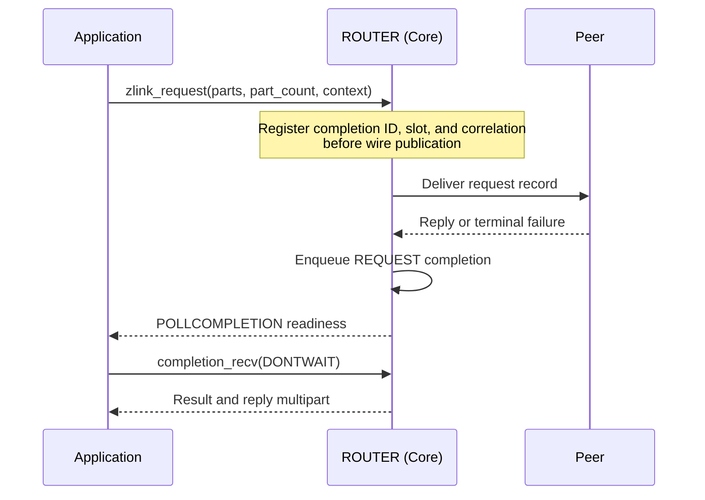

[한국어](https://zlink-systems.github.io/zlink/ko/spec/core/socket/07-router/) | English

<!-- zlink-nav:start -->
[Socket Index](README.en.md) | [Previous: DEALER](06-dealer.en.md) | [Next: STREAM](08-stream.en.md)
<!-- zlink-nav:end -->

# Socket — ROUTER

> **What this chapter defines** — The public contract for routing replies by routing ID on a
> ROUTER socket and for [result/errno](../03-errors.en.md#result-and-errno-mapping).

## 1. ROUTER overview

ROUTER is an asynchronous raw socket that manages connections (pipes) to multiple peers on one
[socket](../glossary.en.md#socket) and selects a send target by routing ID, the byte sequence that
identifies a peer. It processes ordinary directed messages and received request records. The
[Message](../02-message.en.md#zlink_routing_id_t) specification owns the contract for
`zlink_routing_id_t`, the type that carries a routing ID.

The following documents own the related contracts.

| Related contract | Defining document |
|---|---|
| Socket creation, common options, and the `zlink_socket_set_receive_flow_state` declaration | [Socket Common](README.en.md) |
| Routing ID type (`zlink_routing_id_t`) | [Message](../02-message.en.md#zlink_routing_id_t) |
| Request-reply kinds, sequences, and ZMP header byte layout and validation | [ZMP](../protocol/01-zmp.en.md) |
| Mapping of each result to errno and the receive flow state result table | [Errors](../03-errors.en.md) |
| Peer socket paired with ROUTER | [DEALER](06-dealer.en.md) |
| Socket status snapshot | [Monitoring](../06-monitoring.en.md) |

## 2. DATA and REQUEST receive

`zlink_router_recv()` distinguishes DATA from REQUEST by the source logical RID and reply
token.

| Record | `source_rid_out_` | `reply_token_out_` |
|---|---|---:|
| DATA multipart | Sending peer's logical RID | `0` |
| REQUEST | Sending peer's logical RID | Nonzero opaque token created by Core |

`zlink_router_recv()` returns one RID and token with the complete REQUEST record. The token is not
the wire request sequence, and the application does not interpret, create, or modify it. Submit a
reply only after REQUEST receive succeeds. Replies, timeouts, and terminal results
for requests submitted by ROUTER are returned as REQUEST completions, not through ordinary receive.

Parts are filled into a caller-provided `zlink_msg_t` array. When the capacity is smaller than the
record's part count, the record is not consumed, the needed count is written to `*part_count_out_`, and
`ZLINK_RECV_BUFFER_TOO_SMALL` (`errno == ENOBUFS`) is returned. Ownership, close, and capacity rules
are owned by [Socket Common](README.en.md#zlink_recv-and-zlink_router_recv).

The returned RID is a socket-owned borrowed view. It remains valid until entry to the next data-recv
API on the same socket or until socket close. Poller wait, completion recv, monitor recv, and data
recv on another socket do not invalidate it. A caller or binding that must retain it longer copies
it to an owned RID immediately after receive.

## 3. Whole-message ownership and record atomicity

A send API submits its `parts_` array and `part_count_` atomically as one record. Multiple threads
may submit independent records to the same socket; there is no per-thread sequence state.

The function consumes every input slot on both success and failure and leaves it as an initialized
zero-length message. If the call fails, the peer sees none of the record's parts. Retain the complete
record before the call if it may need to be sent again. A failed request submit returns ID `0` and
creates neither a completion nor a context echo. If a reply fails, the complete retained reply can
be resubmitted while the logical RID and token remain valid.

Receive output slots need not be initialized before the call. On success, ownership of the leading
`*part_count_out_` slots moves to the caller, which releases them exactly once with
`zlink_multipart_close()`. On failure, slot ownership does not move.

## 4. Public types

The following numbers are public ABI values.

```c
typedef enum zlink_router_option_t {
  ZLINK_ROUTER_OPT_MANDATORY          = 0x3101,  // int, 0=off, positive=on, getter returns 0/1, default 1. Whether directed submit to an unconnected routing ID fails
  ZLINK_ROUTER_OPT_PROBE              = 0x3103,  // int, 0=off, positive=on, getter returns 0/1, default 0. An empty raw message lets the peer observe the connection and routing ID when the connection is established
  ZLINK_ROUTER_OPT_CONNECT_ROUTING_ID = 0x3104,  // Variable-length byte string, set only. Local alias for the next zlink_connect() pipe
  ZLINK_ROUTER_OPT_REQUEST_TIMEOUT_MS = 0x3105,  // Nonnegative int (milliseconds), default 5000. Default timeout when a request uses timeout_ms_ == 0
  ZLINK_ROUTER_OPT_WEIGHT             = 0x3106   // int, 0..10000, default 100. This ROUTER's weight advertised to connected peers
} zlink_router_option_t;

typedef uint64_t zlink_reply_token_t;  // DATA is 0; REQUEST is a nonzero opaque capability
```

## 5. ROUTER options

```c
ZLINK_EXPORT zlink_config_result_t zlink_set_router_option(
  void *handle_,
  zlink_router_option_t option_,
  const void *optval_,
  size_t optvallen_);

ZLINK_EXPORT zlink_config_result_t zlink_get_router_option(
  void *handle_,
  zlink_router_option_t option_,
  void *optval_,
  size_t *optvallen_);
```

The inline comments in [section 4](#4-public-types) define the value format, range, and default for
each option. The following contracts are not included in those comments.

- When `ZLINK_ROUTER_OPT_MANDATORY` is positive, a directed submit to a routing ID without a
  connected pipe fails with `ZLINK_SUBMIT_NOT_CONNECTED`. A `DONTWAIT` call to a routing ID with
  no route at all then returns `ZLINK_SUBMIT_NOT_CONNECTED` immediately and creates no wait token.
  With the option at `0` the record is silently dropped (`ZLINK_SUBMIT_OK`, ID `0`).
- `ZLINK_ROUTER_OPT_PROBE` can be set and read with `zlink_set_router_option()` and
  `zlink_get_router_option()` on a DEALER handle as well as on a ROUTER handle. Passing any other
  `zlink_router_option_t` value to a DEALER handle returns `ZLINK_CONFIG_INVALID_ARGUMENT` with `EINVAL`.
- `ZLINK_ROUTER_OPT_CONNECT_ROUTING_ID` sets the local alias that identifies the pipe created by
  the next `zlink_connect()` and is set before each connect.

When `zlink_get_router_option()` is called, `*optvallen_` is the input capacity of `optval_`. On
success, it is updated to the number of bytes written. [HWM](../glossary.en.md#hwm), the byte limit
for queue storage, and reconnect and timeout options that are not ROUTER-specific use
`zlink_set_option()` and `zlink_get_option()`.

`ZLINK_ROUTER_OPT_WEIGHT` is the absolute value that a peer uses when selecting this ROUTER as an
outbound candidate. ROUTER and DEALER advertise their own values independently, so each direction
uses the value advertised by the other socket.

The public weight result follows this order.

1. A value set before bind or connect applies after the paired Application pipe becomes ready.
2. A dynamic change applies the new absolute value, including `0`, to the peer scheduler.
3. An actual change emits `PEER_WEIGHT_CHANGED` with the value and the Application pipe's lane and
   connection ID. Repeating the same value emits no additional event.
4. Reconnect applies the current configured value to the new connection.

The network wire, inproc delivery, CONTROL size boundary, record-boundary application, and the lifetime and
stale-delivery ownership of that selected pipe are defined by the
[ZMP request-reply lane](../protocol/01-zmp.en.md#41-request-reply-lane),
[decode](../protocol/01-zmp.en.md#7-decode-validation), and
[peer-weight owner](../protocol/01-zmp.en.md#peer-weight-control) contracts. Neither transport path
creates a weight record on public receive or the Completion lane.

If the applied value becomes `0` after a record has selected a pipe, that record is delivered on the
same pipe. The next record selection excludes it.

An actual remote-weight change re-evaluates a DONTWAIT send or request that holds a wait token. A
wait token does not end when the weight becomes `0`. A change from `0` to a positive value publishes
a `ZLINK_COMPLETION_WRITABLE` record for that RID's SEND or REQUEST wait token.

An active duplicate keeps its own latest value while standby and uses it if that same pipe is
selected later. Setting the Application maximum below 10 bytes does not prevent pair readiness,
FLOWSTATE, or WEIGHT delivery; malformed CONTROL behavior remains owned by ZMP.

## 6. Directed raw send

```c
ZLINK_EXPORT zlink_submit_result_t zlink_send_rid (
  void *s_, const zlink_routing_id_t *target_rid_,
  zlink_msg_t *parts_, size_t part_count_, zlink_send_flags_t flags_,
  void *user_context_, zlink_completion_id_t *completion_id_out_);
```

This sends one complete ordinary raw record to the peer identified by `target_rid_`.
`part_count_` must be positive. `flags_` is `ZLINK_SEND_FLAGS_NONE` or
`ZLINK_SEND_FLAGS_DONTWAIT`. `NONE` snapshots `SNDTIMEO`, waits for admission and reconnect of the
same logical RID, and finishes with ID `0`. A `DONTWAIT` call makes exactly one admission attempt. If admission is immediate, it has
ID `0` and no completion. If HWM or byte credit prevents admission, or a route exists but is not
ready yet (transport pair not ready, weight `0`), it returns `ZLINK_SUBMIT_BACKPRESSURED` with
`EAGAIN` and a nonzero wait token bound to that RID, and Core does not retain the payload. If
`target_rid_` has no route at all, the result is `ZLINK_SUBMIT_NOT_CONNECTED` immediately with no
token while `ZLINK_ROUTER_OPT_MANDATORY` is positive (the default; with it at `0` the record is
silently dropped with ID `0` as before). When the same RID gains write credit (peer
drain, reconnect, route adoption, standby promotion, or weight `0` to positive), Core produces
exactly one `ZLINK_COMPLETION_WRITABLE` record for that token with
`send_result == ZLINK_SEND_ADMITTED` and `peer_rid` set to the submitted RID. Credit on another
RID does not wake this token. The caller resubmits its retained record to the same RID with
`DONTWAIT`. Explicitly removing that RID with `zlink_disconnect_rid()` ends the token with a
WRITABLE record carrying `ZLINK_SEND_TERMINAL` and `ENOENT`; socket close or context termination
ends it internally and delivers no record. After ID `0`, Core does not replay the
payload. [Socket Common](README.en.md#whole-message-send-and-pending-admission) owns ownership and the exact
result and errno contract.

## 7. Raw request submit

```c
ZLINK_EXPORT zlink_submit_result_t zlink_request (
  void *s_, const zlink_routing_id_t *target_router_rid_or_null_,
  zlink_msg_t *parts_, size_t part_count_, zlink_send_flags_t flags_,
  uint32_t timeout_ms_, void *user_context_,
  zlink_completion_id_t *completion_id_out_);
```

`target_router_rid_or_null_` must be the non-NULL logical RID of a target ROUTER. A DEALER RID
returns `ZLINK_SUBMIT_NOT_ADMITTED` with `EPROTOTYPE`; DATA send to the same RID remains allowed.
For an RID absent from the routing map, `NONE` returns `ZLINK_SUBMIT_NOT_FOUND` with `ENOENT` and
`DONTWAIT` returns `ZLINK_SUBMIT_NOT_CONNECTED` with `EHOSTUNREACH` without creating a wait token.

`part_count_` must be positive. The optional ID output is set to `0` before other validation; an
admitted request returns a nonzero REQUEST ID. Before publishing the
request on the wire, Core reserves an ID and one of the shared SEND and REQUEST completion slots.
Slot exhaustion immediately returns `ZLINK_SUBMIT_BACKPRESSURED` with `EAGAIN`, ID `0`, and no
completion, regardless of flags.

`NONE` uses a temporary reservation and waits within `SNDTIMEO` for same-RID local admission.
A pre-admission failure releases the reservation and ends synchronously with ID `0` and no
completion.

`DONTWAIT` makes one same-RID admission attempt; there is no state in which Core owns the
record before admission. Immediate admission returns a nonzero REQUEST ID. Backpressure from HWM,
byte credit, or flow pause, or a route for the RID that exists but is not ready yet (transport pair
not ready, weight `0`), returns `ZLINK_SUBMIT_BACKPRESSURED` with `EAGAIN` and a nonzero wait token
whose target is that RID; Core retains no request payload. When that RID has write credit again,
exactly one `ZLINK_COMPLETION_WRITABLE` record with the same token, context, and `peer_rid` follows,
and the caller resubmits the same request. Credit on another RID does not publish this token. A
RID with no mandatory route returns `ZLINK_SUBMIT_NOT_CONNECTED` with `EHOSTUNREACH`, ID `0`, and
no token.

`timeout_ms_ == 0` snapshots the `ZLINK_ROUTER_OPT_REQUEST_TIMEOUT_MS` value, whose default is
5,000 ms. The reply timeout starts at outbound local admission, that is, when `ZLINK_SUBMIT_OK` is
returned, and does not start while a wait token is outstanding. When the submit-time transport pair
terminates after admission, the request ends at once with `ZLINK_REQUEST_NOT_CONNECTED` per the
[Socket Common §6 completion table](README.en.md#request-and-reply), and the payload is not replayed.
Exactly one of reply, timeout, and terminal creates the REQUEST completion.



The diagram shows a successful submit. A failed submit follows the ownership rules in
[section 3](#3-whole-message-ownership-and-record-atomicity) and creates no completion.

## 8. Raw request and message receive

```c
ZLINK_EXPORT zlink_recv_result_t zlink_router_recv (
  void *router_,
  const zlink_routing_id_t **source_rid_out_,
  zlink_reply_token_t *reply_token_out_,
  zlink_msg_t *parts_out_,
  size_t parts_capacity_,
  size_t *part_count_out_,
  zlink_recv_flags_t flags_);
```

This returns every part of one complete DATA or REQUEST record in the array. Every output pointer is required. `flags_` is
`ZLINK_RECV_FLAGS_NONE` or `ZLINK_RECV_FLAGS_DONTWAIT`. A non-blocking call with no record available
returns `ZLINK_RECV_NO_DATA` and `EAGAIN`.

When `parts_capacity_` is smaller than the record's part count, the call does not consume the record,
writes the needed count to `*part_count_out_`, and returns `ZLINK_RECV_BUFFER_TOO_SMALL` with
`ENOBUFS`. Retrying with a large enough array returns the same record. Use the output combinations in
[section 2](#2-data-and-request-receive) to determine whether a reply is required. The returned
payload contains no internal request metadata.

Output ownership, `NONE` `RCVTIMEO`, output invariance, and the socket-owned borrowed RID
lifetime follow the data-recv contract in [Socket Common](README.en.md#zlink_recv).

## 9. Raw reply submit

```c
ZLINK_EXPORT zlink_submit_result_t zlink_reply (
  void *router_, const zlink_routing_id_t *source_rid_,
  zlink_reply_token_t reply_token_, zlink_msg_t *parts_, size_t part_count_);
```

Use the source RID and nonzero opaque reply token returned by `zlink_router_recv()` unchanged.
The wire request sequence is internal Core metadata and is not guaranteed to equal the reply token.
Every call consumes all input slots, regardless of result, and leaves them empty and initialized.
`part_count_` must be positive.

The call validates the RID, token, and REQUEST-complete state and atomically checks out the token.
It snapshots `ZLINK_OPT_SNDTIMEO` on entry and waits for local admission
on the same logical source RID's reply route. If the source peer is DEALER, Core selects the current
ready Application pipe; if it is ROUTER, Core selects the current ready
[completion progress lane](../glossary.en.md#completion-progress-lane) Completion pipe. The default is 1,000 ms;
`0` is immediate and `-1`
waits indefinitely. Only a successful submit consumes the registry token. It does not guarantee
requester-application receipt or acceptance. Reply creates neither a completion ID nor a completion
record.

Wait expiration returns `ZLINK_SUBMIT_BACKPRESSURED` with `EAGAIN`; allocation failure returns
`ZLINK_SUBMIT_OUT_OF_MEMORY` with `ENOMEM`; other runtime failure returns
`ZLINK_SUBMIT_INTERNAL_ERROR` with `EIO`. Context termination and socket shutdown return
`ZLINK_SUBMIT_TERMINATED` with `ETERM` and `ZLINK_SUBMIT_TERMINATED` with `ESHUTDOWN`, respectively. An explicitly removed logical
RID, absent or consumed token, or RID mismatch returns `ZLINK_SUBMIT_NOT_FOUND` with `ENOENT`.
Reply before the complete REQUEST is received returns `ZLINK_SUBMIT_INVALID_STATE` with `EBUSY`.

A validation or admission failure consumes every input slot and releases checkout. While the token
remains live, the caller may retry a retained complete reply. A concurrent call for the same token
returns `ZLINK_SUBMIT_INVALID_STATE` with `EBUSY` and consumes every input slot from that call.

The token is a nonzero opaque capability scoped to `(responder ROUTER socket, source logical RID)`.
The application does not create it, convert it to another numeric meaning, or perform arithmetic on
it. Physical disconnect, connection-generation change, and requester timeout do not invalidate it.
Only successful reply submit, explicit logical-RID removal, responder socket close, and context
termination invalidate it. Requester timeout is not cancellation: a later reply can still be locally
admitted, and requester Core discards it if correlation no longer exists.

Token IDs increase monotonically on the responder socket and are not reused before close. If Core
cannot produce the next nonzero ID, it does not enqueue the new REQUEST; it completes the requester
with `ZLINK_REQUEST_INTERNAL_ERROR` through an internal error reply and creates no token or slot. The
live registry holds 65,536 tokens per ROUTER. At saturation, Core stops read or credit for a source
pipe whose ingress head needs a token. DATA on other pipes and already admitted records continue
through fair queueing, while later DATA on the same pipe cannot overtake the REQUEST. Releasing a
slot redrives paused pipes in round-robin order. Core neither evicts tokens automatically nor silently
drops REQUEST records, and it exposes no public abandon or cancel API.

## 10. Results and readiness

Submit APIs return `zlink_submit_result_t`, receive APIs return `zlink_recv_result_t`, and option
APIs return `zlink_config_result_t`. The [errno map](../03-errors.en.md#result-and-errno-mapping)
defines the mapping between each result and `zlink_errno()`.

ROUTER `ZLINK_POLLIN` means that the application queue contains an admitted DATA or REQUEST record,
or that a complete REQUEST can reserve a token slot. It is not ready when every readable head is a
token-blocked REQUEST. For ordinary sends and
requests, `ZLINK_POLLOUT` indicates that retrying a submit after
[backpressure](../glossary.en.md#backpressure), the state in which additional submissions are
limited because the receiver cannot keep up, is worthwhile. It does not guarantee that the next
submit succeeds. While an unread `ZLINK_COMPLETION_WRITABLE` record exists, `ZLINK_POLLOUT` and
`ZLINK_POLLCOMPLETION` are level-held, and the precise per-RID signal is that record's token and
`peer_rid`. Results of SEND and REQUEST operations retained by Core are received through
`ZLINK_POLLCOMPLETION` and `zlink_completion_recv()`. Reply submit creates no completion.

## 11. Receive flow state

A ROUTER connected to a DEALER or ROUTER peer can ask those peers to stop and resume sending to it.
`zlink_socket_set_receive_flow_state()` stores one socket-wide state.
[Socket Common](README.en.md) owns the function declaration, and [Errors](../03-errors.en.md) owns
the result table.

The state belongs to the socket, not to a routing ID. There is no per-peer flow-state call. One call
sends the state to every ready peer of this ROUTER, so every peer receives the same state. Core uses
the single Application connection's Core control path for a DEALER peer and the Completion connection
for a ROUTER peer. A peer that becomes ready later also receives the socket's current state over the
path selected for its type. A routing ID selects the destination of a send; it does not select a
receive-flow state.

The state is an absolute value, not a counter. Setting the current state again succeeds and sends
nothing.

A flow-state frame carries a flow epoch scoped to the connection on which the frame was written.
There is no public pair-ID or generation field and no `Zlink-Pair-Id` or
`Zlink-Pair-Generation` wire property. Using internal connection identity, Core applies the frame
only to the connection on which it was written. A frame whose identity does not match, including a
frame from a replaced connection, is consumed internally without a public event and increments only
the `flow_state_stale_total` counter. A duplicate or regressing epoch on the same connection is not
applied and is reported as `ZLINK_EVENT_FLOW_STATE_STALE` with
`ZLINK_MONITOR_EVENT_FLAG_FLOW_STATE_STALE_EPOCH`. A routing ID can remain stable across a reconnect,
but state published by a peer before a reconnect is never applied to the replacement connection. A
new connection starts from the state that the socket sends when the pair becomes ready.

A remote PAUSE blocks only sends to the paused peer and does not affect routes to other peers. It is
an independent blocker composed with byte HWM, transport waits, and termination, so clearing it
does not by itself admit the next send. Send results and readiness remain unchanged. A blocked
non-blocking send continues to report `ZLINK_SUBMIT_BACKPRESSURED` with `errno == EAGAIN`, and
mandatory routing retains the behavior defined in [section 6](#6-directed-raw-send).

A remote PAUSE applies from the next message boundary and does not split a multipart record. A
record that has already been admitted is delivered completely before the pause takes effect.

The [Monitoring](../06-monitoring.en.md) status snapshot reports the current number of paused peers
together with the applied-transition count, stale count, and pause duration for the whole socket.

## 12. Implementation and contract test verification requirements

The following behaviors are verified using only the public surface: ROUTER send, request, receive,
reply, and completion-pull functions; ROUTER option set and get; return values and errno; and event
and status snapshots. Each item maps to one test.

**Options**
- When `zlink_get_router_option()` is called, `*optvallen_` is the input capacity, and on success it is updated to the number of bytes written.
- Each option's default value is returned: `MANDATORY` `1`, `PROBE` `0`, `REQUEST_TIMEOUT_MS` `5000`, and `WEIGHT` `100`.
- When `ZLINK_ROUTER_OPT_MANDATORY` is positive, a directed submit to a routing ID without a connected pipe fails with `ZLINK_SUBMIT_NOT_CONNECTED`, and the getter returns `0` or `1`.
- When `ZLINK_ROUTER_OPT_PROBE` is positive, an empty raw message is sent when a connection is established so that the peer can observe the connection and routing ID, and the getter returns `0` or `1`.
- Setting `ZLINK_ROUTER_OPT_CONNECT_ROUTING_ID` before connect identifies the pipe created by the next `zlink_connect()` by that local alias.

**Peer-weight delivery**

- If different weights are configured on a ROUTER and its peer before bind or connect, each
  scheduler uses the peer's exact value after the logical route becomes ready, and a peer with value `0` is
  excluded from outbound candidates.
- Dynamically changing both weights after a network or inproc connection is ready produces
  `PEER_WEIGHT_CHANGED` with the new weight in `value`; the Application lane and diagnostic
  `connection_id` identify the connection to which the value was applied.
- Setting or synchronizing weight adds no application record to public receive or the Completion
  lane, and setting the same value again produces no duplicate monitor event.
- Changing weight more than once while an Application record is being admitted preserves the
  peer-visible multipart as one atomic record, and only the latest value affects the next record.
- If a pipe's remote weight becomes `0` after an Application record is admitted, the same pipe
  carries the complete record and is excluded starting with the next message selection.
- A remote-weight change re-evaluates a DONTWAIT SEND or REQUEST holding a wait token for the same
  logical RID. The wait token does not end when the weight becomes `0`; a change from `0` to a
  positive value publishes a WRITABLE record for that RID's SEND or REQUEST wait token.
- Setting an Application maximum below 10 bytes does not prevent pair readiness, FLOWSTATE, or
  weight changes observed through peer selection and monitoring.
- After reconnect, peer selection and monitoring reflect the current weight on the new connection.
  Promoting an active standby uses the value that standby most recently received.

**Record classification and receive**
- A DATA record returns reply token `0`; a received REQUEST returns a nonzero opaque reply token. Equality between the token and wire sequence is not a contract.
- One successful `zlink_router_recv()` returns every part of a multipart record with one source
  routing ID and reply token.
- Replies and terminal failures for a request started with `zlink_request()` are returned as `ZLINK_COMPLETION_REQUEST`, not as data receive records.
- A non-blocking receive with no record available returns `ZLINK_RECV_NO_DATA` and `EAGAIN`.
- On successful receive, ownership of the leading `*part_count_out_` slots moves to the caller,
  which releases them with `zlink_multipart_close()`; on failure, ownership does not move.
- If `parts_capacity_` is too small, the call returns the needed count and
  `ZLINK_RECV_BUFFER_TOO_SMALL` with `ENOBUFS` without consuming the record. A retry with a large
  enough array returns the same record.
- A reply or error reply received through `zlink_router_recv()` returns no payload and terminates the connection with `EPROTO`.
- Raw-sending a DATA or REQUEST payload returned by `zlink_router_recv()` does not restore request-reply semantics.
- Passing a ROUTER to the common `zlink_recv()` surface is rejected as unsupported.
- When different physical sources with the same RID send REQUEST records carrying the same live wire sequence, ROUTER returns distinct opaque reply tokens. Reverse or out-of-order replies complete only the request identified by each token.
- If the same physical source reuses a live wire sequence, ROUTER terminates that connection with `EPROTO` and does not deliver the duplicate REQUEST to application receive.

**Whole-message ownership and atomicity**
- A send API consumes every `parts_` slot on both success and failure and leaves it as an initialized
  zero-length message; the same slots cannot be resubmitted after failure.
- If submit fails, no part of the record becomes visible to the peer. The caller resubmits a complete
  record retained before the call.
- A failed request submit returns completion ID `0` and creates neither a completion nor a context echo.
- After a reply submit failure, the reply token and source RID remain valid until a successful reply
  submit, logical RID removal, responder close, or context termination; a retained complete reply
  can be resubmitted.
- A non-empty group on the first request or reply part yields `ZLINK_SUBMIT_INVALID_ARGUMENT` and
  `EINVAL`; every input slot is consumed and the peer receives no part of that record. A failed
  request creates no completion, and a failed reply can be submitted again with group-free payload
  using the same source RID and token.

**Directed submit**
- `zlink_send_rid()` with `NONE` waits within `SNDTIMEO` for same-logical-RID local admission and finishes with ID `0` and no completion.
- A `DONTWAIT` call admitted immediately has ID `0` and no completion. If it is refused because of HWM, credit, or a route that is not ready, it returns `ZLINK_SUBMIT_BACKPRESSURED` with `EAGAIN` and a nonzero wait token for that RID, and the payload is not retained.
- A `DONTWAIT` call to a RID with no route returns `ZLINK_SUBMIT_NOT_CONNECTED` immediately with ID `0` and no token while `ZLINK_ROUTER_OPT_MANDATORY` is positive; with it at `0` the record is silently dropped as before (`ZLINK_SUBMIT_OK`, ID `0`).
- When the same RID gains write credit, exactly one `ZLINK_COMPLETION_WRITABLE` record (`ZLINK_SEND_ADMITTED`, `peer_rid` set to the submitted RID) is returned for that token, and credit on another RID does not wake it. `ZLINK_POLLOUT` is level-held until it is read.
- Removing the RID with `zlink_disconnect_rid()` ends that RID's token with a WRITABLE record carrying `ZLINK_SEND_TERMINAL` and `ENOENT`.
- A wait token is bound only to the same logical RID; after reconnect, that RID's pipe attach publishes the WRITABLE record, and after ID `0` Core does not replay the payload.
- Whole-message submit admits the complete record atomically, so no partial record becomes visible to the peer.

**Request completion**
- An admitted request returns a nonzero REQUEST ID and exactly one REQUEST completion for reply, timeout, or terminal; a failed submit without a wait token returns ID `0` and no completion.
- A DONTWAIT call makes one admission attempt. Backpressure or a route that is not ready (transport pair not ready, weight `0`) returns `ZLINK_SUBMIT_BACKPRESSURED` with `EAGAIN` and a nonzero wait token for that RID, and the caller resubmits the same request after the WRITABLE record with the same token, context, and `peer_rid`. A RID with no mandatory route returns `ZLINK_SUBMIT_NOT_CONNECTED` with `EHOSTUNREACH`, ID `0`, and no token.
- If `timeout_ms_ == 0`, the request uses the `ZLINK_ROUTER_OPT_REQUEST_TIMEOUT_MS` default.
- A valid error reply preserves a non-OK `zlink_request_result_t` mapped from errno and the payload after the errno part in the completion; a malformed errno part completes with `ZLINK_REQUEST_PROTOCOL_ERROR` and no payload.
- The request timeout starts at local admission and does not start while a wait token is outstanding; when the submit-time pair terminates after admission, one `ZLINK_REQUEST_NOT_CONNECTED` completion arrives at once without waiting for the timeout.
- Shared completion-slot exhaustion immediately returns `ZLINK_SUBMIT_BACKPRESSURED` with `EAGAIN`, ID `0`, and no completion, regardless of flags.

**Reply**
- `zlink_reply()` uses the source RID and opaque reply token returned by receive; only a successful submit consumes the token.
- Reply snapshots `SNDTIMEO` and waits for local admission on the logical reply route. Timeout returns `ZLINK_SUBMIT_BACKPRESSURED` with `EAGAIN`, and a live token permits retrying the complete reply.
- A concurrent call for the same token returns `ZLINK_SUBMIT_INVALID_STATE` with `EBUSY`, consumes every input slot from the second call, and preserves the existing checkout.
- Physical disconnect, connection-generation change, and requester timeout do not invalidate the token; logical RID removal, responder close, and context termination do.
- When 65,536 tokens are live, Core stops reading a source whose head REQUEST needs a token instead of silently dropping it. Releasing a slot redrives sources in round-robin order.
- If the application queue is empty and every readable head is a token-blocked REQUEST, `ZLINK_POLLIN` clears; slot release redrives sources without starvation.
- Reply submit creates neither a completion ID nor a completion record.
- A reply to a DEALER peer uses the current ready Application pipe and applies HWM, PAUSED, and
  `SNDTIMEO` admission, so it can return `ZLINK_SUBMIT_BACKPRESSURED` with `EAGAIN`. A reply to a
  ROUTER peer uses the current ready Completion pipe and applies HWM-free admission.

**Readiness**
- `ZLINK_POLLIN` is set when a complete raw record can be received. `ZLINK_POLLOUT` indicates only
  that retry after backpressure is worthwhile and does not guarantee that the next submit succeeds.
- `ZLINK_POLLOUT` indicates only that a retry after backpressure is worthwhile and does not guarantee that the next submit succeeds.
- While an unread `ZLINK_COMPLETION_WRITABLE` record exists, `ZLINK_POLLOUT` and `ZLINK_POLLCOMPLETION` are level-held, and draining through `NO_DATA` clears them.

**Receive flow state**
- Setting the current state again succeeds and sends nothing.
- One call gives every ready peer the same state. It uses the Application connection for a DEALER
  peer and the Completion connection for a ROUTER peer, and a peer that becomes ready later also
  receives the socket's current state.
- A flow-state frame contains only the flow epoch scoped to the connection on which it was written. There is no public pair-ID or generation field and no `Zlink-Pair-Id` or `Zlink-Pair-Generation` wire property. Core applies the frame only to that connection by using internal connection identity.
- A frame whose identity does not match, including a frame from a replaced connection, is consumed internally without a public event and increments only `flow_state_stale_total`. A duplicate or regressing epoch on the same connection is not applied and is reported as `ZLINK_EVENT_FLOW_STATE_STALE` with `ZLINK_MONITOR_EVENT_FLAG_FLOW_STATE_STALE_EPOCH`.
- State published by a peer before a reconnect is not applied to the replacement connection.
- A remote PAUSE blocks only sends to the paused peer: routes to other peers are unaffected, a blocked non-blocking send reports `ZLINK_SUBMIT_BACKPRESSURED` with `errno == EAGAIN`, and clearing PAUSE alone does not admit the next send.
- A remote PAUSE applies from the next message boundary: an admitted record is delivered completely before the pause takes effect.
- The [Monitoring](../06-monitoring.en.md) status snapshot provides the current number of paused peers, the socket-wide applied-transition count, stale count, and pause duration.

<!-- zlink-nav:start -->
[Socket Index](README.en.md) | [Previous: DEALER](06-dealer.en.md) | [Next: STREAM](08-stream.en.md)
<!-- zlink-nav:end -->
