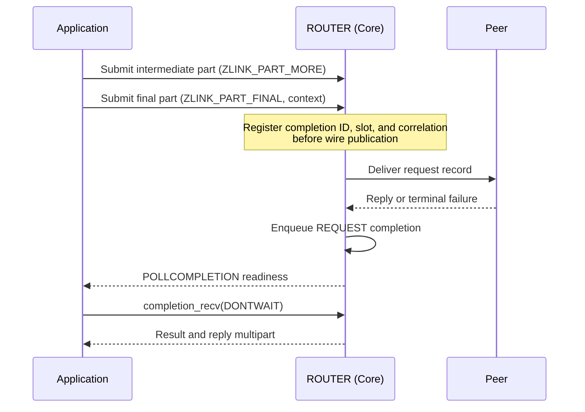

[한국어](https://zlink-systems.github.io/zlink/ko/spec/core/socket/07-router/) | English

<!-- zlink-nav:start -->
[Socket Index](README.en.md) | [Previous: DEALER](06-dealer.en.md) | [Next: STREAM](08-stream.en.md)
<!-- zlink-nav:end -->

# Socket — ROUTER

> **What this chapter defines** — The public contract for routing replies by routing ID on a
> ROUTER socket and for [result/errno](../03-errors.en.md#result-and-errno-mapping).

## 1. ROUTER overview

ROUTER is an asynchronous raw socket that manages connections (pipes) to multiple peers on one
[socket](../glossary.en.md#socket) and selects a send target by routing ID, the byte sequence that
identifies a peer. It processes ordinary directed messages and received request records. The
[Message](../02-message.en.md#zlink_routing_id_t) specification owns the contract for
`zlink_routing_id_t`, the type that carries a routing ID.

The following documents own the related contracts.

| Related contract | Defining document |
|---|---|
| Socket creation, common options, and the `zlink_socket_set_receive_flow_state` declaration | [Socket Common](README.en.md) |
| Routing ID type (`zlink_routing_id_t`) | [Message](../02-message.en.md#zlink_routing_id_t) |
| Request-reply kinds, sequences, and ZMP header byte layout and validation | [ZMP](../protocol/01-zmp.en.md) |
| Mapping of each result to errno and the receive flow state result table | [Errors](../03-errors.en.md) |
| Peer socket paired with ROUTER | [DEALER](06-dealer.en.md) |
| Socket status snapshot | [Monitoring](../06-monitoring.en.md) |

## 2. DATA and REQUEST receive

`zlink_router_recv_part()` distinguishes DATA from REQUEST by the source logical RID and reply
token.

| Record | `source_rid_out_` | `reply_token_out_` |
|---|---|---:|
| DATA multipart | Sending peer's logical RID | `0` |
| REQUEST | Sending peer's logical RID | Nonzero opaque token created by Core |

Every part of a multipart REQUEST returns the same RID and token. The token is not the wire request
sequence, and the application does not interpret, create, or modify it. A reply sequence begins only
after the entire REQUEST has been received through FINAL. Replies, timeouts, and terminal results
for requests submitted by ROUTER are returned as REQUEST completions, not through ordinary receive.

The returned RID is a socket-owned borrowed view. It remains valid until entry to the next data-recv
API on the same socket or until socket close. Poller wait, completion recv, monitor recv, and data
recv on another socket do not invalidate it. A caller or binding that must retain it longer copies
it to an owned RID immediately after receive.

## 3. Part sequences and ownership

`*_part` send calls form one multipart sequence from `ZLINK_PART_MORE` through
`ZLINK_PART_FINAL`. While a sequence is open, another send helper family or a different routing ID
cannot be interleaved on the same handle.

When a valid initialized `part_` is passed to a send API, the function consumes its message content
on both success and failure and leaves it as an initialized zero-length message. The caller
therefore cannot read the pre-submit payload or send the same content again after the call,
regardless of the result. Payload needed for another send must be retained in a separate message
before the call.

Each send helper family stages successful intermediate parts as one record until
`ZLINK_PART_FINAL` succeeds. If an intermediate or final submit in an open sequence fails, Core
atomically discards the previously staged parts and the failed part and closes the sequence. No
part of that record becomes visible to the peer. The failed call also consumes `part_`, and the next
submit starts the first part of a new record. A failed request submit returns ID `0` and creates
neither a completion nor a context echo. If a reply sequence fails, the complete retained reply can
be resubmitted from its first part while the logical RID and token remain valid.

The `part_out_` passed to a receive API must be an initialized `zlink_msg_t` before the call. On
success, ownership of the received part moves to the caller, which releases it exactly once with
`zlink_msg_close()`. On failure, ownership of the received part does not move.

## 4. Public types

The following numbers are public ABI values.

```c
typedef enum zlink_router_option_t {
  ZLINK_ROUTER_OPT_MANDATORY          = 0x3101,  // int, 0=off, positive=on, getter returns 0/1, default 1. Whether directed submit to an unconnected routing ID fails
  ZLINK_ROUTER_OPT_PROBE              = 0x3103,  // int, 0=off, positive=on, getter returns 0/1, default 0. An empty raw message lets the peer observe the connection and routing ID when the connection is established
  ZLINK_ROUTER_OPT_CONNECT_ROUTING_ID = 0x3104,  // Variable-length byte string, set only. Local alias for the next zlink_connect() pipe
  ZLINK_ROUTER_OPT_REQUEST_TIMEOUT_MS = 0x3105,  // Nonnegative int (milliseconds), default 5000. Default timeout when a request uses timeout_ms_ == 0
  ZLINK_ROUTER_OPT_WEIGHT             = 0x3106   // int, 0..10000, default 100. This ROUTER's weight advertised to connected peers
} zlink_router_option_t;

typedef enum zlink_part_flag_t {
  ZLINK_PART_FINAL = 0,  // The current part is the last part of the record
  ZLINK_PART_MORE  = 1   // Another part follows in the same multipart record
} zlink_part_flag_t;

typedef uint64_t zlink_reply_token_t;  // DATA is 0; REQUEST is a nonzero opaque capability
```

`ZLINK_PART_MORE` means that another part follows in the same multipart record.
`ZLINK_PART_FINAL` means that the current part is the last part. Receive APIs use the same values
for `has_more_out_`.

## 5. ROUTER options

```c
ZLINK_EXPORT zlink_config_result_t zlink_set_router_option(
  void *handle_,
  zlink_router_option_t option_,
  const void *optval_,
  size_t optvallen_);

ZLINK_EXPORT zlink_config_result_t zlink_get_router_option(
  void *handle_,
  zlink_router_option_t option_,
  void *optval_,
  size_t *optvallen_);
```

The inline comments in [section 4](#4-public-types) define the value format, range, and default for
each option. The following contracts are not included in those comments.

- When `ZLINK_ROUTER_OPT_MANDATORY` is positive, a directed submit to a routing ID without a
  connected pipe fails with `ZLINK_SUBMIT_NOT_CONNECTED`.
- `ZLINK_ROUTER_OPT_CONNECT_ROUTING_ID` sets the local alias that identifies the pipe created by
  the next `zlink_connect()` and is set before each connect.

When `zlink_get_router_option()` is called, `*optvallen_` is the input capacity of `optval_`. On
success, it is updated to the number of bytes written. [HWM](../glossary.en.md#hwm), the byte limit
for queue storage, and reconnect and timeout options that are not ROUTER-specific use
`zlink_set_option()` and `zlink_get_option()`.

`ZLINK_ROUTER_OPT_WEIGHT` is the absolute value that a peer uses when selecting this ROUTER as an
outbound candidate. ROUTER and DEALER advertise their own values independently, so each direction
uses the value advertised by the other socket.

The public weight result follows this order.

1. A value set before bind or connect applies after the paired Application pipe becomes ready.
2. A dynamic change applies the new absolute value, including `0`, to the peer scheduler.
3. An actual change emits `PEER_WEIGHT_CHANGED` with the value and the Application pipe's lane and
   connection ID. Repeating the same value emits no additional event.
4. Reconnect applies the current configured value to the new connection.

The network wire, inproc delivery, CONTROL size boundary, multipart deferral, and exact-pipe
lifetime and stale-delivery ownership are defined by the
[ZMP request-reply lane](../protocol/01-zmp.en.md#41-request-reply-lane),
[decode](../protocol/01-zmp.en.md#7-decode-validation), and
[peer-weight owner](../protocol/01-zmp.en.md#peer-weight-control) contracts. Neither transport path
creates a weight record on public receive or the Completion lane.

If the applied value becomes `0` after a multipart has selected a pipe, that message completes
through FINAL on the same pipe. The next message selection excludes it.

An actual remote-weight change re-evaluates an admission-pending DONTWAIT send or request for its exact
pipe. If the weight becomes `0` before the message begins, the completion is `ZLINK_SEND_TERMINAL`
with `send_terminal_errno == ECONNREFUSED`; a change from `0` to a positive value permits retry without
another write-activation event.

An active duplicate keeps its own latest value while standby and uses it if that same pipe is
selected later. Setting the Application maximum below 10 bytes does not prevent pair readiness,
FLOWSTATE, or WEIGHT delivery; malformed CONTROL behavior remains owned by ZMP.

## 6. Directed raw send

```c
ZLINK_EXPORT zlink_submit_result_t zlink_send_part_rid(
  void *s_,
  const zlink_routing_id_t *target_rid_,
  zlink_msg_t *part_,
  zlink_send_flags_t flags_,
  zlink_part_flag_t part_flag_,
  void *user_context_,
  zlink_completion_id_t *completion_id_out_);
```

This sends one ordinary raw multipart part to the peer identified by `target_rid_`. Every part must
use the same target. `flags_` is `ZLINK_SEND_FLAGS_NONE` or `ZLINK_SEND_FLAGS_DONTWAIT`. `NONE FINAL`
snapshots `SNDTIMEO`, waits for admission and reconnect of the same logical RID, and finishes with
ID `0`. A `DONTWAIT FINAL` has ID `0` when admission is immediate; if Core retains it as pending,
it has a nonzero ID and produces a SEND completion. Before admission, Core retries only the same RID;
after ID `0` or `ZLINK_SEND_ADMITTED`, it does not replay the payload. [Socket Common](README.en.md#part-send-and-pending-admission)
owns ownership and the exact result and errno contract.

## 7. Raw request submit

```c
ZLINK_EXPORT zlink_submit_result_t zlink_request_part(
  void *s_,
  const zlink_routing_id_t *target_router_rid_or_null_,
  zlink_msg_t *part_,
  zlink_send_flags_t flags_,
  zlink_part_flag_t part_flag_,
  uint32_t timeout_ms_,
  void *user_context_,
  zlink_completion_id_t *completion_id_out_);
```

`target_router_rid_or_null_` must be the non-NULL logical RID of a target ROUTER. A DEALER RID
returns `ZLINK_SUBMIT_NOT_ADMITTED` with `EPROTOTYPE`; DATA send to the same RID remains allowed.
An RID absent from the routing map returns `ZLINK_SUBMIT_NOT_FOUND` with `ENOENT`.

A `MORE` call requires `timeout_ms_ == 0` and `user_context_ == NULL`. The optional ID output is set
to `0` before other validation; a successful FINAL returns a nonzero ID. Before publishing the
request on the wire, Core reserves an ID and one of the shared SEND and REQUEST completion slots.
Slot exhaustion immediately returns `ZLINK_SUBMIT_BACKPRESSURED` with `EAGAIN`, ID `0`, and no
completion, regardless of flags.

`NONE FINAL` uses a temporary reservation and waits within `SNDTIMEO` for same-RID local admission.
A pre-admission failure releases the reservation and ends synchronously with ID `0` and no
completion. If the pending pool permits it, `DONTWAIT FINAL` transfers ownership of a pre-admission
record to Core and returns a nonzero REQUEST ID. This stage does not create a SEND completion.

`timeout_ms_ == 0` snapshots the `ZLINK_ROUTER_OPT_REQUEST_TIMEOUT_MS` value, whose default is
5,000 ms. The reply timeout starts at outbound local admission and excludes time pending before
admission. A disconnect after admission does not replay the payload; Core retains only correlation
and the remaining monotonic budget. Exactly one of reply, timeout, and terminal creates the REQUEST
completion.



The diagram shows the path after a successful final submit. A failed submit follows the discard
rules in [section 3](#3-part-sequences-and-ownership) and creates no completion.

## 8. Raw request and message receive

```c
ZLINK_EXPORT zlink_recv_result_t zlink_router_recv_part(
  void *router_,
  const zlink_routing_id_t **source_rid_out_,
  zlink_reply_token_t *reply_token_out_,
  zlink_msg_t *part_out_,
  zlink_part_flag_t *has_more_out_,
  zlink_recv_flags_t flags_);
```

This returns one part from a complete DATA or REQUEST record. Every output pointer is required. `flags_` is
`ZLINK_RECV_FLAGS_NONE` or `ZLINK_RECV_FLAGS_DONTWAIT`. A non-blocking call with no record available
returns `ZLINK_RECV_NO_DATA` and `EAGAIN`.

When `has_more_out_ == ZLINK_PART_MORE`, the next call must receive the next part of the same
record. `ZLINK_PART_FINAL` completes the record's receive sequence. Use the output combinations in
[section 2](#2-data-and-request-receive) to
determine whether a reply is required.

The returned payload has no internal request metadata. The routing ID and opaque
reply token obtained from the first part of a multipart request are repeated for every remaining part
of the same record, but are not retained in the message itself.

Part-output ownership, `NONE` `RCVTIMEO`, output invariance, and the socket-owned borrowed RID
lifetime follow the data-recv contract in [Socket Common](README.en.md#zlink_recv_part).

## 9. Raw reply submit

```c
ZLINK_EXPORT zlink_submit_result_t zlink_reply_part(
  void *router_,
  const zlink_routing_id_t *source_rid_,
  zlink_reply_token_t reply_token_,
  zlink_msg_t *part_,
  zlink_part_flag_t part_flag_);
```

Use the source RID and nonzero opaque reply token returned by `zlink_router_recv_part()` unchanged.
The wire request sequence is internal Core metadata and is not guaranteed to equal the reply token.
Every call consumes an initialized `part_`, regardless of result, and leaves it empty and initialized.

The first `MORE` or `FINAL` validates the RID, token, and REQUEST-complete state and atomically checks
out the token to one reply sequence. A successful `MORE` stages the part and retains the checkout but
does not consume the token. FINAL snapshots `ZLINK_OPT_SNDTIMEO` on entry and waits for local admission
on the same logical source RID's reply route. If the source peer is DEALER, Core selects the current
ready Application pipe; if it is ROUTER, Core selects the current ready
[completion progress lane](../glossary.en.md#completion-progress-lane) Completion pipe. The default is 1,000 ms;
`0` is immediate and `-1`
waits indefinitely. Only a successful FINAL consumes the registry token. It does not guarantee
requester-application receipt or acceptance. Reply creates neither a completion ID nor a completion
record.

Wait expiration returns `ZLINK_SUBMIT_BACKPRESSURED` with `EAGAIN`; allocation failure returns
`ZLINK_SUBMIT_OUT_OF_MEMORY` with `ENOMEM`; other runtime failure returns
`ZLINK_SUBMIT_INTERNAL_ERROR` with `EIO`. Context termination and socket shutdown return
`ZLINK_SUBMIT_TERMINATED` with `ETERM` and `ZLINK_SUBMIT_TERMINATED` with `ESHUTDOWN`, respectively. An explicitly removed logical
RID, absent or consumed token, or RID mismatch returns `ZLINK_SUBMIT_NOT_FOUND` with `ENOENT`.
Reply before the REQUEST FINAL is received returns `ZLINK_SUBMIT_INVALID_STATE` with `EBUSY`.

A validation failure before checkout consumes only that call's part. A failure after checkout
discards the failed part and staged prefix and releases checkout. While the token remains live, the
caller may retry a retained complete reply from its first part after timeout, allocation or runtime
failure, early reply, or a later-part mismatch. A concurrent second sequence for the same token
returns `ZLINK_SUBMIT_INVALID_STATE` with `EBUSY`, consumes only the second part, and preserves the
existing checkout and staging. A later part with a different RID or token returns
`ZLINK_SUBMIT_INVALID_ARGUMENT` with `EINVAL`, discards that sequence, and releases the original
checkout.

The token is a nonzero opaque capability scoped to `(responder ROUTER socket, source logical RID)`.
The application does not create it, convert it to another numeric meaning, or perform arithmetic on
it. Physical disconnect, connection-generation change, and requester timeout do not invalidate it.
Only successful reply FINAL, explicit logical-RID removal, responder socket close, and context
termination invalidate it. Requester timeout is not cancellation: a later reply can still be locally
admitted, and requester Core discards it if correlation no longer exists.

Token IDs increase monotonically on the responder socket and are not reused before close. If Core
cannot produce the next nonzero ID, it does not enqueue the new REQUEST; it completes the requester
with `ZLINK_REQUEST_INTERNAL_ERROR` through an internal error reply and creates no token or slot. The
live registry holds 65,536 tokens per ROUTER. At saturation, Core stops read or credit for a source
pipe whose ingress head needs a token. DATA on other pipes and already admitted records continue
through fair queueing, while later DATA on the same pipe cannot overtake the REQUEST. Releasing a
slot redrives paused pipes in round-robin order. Core neither evicts tokens automatically nor silently
drops REQUEST records, and it exposes no public abandon or cancel API.

## 10. Results and readiness

Submit APIs return `zlink_submit_result_t`, receive APIs return `zlink_recv_result_t`, and option
APIs return `zlink_config_result_t`. The [errno map](../03-errors.en.md#result-and-errno-mapping)
defines the mapping between each result and `zlink_errno()`.

ROUTER `ZLINK_POLLIN` means that the application queue contains an admitted DATA or REQUEST record,
or that a complete REQUEST can reserve a token slot. It is not ready when every readable head is a
token-blocked REQUEST. For ordinary sends and
requests, `ZLINK_POLLOUT` indicates that retrying a submit after
[backpressure](../glossary.en.md#backpressure), the state in which additional submissions are
limited because the receiver cannot keep up, is worthwhile. It does not guarantee that the next
submit succeeds. Results of SEND and REQUEST operations retained by Core are received through
`ZLINK_POLLCOMPLETION` and `zlink_completion_recv()`. Reply submit creates no completion.

## 11. Receive flow state

A ROUTER connected to a DEALER or ROUTER peer can ask those peers to stop and resume sending to it.
`zlink_socket_set_receive_flow_state()` stores one socket-wide state.
[Socket Common](README.en.md) owns the function declaration, and [Errors](../03-errors.en.md) owns
the result table.

The state belongs to the socket, not to a routing ID. There is no per-peer flow-state call. One call
sends the state to every ready peer of this ROUTER, so every peer receives the same state. Core uses
the single Application connection's Core control path for a DEALER peer and the Completion connection
for a ROUTER peer. A peer that becomes ready later also receives the socket's current state over the
path selected for its type. A routing ID selects the destination of a send; it does not select a
receive-flow state.

The state is an absolute value, not a counter. Setting the current state again succeeds and sends
nothing.

A flow-state frame carries a flow epoch scoped to the connection on which the frame was written.
There is no public pair-ID or generation field and no `Zlink-Pair-Id` or
`Zlink-Pair-Generation` wire property. Using internal connection identity, Core applies the frame
only to the connection on which it was written. A frame whose identity does not match, including a
frame from a replaced connection, is consumed internally without a public event and increments only
the `flow_state_stale_total` counter. A duplicate or regressing epoch on the same connection is not
applied and is reported as `ZLINK_EVENT_FLOW_STATE_STALE` with
`ZLINK_MONITOR_EVENT_FLAG_FLOW_STATE_STALE_EPOCH`. A routing ID can remain stable across a reconnect,
but state published by a peer before a reconnect is never applied to the replacement connection. A
new connection starts from the state that the socket sends when the pair becomes ready.

A remote PAUSE blocks only sends to the paused peer and does not affect routes to other peers. It is
an independent blocker composed with byte HWM, transport waits, and termination, so clearing it
does not by itself admit the next send. Send results and readiness remain unchanged. A blocked
non-blocking send continues to report `ZLINK_SUBMIT_BACKPRESSURED` with `errno == EAGAIN`, and
mandatory routing retains the behavior defined in [section 6](#6-directed-raw-send).

A remote PAUSE applies from the next message boundary and does not split a multipart record. If
this ROUTER has already accepted a record's routing-ID part, it sends the remaining parts before
the pause takes effect.

The [Monitoring](../06-monitoring.en.md) status snapshot reports the current number of paused peers
together with the applied-transition count, stale count, and pause duration for the whole socket.

## 12. Internal structure

> **Contract ownership for this section** — [Section 6](#6-directed-raw-send) and [section
> 7](#7-raw-request-submit) own the public contracts for directed submit and request
> submit. This section explains how a binding serializes multipart attempts on top of those
> contracts.

Because each part call has a separate public API scope, a binding holds a socket-local attempt gate
only for one `DONTWAIT` attempt from the first part through FINAL. On failure, it releases the gate
immediately after Core rolls back the sequence and does not hold it while waiting for
`BACKPRESSURED` readiness. Request submit also makes one attempt from the first request part through
FINAL under the same short socket-local attempt gate as raw send. This gate is neither a new Core
multipart API nor a public FIFO contract.

## 13. Implementation and contract test verification requirements

The following behaviors are verified using only the public surface: ROUTER send, request, receive,
reply, and completion-pull functions; ROUTER option set and get; return values and errno; and event
and status snapshots. Each item maps to one test.

**Options**
- When `zlink_get_router_option()` is called, `*optvallen_` is the input capacity, and on success it is updated to the number of bytes written.
- Each option's default value is returned: `MANDATORY` `1`, `PROBE` `0`, `REQUEST_TIMEOUT_MS` `5000`, and `WEIGHT` `100`.
- When `ZLINK_ROUTER_OPT_MANDATORY` is positive, a directed submit to a routing ID without a connected pipe fails with `ZLINK_SUBMIT_NOT_CONNECTED`, and the getter returns `0` or `1`.
- When `ZLINK_ROUTER_OPT_PROBE` is positive, an empty raw message is sent when a connection is established so that the peer can observe the connection and routing ID, and the getter returns `0` or `1`.
- Setting `ZLINK_ROUTER_OPT_CONNECT_ROUTING_ID` before connect identifies the pipe created by the next `zlink_connect()` by that local alias.

**Peer-weight delivery**

- If different weights are configured on a ROUTER and its peer before bind or connect, each
  scheduler uses the peer's exact value after the logical route becomes ready, and a peer with value `0` is
  excluded from outbound candidates.
- Dynamically changing both weights after a network or inproc connection is ready produces
  `PEER_WEIGHT_CHANGED` with the new weight in `value`; the Application lane and diagnostic
  `connection_id` identify the connection to which the value was applied.
- Setting or synchronizing weight adds no application record to public receive or the Completion
  lane, and setting the same value again produces no duplicate monitor event.
- Changing weight more than once while an Application multipart is open preserves the peer-visible
  multipart as one atomic record, and only the latest value is reflected after FINAL or rollback.
- If a pipe's remote weight becomes `0` after the first part of an Application multipart is
  accepted, the same pipe carries every remaining part through FINAL and is excluded starting with
  the next message selection.
- A remote-weight change re-evaluates an admission-pending DONTWAIT SEND for the same logical RID:
  if the weight becomes `0` before the message begins, the completion is `ZLINK_SEND_TERMINAL` with
  `send_terminal_errno == ECONNREFUSED`; a change from `0` to a positive value permits retry without
  another write-activation event.
- Setting an Application maximum below 10 bytes does not prevent pair readiness, FLOWSTATE, or
  weight changes observed through peer selection and monitoring.
- After reconnect, peer selection and monitoring reflect the current weight on the new connection.
  Promoting an active standby uses the value that standby most recently received.

**Record classification and receive**
- A DATA record returns reply token `0`; a received REQUEST returns a nonzero opaque reply token. Equality between the token and wire sequence is not a contract.
- Every part of one multipart record returns the same source routing ID and reply token.
- Replies and terminal failures for a request started with `zlink_request_part()` are returned as `ZLINK_COMPLETION_REQUEST`, not as data receive records.
- A non-blocking receive with no record available returns `ZLINK_RECV_NO_DATA` and `EAGAIN`.
- On successful receive, ownership of the part moves to the caller, which releases it with exactly one `zlink_msg_close()`; on failure, ownership does not move.
- When `has_more_out_ == ZLINK_PART_MORE`, the next call returns the next part of the same record; `ZLINK_PART_FINAL` completes the record's receive sequence.
- A reply or error reply received through `zlink_router_recv_part()` returns no payload and terminates the connection with `EPROTO`.
- Raw-sending a DATA or REQUEST payload returned by `zlink_router_recv_part()` does not restore request-reply semantics.
- Passing a ROUTER to the common `zlink_recv_part()` surface is rejected as unsupported.
- When different physical sources with the same RID send REQUEST records carrying the same live wire sequence, ROUTER returns distinct opaque reply tokens. Reverse or out-of-order replies complete only the request identified by each token.
- If the same physical source reuses a live wire sequence, ROUTER terminates that connection with `EPROTO` and does not deliver the duplicate REQUEST to application receive.

**Part sequences**
- A send API consumes the content of `part_` on both success and failure and leaves it as an initialized zero-length message; the same `part_` cannot be resubmitted after failure.
- If an intermediate or final submit in an open sequence fails, no part of that record becomes visible to the peer, and the next submit starts the first part of a new record.
- A failed request submit returns completion ID `0` and creates neither a completion nor a context echo.
- After a reply-sequence failure, the reply token and source RID remain valid until successful reply `ZLINK_PART_FINAL`, logical RID removal, responder close, or context termination; a retained complete reply can be resubmitted from its first part.
- A non-empty group on the first request or reply part yields `ZLINK_SUBMIT_INVALID_ARGUMENT` and `EINVAL`; the input part is consumed and the peer receives no part of that record. A failed request creates no completion, and a failed reply can be submitted again with group-free payload using the same source RID and token.

**Directed submit**
- `zlink_send_part_rid()` with `NONE FINAL` waits within `SNDTIMEO` for same-logical-RID local admission and finishes with ID `0` and no completion.
- A `DONTWAIT FINAL` admitted immediately has ID `0`; if Core retains it as pending, it returns a nonzero ID and produces exactly one SEND completion.
- Before admission, reconnect retries only the same logical RID; after ID `0` or `ZLINK_SEND_ADMITTED`, Core does not replay the payload.
- A failure after the first multipart part is accepted rolls back the complete record, so no partial record becomes visible to the peer.

**Request completion**
- A successful FINAL returns a nonzero ID and exactly one REQUEST completion for reply, timeout, or terminal; a failed submit returns ID `0` and no completion.
- If the last call uses `timeout_ms_ == 0`, it uses the `ZLINK_ROUTER_OPT_REQUEST_TIMEOUT_MS` default.
- A valid error reply preserves a non-OK `zlink_request_result_t` mapped from errno and the payload after the errno part in the completion; a malformed errno part completes with `ZLINK_REQUEST_PROTOCOL_ERROR` and no payload.
- The request timeout starts at local admission and excludes time pending before admission; a disconnect after admission neither replays the payload nor resets the monotonic budget.
- Shared completion-slot exhaustion immediately returns `ZLINK_SUBMIT_BACKPRESSURED` with `EAGAIN`, ID `0`, and no completion, regardless of flags.

**Reply**
- `zlink_reply_part()` uses the source RID and opaque reply token returned by receive; only successful FINAL consumes the token.
- Reply FINAL snapshots `SNDTIMEO` and waits for local admission on the logical reply route. Timeout returns `ZLINK_SUBMIT_BACKPRESSURED` with `EAGAIN`, and a live token permits retrying the complete reply from its first part.
- A concurrent second sequence for the same token returns `ZLINK_SUBMIT_INVALID_STATE` with `EBUSY`, consumes only the second part, and preserves the existing checkout and staging.
- Physical disconnect, connection-generation change, and requester timeout do not invalidate the token; logical RID removal, responder close, and context termination do.
- When 65,536 tokens are live, Core stops reading a source whose head REQUEST needs a token instead of silently dropping it. Releasing a slot redrives sources in round-robin order.
- If the application queue is empty and every readable head is a token-blocked REQUEST, `ZLINK_POLLIN` clears; slot release redrives sources without starvation.
- Reply submit creates neither a completion ID nor a completion record.
- A reply to a DEALER peer uses the current ready Application pipe and applies HWM, PAUSED, and
  `SNDTIMEO` admission, so it can return `ZLINK_SUBMIT_BACKPRESSURED` with `EAGAIN`. A reply to a
  ROUTER peer uses the current ready Completion pipe and applies HWM-free admission.

**Readiness**
- `ZLINK_POLLIN` is set for an admitted DATA or REQUEST, or a complete REQUEST that can reserve a token slot. It clears when all readable heads are token-blocked REQUEST records.
- `ZLINK_POLLOUT` indicates only that a retry after backpressure is worthwhile and does not guarantee that the next submit succeeds.

**Receive flow state**
- Setting the current state again succeeds and sends nothing.
- One call gives every ready peer the same state. It uses the Application connection for a DEALER
  peer and the Completion connection for a ROUTER peer, and a peer that becomes ready later also
  receives the socket's current state.
- A flow-state frame contains only the flow epoch scoped to the connection on which it was written. There is no public pair-ID or generation field and no `Zlink-Pair-Id` or `Zlink-Pair-Generation` wire property. Core applies the frame only to that connection by using internal connection identity.
- A frame whose identity does not match, including a frame from a replaced connection, is consumed internally without a public event and increments only `flow_state_stale_total`. A duplicate or regressing epoch on the same connection is not applied and is reported as `ZLINK_EVENT_FLOW_STATE_STALE` with `ZLINK_MONITOR_EVENT_FLAG_FLOW_STATE_STALE_EPOCH`.
- State published by a peer before a reconnect is not applied to the replacement connection.
- A remote PAUSE blocks only sends to the paused peer: routes to other peers are unaffected, a blocked non-blocking send reports `ZLINK_SUBMIT_BACKPRESSURED` with `errno == EAGAIN`, and clearing PAUSE alone does not admit the next send.
- A remote PAUSE applies from the next message boundary: a record whose routing-ID part has already been accepted sends its remaining parts before the pause takes effect.
- The [Monitoring](../06-monitoring.en.md) status snapshot provides the current number of paused peers, the socket-wide applied-transition count, stale count, and pause duration.

<!-- zlink-nav:start -->
[Socket Index](README.en.md) | [Previous: DEALER](06-dealer.en.md) | [Next: STREAM](08-stream.en.md)
<!-- zlink-nav:end -->
