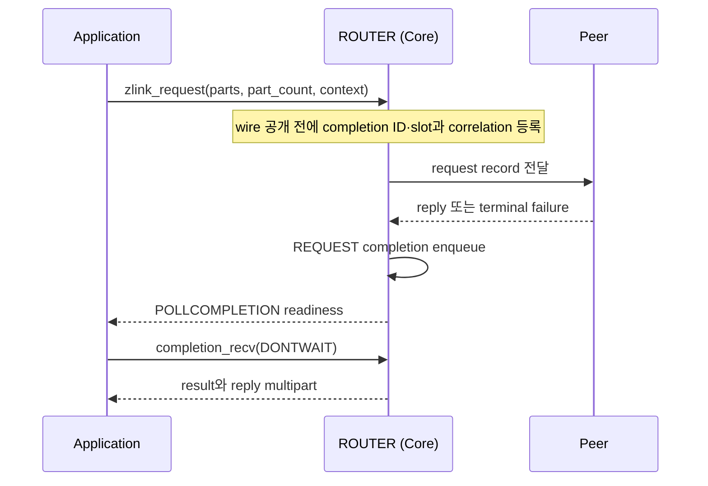

[English](07-router.en.md) | 한국어

<!-- zlink-nav:start -->
[소켓 목차](README.ko.md) | [이전: DEALER](06-dealer.ko.md) | [다음: STREAM](08-stream.ko.md)
<!-- zlink-nav:end -->

# Socket — ROUTER

> **이 장이 정의하는 것** — ROUTER 소켓의 routing id 기반 응답 라우팅과
> [result/errno](../03-errors.ko.md#result와-errno-대응) 공개 계약.

## 1. ROUTER 개요

ROUTER는 하나의 [socket](../glossary.ko.md#socket)에서 여러 peer와의 연결(pipe)을 관리하고,
peer를 식별하는 byte 열인 routing ID로 송신 대상을 선택하는 비동기 raw socket이다. 일반
directed message와 수신 request record를 처리한다. routing ID를 전달하는 타입
`zlink_routing_id_t`의 계약은 [Message](../02-message.ko.md#zlink_routing_id_t)가 소유한다.

관련 계약의 소유 문서는 다음과 같다.

| 관련 계약 | 정의하는 문서 |
|---|---|
| socket 생성·공통 옵션·`zlink_socket_set_receive_flow_state` 함수 선언 | [Socket 공통](README.ko.md) |
| routing ID 타입(`zlink_routing_id_t`) | [Message](../02-message.ko.md#zlink_routing_id_t) |
| Request-reply kind, sequence와 ZMP header byte 배치·검증 | [ZMP](../protocol/01-zmp.ko.md) |
| 각 result와 errno 대응, receive flow state 결과 표 | [Errors](../03-errors.ko.md) |
| ROUTER와 pair를 이루는 상대 socket | [DEALER](06-dealer.ko.md) |
| socket status snapshot | [Monitoring](../06-monitoring.ko.md) |

## 2. DATA와 REQUEST receive

`zlink_router_recv()`는 source logical RID와 reply token으로 DATA와 REQUEST를 구분한다.

| record | `source_rid_out_` | `reply_token_out_` |
|---|---|---:|
| DATA multipart | 송신 peer의 logical RID | `0` |
| REQUEST | 송신 peer의 logical RID | Core가 만든 nonzero opaque token |

`zlink_router_recv()`는 REQUEST record 전체에 RID와 token 하나를 반환한다. Token은 wire request
sequence가 아니며 application은 값을 해석·생성·변경하지 않는다. REQUEST receive가 성공한 뒤에만
reply를 제출한다. ROUTER가 제출한 REQUEST의 reply·timeout·terminal 결과는 일반 receive에
나타나지 않고 REQUEST completion으로 반환된다.

Part는 caller-제공 `zlink_msg_t` 배열에 채운다. Capacity가 record의 part 수보다 작으면 record를 소비하지 않고 필요한 수를
`*part_count_out_`에 쓴 뒤 `ZLINK_RECV_BUFFER_TOO_SMALL`(`errno == ENOBUFS`)을 반환한다. 소유권·close·
capacity 규칙은 [Socket 공통](README.ko.md#zlink_recv-와-zlink_router_recv)이 소유한다.

반환한 RID는 socket-owned borrowed view다. 같은 socket의 다음 data recv API에 진입하거나 socket을
close할 때까지 유효하다. Poller wait, completion recv, monitor recv와 다른 socket의 data recv는
무효화하지 않는다. 더 오래 보관할 caller와 binding은 receive 직후 owned RID로 복사한다.

## 3. Whole-message ownership과 record 원자성

Send API는 `parts_` 배열과 `part_count_`를 record 하나로 원자적으로 제출한다. 여러 thread가 같은
socket에 독립된 record를 동시에 제출할 수 있으며 thread별 sequence 상태는 없다.

함수는 성공과 실패 모두에서 모든 입력 슬롯을 소비하고 길이 0인 초기화 상태로 둔다. 실패하면
peer에는 record의 어떤 part도 보이지 않는다. 다시 보내야 하는 payload는 호출 전에 record 전체를
별도로 보관한다. 실패한 request submit은 ID `0`이고 completion과 context echo를 만들지 않는다.
Reply가 실패해도 logical RID와 token이 유지되는 동안 caller가 보관한 전체 reply를 다시 제출할 수 있다.

Receive API의 output 슬롯은 호출 전에 초기화할 필요가 없다. 성공하면 앞의 `*part_count_out_`개
슬롯의 소유권이 caller에게 이동하며 caller는 `zlink_multipart_close()`로 정확히 한 번 해제한다.
실패하면 슬롯 소유권은 이동하지 않는다.

## 4. 공개 타입

다음 숫자는 공개 ABI 값이다.

```c
typedef enum zlink_router_option_t {
  ZLINK_ROUTER_OPT_MANDATORY          = 0x3101,  // int, 0=off, 양수=on, getter는 0/1 반환, 기본 1. 미연결 routing ID의 directed submit 실패 여부
  ZLINK_ROUTER_OPT_PROBE              = 0x3103,  // int, 0=off, 양수=on, getter는 0/1 반환, 기본 0. 연결 설정 시 빈 raw message로 peer가 연결·routing ID 관찰
  ZLINK_ROUTER_OPT_CONNECT_ROUTING_ID = 0x3104,  // 가변 길이 byte string, set 전용. 다음 zlink_connect() pipe의 local alias
  ZLINK_ROUTER_OPT_REQUEST_TIMEOUT_MS = 0x3105,  // 0 이상인 int (millisecond), 기본 5000. request의 timeout_ms_ == 0일 때 기본 timeout
  ZLINK_ROUTER_OPT_WEIGHT             = 0x3106   // int, 0..10000, 기본 100. 연결된 peer에 알리는 이 ROUTER의 가중치
} zlink_router_option_t;

typedef uint64_t zlink_reply_token_t;  // DATA는 0, REQUEST는 nonzero opaque capability
```

## 5. ROUTER option

```c
ZLINK_EXPORT zlink_config_result_t zlink_set_router_option(
  void *handle_,
  zlink_router_option_t option_,
  const void *optval_,
  size_t optvallen_);

ZLINK_EXPORT zlink_config_result_t zlink_get_router_option(
  void *handle_,
  zlink_router_option_t option_,
  void *optval_,
  size_t *optvallen_);
```

각 option의 값 형식·범위·기본값은 [§4](#4-공개-타입)의 인라인 주석이 정의한다. 주석에
담기지 않는 계약은 다음과 같다.

- `ZLINK_ROUTER_OPT_MANDATORY`는 route가 없는 RID의 일반 directed send에 적용한다.
  양수(기본값)이면 `ZLINK_SUBMIT_NOT_CONNECTED`·`EHOSTUNREACH`, ID `0`으로 실패하고
  wait token을 만들지 않는다. `0`이면 record를 버리고 `ZLINK_SUBMIT_OK`, ID `0`이다.
  Typed request는 이 option과 관계없이 [Request와 reply](README.ko.md#request와-reply)의
  route 없음 결과를 따른다.
- `ZLINK_ROUTER_OPT_PROBE`는 ROUTER handle뿐 아니라 DEALER handle에서도 `zlink_set_router_option()`과
  `zlink_get_router_option()`으로 설정·조회할 수 있다. DEALER handle에 다른 `zlink_router_option_t` 값을
  넘기면 `ZLINK_CONFIG_INVALID_ARGUMENT`와 `EINVAL`이다.
- `ZLINK_ROUTER_OPT_CONNECT_ROUTING_ID`는 다음 `zlink_connect()`로 만든 pipe를 식별할 local
  alias를 설정하며, 각 connect 전에 설정한다.

`zlink_get_router_option()`을 호출할 때 `*optvallen_`은 `optval_`의 입력 용량이다. 성공하면 실제로
쓴 byte 수로 갱신된다. ROUTER 전용이 아닌 [HWM](../glossary.ko.md#hwm)(queue 보관 byte 상한),
reconnect와 timeout option은 `zlink_set_option()`과 `zlink_get_option()`을 사용한다.

`ZLINK_ROUTER_OPT_WEIGHT`는 이 ROUTER를 peer가 outbound 후보로 선택할 때 사용할 절대값이다.
ROUTER와 DEALER는 자기 값을 독립적으로 알리므로 각 방향은 상대 socket이 알린 값을 사용한다.

공개 weight 결과는 다음 순서를 따른다.

1. Bind·connect 전에 설정한 값은 paired Application pipe가 ready 된 뒤 적용된다.
2. Dynamic 변경은 `0`을 포함한 새 절대값을 peer scheduler에 적용한다.
3. 실제 값이 바뀌면 `PEER_WEIGHT_CHANGED`가 값과 Application lane·connection ID를 제공한다.
   같은 값을 반복 설정하면 event를 추가로 만들지 않는다.
4. Reconnect 뒤에는 현재 설정값을 새 connection에 적용한다.

Network wire, inproc 전달, CONTROL 크기 경계, record 경계 적용과 선택한 pipe의 lifetime·stale
전달 소유권은 [ZMP request-reply lane](../protocol/01-zmp.ko.md#41-request-reply-lane),
[decode](../protocol/01-zmp.ko.md#7-decode-유효성-검사),
[peer-weight owner](../protocol/01-zmp.ko.md#peer-weight-control) 계약이 정의한다. 어느 transport
경로도 public receive나 Completion lane에 weight record를 만들지 않는다.

Record가 pipe를 선택한 뒤 적용값이 `0`이 되어도 그 record는 같은 pipe로 전달된다. 다음 record
선택부터 그 pipe를 제외한다.

Remote weight가 실제로 바뀌면 wait token이 있는 DONTWAIT send와 request를 다시 평가한다. Wait
token은 weight가 `0`이 되어도 끝나지 않는다. `0`에서 양수로 바뀌면 그 RID의 SEND·REQUEST wait
token에 `ZLINK_COMPLETION_WRITABLE` record를 발행한다.

Active duplicate는 standby 동안 자기 최신 값을 보관하고 나중에 같은 pipe가 선택되면 사용한다.
Application 최대값을 10 byte보다 작게 설정해도 pair readiness·FLOWSTATE·WEIGHT 전달은 막히지
않으며, 잘못된 CONTROL의 동작은 ZMP가 소유한다.

## 6. Directed raw send

```c
ZLINK_EXPORT zlink_submit_result_t zlink_send_rid (
  void *s_, const zlink_routing_id_t *target_rid_,
  zlink_msg_t *parts_, size_t part_count_, zlink_send_flags_t flags_,
  void *user_context_, zlink_completion_id_t *completion_id_out_);
```

`target_rid_`의 peer에 일반 raw record 전체를 보낸다. Route 없는 RID에서 mandatory가 적용되는
범위와 결과는 [§5](#5-router-option)가, 나머지 submit 결과·token·ownership은
[whole-message send](README.ko.md#whole-message-send와-pending-admission)가 정한다.

## 7. Raw request submit

```c
ZLINK_EXPORT zlink_submit_result_t zlink_request (
  void *s_, const zlink_routing_id_t *target_router_rid_or_null_,
  zlink_msg_t *parts_, size_t part_count_, zlink_send_flags_t flags_,
  uint32_t timeout_ms_, void *user_context_,
  zlink_completion_id_t *completion_id_out_);
```

`target_router_rid_or_null_`은 target ROUTER의 non-NULL logical RID여야 한다. DEALER RID를
지정하면 `ZLINK_SUBMIT_NOT_ADMITTED`+`EPROTOTYPE`이며 같은 RID의 DATA send는 허용한다.
Routing map에 RID가 없을 때의 결과는 [Socket 공통 request](README.ko.md#request와-reply)를 따른다.

REQUEST의 입력·ID·reservation·timeout·completion과 WRITABLE 재제출 결과는 [Socket 공통 Request와 reply](README.ko.md#request와-reply)를 따른다. 이 ROUTER의 대기 토큰 target은 지정한 logical RID다.



위 diagram은 submit이 성공한 경로다. Submit 실패는
[§3](#3-whole-message-ownership과-record-원자성)의 ownership 규칙을 따르고 completion을 만들지 않는다.

## 8. Raw request와 message receive

```c
ZLINK_EXPORT zlink_recv_result_t zlink_router_recv (
  void *router_,
  const zlink_routing_id_t **source_rid_out_,
  zlink_reply_token_t *reply_token_out_,
  zlink_msg_t *parts_out_,
  size_t parts_capacity_,
  size_t *part_count_out_,
  zlink_recv_flags_t flags_);
```

완전한 DATA 또는 REQUEST record의 모든 part를 배열에 반환한다. 모든 output pointer는 필수다. `flags_`는
`ZLINK_RECV_FLAGS_NONE` 또는 `ZLINK_RECV_FLAGS_DONTWAIT`다. non-blocking 호출에 받을 record가 없으면
`ZLINK_RECV_NO_DATA`와 `EAGAIN`을 반환한다.

`parts_capacity_`가 record의 part 수보다 작으면 record를 소비하지 않고 필요한 수를
`*part_count_out_`에 쓴 뒤 `ZLINK_RECV_BUFFER_TOO_SMALL`+`ENOBUFS`를 반환한다. 충분한 배열로
재시도하면 같은 record를 받는다(선택에서 물러난 pipe의 record는 [§10.1](#101-선택-route-관찰)의 예외). Reply가 필요한지는 [§2](#2-data와-request-receive)의 output
조합으로 판단한다. 반환한 payload에는 internal request metadata가 없다.

Output ownership, `NONE`의 `RCVTIMEO`, output 불변과 socket-owned borrowed RID 수명은
[Socket 공통](README.ko.md#zlink_recv-와-zlink_router_recv)의 data recv 공통 계약을 따른다.

## 9. Raw reply submit

```c
ZLINK_EXPORT zlink_submit_result_t zlink_reply (
  void *router_, const zlink_routing_id_t *source_rid_,
  zlink_reply_token_t reply_token_, zlink_msg_t *parts_, size_t part_count_);
```

`zlink_router_recv()`로 받은 REQUEST의 source RID와 nonzero opaque reply token을 그대로
사용한다. Wire request sequence는 Core 내부 metadata이며 reply token과 값이 같다는 보장은 없다.
모든 호출은 결과와 관계없이 모든 입력 슬롯을 소비해 empty initialized 상태로 만든다.
`part_count_`는 양수여야 한다.

ROUTER는 reply 제출 시 token을 원자적으로 checkout하고 실패하면 checkout을 해제한다. 동시에 진행하는 같은 token의 reply 호출은 `ZLINK_SUBMIT_INVALID_STATE`+`EBUSY`로 거절하며 두 번째 호출의 입력 슬롯도 소비하고 기존 checkout은 유지한다. Reply route 선택, admission 결과, token 수명과 입력 소비는 [Socket 공통 Request와 reply](README.ko.md#request와-reply)를 따른다.

Token ID는 responder socket에서 단조 증가하며 close 전 재사용하지 않는다. 다음 nonzero ID를 만들 수 없으면 새 REQUEST를 application queue에 넣지 않고 internal error reply로 requester를 `ZLINK_REQUEST_INTERNAL_ERROR` 완료하며 token과 slot은 만들지 않는다. Live token registry의 수용과 재개는 [Socket 공통 Request와 reply](README.ko.md#request와-reply)를 따른다.

Request 또는 reply의 첫 입력 part에 비어 있지 않은 group이 있으면 `ZLINK_SUBMIT_INVALID_ARGUMENT`와 `EINVAL`을 반환한다. 모든 입력 슬롯을 소비하고 peer에는 어떤 part도 전달하지 않는다. 실패한 request는 completion을 만들지 않으며, 실패한 reply는 같은 source RID와 token으로 group이 없는 전체 record를 다시 제출할 수 있다.

## 10. Result와 readiness

submit은 `zlink_submit_result_t`, receive는 `zlink_recv_result_t`, option은
`zlink_config_result_t`를 반환한다. 각 result와 `zlink_errno()`의 대응은
[errno map](../03-errors.ko.md#result와-errno-대응)을 따른다.

ROUTER의 `ZLINK_POLLIN`은 application queue에 admission된 DATA·REQUEST 또는 token slot을 예약할
수 있는 완전한 REQUEST가 있음을 뜻한다. 모든 readable head가 token-blocked REQUEST이면 준비되지
않는다. Ordinary send와 request에서
`ZLINK_POLLOUT`은 [backpressure](../glossary.ko.md#backpressure)(수신 측이 따라오지 못해 추가
제출이 제한되는 상태) 뒤 submit을 다시 시도할 가치가 있음을 나타내지만 다음 submit
성공을 보장하지 않는다. 읽지 않은 `ZLINK_COMPLETION_WRITABLE` record가 있는 동안
`ZLINK_POLLOUT`과 `ZLINK_POLLCOMPLETION`은 level로 유지되며, RID별 정확한 신호는 그 record의
token·`peer_rid`다. Core가 접수한 SEND·REQUEST 결과는 `ZLINK_POLLCOMPLETION`과
`zlink_completion_recv()`로 받는다. Reply submit은 completion을 만들지 않는다.

### 10.1 선택 route 관찰

같은 RID에 transport pipe가 둘 이상 있을 수 있다 — 같은 방향의 재연결과 반대 방향의 standby
([RID 중복 정책](README.ko.md#rid-중복-정책)). Core는 RID마다 application route를 하나 선택하고,
application은 그 선택을 다음 snapshot으로만 관찰한다.

```c
typedef struct zlink_router_route_t {
  zlink_routing_id_t rid;
  uint64_t route_generation; /* 0이 아닌 opaque 값. 동등성만 비교한다 */
} zlink_router_route_t;

ZLINK_EXPORT zlink_config_result_t zlink_router_routes_snapshot(
  void *router_,
  zlink_router_route_t *routes_out_,
  size_t capacity_,
  size_t *route_count_out_);

ZLINK_EXPORT uint64_t zlink_router_recv_route_generation(void *router_);
```

- **Snapshot은 선택 route 전체를 원자적으로 반환한다.** RID마다 행 하나이며, admission이 끝난
  선택 route만 들어간다. 행이 없는 RID에는 선택 route가 없다.
- **`route_generation`은 같은 RID의 선택이 바뀔 때마다 새 값이 된다.** Handover로 새 pipe가 기존
  pipe를 인수하거나, 선택 pipe가 끝나 standby가 승격되면 값이 바뀐다. Caller는 값의 크기나 순서를
  해석하지 않는다.
- **선택 route가 바뀌면 `ZLINK_POLLROUTE`가 준비된다**([Polling §6](../05-polling.ko.md#6-공개-타입)).
  이 readiness는 level이며, 그 뒤의 변경까지 반영한 snapshot이 성공할 때 해제된다. Snapshot과 경합한
  변경이 있으면 readiness가 남는다. Monitor event는 transport 관찰값이며 선택 route의 결과가 아니다.
  Standby pipe의 `ZLINK_EVENT_CONNECTION_READY`는 선택 route의 준비를 뜻하지 않는다.
- **다른 pipe가 선택되면 물러난 pipe의 record는 반환하지 않는다.** 이 문서에서 pipe가 선택에서 물러난다는 것은
  같은 RID에 다른 pipe가 선택되는 것이다. 그때 물러난 pipe와 standby pipe의 대기 DATA·REQUEST를 record 단위로
  버리므로 `ZLINK_POLLIN`은 선택 route의 record와 후속 선택 없이 끝난 선택 pipe의 record만 반영한다. 선택 pipe가
  후속 선택 없이 끝나면 그 RID의 snapshot 행은 없어지지만 그 pipe의 대기 record는 버리지 않고 받을 수 있으며,
  그 뒤 그 RID에 다른 pipe가 선택되면 위 규칙대로 버린다.
  버퍼 부족으로 보류한 record도 그 사이 선택에서 물러났으면 재시도 때 반환하지 않는다 — 이는
  [같은 record를 다시 받는다는 보장](README.ko.md#zlink_recv-와-zlink_router_recv)의 유일한 예외다. 버린
  REQUEST에는 reply token을 발급하지 않는다. 두 Core는 [RID 중복 정책](README.ko.md#rid-중복-정책)으로 같은
  선택에 이르므로, 요청자 Core도 그 pair를 선택에서 물러나게 할 때 그 REQUEST를
  [completion 표](README.ko.md#completion-pull과-ownership)대로 `ZLINK_REQUEST_NOT_CONNECTED`로 한 번 종결한다.
- **`zlink_router_recv_route_generation()`은 마지막으로 성공한 `zlink_router_recv()`가 반환한 record의
  route generation을 돌려준다.** 반환한 RID와 같은 수명(같은 socket의 다음 data recv 진입까지)이다.
  다음 data recv가 실패했거나 성공한 receive가 없으면 `0`이다. 그 RID에 선택 route 행이 없으면 그 record는
  후속 선택 없이 끝난 pipe가 남긴 것이며 선택 변경으로 버려진 것이 아니다. 그 REQUEST의 reply 결과는
  [§9](#9-raw-reply-submit)를 따른다.
- **Socket마다 route 관찰자는 하나만 둔다.** Snapshot 호출과 `ZLINK_POLLROUTE` 처리는 같은 관찰자가
  한다. 두 thread가 snapshot을 동시에 호출하면 한쪽의 성공이 readiness를 해제할 수 있다.
- `capacity_`가 선택 route 수보다 작으면 필요한 수를 `*route_count_out_`에 쓰고
  `ZLINK_CONFIG_BUFFER_TOO_SMALL`을 반환하며 readiness를 해제하지 않는다. 성공하면
  `*route_count_out_`에 행 수를 쓴다. ROUTER가 아닌 handle은 `ZLINK_CONFIG_NOT_SUPPORTED`다.

## 11. Receive flow state

DEALER 또는 ROUTER peer와 연결된 ROUTER는 그 peer들에게 자신에게
보내는 전송을 멈추고 다시 시작하라고 요청할 수 있다. `zlink_socket_set_receive_flow_state()`는
socket 전체에 적용되는 상태 하나를 저장한다. 함수 선언은 [Socket 공통](README.ko.md)이, 결과 표는
[Errors](../03-errors.ko.md)가 소유한다.

이 상태는 routing ID가 아니라 socket에 속한다. Peer별 flow-state 호출은 없다. 한 번 호출하면
이 ROUTER의 ready peer마다 상태를 전달하므로 모든 peer가 같은 상태를 받는다. DEALER peer에는
single Application connection의 Core control 경로를, ROUTER peer에는 Completion connection을
사용한다. 나중에 ready가 된 peer도 peer type에 따른 경로로 socket의 현재 상태를 받는다.
Routing ID는 send의 목적지를 고르는 값이며 receive-flow 상태를 고르지 않는다.

이 상태는 counter가 아니라 절대값이다. 현재 상태를 다시 설정하면 성공하고 아무것도 보내지
않는다.

Flow-state frame은 자신이 기록된 connection 범위의 flow epoch를 담는다. Public pair ID·generation
field와 `Zlink-Pair-Id`·`Zlink-Pair-Generation` wire property는 없다. Core는 내부 connection
identity로 frame이 기록된 connection에만 frame을 적용한다. 대체된 connection의 frame을 포함해
identity가 일치하지 않는 frame은 public event 없이 내부에서 소비하고
`flow_state_stale_total` counter에만 반영한다. 같은 connection에서 epoch가 중복·역행하면 frame을
적용하지 않고 `ZLINK_EVENT_FLOW_STATE_STALE`로 보고하며
`ZLINK_MONITOR_EVENT_FLAG_FLOW_STATE_STALE_EPOCH`을 설정한다. Routing ID는 재연결 후에도 유지될 수
있지만, peer가 재연결 전에 알린 상태가 그것을 대체한 connection에 적용되는 일은 없다. 새
connection은 pair가 ready가 될 때 socket이 보내는 상태에서 시작한다.

Remote PAUSE는 pause한 peer로 보내는 전송만 막고 다른 peer로 가는 route에는 영향이 없다.
이는 byte HWM, transport wait, termination과 합성되는 독립적인 차단 요인이므로 해제만으로
다음 send가 수락되지는 않는다. Send 결과와 readiness는 그대로다. 차단된 non-blocking send는
계속 `errno == EAGAIN`과 함께 `ZLINK_SUBMIT_BACKPRESSURED`를 보고하고, mandatory routing은
[§6](#6-directed-raw-send)이 정의한 동작을 유지한다.

Remote PAUSE는 다음 message 경계부터 적용하며 multipart record를 쪼개지 않는다. 이미 admission된
record는 끝까지 전달한 뒤 pause가 적용된다.

[Monitoring](../06-monitoring.ko.md)의 status snapshot은 현재 pause 상태인 peer 수와 함께
socket 전체의 적용된 전이 수, stale 수, pause 길이를 제공한다.

## 12. 구현 및 contract test 검증 요구

공개 표면(ROUTER send·request·receive·reply 함수, completion pull, ROUTER option set·get,
반환값·errno, event·status snapshot)만으로 다음을 확인한다. 각 항목은
test 하나로 이어진다.

**Option**
- `zlink_get_router_option()` 호출 시 `*optvallen_`은 입력 용량이며, 성공하면 실제로 쓴 byte 수로 갱신된다.
- 각 option의 기본값이 조회된다 — `MANDATORY` `1`, `PROBE` `0`, `REQUEST_TIMEOUT_MS` `5000`, `WEIGHT` `100`.
- `ZLINK_ROUTER_OPT_MANDATORY`가 양수이면 연결된 pipe가 없는 routing ID의 directed submit이 `ZLINK_SUBMIT_NOT_CONNECTED`로 실패하고, getter는 `0` 또는 `1`을 반환한다.
- `ZLINK_ROUTER_OPT_PROBE`가 양수이면 연결을 설정할 때 빈 raw message가 전송되어 peer가 연결과 routing ID를 관찰할 수 있고, getter는 `0` 또는 `1`을 반환한다.
- `ZLINK_ROUTER_OPT_CONNECT_ROUTING_ID`를 connect 전에 설정하면 다음 `zlink_connect()`로 만든 pipe를 그 local alias로 식별한다.

**Peer weight 전달**
- Bind·connect 전에 ROUTER와 상대 peer의 weight를 서로 다른 값으로 설정하면 logical route가 ready 된
  뒤 양쪽 scheduler가 상대의 정확한 값을 사용하며, `0`인 peer는 outbound 후보에서 제외된다.
- Network와 inproc connection이 ready 된 뒤 양쪽 weight를 동적으로 바꾸면 monitor의
  `PEER_WEIGHT_CHANGED`가 새 값을 `value`로 제공하고 Application lane과 진단용 `connection_id`로
  값을 적용한 connection을 식별한다.
- Weight를 설정하거나 동기화해도 public receive와 Completion lane에는 application record가
  추가되지 않으며, 같은 값을 다시 설정해도 monitor event가 중복 발생하지 않는다.
- Application record가 admission되는 동안 weight를 여러 번 바꿔도 peer에는 multipart가 atomic
  record 하나로 보이며, 다음 record 선택에는 가장 최근 값만 반영된다.
- Application record가 admission된 뒤 pipe의 remote weight가 `0`이 되어도 같은 pipe가 record
  전체를 전달하고, 다음 record 선택부터 제외된다.
- Remote weight 변경은 같은 logical RID에 wait token이 있는 DONTWAIT SEND와 REQUEST를 다시
  평가한다. Weight가 `0`이 되어도 wait token은 끝나지 않는다. `0`에서 양수로 바뀌면 그 RID의
  SEND·REQUEST wait token에 WRITABLE record가 발행된다.
- Application 최대값을 10 byte보다 작게 설정해도 pair readiness·FLOWSTATE와 peer 선택·monitor로
  관찰하는 weight 변경은 막히지 않는다.
- Reconnect 뒤 peer 선택과 monitor는 새 connection의 현재 weight를 반영한다. Active standby를
  승격하면 그 standby가 마지막으로 받은 값을 사용한다.

**Record 구분과 receive**
- 일반 DATA record는 reply token `0`, 수신 REQUEST는 nonzero opaque reply token을 반환하며 wire sequence와 token 값의 일치는 계약이 아니다.
- 한 번의 `zlink_router_recv()` 성공은 multipart record의 모든 part와 source routing ID·reply token 하나를 반환한다.
- `zlink_request()`로 시작한 request의 reply와 terminal failure는 data receive record가 아니라 `ZLINK_COMPLETION_REQUEST`로 반환된다.
- non-blocking receive에 받을 record가 없으면 `ZLINK_RECV_NO_DATA`와 `EAGAIN`이다.
- receive 성공 시 앞의 `*part_count_out_`개 슬롯 소유권이 caller에게 이동해 `zlink_multipart_close()`로 해제하고, 실패 시 소유권은 이동하지 않는다.
- `parts_capacity_`가 record의 part 수보다 작으면 필요한 수와 `ZLINK_RECV_BUFFER_TOO_SMALL`+`ENOBUFS`를 반환하고 record를 소비하지 않으며, 충분한 배열로 재시도하면 같은 record를 받는다(선택에서 물러난 pipe의 record는 [§10.1](#101-선택-route-관찰)의 예외).
- DEALER가 record 3개를 보내고 close한 뒤 ROUTER가 recv하면 3개를 모두 받는다. 그 RID에 다른 pipe가 선택된 뒤에는 끝난 pipe의 남은 record를 받지 않는다.
- `zlink_router_recv()`에 reply나 error reply가 도착하면 payload를 반환하지 않고 `EPROTO`로 connection을 종료한다.
- `zlink_router_recv()`가 반환한 DATA 또는 REQUEST payload를 raw send에 다시 사용해도 request-reply 의미가 나타나지 않는다.
- 공통 `zlink_recv()`에 ROUTER를 넘기면 지원하지 않는 receive surface로 거부한다.
- 같은 RID의 서로 다른 physical source가 같은 live wire sequence REQUEST를 보내면 서로 다른 opaque reply token을 반환하고, reverse·out-of-order reply도 각 token이 가리키는 원래 request 하나만 완료한다.
- 같은 physical source가 live wire sequence를 중복해 보내면 `EPROTO`로 그 connection을 종료하고 duplicate REQUEST를 application receive에 전달하지 않는다.

**Whole-message 송신·Request·Reply**
- 입력 소비·SEND 대기 토큰 검증은 [Socket 공통 whole-message send](README.ko.md#whole-message-send와-pending-admission)를 참조한다.
- REQUEST admission·completion과 reply route·token 검증은 [Socket 공통 Request와 reply](README.ko.md#request와-reply)를 참조한다. ROUTER의 첫 입력 part group 거절과 token checkout 경합은 [§9 Raw reply submit](#9-raw-reply-submit)을 참조한다.

**Readiness**
- `ZLINK_POLLIN`은 완전한 raw record를 수신할 수 있을 때 서고, `ZLINK_POLLOUT`은 backpressure 뒤 재시도 가치를 나타낼 뿐 다음 submit 성공을 보장하지 않는다.
- 읽지 않은 `ZLINK_COMPLETION_WRITABLE` record가 있는 동안 `ZLINK_POLLOUT`과 `ZLINK_POLLCOMPLETION`이 level로 유지되고, `NO_DATA`까지 drain하면 내려간다.
- readiness 계약은 raw reply에 적용되지 않는다.

**Receive flow state**
- 현재 상태를 다시 설정하면 성공하고 아무것도 보내지 않는다.
- 한 번의 호출로 모든 ready peer가 같은 상태를 받는다. DEALER peer에는 Application connection,
  ROUTER peer에는 Completion connection을 사용하며 나중에 ready가 된 peer도 socket의 현재 상태를 받는다.
- Flow-state frame에는 자신이 기록된 connection 범위의 flow epoch만 있고 public pair ID·generation field와 `Zlink-Pair-Id`·`Zlink-Pair-Generation` wire property가 없다. Core는 내부 connection identity가 일치하는 기록 connection에만 frame을 적용한다.
- 대체된 connection의 frame을 포함해 identity가 일치하지 않는 frame은 public event 없이 내부에서 소비되고 `flow_state_stale_total`에만 반영된다. 같은 connection의 중복·역행 epoch는 적용되지 않고 `ZLINK_EVENT_FLOW_STATE_STALE`과 `ZLINK_MONITOR_EVENT_FLAG_FLOW_STATE_STALE_EPOCH`으로 보고된다.
- peer가 재연결 전에 알린 상태는 그것을 대체한 connection에 적용되지 않는다.
- Remote PAUSE는 pause한 peer로 보내는 전송만 막는다 — 다른 peer로 가는 route는 영향이 없고, 차단된 non-blocking send는 `errno == EAGAIN`과 함께 `ZLINK_SUBMIT_BACKPRESSURED`를 보고하며, PAUSE 해제만으로 다음 send가 수락되지는 않는다.
- Remote PAUSE는 다음 message 경계부터 적용된다 — 이미 admission된 record는 끝까지 전달된 뒤 pause가 적용된다.
- [Monitoring](../06-monitoring.ko.md) status snapshot이 현재 pause 상태인 peer 수, socket 전체의 적용된 전이 수, stale 수, pause 길이를 제공한다.

<!-- zlink-nav:start -->
[소켓 목차](README.ko.md) | [이전: DEALER](06-dealer.ko.md) | [다음: STREAM](08-stream.ko.md)
<!-- zlink-nav:end -->
