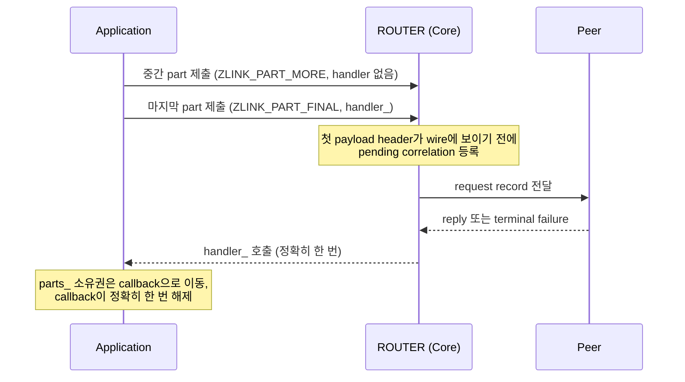

[English](https://zlink-systems.github.io/zlink/spec/core/socket/07-router/) | 한국어

<!-- zlink-nav:start -->
[소켓 목차](README.ko.md) | [이전: DEALER](06-dealer.ko.md) | [다음: STREAM](08-stream.ko.md)
<!-- zlink-nav:end -->

# Socket — ROUTER

> **이 장이 정의하는 것** — ROUTER 소켓의 routing id 기반 응답 라우팅과
> [result/errno](../03-errors.ko.md#result와-errno-대응) 공개 계약.

## 1. ROUTER 개요

ROUTER는 하나의 [socket](../glossary.ko.md#socket)에서 여러 peer와의 연결(pipe)을 관리하고,
peer를 식별하는 byte 열인 routing ID로 송신 대상을 선택하는 비동기 raw socket이다. 일반
directed message와 수신 request record를 처리한다. routing ID를 전달하는 타입
`zlink_routing_id_t`의 계약은 [Message](../02-message.ko.md#zlink_routing_id_t)가 소유한다.

관련 계약의 소유 문서는 다음과 같다.

| 관련 계약 | 정의하는 문서 |
|---|---|
| socket 생성·공통 옵션·`zlink_socket_set_receive_flow_state` 함수 선언 | [Socket 공통](README.ko.md) |
| routing ID 타입(`zlink_routing_id_t`) | [Message](../02-message.ko.md#zlink_routing_id_t) |
| Request-reply kind, sequence와 ZMP header byte 배치·검증 | [ZMP](../protocol/01-zmp.ko.md) |
| 각 result와 errno 대응, receive flow state 결과 표 | [Errors](../03-errors.ko.md) |
| ROUTER와 pair를 이루는 상대 socket | [DEALER](06-dealer.ko.md) |
| socket status snapshot | [Monitoring](../06-monitoring.ko.md) |

## 2. Raw receive record 구분

ROUTER receive API는 [DEALER](06-dealer.ko.md)의 `zlink_dealer_message_type_t`를 반환하지
않는다. 다음 output 조합으로 일반 raw record와 reply가 필요한 request record를 구분한다.

| record | `source_node_rid_out_` | `request_seq_out_` |
|---|---|---:|
| 일반 raw multipart | 송신 peer의 routing ID | `0` |
| 수신 request | 송신 peer의 routing ID | 0이 아닌 reply sequence |

`zlink_router_request_part()`로 시작한 request의 reply와 terminal failure는 receive record로
반환하지 않고 `zlink_reply_handler_fn` completion으로만 전달된다.

Core는 ZMP header에서 복원한 request kind와 wire sequence를 첫 payload part에 내부 값으로
보존한다. `zlink_router_recv_part()`와 `_v2()`는 request kind만 reply 가능한 record로 해석하고,
source routing ID·source pipe와 wire sequence를 함께 저장한다. 같은 routing ID의 duplicate나
standby connection이 있어도 reply는 request를 전달한 바로 그 source pipe로 돌아간다.

Typed receive에 reply나 error reply가 도착하면 `EPROTO`로 pair를 종료하고 payload를 반환하지
않는다. `zlink_router_recv_part()`와 `_v2()`가 data나 request payload를 application에 넘길
때는 내부 kind와 sequence를 먼저 제거한다. 따라서 받은 part를 raw send에 다시 사용하면
ordinary data가 된다. 공통 `zlink_recv_part()`는 ROUTER receive를 지원하지 않는다.

`source_node_rid_out_`은 Core가 소유한 thread-local view다. 호출자는 이를 해제하지 않으며, 다음 raw
receive 호출 뒤에도 보관해야 하면 값을 복사한다. 같은 thread에서 다음 receive 호출을 시작하면 앞서
반환된 view는 더 이상 유효하지 않다. 한 multipart record의 모든 part에는 같은 routing ID와 request
sequence가 반환된다.

## 3. Part sequence와 소유권

`*_part` send 호출은 `ZLINK_PART_MORE`부터 `ZLINK_PART_FINAL`까지 하나의 multipart sequence를
구성한다. 열린 sequence가 있는 동안 같은 handle에서 다른 send helper family나 다른 routing ID를
섞을 수 없다.

초기화된 유효한 `part_`를 send API에 넘기면 함수는 성공과 실패 모두에서 그 message 내용을
소비하고 길이 0인 초기화 상태로 둔다. 따라서 호출 결과와 관계없이 호출자가 전송 전 payload를
다시 읽거나 같은 내용을 다시 보낼 수 없다. 다시 보내야 하는 payload는 호출 전에 별도 message로
보관해야 한다.

각 send helper family는 성공한 중간 part를 `ZLINK_PART_FINAL`이 성공할 때까지 하나의 record로
staging한다. 열린 sequence의 중간 또는 마지막 submit이 실패하면 Core는 이전에 staging한 part와
실패한 part를 원자적으로 폐기하고 sequence를 닫는다. peer에는 그 record의 어떤 part도 보이지
않는다. 실패한 호출의 `part_`도 소비되며 다음 submit은 새 record의 첫 part로 시작한다. 실패한
request submit은 request sequence를 만들지 않고 handler도 호출하지 않는다. reply sequence가 실패하면
reply token과 peer RID 조합은 성공한 `ZLINK_PART_FINAL`이나 request lifecycle 종료 전까지 유효하므로 caller가
보관한 전체 reply를 첫 part부터 다시 제출할 수 있다.

Request와 reply의 첫 application part에 non-empty message group이 있으면 내부 request metadata를
동시에 저장할 수 없으므로 전체 submission을 `ZLINK_SUBMIT_INVALID_ARGUMENT`와 `EINVAL`로
거부한다. 전달한 C part는 같은 소비 규칙을 따르고, staged part·pending request·reply target은
남지 않는다.

receive API의 `part_out_`은 호출 전에 초기화된 `zlink_msg_t`여야 한다. 성공하면 수신 part의
소유권이 호출자에게 이동하며 호출자는 `zlink_msg_close()`로 정확히 한 번 해제한다. 실패하면
수신 part 소유권은 이동하지 않는다.

## 4. 공개 타입

다음 숫자는 공개 ABI 값이다.

```c
typedef enum zlink_router_option_t {
  ZLINK_ROUTER_OPT_MANDATORY          = 0x3101,  // int, 0=off, 양수=on, getter는 0/1 반환, 기본 1. 미연결 routing ID의 directed submit 실패 여부
  ZLINK_ROUTER_OPT_PROBE              = 0x3103,  // int, 0=off, 양수=on, getter는 0/1 반환, 기본 0. 연결 설정 시 빈 raw message로 peer가 연결·routing ID 관찰
  ZLINK_ROUTER_OPT_CONNECT_ROUTING_ID = 0x3104,  // 가변 길이 byte string, set 전용. 다음 zlink_connect() pipe의 local alias
  ZLINK_ROUTER_OPT_REQUEST_TIMEOUT_MS = 0x3105,  // 0 이상인 int (millisecond), 기본 5000. request의 timeout_ms_ == 0일 때 기본 timeout
  ZLINK_ROUTER_OPT_WEIGHT             = 0x3106   // int, 0..10000, 기본 100. 연결된 peer에 알리는 이 ROUTER의 가중치
} zlink_router_option_t;

typedef enum zlink_part_flag_t {
  ZLINK_PART_FINAL = 0,  // 현재 part가 record의 마지막
  ZLINK_PART_MORE  = 1   // 같은 multipart record에 뒤따르는 part가 있음
} zlink_part_flag_t;

typedef void (*zlink_reply_handler_fn)(
  zlink_request_result_t result_,
  zlink_msg_t *parts_,
  size_t part_count_,
  void *userdata_);
```

`ZLINK_PART_MORE`는 같은 multipart record에 뒤따르는 part가 있음을 뜻한다.
`ZLINK_PART_FINAL`은 현재 part가 마지막임을 뜻한다. receive API의 `has_more_out_`도 같은 값을
사용한다.

## 5. ROUTER option

```c
ZLINK_EXPORT zlink_config_result_t zlink_set_router_option(
  void *handle_,
  zlink_router_option_t option_,
  const void *optval_,
  size_t optvallen_);

ZLINK_EXPORT zlink_config_result_t zlink_get_router_option(
  void *handle_,
  zlink_router_option_t option_,
  void *optval_,
  size_t *optvallen_);
```

각 option의 값 형식·범위·기본값은 [§4](#4-공개-타입)의 인라인 주석이 정의한다. 주석에
담기지 않는 계약은 다음과 같다.

- `ZLINK_ROUTER_OPT_MANDATORY`가 양수이면 연결된 pipe가 없는 routing ID의 directed submit을
  `ZLINK_SUBMIT_NOT_CONNECTED`로 실패시킨다.
- `ZLINK_ROUTER_OPT_CONNECT_ROUTING_ID`는 다음 `zlink_connect()`로 만든 pipe를 식별할 local
  alias를 설정하며, 각 connect 전에 설정한다.

`zlink_get_router_option()`을 호출할 때 `*optvallen_`은 `optval_`의 입력 용량이다. 성공하면 실제로
쓴 byte 수로 갱신된다. ROUTER 전용이 아닌 [HWM](../glossary.ko.md#hwm)(queue 보관 byte 상한),
reconnect와 timeout option은 `zlink_set_option()`과 `zlink_get_option()`을 사용한다.

`ZLINK_ROUTER_OPT_WEIGHT`는 이 ROUTER를 peer가 outbound 후보로 선택할 때 사용할 절대값이다.
ROUTER와 DEALER는 자기 값을 독립적으로 알리므로 각 방향은 상대 socket이 알린 값을 사용한다.

공개 weight 결과는 다음 순서를 따른다.

1. Bind·connect 전에 설정한 값은 paired Application pipe가 ready 된 뒤 적용된다.
2. Dynamic 변경은 `0`을 포함한 새 절대값을 peer scheduler에 적용한다.
3. 실제 값이 바뀌면 `PEER_WEIGHT_CHANGED`가 값과 paired Application pipe의 lane·pair ID·generation을
   제공한다. 같은 값을 반복 설정하면 event를 추가로 만들지 않는다.
4. Reconnect 뒤에는 현재 설정값을 새 generation에 적용한다.

Network wire, inproc 전달, CONTROL 크기 경계, multipart defer와 exact-pipe lifetime·stale 전달
소유권은 [ZMP transport pair](../protocol/01-zmp.ko.md#41-request-reply-transport-pair),
[decode](../protocol/01-zmp.ko.md#7-decode-유효성-검사),
[peer-weight owner](../protocol/01-zmp.ko.md#peer-weight-control) 계약이 정의한다. 어느 transport
경로도 public receive나 Completion lane에 weight record를 만들지 않는다.

Multipart가 pipe를 선택한 뒤 적용값이 `0`이 되어도 그 message는 같은 pipe에서 FINAL까지
완료한다. 다음 message 선택부터 그 pipe를 제외한다.

Remote weight가 실제로 바뀌면 exact pipe의 보류된 `zlink_send_async()` 작업을 다시 평가한다.
Message 시작 전에 weight가 `0`이 되면 completion은 `ZLINK_SEND_TERMINAL`이고
`terminal_errno == ECONNREFUSED`다. `0`에서 양수로 바뀌면 다른 write-activation event 없이
재시도할 수 있다.

Active duplicate는 standby 동안 자기 최신 값을 보관하고 나중에 같은 pipe가 선택되면 사용한다.
Application 최대값을 10 byte보다 작게 설정해도 pair readiness·FLOWSTATE·WEIGHT 전달은 막히지
않으며, 잘못된 CONTROL의 동작은 ZMP가 소유한다.

## 6. Directed raw send

```c
ZLINK_EXPORT zlink_submit_result_t zlink_send_part_rid(
  void *s_,
  const zlink_routing_id_t *target_rid_,
  zlink_msg_t *part_,
  zlink_send_flags_t flags_,
  zlink_part_flag_t part_flag_);
```

`target_rid_`의 peer에 일반 raw multipart part를 보낸다. 모든 part에 같은 target을 사용해야 한다.
`flags_`는 `ZLINK_SEND_FLAGS_NONE` 또는 `ZLINK_SEND_FLAGS_DONTWAIT`다. 이 API는 request sequence나
completion handler를 만들지 않는다.

Binding이 routed 비동기 admission을 준비할 때는 다음 API로 현재 RID route의 exact application
pipe identity를 얻는다.

```c
ZLINK_EXPORT zlink_submit_result_t zlink_select_routed_submit_target(
  void *socket_,
  const zlink_routing_id_t *router_rid_or_null_,
  zlink_routed_submit_target_t *target_out_);

ZLINK_EXPORT zlink_submit_result_t zlink_send_part_transport_pair(
  void *s_,
  const zlink_routing_id_t *target_rid_,
  uint64_t transport_pair_id_,
  uint64_t transport_pair_generation_,
  zlink_msg_t *part_,
  zlink_send_flags_t flags_,
  zlink_part_flag_t part_flag_);
```

ROUTER는 `router_rid_or_null_`에 대상 RID를 요구한다. 선택은 pipe나 credit을 예약하지 않는 값
snapshot이다. Exact submit은 RID·pair ID·generation이 같은 현재 application pipe에만 제출하며,
HWM이면 `ZLINK_SUBMIT_BACKPRESSURED`, detach나 stale generation이면
`ZLINK_SUBMIT_NOT_CONNECTED`를 반환한다. 같은 RID의 다른 pipe로 재선택하지 않는다. Multipart 첫
part가 수용되면 남은 part를 그 exact pipe로만 보내는 fence를 FINAL까지 유지하고, 실패 시 전체
record를 rollback한다. Binding이 이 multipart 시도를 어떻게 직렬화하는지는
[내부 구조](#12-내부-구조)가 설명한다.

## 7. Raw request submit

```c
ZLINK_EXPORT zlink_submit_result_t zlink_router_request_part(
  void *router_,
  const zlink_routing_id_t *peer_rid_,
  zlink_msg_t *part_,
  zlink_send_flags_t flags_,
  zlink_part_flag_t part_flag_,
  uint32_t timeout_ms_,
  zlink_reply_handler_fn handler_,
  void *userdata_);

ZLINK_EXPORT zlink_submit_result_t zlink_router_request_transport_pair_part(
  void *router_,
  const zlink_routing_id_t *peer_rid_,
  uint64_t transport_pair_id_,
  uint64_t transport_pair_generation_,
  zlink_msg_t *part_,
  zlink_send_flags_t flags_,
  zlink_part_flag_t part_flag_,
  uint32_t timeout_ms_,
  zlink_reply_handler_fn handler_,
  void *userdata_);
```

`peer_rid_`에 비동기 request payload를 part 단위로 제출한다. 중간 part는
`ZLINK_PART_MORE`, `timeout_ms_ == 0`, `handler_ == NULL`, `userdata_ == NULL`로 호출한다. 마지막
part는 `ZLINK_PART_FINAL`과 0이 아닌 `handler_`를 사용한다. 마지막 호출의 `timeout_ms_ == 0`은
`ZLINK_ROUTER_OPT_REQUEST_TIMEOUT_MS` 기본값을 사용한다.

마지막 submit이 `ZLINK_SUBMIT_OK`이면 completion은 정확히 한 번 `handler_`로 전달된다. submit이
실패하면 handler를 호출하지 않는다. callback의 `parts_`와 각 message의 소유권은 callback으로
이동하며 callback은 이를 정확히 한 번 해제한다. 유효한 error reply에서는 첫 4 byte Big Endian
errno part를 제외한 나머지 part와 errno를 매핑한 non-OK `zlink_request_result_t`를 전달한다.
Error reply의 첫 part가 없거나 크기가 4 byte가 아니거나 값이 `0`이면
`ZLINK_REQUEST_PROTOCOL_ERROR`와 part 수 `0`을 전달한다.



위 diagram은 마지막 submit이 성공한 정상 경로다. submit이 실패하면 handler를 호출하지 않고
[§3](#3-part-sequence와-소유권)의 폐기 규칙을 따른다.

Exact target request는 `zlink_router_request_transport_pair_part()`를 사용한다. RID와 pair
identity 검증, no-reroute, multipart fence와 rollback은 exact raw submit과 같다. Core는 첫
payload의 ZMP header에 request kind와 sequence가 나타나기 전에 pending correlation을 등록하며, submit 실패 시 그 pending entry와
completion reservation을 제거하고 handler를 호출하지 않는다. Binding 쪽 시도 직렬화는 raw
send와 같으며 [내부 구조](#12-내부-구조)가 설명한다.

## 8. Raw request와 message receive

```c
ZLINK_EXPORT zlink_recv_result_t zlink_router_recv_part(
  void *router_,
  const zlink_routing_id_t **source_node_rid_out_,
  uint64_t *request_seq_out_,
  zlink_msg_t *part_out_,
  zlink_part_flag_t *has_more_out_,
  zlink_recv_flags_t flags_);

ZLINK_EXPORT zlink_recv_result_t zlink_router_recv_part_v2(
  void *router_,
  const zlink_routing_id_t **source_node_rid_out_,
  uint64_t *request_seq_out_,
  uint64_t *transport_pair_id_out_,
  uint64_t *transport_pair_generation_out_,
  zlink_msg_t *part_out_,
  zlink_part_flag_t *has_more_out_,
  zlink_recv_flags_t flags_);
```

완전한 raw record에서 part 하나를 반환한다. 모든 output pointer는 필수다. `flags_`는
`ZLINK_RECV_FLAGS_NONE` 또는 `ZLINK_RECV_FLAGS_DONTWAIT`다. non-blocking 호출에 받을 record가 없으면
`ZLINK_RECV_NO_DATA`와 `EAGAIN`을 반환한다.

`has_more_out_ == ZLINK_PART_MORE`이면 다음 호출로 같은 record의 다음 part를 받아야 한다.
`zlink_router_recv_part_v2()`는 같은 receive·ownership 계약에 source transport pair ID와 generation을
추가한다. 같은 record의 모든 part는 동일한 RID·pair ID·generation을 반환하며, caller는 reply와
exact-target 후속 operation에 이 snapshot을 다른 pair로 재선택하지 않고 사용한다.
`ZLINK_PART_FINAL`이면 record 수신이 끝난다. reply가 필요한지는
[§2](#2-raw-receive-record-구분)의 output 조합으로 판단한다.

반환한 payload에는 internal request metadata가 없다. Multipart request의 첫 part에서 얻은
routing ID, pair identity와 request sequence는 같은 record의 나머지 part에 반복해서 반환하되,
message 자체에는 보존하지 않는다.

## 9. Raw reply submit

```c
ZLINK_EXPORT zlink_submit_result_t zlink_router_reply_part(
  void *router_,
  const zlink_routing_id_t *peer_rid_,
  uint64_t request_seq_,
  zlink_msg_t *part_,
  zlink_part_flag_t part_flag_);
```

`zlink_router_recv_part()`로 받은 request에 reply part를 보낸다. `peer_rid_`와 0이 아닌
`request_seq_`는 수신 record가 반환한 값을 그대로 사용한다. 여러 part로 reply할 때 모든 호출에서
같은 두 값을 사용한다. `ZLINK_PART_FINAL`이 성공하면 reply가 완료된다.

Core는 첫 reply payload의 ZMP header에 reply kind와 `request_seq_`를 기록한다. Public API가
sequence를 payload part로 추가하지 않으므로 peer의 completion callback은 application이 넘긴
part만 받는다.

Raw reply와 error reply는 terminal reply의 진행만 담당하고 HWM admission에서 빠지는 별도
경로인 [completion progress lane](../glossary.ko.md#completion-progress-lane)에 한 번만
submit한다. 이 lane은 application byte HWM, manual HWM, LWM과 Core budget reservation의 대상이
아니므로 이 함수는 그 capacity를 이유로 `ZLINK_SUBMIT_BACKPRESSURED`를 반환하지 않으며
readiness 대기나 재시도 경로에 진입하지 않는다. 연결, lifecycle, argument,
state와 allocation failure는 호출 시점의 해당 `zlink_submit_result_t`로 즉시 끝난다.

reply 대상 경로가 없으면 결과는 `ZLINK_SUBMIT_NOT_CONNECTED`이고 `errno`는 `ENOTCONN`이다.
대상 completion pipe를 찾지 못한 경우와, 이미 선택한 대상이 reply를 커밋하는 도중 사라진
경우에 같은 규칙을 적용한다. 이 실패는 backpressure가 아니므로 `ZLINK_POLLOUT`이 서더라도
이 one-shot reply의 재시도가 가능해지지 않는다. 두 경우 모두 이미 전달한 part는 소비되고
호출자에게 되돌아가지 않는다.

Completion progress lane은 유효한 receive-flow control을 application kind보다 먼저 처리한다.
Reply와 error reply는 sequence에 해당하는 pending request 하나를 완료한다. Data나 request가
이 lane에 도착하면 해당 frame으로 callback을 호출하지 않고 `EPROTO`로 pair를 종료하며, 기존
pending request는 pair 종료에 따른 disconnect 결과로 각각 한 번 완료된다.

## 10. Result와 readiness

submit은 `zlink_submit_result_t`, receive는 `zlink_recv_result_t`, option은
`zlink_config_result_t`를 반환한다. 각 result와 `zlink_errno()`의 대응은
[errno map](../03-errors.ko.md#result와-errno-대응)을 따른다.

ROUTER의 `ZLINK_POLLIN`은 완전한 raw record를 수신할 수 있음을 뜻한다. Ordinary send와 request에서
`ZLINK_POLLOUT`은 [backpressure](../glossary.ko.md#backpressure)(수신 측이 따라오지 못해 추가
제출이 제한되는 상태) 뒤 submit을 다시 시도할 가치가 있음을 나타내지만 다음 submit
성공을 보장하지 않는다. operation별 확정 답이 필요한 앱은 `zlink_send_async`와 그 완료 통지를
쓴다. 이 readiness 계약은 raw reply에 적용하지 않는다.

## 11. Receive flow state

Completion lane으로 [DEALER](06-dealer.ko.md) peer와 pair를 이룬 ROUTER는 그 peer들에게 자신에게
보내는 전송을 멈추고 다시 시작하라고 요청할 수 있다. `zlink_socket_set_receive_flow_state()`는
socket 전체에 적용되는 상태 하나를 저장한다. 함수 선언은 [Socket 공통](README.ko.md)이, 결과 표는
[Errors](../03-errors.ko.md)가 소유한다.

이 상태는 routing ID가 아니라 socket에 속한다. Peer별 flow-state 호출은 없다. 한 번 호출하면
이 ROUTER의 ready transport pair마다 completion lane으로 상태를 전달하므로 모든 peer가 같은
상태를 받고, 나중에 ready가 된 peer도 새 completion lane으로 socket의 현재 상태를 받는다.
Routing ID는 send의 목적지를 고르는 값이며 receive-flow 상태를 고르지 않는다.

이 상태는 counter가 아니라 절대값이다. 현재 상태를 다시 설정하면 성공하고 아무것도 보내지
않는다.

각 상태 변경은 한 connection generation 안에서 증가하는 flow epoch를 함께 보내고, 각 frame은
자신이 기록된 pair id와 generation을 담는다. Frame은 수신 pipe의 현재 pair와 generation을
지칭하고 epoch가 그 generation에서 마지막으로 수락한 epoch보다 클 때만 적용한다. 다른 pair
ID, pair ID·generation이 `0`, transport-pair table에 없는 pair 또는 등록된 completion pipe가
아닌 pipe의 frame은 event 없이 소비한다. 현재 pair ID에서 generation이 일치하지 않거나 같은
generation의 epoch가 중복·역행한 경우에만 frame을 적용하지 않고
`ZLINK_EVENT_FLOW_STATE_STALE`로 보고한다. Routing ID는 재연결 후에도 유지되지만 pair
generation은 유지되지 않으므로, peer가 재연결 전에 알린 상태가 그것을 대체한 connection에
적용되는 일은 없다. 새 generation은 pair가 ready가 될 때 socket이 보내는 상태에서 시작한다.

Remote PAUSE는 pause한 peer로 보내는 전송만 막고 다른 peer로 가는 route에는 영향이 없다.
이는 byte HWM, transport wait, termination과 합성되는 독립적인 차단 요인이므로 해제만으로
다음 send가 수락되지는 않는다. Send 결과와 readiness는 그대로다. 차단된 non-blocking send는
계속 `errno == EAGAIN`과 함께 `ZLINK_SUBMIT_BACKPRESSURED`를 보고하고, mandatory routing은
[§6](#6-directed-raw-send)이 정의한 동작을 유지한다.

Remote PAUSE는 다음 message 경계부터 적용하며 multipart record를 쪼개지 않는다. 이 ROUTER가
routing ID part를 이미 수락한 record는 남은 part를 끝까지 보낸 뒤에 pause가 적용된다.

[Monitoring](../06-monitoring.ko.md)의 status snapshot은 현재 pause 상태인 peer 수와 함께
socket 전체의 적용된 전이 수, stale 수, pause 길이를 제공한다.

## 12. 내부 구조

> **이 절의 계약 소유** — directed·exact submit과 request submit의 공개 계약은
> [§6](#6-directed-raw-send)과 [§7](#7-raw-request-submit)이 소유한다. 이 절은 binding이 그
> 계약 위에서 multipart 시도를 어떻게 직렬화하는지 설명한다.

Part 호출마다 public API scope가 따로이므로 binding은 첫 part부터 FINAL까지 한 번의
`DONTWAIT` 시도 동안만 socket-local attempt gate를 유지한다. 실패하면 Core sequence
rollback 뒤 gate를 즉시 해제하고, `BACKPRESSURED` readiness 대기 중에는 보유하지 않는다.
Request submit도 raw send와 같은 짧은 socket-local attempt gate 아래에서 첫 request part부터
FINAL까지 한 번 시도한다. 이 gate는 새 Core multipart API나 공개 FIFO 계약이 아니다.

## 13. 구현 및 contract test 검증 요구

공개 표면(ROUTER send·request·receive·reply 함수, ROUTER option set·get, 반환값·errno,
`zlink_reply_handler_fn` completion, event·status snapshot)만으로 다음을 확인한다. 각 항목은
test 하나로 이어진다.

**Option**
- `zlink_get_router_option()` 호출 시 `*optvallen_`은 입력 용량이며, 성공하면 실제로 쓴 byte 수로 갱신된다.
- 각 option의 기본값이 조회된다 — `MANDATORY` `1`, `PROBE` `0`, `REQUEST_TIMEOUT_MS` `5000`, `WEIGHT` `100`.
- `ZLINK_ROUTER_OPT_MANDATORY`가 양수이면 연결된 pipe가 없는 routing ID의 directed submit이 `ZLINK_SUBMIT_NOT_CONNECTED`로 실패하고, getter는 `0` 또는 `1`을 반환한다.
- `ZLINK_ROUTER_OPT_PROBE`가 양수이면 연결을 설정할 때 빈 raw message가 전송되어 peer가 연결과 routing ID를 관찰할 수 있고, getter는 `0` 또는 `1`을 반환한다.
- `ZLINK_ROUTER_OPT_CONNECT_ROUTING_ID`를 connect 전에 설정하면 다음 `zlink_connect()`로 만든 pipe를 그 local alias로 식별한다.

**Peer weight 전달**
- Bind·connect 전에 ROUTER와 상대 DEALER의 weight를 서로 다른 값으로 설정하면 pair가 ready 된
  뒤 양쪽 scheduler가 상대의 정확한 값을 사용하며, `0`인 peer는 outbound 후보에서 제외된다.
- Network와 inproc pair가 ready 된 뒤 양쪽 weight를 동적으로 바꾸면 monitor의
  `PEER_WEIGHT_CHANGED`가 새 값을 `value`로 제공하고, event의 transport lane·pair ID·generation은
  값을 적용한 paired Application pipe와 같다.
- Weight를 설정하거나 동기화해도 public receive와 Completion lane에는 application record가
  추가되지 않으며, 같은 값을 다시 설정해도 monitor event가 중복 발생하지 않는다.
- Application multipart가 열린 동안 weight를 여러 번 바꿔도 peer에는 multipart가 atomic record
  하나로 보이며, FINAL 또는 rollback 뒤에는 가장 최근 값만 반영된다.
- Application multipart의 첫 part를 받은 뒤 pipe의 remote weight가 `0`이 되어도 같은 pipe가
  FINAL까지 남은 part를 전달하고, 다음 message 선택부터 제외된다.
- Remote weight 변경은 exact pipe의 보류된 `zlink_send_async()` 작업을 다시 평가한다. Message
  시작 전에 weight가 `0`이 되면 completion은 `ZLINK_SEND_TERMINAL`이고
  `terminal_errno == ECONNREFUSED`다. `0`에서 양수로 바뀌면 다른 write-activation event 없이
  재시도할 수 있다.
- Application 최대값을 10 byte보다 작게 설정해도 pair readiness·FLOWSTATE와 peer 선택·monitor로
  관찰하는 weight 변경은 막히지 않는다.
- Reconnect 뒤 peer 선택과 monitor는 새 generation의 현재 weight를 반영한다. Active standby를
  승격하면 그 standby가 마지막으로 받은 값을 사용한다.

**Record 구분과 receive**
- 일반 raw record는 `request_seq_out_ == 0`, 수신 request는 0이 아닌 reply sequence를 반환한다.
- 한 multipart record의 모든 part에 같은 routing ID와 request sequence가 반환되고, `zlink_router_recv_part_v2()`는 같은 record의 모든 part에 동일한 pair ID·generation을 추가로 반환한다.
- `zlink_router_request_part()`로 시작한 request의 reply와 terminal failure는 receive record로 반환되지 않고 `zlink_reply_handler_fn`으로 전달된다.
- non-blocking receive에 받을 record가 없으면 `ZLINK_RECV_NO_DATA`와 `EAGAIN`이다.
- receive 성공 시 part 소유권이 호출자에게 이동해 `zlink_msg_close()` 한 번으로 해제하고, 실패 시 소유권은 이동하지 않는다.
- `has_more_out_ == ZLINK_PART_MORE`이면 다음 호출이 같은 record의 다음 part를 반환하고, `ZLINK_PART_FINAL`이면 record 수신이 끝난다.
- `zlink_router_recv_part()`와 `_v2()`에 reply나 error reply가 도착하면 payload를 반환하지 않고 `EPROTO`로 pair를 종료한다.
- `zlink_router_recv_part()`와 `_v2()`가 반환한 data 또는 request payload를 raw send에 다시 사용해도 request-reply 의미가 나타나지 않는다.
- 공통 `zlink_recv_part()`에 ROUTER를 넘기면 지원하지 않는 receive surface로 거부한다.
- Explicit RID와 duplicate·standby peer가 있는 ROUTER가 request를 받으면, request를 보낸 peer connection에서만 reply가 관찰되고 원래 request 하나만 완료되며 같은 RID의 다른 peer는 reply를 받지 않는다.

**Part sequence**
- send API는 성공·실패 모두에서 `part_` 내용을 소비하고 길이 0인 초기화 상태로 둔다 — 실패 후에도 같은 `part_`로 재전송할 수 없다.
- 열린 sequence의 중간 또는 마지막 submit이 실패하면 peer에는 그 record의 어떤 part도 보이지 않고, 다음 submit은 새 record의 첫 part로 시작한다.
- 실패한 request submit은 request sequence를 만들지 않고 handler도 호출하지 않는다.
- reply sequence가 실패해도 reply token과 peer RID 조합은 성공한 `ZLINK_PART_FINAL`이나 request lifecycle 종료 전까지 유효하며, 보관한 전체 reply를 첫 part부터 다시 제출할 수 있다.
- Request나 reply의 첫 part에 non-empty group이 있으면 `ZLINK_SUBMIT_INVALID_ARGUMENT`와 `EINVAL`이며 입력 part는 소비되고 peer에는 그 record의 part가 전달되지 않는다. 실패한 request의 handler는 호출되지 않으며, 실패한 reply는 같은 source routing ID와 request sequence로 group이 없는 payload를 다시 제출할 수 있다.

**Directed·exact submit**
- `zlink_send_part_rid()`는 request sequence나 completion handler를 만들지 않는다.
- Exact submit은 RID·pair ID·generation이 같은 현재 application pipe에만 제출한다 — HWM이면 `ZLINK_SUBMIT_BACKPRESSURED`, detach나 stale generation이면 `ZLINK_SUBMIT_NOT_CONNECTED`이고, 같은 RID의 다른 pipe로 재선택하지 않는다.
- Multipart 첫 part가 수용된 뒤 실패하면 전체 record가 rollback되어 peer에 부분 record가 보이지 않는다.

**Request completion**
- 마지막 submit이 `ZLINK_SUBMIT_OK`이면 completion이 정확히 한 번 `handler_`로 전달되고, submit이 실패하면 handler를 호출하지 않는다.
- 마지막 호출의 `timeout_ms_ == 0`은 `ZLINK_ROUTER_OPT_REQUEST_TIMEOUT_MS` 기본값을 사용한다.
- callback의 `parts_`와 각 message의 소유권은 callback으로 이동하며 callback이 정확히 한 번 해제한다.
- 유효한 error reply는 errno를 매핑한 non-OK `zlink_request_result_t`와 errno part 뒤의 payload를 Core C callback에 전달하며, 없거나 크기가 4 byte가 아니거나 값이 `0`인 errno part는 `ZLINK_REQUEST_PROTOCOL_ERROR`와 part 수 `0`으로 완료한다.
- exact request submit이 실패하면 handler가 호출되지 않고, 이후 그 request에 대한 어떤 completion도 전달되지 않는다.

**Reply와 completion lane**
- `zlink_router_reply_part()`는 수신 record가 반환한 `peer_rid_`·`request_seq_`를 그대로 사용하며, `ZLINK_PART_FINAL`이 성공하면 reply가 완료된다.
- raw reply와 error reply는 completion lane capacity를 이유로 `ZLINK_SUBMIT_BACKPRESSURED`를 반환하지 않으며, 연결·lifecycle·argument·state·allocation failure는 호출 시점의 해당 `zlink_submit_result_t`로 즉시 끝난다. 대상 경로가 없으면(대상 completion pipe 미발견, 또는 커밋 도중 대상 소멸) `errno == ENOTCONN`과 함께 `ZLINK_SUBMIT_NOT_CONNECTED`를 반환하며, 이는 backpressure가 아니므로 `ZLINK_POLLOUT`으로 재시도가 가능해지지 않는다.
- Completion progress lane의 reply나 error reply는 일치하는 public request completion을 한 번 호출하고, data나 request는 callback payload로 전달하지 않은 채 `EPROTO`로 pair를 종료한다.

**Readiness**
- `ZLINK_POLLIN`은 완전한 raw record를 수신할 수 있을 때 서고, `ZLINK_POLLOUT`은 backpressure 뒤 재시도 가치를 나타낼 뿐 다음 submit 성공을 보장하지 않는다.
- readiness 계약은 raw reply에 적용되지 않는다.

**Receive flow state**
- 현재 상태를 다시 설정하면 성공하고 아무것도 보내지 않는다.
- 한 번의 호출로 모든 ready transport pair가 같은 상태를 받고, 나중에 ready가 된 peer도 socket의 현재 상태를 받는다.
- 다른 pair ID, pair ID·generation이 `0`, 미등록 transport pair 또는 등록된 completion pipe가 아닌 pipe의 frame은 event 없이 소비된다. `ZLINK_EVENT_FLOW_STATE_STALE`은 현재 pair ID의 generation 불일치와 같은 generation의 중복·역행 epoch에만 발생한다.
- peer가 재연결 전에 알린 상태는 그것을 대체한 connection에 적용되지 않는다.
- Remote PAUSE는 pause한 peer로 보내는 전송만 막는다 — 다른 peer로 가는 route는 영향이 없고, 차단된 non-blocking send는 `errno == EAGAIN`과 함께 `ZLINK_SUBMIT_BACKPRESSURED`를 보고하며, PAUSE 해제만으로 다음 send가 수락되지는 않는다.
- Remote PAUSE는 다음 message 경계부터 적용된다 — routing ID part를 이미 수락한 record는 남은 part를 끝까지 보낸 뒤 pause가 적용된다.
- [Monitoring](../06-monitoring.ko.md) status snapshot이 현재 pause 상태인 peer 수, socket 전체의 적용된 전이 수, stale 수, pause 길이를 제공한다.

<!-- zlink-nav:start -->
[소켓 목차](README.ko.md) | [이전: DEALER](06-dealer.ko.md) | [다음: STREAM](08-stream.ko.md)
<!-- zlink-nav:end -->
