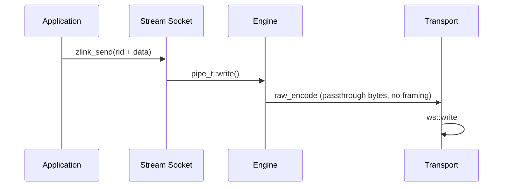

[한국어](https://zlink-systems.github.io/zlink/ko/spec/core/socket/08-stream/) | English

<!-- zlink-nav:start -->
[Socket Index](README.en.md) | [Previous: ROUTER](07-router.en.md) | [Next: Protocol Overview](../protocol/README.en.md)
<!-- zlink-nav:end -->

# Socket — STREAM

> **What this chapter defines** — the public contract for exposing raw TCP
> connections through a STREAM socket and for [result/errno](../03-errors.en.md#result-and-errno-mapping).

## 1. STREAM overview

STREAM is a [socket](../glossary.en.md#socket) that exchanges raw bytes with
external peers without zlink framing. It is a bind-only raw socket that assigns
a 4-byte routing ID—a byte sequence that identifies one connection—to each
accepted client connection, and it does not support `zlink_connect()`. The
application selects a client by routing ID when sending and reads the source
routing ID from receive results.

STREAM does not interpret application payloads or higher-level protocol
semantics. This document defines the generic raw STREAM public contract in
ZLink Core for C API and binding developers who send and receive byte records
or fixed-framing packets over routed TCP or WS connections.

The following documents own the related contracts.

| Related contract | Defining document |
|---|---|
| Socket creation and close, common options, asynchronous send admission details, and thread safety | [Socket Common](README.en.md) |
| Wire format for bytes carried without ZMP framing | [RAW (STREAM) Protocol Details](../protocol/02-raw.en.md) |
| Result values and errno mapping | [Errors](../03-errors.en.md#result-and-errno-mapping) |

## 2. Creation, bind, and options

```c
ZLINK_EXPORT void *zlink_socket (void *context_, zlink_socket_type_t type_);
ZLINK_EXPORT zlink_bind_result_t zlink_bind (void *s_, const char *addr_);
ZLINK_EXPORT zlink_close_result_t zlink_close (void *s_);

typedef enum zlink_stream_option_t
{
    ZLINK_STREAM_OPT_NOTIFY = 0x3501  // Receive connect/disconnect notification records (int 0|1, set before bind)
} zlink_stream_option_t;

ZLINK_EXPORT zlink_config_result_t zlink_set_stream_option (
  void *handle_, zlink_stream_option_t option_,
  const void *optval_, size_t optvallen_);
ZLINK_EXPORT zlink_config_result_t zlink_get_stream_option (
  void *handle_, zlink_stream_option_t option_,
  void *optval_, size_t *optvallen_);
```

Create a STREAM socket with `zlink_socket(context_, ZLINK_SOCKET_STREAM)`.
`ZLINK_STREAM_OPT_NOTIFY` is an `int` with value 0 or 1 and must be set before
bind. A value of 1 exposes client connect and disconnect notifications as
zero-length data records, whose source routing IDs identify the affected
clients. The default is 0.

Common [HWM](../glossary.en.md#hwm), timeout, linger, TLS, and buffer options
use `zlink_set_option()` and `zlink_get_option()`. [Socket Common](README.en.md)
owns the contract for each option.

## 3. Receive modes

One STREAM handle uses only one of the following receive modes.

| Receive mode | Activation | Delivery form |
|---|---|---|
| Raw part receive | First call to `zlink_recv_part()` (default path) | The caller directly receives parts of raw records as they arrive in read units |
| Raw callback | Register `zlink_recv_handler()` | `zlink_socket_msg_handler_fn` receives raw records |
| Packet callback | Register `zlink_stream_packet_handler()` | Fixed-framing packets are assembled and delivered as separate header and body `zlink_msg_t` values |

The first raw part receive or handler registration fixes the receive mode.
Activating another receive mode or registering a handler again on the same
handle fails with a busy result and `errno == EBUSY`. Data-plane
`ZLINK_POLLIN` belongs to raw part receive mode. The send-completion callback
and `ZLINK_POLLOUT` are independent of the receive mode.

## 4. Routed part send

```c
ZLINK_EXPORT zlink_submit_result_t zlink_send_part_rid (
  void *s_,
  const zlink_routing_id_t *target_rid_,
  zlink_msg_t *part_,
  zlink_send_flags_t flags_,
  zlink_part_flag_t part_flag_);
```

STREAM sends one raw data part at a time to a target client. `target_rid_`
must be a valid 4-byte routing ID assigned to that connection by STREAM, and
`part_flag_` must be `ZLINK_PART_FINAL`. `ZLINK_PART_MORE` returns
`ZLINK_SUBMIT_NOT_SUPPORTED` with `errno == ENOTSUP`.

A STREAM send does not open a multipart sequence that groups multiple parts
into one logical message. After a `ZLINK_PART_MORE` failure, no part is staged,
and the next call is an independent single-part record. The atomic multipart
abort rule of other raw sockets therefore does not apply to STREAM.

Success consumes the contents of `part_`. When [backpressure](../glossary.en.md#backpressure)
limits submission and returns `ZLINK_SUBMIT_BACKPRESSURED` with
`errno == EAGAIN`, the contents remain with the caller and may be retried as
the same message. Other failures consume the contents. Preparing a copy of a
payload that may need to be reused before the call lets caller code handle
ownership uniformly regardless of the failure type.

Routed sending of a zero-length part to a valid `target_rid_` requests
termination of that peer connection instead of sending a byte record. Success
also consumes this zero-length part.

If the connection cannot be found, the function returns
`ZLINK_SUBMIT_NOT_CONNECTED`. See the [errno map](../03-errors.en.md#result-and-errno-mapping)
for the complete result mapping.

## 5. Raw part receive

```c
ZLINK_EXPORT zlink_recv_result_t zlink_recv_part (
  void *s_,
  const zlink_routing_id_t **source_rid_out_,
  zlink_msg_t *part_out_,
  zlink_part_flag_t *has_more_out_,
  zlink_recv_flags_t flags_);
```

`part_out_` must be an initialized message and is required together with
`has_more_out_`. `source_rid_out_` is optional. On success, it receives a
Core-owned borrowed view—a reference for temporarily reading memory owned by
Core—of the source client's routing ID. Copy this view before the next raw
receive if it must remain valid after that receive.

On success, ownership of the received part transfers to the caller, which
must call `zlink_msg_close(part_out_)` exactly once. A failure before a part is
received does not transfer ownership. `*has_more_out_` is `ZLINK_PART_MORE`
when another part follows and `ZLINK_PART_FINAL` for the last part. A
`ZLINK_DONTWAIT` call with no data returns `ZLINK_RECV_NO_DATA`.

## 6. Raw callback

```c
ZLINK_EXPORT zlink_handler_result_t zlink_recv_handler (
  void *s_, zlink_socket_msg_handler_fn handler_, void *userdata_);
```

Raw callback mode is supported only by STREAM. The source routing ID is a
borrowed view valid only during the callback. Ownership of every delivered
message part transfers to the callback, which must consume or close each part
exactly once. Registering a receive handler again or closing the same handle
from inside the callback fails with a busy result and `errno == EBUSY`.

## 7. Packet callback and framing

```c
typedef void (*zlink_stream_packet_handler_fn) (
  void *stream_,
  const zlink_routing_id_t *source_rid_,
  zlink_msg_t *header_,
  zlink_msg_t *body_,
  void *userdata_);

ZLINK_EXPORT zlink_handler_result_t zlink_stream_packet_handler (
  void *stream_, zlink_stream_packet_handler_fn handler_, void *userdata_);
```

Packet callback mode serves application protocols that place `header + body`
framing on top of the raw STREAM byte pipe—for example, an order-processing
gateway that carries a large payload after a small control header. Instead of
requiring every caller to implement the same length-prefix decoder and
buffering state machine, STREAM parses frames internally and passes already
allocated `zlink_msg_t` values to the callback.

### 7.1 Wire framing

Packet mode assembles the following frame in order on each client byte stream.

```text
+----------------+----------------+----------------+---------------+
| header_size:u16| body_size:u32  | header bytes   | body bytes    |
+----------------+----------------+----------------+---------------+
| big endian     | big endian     | exact length   | exact length  |
+----------------+----------------+----------------+---------------+
```

- `header_size` is a 2-byte big-endian unsigned 16-bit length.
- `body_size` is a 4-byte big-endian unsigned 32-bit length.
- Both payload lengths may be `0`. A packet with
  `header_size == 0 && body_size == 0` still invokes the callback, and the
  header and body are delivered as two valid zero-length `zlink_msg_t` values,
  not as `NULL`.
- Size checks apply only when `maxmsgsize` is set to a positive value (the
  default `-1` is unbounded). A `header_size`, `body_size`, or sum of both that
  exceeds the configured limit is treated as malformed framing (see
  [§7.3](#73-malformed-framing)).

### 7.2 Callback contract

- `source_rid_` is a borrowed view valid only while the callback runs. Copy it
  if it must be retained after the callback.
- `header_` and `body_` are always non-`NULL`, even when their wire sizes are
  `0`. Ownership of both messages transfers to the callback, which is
  responsible for consuming or closing each one exactly once with
  `zlink_msg_close()`.
- Packets from the same `source_rid_` are serialized. A later packet from the
  same peer cannot overtake an earlier one. Packets from different
  `source_rid_` values may be dispatched in parallel on different worker
  threads.
- Self-close inside the callback follows the same rule as the raw
  `zlink_recv_handler` case. Attempting to change the receive mode or close the
  socket from inside the callback fails with `EBUSY`.

### 7.3 Malformed framing

STREAM treats the following conditions as malformed and closes the affected
connection.

- `header_size`, `body_size`, or `header_size + body_size` exceeds a positive
  configured `maxmsgsize`.
- The length fields have started to arrive, but the peer closes or resets
  before the full packet arrives—that is, a mid-length or mid-payload close.

The STREAM monitor exposes this condition as a disconnect event for that
`source_rid`. An incomplete packet is never delivered to the callback, and
the decoder state is discarded with the connection.

## 8. Asynchronous send admission and thread safety

```c
ZLINK_EXPORT zlink_submit_result_t zlink_send_async (
  void *s_, zlink_msg_t *parts_, size_t part_count_,
  const zlink_send_async_options_t *options_,
  zlink_send_op_id_t *op_id_out_);

ZLINK_EXPORT zlink_handler_result_t zlink_send_complete_handler (
  void *s_, zlink_send_complete_handler_fn handler_, void *userdata_);

ZLINK_EXPORT zlink_submit_result_t zlink_send_async_cancel (
  void *s_, zlink_send_op_id_t op_id_);
```

STREAM carries raw bytes without frame boundaries, so a STREAM record always
contains exactly one part. If `part_count_` is not 1, the result is
`ZLINK_SUBMIT_NOT_SUPPORTED`. `options_->target` selects one exact peer, and
its identity comes from `zlink_select_routed_submit_target()`.

Completion means admission to the Core send queue, not peer delivery.
[Socket Common](README.en.md) owns the complete contract, including ownership
transfer, per-target FIFO order, the per-socket pending bound, per-operation
timeout, cancellation, close fail-fast, and callback rules.

Public socket-handle thread safety and close behavior follow
[Socket Common](README.en.md). The same `zlink_msg_t` cannot be used
concurrently from multiple threads.

## 9. Receive flow state

STREAM has no paired DEALER/ROUTER completion lane, so it has no receive-flow
state. `zlink_socket_set_receive_flow_state()` returns
`ZLINK_CONFIG_NOT_SUPPORTED` with `errno == ENOTSUP` for a STREAM socket and
changes nothing. The byte HWM, low water mark, and transport backpressure
described above remain in effect. A STREAM socket monitor does not set
`ZLINK_MONITOR_STATUS_DETAIL_FLOW_STATE` and does not emit
`ZLINK_EVENT_SEND_FLOW_PAUSED`, `ZLINK_EVENT_SEND_FLOW_RESUMED`, or
`ZLINK_EVENT_FLOW_STATE_STALE`.

## 10. Peer routing ID and connection termination

The public routing ID for STREAM is the 4-byte connection ID assigned by the
server to each connection. Passing this ID to `zlink_disconnect_rid()` requests
termination of that connection. A routing ID that is not 4 bytes fails as an
invalid argument. [Socket Common](README.en.md) owns the contract for
`zlink_disconnect_rid()` itself; [§11 Internals](#11-internals) explains how
the ID is found internally.

## 11. Internals

> **Contract ownership for this section** — §1–§10 of this document own the
> public STREAM socket contract. This section explains the internal
> optimization structure of the WS/WSS path, the packet assembly
> implementation, and runtime defaults.

### WS/WSS path

The STREAM socket supports RAW communication with external clients such as web
browsers and game clients that connect without a ZMP (zlink Message Protocol)
handshake. It supports tcp, tls, ws, and wss transports, with a particular
focus on performance optimization of the WS/WSS path.

| Component | File | Role |
|---|---|---|
| stream_t | src/runtime/sockets/stream/stream.cpp | STREAM socket logic |
| raw_encoder_t | src/runtime/protocol/raw_encoder.cpp | passthrough encoding (no framing) |
| raw_decoder_t | src/runtime/protocol/raw_decoder.cpp | passthrough decoding (byte span -> msg_t) |
| asio_raw_engine_t | src/runtime/engine/asio/asio_raw_engine.cpp | RAW I/O engine |
| ws_transport_t | src/runtime/transports/ws/ | WebSocket transport |
| wss_transport_t | src/runtime/transports/tls/ | WebSocket + TLS transport |



WS/WSS has the following performance characteristics.

- **Read path** — Data is copied from the Beast read buffer (`message_buffer`)
  into the outgoing `msg_t` (one copy at delivery).
- **Write path** — The `msg_t` payload is passed directly to the Beast write
  buffer (no intermediate copy).
- **Beast write buffer** — The default is 64KB. A WS write sends one supplied
  buffer or two gathered buffers as a single binary frame (one `async_write`).
- **Frame fragmentation** — `auto_fragment(false)`. One logical message maps
  to one WebSocket frame.

Representative single-socket throughput on the standard benchmark machine is
as follows.

| Transport | Throughput |
|---|---|
| TCP | 1493 MB/s |
| WS | 696 MB/s |
| WSS 1KB | 382 MB/s |

Large messages benefit most from the WS framing choices. With payloads of 64KB
or more, WS approaches the TCP line rate, and TLS encryption overhead dominates
the WSS cost.

The design trade-offs are as follows.

- Speculative write is not supported because WebSocket is frame-based.
- Gather write is supported for WS/WSS. `supports_gather_write()` returns
  `true`, and `async_writev()` combines two buffers into one `async_write`.
- TLS/WSS has encryption overhead.

### Packet assembly implementation

This is the per-connection accumulator that implements the packet callback in
[§7](#7-packet-callback-and-framing). Incoming bytes pass through the packet
state of each connection (pipe), `pipe_t::_stream_packet_state`. The handler
accesses this state through `pipe_->stream_packet_state()`.

```text
  wire bytes (arbitrary fragmentation)
         |
         v
  +-------------------------+
  | pipe packet state       |
  |   stage: prefix_stage   |
  |          header_stage   |
  |          body_stage     |
  +-------------------------+
         |
         v
  callback(stream, source_rid, header_msg, body_msg, userdata)
```

The length fields are parsed first. Once both `header_size` and `body_size` are
known, subsequently arriving bytes accumulate in the header and body buffers
of that connection's packet state. When a packet completes, those accumulation
buffers are moved into freshly initialized `zlink_msg_t` header and body values
and delivered to the callback. This zero-copy move transfers ownership without
copying the data. There is no additional copy at delivery because the move
places the assembled buffers into the messages received by the callback.

STREAM performs decoding internally instead of requiring each application to
do so for the following reasons.

- **One fewer copy.** The application does not need to touch an assembled
  contiguous buffer and then split it again. The accumulation buffers are
  moved into the header and body messages with zero-copy semantics.
- **Ordering guarantee.** The decoder enforces per-`source_rid` serialization,
  so the caller does not need separate reordering logic on top of raw byte
  delivery.

### Current STREAM runtime defaults

STREAM uses a common default performance profile across transports. For common
socket defaults outside STREAM, see the [internals section of Socket Common](README.en.md#7-internals).

The following values are internal STREAM defaults.

- handler allocator: enabled
- read drain: enabled
- speculative write: enabled by default on the STREAM/TCP path; enabling
  `ZLINK_ASIO_STREAM_ASYNC_WRITE` switches to the pure asynchronous write path
- RX slab buffering: enabled
- speculative write byte budget: `2097152`
- read drain max loops: `64`
- read drain max bytes: `1048576`

Socket and listener defaults are as follows.

- backlog: `65536`
- `sndhwm` / `rcvhwm`: per-physical-queue applied HWM produced by
  [water-filling](../glossary.en.md#water-filling) the Core memory budget within
  the STREAM role lower and upper bounds
- `sndbuf` / `rcvbuf`: default `-1`, leaving OS buffer defaults and TCP
  autotuning in control
- accept concurrency (STREAM only): default `4`, maximum `128`
- session scheduler (STREAM): default `rr`

STREAM retains the following runtime environment variables.

- `ZLINK_ASIO_STREAM_ACCEPT_CONCURRENCY`: default `4`, clamped to `128`
- `ZLINK_ASIO_STREAM_SESSION_SCHED` (`rr|minload`): default `rr`
- `ZLINK_ASIO_STREAM_ENABLE_NON_TCP_SPEC_READ`: disabled by default
- `ZLINK_ASIO_STREAM_ASYNC_WRITE`: disabled by default; enabling it disables
  STREAM/TCP speculative writes and uses the pure asynchronous write path
- `ZLINK_ASIO_STREAM_DISABLE_GATHER`: disabled by default, so STREAM gather
  writes remain enabled
- `ZLINK_ASIO_STREAM_GATHER_THRESHOLD`: default `1024`
- `ZLINK_ASIO_STREAM_TINY_GATHER_THRESHOLD`: default `0`
- `ZLINK_ASIO_STREAM_INITIAL_TARGET_CAP`: default `4096`
- `ZLINK_ASIO_STREAM_BATCH_SIZE`: default `4096`
- `ZLINK_ASIO_STREAM_BATCH_HEADROOM`: default `64`
- `ZLINK_STREAM_PIPE_LWM_HINT`: default `4`; applies a low-water-mark hint of
  `configured value * 1024` bytes to the STREAM application pipe

### Peer routing ID disconnect implementation

`zlink_disconnect_rid()` interprets the 4-byte routing ID as a `uint32_t`,
finds the pipe in the STREAM routing map, and requests termination. [§10](#10-peer-routing-id-and-connection-termination)
owns the public behavior.

## 12. Implementation and contract-test verification requirements

Verify the following through the public surface only: STREAM function calls,
return results and errno values, callback arguments, and monitor events. Each
item maps to one test.

**Creation, bind, and notifications**

- STREAM is bind-only; it does not support `zlink_connect()`.
- If `ZLINK_STREAM_OPT_NOTIFY` is set to 1 before bind, client connections and
  disconnections are received as zero-length data records, and each record's
  source routing ID identifies the affected client.

**Receive-mode fixation**

- The first raw part receive or handler registration fixes the receive mode.
  Subsequently activating another receive mode or registering a handler again
  on the same handle returns a busy result with `errno == EBUSY`.
- Registering a receive handler again or closing the same handle from inside a
  callback, including changing the receive mode, returns a busy result with
  `errno == EBUSY`.
- Data-plane `ZLINK_POLLIN` belongs to raw part receive mode. The send-completion
  callback and `ZLINK_POLLOUT` operate independently of the receive mode.

**Routed part send**

- `part_flag_ == ZLINK_PART_MORE` returns `ZLINK_SUBMIT_NOT_SUPPORTED` with
  `errno == ENOTSUP`. No part is staged after the failure, and the next call is
  an independent single-part record.
- Sending a zero-length part to a valid target routing ID requests peer
  connection termination and consumes the part.
- Success consumes the contents of `part_`. With
  `ZLINK_SUBMIT_BACKPRESSURED` and `errno == EAGAIN`, the contents remain with
  the caller and may be retried as the same message. Other failures consume
  the contents.
- If the connection cannot be found, the result is
  `ZLINK_SUBMIT_NOT_CONNECTED`.

**Raw part receive**

- On success, ownership of the part transfers to the caller, which must call
  `zlink_msg_close` exactly once. A failure before a part is received does not
  transfer ownership.
- `*has_more_out_` is `ZLINK_PART_MORE` when another part follows and
  `ZLINK_PART_FINAL` for the last part.
- A `ZLINK_DONTWAIT` call with no data returns `ZLINK_RECV_NO_DATA`.
- The borrowed view from `source_rid_out_` remains valid until the next raw
  receive.

**Packet callback**

- A packet with `header_size == 0 && body_size == 0` still invokes the callback,
  and the header and body are delivered as two non-`NULL` `zlink_msg_t` values
  even though both have length 0.
- Packets from the same `source_rid` are delivered serially in arrival order; a
  later packet does not overtake an earlier packet.
- Size checks apply only when `maxmsgsize` is positive (the default `-1` is
  unbounded). A size declaration in which `header_size`, `body_size`, or their
  sum exceeds the limit, as well as a mid-length or mid-payload close, is
  malformed: the connection closes and the monitor exposes a disconnect event
  for that `source_rid`. No incomplete packet is delivered to the callback.

**Asynchronous send**

- If `part_count_` is not 1, the result is `ZLINK_SUBMIT_NOT_SUPPORTED`.
- A send completion notification reports admission to the Core send queue, not
  peer delivery.

**Receive flow state and monitor**

- `zlink_socket_set_receive_flow_state()` fails with
  `ZLINK_CONFIG_NOT_SUPPORTED` and `errno == ENOTSUP` and changes nothing.
- A STREAM monitor does not set `ZLINK_MONITOR_STATUS_DETAIL_FLOW_STATE` and
  does not emit `ZLINK_EVENT_SEND_FLOW_PAUSED`,
  `ZLINK_EVENT_SEND_FLOW_RESUMED`, or `ZLINK_EVENT_FLOW_STATE_STALE`.

**Connection termination**

- Calling `zlink_disconnect_rid()` with a 4-byte routing ID requests
  termination of that connection; a routing ID that is not 4 bytes fails as an
  invalid argument.
