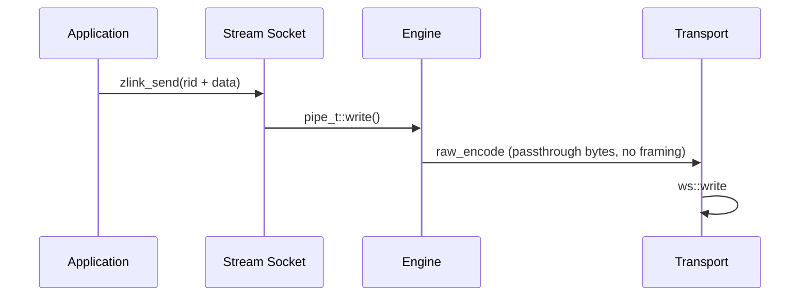

[한국어](https://zlink-systems.github.io/zlink/ko/spec/core/socket/08-stream/) | English

<!-- zlink-nav:start -->
[Socket Index](README.en.md) | [Previous: ROUTER](07-router.en.md) | [Next: Protocol Overview](../protocol/README.en.md)
<!-- zlink-nav:end -->

# Socket — STREAM

> **What this chapter defines** — the public contract for exposing raw TCP
> connections through a STREAM socket and for [result/errno](../03-errors.en.md#result-and-errno-mapping).

## 1. STREAM overview

STREAM is a [socket](../glossary.en.md#socket) that exchanges raw bytes with
external peers without zlink framing. It assigns a 4-byte routing ID—a byte
sequence that identifies one connection—to each connection. Before bind or
connect, the application selects a receive mode; it selects a peer by routing
ID when sending and reads the source routing ID from receive results.

STREAM does not interpret application payloads or higher-level protocol
semantics. This document defines the generic raw STREAM public contract in
ZLink Core for C API and binding developers who send and receive byte records
or fixed-framing packets over routed TCP or WS connections.

The following documents own the related contracts.

| Related contract | Defining document |
|---|---|
| Socket creation and close, common options, pending sends and completion, and thread safety | [Socket Common](README.en.md) |
| Wire format for bytes carried without ZMP framing | [RAW (STREAM) Protocol Details](../protocol/02-raw.en.md) |
| Result values and errno mapping | [Errors](../03-errors.en.md#result-and-errno-mapping) |

## 2. Creation, bind, and options

```c
ZLINK_EXPORT void *zlink_socket (void *context_, zlink_socket_type_t type_);
ZLINK_EXPORT zlink_bind_result_t zlink_bind (void *s_, const char *addr_);
ZLINK_EXPORT zlink_connect_result_t zlink_connect (void *s_, const char *addr_);
ZLINK_EXPORT zlink_close_result_t zlink_close (void *s_);

typedef enum zlink_stream_option_t
{
    ZLINK_STREAM_OPT_NOTIFY    = 0x3501, // RAW-mode connect/disconnect notification records (int 0|1)
    ZLINK_STREAM_OPT_RECV_MODE = 0x3502  // zlink_stream_recv_mode_t, set before first bind/connect
} zlink_stream_option_t;

typedef enum zlink_stream_recv_mode_t {
  ZLINK_STREAM_RECV_MODE_UNSPECIFIED = 0, // Initial value; bind/connect is not allowed
  ZLINK_STREAM_RECV_MODE_RAW = 1,         // Use zlink_recv_part()
  ZLINK_STREAM_RECV_MODE_PACKET = 2       // Use zlink_stream_recv_packet()
} zlink_stream_recv_mode_t;

ZLINK_EXPORT zlink_config_result_t zlink_set_stream_option (
  void *handle_, zlink_stream_option_t option_,
  const void *optval_, size_t optvallen_);
ZLINK_EXPORT zlink_config_result_t zlink_get_stream_option (
  void *handle_, zlink_stream_option_t option_,
  void *optval_, size_t *optvallen_);
```

Create a STREAM socket with `zlink_socket(context_, ZLINK_SOCKET_STREAM)`. The receive mode defaults
to `UNSPECIFIED`. The setter accepts only the exact enum size and `RAW` or `PACKET`.
`UNSPECIFIED`, unknown values, and size mismatches return `ZLINK_CONFIG_INVALID_ARGUMENT` with
`EINVAL`. The getter returns the initial `UNSPECIFIED` value.

`ZLINK_STREAM_OPT_NOTIFY` value 1 exposes client connect and disconnect notifications as
zero-length data records, whose source routing IDs identify the affected
clients. The default is 0, and it is used only in RAW mode.

Bind without selecting a mode fails with `ZLINK_BIND_INVALID_ARGUMENT` and `EINVAL` without endpoint
side effects; connect fails with `ZLINK_CONNECT_INVALID_ARGUMENT` and `EINVAL` without side effects.
A failed bind or connect does not freeze the mode. After the first successful bind or connect, the
mode setter and NOTIFY setter fail with `ZLINK_CONFIG_INVALID_STATE` and `EBUSY`, even when setting
the existing value.

PACKET and `NOTIFY=1` cannot be combined. Whichever setter would create that combination fails with
`ZLINK_CONFIG_NOT_SUPPORTED` and `ENOTSUP`, preserving the prior state. Setting and getting
`NOTIFY=0` is allowed in PACKET mode.

Common [HWM](../glossary.en.md#hwm), timeout, linger, TLS, and buffer options
use `zlink_set_option()` and `zlink_get_option()`. [Socket Common](README.en.md)
owns the contract for each option.

## 3. Receive modes

One STREAM handle explicitly selects one of the following modes before bind or connect.

| When to use it | Receive mode | Activation | Delivery form |
|---|---|---|---|
| The application handles a framing-free raw byte stream directly | RAW | Set `ZLINK_STREAM_RECV_MODE_RAW` | Receive raw byte records with `zlink_recv_part()` |
| An application protocol with `header + body` framing needs packet-sized delivery | PACKET | Set `ZLINK_STREAM_RECV_MODE_PACKET` | Receive header/body packets with `zlink_stream_recv_packet()` |

RAW permits only `zlink_recv_part()`, and PACKET permits only
`zlink_stream_recv_packet()`. The other receive family returns
`ZLINK_RECV_NOT_SUPPORTED` with `ENOTSUP`. Receive mode does not change
`ZLINK_POLLOUT` or the send contract.

## 4. Routed part send

```c
ZLINK_EXPORT zlink_submit_result_t zlink_send_part_rid (
  void *s_,
  const zlink_routing_id_t *target_rid_,
  zlink_msg_t *part_,
  zlink_send_flags_t flags_,
  zlink_part_flag_t part_flag_,
  void *user_context_,
  zlink_completion_id_t *completion_id_out_);
```

`target_rid_` is a valid four-byte logical routing ID assigned by STREAM to a connection.
A multipart uses the same RID, flags, and function family from MORE through FINAL. Every call
consumes `part_` on success and failure. An intermediate failure discards both the staged prefix
and the failed part.

`NONE FINAL` snapshots `SNDTIMEO` and waits for local queue admission and reconnect of the same
RID. A `DONTWAIT FINAL` admitted immediately has ID `0`; if Core retains it as pending, it has a
nonzero ID and produces a SEND completion. Before admission, Core retries only reconnect of the
same logical RID; after ID `0` or `ZLINK_SEND_ADMITTED`, it does not replay the application payload.
[Socket Common](README.en.md#part-send-and-pending-admission) owns detailed ownership, result, and
errno rules.

With multiple clients connected to a STREAM socket, `ZLINK_POLLOUT` is
aggregate readiness for the socket; it neither reserves credit for a specific
`target_rid_` nor identifies that routing ID in the event. The original target
can therefore return `EAGAIN` again even after another writable client raised
the event. Target-specific admission results retained by Core are received through
`ZLINK_POLLCOMPLETION` and `zlink_completion_recv()`.

Routed sending of a zero-length part to a valid `target_rid_` requests
termination of that peer connection instead of sending a byte record. Success
also consumes this zero-length part.

If the connection cannot be found, the function returns
`ZLINK_SUBMIT_NOT_CONNECTED`. See the [errno map](../03-errors.en.md#result-and-errno-mapping)
for the complete result mapping.

## 5. Raw part receive

```c
ZLINK_EXPORT zlink_recv_result_t zlink_recv_part (
  void *s_,
  const zlink_routing_id_t **source_rid_out_,
  zlink_msg_t *part_out_,
  zlink_part_flag_t *has_more_out_,
  zlink_recv_flags_t flags_);
```

`part_out_` must be an initialized message and is required together with
`has_more_out_`. `source_rid_out_` is optional. On success, it receives a
Core-owned borrowed view—a reference for temporarily reading memory owned by
Core—of the source client's routing ID. Copy this view before entry to the next
data-recv API on the same socket if it must remain valid after that receive.

On success, ownership of the received part transfers to the caller, which
must call `zlink_msg_close(part_out_)` exactly once. A failure before a part is
received does not transfer ownership. `*has_more_out_` is `ZLINK_PART_MORE`
when another part follows and `ZLINK_PART_FINAL` for the last part. A
`ZLINK_RECV_FLAGS_DONTWAIT` call with no data returns `ZLINK_RECV_NO_DATA` with `EAGAIN`.
Timeout and termination for `NONE`, and output invariance, follow the data-recv contract in
[Socket Common](README.en.md#zlink_recv_part).

## 6. Packet receive and framing

PACKET mode serves application protocols that place `header + body` framing on the raw STREAM byte
pipe. STREAM completes packets from each peer byte stream into a bounded receive queue, and the
application pulls them.

```c
ZLINK_EXPORT zlink_recv_result_t zlink_stream_recv_packet(
  void *stream_,
  const zlink_routing_id_t **source_rid_out_,
  zlink_msg_t *header_out_,
  zlink_msg_t *body_out_,
  zlink_recv_flags_t flags_);
```

### 6.1 Wire framing

Packet mode assembles the following frame in order on each client byte stream.

```text
+----------------+----------------+----------------+---------------+
| header_size:u16| body_size:u32  | header bytes   | body bytes    |
+----------------+----------------+----------------+---------------+
| big endian     | big endian     | exact length   | exact length  |
+----------------+----------------+----------------+---------------+
```

- `header_size` is a 2-byte big-endian unsigned 16-bit length.
- `body_size` is a 4-byte big-endian unsigned 32-bit length.
- Both payload lengths may be `0`. A packet with
  `header_size == 0 && body_size == 0` is returned as two valid zero-length `zlink_msg_t` values.
- When the complete six-byte prefix has been read, Core snapshots `ZLINK_OPT_MAXMSGSIZE`. If it is
  positive, `header_size`, `body_size`, and their overflow-safe sum must each be within the limit.
  Zero and negative values are unlimited.

### 6.2 Output and ownership

`source_rid_out_` is optional. `header_out_` and `body_out_` are required, distinct pointers, and
both messages must be initialized and empty before the call. A NULL required output returns
`ZLINK_RECV_INVALID_HANDLE` with `EFAULT`; aliased or non-empty messages return
`ZLINK_RECV_INVALID_STATE` with `EINVAL`.

Successful receive transfers the source-RID borrowed view and ownership of header and body to the
caller, which closes each message exactly once or moves it to another owner. A `0 + 0` packet still
returns two valid zero-length messages. `NO_DATA` and every failure leave the source pointer and both
messages unchanged. The RID view remains valid until entry to the next data-recv API on the same
socket or close; poller wait, completion recv, monitor recv, and data recv on another socket do not
invalidate it.

`NONE` snapshots `RCVTIMEO` on entry. DONTWAIT and timeout return `ZLINK_RECV_NO_DATA` with `EAGAIN`.
Context termination while blocked returns `ZLINK_RECV_TERMINATED` with `ETERM`; socket shutdown
returns `ZLINK_RECV_INVALID_STATE` with `ESHUTDOWN`.

### 6.3 Queue and malformed framing

STREAM treats the following conditions as malformed and closes the affected
connection.

- `header_size`, `body_size`, or `header_size + body_size` exceeds a positive
  configured `maxmsgsize`.
- The length fields have started to arrive, but the peer closes or resets
  before the full packet arrives—that is, a mid-length or mid-payload close.

The STREAM monitor exposes this condition as a disconnect event for that
`source_rid`. An incomplete packet is not placed in the application queue, and the decoder state is
discarded with the connection. Other peers' decoders and queues are unaffected.

`ZLINK_POLLIN` is ready only while at least one complete packet exists. Packet order for one source
RID is preserved; packets from different sources are returned in Core receive-queue admission order.
The queue follows `RCVHWM`; when full, Core stops pipe reads and propagates backpressure. It neither
silently drops packets nor creates a separate unbounded queue.

## 7. Completion and thread safety

When a STREAM send returns a nonzero completion ID, exactly one SEND record is received through
`zlink_completion_recv()`. Its `peer_rid` preserves the logical RID snapshot specified at submit; it
does not change to a physical connection identity after reconnect. [Socket Common](README.en.md#completion-pull-and-ownership)
owns completion draining, reservation bounds, and close.

Public socket-handle thread safety and close behavior follow
[Socket Common](README.en.md). The same `zlink_msg_t` cannot be used
concurrently from multiple threads.

## 8. Receive flow state

STREAM is not a socket type that supports receive flow. `zlink_socket_set_receive_flow_state()` returns
`ZLINK_CONFIG_NOT_SUPPORTED` with `errno == ENOTSUP` for a STREAM socket and
changes nothing. The byte HWM, low water mark, and transport backpressure
described above remain in effect. A STREAM socket monitor does not set
`ZLINK_MONITOR_STATUS_DETAIL_FLOW_STATE` and does not emit
`ZLINK_EVENT_SEND_FLOW_PAUSED`, `ZLINK_EVENT_SEND_FLOW_RESUMED`, or
`ZLINK_EVENT_FLOW_STATE_STALE`.

## 9. Peer routing ID and connection termination

The public routing ID for STREAM is the 4-byte connection ID assigned by the
server to each connection. Passing this ID to `zlink_disconnect_rid()` requests
termination of that connection. A routing ID that is not 4 bytes fails as an
invalid argument. [Socket Common](README.en.md) owns the contract for
`zlink_disconnect_rid()` itself; [§10 Internals](#10-internals) explains how
the ID is found internally.

## 10. Internals

> **Contract ownership for this section** — §1–§9 of this document own the
> public STREAM socket contract. This section explains the internal
> optimization structure of the WS/WSS path, the packet assembly
> implementation, and runtime defaults.

### WS/WSS path

The STREAM socket supports RAW communication with external clients such as web
browsers and game clients that connect without a ZMP (zlink Message Protocol)
handshake. It supports tcp, tls, ws, and wss transports, with a particular
focus on performance optimization of the WS/WSS path.

| Component | File | Role |
|---|---|---|
| stream_t | src/runtime/sockets/stream/stream.cpp | STREAM socket logic |
| raw_encoder_t | src/runtime/protocol/raw_encoder.cpp | passthrough encoding (no framing) |
| raw_decoder_t | src/runtime/protocol/raw_decoder.cpp | passthrough decoding (byte span -> msg_t) |
| asio_raw_engine_t | src/runtime/engine/asio/asio_raw_engine.cpp | RAW I/O engine |
| ws_transport_t | src/runtime/transports/ws/ | WebSocket transport |
| wss_transport_t | src/runtime/transports/tls/ | WebSocket + TLS transport |



WS/WSS has the following performance characteristics.

- **Read path** — Data is copied from the Beast read buffer (`message_buffer`)
  into the outgoing `msg_t` (one copy at delivery).
- **Write path** — The `msg_t` payload is passed directly to the Beast write
  buffer (no intermediate copy).
- **Beast write buffer** — The default is 64KB. A WS write sends one supplied
  buffer or two gathered buffers as a single binary frame (one `async_write`).
- **Frame fragmentation** — `auto_fragment(false)`. One logical message maps
  to one WebSocket frame.

Representative single-socket throughput on the standard benchmark machine is
as follows.

| Transport | Throughput |
|---|---|
| TCP | 1493 MB/s |
| WS | 696 MB/s |
| WSS 1KB | 382 MB/s |

Large messages benefit most from the WS framing choices. With payloads of 64KB
or more, WS approaches the TCP line rate, and TLS encryption overhead dominates
the WSS cost.

The design trade-offs are as follows.

- Speculative write is not supported because WebSocket is frame-based.
- Gather write is supported for WS/WSS. `supports_gather_write()` returns
  `true`, and `async_writev()` combines two buffers into one `async_write`.
- TLS/WSS has encryption overhead.

### Packet assembly implementation

This is the per-connection accumulator that implements packet receive in
[§6](#6-packet-receive-and-framing). Incoming bytes pass through the packet
state of each connection (pipe), `pipe_t::_stream_packet_state`. The receive engine
accesses this state through `pipe_->stream_packet_state()`.

```text
  wire bytes (arbitrary fragmentation)
         |
         v
  +-------------------------+
  | pipe packet state       |
  |   stage: prefix_stage   |
  |          header_stage   |
  |          body_stage     |
  +-------------------------+
         |
         v
  bounded packet receive queue
```

The length fields are parsed first. Once both `header_size` and `body_size` are
known, subsequently arriving bytes accumulate in the header and body buffers
of that connection's packet state. When a packet completes, those accumulation
buffers are moved into freshly initialized `zlink_msg_t` header and body values
and placed in the receive queue. This zero-copy move transfers ownership without
copying the data. `zlink_stream_recv_packet()` transfers ownership of a queued
record to the caller outputs.

STREAM performs decoding internally instead of requiring each application to
do so for the following reasons.

- **One fewer copy.** The application does not need to touch an assembled
  contiguous buffer and then split it again. The accumulation buffers are
  moved into the header and body messages with zero-copy semantics.
- **Ordering guarantee.** The decoder and receive queue enforce per-`source_rid` serialization,
  so the caller does not need separate reordering logic on top of raw byte
  delivery.

### Current STREAM runtime defaults

STREAM uses a common default performance profile across transports. For common
socket defaults outside STREAM, see the [internals section of Socket Common](README.en.md#7-internals).

The following values are internal STREAM defaults.

- read drain: enabled
- speculative write: enabled by default on the STREAM/TCP path; enabling
  `ZLINK_ASIO_STREAM_ASYNC_WRITE` switches to the pure asynchronous write path
- RX slab buffering: enabled
- speculative write byte budget: `2097152`
- read drain max loops: `64`
- read drain max bytes: `1048576`

Socket and listener defaults are as follows.

- backlog: `65536`
- `sndhwm` / `rcvhwm`: per-physical-queue applied HWM produced by
  [water-filling](../glossary.en.md#water-filling) the Core memory budget within
  the STREAM role lower and upper bounds
- `sndbuf` / `rcvbuf`: default `-1`, leaving OS buffer defaults and TCP
  autotuning in control
- accept concurrency (STREAM only): default `4`, maximum `128`
- session scheduler (STREAM): default `rr`

STREAM retains the following runtime environment variables.

- `ZLINK_ASIO_STREAM_ACCEPT_CONCURRENCY`: default `4`, clamped to `128`
- `ZLINK_ASIO_STREAM_SESSION_SCHED` (`rr|minload`): default `rr`
- `ZLINK_ASIO_STREAM_ENABLE_NON_TCP_SPEC_READ`: disabled by default
- `ZLINK_ASIO_STREAM_ASYNC_WRITE`: disabled by default; enabling it disables
  STREAM/TCP speculative writes and uses the pure asynchronous write path
- `ZLINK_ASIO_STREAM_DISABLE_GATHER`: disabled by default, so STREAM gather
  writes remain enabled
- `ZLINK_ASIO_STREAM_GATHER_THRESHOLD`: default `1024`
- `ZLINK_ASIO_STREAM_TINY_GATHER_THRESHOLD`: default `0`
- `ZLINK_ASIO_STREAM_INITIAL_TARGET_CAP`: default `4096`
- `ZLINK_ASIO_STREAM_BATCH_SIZE`: default `4096`
- `ZLINK_ASIO_STREAM_BATCH_HEADROOM`: default `64`
- `ZLINK_STREAM_PIPE_LWM_HINT`: default `4`; applies a low-water-mark hint of
  `configured value * 1024` bytes to the STREAM application pipe

### Peer routing ID disconnect implementation

`zlink_disconnect_rid()` interprets the 4-byte routing ID as a `uint32_t`,
finds the pipe in the STREAM routing map, and requests termination. [§9](#9-peer-routing-id-and-connection-termination)
owns the public behavior.

## 11. Implementation and contract-test verification requirements

Verify the following through the public surface only: STREAM function calls,
completion pull, return results and errno values, and monitor events. Each
item maps to one test.

**Creation, bind/connect, and receive mode**

- Bind and connect in the default `UNSPECIFIED` state fail without side effects as
  `ZLINK_BIND_INVALID_ARGUMENT` with `EINVAL` and `ZLINK_CONNECT_INVALID_ARGUMENT` with `EINVAL`,
  respectively.
- Selecting RAW before bind or connect succeeds and permits only `zlink_recv_part()`; PACKET recv
  returns `ZLINK_RECV_NOT_SUPPORTED` with `ENOTSUP`.
- Selecting PACKET before bind or connect succeeds and permits only `zlink_stream_recv_packet()`;
  raw recv returns `ZLINK_RECV_NOT_SUPPORTED` with `ENOTSUP`.
- A failed bind or connect does not freeze the mode. After the first successful bind or connect, the
  mode and NOTIFY setters return `ZLINK_CONFIG_INVALID_STATE` with `EBUSY`, even for the same value.
- Whichever setter would combine PACKET with `NOTIFY=1` returns `ZLINK_CONFIG_NOT_SUPPORTED` with
  `ENOTSUP` and preserves the previous state.
- With `NOTIFY=1` in RAW, connect and disconnect are returned as zero-length DATA records with source
  RIDs. PACKET observes connection state and RID through monitor pull.

**Routed part send**

- Every multipart part uses the same RID, flags, and function family; an intermediate failure
  atomically discards the staged prefix and failed part.
- Sending a zero-length part to a valid target routing ID requests peer
  connection termination and consumes the part.
- Success and failure both consume `part_` and leave it empty and initialized.
- `NONE FINAL` snapshots `SNDTIMEO`, waits for same-logical-RID local admission, and finishes with
  ID `0` and no completion.
- A `DONTWAIT FINAL` admitted immediately has ID `0`; if retained as pending, it returns a nonzero
  ID and produces exactly one SEND completion.
- Before admission, reconnect retries only the same logical RID; after ID `0` or
  `ZLINK_SEND_ADMITTED`, Core does not replay the payload.
- If the connection cannot be found, the result is
  `ZLINK_SUBMIT_NOT_CONNECTED`.

**Raw part receive**

- On success, ownership of the part transfers to the caller, which must call
  `zlink_msg_close` exactly once. A failure before a part is received does not
  transfer ownership.
- `*has_more_out_` is `ZLINK_PART_MORE` when another part follows and
  `ZLINK_PART_FINAL` for the last part.
- DONTWAIT or a `NONE` timeout with no data returns `ZLINK_RECV_NO_DATA` with `EAGAIN`.
- The borrowed view from `source_rid_out_` remains valid until entry to the next data recv on the
  same socket or close; poller, completion, and monitor recv and data recv on another socket do not
  invalidate it.

**Packet receive**

- A packet with `header_size == 0 && body_size == 0` succeeds with two initialized zero-length
  messages.
- Even when the six-byte prefix is split across raw reads, exactly one header/body pair is returned
  after the complete packet, and `ZLINK_POLLIN` is not ready before completion.
- A NULL required output returns `ZLINK_RECV_INVALID_HANDLE` with `EFAULT`; aliased or non-empty
  outputs return `ZLINK_RECV_INVALID_STATE` with `EINVAL`, preserving the queued packet and outputs.
- Packets from the same `source_rid` are returned in arrival order; packets from different sources
  are returned in Core receive-queue admission order.
- At `RCVHWM`, Core stops pipe reads and propagates backpressure without dropping packets.
- Size checks apply only when `maxmsgsize` is positive (the default `-1` is
  unbounded). From the snapshot taken when the complete prefix arrives, a size declaration in which
  `header_size`, `body_size`, or their overflow-safe sum exceeds the limit, as well as a mid-length or mid-payload close, is
  malformed: the connection closes and the monitor exposes a disconnect event
  for that `source_rid`. No incomplete packet enters the application queue.

**Completion**

- A nonzero SEND ID preserves in `peer_rid` the logical RID snapshot specified at submit; it does not
  change to a physical connection identity after reconnect.
- `ZLINK_POLLCOMPLETION` is non-consuming level readiness. Draining with
  `zlink_completion_recv(DONTWAIT)` through `NO_DATA` clears it.

**Receive flow state and monitor**

- `zlink_socket_set_receive_flow_state()` fails with
  `ZLINK_CONFIG_NOT_SUPPORTED` and `errno == ENOTSUP` and changes nothing.
- A STREAM monitor does not set `ZLINK_MONITOR_STATUS_DETAIL_FLOW_STATE` and
  does not emit `ZLINK_EVENT_SEND_FLOW_PAUSED`,
  `ZLINK_EVENT_SEND_FLOW_RESUMED`, or `ZLINK_EVENT_FLOW_STATE_STALE`.

**Connection termination**

- Calling `zlink_disconnect_rid()` with a 4-byte routing ID requests
  termination of that connection; a routing ID that is not 4 bytes fails as an
  invalid argument.
