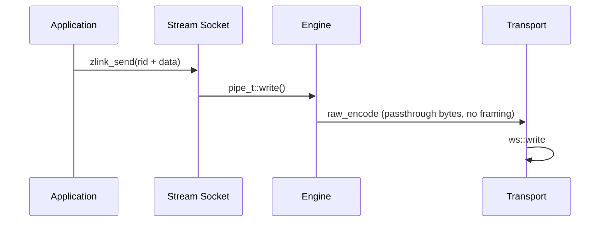

[한국어](08-stream.ko.md) | English

<!-- zlink-nav:start -->
[Socket Index](README.en.md) | [Previous: ROUTER](07-router.en.md) | [Next: Protocol Overview](../protocol/README.en.md)
<!-- zlink-nav:end -->

# Socket — STREAM

This document defines the generic raw STREAM public contract for ZLink Core
raw STREAM. It is for C API and bindings developers that exchange byte records or
fixed-framing packets over routed TCP or WebSocket connections.

## 1. Scope

STREAM is a bind-only raw socket that assigns a 4-byte routing ID to every
accepted client connection. It does not support `zlink_connect()`. An
application addresses a client by routing ID when sending and reads the source
routing ID from receive results.

STREAM does not interpret application payloads or higher-level protocol semantics.

## 2. Creation, bind, and options

```c
ZLINK_EXPORT void *zlink_socket (void *context_, zlink_socket_type_t type_);
ZLINK_EXPORT zlink_bind_result_t zlink_bind (void *s_, const char *addr_);
ZLINK_EXPORT zlink_close_result_t zlink_close (void *s_);

typedef enum zlink_stream_option_t
{
    ZLINK_STREAM_OPT_NOTIFY = 0x3501
} zlink_stream_option_t;

ZLINK_EXPORT zlink_config_result_t zlink_set_stream_option (
  void *handle_, zlink_stream_option_t option_,
  const void *optval_, size_t optvallen_);
ZLINK_EXPORT zlink_config_result_t zlink_get_stream_option (
  void *handle_, zlink_stream_option_t option_,
  void *optval_, size_t *optvallen_);
```

Create the socket with `zlink_socket(context_, ZLINK_SOCKET_STREAM)`.
`ZLINK_STREAM_OPT_NOTIFY` is an `int` with value 0 or 1 and is set before
bind. A value of 1 exposes client connect and disconnect notifications as
zero-length data records. The source routing ID identifies the client.

Common HWM, timeout, linger, TLS, and buffer options use
`zlink_set_option()` and `zlink_get_option()`.

## 3. Receive modes

One STREAM handle uses exactly one of these modes:

1. raw part receive: `zlink_recv_part()` receives parts of raw records;
2. raw callback: `zlink_recv_handler()` delivers raw records to a callback;
3. packet callback: `zlink_stream_packet_handler()` assembles and delivers
   fixed-framing packets.

The first raw part receive or handler registration fixes the receive mode.
Activating another receive mode or registering another handler on the same
handle fails with a busy result and `errno == EBUSY`. Data-plane
`ZLINK_POLLIN` belongs to raw part receive mode. A send-ready handler and
`ZLINK_POLLOUT` are independent of receive mode.

## 4. Routed part send

```c
ZLINK_EXPORT zlink_submit_result_t zlink_send_part_rid (
  void *s_,
  const zlink_routing_id_t *target_rid_,
  zlink_msg_t *part_,
  zlink_send_flags_t flags_,
  zlink_part_flag_t part_flag_);
```

STREAM sends one raw data part at a time to a target client. `target_rid_`
must be a valid 4-byte routing ID assigned by this STREAM socket, and
`part_flag_` must be `ZLINK_PART_FINAL`. `ZLINK_PART_MORE` returns
`ZLINK_SUBMIT_NOT_SUPPORTED` with `errno == ENOTSUP`.

STREAM send never opens a multipart sequence. After a `ZLINK_PART_MORE`
failure, no part is staged and the next call is an independent single-part
record. The atomic multipart-abort rule of other raw sockets therefore does
not apply to STREAM.

Success consumes the content of `part_`. When backpressure returns
`ZLINK_SUBMIT_BACKPRESSURED` with `errno == EAGAIN`, the content remains owned
by the caller and may be retried. Other failures consume the content. Keeping
a payload copy before the call gives the caller one uniform recovery strategy
across all failure results.

A missing connection returns `ZLINK_SUBMIT_NOT_CONNECTED`. See the
[Errno Map](../03-errors.en.md#result-and-errno-mapping) for the full result mapping.

## 5. Raw part receive

```c
ZLINK_EXPORT zlink_recv_result_t zlink_recv_part (
  void *s_,
  const zlink_routing_id_t **source_rid_out_,
  zlink_msg_t *part_out_,
  zlink_part_flag_t *has_more_out_,
  zlink_recv_flags_t flags_);
```

`part_out_` must be an initialized message and is required together with
`has_more_out_`. `source_rid_out_` is optional. On success it receives a
Core-owned borrowed view of the source client's routing ID. Copy the view
before the next raw receive if it must remain valid.

On success, ownership of the received part transfers to the caller, which
must call `zlink_msg_close(part_out_)` exactly once. A failure before a part is
received does not transfer ownership. `*has_more_out_` is
`ZLINK_PART_MORE` when another part follows and `ZLINK_PART_FINAL` for the
last part. A `ZLINK_DONTWAIT` call with no data returns
`ZLINK_RECV_NO_DATA`.

## 6. Raw callback

```c
ZLINK_EXPORT zlink_handler_result_t zlink_recv_handler (
  void *s_, zlink_socket_msg_handler_fn handler_, void *userdata_);
```

Raw callback mode is supported only by STREAM. The source routing ID is a
borrowed view valid only for the callback. Ownership of every delivered
message part transfers to the callback, which must consume or close each part
exactly once. Registering a receive handler again or closing the same handle
from inside the callback fails with a busy result and `errno == EBUSY`.

## 7. Packet callback and framing

```c
typedef void (*zlink_stream_packet_handler_fn) (
  void *stream_,
  const zlink_routing_id_t *source_rid_,
  zlink_msg_t *header_,
  zlink_msg_t *body_,
  void *userdata_);

ZLINK_EXPORT zlink_handler_result_t zlink_stream_packet_handler (
  void *stream_, zlink_stream_packet_handler_fn handler_, void *userdata_);
```

Packet mode assembles this frame in order on each client byte stream:

```text
+----------------+----------------+----------------+---------------+
| header_size:u16| body_size:u32  | header bytes   | body bytes    |
+----------------+----------------+----------------+---------------+
| big endian     | big endian     | exact length   | exact length  |
+----------------+----------------+----------------+---------------+
```

`header_size` is an unsigned 16-bit length and `body_size` is an unsigned
32-bit length. Either payload may have length zero; the callback still
receives a valid zero-length `zlink_msg_t`, not `NULL`. The source routing ID
is a borrowed view valid only for the callback. Ownership of `header_` and
`body_` transfers to the callback, which must consume or close each message
exactly once.

## 8. Asynchronous send admission and thread safety

```c
ZLINK_EXPORT zlink_submit_result_t zlink_send_async (
  void *s_, zlink_msg_t *parts_, size_t part_count_,
  const zlink_send_async_options_t *options_,
  zlink_send_op_id_t *op_id_out_);

ZLINK_EXPORT zlink_handler_result_t zlink_send_complete_handler (
  void *s_, zlink_send_complete_handler_fn handler_, void *userdata_);

ZLINK_EXPORT zlink_submit_result_t zlink_send_async_cancel (
  void *s_, zlink_send_op_id_t op_id_);
```

STREAM carries raw bytes with no frame boundaries, so a STREAM record is
exactly one part; `part_count_` other than 1 returns
`ZLINK_SUBMIT_NOT_SUPPORTED`. `options_->target` names one exact peer, whose
identity comes from `zlink_select_routed_submit_target()`.

A completion reports admission into the Core send queue, not peer delivery.
[Socket Common](README.en.md) owns the complete contract: ownership transfer,
per-target FIFO order, the per-socket pending bound, per-operation timeout,
cancel, close fail-fast, and the callback rules.

The [Socket Common](README.en.md) contract defines public socket-handle thread
safety and close behavior. The same `zlink_msg_t` cannot be used concurrently
from multiple threads.

## Receive flow state

STREAM has no paired DEALER/ROUTER completion lane, so it has no receive-flow
state. `zlink_socket_set_receive_flow_state()` returns
`ZLINK_CONFIG_NOT_SUPPORTED` with `errno == ENOTSUP` for a STREAM socket and
changes nothing. The byte HWM, low water mark, and transport backpressure
described above stay in effect unchanged, and a monitor for a STREAM socket never
sets `ZLINK_MONITOR_STATUS_DETAIL_FLOW_STATE` or emits
`ZLINK_EVENT_SEND_FLOW_PAUSED`, `ZLINK_EVENT_SEND_FLOW_RESUMED`, or
`ZLINK_EVENT_FLOW_STATE_STALE`.

## Internals

> **The document that owns this chapter's contract** — the public contract
> for the STREAM socket is covered by the contract part of this document.
> This section explains the internal optimization structure of the WS/WSS
> path.

### Overview

The STREAM socket supports RAW communication with external clients (web browsers, game clients, etc.) that do not use ZMP. It supports tcp, tls, ws, and wss transports, with a particular focus on performance optimization of the WS/WSS path.

### Architecture

#### Component Layout

| Component | File | Role |
|----------|------|------|
| stream_t | src/runtime/sockets/stream/stream.cpp | STREAM socket logic |
| raw_encoder_t | src/runtime/protocol/raw_encoder.cpp | passthrough encoding (no framing) |
| raw_decoder_t | src/runtime/protocol/raw_decoder.cpp | passthrough decoding (byte span -> msg_t) |
| asio_raw_engine_t | src/runtime/engine/asio/asio_raw_engine.cpp | RAW I/O engine |
| ws_transport_t | src/runtime/transports/ws/ | WebSocket transport |
| wss_transport_t | src/runtime/transports/tls/ | WebSocket + TLS |

#### Data Flow



### WS/WSS Performance Characteristics

#### Read Path
- Data is copied from the Beast read buffer (`message_buffer`) into the
  outgoing `msg_t` (single copy at delivery).

#### Write Path
- `msg_t` payload is passed directly to the Beast write buffer (no
  intermediate copy).

#### Beast Write Buffer
- The Beast write buffer default is 64KB. A WS write sends the given buffer as a
  single binary frame (one `async_write`).

#### Frame Fragmentation
- `auto_fragment(false)` — one logical message maps to one WebSocket
  frame.

### Measured Throughput

Representative single-socket throughput on the standard benchmark
machine:

| Transport | Throughput |
|-----------|------------|
| TCP       | 1493 MB/s  |
| WS        |  696 MB/s  |
| WSS 1KB   |  382 MB/s  |

Large messages benefit most from the WS framing choices; 64KB and
larger payloads approach the TCP line rate for WS, and WSS cost is
dominated by TLS encryption overhead.

### Design Trade-offs

- Speculative write not supported (WebSocket is frame-based)
- Gather write not supported for WS/WSS (`supports_gather_write()` returns false)
- TLS/WSS has encryption overhead

### Packet Handler Receive Mode

STREAM sockets expose three mutually exclusive receive modes. Exactly
one can be active per socket; the second activation attempt on the same
socket fails with `EBUSY`.

| Mode | Activation | Delivery |
|------|------------|----------|
| Raw recv | default | `zlink_recv()` returns raw bytes per read |
| Raw callback | `zlink_recv_handler()` | `zlink_socket_msg_handler_fn` with raw bytes |
| Packet callback | `zlink_stream_packet_handler()` | `zlink_stream_packet_handler_fn` with decoded header/body messages |

The packet handler mode is tailored to application protocols that carry
`header + body` framing on top of the raw STREAM byte pipe -- for
example an orders-exec gateway whose clients send a small control
header followed by a larger payload. Instead of each caller writing the
same length-prefix decoder and buffering state machine, STREAM parses
the frames internally and delivers already-allocated `zlink_msg_t`
objects to the callback.

#### Wire framing

Each logical packet is carried on the wire as:

```
+------------------+--------------------+----------------+-------------------+
| u16 header_size  | u32 body_size      | header bytes   | body bytes        |
| (big-endian)     | (big-endian)       | (header_size)  | (body_size)       |
+------------------+--------------------+----------------+-------------------+
```

- `header_size` is a 2-byte big-endian unsigned integer.
- `body_size` is a 4-byte big-endian unsigned integer.
- Both sizes may be `0`. A packet with `header_size=0 && body_size=0`
  still yields a callback, with two empty but non-`NULL` `zlink_msg_t`
  instances.
- Size checks apply only when `maxmsgsize` is set to a positive value (the
  default `-1` is unbounded). Advertising a size that exceeds the configured
  limit is treated as malformed framing (see "Malformed framing" below).

#### Per-connection accumulator

Incoming bytes are fed through each connection's packet state
(`pipe_t::_stream_packet_state`); the handler accesses it via
`pipe_->stream_packet_state()`.

```
  wire bytes (arbitrary fragmentation)
         |
         v
  +-------------------------+
  | pipe packet state       |
  |   stage: prefix_stage   |
  |          header_stage   |
  |          body_stage     |
  +-------------------------+
         |
         v
  callback(stream, source_rid, header_msg, body_msg, userdata)
```

Length fields are parsed first. Once both `header_size` and `body_size`
are known, incoming bytes are accumulated into the per-connection packet
state's header and body buffers as reads arrive. When a packet completes,
those accumulation buffers are moved (zero-copy) into freshly initialized
`zlink_msg_t` header and body objects, which are then handed to the
callback. There is no extra copy at delivery time -- the move transfers
the assembled buffers into the messages the callback receives.

#### Callback contract

The signature is:

```
zlink_stream_packet_handler_fn(stream,
                               source_rid,    // borrowed view
                               header_msg,    // ownership transfers
                               body_msg,      // ownership transfers
                               userdata)
```

- `source_rid` is a borrowed view for the duration of the callback. It
  must not be retained past the call; copy it if needed.
- `header_msg` and `body_msg` are always non-`NULL`, even when the
  corresponding wire size is `0`. Ownership of both transfers to the
  callback, which is responsible for closing them with
  `zlink_msg_close()`.
- Packets from the same `source_rid` are serialized: a later packet on
  the same peer cannot overtake an earlier one. Packets from different
  `source_rid` may be dispatched in parallel on different worker
  threads.
- Self-close from within the raw callback is the same rule as the raw
  `zlink_recv_handler` case: attempting to flip the socket's receive
  mode or close the socket from inside the callback fails with `EBUSY`.

#### Malformed framing

STREAM treats the following as malformed and closes the offending
connection:

- A declared `header_size` or `body_size` that exceeds internal limits.
- The peer closes (or resets) after the length fields have started but
  before the full packet has arrived -- i.e. mid-length or mid-payload
  close.

Closure is observable through the STREAM socket monitor as a disconnect
event for that `source_rid`. No partial packet is ever delivered to the
callback; the decoder state for that connection is discarded with the
connection.

#### Why decode inside STREAM

Decoding inside STREAM (rather than in each application) has two
reasons worth calling out:

- **One fewer copy.** The application never sees a contiguous
  "assembled" buffer that it later has to split -- the accumulation
  buffers are moved (zero-copy) into the header and body messages.
- **Ordering guarantees.** Per-`source_rid` serialization is enforced
  by the decoder, so callers do not have to build their own reordering
  logic on top of raw byte delivery.

### Current STREAM Runtime Defaults

STREAM uses a consolidated default performance profile across transports.
For non-STREAM-wide socket defaults, see the
[Internals section of Socket — Common Specification](README.en.md#internals).

#### Fixed internal constants

These values are fixed as internal constants and not controlled by STREAM env knobs:
- handler allocator: enabled
- read drain: enabled
- speculative write: fixed on for STREAM/TCP path
- RX slab buffering: enabled
- speculative write byte budget: `2097152`
- read drain max loops: `64`
- read drain max bytes: `1048576`

#### Effective socket/listener defaults

- backlog: `65536`
- `sndhwm` / `rcvhwm`: per-physical-queue applied HWM produced by
  water-filling the Core memory budget within the STREAM role bounds
- `sndbuf` / `rcvbuf`: default `-1`, leaving OS buffer defaults and TCP
  autotuning in control
- accept concurrency (STREAM only): default `4`, max `128`
- session scheduler (STREAM): default `rr`

#### Remaining STREAM runtime env controls

- `ZLINK_ASIO_STREAM_ACCEPT_CONCURRENCY`: default `4`, clamped to `128`
- `ZLINK_ASIO_STREAM_SESSION_SCHED` (`rr|minload`): default `rr`
- `ZLINK_ASIO_STREAM_ENABLE_NON_TCP_SPEC_READ`: disabled by default
- `ZLINK_ASIO_STREAM_DISABLE_GATHER`: disabled by default, so STREAM gather-write stays enabled
- `ZLINK_ASIO_STREAM_GATHER_THRESHOLD`: default `1024`
- `ZLINK_ASIO_STREAM_TINY_GATHER_THRESHOLD`: default `0`
- `ZLINK_ASIO_STREAM_INITIAL_TARGET_CAP`: default `4096`
- `ZLINK_ASIO_STREAM_BATCH_SIZE`: default `4096`
- `ZLINK_ASIO_STREAM_BATCH_HEADROOM`: default `64`

### Peer RID Disconnect

STREAM's public routing id is the 4-byte connection id assigned by the server
for each connection. `zlink_disconnect_rid()` interprets that id as a
`uint32_t`, looks up the pipe in the STREAM route map, and requests
termination. Any rid that is not 4 bytes fails as an invalid argument.
