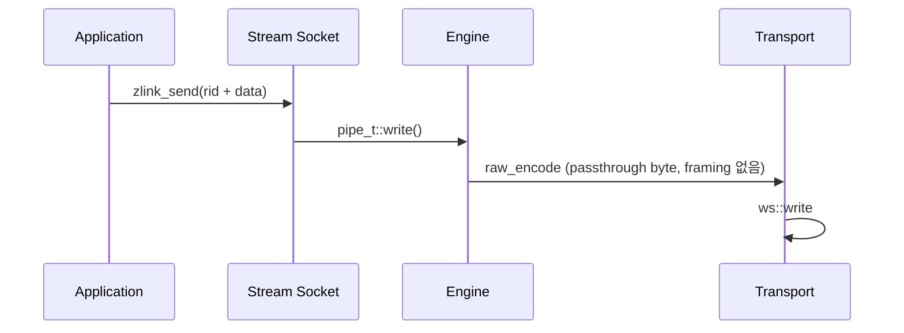

[English](https://zlink-systems.github.io/zlink/spec/core/socket/08-stream/) | 한국어

<!-- zlink-nav:start -->
[소켓 목차](README.ko.md) | [이전: ROUTER](07-router.ko.md) | [다음: 프로토콜 개요](../protocol/README.ko.md)
<!-- zlink-nav:end -->

# Socket — STREAM

> **이 장이 정의하는 것** — STREAM socket의 raw TCP 연결 노출과
> [result/errno](../03-errors.ko.md#result와-errno-대응) 공개 계약.

## 1. STREAM 개요

STREAM은 zlink framing 없이 연결하는 외부 peer와 raw byte를 주고받는
[socket](../glossary.ko.md#socket)이다. 연결마다 4 byte routing ID — 연결 하나를 식별하는
byte 열 — 를 부여한다. Application은 bind하거나 connect하기 전에 receive mode를 고르고,
routing ID로 peer를 선택해
전송하고, 수신 결과에서 source routing ID를 확인한다.

STREAM은 application payload와 상위 protocol 의미를 해석하지 않는다. TCP/WS 연결의
byte record 또는 고정 framing packet을 routing ID로 송수신하는 C API와 binding
개발자를 대상으로 이 문서는 ZLink Core의 범용 raw STREAM 공개 계약을 정의한다.

관련 계약의 소유 문서는 다음과 같다.

| 관련 계약 | 정의하는 문서 |
|---|---|
| socket 생성·close, 공통 option, 송신 wait token과 completion, thread safety | [소켓 공통](README.ko.md) |
| ZMP framing 없이 흐르는 byte의 wire format | [RAW (STREAM) 프로토콜 상세](../protocol/02-raw.ko.md) |
| result 값과 errno 대응 | [Errors](../03-errors.ko.md#result와-errno-대응) |

## 2. 생성, bind와 option

```c
ZLINK_EXPORT void *zlink_socket (void *context_, zlink_socket_type_t type_);
ZLINK_EXPORT zlink_bind_result_t zlink_bind (void *s_, const char *addr_);
ZLINK_EXPORT zlink_connect_result_t zlink_connect (void *s_, const char *addr_);
ZLINK_EXPORT zlink_close_result_t zlink_close (void *s_);

typedef enum zlink_stream_option_t
{
    ZLINK_STREAM_OPT_NOTIFY    = 0x3501, // RAW mode 연결·해제 알림 record (int 0|1)
    ZLINK_STREAM_OPT_RECV_MODE = 0x3502  // zlink_stream_recv_mode_t, 첫 bind/connect 전 설정
} zlink_stream_option_t;

typedef enum zlink_stream_recv_mode_t {
  ZLINK_STREAM_RECV_MODE_UNSPECIFIED = 0, // bind/connect할 수 없는 초기값
  ZLINK_STREAM_RECV_MODE_RAW = 1,         // zlink_recv_part() 사용
  ZLINK_STREAM_RECV_MODE_PACKET = 2       // zlink_stream_recv_packet() 사용
} zlink_stream_recv_mode_t;

ZLINK_EXPORT zlink_config_result_t zlink_set_stream_option (
  void *handle_, zlink_stream_option_t option_,
  const void *optval_, size_t optvallen_);
ZLINK_EXPORT zlink_config_result_t zlink_get_stream_option (
  void *handle_, zlink_stream_option_t option_,
  void *optval_, size_t *optvallen_);
```

STREAM socket은 `zlink_socket(context_, ZLINK_SOCKET_STREAM)`으로 생성한다.
Receive mode의 기본값은 `UNSPECIFIED`다. Setter는 정확한 enum size와 `RAW`·`PACKET`만
받는다. `UNSPECIFIED`, 알 수 없는 값과 size mismatch는 `ZLINK_CONFIG_INVALID_ARGUMENT`,
`errno == EINVAL`이다. Getter는 초기 `UNSPECIFIED`를 반환한다.

`ZLINK_STREAM_OPT_NOTIFY`의 값 1은 client
연결과 해제를 길이 0인 data record로 수신하게 하며, 그 record의 source routing ID가
대상 client를 식별한다. 기본값은 0이며 RAW mode에서만 사용한다.

Mode를 선택하지 않은 bind는 endpoint side effect 없이 `ZLINK_BIND_INVALID_ARGUMENT`+`EINVAL`,
connect는 side effect 없이 `ZLINK_CONNECT_INVALID_ARGUMENT`+`EINVAL`로 실패한다. Failed bind나
connect는 mode를 고정하지 않는다. 첫 successful bind 또는 connect 뒤에는 mode와 NOTIFY setter가
같은 값을 다시 설정하는 경우까지 `ZLINK_CONFIG_INVALID_STATE`+`EBUSY`로 실패한다.

PACKET과 `NOTIFY=1`은 함께 사용할 수 없다. 두 설정 중 나중 호출이
`ZLINK_CONFIG_NOT_SUPPORTED`+`ENOTSUP`로 실패하고 기존 상태는 변하지 않는다. PACKET에서
`NOTIFY=0` set/get은 허용한다.

공통 [HWM](../glossary.ko.md#hwm), timeout, linger, TLS와 buffer option은
`zlink_set_option()`과 `zlink_get_option()`을 사용한다. 각 option의 계약은
[소켓 공통](README.ko.md)이 소유한다.

## 3. 수신 모드

한 STREAM handle은 bind나 connect 전에 다음 mode 가운데 하나를 명시적으로 고른다.

| 언제 쓰는가 | 수신 모드 | 활성화 방법 | 전달 형태 |
|---|---|---|---|
| Application이 framing 없는 raw byte stream을 직접 다룰 때 | RAW | `ZLINK_STREAM_RECV_MODE_RAW` 설정 | `zlink_recv_part()`로 raw byte record를 받는다 |
| `header + body` framing이 있는 application protocol을 packet 단위로 받을 때 | PACKET | `ZLINK_STREAM_RECV_MODE_PACKET` 설정 | `zlink_stream_recv_packet()`으로 header/body packet을 받는다 |

RAW는 `zlink_recv_part()`만, PACKET은 `zlink_stream_recv_packet()`만 허용한다. 다른 recv
family는 `ZLINK_RECV_NOT_SUPPORTED`, `errno == ENOTSUP`이다. Receive mode는
`ZLINK_POLLOUT`과 send 계약을 바꾸지 않는다.

## 4. Routed part send

```c
ZLINK_EXPORT zlink_submit_result_t zlink_send_part_rid (
  void *s_,
  const zlink_routing_id_t *target_rid_,
  zlink_msg_t *part_,
  zlink_send_flags_t flags_,
  zlink_part_flag_t part_flag_,
  void *user_context_,
  zlink_completion_id_t *completion_id_out_);
```

`target_rid_`는 STREAM이 연결에 부여한 유효한 4 byte logical routing ID다.
STREAM 송신은 `ZLINK_PART_FINAL`로 제출하는 단일 part다. 공통 인자 검증을 통과한
`ZLINK_PART_MORE` 호출은
`ZLINK_SUBMIT_NOT_SUPPORTED`, `errno == ENOTSUP`, completion ID `0`으로 거절하며
입력 part를 소비하고 전송하지 않는다. 모든 호출은 성공과 실패 모두 `part_`를 소비한다.

송신 호출의 경계는 peer의 수신 경계를 보장하지 않는다. Application의 메시지 경계는
wire framing으로 정하며, PACKET 수신의 header/body는 [§6](#6-packet-receive와-framing)의
한 packet을 구성한다. 이는 송신 multipart sequence가 아니다.

`NONE FINAL`은 `SNDTIMEO`를 snapshot해 같은 RID의 local queue admission과 reconnect를
기다린다. `DONTWAIT FINAL`은 admission을 한 번만 시도한다. 즉시 admission되면 ID `0`과
completion 없음이다. HWM·byte credit 때문에 admission하지 못하거나 연결은 있지만 아직 준비되지
않았으면 `ZLINK_SUBMIT_BACKPRESSURED`+`EAGAIN`과 그 RID에 묶인 nonzero wait token을 반환하며
payload는 유지하지 않는다. `target_rid_`에 해당하는 연결이 없으면 즉시
`ZLINK_SUBMIT_NOT_CONNECTED`이고 token을 만들지 않는다. 같은 RID에 write credit이
생기면(peer drain, reconnect로 인한 pipe attach) Core는 그 token의 `ZLINK_COMPLETION_WRITABLE`
record를 정확히 하나 만들며 `send_result == ZLINK_SEND_ADMITTED`, `peer_rid`는 제출한 RID다.
다른 RID의 credit은 이 token을 깨우지 않는다. 호출자는 보관한 record를 같은 RID에 `DONTWAIT`로
다시 제출한다. `zlink_disconnect_rid()`로 그 RID를 명시적으로 제거하면 token은
`ZLINK_SEND_TERMINAL`+`ENOENT`인 WRITABLE record로 끝나고, socket close·context 종료는
`ZLINK_SEND_TERMINAL`과 lifecycle errno로 끝난다. ID `0` 뒤에는 application payload를 replay하지
않는다. 상세 ownership·result·errno는
[소켓 공통](README.ko.md#part-send와-pending-admission)을 따른다.

여러 client가 연결된 STREAM에서 `ZLINK_POLLOUT`은 socket 전체의 집계 readiness이며
특정 `target_rid_`의 credit을 예약하거나 그 RID를 event에 싣지 않는다. 다른 client가
writable해서 event가 선 뒤에도 원래 target의 재시도는 다시 `EAGAIN`일 수 있다.
Target별 정확한 신호는 `peer_rid`로 식별되는 `ZLINK_COMPLETION_WRITABLE` record이며, 읽지 않은
WRITABLE record가 있는 동안 `ZLINK_POLLOUT`과 `ZLINK_POLLCOMPLETION`은 level로 유지된다. 이
record는 `zlink_completion_recv()`로 받는다.

유효한 `target_rid_`에 길이 0인 part를 routed 송신하면 byte record를 보내지 않고 해당
peer 연결의 종료를 요청한다. 성공 시 이 길이 0 part도 소비된다.

연결을 찾을 수 없으면 `ZLINK_SUBMIT_NOT_CONNECTED`를 반환한다. 전체 결과 대응은
[errno map](../03-errors.ko.md#result와-errno-대응)을 따른다.

## 5. Raw part receive

```c
ZLINK_EXPORT zlink_recv_result_t zlink_recv_part (
  void *s_,
  const zlink_routing_id_t **source_rid_out_,
  zlink_msg_t *part_out_,
  zlink_part_flag_t *has_more_out_,
  zlink_recv_flags_t flags_);
```

`part_out_`은 초기화된 message여야 하며 `has_more_out_`과 함께 필수다.
`source_rid_out_`은 선택 사항이다. 성공하면 source client의 routing ID를 가리키는
Core 소유 borrowed view — Core가 소유한 memory를 잠시 빌려 읽는 참조 — 를 받는다.
이 view가 같은 socket의 다음 data recv API 진입 뒤에도 필요하면 그 전에 복사해야 한다.

성공하면 수신 part의 소유권이 호출자에게 이전되며 호출자는
`zlink_msg_close(part_out_)`를 정확히 한 번 호출해야 한다. part를 받기 전에 실패하면
소유권이 이전되지 않는다. RAW 수신 record는 단일 part이며, 성공 시
`*has_more_out_`은 `ZLINK_PART_FINAL`이다. `ZLINK_RECV_FLAGS_DONTWAIT` 호출에 데이터가 없으면
`ZLINK_RECV_NO_DATA`와 `EAGAIN`을 반환한다. `NONE`의 timeout·종료와 output 불변은
[Socket 공통](README.ko.md#zlink_recv_part)의 data recv 계약을 따른다.

## 6. Packet receive와 framing

PACKET mode는 raw STREAM byte pipe 위에 `header + body` framing을 올리는 application
protocol을 위한 것이다. STREAM이 각 peer의 byte stream에서 packet을 완성해 bounded receive
queue에 넣고 application이 pull한다.

```c
ZLINK_EXPORT zlink_recv_result_t zlink_stream_recv_packet(
  void *stream_,
  const zlink_routing_id_t **source_rid_out_,
  zlink_msg_t *header_out_,
  zlink_msg_t *body_out_,
  zlink_recv_flags_t flags_);
```

### 6.1 Wire framing

packet mode는 각 client byte stream에서 다음 frame을 순서대로 조립한다.

```text
+----------------+----------------+----------------+---------------+
| header_size:u16| body_size:u32  | header bytes   | body bytes    |
+----------------+----------------+----------------+---------------+
| big endian     | big endian     | exact length   | exact length  |
+----------------+----------------+----------------+---------------+
```

- `header_size`는 2-byte big-endian unsigned 16-bit 길이다.
- `body_size`는 4-byte big-endian unsigned 32-bit 길이다.
- 두 payload 길이는 모두 `0`일 수 있다. `header_size == 0 && body_size == 0`인
  packet도 길이 0인 유효한 `zlink_msg_t` 두 개로 반환된다.
- 6-byte prefix를 완전히 읽은 순간 `ZLINK_OPT_MAXMSGSIZE`를 snapshot한다. 양수이면
  `header_size`, `body_size`와 overflow-safe 합이 각각 상한 이하여야 한다. `0`과 음수는
  unlimited다.

### 6.2 Output과 ownership

`source_rid_out_`은 선택 output이고 `header_out_`·`body_out_`은 서로 다른 pointer인 필수
output이다. 두 message는 호출 전에 initialized empty 상태여야 한다. NULL 필수 output은
`ZLINK_RECV_INVALID_HANDLE`+`EFAULT`, alias나 non-empty message는
`ZLINK_RECV_INVALID_STATE`+`EINVAL`이다.

Successful receive는 source RID borrowed view와 header/body ownership을 caller에게 옮긴다.
Caller는 두 message를 각각 정확히 한 번 닫거나 다음 owner로 move한다. 길이 `0 + 0`인 packet도
길이 0인 유효한 message 두 개로 반환한다. `NO_DATA`와 모든 실패는 source pointer와 두 message를
변경하지 않는다. RID view는 같은 socket의 다음 data recv 진입 또는 close까지 유효하며 poller
wait, completion recv, monitor recv와 다른 socket의 data recv는 무효화하지 않는다.

`NONE`은 진입 시 `RCVTIMEO`를 snapshot하고, `DONTWAIT`과 timeout은
`ZLINK_RECV_NO_DATA`+`EAGAIN`이다. Blocking 중 context termination은
`ZLINK_RECV_TERMINATED`+`ETERM`, socket shutdown은
`ZLINK_RECV_INVALID_STATE`+`ESHUTDOWN`이다.

### 6.3 Queue와 malformed framing

다음 상황은 malformed로 보고 해당 연결을 닫는다.

- 양수로 설정된 `maxmsgsize`보다 `header_size`, `body_size` 또는
  `header_size + body_size`가 큰 경우.
- length field는 도착했지만 전체 packet이 도착하기 전에 peer가 close/reset되는 경우 —
  즉 mid-length 또는 mid-payload close.

이 경우 STREAM monitor에 해당 `source_rid`의 disconnect event로 노출된다. 불완전한 packet은
application queue에 넣지 않으며 연결과 함께 decoder state도 폐기된다. 다른 peer의 decoder와
queue에는 영향을 주지 않는다.

`ZLINK_POLLIN`은 완성된 packet이 하나 이상 있을 때만 준비된다. 같은 source RID의 packet
순서는 보존하고 서로 다른 source의 packet은 Core receive queue에 들어간 순서로 반환한다.
Queue는 `RCVHWM`을 따르며 가득 차면 pipe read를 멈춰 backpressure를 전파한다. Packet을
조용히 버리거나 별도 무제한 queue를 만들지 않는다.

## 7. Completion과 thread safety

STREAM send가 nonzero wait token을 반환하면 `zlink_completion_recv()`에서 그 token의
`ZLINK_COMPLETION_WRITABLE` record를 정확히 한 번 받는다 — 같은 RID에 write credit이 생기면
`ZLINK_SEND_ADMITTED`, `zlink_disconnect_rid()`로 RID를 명시적으로 제거하면 `ZLINK_SEND_TERMINAL`이다.
Socket close는 토큰을 내부에서 끝내고 record를 전달하지 않으므로 필요한 결과는 close 전에 받는다. `peer_rid`는 submit에 지정한 logical RID snapshot이며 reconnect 뒤의
physical connection identity로 바뀌지 않는다. Completion drain, reservation 상한과 close
계약은 [소켓 공통](README.ko.md#completion-pull과-ownership)이 소유한다.

공개 socket handle의 thread safety와 close 계약은 [소켓 공통](README.ko.md)을
따른다. 같은 `zlink_msg_t`를 여러 thread가 동시에 사용할 수 없다.

## 8. Receive flow state

STREAM은 receive-flow 대상 socket type이 아니다.
`zlink_socket_set_receive_flow_state()`는 STREAM socket에 대해 `errno == ENOTSUP`과 함께
`ZLINK_CONFIG_NOT_SUPPORTED`를 반환하고 아무것도 바꾸지 않는다. 위에서 설명한 byte HWM,
low water mark와 transport backpressure는 그대로 유지된다. STREAM socket의 monitor는
`ZLINK_MONITOR_STATUS_DETAIL_FLOW_STATE`를 설정하지 않고
`ZLINK_EVENT_SEND_FLOW_PAUSED`, `ZLINK_EVENT_SEND_FLOW_RESUMED`,
`ZLINK_EVENT_FLOW_STATE_STALE`를 발생시키지 않는다.

## 9. Peer routing ID와 연결 종료

STREAM의 public routing ID는 server가 연결별로 부여한 4 byte connection id다.
`zlink_disconnect_rid()`에 이 id를 전달하면 해당 연결에 종료 요청을 넣는다.
4 byte가 아닌 rid는 잘못된 인자로 실패한다. `zlink_disconnect_rid()` 함수 자체의
계약은 [소켓 공통](README.ko.md)이 소유하며, id를 내부에서 찾는 방법은
[§10 내부 구조](#10-내부-구조)가 설명한다.

## 10. 내부 구조

> **이 절의 계약 소유** — STREAM socket의 공개 계약은 이 문서의 §1–§9가 소유한다.
> 이 절은 그 중 WS/WSS 경로의 내부 최적화 구조, packet 조립 구현과 런타임 기본값을
> 설명한다.

### WS/WSS 경로

STREAM socket은 ZMP(zlink Message Protocol) handshake 없이 연결하는 외부
client(웹 브라우저, 게임 client 등)와 RAW 통신을 지원한다. tcp, tls, ws, wss
transport를 지원하며, 특히 WS/WSS 경로의 성능 최적화에 집중한다.

| Component | 파일 | 역할 |
|---|---|---|
| stream_t | src/runtime/sockets/stream/stream.cpp | STREAM socket 로직 |
| raw_encoder_t | src/runtime/protocol/raw_encoder.cpp | passthrough 인코딩 (framing 없음) |
| raw_decoder_t | src/runtime/protocol/raw_decoder.cpp | passthrough 디코딩 (byte span -> msg_t) |
| asio_raw_engine_t | src/runtime/engine/asio/asio_raw_engine.cpp | RAW I/O 엔진 |
| ws_transport_t | src/runtime/transports/ws/ | WebSocket transport |
| wss_transport_t | src/runtime/transports/tls/ | WebSocket + TLS transport |



WS/WSS 성능 특성은 다음과 같다.

- **Read path** — 데이터는 Beast read buffer(`message_buffer`)에서 출력 `msg_t`로
  복사된다 (delivery 시 단일 copy).
- **Write path** — `msg_t` payload를 Beast write buffer로 직접 전달한다 (중간 copy
  없음).
- **Beast write buffer** — 기본값은 64KB다. WS write는 전달받은 buffer 하나 또는
  gather된 두 buffer를 단일 binary frame(`async_write` 한 번)으로 보낸다.
- **Frame 분할** — `auto_fragment(false)`. 논리 message 하나가 하나의 WebSocket
  frame에 대응한다.

표준 벤치마크 머신의 단일 socket 대표 처리량은 다음과 같다.

| Transport | Throughput |
|---|---|
| TCP | 1493 MB/s |
| WS | 696 MB/s |
| WSS 1KB | 382 MB/s |

WS framing을 택해서 얻는 이득은 대용량 message에서 가장 크다. 64KB 이상 payload에서는
WS가 TCP 라인 레이트에 근접하고, WSS 비용은 TLS 암호화 오버헤드가 좌우한다.

설계 트레이드오프는 다음과 같다.

- Speculative write 미지원 (WebSocket frame 기반)
- Gather write는 WS/WSS에서 지원한다. `supports_gather_write()`는 `true`이고,
  `async_writev()`가 두 buffer를 하나의 `async_write`로 묶는다.
- TLS/WSS는 암호화 오버헤드 존재

### Packet 조립 구현

[§6](#6-packet-receive와-framing)의 packet receive를 구현하는 per-connection
누적기다. 들어오는 byte는 각 연결(pipe)의 packet state(`pipe_t::_stream_packet_state`)를
거친다. receive engine은 `pipe_->stream_packet_state()`로 이 상태에 접근한다.

```text
  wire bytes (arbitrary fragmentation)
         |
         v
  +-------------------------+
  | pipe packet state       |
  |   stage: prefix_stage   |
  |          header_stage   |
  |          body_stage     |
  +-------------------------+
         |
         v
  bounded packet receive queue
```

먼저 length field가 파싱된다. `header_size`와 `body_size`가 모두 확정되면 이후
도착하는 byte가 해당 연결의 packet state의 header/body buffer에 누적된다. packet이
완성되면 그 누적 buffer들이 새로 초기화된 `zlink_msg_t` header/body로 move —
data를 복사하지 않고 소유권만 옮기는 zero-copy 이동 — 되어 receive queue에 들어간다.
`zlink_stream_recv_packet()`은 queue record의 ownership을 caller output으로 옮긴다.

application마다 따로 하는 대신 STREAM 안에서 decode하도록 둔 이유는 두 가지다.

- **복사 한 번 감소.** application이 "조립된" contiguous buffer를 한 번 만졌다가
  다시 쪼갤 필요가 없다. 누적 buffer가 header/body message로 move(zero-copy)된다.
- **순서 보장.** per-`source_rid` 직렬화를 decoder와 receive queue에서 강제하므로, 호출자가 raw
  byte delivery 위에 별도 reorder 로직을 올릴 필요가 없다.

### 현재 STREAM 런타임 기본값

STREAM은 transport 전반에 공통된 기본 성능 프로파일을 쓴다. STREAM 외 공통 socket
기본값은 [Socket 공통의 내부 구조](README.ko.md#7-내부-구조)를 참고한다.

아래 값들은 STREAM의 내부 기본값이다.

- read drain: 활성
- speculative write: STREAM/TCP 경로에서 기본 활성. `ZLINK_ASIO_STREAM_ASYNC_WRITE`를
  활성화하면 순수 async write 경로로 전환
- RX slab buffering: 활성
- speculative write byte budget: `2097152`
- read drain max loops: `64`
- read drain max bytes: `1048576`

socket/listener 기본값은 다음과 같다.

- backlog: `65536`
- `sndhwm` / `rcvhwm`: Core memory budget을 STREAM 역할 하한·상한으로
  [water-filling](../glossary.ko.md#water-filling)한 physical queue별 applied HWM
- `sndbuf` / `rcvbuf`: 기본값 `-1`. OS 기본 buffer와 TCP 자동 조정에 맡김
- accept 동시성(STREAM 전용): 기본 `4`, 최대 `128`
- 세션 스케줄러(STREAM): 기본 `rr`

현재 유지되는 STREAM 런타임 환경변수는 다음과 같다.

- `ZLINK_ASIO_STREAM_ACCEPT_CONCURRENCY`: 기본 `4`, 최대 `128`로 제한
- `ZLINK_ASIO_STREAM_SESSION_SCHED` (`rr|minload`): 기본 `rr`
- `ZLINK_ASIO_STREAM_ENABLE_NON_TCP_SPEC_READ`: 기본 비활성
- `ZLINK_ASIO_STREAM_ASYNC_WRITE`: 기본 비활성. 활성화하면 STREAM/TCP speculative
  write를 끄고 순수 async write 경로를 사용
- `ZLINK_ASIO_STREAM_DISABLE_GATHER`: 기본 비활성이라 STREAM gather-write는 유지됨
- `ZLINK_ASIO_STREAM_GATHER_THRESHOLD`: 기본 `1024`
- `ZLINK_ASIO_STREAM_TINY_GATHER_THRESHOLD`: 기본 `0`
- `ZLINK_ASIO_STREAM_INITIAL_TARGET_CAP`: 기본 `4096`
- `ZLINK_ASIO_STREAM_BATCH_SIZE`: 기본 `4096`
- `ZLINK_ASIO_STREAM_BATCH_HEADROOM`: 기본 `64`
- `ZLINK_STREAM_PIPE_LWM_HINT`: 기본 `4`. STREAM application pipe의 LWM hint를
  `설정값 * 1024` byte로 적용

### Peer rid disconnect 구현

`zlink_disconnect_rid()`는 4 byte routing ID를 `uint32_t`로 해석해 STREAM 라우팅
맵에서 pipe를 찾고 종료 요청을 넣는다. 공개 동작은 [§9](#9-peer-routing-id와-연결-종료)가
소유한다.

## 11. 구현 및 contract test 검증 요구

공개 표면(STREAM 함수 호출, completion pull, 반환 result·errno, monitor 이벤트)만으로
다음을 확인한다. 각 항목은 test 하나로 이어진다.

**생성, bind/connect와 수신 모드**
- 기본 `UNSPECIFIED` 상태의 bind와 connect는 각각 `ZLINK_BIND_INVALID_ARGUMENT`+`EINVAL`,
  `ZLINK_CONNECT_INVALID_ARGUMENT`+`EINVAL`로 side effect 없이 실패한다.
- Bind 또는 connect 전에 RAW를 설정하면 성공하고 `zlink_recv_part()`만 허용되며 PACKET recv는
  `ZLINK_RECV_NOT_SUPPORTED`+`ENOTSUP`이다.
- Bind 또는 connect 전에 PACKET을 설정하면 성공하고 `zlink_stream_recv_packet()`만 허용되며
  raw recv는 `ZLINK_RECV_NOT_SUPPORTED`+`ENOTSUP`이다.
- Failed bind/connect는 mode를 고정하지 않고, 첫 successful bind/connect 뒤 mode와 NOTIFY setter는
  같은 값 설정도 `ZLINK_CONFIG_INVALID_STATE`+`EBUSY`로 실패한다.
- PACKET과 `NOTIFY=1`의 충돌 조합을 만드는 두 번째 setter는 순서와 관계없이
  `ZLINK_CONFIG_NOT_SUPPORTED`+`ENOTSUP`로 실패하고 기존 상태를 보존한다.
- RAW에서 `NOTIFY=1`이면 연결·해제가 길이 0 DATA record와 source RID로 반환되고, PACKET은
  monitor pull로 연결·해제 상태와 RID를 받는다.

**Routed part send**
- 나머지 인자가 유효한 `ZLINK_PART_MORE` 송신은 `ZLINK_SUBMIT_NOT_SUPPORTED`+`ENOTSUP`, ID `0`으로 거절하고
  입력을 소비한다. 거절된 bytes는 전송하지 않으며, 다음 `FINAL` 송신은 독립적으로 성공한다.
- 유효한 target routing ID에 길이 0 part를 보내면 peer 연결 종료를 요청하고 part를
  소비한다.
- 성공과 실패 모두 `part_`를 소비해 empty initialized 상태로 둔다.
- `NONE FINAL`은 진입 시 `SNDTIMEO`를 snapshot해 같은 logical RID의 local admission을 기다리고
  ID `0`·completion 없음으로 끝난다.
- `DONTWAIT FINAL`은 즉시 admission되면 ID `0`과 completion 없음이다. HWM·credit 또는 준비되지
  않은 연결 때문에 거절되면 `ZLINK_SUBMIT_BACKPRESSURED`+`EAGAIN`과 그 RID의 nonzero wait
  token이며 payload는 유지되지 않는다.
- 같은 RID에 write credit이 생기면 그 token의 `ZLINK_COMPLETION_WRITABLE` record
  (`ZLINK_SEND_ADMITTED`, `peer_rid`는 제출한 RID)를 정확히 한 번 반환하고 다른 RID의 credit은
  이 token을 깨우지 않는다. 읽기 전까지 `ZLINK_POLLOUT`이 level로 유지된다.
- `zlink_disconnect_rid()`로 RID를 제거하면 그 RID의 token은 `ZLINK_SEND_TERMINAL`+`ENOENT`인
  WRITABLE record로 끝난다.
- Wait token은 같은 logical RID에만 묶이고 reconnect 뒤 그 RID의 pipe attach가 WRITABLE record를
  발행하며, ID `0` 뒤에는 payload를 replay하지 않는다.
- 연결을 찾을 수 없으면 즉시 `ZLINK_SUBMIT_NOT_CONNECTED`, ID `0`이고 token이 없다.

**Raw part receive**
- 성공하면 part 소유권이 호출자에게 이전되고 `zlink_msg_close`를 정확히 한 번
  호출해야 하며, part를 받기 전에 실패하면 소유권이 이전되지 않는다.
- RAW 수신 성공 시 `*has_more_out_`은 `ZLINK_PART_FINAL`이다.
- `DONTWAIT` 또는 `NONE` timeout에 데이터가 없으면 `ZLINK_RECV_NO_DATA`+`EAGAIN`이다.
- `source_rid_out_`의 borrowed view는 같은 socket의 다음 data recv 진입 또는 close까지 유효하며,
  poller/completion/monitor recv와 다른 socket의 data recv는 이를 무효화하지 않는다.

**Packet receive**
- `header_size == 0 && body_size == 0`인 packet도 길이 0인 initialized message 두 개로 성공한다.
- 6-byte prefix가 여러 raw read로 나뉘어도 완전한 packet 뒤 header/body를 정확히 한 번 반환하고,
  완성 전에는 `ZLINK_POLLIN`이 준비되지 않는다.
- NULL 필수 output은 `ZLINK_RECV_INVALID_HANDLE`+`EFAULT`, alias나 non-empty output은
  `ZLINK_RECV_INVALID_STATE`+`EINVAL`이며 queued packet과 output을 보존한다.
- 같은 `source_rid`의 packet은 도착 순서대로 반환되고 서로 다른 source는 Core receive queue
  admission 순서로 반환된다.
- `RCVHWM` 포화 시 pipe read를 멈춰 backpressure를 전파하고 packet을 drop하지 않는다.
- size 검사는 `maxmsgsize`가 양수일 때만 적용되고(기본 `-1`은 무제한),
  완전한 prefix 시점의 snapshot으로 `header_size`, `body_size` 또는 overflow-safe 합이 한계를 넘는 size 광고와
  mid-length·mid-payload close는 malformed로 연결이 닫히며 monitor에 해당
  `source_rid`의 disconnect 이벤트가 노출된다. 불완전한 packet은 application queue에 들어가지
  않는다.

**Completion**
- Nonzero wait token의 WRITABLE record는 열린 socket에서 정확히 한 번 반환되며(명시적 RID 제거에서는
  `ZLINK_SEND_TERMINAL`; close 뒤에는 어떤 record도 반환되지 않는다), `peer_rid`에 submit 시 logical RID
  snapshot을 보존하고 reconnect 뒤 physical connection identity로 바꾸지 않는다.
- `ZLINK_POLLCOMPLETION`은 non-consuming level readiness이며 `zlink_completion_recv(DONTWAIT)`로
  `NO_DATA`가 될 때까지 drain하면 내려간다.

**Receive flow state와 monitor**
- `zlink_socket_set_receive_flow_state()`는 `ZLINK_CONFIG_NOT_SUPPORTED`와
  `errno == ENOTSUP`으로 실패하고 아무것도 바꾸지 않는다.
- STREAM monitor는 `ZLINK_MONITOR_STATUS_DETAIL_FLOW_STATE`를 설정하지 않고
  `ZLINK_EVENT_SEND_FLOW_PAUSED`, `ZLINK_EVENT_SEND_FLOW_RESUMED`,
  `ZLINK_EVENT_FLOW_STATE_STALE`를 발생시키지 않는다.

**연결 종료**
- 4 byte rid로 `zlink_disconnect_rid()`를 호출하면 해당 연결에 종료 요청이 들어가고,
  4 byte가 아닌 rid는 잘못된 인자로 실패한다.
