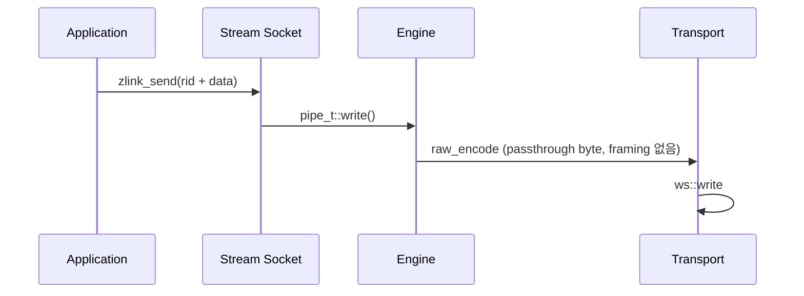

[English](https://zlink-systems.github.io/zlink/spec/core/socket/08-stream/) | 한국어

<!-- zlink-nav:start -->
[소켓 목차](README.ko.md) | [이전: ROUTER](07-router.ko.md) | [다음: 프로토콜 개요](../protocol/README.ko.md)
<!-- zlink-nav:end -->

# Socket — STREAM

> **이 장이 정의하는 것** — STREAM socket의 raw TCP 연결 노출과
> [result/errno](../03-errors.ko.md#result와-errno-대응) 공개 계약.

## 1. STREAM 개요

STREAM은 zlink framing 없이 연결하는 외부 peer와 raw byte를 주고받는
[socket](../glossary.ko.md#socket)이다. accept한 client 연결마다 4 byte routing ID —
연결 하나를 식별하는 byte 열 — 를 부여하는 bind 전용 raw socket이며,
`zlink_connect()`는 지원하지 않는다. application은 routing ID로 client를 선택해
전송하고, 수신 결과에서 source routing ID를 확인한다.

STREAM은 application payload와 상위 protocol 의미를 해석하지 않는다. TCP/WS 연결의
byte record 또는 고정 framing packet을 routing ID로 송수신하는 C API와 binding
개발자를 대상으로 이 문서는 ZLink Core의 범용 raw STREAM 공개 계약을 정의한다.

관련 계약의 소유 문서는 다음과 같다.

| 관련 계약 | 정의하는 문서 |
|---|---|
| socket 생성·close, 공통 option, 비동기 송신 admission 상세, thread safety | [소켓 공통](README.ko.md) |
| ZMP framing 없이 흐르는 byte의 wire format | [RAW (STREAM) 프로토콜 상세](../protocol/02-raw.ko.md) |
| result 값과 errno 대응 | [Errors](../03-errors.ko.md#result와-errno-대응) |

## 2. 생성, bind와 option

```c
ZLINK_EXPORT void *zlink_socket (void *context_, zlink_socket_type_t type_);
ZLINK_EXPORT zlink_bind_result_t zlink_bind (void *s_, const char *addr_);
ZLINK_EXPORT zlink_close_result_t zlink_close (void *s_);

typedef enum zlink_stream_option_t
{
    ZLINK_STREAM_OPT_NOTIFY = 0x3501  // 연결·해제 알림 record 수신 (int 0|1, bind 전 설정)
} zlink_stream_option_t;

ZLINK_EXPORT zlink_config_result_t zlink_set_stream_option (
  void *handle_, zlink_stream_option_t option_,
  const void *optval_, size_t optvallen_);
ZLINK_EXPORT zlink_config_result_t zlink_get_stream_option (
  void *handle_, zlink_stream_option_t option_,
  void *optval_, size_t *optvallen_);
```

STREAM socket은 `zlink_socket(context_, ZLINK_SOCKET_STREAM)`으로 생성한다.
`ZLINK_STREAM_OPT_NOTIFY`는 bind 전에 설정하는 `int` 0 또는 1이다. 값 1은 client
연결과 해제를 길이 0인 data record로 수신하게 하며, 그 record의 source routing ID가
대상 client를 식별한다. 기본값은 0이다.

공통 [HWM](../glossary.ko.md#hwm), timeout, linger, TLS와 buffer option은
`zlink_set_option()`과 `zlink_get_option()`을 사용한다. 각 option의 계약은
[소켓 공통](README.ko.md)이 소유한다.

## 3. 수신 모드

한 STREAM handle은 다음 세 수신 모드 가운데 하나만 사용한다.

| 수신 모드 | 활성화 방법 | 전달 형태 |
|---|---|---|
| Raw part receive | 첫 `zlink_recv_part()` 호출 (기본 경로) | 호출자가 read 단위로 도착한 raw record의 part를 직접 수신한다 |
| Raw callback | `zlink_recv_handler()` 등록 | `zlink_socket_msg_handler_fn`이 raw record를 받는다 |
| Packet callback | `zlink_stream_packet_handler()` 등록 | 고정 framing packet을 조립해 header/body로 분리된 `zlink_msg_t`를 받는다 |

첫 raw part 수신 또는 handler 등록이 수신 모드를 고정한다. 같은 handle에서 다른 수신
모드를 활성화하거나 handler를 다시 등록하면 busy 결과와 `errno == EBUSY`로 실패한다.
data-plane `ZLINK_POLLIN`은 raw part receive 모드에 속한다. send-completion
callback과 `ZLINK_POLLOUT`은 수신 모드와 독립적이다.

## 4. Routed part send

```c
ZLINK_EXPORT zlink_submit_result_t zlink_send_part_rid (
  void *s_,
  const zlink_routing_id_t *target_rid_,
  zlink_msg_t *part_,
  zlink_send_flags_t flags_,
  zlink_part_flag_t part_flag_);
```

STREAM은 한 번에 raw data part 하나를 target client로 전송한다. `target_rid_`는
STREAM이 해당 연결에 부여한 유효한 4 byte routing ID여야 하며 `part_flag_`는
`ZLINK_PART_FINAL`이어야 한다. `ZLINK_PART_MORE`는 `ZLINK_SUBMIT_NOT_SUPPORTED`,
`errno == ENOTSUP`이다.

STREAM send는 여러 part를 하나의 논리적 message로 묶는 multipart sequence를 열지
않는다. `ZLINK_PART_MORE` 실패 뒤에도 staging된 part는 없고 다음 호출은 독립된
single-part record다. 따라서 다른 raw socket의 multipart 원자적 abort 규칙은 STREAM에
적용되지 않는다.

성공하면 `part_`의 내용이 소비된다. 수신 측이 처리 속도를 따라오지 못해 제출이
제한되는 [backpressure](../glossary.ko.md#backpressure)로 `ZLINK_SUBMIT_BACKPRESSURED`,
`errno == EAGAIN`을 반환하면 내용은 호출자에게 남으므로 같은 message로 재시도할 수
있다. 그 밖의 실패에서는 내용이 소비된다. 호출 전에 재사용 가능성이 있는 payload의
복사본을 준비하면 실패 종류와 무관하게 호출자 코드의 소유권 처리를 일정하게 유지할
수 있다.

유효한 `target_rid_`에 길이 0인 part를 routed 송신하면 byte record를 보내지 않고 해당
peer 연결의 종료를 요청한다. 성공 시 이 길이 0 part도 소비된다.

연결을 찾을 수 없으면 `ZLINK_SUBMIT_NOT_CONNECTED`를 반환한다. 전체 결과 대응은
[errno map](../03-errors.ko.md#result와-errno-대응)을 따른다.

## 5. Raw part receive

```c
ZLINK_EXPORT zlink_recv_result_t zlink_recv_part (
  void *s_,
  const zlink_routing_id_t **source_rid_out_,
  zlink_msg_t *part_out_,
  zlink_part_flag_t *has_more_out_,
  zlink_recv_flags_t flags_);
```

`part_out_`은 초기화된 message여야 하며 `has_more_out_`과 함께 필수다.
`source_rid_out_`은 선택 사항이다. 성공하면 source client의 routing ID를 가리키는
Core 소유 borrowed view — Core가 소유한 memory를 잠시 빌려 읽는 참조 — 를 받는다.
이 view가 다음 raw receive 뒤에도 필요하면 그 전에 복사해야 한다.

성공하면 수신 part의 소유권이 호출자에게 이전되며 호출자는
`zlink_msg_close(part_out_)`를 정확히 한 번 호출해야 한다. part를 받기 전에 실패하면
소유권이 이전되지 않는다. `*has_more_out_`은 다음 part가 있으면 `ZLINK_PART_MORE`,
마지막 part이면 `ZLINK_PART_FINAL`이다. `ZLINK_DONTWAIT` 호출에 데이터가 없으면
`ZLINK_RECV_NO_DATA`를 반환한다.

## 6. Raw callback

```c
ZLINK_EXPORT zlink_handler_result_t zlink_recv_handler (
  void *s_, zlink_socket_msg_handler_fn handler_, void *userdata_);
```

raw callback은 STREAM에서만 지원한다. source routing ID는 callback 동안만 유효한
borrowed view다. callback으로 전달된 모든 message part의 소유권은 callback으로
이전되며 각 part를 정확히 한 번 소비하거나 닫아야 한다. callback 안에서 같은 handle에
receive handler를 다시 등록하거나 close하면 busy 결과와 `errno == EBUSY`로 실패한다.

## 7. Packet callback과 framing

```c
typedef void (*zlink_stream_packet_handler_fn) (
  void *stream_,
  const zlink_routing_id_t *source_rid_,
  zlink_msg_t *header_,
  zlink_msg_t *body_,
  void *userdata_);

ZLINK_EXPORT zlink_handler_result_t zlink_stream_packet_handler (
  void *stream_, zlink_stream_packet_handler_fn handler_, void *userdata_);
```

packet callback 모드는 raw STREAM byte pipe 위에 `header + body` framing을 올리는
application protocol을 위한 것이다 — 예를 들어 주문 처리 gateway가 작은 제어 header
뒤에 큰 payload를 싣는 경우다. 호출자마다 똑같은 length-prefix(길이 접두사) decoder와
buffering 상태 머신을 거듭 구현하는 대신, STREAM이 내부에서 frame을 파싱하고 이미
할당된 `zlink_msg_t`를 callback에 넘긴다.

### 7.1 Wire framing

packet mode는 각 client byte stream에서 다음 frame을 순서대로 조립한다.

```text
+----------------+----------------+----------------+---------------+
| header_size:u16| body_size:u32  | header bytes   | body bytes    |
+----------------+----------------+----------------+---------------+
| big endian     | big endian     | exact length   | exact length  |
+----------------+----------------+----------------+---------------+
```

- `header_size`는 2-byte big-endian unsigned 16-bit 길이다.
- `body_size`는 4-byte big-endian unsigned 32-bit 길이다.
- 두 payload 길이는 모두 `0`일 수 있다. `header_size == 0 && body_size == 0`인
  packet도 callback을 그대로 유발하며, header와 body가 비어 있어도 `NULL`이 아니라
  길이 0인 유효한 `zlink_msg_t` 두 개로 전달된다.
- size 검사는 `maxmsgsize`가 양수로 설정된 경우에만 적용된다(기본값 `-1`은 무제한).
  `header_size`, `body_size` 또는 두 값의 합이 설정된 한계를 넘으면 malformed
  framing으로 취급된다([§7.3](#73-malformed-framing) 참고).

### 7.2 Callback 규약

- `source_rid_`는 callback 실행 동안만 유효한 borrowed view다. callback 뒤에도
  보존하려면 복사해야 한다.
- `header_`와 `body_`는 wire size가 `0`이어도 항상 non-`NULL`로 전달된다. 두
  message의 소유권이 callback으로 넘어가며, callback이 `zlink_msg_close()`로 각각
  정확히 한 번 소비하거나 닫을 책임을 진다.
- 같은 `source_rid_`에서 오는 packet들은 직렬화된다. 같은 peer의 뒤 packet이 앞
  packet을 앞지를 수 없다. 서로 다른 `source_rid_`의 packet은 서로 다른 worker
  thread에서 병렬로 dispatch될 수 있다.
- callback 안에서의 self-close는 raw `zlink_recv_handler` 케이스와 같은 규칙을
  따른다. callback 안에서 수신 모드를 바꾸거나 socket을 닫으려 하면 `EBUSY`로
  실패한다.

### 7.3 Malformed framing

다음 상황은 malformed로 보고 해당 연결을 닫는다.

- 양수로 설정된 `maxmsgsize`보다 `header_size`, `body_size` 또는
  `header_size + body_size`가 큰 경우.
- length field는 도착했지만 전체 packet이 도착하기 전에 peer가 close/reset되는 경우 —
  즉 mid-length 또는 mid-payload close.

이 경우 STREAM monitor에 해당 `source_rid`의 disconnect 이벤트로 노출된다. 불완전한
packet은 절대 callback으로 전달되지 않으며, 연결과 함께 decoder state도 폐기된다.

## 8. 비동기 송신 admission과 thread safety

```c
ZLINK_EXPORT zlink_submit_result_t zlink_send_async (
  void *s_, zlink_msg_t *parts_, size_t part_count_,
  const zlink_send_async_options_t *options_,
  zlink_send_op_id_t *op_id_out_);

ZLINK_EXPORT zlink_handler_result_t zlink_send_complete_handler (
  void *s_, zlink_send_complete_handler_fn handler_, void *userdata_);

ZLINK_EXPORT zlink_submit_result_t zlink_send_async_cancel (
  void *s_, zlink_send_op_id_t op_id_);
```

STREAM은 frame 경계가 없는 raw byte를 나르므로 STREAM record는 항상 정확히 1 part다.
`part_count_`가 1이 아니면 `ZLINK_SUBMIT_NOT_SUPPORTED`다. `options_->target`은
하나의 exact peer를 지정하며 그 identity는 `zlink_select_routed_submit_target()`에서
얻는다.

완료는 Core 송신 queue로의 admission을 뜻하며 peer 전달이 아니다. 소유권 이전,
target별 FIFO 순서, socket 단위 pending 상한, operation별 timeout, 취소, close
fail-fast, callback 규칙 등 계약 전체는 [소켓 공통](README.ko.md)이 소유한다.

공개 socket handle의 thread safety와 close 계약은 [소켓 공통](README.ko.md)을
따른다. 같은 `zlink_msg_t`를 여러 thread가 동시에 사용할 수 없다.

## 9. Receive flow state

STREAM에는 paired DEALER/ROUTER completion lane이 없으므로 receive-flow 상태도 없다.
`zlink_socket_set_receive_flow_state()`는 STREAM socket에 대해 `errno == ENOTSUP`과 함께
`ZLINK_CONFIG_NOT_SUPPORTED`를 반환하고 아무것도 바꾸지 않는다. 위에서 설명한 byte HWM,
low water mark와 transport backpressure는 그대로 유지된다. STREAM socket의 monitor는
`ZLINK_MONITOR_STATUS_DETAIL_FLOW_STATE`를 설정하지 않고
`ZLINK_EVENT_SEND_FLOW_PAUSED`, `ZLINK_EVENT_SEND_FLOW_RESUMED`,
`ZLINK_EVENT_FLOW_STATE_STALE`를 발생시키지 않는다.

## 10. Peer routing ID와 연결 종료

STREAM의 public routing ID는 server가 연결별로 부여한 4 byte connection id다.
`zlink_disconnect_rid()`에 이 id를 전달하면 해당 연결에 종료 요청을 넣는다.
4 byte가 아닌 rid는 잘못된 인자로 실패한다. `zlink_disconnect_rid()` 함수 자체의
계약은 [소켓 공통](README.ko.md)이 소유하며, id를 내부에서 찾는 방법은
[§11 내부 구조](#11-내부-구조)가 설명한다.

## 11. 내부 구조

> **이 절의 계약 소유** — STREAM socket의 공개 계약은 이 문서의 §1–§10이 소유한다.
> 이 절은 그 중 WS/WSS 경로의 내부 최적화 구조, packet 조립 구현과 런타임 기본값을
> 설명한다.

### WS/WSS 경로

STREAM socket은 ZMP(zlink Message Protocol) handshake 없이 연결하는 외부
client(웹 브라우저, 게임 client 등)와 RAW 통신을 지원한다. tcp, tls, ws, wss
transport를 지원하며, 특히 WS/WSS 경로의 성능 최적화에 집중한다.

| Component | 파일 | 역할 |
|---|---|---|
| stream_t | src/runtime/sockets/stream/stream.cpp | STREAM socket 로직 |
| raw_encoder_t | src/runtime/protocol/raw_encoder.cpp | passthrough 인코딩 (framing 없음) |
| raw_decoder_t | src/runtime/protocol/raw_decoder.cpp | passthrough 디코딩 (byte span -> msg_t) |
| asio_raw_engine_t | src/runtime/engine/asio/asio_raw_engine.cpp | RAW I/O 엔진 |
| ws_transport_t | src/runtime/transports/ws/ | WebSocket transport |
| wss_transport_t | src/runtime/transports/tls/ | WebSocket + TLS transport |



WS/WSS 성능 특성은 다음과 같다.

- **Read path** — 데이터는 Beast read buffer(`message_buffer`)에서 출력 `msg_t`로
  복사된다 (delivery 시 단일 copy).
- **Write path** — `msg_t` payload를 Beast write buffer로 직접 전달한다 (중간 copy
  없음).
- **Beast write buffer** — 기본값은 64KB다. WS write는 전달받은 buffer 하나 또는
  gather된 두 buffer를 단일 binary frame(`async_write` 한 번)으로 보낸다.
- **Frame 분할** — `auto_fragment(false)`. 논리 message 하나가 하나의 WebSocket
  frame에 대응한다.

표준 벤치마크 머신의 단일 socket 대표 처리량은 다음과 같다.

| Transport | Throughput |
|---|---|
| TCP | 1493 MB/s |
| WS | 696 MB/s |
| WSS 1KB | 382 MB/s |

WS framing을 택해서 얻는 이득은 대용량 message에서 가장 크다. 64KB 이상 payload에서는
WS가 TCP 라인 레이트에 근접하고, WSS 비용은 TLS 암호화 오버헤드가 좌우한다.

설계 트레이드오프는 다음과 같다.

- Speculative write 미지원 (WebSocket frame 기반)
- Gather write는 WS/WSS에서 지원한다. `supports_gather_write()`는 `true`이고,
  `async_writev()`가 두 buffer를 하나의 `async_write`로 묶는다.
- TLS/WSS는 암호화 오버헤드 존재

### Packet 조립 구현

[§7](#7-packet-callback과-framing)의 packet callback을 구현하는 per-connection
누적기다. 들어오는 byte는 각 연결(pipe)의 packet state(`pipe_t::_stream_packet_state`)를
거친다. handler는 `pipe_->stream_packet_state()`로 이 상태에 접근한다.

```text
  wire bytes (arbitrary fragmentation)
         |
         v
  +-------------------------+
  | pipe packet state       |
  |   stage: prefix_stage   |
  |          header_stage   |
  |          body_stage     |
  +-------------------------+
         |
         v
  callback(stream, source_rid, header_msg, body_msg, userdata)
```

먼저 length field가 파싱된다. `header_size`와 `body_size`가 모두 확정되면 이후
도착하는 byte가 해당 연결의 packet state의 header/body buffer에 누적된다. packet이
완성되면 그 누적 buffer들이 새로 초기화된 `zlink_msg_t` header/body로 move —
data를 복사하지 않고 소유권만 옮기는 zero-copy 이동 — 되어 callback에 전달된다.
delivery 시점에는 추가 copy가 없다 — move가 조립된 buffer를 callback이 받을
message로 옮긴다.

application마다 따로 하는 대신 STREAM 안에서 decode하도록 둔 이유는 두 가지다.

- **복사 한 번 감소.** application이 "조립된" contiguous buffer를 한 번 만졌다가
  다시 쪼갤 필요가 없다. 누적 buffer가 header/body message로 move(zero-copy)된다.
- **순서 보장.** per-`source_rid` 직렬화를 decoder 쪽에서 강제하므로, 호출자가 raw
  byte delivery 위에 별도 reorder 로직을 올릴 필요가 없다.

### 현재 STREAM 런타임 기본값

STREAM은 transport 전반에 공통된 기본 성능 프로파일을 쓴다. STREAM 외 공통 socket
기본값은 [Socket 공통의 내부 구조](README.ko.md#7-내부-구조)를 참고한다.

아래 값들은 STREAM의 내부 기본값이다.

- handler allocator: 활성
- read drain: 활성
- speculative write: STREAM/TCP 경로에서 기본 활성. `ZLINK_ASIO_STREAM_ASYNC_WRITE`를
  활성화하면 순수 async write 경로로 전환
- RX slab buffering: 활성
- speculative write byte budget: `2097152`
- read drain max loops: `64`
- read drain max bytes: `1048576`

socket/listener 기본값은 다음과 같다.

- backlog: `65536`
- `sndhwm` / `rcvhwm`: Core memory budget을 STREAM 역할 하한·상한으로
  [water-filling](../glossary.ko.md#water-filling)한 physical queue별 applied HWM
- `sndbuf` / `rcvbuf`: 기본값 `-1`. OS 기본 buffer와 TCP 자동 조정에 맡김
- accept 동시성(STREAM 전용): 기본 `4`, 최대 `128`
- 세션 스케줄러(STREAM): 기본 `rr`

현재 유지되는 STREAM 런타임 환경변수는 다음과 같다.

- `ZLINK_ASIO_STREAM_ACCEPT_CONCURRENCY`: 기본 `4`, 최대 `128`로 제한
- `ZLINK_ASIO_STREAM_SESSION_SCHED` (`rr|minload`): 기본 `rr`
- `ZLINK_ASIO_STREAM_ENABLE_NON_TCP_SPEC_READ`: 기본 비활성
- `ZLINK_ASIO_STREAM_ASYNC_WRITE`: 기본 비활성. 활성화하면 STREAM/TCP speculative
  write를 끄고 순수 async write 경로를 사용
- `ZLINK_ASIO_STREAM_DISABLE_GATHER`: 기본 비활성이라 STREAM gather-write는 유지됨
- `ZLINK_ASIO_STREAM_GATHER_THRESHOLD`: 기본 `1024`
- `ZLINK_ASIO_STREAM_TINY_GATHER_THRESHOLD`: 기본 `0`
- `ZLINK_ASIO_STREAM_INITIAL_TARGET_CAP`: 기본 `4096`
- `ZLINK_ASIO_STREAM_BATCH_SIZE`: 기본 `4096`
- `ZLINK_ASIO_STREAM_BATCH_HEADROOM`: 기본 `64`
- `ZLINK_STREAM_PIPE_LWM_HINT`: 기본 `4`. STREAM application pipe의 LWM hint를
  `설정값 * 1024` byte로 적용

### Peer rid disconnect 구현

`zlink_disconnect_rid()`는 4 byte routing ID를 `uint32_t`로 해석해 STREAM 라우팅
맵에서 pipe를 찾고 종료 요청을 넣는다. 공개 동작은 [§10](#10-peer-routing-id와-연결-종료)이
소유한다.

## 12. 구현 및 contract test 검증 요구

공개 표면(STREAM 함수 호출, 반환 result·errno, callback 인자, monitor 이벤트)만으로
다음을 확인한다. 각 항목은 test 하나로 이어진다.

**생성, bind와 알림**
- STREAM은 bind 전용이다 — `zlink_connect()`는 지원하지 않는다.
- `ZLINK_STREAM_OPT_NOTIFY`를 bind 전에 1로 설정하면 client 연결과 해제가 길이 0인
  data record로 수신되고, 그 record의 source routing ID가 대상 client를 식별한다.

**수신 모드 고정**
- 첫 raw part 수신 또는 handler 등록이 수신 모드를 고정한다. 이후 같은 handle에서
  다른 수신 모드를 활성화하거나 handler를 다시 등록하면 busy 결과와 `errno == EBUSY`다.
- callback 안에서 같은 handle에 receive handler를 다시 등록하거나 close하면(수신 모드
  변경 포함) busy 결과와 `errno == EBUSY`다.
- data-plane `ZLINK_POLLIN`은 raw part receive 모드에 속하고, send-completion
  callback과 `ZLINK_POLLOUT`은 수신 모드와 독립적으로 동작한다.

**Routed part send**
- `part_flag_ == ZLINK_PART_MORE`는 `ZLINK_SUBMIT_NOT_SUPPORTED`,
  `errno == ENOTSUP`이며, 실패 뒤 staging된 part 없이 다음 호출은 독립된
  single-part record다.
- 유효한 target routing ID에 길이 0 part를 보내면 peer 연결 종료를 요청하고 part를
  소비한다.
- 성공하면 `part_`의 내용이 소비된다. `ZLINK_SUBMIT_BACKPRESSURED`
  (`errno == EAGAIN`)이면 내용이 호출자에게 남아 같은 message로 재시도할 수 있고,
  그 밖의 실패에서는 내용이 소비된다.
- 연결을 찾을 수 없으면 `ZLINK_SUBMIT_NOT_CONNECTED`다.

**Raw part receive**
- 성공하면 part 소유권이 호출자에게 이전되고 `zlink_msg_close`를 정확히 한 번
  호출해야 하며, part를 받기 전에 실패하면 소유권이 이전되지 않는다.
- `*has_more_out_`은 다음 part가 있으면 `ZLINK_PART_MORE`, 마지막이면
  `ZLINK_PART_FINAL`이다.
- `ZLINK_DONTWAIT` 호출에 데이터가 없으면 `ZLINK_RECV_NO_DATA`다.
- `source_rid_out_`의 borrowed view는 다음 raw receive 전까지 유효하다.

**Packet callback**
- `header_size == 0 && body_size == 0`인 packet도 callback을 유발하며, header와
  body는 길이 0이어도 non-`NULL` `zlink_msg_t` 두 개로 전달된다.
- 같은 `source_rid`의 packet은 도착 순서대로 직렬 전달되고, 뒤 packet이 앞 packet을
  앞지르지 않는다.
- size 검사는 `maxmsgsize`가 양수일 때만 적용되고(기본 `-1`은 무제한),
  `header_size`, `body_size` 또는 두 값의 합이 한계를 넘는 size 광고와
  mid-length·mid-payload close는 malformed로 연결이 닫히며 monitor에 해당
  `source_rid`의 disconnect 이벤트가 노출된다. 불완전한 packet은 callback으로 전달되지
  않는다.

**비동기 송신**
- `part_count_`가 1이 아니면 `ZLINK_SUBMIT_NOT_SUPPORTED`다.
- 송신 완료 알림은 Core 송신 queue admission 시점이며 peer 전달을 뜻하지 않는다.

**Receive flow state와 monitor**
- `zlink_socket_set_receive_flow_state()`는 `ZLINK_CONFIG_NOT_SUPPORTED`와
  `errno == ENOTSUP`으로 실패하고 아무것도 바꾸지 않는다.
- STREAM monitor는 `ZLINK_MONITOR_STATUS_DETAIL_FLOW_STATE`를 설정하지 않고
  `ZLINK_EVENT_SEND_FLOW_PAUSED`, `ZLINK_EVENT_SEND_FLOW_RESUMED`,
  `ZLINK_EVENT_FLOW_STATE_STALE`를 발생시키지 않는다.

**연결 종료**
- 4 byte rid로 `zlink_disconnect_rid()`를 호출하면 해당 연결에 종료 요청이 들어가고,
  4 byte가 아닌 rid는 잘못된 인자로 실패한다.
